# 런타임 배포 프로파일

이 문서는 애플리케이션 동작이나 배포 권한을 바꾸지 않으면서 신규 FDAI 설치의 기본 런타임을
Azure Kubernetes Service(AKS)로 정의합니다. Azure Container Apps는 기존 설치를 위한 호환
프로파일로 계속 지원합니다. 이 선택은 서명된 `fdaictl` 프로비저닝 프로파일과 모든 정확한
Terraform 플랜에 포함됩니다.

> **범위:** 이 계약은 신규 설치를 다룹니다. 기존 설치를 다른 런타임 플랫폼으로 옮기려면
> 별도의 마이그레이션 설계가 필요하며, 프로파일 업데이트만으로 자동 전환되지 않습니다.
>
> **Azure 범위:** 지원되는 두 런타임 플랫폼은 같은 Azure 공급자 어댑터, 서명된 OCI 이미지,
> Event Hubs Kafka 엔드포인트, Key Vault, 워크로드 신원, PostgreSQL 스키마를 사용합니다.

## 설계 개요

공유 Operator 발신함 구성은 두 플랫폼에서 같은 테스트 맥락 작업을 사용합니다.
facade로 import를 모아도 AKS 관측, Cost Governance 활성화, 배포 권한은 생기지 않습니다.

호스트의 읽기 전용 `verify-source-runtime`은 고정된 소스·런타임 내용만 확인하며 런타임·DB 배치,
노드 크기·비용·호스트 신원·정확한 계획 승인은 검증하지 않습니다. 이 근거는 프로파일에 연결된
계획을 대신할 수 없습니다. 지원 자료 설치에는 검증된 경로를 명시적으로 전달하며 소스 자료가
없다고 kit를 자동 선택하지 않습니다. [소스 경계](installable-deployment-cli-ko.md#명시적-소스-복구)를 참고하세요.

운영자는 런타임 플랫폼과 데이터베이스 배치를 하나씩 선택합니다. `fdaictl`은 조합을 검증하고,
용량과 비용을 추정하며, 플랫폼별 프로비저닝 그래프를 컴파일하고, 각 정확한 플랜에 대한 승인을
요청합니다. 재시도는 불확실한 효과를 검증할 수 있지만 선택을 바꾸거나 불명확한 적용을 반복할
수는 없습니다.

| 축 | 지원 값 | 기본값 | 의미 |
|----|---------|--------|------|
| 런타임 플랫폼 | `aks`, `container-apps` | `aks` | FDAI 서비스와 예약 작업을 호스팅합니다. Container Apps는 신규 계획에서 호환 용도로만 사용합니다. |
| 데이터베이스 배치 | `postgres-flex`, `postgres-aks` | `postgres-flex` | Azure Database for PostgreSQL Flexible Server 또는 AKS 내부 PostgreSQL 클러스터를 사용합니다. |

`postgres-aks`는 `runtime_platform=aks`일 때만 사용할 수 있습니다. 클러스터 내부 프로파일이
영역 손실, 백업, 특정 시점 복구, 업그레이드에 대한 독립 근거를 확보할 때까지 프로덕션에서는
`postgres-flex`를 사용합니다.

## 운영자 계약

공개 명령은 online 설치와 산출물 offline 설치에서 두 선택을 명시적으로 받습니다. 신규 설치에서
런타임을 생략하면 AKS를 선택합니다.

```bash
fdaictl provision azure --online \
  --database postgres-flex

fdaictl provision azure --online \
  --runtime container-apps \
  --database postgres-flex \
  --existing-installation

fdaictl provision azure \
  --offline-kit /media/fdai/fdai-deployment-kit.tar.gz \
  --runtime aks \
  --database postgres-aks \
  --system-nodes 3 \
  --user-nodes 4
```

명령은 변경을 일으키는 각 플랜 경계에서 대화형 승인을 유지합니다. 런타임 또는 데이터베이스
선택은 작업 권한을 부여하거나, 선택된 환경을 바꾸거나, 적용 모드를 활성화하지 않습니다.

### 기본값 및 검증

| 설정 | 검증 | 권장 값 |
|------|------|---------|
| AKS 시스템 노드 | 최소 2개입니다. 프로덕션은 최소 3개입니다. | 3 |
| AKS 사용자 노드 | 최소 3개입니다. | `postgres-flex` 사용 시 3 |
| `postgres-aks` 사용 시 AKS 사용자 노드 | 최소 4개입니다. | 비프로덕션 소형 구성에서 4 |
| 시스템 노드 SKU | 최소 4 vCPU와 4 GB 메모리이며 선택한 지역과 구독에서 사용 가능해야 합니다. | `Standard_D4as_v5` |
| 사용자 노드 SKU | 지역과 구독에서 사용 가능해야 합니다. | `Standard_D4as_v5` |
| 가용성 영역 | 요청한 각 영역을 두 SKU에서 모두 사용할 수 있어야 합니다. | 프로덕션에서 3개 영역 |

노드 수 하한은 프로파일의 구조적 지원 여부만 증명합니다. 프로덕션 플랜은 AKS 예약 용량과
노드별 DaemonSet 요청량을 반영한 워크로드 용량도 평가합니다.

$$
(N - 1) \times C_{allocatable}
\ge 1.2 \times (C_{services} + C_{jobs} + C_{database}) + C_{daemonsets}
$$

메모리에도 같은 부등식을 적용합니다. 어느 한쪽이라도 충족하지 못하면 Terraform 플랜 전에
프로파일이 차단됩니다. 오류에는 테넌트 데이터를 노출하지 않고 요청량과 할당 가능량을 표시합니다.

## 상태 소유권

두 런타임 프로파일의 연결된 배포는 정확한 Azure Marketplace Ubuntu 버전으로 Managed Host를
부팅하고 Foundation 단계에서 체크섬으로 고정된 도구 체인을 설치합니다. 전용 Managed Host
이미지를 만들거나 요구하지 않습니다. 초기 구성 산출물을 내려받을 수 없는 아티팩트 오프라인
배포는 별도로 검증된 사전 준비 호스트 이미지를 선택할 수 있습니다.

테넌트 프로비저닝은 미리 빌드된 서비스 및 의존성 이미지만 사용합니다. 완전한 release의 닫힌
의존성 이미지 집합에는 ClamAV와 pgvector가 모두 포함됩니다. 배포 프로파일 하나가 특정 이미지를
사용하지 않더라도 서명된 키트에서 해당 이미지를 생략할 수 없습니다. 프로비저닝 도구는 AKS에서
이미지를 사용할 수 있게 만들기 전에 서명, 출처, 소스 버전, 플랫폼 및 digest를 검증합니다.
Docker, Buildx, ACR Tasks, 원격 빌더 또는 VM 이미지 캡처를 실행하지 않습니다. release 생성은
업스트림 공급망의 작업이며 테넌트 실행 안에서 다시 빌드하는 방식으로 복구하지 않습니다.

Foundation의 선택 입력 `application_workload`는 AKS 프로파일을 바꾸지 않고 새 애플리케이션
그룹 이름을 운영 리소스 이름과 분리합니다. 기존 그룹의 소유권을 부여하지는 않으며, 부분 상태
복구는 [애플리케이션 그룹 충돌 계약](installable-deployment-cli-ko.md#애플리케이션-그룹-충돌-복구)을 따릅니다.
애플리케이션 단계는 정확한 Foundation 인계 리소스 그룹 이름에서 공유 Terraform 워크로드
토큰을 가져오며, 환경, 리전 또는 워크로드 문법이 다르면 계획 전에 차단합니다.
별도 입력 `operations_public_ip_tags`는 관측된 정확한 Foundation Bastion/NAT 정책 태그만
유지하며, AKS 노드 설정을 바꾸거나 수명주기 차이를 무시하는 예외를 부여하지 않습니다.

읽기 전용 용량 사전 점검은 음수가 아닌 정수 할당량과 Azure CLI가 반환하는 정규 십진 정수
문자열을 허용합니다. 불리언, 소수, 부호나 공백이 붙은 값, 크기 한도를 넘은 표현은 계속
차단합니다. 할당량이 남아 있어도 SKU 제한, 가용 영역 누락, 지원하지 않는 아키텍처 또는
호스트 암호화 미지원 조건을 무시하지 않습니다. 대상이 바뀌면 새 검토가 필요합니다.

소스 실행은 초기 설정 확인 이후, Foundation 계획 이전에 [Azure Retail Prices API](https://learn.microsoft.com/en-us/rest/api/cost-management/retail-prices/azure-retail-prices)를 별도로
조회합니다. 선택한 VM SKU와 리전별로 기본 USD 시간 단위 Linux 종량제 계량기 하나만
선택합니다. Windows, Spot, Low Priority, 예약, 다른 서비스, 미래 적용일, 구간별 가격은
대신 사용할 수 없습니다. 최대 네 페이지가 하나의 제한 시간을 공유하고 응답 크기도 제한하며,
리다이렉트나 조회 실패 시 자동 재시도하지 않습니다. 컴퓨트 부분 추정치는 시스템 노드와 사용자
자동 확장 최대 노드를 월 730시간 사용하는 경우를 계산합니다. 이 부분만으로 월 한도를 넘으면
계획을 차단합니다. 그렇지 않아도 결과는 `partial`이며 Foundation, 컨트롤 플레인, 디스크,
DB, 네트워크, 레지스트리, 저장소, 모니터링, 메시지, 모델, 세금, 추가 노드 및 구축 비용은
명시적으로 제외합니다. 전체 설치 견적, 구축 비용 검증, 실제 청구 상한이나 실행 승인이 아닙니다.

런타임 선택은 같은 상태에서 한 리소스 유형을 다른 유형으로 교체하지 않습니다. 각 소유자는
별도의 backend key를 사용하므로 신규 설치는 선택한 플랫폼만 만들고, 기존 설치는 변수 하나를
바꾸는 방식으로 플랫폼을 전환할 수 없습니다.

| 소유자 | Backend key 패턴 |
|--------|------------------|
| 공유 Azure 플랫폼 및 Container Apps 기본값 | `fdai-<environment>.tfstate` |
| AKS 기반 | `fdai-<environment>-aks-cluster.tfstate` |
| AKS 워크로드 및 예약 작업 | `fdai-<environment>-aks-workloads.tfstate` |
| 클러스터 내부 PostgreSQL | `fdai-<environment>-aks-database.tfstate` |

공유 플랫폼은 Event Hubs, Key Vault, Azure Container Registry, 모니터링, 워크로드 신원,
case-history 저장소 및 `postgres-flex`를 계속 소유합니다. Case-history 콘텐츠의 활성, 삭제 예정,
이전 버전 및 변경 피드 기간 기본값은 30일이며 운영 이력과 의사 결정 근거 메타데이터는 별도 일정을
유지합니다. AKS 기반 상태는 클러스터, 노드 풀, 클러스터 신원, 네트워크 연결 및 클러스터 범위
Azure 역할 할당만 소유합니다.
AKS는 공유 루트의 Key Vault 출력을 사용합니다. 이름이 너무 긴 후보는 별도의 런타임 명명 규칙을
만들지 않고 결정론적 `kv-aip-<8hex>` 대체 이름을 사용합니다.
AKS를 선택하면 상세 비공개 네트워킹이 꺼져 있어도 애플리케이션 VNet, 노드 서브넷 및 API 서버
서브넷을 만듭니다. 별도의 비공개 네트워킹 입력은 AKS 서브넷 선행 조건이 아니라 서비스 비공개
엔드포인트, 허브 피어링 및 비공개 DNS를 제어합니다.
기본적으로 비활성화되는 개발 환경 알림 과다 수신 파일럿은 어느 런타임을 선택하더라도 공유
플랫폼 선행 조건으로 유지됩니다. 정확한 대상에는 전용 Action Group 하나와 메트릭 경보 하나만
포함됩니다. 런타임 선택은 파일럿 승인, 알림 발송 권한 또는 승격을 부여하지 않습니다.
독립적인 Azure 컨트롤 플레인 확인에서 클러스터가 `Succeeded` 상태이고 API Server VNet
Integration이 활성화되어 있으며 검토한 관리 경로로 접근할 수 있음을 증명한 뒤 Kubernetes
리소스를 적용합니다. 기본 배포는 외부 조정기가 기본 구성을 완료할 수 있도록 인증된 공개 API
접근을 처음에 유지합니다. 워크로드 상태는 승인된 클러스터의 OIDC 발급자를 읽고 배포 호스트의
소유자 전용 kubeconfig를 사용합니다.
이 공개 기본 구성에 대한 Terraform 스캐너 예외들은 해당 리소스에만 적용하며, 명시적 CIDR 허용
목록, Microsoft Entra RBAC, 비활성화된 로컬 계정 및 VNet Integration 통제를 함께 명시합니다.
다른 AKS 발견 사항을 숨기거나 이후 비공개 전환을 인증하지 않습니다.
DB 및 애플리케이션 준비는 모두 소유자 전용 kubeconfig를 [`kubelogin` 관리 ID 인증](https://learn.microsoft.com/en-us/azure/aks/kubelogin-authentication)으로 변환하며
`--login msi`와 정확한 관리 호스트 client ID를 지정합니다. 자격 증명 조회는 구독을 고정하고
관리자 자격 증명을 요청하지 않습니다. 로컬 `kubectl config view --minify` 재조회는 exec만
사용하는 사용자 하나, `kubelogin get-token`, 일치하는 client 하나와 MSI 로그인 옵션 하나를
확인하며 환경 변수 재정의를 허용하지 않습니다. 변환 실패나 재조회 불일치 시 Kubernetes
작업 전에 중단합니다. 브라우저/디바이스 코드 로그인이나 기본/노드 신원으로 대체하지 않습니다.
공용 계획 검토기는 기존 `substrate`, `runtime`, `database`, `application` 단계에 같은
정확한 digest·만료·파괴적 변경 확인 조건을 적용합니다. AKS 단계를 허용한다고 승인하거나
선행 단계를 생략할 권한을 부여하지는 않습니다.

## 런타임 렌더링

FDAI 서비스는 다음 필드를 포함하는 하나의 런타임 중립 워크로드 명세를 유지합니다.

- **이미지 및 실행:** digest로 고정된 이미지, 명령, 인자, 환경 변수 이름을 포함합니다.
- **리소스:** 요청량과 제한량을 포함합니다.
- **상태 확인:** 시작, 활성, 준비 프로브를 포함합니다.
- **접근:** 수신 의도와 서비스 포트를 포함합니다.
- **런타임 계약:** sidecar, secret 참조, 워크로드 신원, 확장 범위를 포함합니다.

Container Apps 렌더러는 명세를 Container Apps와 Container Apps Jobs로 변환합니다. AKS 렌더러는
명세를 typed Kubernetes `Deployment`, `Service`, `ServiceAccount`, `HorizontalPodAutoscaler`,
`PodDisruptionBudget`, `NetworkPolicy`, `CronJob` 리소스로 변환합니다. 첫 AKS 구현은 장기 실행
서비스마다 두 개의 replica를 유지하며 Knative 또는 KEDA를 요구하지 않습니다.

두 렌더러 모두 `FDAI_OPERATING_MODEL_TOPIC`을 통해 Core를 `fdai.operating-model` 논리 토픽에
연결합니다. 이 토픽은 기존 의미 physical Event Hub와 Managed Identity 전송을 공유하며 별도
Event Hub 엔터티나 권한 채널이 아닙니다. AKS standalone 렌더러는 정확한 substrate 출력에서
값을 가져오고 독립 및 legacy Container Apps 렌더러는 같은 typed 배포 입력을 받습니다.

Operator의 배정 알림과 사람 승인(HIL) 전송에 필요한 가져오기는 같은 Operator Service
패키지와 런타임 안의 기존 `iam_composition` 모듈에 모읍니다. 원래 어댑터와 팩터리 객체를
래퍼 없이 다시 내보낼 뿐이며 어느 렌더러에서도 토폴로지, 워크로드 신원, 준비 상태 동작,
정확한 배포 플랜의 승인 요건은 바뀌지 않습니다.

장기 실행 서비스 컨테이너는 `image_pull_policy=Always`, 읽기 전용 루트 파일시스템, 크기가
`1Gi`로 제한된 전용 `/tmp` 임시 볼륨을 사용합니다. 워크로드 검증은 플랜 생성 전에 변경 가능한
태그와 형식이 잘못된 이미지 digest를 거부합니다. 다른 경로에 쓰기가 필요하면 명시적인 워크로드
계약을 추가해야 합니다. 호환성을 이유로 전체 루트 파일시스템에 쓰기를 허용하지 않습니다.

5개 서비스 AKS 기본 구성은 embedding 배포를 요구하지 않는 lexical 문서 검색을 활성화합니다.
Document API와 Worker는 서로 다른 워크로드 신원, 역할 범위 데이터베이스 DSN, 공유 ADLS 계정 및
`fdai.pipeline.stages` 엔터티를 사용합니다. Worker Pod는 기존 digest 고정 ClamAV 이미지를
replica-local TCP sidecar로 포함합니다. 루트는 읽기 전용으로 유지하고 선언된 데이터베이스, 실행 및
임시 경로에만 크기가 제한된 `emptyDir` 볼륨을 제공합니다.

예약 작업은 `concurrencyPolicy=Forbid`, 완료 수 1, 병렬 작업자 1, 제한된 active deadline, 재시도
한도, 제한된 이력을 사용합니다. 수동 작업은 별도로 승인된 요청으로만 만들며 영구 desired-state
리소스로 두지 않습니다.
AKS 기본 구성은 analyzer, canary, inventory, observation campaign, operational-history lifecycle
CronJob을 렌더링합니다. 이력 작업은 읽기 전용 inventory 신원, 서비스 소유 상태 DSN, 비공개
archive URL을 고정 `shadow` 모드로 사용합니다. Non-shadow lifecycle은 별도의 보호된 전환과
정확히 저장된 인증 증적을 요구하며 런타임 선택은 어느 권한도 부여하지 않습니다.

인벤토리 명령은 두 플랫폼과 로컬에서 읽기 전용 실패 경계를 유지합니다. Activity Log 복구 실패는
변경분 커서를 진행하거나 전체 조정을 중단하지 않고 사용 불가로 보고합니다. 수동적인 모델 서비스
응답 근거는 모델 자격 증명이나 추론 없이 인벤토리 신원과 Azure Monitor를 재사용합니다. 제한된
실패는 해당 출처의 범위만 낮추고 잘못된 응답은 정제합니다. 재조정 범위가 조회 구간, 최신성, 데이터
지점 및 제한 시간을 결정하며, 추가 방식 메타데이터는 업데이트 순서와 관계없이 기본 인벤토리를
계속 사용할 수 있게 합니다.

관리 호스트는 선택한 Deployment 이름, 이미지 참조, 복제본 수 범위를 기록합니다. 상태 재조회는
해당 목록 전체, 현재 관측 세대, 준비된 복제본, 같은 소스 버전에서 실행 중인 Pod 이미지 digest를
요구합니다. 비어 있거나 중복되거나 오래되거나 형식이 잘못됐거나 일부만 정상인 응답은 성공이
아니라 사용 불가로 처리합니다. 기대 목록에는 다섯 기본 서비스가 모두 있어야 하며, 생성기가
하나를 누락했다고 해서 부분 롤아웃을 완료된 것으로 판단해서는 안 됩니다.
이 재조회만으로 Kafka 왕복, 예약 작업 성공, Console 인증 또는
전체 배포 준비가 검증되지는 않습니다. 워크로드 생성기는 Operator, 격리된 Executor, 문서 API,
문서 Worker에 각각 `fdai_operator`, `fdai_executor`, `fdai_ingestion_api`,
`fdai_ingestion_worker` 역할을 `FDAI_DATABASE_ROLE`과 일치하는 `PGOPTIONS`로 설정합니다.
호출자의 환경은 변경하지 않습니다. 생성되는 모든 서비스는 배포된 실행 위치를 명시적으로
선택합니다. 역할 선택은 데이터베이스 역할의 구성원 자격이나 서비스별 DSN을 제공하지 않으며,
Executor 실행 권한 전환을 활성화하지 않습니다.

## 신원 및 secret

각 FDAI 워크로드는 현재 user-assigned Managed Identity를 유지합니다. AKS에서는 namespace에 속한
Kubernetes ServiceAccount가 federated identity credential을 받습니다. 권한이 높은 Executor 신원은
Console, Operator Service, 작업 또는 다른 워크로드와 공유하지 않습니다.

다섯 기본 서비스는 `AZURE_FEDERATED_TOKEN_FILE`이 선언되면 Azure Identity SDK의 워크로드
자격 증명을 선택합니다. 투영된 토큰 경로는 절대 경로여야 하고 tenant와 client 식별자는
유효해야 하며, 연합 client는 서비스에 명시적으로 선택한 신원과 일치해야 합니다. 연합 설정이
불완전하거나 충돌하면 시작 또는 토큰 획득을 차단합니다. 노드 신원, Azure CLI 또는 다른
서비스로 대체하지 않습니다. 연합 선언이 없으면 기존에 연결된 Managed Identity 경로를 유지합니다.

Operator는 의미 처리 및 실시간 Kafka 어댑터에 `FDAI_COMMAND_MI_CLIENT_ID`를 명시적으로
선택할 수 있으며 `AZURE_CLIENT_ID`는 기본 워크로드 신원으로 유지합니다. 각 신원에는 동일한
ServiceAccount 주체를 위한 별도의 연합 자격 증명과 범위가 제한된 역할이 필요합니다. 기본
client 또는 선언된 명령 client만 선택할 수 있습니다. 선택을 생략하면 기본 client를 유지하고,
잘못되거나 관련 없는 client는 토큰 교환 전에 거부합니다. 역할을 부여하거나 교환 실패 뒤에
다른 신원으로 대체하지 않습니다.

Core와 격리된 Executor는 대상별 캐시와 동시 요청 통합을 유지하고, 각 연합 토큰 교환 시간을
제한하며, SDK 세션을 닫고 민감한 진단을 제외한 획득 실패를 보고합니다. 각 서비스는 자체 배포
패키지에 `azure-core`, `azure-identity`, SDK의 `aiohttp` 전송 의존성을 선언합니다. 의존성 검사는
직접 가져오는 SDK와 SDK 내부에서 사용하는 전송 의존성을 구분합니다. Operator와 문서 서비스는 기존 어댑터에 SDK의
공통 비동기 자격 증명 계약을 전달합니다. 이 로컬 통합 검사만으로 배포된 연합 인증, Event Hubs
접근 또는 서비스 준비 상태가 입증되지는 않습니다.

Container Apps 프로필에서 보호된 플랫폼과 Core 사이의 인계는 관측 컨텍스트와 함께 정확한
인벤토리 읽기 신원의 리소스 ID 및 client ID를 전달합니다. 서비스 구체화 도구는 이 읽기 전용
신원을 한 번만 연결하고, 관측을 비활성화하면 해당 신원만 제거하며, 일치하지 않는 결속을
거부합니다. 서명된 규모 확장 근거는 FinOps 실행 자격 증명 계보를 기록하고, VM 시작 근거는
Resilience 실행 자격 증명 계보를 기록합니다. 어떤 신원 선택도 실행 권한을 부여하지 않으며
로컬 interactive는 이 결속을 받지 않습니다.

AKS managed Key Vault CSI 공급자는 각 워크로드의 federated identity를 사용해 고정된 Key Vault
참조를 namespace의 Kubernetes Secrets로 동기화합니다. 애플리케이션은 계속 환경 변수를 읽으며
Key Vault를 직접 호출하지 않습니다. Terraform 플랜에는 secret 값이 아니라 secret 이름과 버전 없는
참조가 포함됩니다.

managed CSI 공급자는 클러스터와 함께 활성화되며 FDAI 워크로드 롤아웃과 분리됩니다. 배포 키트에는
Kubernetes 공급자와 서명된 `kubectl`, `kubelogin` 바이너리가 포함됩니다. 배포는 키트 검증 이후
공용 출처에서 공급자, 도구, 워크로드 이미지를 다운로드하지 않습니다.

### 클러스터 보안 기준

공유 플랫폼은 AKS 워크로드 및 API 서버 전용 서브넷을 제공합니다. 기본 배포는 클러스터 생성 때
API Server VNet Integration을 활성화하고, 나중에 클러스터를 교체하지 않고 비공개 클러스터
모드를 활성화할 수 있도록 최소 `/28`의 위임된 API 서버 서브넷을 예약합니다. 클러스터 상태는
명시적인 Standard NAT Gateway, 고정 Standard 송신 공용 IP와 두 연결을 소유하고 AKS를 만들기
전에 연결을 완료합니다. 송신 유형은 AKS 관리형 VNet 전용 `managedNATGateway`가 아니라
`userAssignedNATGateway`입니다.

기본 프로파일은 인증된 공개 API 접근을 유지하고 검토된 접근 제한을 적용합니다. API 서버와 노드
사이 트래픽은 통합된 비공개 경로를 사용합니다. 이는 연결된 기본 구성일 뿐 비공개 클러스터,
네트워크 격리, 영역 중복 NAT 또는 방화벽/UDR 호환성을 의미하지 않습니다. 구독 정책이 첫 효과부터
비공개 접근을 요구하면 공개 기본 구성을 차단하고, 정책을 약화하는 대신 적합한 내부 실행 호스트와
정확한 비공개 계획을 선택합니다.

클러스터는 Azure Policy, patch 채널 Kubernetes 업그레이드, NodeImage OS 업그레이드를 활성화합니다.
두 노드 풀 모두 호스트 암호화를 활성화하고 노드당 Pod 50개를 허용합니다. 배포 전에 선택한
구독과 SKU가 호스트 암호화를 지원하는지 확인해야 합니다. 읽기 전용 사전 검증은 지역
카탈로그를 한 번 조회하고 정확한 이름의 Azure CLI projection을 사용하여 서로 다른 선택 SKU만
직렬화한 다음 지역 제한, 필요한 세 개 영역, 아키텍처, 호스트 암호화, 제품군별 quota 및 전체
quota를 확인합니다. 다른 노드 풀 SKU를 위해 두 번째 카탈로그 요청을 보내거나 실패한
프로바이더 읽기를 재시도하지 않습니다. 지원하지 않는 대상에서 암호화를 비활성화하지 않습니다.
할당 가능한 워크로드 범위 검증은 구현 원장에 미완료 항목으로 남아 있습니다.

로컬 디스크가 없는 기본 SKU는 임시 저장소 대신 플랫폼에서 암호화하는 Managed OS 디스크를
유지합니다. Checkov 예외는 해당 리소스에만 둡니다. 고정된 검사기 버전은 AzureRM의 이전 업그레이드
및 암호화 속성명을 읽고, 검증된 이미지 맵 항목을 해석하지 못합니다. 해당 보안 설정은 범위를
좁힌 구성 및 플랜 테스트로 검증합니다. 전역 예외 기준이나 검사기 버전 하향은 사용하지 않습니다.

### 상세 비공개 네트워크 프로비저닝

인증된 Console과 모든 기본 서비스가 정상 상태가 되면 `/provisioning`에서 네트워크 강화 요청을
만들 수 있습니다. 요청은 기존 VNet 또는 허브 피어링, 경로 및 방화벽 연결, 비공개 DNS 영역과
링크, 비공개 엔드포인트, AKS 비공개 클러스터 모드, 레지스트리 캐시 또는 Private Link 변경,
공개 접근 제거를 선택할 수 있습니다. Console은 정제된 의도, 계획 메타데이터, 승인 상태 및 효과
근거만 저장합니다. Terraform과 Azure 변경은 보호된 배포 실행기가 담당합니다.

정확한 계획은 접근 경로를 잃지 않도록 다음 순서로 변경합니다.

1. 선택한 모든 주소 범위를 검증하고 피어, 서비스, Pod, Kubernetes 서비스 범위가 겹치지 않음을
  증명합니다.
2. 피어링, 경로, DNS를 구성한 뒤 실행 호스트에서 AKS API와 선택한 모든 서비스 엔드포인트를
  확인하고 연결할 수 있는지 검증합니다.
3. 비공개 엔드포인트와 레지스트리 경로를 만들고 워크로드 및 배포 신원을 검증한 뒤 새 경로를
  통해 기본 상태 검사를 실행합니다.
4. 비공개 관측이 통과한 뒤에만 AKS 비공개 클러스터 또는 네트워크 격리 설정을 활성화하고 공개
  경로를 비활성화합니다.
5. rollback과 독립적으로 관측한 최종 증적을 보존합니다. 효과가 불명확하면 검증만 수행하며 같은
  적용을 다시 실행하지 않습니다.

운영자의 현재 VM은 정확한 대상, 신원, 경로, DNS, TLS 및 백엔드 검사를 통과하면 실행 호스트로
사용할 수 있습니다. 해당 VM의 VNet 피어링은 계획된 네트워크 효과이며 그 자체가 접근 근거는
아닙니다.

## PostgreSQL 프로파일

`postgres-flex`는 두 런타임 플랫폼의 기본값입니다. 프로덕션은 프로덕션 강화 계약에 따라 비공개
네트워크, 영역 중복 고가용성, 35일 백업 보존, 지역 중복 백업을 사용합니다.

`postgres-aks`는 초기 비프로덕션 소형 프로파일입니다. digest로 고정된 PostgreSQL 16 pgvector
이미지, 하나의 typed `StatefulSet`, managed Premium SSD 볼륨, 마이그레이션 호스트가 사용하는
비공개 내부 load balancer를 사용합니다. 생성된 DSN은 Key Vault에 저장되고 워크로드는 managed
CSI를 통해 읽습니다. 클라이언트 트래픽에는 상태가 소유하는 인증서를 사용한 TLS가 필요합니다.
사용자 노드 최소 4개는 이 프로파일의 스케줄 가능성을 위한 값이며,
데이터베이스 고가용성, 백업 또는 특정 시점 복구를 의미하지 않습니다.

Key Vault DSN에는 별도의 고정 만료일을 두지 않습니다. 자격 증명을 교체하려면 데이터베이스와
워크로드를 함께 갱신해야 합니다. 비밀 값만 만료시키면 데이터베이스 자격 증명은 바뀌지 않은 채
접근이 중단됩니다. 이 리소스 단위 예외가 자동 교체 검증 근거를 의미하지는 않습니다.

클러스터 내부 프로덕션 프로파일은 데이터베이스 instance 3개, 동기 복제, 영역 및 호스트
anti-affinity, disruption budget, 백업 불변성, 특정 시점 복구, 노드 업그레이드, 영역 손실,
독립적인 효과 검증을 증명할 때까지 사용할 수 없습니다. 측정된 용량이 공유 풀 사용 가능성을
증명하지 않는 한 전용 taint 데이터베이스 노드 풀을 사용하는 것이 좋습니다.

## 프로비저닝 그래프

선택된 프로파일은 유한한 의존성 그래프로 컴파일됩니다.



변경을 일으키는 각 노드는 자체 정확한 플랜, 현재 사람 승인, 효과 전 claim, timeout, rollback 또는
복구 참조, 권위 있는 observer를 가집니다. `deployment_ready=true`가 되려면 선택된 모든 서비스가
정상이어야 하고, 워크로드 신원이 유효해야 하며, Kafka 왕복이 완료되어야 합니다. 또한 데이터베이스
마이그레이션이 최신이고 canary 작업 하나가 성공해야 하며 선택된 모든 상태 root의 두 번째 플랜에서
변경이 없어야 합니다.

## 서명된 키트 요구 사항

완전한 서명 키트에는 두 프로파일 중 어느 것을 선택해도 필요한 미리 빌드된 입력이 모두 포함됩니다.

- **Terraform:** 모든 Terraform root와 lock 파일을 포함합니다.
- **공급자:** AzureRM, Kubernetes, Random, TLS 공급자 mirror를 포함합니다.
- **도구:** Terraform, OPA, `kubectl`, `kubelogin`, 범위가 제한된 배포 helper를 포함합니다.
- **이미지:** 테넌트 프로비저닝에서 다시 빌드하지 않는 서명되고 digest로 고정된 FDAI 및 의존성 OCI archive를 포함합니다.
- **클러스터 통합:** managed AKS CSI 통합과 federated identity 입력을 포함합니다.
- **지원 자료:** 마이그레이션 지원, Console 자산, 매니페스트, 서명, provenance, software bill of materials를 포함합니다.

online 모드와 산출물 offline 모드는 검증된 동일 byte를 실행합니다. managed 호스트는 ambient Terraform
공급자, Helm repository, 변경 가능한 이미지 tag 또는 운영자 kubeconfig를 사용하지 않습니다.

## 완료 근거

구현 완료를 판단하려면 focused local check와 두 운영 경로에서 검토 가능한 근거가 필요합니다.

1. 기존 Container Apps 설치 테스트가 변경 없이 통과합니다.
2. AKS와 `postgres-flex` 조합이 하나의 서명된 online 키트에서 준비 상태에 도달합니다.
3. AKS와 `postgres-aks` 조합이 하나의 서명된 online 키트에서 비프로덕션 준비 상태에 도달합니다.
4. 같은 두 AKS 프로파일이 산출물 offline 키트 검증과 배포를 통과합니다.
5. 선택된 모든 root의 두 번째 플랜에서 변경이 없습니다.
6. 같은 프로파일 재사용은 안전하게 재시도되며 다른 리소스를 만들지 않습니다.
7. 런타임 또는 데이터베이스 배치를 바꾸면 마이그레이션 필요 결과와 함께 중지됩니다.
8. 서비스 롤아웃 실패 시 이전 정상 워크로드를 복구하고 배포 실패를 계속 보고합니다.
9. 선택된 각 데이터베이스 배치에서 백업 및 특정 시점 복구가 성공합니다.
10. 별도로 승인된 Console 발신 네트워크 계획이 클러스터를 교체하거나 마지막으로 검증된 관리
  경로를 잃거나 브라우저가 Azure를 직접 변경하지 않고 비공개 접근을 활성화합니다.

source와 공급자 테스트는 구현을 증명합니다. AKS 경로를 검증 완료로 분류하거나 프로덕션 준비 상태로
안내하려면 실제 운영 증적이 필요합니다.

## 관련 문서

| 알아볼 내용 | 문서 |
|-------------|------|
| 구현 진행 상태 | [런타임 배포 프로파일 구현](../../roadmap-implementation/deployment/runtime-deployment-profiles.md) |
| Standalone 명령 동작 | [설치 가능한 배포 CLI](installable-deployment-cli-ko.md) |
| 구체적인 Azure 인벤토리 | [배포 및 온보딩](deploy-and-onboard-ko.md) |
| 프로덕션 게이트 | [프로덕션 배포 강화](production-deployment-hardening-ko.md) |
| 런타임 이식성 | [CSP 중립 계약](../architecture/csp-neutrality-ko.md) |
