# 런타임 배포 프로파일

이 문서는 신규 FDAI 설치에서 애플리케이션 동작이나 배포 권한을 바꾸지 않고 Azure
Container Apps 또는 Azure Kubernetes Service(AKS)를 선택하는 방법을 정의합니다. 이 선택은
서명된 `fdaictl` 프로비저닝 프로파일과 모든 정확한 Terraform 플랜에 포함됩니다.

> **범위:** 이 계약은 신규 설치를 다룹니다. 기존 설치를 다른 런타임 플랫폼으로 옮기려면
> 별도의 마이그레이션 설계가 필요하며, 프로파일 업데이트만으로 자동 전환되지 않습니다.
>
> **Azure 범위:** 지원되는 두 런타임 플랫폼은 같은 Azure 공급자 어댑터, 서명된 OCI 이미지,
> Event Hubs Kafka 엔드포인트, Key Vault, 워크로드 신원, PostgreSQL 스키마를 사용합니다.

## 설계 개요

운영자는 런타임 플랫폼과 데이터베이스 배치를 하나씩 선택합니다. `fdaictl`은 조합을 검증하고,
용량과 비용을 추정하며, 플랫폼별 프로비저닝 그래프를 컴파일하고, 각 정확한 플랜에 대한 승인을
요청합니다. 재시도는 불확실한 효과를 검증할 수 있지만 선택을 바꾸거나 불명확한 적용을 반복할
수는 없습니다.

| 축 | 지원 값 | 기본값 | 의미 |
|----|---------|--------|------|
| 런타임 플랫폼 | `container-apps`, `aks` | `container-apps` | FDAI 서비스와 예약 작업을 호스팅합니다. |
| 데이터베이스 배치 | `postgres-flex`, `postgres-aks` | `postgres-flex` | Azure Database for PostgreSQL Flexible Server 또는 AKS 내부 PostgreSQL 클러스터를 사용합니다. |

`postgres-aks`는 `runtime_platform=aks`일 때만 사용할 수 있습니다. 클러스터 내부 프로파일이
영역 손실, 백업, 특정 시점 복구, 업그레이드에 대한 독립 근거를 확보할 때까지 프로덕션에서는
`postgres-flex`를 사용합니다.

## 운영자 계약

공개 명령은 online 설치와 산출물 offline 설치에서 두 선택을 명시적으로 받습니다.

```bash
fdaictl provision azure --online \
  --runtime container-apps \
  --database postgres-flex

fdaictl provision azure --online \
  --runtime aks \
  --database postgres-flex \
  --system-nodes 3 \
  --user-nodes 3

fdaictl provision azure \
  --offline-kit /media/fdai/fdai-deployment-kit.tar.gz \
  --runtime aks \
  --database postgres-aks \
  --system-nodes 3 \
  --user-nodes 4
```

명령은 변경을 일으키는 각 플랜 경계에서 대화형 승인을 유지합니다. 런타임 또는 데이터베이스
선택은 작업 권한을 부여하거나, 선택된 환경을 바꾸거나, 적용 모드를 활성화하지 않습니다.

### 기본값 및 검증

| 설정 | 검증 | 권장 값 |
|------|------|---------|
| AKS 시스템 노드 | 최소 2개입니다. 프로덕션은 최소 3개입니다. | 3 |
| AKS 사용자 노드 | 최소 3개입니다. | `postgres-flex` 사용 시 3 |
| `postgres-aks` 사용 시 AKS 사용자 노드 | 최소 4개입니다. | 비프로덕션 소형 구성에서 4 |
| 시스템 노드 SKU | 지역과 구독에서 사용 가능해야 합니다. | `Standard_D2as_v5` |
| 사용자 노드 SKU | 지역과 구독에서 사용 가능해야 합니다. | `Standard_D4as_v5` |
| 가용성 영역 | 요청한 각 영역을 두 SKU에서 모두 사용할 수 있어야 합니다. | 프로덕션에서 3개 영역 |

노드 수 하한은 프로파일의 구조적 지원 여부만 증명합니다. 프로덕션 플랜은 AKS 예약 용량과
노드별 DaemonSet 요청량을 반영한 워크로드 용량도 평가합니다.

$$
(N - 1) \times C_{allocatable}
\ge 1.2 \times (C_{services} + C_{jobs} + C_{database}) + C_{daemonsets}
$$

메모리에도 같은 부등식을 적용합니다. 어느 한쪽이라도 충족하지 못하면 Terraform 플랜 전에
프로파일이 차단됩니다. 오류에는 테넌트 데이터를 노출하지 않고 요청량과 할당 가능량을 표시합니다.

## 상태 소유권

런타임 선택은 같은 상태에서 한 리소스 유형을 다른 유형으로 교체하지 않습니다. 각 소유자는
별도의 backend key를 사용하므로 신규 설치는 선택한 플랫폼만 만들고, 기존 설치는 변수 하나를
바꾸는 방식으로 플랫폼을 전환할 수 없습니다.

| 소유자 | Backend key 패턴 |
|--------|------------------|
| 공유 Azure 플랫폼 및 Container Apps 기본값 | `fdai-<environment>.tfstate` |
| AKS 기반 | `fdai-<environment>-aks-cluster.tfstate` |
| AKS 워크로드 및 예약 작업 | `fdai-<environment>-aks-workloads.tfstate` |
| 클러스터 내부 PostgreSQL | `fdai-<environment>-aks-database.tfstate` |

공유 플랫폼은 Event Hubs, Key Vault, Azure Container Registry, 모니터링, 워크로드 신원,
`postgres-flex`를 계속 소유합니다. AKS 기반 상태는 클러스터, 노드 풀, 클러스터 신원, 네트워크
연결, 클러스터 범위 Azure 역할 할당만 소유합니다. 독립적인 Azure 컨트롤 플레인 확인에서 비공개
클러스터가 `Succeeded` 상태에 도달한 것을 증명한 뒤 Kubernetes 리소스를 적용합니다. 워크로드
상태는 승인된 클러스터의 OIDC 발급자를 읽고 managed 배포 호스트의 비공개 kubeconfig를 사용합니다.

## 런타임 렌더링

FDAI 서비스는 다음 필드를 포함하는 하나의 런타임 중립 워크로드 명세를 유지합니다.

- **이미지 및 실행:** digest로 고정된 이미지, 명령, 인자, 환경 변수 이름을 포함합니다.
- **리소스:** 요청량과 제한량을 포함합니다.
- **상태 확인:** 시작, 활성, 준비 프로브를 포함합니다.
- **접근:** 수신 의도와 서비스 포트를 포함합니다.
- **런타임 계약:** sidecar, secret 참조, 워크로드 신원, 확장 범위를 포함합니다.

Container Apps 렌더러는 명세를 Container Apps와 Container Apps Jobs로 변환합니다. AKS 렌더러는
명세를 typed Kubernetes `Deployment`, `Service`, `ServiceAccount`, `HorizontalPodAutoscaler`,
`PodDisruptionBudget`, `NetworkPolicy`, `CronJob` 리소스로 변환합니다. 첫 AKS 구현은 장기 실행
서비스마다 두 개의 replica를 유지하며 Knative 또는 KEDA를 요구하지 않습니다.

장기 실행 서비스 컨테이너는 `image_pull_policy=Always`, 읽기 전용 루트 파일시스템, 크기가
`1Gi`로 제한된 전용 `/tmp` 임시 볼륨을 사용합니다. 워크로드 검증은 플랜 생성 전에 변경 가능한
태그와 형식이 잘못된 이미지 digest를 거부합니다. 다른 경로에 쓰기가 필요하면 명시적인 워크로드
계약을 추가해야 합니다. 호환성을 이유로 전체 루트 파일시스템에 쓰기를 허용하지 않습니다.

예약 작업은 `concurrencyPolicy=Forbid`, 완료 수 1, 병렬 작업자 1, 제한된 active deadline, 재시도
한도, 제한된 이력을 사용합니다. 수동 작업은 별도로 승인된 요청으로만 만들며 영구 desired-state
리소스로 두지 않습니다.

## 신원 및 secret

각 FDAI 워크로드는 현재 user-assigned Managed Identity를 유지합니다. AKS에서는 namespace에 속한
Kubernetes ServiceAccount가 federated identity credential을 받습니다. 권한이 높은 Executor 신원은
Console, Operator Service, 작업 또는 다른 워크로드와 공유하지 않습니다.

AKS managed Key Vault CSI 공급자는 각 워크로드의 federated identity를 사용해 고정된 Key Vault
참조를 namespace의 Kubernetes Secrets로 동기화합니다. 애플리케이션은 계속 환경 변수를 읽으며
Key Vault를 직접 호출하지 않습니다. Terraform 플랜에는 secret 값이 아니라 secret 이름과 버전 없는
참조가 포함됩니다.

managed CSI 공급자는 클러스터와 함께 활성화되며 FDAI 워크로드 롤아웃과 분리됩니다. 배포 키트에는
Kubernetes 공급자와 서명된 `kubectl`, `kubelogin` 바이너리가 포함됩니다. 배포는 키트 검증 이후
공용 출처에서 공급자, 도구, 워크로드 이미지를 다운로드하지 않습니다.

### 클러스터 보안 기준

클러스터는 Azure Policy, patch 채널 Kubernetes 업그레이드, NodeImage OS 업그레이드를 활성화합니다.
두 노드 풀 모두 호스트 암호화를 활성화하고 노드당 Pod 50개를 허용합니다. 배포 전에 선택한
구독과 SKU가 호스트 암호화를 지원하는지 확인해야 합니다. 지역과 기능의 자동 사전 검증은 구현
원장에 미완료 항목으로 남아 있습니다. 지원하지 않는 대상에서 암호화를 비활성화하지 않습니다.

로컬 디스크가 없는 기본 SKU는 임시 저장소 대신 플랫폼에서 암호화하는 Managed OS 디스크를
유지합니다. Checkov 예외는 해당 리소스에만 둡니다. 고정된 검사기 버전은 AzureRM의 이전 업그레이드
및 암호화 속성명을 읽고, 검증된 이미지 맵 항목을 해석하지 못합니다. 해당 보안 설정은 범위를
좁힌 구성 및 플랜 테스트로 검증합니다. 전역 예외 기준이나 검사기 버전 하향은 사용하지 않습니다.

## PostgreSQL 프로파일

`postgres-flex`는 두 런타임 플랫폼의 기본값입니다. 프로덕션은 프로덕션 강화 계약에 따라 비공개
네트워크, 영역 중복 고가용성, 35일 백업 보존, 지역 중복 백업을 사용합니다.

`postgres-aks`는 초기 비프로덕션 소형 프로파일입니다. digest로 고정된 PostgreSQL 16 pgvector
이미지, 하나의 typed `StatefulSet`, managed Premium SSD 볼륨, 마이그레이션 호스트가 사용하는
비공개 내부 load balancer를 사용합니다. 생성된 DSN은 Key Vault에 저장되고 워크로드는 managed
CSI를 통해 읽습니다. 클라이언트 트래픽에는 상태가 소유하는 인증서를 사용한 TLS가 필요합니다.
사용자 노드 최소 4개는 이 프로파일의 스케줄 가능성을 위한 값이며,
데이터베이스 고가용성, 백업 또는 특정 시점 복구를 의미하지 않습니다.

Key Vault DSN에는 별도의 고정 만료일을 두지 않습니다. 자격 증명을 교체하려면 데이터베이스와
워크로드를 함께 갱신해야 합니다. 비밀 값만 만료시키면 데이터베이스 자격 증명은 바뀌지 않은 채
접근이 중단됩니다. 이 리소스 단위 예외가 자동 교체 검증 근거를 의미하지는 않습니다.

클러스터 내부 프로덕션 프로파일은 데이터베이스 instance 3개, 동기 복제, 영역 및 호스트
anti-affinity, disruption budget, 백업 불변성, 특정 시점 복구, 노드 업그레이드, 영역 손실,
독립적인 효과 검증을 증명할 때까지 사용할 수 없습니다. 측정된 용량이 공유 풀 사용 가능성을
증명하지 않는 한 전용 taint 데이터베이스 노드 풀을 사용하는 것이 좋습니다.

## 프로비저닝 그래프

선택된 프로파일은 유한한 의존성 그래프로 컴파일됩니다.

```mermaid
flowchart LR
    A[Verify signed kit] --> B[Inspect target and capacity]
    B --> C[Foundation exact plan]
    C --> D[Shared Azure platform]
    D --> E{Runtime platform}
    E -->|Container Apps| F[Container Apps substrate]
    E -->|AKS| G[AKS cluster and node pools]
    G --> H[Managed CSI and workload identity]
    F --> I{Database placement}
    H --> I
    I -->|Flexible Server| J[PostgreSQL Flexible Server]
    I -->|AKS| K[In-cluster PostgreSQL]
    J --> L[Migrations]
    K --> L
    L --> M[Independent services]
    M --> N[Scheduled jobs]
    N --> O[Readiness and zero-change plans]
```



변경을 일으키는 각 노드는 자체 정확한 플랜, 현재 사람 승인, 효과 전 claim, timeout, rollback 또는
복구 참조, 권위 있는 observer를 가집니다. `deployment_ready=true`가 되려면 선택된 모든 서비스가
정상이어야 하고, 워크로드 신원이 유효해야 하며, Kafka 왕복이 완료되어야 합니다. 또한 데이터베이스
마이그레이션이 최신이고 canary 작업 하나가 성공해야 하며 선택된 모든 상태 root의 두 번째 플랜에서
변경이 없어야 합니다.

## 서명된 키트 요구 사항

완전한 서명 키트에는 두 프로파일 중 어느 것을 선택해도 필요한 모든 입력이 포함됩니다.

- **Terraform:** 모든 Terraform root와 lock 파일을 포함합니다.
- **공급자:** AzureRM, Kubernetes, Random, TLS 공급자 mirror를 포함합니다.
- **도구:** Terraform, OPA, `kubectl`, `kubelogin`, 범위가 제한된 배포 helper를 포함합니다.
- **이미지:** digest로 고정된 FDAI 및 의존성 OCI archive를 포함합니다.
- **클러스터 통합:** managed AKS CSI 통합과 federated identity 입력을 포함합니다.
- **지원 자료:** 마이그레이션 지원, Console 자산, 매니페스트, 서명, provenance, software bill of materials를 포함합니다.

online 모드와 산출물 offline 모드는 검증된 동일 byte를 실행합니다. managed 호스트는 ambient Terraform
공급자, Helm repository, 변경 가능한 이미지 tag 또는 운영자 kubeconfig를 사용하지 않습니다.

## 완료 근거

구현 완료를 판단하려면 focused local check와 두 운영 경로에서 검토 가능한 근거가 필요합니다.

1. 기존 Container Apps 설치 테스트가 변경 없이 통과합니다.
2. AKS와 `postgres-flex` 조합이 하나의 서명된 online 키트에서 준비 상태에 도달합니다.
3. AKS와 `postgres-aks` 조합이 하나의 서명된 online 키트에서 비프로덕션 준비 상태에 도달합니다.
4. 같은 두 AKS 프로파일이 산출물 offline 키트 검증과 배포를 통과합니다.
5. 선택된 모든 root의 두 번째 플랜에서 변경이 없습니다.
6. 같은 프로파일 재사용은 안전하게 재시도되며 다른 리소스를 만들지 않습니다.
7. 런타임 또는 데이터베이스 배치를 바꾸면 마이그레이션 필요 결과와 함께 중지됩니다.
8. 서비스 롤아웃 실패 시 이전 정상 워크로드를 복구하고 배포 실패를 계속 보고합니다.
9. 선택된 각 데이터베이스 배치에서 백업 및 특정 시점 복구가 성공합니다.

source와 공급자 테스트는 구현을 증명합니다. AKS 경로를 검증 완료로 분류하거나 프로덕션 준비 상태로
안내하려면 실제 운영 증적이 필요합니다.

## 관련 문서

| 알아볼 내용 | 문서 |
|-------------|------|
| 구현 진행 상태 | [런타임 배포 프로파일 구현](../../roadmap-implementation/deployment/runtime-deployment-profiles.md) |
| Standalone 명령 동작 | [설치 가능한 배포 CLI](installable-deployment-cli-ko.md) |
| 구체적인 Azure 인벤토리 | [배포 및 온보딩](deploy-and-onboard-ko.md) |
| 프로덕션 게이트 | [프로덕션 배포 강화](production-deployment-hardening-ko.md) |
| 런타임 이식성 | [CSP 중립 계약](../architecture/csp-neutrality-ko.md) |
