# Runtime Deployment Profiles

This document defines how a new FDAI installation selects Azure Container Apps or Azure
Kubernetes Service (AKS) without changing application behavior or deployment authority. The
selection is part of the signed `fdaictl` provisioning profile and every exact Terraform plan.

> **Scope:** This contract covers new installations. Moving an existing installation between
> runtime platforms requires a separate migration design and is not an implicit profile update.
>
> **Azure focus:** Both supported runtime platforms use the same Azure provider adapters, signed
> OCI images, Event Hubs Kafka endpoints, Key Vault, workload identities, and PostgreSQL schema.

## Design at a glance

The operator chooses one runtime platform and one database placement. `fdaictl` validates the
combination, estimates its capacity and cost, compiles a platform-specific provisioning graph,
and asks for approval of each exact plan. A retry can verify an uncertain effect, but it cannot
change either choice or repeat an ambiguous apply.

| Axis | Supported values | Default | Meaning |
|------|------------------|---------|---------|
| Runtime platform | `container-apps`, `aks` | `container-apps` | Hosts FDAI services and scheduled jobs. |
| Database placement | `postgres-flex`, `postgres-aks` | `postgres-flex` | Uses Azure Database for PostgreSQL Flexible Server or a PostgreSQL cluster inside AKS. |

`postgres-aks` is accepted only with `runtime_platform=aks`. Production keeps
`postgres-flex` until the in-cluster profile has independent zone-loss, backup, point-in-time
recovery, and upgrade evidence.

## Operator contract

The public command accepts explicit choices for both online and artifact-offline installation:

```bash
fdaictl provision azure --online \
  --runtime container-apps \
  --database postgres-flex

fdaictl provision azure --online \
  --runtime aks \
  --database postgres-flex \
  --system-nodes 3 \
  --user-nodes 3

fdaictl provision azure \
  --offline-kit /media/fdai/fdai-deployment-kit.tar.gz \
  --runtime aks \
  --database postgres-aks \
  --system-nodes 3 \
  --user-nodes 4
```

The command remains interactive at each mutating plan boundary. A runtime or database choice never
grants action authority, changes the selected environment, or enables enforcement mode.

### Defaults and validation

| Setting | Validation | Recommended value |
|---------|------------|-------------------|
| AKS system nodes | At least 2. Production requires at least 3. | 3 |
| AKS user nodes | At least 3. | 3 with `postgres-flex` |
| AKS user nodes with `postgres-aks` | At least 4. | 4 for non-production compact use |
| System node SKU | At least 4 vCPUs and 4 GB memory; available in the selected region and subscription. | `Standard_D4as_v5` |
| User node SKU | Region and subscription must report it available. | `Standard_D4as_v5` |
| Availability zones | Every requested zone must exist for both selected SKUs. | Three zones in production |

The node-count floor proves only that the profile is structurally supported. Production planning
also evaluates the declared workload envelope after AKS reservations and per-node DaemonSet
requests:

$$
(N - 1) \times C_{allocatable}
\ge 1.2 \times (C_{services} + C_{jobs} + C_{database}) + C_{daemonsets}
$$

Memory uses the same inequality. A profile that misses either bound is blocked before Terraform
planning. The error reports the requested and allocatable quantities without exposing tenant data.

## State ownership

Both runtime profiles depend on the verified managed-host image. Its local builder poweroff wait
uses the coordinator's trusted Azure CLI path rather than requiring `/usr/bin/az`. Partial image
construction retains its original claim and state; the [source transfer boundary](installable-deployment-cli.md#connected-source-deployment)
does not permit an automatic reapply or treat missing success evidence as zero resource effects.

The read-only capacity preflight accepts nonnegative integer quota values and canonical decimal
integer strings returned by Azure CLI. Boolean, fractional, signed, whitespace-padded or oversized
representations remain blocked. Available quota never overrides a SKU restriction, missing zone,
unsupported architecture or missing host encryption; a different target requires a fresh review.

Source execution separately reads the [Azure Retail Prices API](https://learn.microsoft.com/en-us/rest/api/cost-management/retail-prices/azure-retail-prices)
after initial settings confirmation and before Foundation planning. It selects exactly one primary
USD hourly Linux consumption meter per selected VM SKU and region; Windows, Spot, Low Priority,
reservation, foreign-service, future-effective and tiered prices cannot substitute. Four complete
pages share one deadline, each body is bounded, and redirects or failed reads never trigger retries.
The partial compute projection uses system nodes plus the user autoscaler maximum for 730 hours.
If that component alone exceeds the monthly ceiling, planning is blocked. Otherwise the result
remains `partial`, with Foundation, control-plane, disk, database, network, registry, storage,
monitoring, messaging, model, tax, surge and setup costs explicitly excluded. It is not a full
installation estimate, setup-cost verification, billing cap or execution authorization.

Runtime selection does not replace one resource type with another in the same state. Each owner
has a distinct backend key so a new installation creates only its selected platform and an existing
installation cannot switch platforms by changing one variable.

| Owner | Backend key pattern |
|-------|---------------------|
| Shared Azure platform and Container Apps default | `fdai-<environment>.tfstate` |
| AKS substrate | `fdai-<environment>-aks-cluster.tfstate` |
| AKS workloads and scheduled jobs | `fdai-<environment>-aks-workloads.tfstate` |
| In-cluster PostgreSQL | `fdai-<environment>-aks-database.tfstate` |

The shared platform continues to own Event Hubs, Key Vault, Azure Container Registry, monitoring,
workload identities, and `postgres-flex`. The AKS substrate state owns only the cluster, node
pools, cluster identity, networking attachment, and cluster-scoped Azure role assignments.
Kubernetes resources are applied only after independent Azure control-plane readback proves that
the private cluster reached `Succeeded`. The workload state then reads the approved cluster's OIDC
issuer and uses a private kubeconfig on the managed deployment host.
Database and application preparation both convert that owner-only kubeconfig with
[`kubelogin` managed identity authentication](https://learn.microsoft.com/en-us/azure/aks/kubelogin-authentication)
using `--login msi` and the exact managed-host client ID. Credential acquisition pins the
subscription and never requests admin credentials. Local `kubectl config view --minify` readback
must show one exec-only user, `kubelogin get-token`, one matching client and one MSI login option,
without environment overrides. Failed conversion or mismatched readback stops before Kubernetes
operations; neither browser/device-code login nor default/node identity is a fallback.
The common plan-review validator accepts the existing `substrate`, `runtime`, `database` and
`application` stages with the same exact digest, expiry and destructive-confirmation checks.
Accepting an AKS stage never grants it approval or permission to skip an earlier stage.

## Runtime rendering

FDAI services keep one runtime-neutral workload specification containing these fields:

- digest-pinned image, command, arguments, and environment names;
- resource requests and limits;
- startup, liveness, and readiness probes;
- ingress intent and service port;
- sidecars, secret references, workload identity, and scaling bounds.

The Container Apps renderer maps the specification to Container Apps and Container Apps Jobs. The
AKS renderer maps it to typed Kubernetes `Deployment`, `Service`, `ServiceAccount`,
`HorizontalPodAutoscaler`, `PodDisruptionBudget`, `NetworkPolicy`, and `CronJob` resources. The
first AKS implementation keeps two replicas for each long-running service and does not require
Knative or KEDA.

Operator assignment and human-approval (HIL) transport imports share the existing `iam_composition`
facade within the same Operator Service package and runtime; original adapter and factory objects
are re-exported without wrappers. This grouping changes no topology, workload identity, readiness
behavior, or exact-plan deployment approval requirement for either renderer.

Long-running service containers use `image_pull_policy=Always`, a read-only root filesystem, and
a dedicated `/tmp` temporary volume limited to `1Gi`. Workload validation rejects mutable tags
and malformed image digests before planning. Other writable paths require an explicit workload
contract; making the whole root filesystem writable is not a compatibility fallback.

Scheduled jobs use `concurrencyPolicy=Forbid`, one completion, one parallel worker, a bounded active
deadline, a retry limit, and bounded history. Manual jobs are created only by a separately approved
request and are not perpetual desired-state resources.

The managed host records the selected Deployment names, image references, and replica bounds.
Health readback requires that complete set, current observed generations, ready replicas, and
running Pod image digests from the same source revision. Empty, duplicate, stale, malformed, or
partially healthy responses are unavailable, not success. The expected set must contain all five
baseline services; a renderer that omits one cannot redefine a partial rollout as complete.
This readback does not establish Kafka
round trips, scheduled-job success, Console authentication, or full deployment readiness.
The workload factory binds Operator, isolated Executor, Document API and Document Worker to
`fdai_operator`, `fdai_executor`, `fdai_ingestion_api` and `fdai_ingestion_worker`, respectively,
through `FDAI_DATABASE_ROLE` and matching `PGOPTIONS`. It leaves the caller's environment unchanged.
All rendered services explicitly select the deployed execution venue. Role selection neither grants
database membership nor supplies service-owned DSNs, and never enables Executor authority cutover.

## Identity and secrets

Each FDAI workload keeps its current user-assigned Managed Identity. On AKS, one namespaced
Kubernetes ServiceAccount receives one federated identity credential. The privileged Executor
identity is never shared with the console, Operator Service, jobs, or other workloads.

The five baseline services select the Azure Identity SDK's workload credential when
`AZURE_FEDERATED_TOKEN_FILE` is declared. The projected token path must be absolute, tenant and
client identifiers must be valid, and the federated client must match the service's explicitly
selected identity. Incomplete or conflicting federation blocks startup or token acquisition;
it never falls back to the node identity, Azure CLI, or another service. Without the federation
declaration, the existing attached Managed Identity path remains unchanged.

Operator may explicitly select `FDAI_COMMAND_MI_CLIENT_ID` for its semantic and live Kafka
adapters while `AZURE_CLIENT_ID` remains its primary workload identity. Each identity requires its
own federated credential for the same ServiceAccount subject and its separately scoped roles.
Only the primary or declared command client can be selected; an omitted selection keeps the primary
client, and an invalid or unrelated client fails before token exchange. This does not grant roles
or fall back after a failed exchange.

Core and isolated Executor retain audience-specific caching and request coalescing, bound each
federated token exchange, close its SDK session, and sanitize acquisition failures. Each declares
`azure-core`, `azure-identity`, and the SDK's `aiohttp` transport in its own distribution. Dependency
checks distinguish direct SDK imports from SDK-owned transport use. Operator and document services pass the
SDK's common asynchronous credential contract to their existing adapters. These local integration
checks do not prove deployed federation, Event Hubs access, or service readiness.

The AKS managed Key Vault CSI provider synchronizes fixed Key Vault references into namespaced
Kubernetes Secrets by using each workload's federated identity. Applications continue to read
environment variables and never call Key Vault directly. Terraform plans contain secret names and
versionless references, not secret values.

The managed CSI provider is enabled with the cluster and is separate from FDAI workload rollout.
The deployment kit includes the Kubernetes provider plus signed `kubectl` and `kubelogin`
binaries. A deployment does not download a provider, tool, or workload image from a public source
after kit verification.

### Cluster security baseline

The shared platform supplies the existing AKS subnet. The cluster state owns an explicit Standard
NAT Gateway, static Standard outbound public IP, and both associations before AKS creation; its
outbound type is `userAssignedNATGateway`, not the AKS-managed-VNet-only `managedNATGateway`.
The private API endpoint remains private. This is the connected development egress profile, not a
claim of zone-redundant NAT or policy compatibility where a firewall/UDR path is required. Such
targets remain blocked until their separate egress contract is selected and verified.

The cluster enables Azure Policy, patch-channel Kubernetes upgrades, and NodeImage OS upgrades.
Both node pools enable host encryption and allow 50 pods per node. Confirm the selected
subscription and SKU support host encryption before deployment; automated regional and feature
preflight remains open in the implementation ledger. Unsupported targets do not disable encryption.

The default diskless SKUs retain platform-encrypted Managed OS disks rather than requiring
ephemeral storage. Checkov exceptions stay attached to the affected resource: the pinned scanner
reads retired AzureRM upgrade and encryption attribute names and cannot resolve validated image
map entries. Focused configuration and plan tests cover those controls; no global baseline or
scanner downgrade is used.

## PostgreSQL profiles

`postgres-flex` remains the default for both runtime platforms. Production uses private networking,
zone-redundant high availability, 35-day backup retention, and geo-redundant backup according to
the production hardening contract.

`postgres-aks` is initially a non-production compact profile. It uses a digest-pinned PostgreSQL
16 pgvector image, a single typed `StatefulSet`, a managed Premium SSD volume, and a private
internal load balancer used by the migration host. The generated DSN is stored in Key Vault and
read by workloads through managed CSI. Client traffic requires TLS with a state-owned certificate.
The minimum four user nodes make this profile schedulable
but do not claim database high availability, backup, or point-in-time recovery.

The Key Vault DSN has no independent fixed expiration. Credential rotation requires coordinated
database and workload updates; expiring only the secret would interrupt access without rotating
the database credential. This resource-local exception does not claim automated rotation evidence.

An in-cluster production profile remains unavailable until it proves three database instances,
synchronous replication, zone and host anti-affinity, disruption budgets, backup immutability,
point-in-time recovery, node upgrade, zone loss, and independent effect verification. That profile
should use a dedicated tainted database node pool unless measured capacity proves a shared pool.

## Provisioning graph

The selected profile compiles a finite dependency graph:

```mermaid
flowchart LR
    A[Verify signed kit] --> B[Inspect target and capacity]
    B --> C[Foundation exact plan]
    C --> D[Shared Azure platform]
    D --> E{Runtime platform}
    E -->|Container Apps| F[Container Apps substrate]
    E -->|AKS| G[AKS cluster and node pools]
    G --> H[Managed CSI and workload identity]
    F --> I{Database placement}
    H --> I
    I -->|Flexible Server| J[PostgreSQL Flexible Server]
    I -->|AKS| K[In-cluster PostgreSQL]
    J --> L[Migrations]
    K --> L
    L --> M[Independent services]
    M --> N[Scheduled jobs]
    N --> O[Readiness and zero-change plans]
```



Every mutating node has its own exact plan, current human approval, pre-effect claim, timeout,
rollback or recovery reference, and authoritative observer. `deployment_ready=true` requires all
selected services healthy, workload identities effective, Kafka round trips complete, database
migrations current, one canary job successful, and every selected state root at a second
zero-change plan.

## Signed kit requirements

The complete signed kit includes every input needed by either profile:

- all Terraform roots and their lock files;
- AzureRM, Kubernetes, Random, and TLS provider mirrors;
- Terraform, OPA, `kubectl`, `kubelogin`, and bounded deployment helpers;
- digest-pinned FDAI and dependency OCI archives;
- managed AKS CSI integration and federated identity inputs;
- migration support, Console assets, manifests, signatures, provenance, and software bills of
  materials.

Online and artifact-offline modes execute the same verified bytes. The managed host does not use
ambient Terraform providers, Helm repositories, mutable image tags, or an operator kubeconfig.

## Completion evidence

Implementation is complete only after focused local checks and both operational paths provide
reviewable evidence:

1. Existing Container Apps installation tests remain unchanged and pass.
2. AKS plus `postgres-flex` reaches readiness from one signed online kit.
3. AKS plus `postgres-aks` reaches non-production readiness from one signed online kit.
4. The same two AKS profiles pass artifact-offline kit verification and deployment.
5. Every selected root produces a zero-change second plan.
6. Reusing the same profile is safe to retry and does not create another resource.
7. Changing runtime or database placement stops with a migration-required result.
8. A failed service rollout restores the prior healthy workload and still reports deployment
   failure.
9. Backup and point-in-time restore succeed for each selected database placement.

Source and provider tests prove implementation. Live receipts are required before the AKS path is
classified as validated or advertised as ready for production.

## Related docs

| To learn about | Read |
|----------------|------|
| Implementation progress | [Runtime deployment profile implementation](../../roadmap-implementation/deployment/runtime-deployment-profiles.md) |
| Standalone command behavior | [Installable Deployment CLI](installable-deployment-cli.md) |
| Concrete Azure inventory | [Deploy and Onboard](deploy-and-onboard.md) |
| Production gates | [Production deployment hardening](production-deployment-hardening.md) |
| Runtime portability | [CSP-Neutrality Contracts](../architecture/csp-neutrality.md) |
