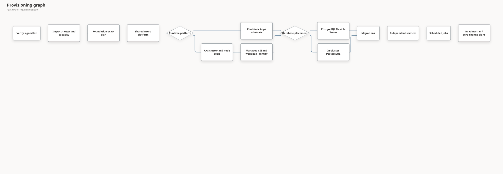

# Runtime Deployment Profiles

> **Deployment distribution:** The [constitution](../architecture/fdai-constitution.md#article-1-purpose-and-scope) defines three installation paths: the one-command source deployment, the signed offline package, and the [Hub-managed lifecycle](hub-managed-lifecycle.md), which is designed but not yet implemented. Any installation gate in this document that the constitution does not list is superseded and no longer applies.

This document defines Azure Kubernetes Service (AKS) as the default runtime for new FDAI installations without changing application behavior or deployment
authority. Azure Container Apps remains a supported compatibility profile for existing installations. The selection is part of the signed `fdaictl` provisioning profile and every exact Terraform plan.

> **Scope:** This contract covers new installations. Moving an existing installation between
> runtime platforms requires a separate migration design and is not an implicit profile update.
>
> **Azure focus:** Both supported runtime platforms use the same Azure provider adapters, signed
> OCI images, Event Hubs Kafka endpoints, Key Vault, workload identities, and PostgreSQL schema.

## Design at a glance

Operator production composition uses the same focused lifecycle, route-family, and read-source
modules in every runtime profile. The internal ownership split changes no platform selection,
identity, source binding, readiness condition, or deployment authority.
Both profiles also use the same authenticated instance-index enrollment and bounded Core reconciliation task. Governed embedding identity gates adapter construction; cached candidates never replace current graph authorization. Unqualified semantic ranking remains closed, and exact-ID availability does not establish AKS diagnostic evidence, provider health, or deployment readiness.
Preparation and retired-generation cleanup share the existing deployment-wide ResourceLock provider and a principal-scoped projection key. Lock contention consumes the original preparation deadline; neither profile may substitute independent per-replica locks for shared storage writes.
Authenticated index enrollment persists a five-minute service-owned receipt so another worker replica can resolve the same principal, role, groups, and purpose. Each source read recomputes scope and validates receipt lifetime; expired receipts cannot authorize work. Local active enrollment stays bounded at eight per process, and a two-second admission lock includes persistence without extending the receipt lifetime.
When a source change encounters eight retained rollback generations, reconciliation requests audited retirement of the oldest inactive generation before invalidating the current one. It never increases the retention limit or deletes an active generation directly. Historical AKS reconciliation compares container environment by name and binding rather than Terraform list order, and keeps order significant whenever a value interpolates another variable. An explicit falsy `optional` on a secret reference is treated as unset, which Kubernetes does too. It compares a workload SecretProviderClass by its bindings for the same reason. That comparison uses the effective object, so a recorded manifest catching up to the cluster removes nothing while an unknown object fails closed.

Shared Operator outbox composition preserves the same test-context worker on both platforms.
Its facade grouping creates no AKS observation, Cost Governance activation, or deployment authority. Both runtimes use the same [bounded projection recovery](../interfaces/recorded-resource-state.md#bounded-automatic-recovery) inside the existing inventory coordinator. Recovery changes neither provider scope nor infrastructure, and a release mismatch requires deployment review rather than an automatic rollout or access override. After that review, only an explicit operator-requested full reconciliation may preserve an unreplayable pending generation and collect fresh evidence under the current release; recurring recovery remains blocked.
When subscription discovery creates observer deployment proposals, the Inventory Job uses the same
runtime notification router and durable per-channel delivery store as other operational alerts.
Those notifications are informational only and inherit the runtime's ChatOps bindings; they do not
change runtime selection, deploy an observer, approve a plan, or grant execution authority.

Single-operator production approval is a deployment-selected approval profile, not a runtime
platform profile. Core may load one immutable `ApprovalProfileRevision` from
`FDAI_APPROVAL_PROFILE_JSON` or `FDAI_APPROVAL_PROFILE_PATH`. The same revision is shared by
ControlLoop, HIL resume, and Pantheon composition. It is mutually exclusive with the
full-authority development profile and fails closed when malformed, not yet effective, or carrying
a mismatched content-addressed digest. It reduces only the approval quorum for the named operator;
it does not change runtime selection, risk classes, A4 denial, execution identity, or effect
verification.

The selected product profile is another runtime-independent axis. Local, AKS, and Container Apps
profiles all consume the same canonical product-profile JSON. The Terraform root passes that
`product_profile_json` unchanged to both Core and Operator; Core-only convenience inputs must first
resolve to that JSON before Operator starts. Selecting `policy-administration` only binds the
Operator policy route and Mimir policy-administration subscription; it does not change the runtime
platform, Cost Governance package activation, or any execution identity. Until Terraform also
provisions the non-exportable policy-signing Key Vault key, its crypto role grant, and Core signing
environment, `product_profile_json` validation rejects the `policy-administration` add-on.

The host's read-only `verify-source-runtime` command checks pinned source/runtime content, not
runtime or database placement, node sizing, cost, host identity or exact-plan authority. Its evidence
cannot replace a profile-bound plan. Support installation receives an already-admitted artifact root;
missing source support never selects a kit implicitly. See the [source boundary](installable-deployment-cli.md#explicit-source-recovery).
When a one-command source deployment reaches the standalone application sequence, the runtime
profile does not change. The managed host receives a verified source transport archive instead of a
signed kit archive, installs `fdaictl` from that snapshot, uses Terraform roots and migration
support from the snapshot, and resolves providers directly from public registries under the
committed lock files. Image references still enter the runtime profile only as read-back digests
after the deployment registry build stage completes.
Host preparation runs exactly one host subcommand: `prepare --kit` for a signed kit and
`prepare-source` for a source snapshot. A focused test parses the command the coordinator sends with
the host's own parser in both modes, because a rejected command fails before the host records any
reason.
Both profiles package Core's locked Kubernetes quantity utility for read-side resource accounting. This dependency neither chooses a runtime nor grants Kubernetes access, proves node fit, or enables Cost Governance; the standalone deployment CLI retains its independent dependency set. Runtime Dockerfile Alpine package pin updates are package maintenance only and do not change profiles, authority, provider access, or add-ons.

The deployment CLI also carries pure, shadow-only checks for future Hub-managed Lifecycle Plans.
Those checks evaluate local Plan admission and blocking constraints against already parsed inputs,
but they do not poll a Hub, render manifests, apply Terraform, sign receipts, or grant lifecycle
authority.

The operator chooses one runtime platform and one database placement. `fdaictl` validates the
combination, estimates its capacity and cost, compiles a platform-specific provisioning graph,
and asks for approval of each exact plan. A retry can verify an uncertain effect, but it cannot
change either choice or repeat an ambiguous apply.
Verification-only recovery remains the first and only implicit response to an apply claim. A fresh
zero-change plan and authoritative readback close the original claim. If the refreshed exact plan
instead proves bounded residual changes, the coordinator preserves the original claim and emits a
distinct residual review bound to the original claim, current state, target, source, runtime
profile, and residual binary plan. It requires a new exact `<stage>-residual-apply` approval and a
new residual claim before one effect. Destructive residuals retain the second confirmation.
Residual apply ambiguity is verification-only; it cannot create another residual apply. Completion
still requires authoritative effect readback and a zero-change plan. Any present or symbolic-link
claim path blocks ordinary replanning until validated recovery; malformed retained claims fail
closed.

Before a runtime plan, apply, residual review, or residual apply can proceed, the managed host
reads back AKS agent pools with its deployment Managed Identity. If the `runtime` user pool already
exists in Azure but the `azurerm_kubernetes_cluster_node_pool.user` address is absent from
Terraform state, the run stops before any effect with `aks_node_pool_exists_outside_state`.
The message names the pool and explains that removal requires explicit Owner confirmation. The
coordinator does not delete or import that pool automatically.

| Axis | Supported values | Default | Meaning |
|------|------------------|---------|---------|
| Runtime platform | `aks`, `container-apps` | `aks` | Hosts FDAI services and scheduled jobs. Container Apps is compatibility-only for new planning. |
| Database placement | `postgres-flex`, `postgres-aks` | `postgres-flex` | Uses Azure Database for PostgreSQL Flexible Server or a PostgreSQL cluster inside AKS. |
| Product surface | `observation-first` plus selected add-ons | `observation-first` | Starts headless inventory, telemetry, learning, prediction, replay, drift, and advisory evidence. |
| Optional add-ons | `read-only-console`, `notifications`, `governed-execution`, `enterprise-identity-governance`, `policy-administration` (requires `read-only-console` and `enterprise-identity-governance`) | none | Selection never implies availability, enablement, authorization, or execution authority. |

`postgres-aks` is accepted only with `runtime_platform=aks`. Production keeps
`postgres-flex` until the in-cluster profile has independent zone-loss, backup, point-in-time
recovery, and upgrade evidence.

When a deployment binds bounded temporal series, every product surface gets the same causal
evidence path: Forseti's `CausalHypothesis` projection over the runtime ontology store and the Thor
ActionRun receipt resolver. Causal revisions stay advisory evidence; they never select an add-on,
satisfy an approval, or raise autonomy.

Runtime, database, environment, fork status, and package presence do not select product add-ons. The shared immutable profile contains only explicit selections and `authority_granted: false`. A runtime record created before product profiles matches only the explicit legacy selection of the four original add-ons, so a later add-on never changes that match.
The default constructs no Graph, approval, promotion-to-enforce, rollback, or privileged executor binding. A selected but incomplete add-on fails closed: `read-only-console` and
`governed-execution` require `enterprise-identity-governance`, and every runtime carries the compiled profile to its own workloads so composition never diverges from the selection.
The full-authority development profile remains a separate optional authority input for an exact disposable scope and never inherits from this product axis. The optional dev operations gateway is authenticated, so it requires an explicit Operator API audience and refuses to plan without one.
Azure observation requires only scoped `Reader`. Explicit source selection derives the minimum extra role: Azure Monitor, Log Analytics, Cost Management, AKS read-only
(Cluster User plus RBAC Reader), or evidence-store `Storage Blob Data Reader`. No role can be selected directly or silently bundled. Missing source access reports unsupported.
The base profile requires no Azure Policy assignment and uses Reader-visible resource metadata for policy evaluation; it grants no write, `User Access Administrator`, or Microsoft Graph permission.
Inventory and observation live evidence remains Phase 1 ledger work after #341 was closed as not planned on 2026-09-28; GitOps write evidence is optional.

## Operator contract

The public command accepts explicit choices for both online and artifact-offline installation. An
omitted runtime selects AKS for a new installation:

```bash
fdaictl provision azure --online \
  --database postgres-flex

fdaictl provision azure --online \
  --runtime container-apps \
  --database postgres-flex \
  --existing-installation

fdaictl provision azure \
  --offline-kit /media/fdai/fdai-deployment-kit.tar.gz \
  --runtime aks \
  --database postgres-aks \
  --system-nodes 3 \
  --user-nodes 4
```

The command remains interactive at each mutating plan boundary. A runtime or database choice never grants action authority, changes the selected environment,
or enables enforcement mode. After installation, the Console groups environment readiness and read-only deployment-run evidence under Settings > Environment
and deployment. The readiness view is the default; deployment evidence is a separate tab. Neither view starts or retries `fdaictl`, runs Terraform, or acquires
deployment authority. The original `/onboarding` and `/provisioning` routes remain compatibility entry points.

### AKS browser access

The default AKS profile uses this browser path:

```text
Browser -> Static Web Apps -> API Management -> AKS LoadBalancer Service -> Pod
```

Static Web Apps hosts the prebuilt Console. API Management (APIM) provides the public HTTPS API
edge: the Operator API is routed at the APIM origin root, and Document Ingestion is routed at
`/ingestion`. The Kubernetes Services listen on port 80 and forward to the existing container port.
The workload state owns APIM because its backend addresses come from those Services. The shared
substrate does not create Azure Front Door for this path.
APIM tags derive from the stable workload labels under Azure-safe names. For example,
`fdai.io/source-commit` becomes `fdai:source-commit`, because Azure tag names reject `/`.

APIM does not replace Microsoft Entra authentication. The APIs continue to validate token issuer,
audience, lifetime, and App Roles. The audience is the `fdai-api` application (client) ID that v2
access tokens carry, and every Terraform root rejects the `api://` App ID URI form. An Entra receipt
recorded with that legacy form is upgraded only when it otherwise matches the current readback, and
service deployment and live recovery canonicalize a stored `api://<client-id>` service audience.
Cross-origin resource sharing (CORS) accepts only the exact
Static Web Apps origin. When Azure Policy attaches a network security group to the AKS subnet, the
workload plan permits TCP port 80 only for the exact public Service frontend addresses. APIM
Consumption has no fixed outbound address that can be used as the source rule.

After the approved application plan converges, `fdaictl provision azure` reads the SWA and APIM
bindings from their owning Terraform states, adds the exact SWA redirect to the existing Entra SPA
registration, and publishes the signed kit's prebuilt Console. Tenant provisioning does not run an
npm build. Completion requires remote artifact hashes, SPA route fallback, both API health checks,
the exact-origin authorization preflight, an unauthenticated `401` from `/audit`, and an Entra
redirect to the configured Console origin. Static Web Apps can briefly serve earlier bytes or `404` after a deployment, so each published file must reach its exact local digest within one bounded readback window of at most 60 attempts or five minutes. A failure reports only the publisher's literal reason, never a variable endpoint diagnostic.
An existing development Container Apps installation can update only its static Console through `fdaictl provision console-update`; separate protected-source construction and a 20-minute plan bind the candidate, distinct rollback artifact, and existing Static Web App target. Invoking apply is explicit coding-session authorization without a second prompt, binds the exact plan digest internally, writes a claim before publication, and changes no runtime selection, service image, Terraform or database state, product authority, or deployment readiness. Claimed recovery survives plan expiry, uses current reviewed publisher controls, checks candidate and rollback content before any restore, and publishes rollback only when neither artifact is present.
Static readback hashes only files that Static Web Apps serves; host-consumed configuration remains mandatory local input. New prebuilt candidates include allowlisted Manual Studio content and bind its share metadata to the Console's exact same-origin `/manuals` path. Existing rollback artifacts without bundled manuals remain readable. Rollback closure verifies those static bytes independently from API health, records skipped service checks as unverified, and reuses only validated private attempt directories. Candidate success still requires the complete artifact, API, authorization, and Entra checks above.

### Defaults and validation

| Setting | Validation | Recommended value |
|---------|------------|-------------------|
| AKS system nodes | At least 2. Production requires at least 3. | 3 |
| AKS user nodes | At least 3. | 3 with `postgres-flex` |
| AKS user nodes with `postgres-aks` | At least 4. | 4 for non-production compact use |
| System node SKU | At least 4 vCPUs and 4 GB memory; available in the selected region and subscription. | `Standard_D4as_v5` |
| User node SKU | Region and subscription must report it available. | `Standard_D4as_v5` |
| PostgreSQL Flexible Server SKU (`--database-sku`) | `postgres-flex` only. One of `B_Standard_B1ms`, `B_Standard_B2s`, `B_Standard_B2ms`, `GP_Standard_D2ds_v5`, or `GP_Standard_D4ds_v5`. | Unset keeps `B_Standard_B1ms`; a General Purpose size such as `GP_Standard_D2ds_v5` for AKS |
| Availability zones | Every requested zone must exist for both selected SKUs. | Three zones in production |

The database size enters the runtime profile only when it is selected, so an unset size keeps the
existing profile mapping, digest, and day-zero server. A Burstable server runs at a fraction of
one vCore after it spends its CPU credits. A development AKS installation with every baseline
service and the per-minute inventory and analyzer Jobs spent a `B_Standard_B1ms` server's credits
within about an hour, and every service then failed on PostgreSQL timeouts. The compute cost
review still excludes the database, so a larger size remains an explicit operator cost choice.

The node-count floor proves only that the profile is structurally supported. Production planning
also evaluates the declared workload envelope after AKS reservations and per-node DaemonSet
requests:

$$
(N - 1) \times C_{allocatable}
\ge 1.2 \times (C_{services} + C_{jobs} + C_{database}) + C_{daemonsets}
$$

Memory uses the same inequality. A profile that misses either bound is blocked before Terraform
planning. The error reports the requested and allocatable quantities without exposing tenant data.

## State ownership

Both initial and recurring collection apply source-policy page and concurrency limits. Snapshot
policies cannot exceed 50,000 Resources or 200,000 relationships, matching the current projection
capacity. ARM page collection also enforces policy record and accumulated-response byte limits.

Initial and recurring inventory runs share the same projection bounds: an oversized candidate retains the previous active generation, and incomplete observations cannot confirm resource deletion. Both use durable chunk forwarding and exact-context unfinished recovery under the existing run lock. Recovery repeats the full provider read without trusting a continuation token, preserves original clocks, and requires fresh relationship and final coverage verification before sealing and promotion. Changed or missing retained identities block that candidate. Source accumulation and enrichment each retain a 16 MiB normalized-record ceiling. Dedicated Linux entrypoints impose a 2048 MiB OS address-space limit across collection, enrichment and publication; `FDAI_INVENTORY_MEMORY_LIMIT_MIB` permits 256-4096 MiB but cannot raise an inherited lower limit. Insufficient startup headroom blocks before collection. Database memory and embedded calls remain separately owned; no read, deployment or execution authority changes. Only the local launcher enables `FDAI_INVENTORY_OPERATOR_GRAPH_PROJECTION`, which lets the recurring loop rewrite the Console inventory graph projection when the active snapshot or its freshness changes; connected deployments leave it unset, so their Architecture view reports the graph as not wired.
Their end-to-end deadline also covers enrichment, promotion, and notification, with bounded cancellation cleanup rather than an indefinitely collecting candidate.
Both profiles retain a content-bound delivery marker before graph commit and recover pending Resource Events independently of the graph completion watermark; delivery never grants execution authority.

Connected deployments for both runtime profiles boot the managed host from an exact Azure
Marketplace Ubuntu version and install the checksum-pinned toolchain during Foundation. They do
not build or require a dedicated managed-host image. Artifact-offline deployments can still select a separately verified prebuilt host image when bootstrap downloads are unavailable.
Complete kit construction targets CPython 3.12, matching the managed host interpreter. Wheel ABI
matching remains exact; glibc compatibility is forward-only within the glibc family from the kit's
recorded minimum.
The managed host installs migration and inventory support from the kit's signed aggregate
requirements lock with index access disabled, exact hashes required, and only verified local wheel
directories exposed as discovery locations. Duplicate wheel copies are never passed as separate
direct requirements. Completion requires dependency checking, owned-package version readback, and
a receipt bound to the kit manifest, inventory, requirements, and full package readback. A partial
environment without that receipt is not resumable success. The focused
`runtime_support_installation.py` owner enforces this contract; standalone host orchestration only
supplies the already-admitted artifact root and signed kit-manifest binding.
The managed host validates the selected user-assigned Managed Identity through Azure CLI for
Azure CLI operations, but Terraform backend and provider authentication use that identity natively
through `ARM_USE_MSI=true` and its exact client ID. The host clears inherited CLI, OIDC,
client-secret, certificate, username/password, workload-identity, and custom MSI-endpoint selectors
before setting this binding. An ambient authentication mechanism cannot replace the handoff-bound
executor identity. Each Terraform binary plan is then opened without following links, validated as
a nonempty single-link file owned by the executor, and sealed to mode `0600` before projection,
digest binding, approval, or apply.
Enrollment and every later application transfer reuse the same VM-bound `fdai-genesis-*` SSH
host-key alias and attested known-hosts file; runtime selection never permits a second alias or
first-contact trust.
Runtime-profile validation exercises that shared alias before all eleven application phase
outcomes so a transport collaborator change cannot bypass the phase-specific failure contract.
It also runs the four transfer deadline outcomes, preserving the same alias contract across
successful, expired-budget, and ambiguous-transfer paths. Managed-identity environment regressions
restore process `PATH` and authentication selectors before later packaging checks, so test order
cannot remove the trusted `uv` tool or leak one case's identity mode into another.
After application convergence, the managed host invokes the Core inventory entry point in explicit `--initial` mode, bypassing only the recurring due-time gate. It uses the already authenticated deploy identity for full-subscription ARG/ARM reads and immutable progress writes, then starts a separate read-only closure process. The recurring runtime schedule and its workload identity remain unchanged; the bootstrap path grants no ongoing deployment authority to the inventory workload. Presentation and integration contracts account for this as the sixteenth phase and for `provisioning-events` as the third private Foundation container; older additive receipt doubles may omit `inventory_ready` without being interpreted as ready. After an initial or recurring scan projects a complete promoted generation, the focused `inventory_ontology_observer.py` delivery module publishes one retry-stable Resource observation Event per Resource to the existing control-loop topic while the CLI remains composition-only. Forseti remains the rule judge, Saga remains the audit owner, and an incomplete projection or publication failure cannot satisfy inventory closure or create execution authority.

On AKS, the managed host derives one content-addressed Job from the exact deployed inventory
CronJob, preserves the `inventory-job` ServiceAccount and digest-pinned Core image, and passes only
the initial-run progress identity. Success additionally requires a separate PostgreSQL closure
read proving complete provider coverage, final fence, closed overlay, complete child sources, and
the exact active generation. A retained claim with no Job or closure never starts another Job.
The Job records progress only in PostgreSQL, because the `provisioning-events` container is
private to the managed host. The host-side closure, running under the deploy identity, completes
the progress chain there.
The live CronJob must match the protected template digest. Before comparing, the projection drops
five Kubernetes defaults that the API server or provider can write explicitly, and only while
they hold the default: `privileged: false`, `readOnlyRootFilesystem: false`, key-reference
`optional: false`, `mountPropagation: None`, an empty CSI `fsType`, and an empty environment
`value` without `valueFrom`. Any other value still
differs from the reviewed template.

The isolated exact-revision inventory-network certification is not a deployment inventory run. It
may promote a requested-resource-type snapshot only into its task-owned sandbox store so that the
campaign can verify private projection, fallback retention, and recovery. Initial and recurring
runtime inventory still require complete provider scope, and the sandbox receipt grants no
observation, deployment, or execution authority.

An optional reviewed catalog-review profile adds one suspended AKS CronJob and a post-inventory
checkpoint. The coordinator transfers only a private GitHub App profile and PEM, verifies the App's
single private repository and downscoped permissions, and runs the real Huginn, Muninn, Norns,
Mimir, and Saga event path on durable Kafka and PostgreSQL. Success requires an independently read
open draft with the exact head commit, review document, base, labels, and no merge or auto-merge. The receipt grants no
catalog activation, merge, promotion, or managed-resource mutation authority.
Presentation records this selected-or-skipped checkpoint as the seventeenth phase, and every application receipt carries its catalog-review digest and state.
Repository tests assemble their non-secret PEM boundary marker at runtime; secret scanning ignores only the removed marker's exact historical fingerprint and does not allow future key-shaped source.

Tenant provisioning consumes prebuilt service and dependency images for new installations, whole-profile convergence, staging, production, dependencies, and releases. Core, Operator, and the Cost Governance profile install the typed shared runtime diagnostics wheel because their distributions import it; the venue guard keeps its socket unavailable outside explicit local development.
A complete release includes ClamAV and pgvector, and the provisioner verifies signatures, provenance, source revision, platform, and digest without Docker, Buildx,
ACR Tasks, a remote builder, or VM image capture. When a recovered Foundation predates the release,
the local coordinator retains its complete evidence chain and the managed host independently binds
the historical handoff digest to the distinct current kit and runtime digests. This binding does not
select, skip, or authorize the optional catalog review checkpoint. The initial host context persists
the exact Foundation adoption receipt digest and revalidates it on every retained-context retry; a
context cannot omit the binding that its own retry requires.
The AKS public baseline remains the default. If authoritative readback finds the exact existing
application Key Vault or document storage account already forced to public-disabled with no usable
managed-host path, preparation selects only the corresponding focused
`enable_aks_key_vault_private_access` or `enable_aks_document_storage_private_access` recovery axis.
These axes require the verified runner VNet coordinates and create the shared application-to-runner
peering plus only the selected Key Vault or document Blob/DFS endpoints and DNS links. They do not
select private AKS, private PostgreSQL, or any other service private endpoint, and the residual
Terraform plan still requires exact approval. The selectors validate bounded management-list JSON,
accept either provider-flattened or nested `properties.publicNetworkAccess`, keep absent resources
on the default path, and fail closed on duplicates or unknown shapes. The Blob and DFS endpoint
modules are explicit substrate targets because they are dependents of document storage rather than
implicit dependencies of the storage module. When either focused axis is selected, a separately
approved `access` plan first converges only the selected endpoints, DNS links, peering and deployer
data roles. Read-only Key Vault and ADLS probes must then succeed before the ordinary substrate plan
can create secrets, filesystems, or paths. A retained context may tighten either selector from
`false` to `true` after partial-substrate readback proves the private posture; loosening `true` to
`false` is rejected as a context mismatch. An ambiguous access apply follows the same
verification-first and bounded residual rules as every other stage.
One bounded exception lets an eligible host run `fdaictl provision source-service-update` for one service on an
existing healthy `dev` AKS installation. The source-built image remains operator-selected evidence rather than release trust. Current human approval gates its
Managed Identity import and the Deployment-only exact plan; digest and health readback, unchanged peers, and targeted zero change remain required.

An optional Foundation `application_workload` token can separate the new application group's name
from operations naming without changing the AKS profile. It grants no ownership of an existing group;
partial-state recovery follows the [application group collision contract](installable-deployment-cli.md#application-group-collision-recovery).
The application stage derives the shared Terraform workload token from the exact Foundation handoff
resource-group name and rejects a mismatched environment, region or workload grammar before planning.
The separate `operations_public_ip_tags` input preserves only the exact observed Foundation
Bastion/NAT policy tag; it does not alter AKS node settings or grant lifecycle drift exceptions.

The read-only capacity preflight accepts nonnegative integer quota values and canonical decimal
integer strings returned by Azure CLI. Boolean, fractional, signed, whitespace-padded or oversized
representations remain blocked. Available quota never overrides a SKU restriction, missing zone,
unsupported architecture or missing host encryption; a different target requires a fresh review.

Source execution separately reads the [Azure Retail Prices API](https://learn.microsoft.com/en-us/rest/api/cost-management/retail-prices/azure-retail-prices)
after initial settings confirmation and before Foundation planning. It selects exactly one primary
USD hourly Linux consumption meter per selected VM SKU and region; Windows, Spot, Low Priority,
reservation, foreign-service, future-effective and tiered prices cannot substitute. Four complete
pages share one deadline, each body is bounded, and redirects or failed reads never trigger retries.
The partial compute projection uses system nodes plus the user autoscaler maximum for 730 hours.
If that component alone exceeds the monthly ceiling, planning is blocked. Otherwise the result
remains `partial`, with Foundation, control-plane, disk, database, network, registry, storage,
monitoring, messaging, model, tax, surge and setup costs explicitly excluded. It is not a full
installation estimate, setup-cost verification, billing cap or execution authorization.

Runtime selection does not replace one resource type with another in the same state. Each owner
has a distinct backend key so a new installation creates only its selected platform and an existing
installation cannot switch platforms by changing one variable.

| Owner | Backend key pattern |
|-------|---------------------|
| Shared Azure platform and Container Apps default | `fdai-<environment>.tfstate` |
| AKS substrate | `fdai-<environment>-aks-cluster.tfstate` |
| AKS workloads and scheduled jobs | `fdai-<environment>-aks-workloads.tfstate` |
| In-cluster PostgreSQL | `fdai-<environment>-aks-database.tfstate` |

The shared platform continues to own Event Hubs, Key Vault, Azure Container Registry, monitoring,
workload identities, case-history storage, and `postgres-flex`. Foundation delegates subscription role assignment only for Reader, Monitoring Reader, and Cost Management Reader roles to service principals;
matching Terraform resources set `principal_type = "ServicePrincipal"` so the provider request satisfies that condition without widening the delegated role set. Every role assignment to a managed identity that the same apply creates sets `principal_type = "ServicePrincipal"` as well, so Azure accepts it while Entra ID still replicates the new identity; the deploy principal stays untyped because the public dev path supplies a user, and `test_role_assignment_principal_type.py` enforces the rule. Case-history content defaults its active, deletion-due,
superseded-version, and change-feed periods to 30 days; operational-history and decision-evidence metadata keep their separate schedules. The AKS substrate state owns only the
cluster, node pools, cluster identity, networking attachment, and cluster-scoped Azure role
assignments.
AKS consumes the shared root's Key Vault output and substrate readback selects the registry named by Terraform's state-owned `container_registry_id` and fails when it differs from the workload-aware registry used for image references. A root output that a targeted apply never recorded is read from a refresh-free, non-targeted plan only when its planned value is known; an unknown value fails closed. The AKS substrate also applies the Console and cost pseudonym secret that the AKS workloads read; the optional operational-history archive waits for detailed private networking. The public AKS API server authorizes only the managed host's operations NAT gateway address. Managed-host checkpoints create state with an owner-only umask regardless of the session default. Image import copies each verified OCI layout with the destination registry credential file only. Overlength candidates use the
deterministic `kv-aip-<8hex>` fallback without creating a second runtime naming rule.
Selecting AKS creates the application VNet plus node and API-server subnets even when detailed
private networking is off. The separate private-networking input controls service private
endpoints, hub peering and private DNS rather than the AKS subnet prerequisite.
Focused document recovery keeps the Foundation-owned operations Blob-zone link singular and writes
the document endpoint A record into that zone. The application VNet retains its application-zone
link, while the DFS zone links independently to both required VNets.
The default-disabled dev alert-noise pilot remains an operator-local deployment prerequisite for
either runtime choice. It pins the existing FDAI Core Container App as a read-only `Replicas` metric
scope and creates only one dedicated Action Group and one metric alert. It neither changes the Core
app nor reads application data, credentials, connection strings, or Key Vault content. Runtime
selection grants no pilot approval, notification authority, or promotion. Its Terraform plan and
apply receipt are local deployment records, not FDAI runtime authority or effect evidence.
Kubernetes resources are applied only after independent Azure control-plane readback proves that
the cluster reached `Succeeded`, API Server VNet Integration is active and the reviewed management
path is reachable. Basic deployment initially keeps authenticated public API access so an external
coordinator can complete the baseline. The workload state then reads the approved cluster's OIDC
issuer and uses an owner-only kubeconfig on the deployment host.
The Terraform scanner exceptions for this public baseline are resource-local and name the explicit
CIDR allowlist, Microsoft Entra RBAC, disabled local accounts and VNet Integration controls. It
does not suppress other AKS findings or certify the later private transition. The APIM Consumption
exceptions additionally name its lack of VNet integration, independent API authentication and
exact-origin CORS, and the port 80 rule's two exact LoadBalancer destination addresses.
Database and application preparation both convert that owner-only kubeconfig with
[`kubelogin` managed identity authentication](https://learn.microsoft.com/en-us/azure/aks/kubelogin-authentication)
using `--login msi` and the exact managed-host client ID. Credential acquisition pins the
subscription and never requests admin credentials. Local `kubectl config view --minify` readback
must show one exec-only user, `kubelogin get-token`, one matching client and one MSI login option,
without environment overrides. Failed conversion or mismatched readback stops before Kubernetes
operations; neither browser/device-code login nor default/node identity is a fallback.
Runtime topology inventory keeps the exact AKS ARM ID as its authorization binding, then converts it to the provider-neutral Resource identity before composing Kubernetes objects and relationships. This identity conversion does not widen the deployment scope or grant observation authority.
The common plan-review validator accepts the existing `substrate`, `runtime`, `database` and `application` stages with the same exact digest, expiry and destructive-confirmation checks.
Accepting an AKS stage never grants it approval or permission to skip an earlier stage.

Rollout order: the Operator emits the optional content-free `authentication_receipt_ref` in `operator-core-request` 1.9.0 only when `FDAI_SEMANTIC_AUTHENTICATION_RECEIPT_REF_ENABLED` is on. The setting defaults off, and with it off every envelope keeps its earlier version and bytes. Enable it only after a Core that accepts 1.9.0 is deployed. The reference grants no authority by itself. With the setting on, the Operator API and the channel edge retain the content-free receipt for each semantic request before they send the reference, and the verifier checks `case-history-read` against the receipt retained for that exact request. With it off, Pattern reads still fail closed.

## Runtime rendering

The optional [outbound snapshot connector](../architecture/aks-outbound-connector.md) runs from
the existing Core distribution and does not change runtime selection or deployment authority.
Inventory composition can explicitly select its certificate-authenticated stored source instead
of direct Kubernetes bindings or subscription discovery, never both. The observer receives no
central database identity; the dedicated gateway uses the Core-owned store. Default renderers do
not install or enable these workloads yet, and local TLS/DB evidence is not deployment readiness.
Subscription discovery in the inventory Job reuses its prior AKS binding through the existing
state store, so a per-run Job process skips the credential call for an unchanged cluster. The cache
holds the API server, ARM etag, and digest-verified public cluster CA only; credentials still come
from the Job's workload identity at connection time.

FDAI services keep one runtime-neutral workload specification containing the digest-pinned image,
command, arguments, environment names, resource requests and limits, startup, liveness and readiness
probes, ingress intent, service port, sidecars, secret references, workload identity and scaling bounds.

The Container Apps renderer maps the specification to Container Apps and Container Apps Jobs. The
AKS renderer maps it to typed Kubernetes `Deployment`, `Service`, `ServiceAccount`,
`HorizontalPodAutoscaler`, `PodDisruptionBudget`, `NetworkPolicy`, and `CronJob` resources. The
first AKS implementation keeps two replicas for each long-running service and does not require
Knative or KEDA. Console publication uses an exposed browser gateway base URL; otherwise, it retains the existing Container Apps FQDN without changing browser or API routes.
Optional Core tick Jobs stay off unless their cron variable is set. The automation blueprint Job
(`automation_blueprint_cron_expression`) follows that rule under every profile, including the
observation-first default. It reuses the scheduler identity and state-store secret and never
receives an executor identity.

Both renderers bind Core to the `fdai.operating-model` logical topic through
`FDAI_OPERATING_MODEL_TOPIC`. The topic shares the existing semantic physical Event Hub and its
managed-identity transport; it is not another Event Hub entity or authority channel. The AKS
standalone renderer obtains the value from the exact substrate output, while the independent and
legacy Container Apps renderers receive the same typed deployment input.
Core consumes that topic, and publishes read-investigation stage activity, through the primary
transport even when an isolated auxiliary transport is configured. The auxiliary operations
namespace carries only raw inventory, canary, startup-probe, and executor traffic and has no entity
for either topic.

The AKS standalone renderer always binds Core semantic request, projection, physical and read-investigation topics,
so a disabled model returns a typed hold instead of leaving a request pending. With model support,
Azure mode, resolved-model path, digest, primary endpoint and endpoint map form one fail-fast contract; `enable_llm` must be a JSON boolean, and other types stop application preparation. This validation is structural and never classifies natural-language intent.
The shared Terraform model boundary routes OpenAI capabilities to the Azure OpenAI account and
Anthropic, Cohere, or MistralAI capabilities to the deployment-owned Foundry partner account. Both
runtime profiles consume the same sealed endpoint map, so selecting AKS or Container Apps cannot
change the secondary publisher, model, or capacity.

Operator assignment and human-approval (HIL) transport imports share the existing `iam_composition`
facade within the same Operator Service package and runtime; original adapter and factory objects
are re-exported without wrappers. This grouping changes no topology, workload identity, readiness
behavior, or exact-plan deployment approval requirement for either renderer.

Long-running service containers use `image_pull_policy=Always`, a read-only root filesystem, and
a dedicated `/tmp` temporary volume limited to `1Gi`. Workload validation rejects mutable tags
and malformed image digests before planning. Other writable paths require an explicit workload
contract; making the whole root filesystem writable is not a compatibility fallback.

The five-service AKS baseline enables lexical document retrieval without requiring an embedding
deployment. Document API and Worker use distinct workload identities, role-scoped database DSNs,
the shared ADLS account and the `fdai.pipeline.stages` entity. The Worker Pod includes the existing
digest-pinned ClamAV image as a replica-local TCP sidecar that starts `clamd` directly, because the image entrypoint changes database ownership and exits without root. Its root remains read-only and only the
declared database, log, run and temporary paths receive size-limited `emptyDir` volumes. The restricted namespace requires `runAsNonRoot` at both Pod and container scope for workloads, init containers, sidecars, and scheduled jobs; a Pod-level setting alone does not satisfy admission. Core receives the shared-root Event Hubs startup timings, and Core and Operator read the `operator_request` receipt seeds through per-secret `Key Vault Secrets User` grants that the substrate stage creates. The renderer takes each seed's secret name from the versionless Key Vault resource ID that the shared root outputs. A structural test requires every Key Vault secret the AKS renderer names to come from a substrate-targeted resource, the `postgres-aks` database root, or the host-written license secret.

The optional operational evidence verifier renders as a separate internal workload with its own user-assigned
Managed Identity only when deployment-owned pins, anchors, caller-token validation, writer policy, and role-readback scopes are present.
It is not part of the baseline five-service readiness set, receives no executor identity, and the root grants only image pull plus exact DSN-secret read.
When `operational-test-observation` is configured, the same dedicated identity also receives `Monitoring Reader` on the deployment resource group so Azure Monitor reads happen under the verifier identity.
Startup still waits for the caller authenticator, executor-class anchor preflight, proof-store writer readback, and Azure own-role readback.

Scheduled jobs use `concurrencyPolicy=Forbid`, one completion, one parallel worker, a bounded active deadline,
a retry limit, and bounded history. Manual jobs require a separate approval and are not perpetual desired-state resources.
The AKS baseline renders analyzer, canary, inventory, observation campaign, and operational-history lifecycle
CronJobs. The history job uses the read-only inventory identity, service-owned state DSN, and private archive URL
in fixed `shadow` mode. A non-shadow lifecycle requires a separate protected transition and exact persisted certification receipt.
The focused `aks_workload_jobs.py` module owns pure scheduled-job assembly; the managed host remains orchestration-only, and this ownership split changes no rendered Job, identity, schedule, or authority.
The analyzer Job reuses the inventory identity to read only the exact ingest Event Hub for
uncertain-publication reconciliation. Its new topic-scoped receiver assignment adds no write,
deployment, or execution authority; a declared role is not proof of effective deployed access.
Application preparation binds the inventory CronJob to its exact AKS cluster through the in-cluster
ServiceAccount endpoint, CA, and token paths. A dedicated ClusterRole grants only the collector's reviewed
reads, and its ClusterRoleBinding names only `inventory-job`; self-observation never discovers another cluster.

The inventory command preserves read-only failure boundaries; Activity Log recovery cannot advance delta cursors
or stop reconciliation. Passive model-serving evidence reuses inventory identity and Azure Monitor without inference;
failures lower only its coverage. Reconciliation bounds determine lookback, freshness, points, and timeout. The
standalone substrate target set includes the existing subscription, workspace, exact-cluster, cost, and pipeline-stage
roles. An inventory identity without these assignments cannot establish provider scope, metrics, logs, cost, or publication readiness.
Each one-shot inventory process closes its runtime-settings, ontology-status, collection-health,
change-accelerator, and private-cluster proposal database pools through the same asynchronous
lifecycle that closes provider clients and event transport.

The managed host records the selected Deployment names, image references, and replica bounds.
Its checkpoint coordinator delegates descriptor-safe private state, locking, digests, and atomic
JSON replacement to one state module, while a separate pure module validates plan summaries and
Foundation-derived values. This split changes no target, plan, approval, identity, apply, or
independent readback contract. Failed JSON publication removes its random private temporary file.
Health readback requires that complete set, current observed generations, ready replicas, and
running Pod image digests from the same source revision. Empty, duplicate, stale, malformed, or
partially healthy responses are unavailable, not success. The expected set must contain all five
baseline services; a renderer that omits one cannot redefine a partial rollout as complete. This complete-set rule applies only to initial installation and whole-profile convergence. A routine update can select Core alone or another explicit service; each workload carries its own source revision, and the plan admits only that Deployment's in-place update. The source revision label belongs only to the Deployment metadata and Pod template. Stable workload labels on its Service, HPA, PDB, and NetworkPolicy prevent the revision change from admitting those resources into the selected-service plan. Readback verifies its generation, replicas, digest, and health, proves peer UID, generation, image, and revision stayed unchanged, then requires a targeted zero-change plan. Unselected images need no rebuild or redeploy.
If the retained workload state predates the standalone application receipt, selected-service update can first adopt it from a private five-part evidence set. Adoption cross-checks retained state, desired variables, the historical live snapshot, and the historical exact plan. It then reads remote state and current Deployments under the Managed Identity and requires a fresh, complete, full-scope zero-change plan. The resulting adoption receipt grants no apply authority and cannot substitute for the selected service's current exact-plan approval. Deployment observation reads the typed Apps v1 collection endpoint directly, including an encoded `labelSelector` for a selected service, so strict validation receives a server-authored `DeploymentList` instead of a client-synthesized generic `List`. Identity-bridge compatibility does not restore generic `List` acceptance. If that full plan finds the known legacy identity-bridge baseline, adoption still stops. A separate reconciliation contract can restore the Operator command identity, Document Worker ClamAV definition, and the exact identity bridge from matching Terraform state and typed live evidence. It accepts only inventory read-role creation, the identity-bridge state-address migration, and provider normalization of the existing Jobs, Deployments, and Services. The plan must preserve every workload image and source revision, the command federated identity, the bridge script, and the ClamAV digest, initialization, UID, GID, writable volumes, and Pod group. Any other address or contract difference is denied. Reconciliation requires its own exact approval, effect readback, and complete full-scope zero-change plan before historical adoption can be retried. Images that still use the exact five-service wrapper retain the managed ConfigMap at `/opt/fdai-compat` and a bounded `/app/.fdai` runtime-state volume while keeping container-level `runAsNonRoot`. Deleting the bridge or replacing those commands with image entrypoint defaults is denied until each affected image independently proves native AKS federated-identity startup. A scheduled Job whose command runs through the same wrapper sets `identity_bridge_enabled`, which mounts that ConfigMap read-only at `/opt/fdai-compat`. Reconciliation sets the flag for every bridged Job, and a precondition denies the flag without the bridge contract. If the ConfigMap exists outside current state, adopting that exact object requires a separate claim and authoritative UID and content-hash readback; it never recreates or overwrites the object implicitly.
The source-service coordinator owns that reconciliation lifecycle: it returns the strict runtime-profile-bound review, checks verification-only recovery before any new effect, requires current exact approval when no claim exists, revalidates the saved binary plan, writes the claim before one Managed Identity apply, and resumes adoption only from receipt-bound refreshed state, typed Deployment readback, healthy workloads, and a complete full-scope zero-change plan. The validator canonicalizes only provider-equivalent omitted, null, or empty `sub_path` and `sub_path_expr` values. Every non-empty subpath remains a contract change and is denied. This workload readback does not establish Kafka round trips, scheduled-job success, Console
authentication, or full deployment readiness. The separate browser publication gate verifies the
Console and API edge after workload convergence.
The workload factory binds Operator, isolated Executor, Document API and Document Worker to
`fdai_operator`, `fdai_executor`, `fdai_ingestion_api` and `fdai_ingestion_worker`, respectively,
through `FDAI_DATABASE_ROLE` and matching `PGOPTIONS`. It leaves the caller's environment unchanged.
All rendered services explicitly select the deployed execution venue. Role selection neither grants
database membership nor supplies service-owned DSNs, and never enables Executor authority cutover.

## Identity and secrets

Each FDAI workload keeps its current user-assigned Managed Identity. On AKS, one namespaced
Kubernetes ServiceAccount receives one federated identity credential. The privileged Executor
identity is never shared with the console, Operator Service, jobs, or other workloads. The optional dev operations gateway keeps reader and executor identities separate: tag-fix canaries grant only `Tag Contributor` on the FDAI application resource group, while reader access covers preflight, post-write verification, and rollback confirmation. Versioning the ActionType refreshes exact ontology and Cost Governance profile pins, including both convergence-test expectations, without activating the package. This role does not promote `remediate.tag-add`; deployment and ActionType promotion remain separate approvals. When Kubernetes effect routing is configured, one namespace Role binds only to the isolated Executor ServiceAccount and permits Pod `get` and `delete`, Deployment `get` and `patch`, and Deployment scale `get` and `update`. It grants no cluster-wide mutation, resource creation, secret access, or inventory-job permission. The runtime binds the in-cluster API origin, projected credential paths, exact AKS resource ID, and `fdai-runtime` namespace allowlist without embedding a credential.

The gateway facade coordinates authorization, dry-run binding, idempotency, and resource leases.
Focused modules own configuration and identity contracts, bounded ARM transport, and scoped Azure
resource reads and mutations. The split preserves the three vertical executor identities, one-resource
blast radius, effect readback, rollback, and no-authority defaults.

### Exact external Deployment scaling

The workload root accepts `executor_external_scale_targets`, an opt-in map from an existing
namespace to a non-empty set of exact Deployment names. Its default is empty. Each entry creates
one Role and RoleBinding in that namespace, bound only to the existing isolated Executor
ServiceAccount in the FDAI runtime namespace. This is Thor's execution runtime, not another agent.
The Role permits only named Deployment `get` and named `deployments/scale` `get` and `update`.
It adds no Pod, Secret, ConfigMap, creation, deletion, wildcard, or cluster-wide permission.

Planning rejects system, default, and runtime namespaces, empty or oversized target sets, and
namespaces absent from the deployed Executor's explicit direct-API allowlist. The target namespace
and workloads must already exist; this input does not create or adopt them. RBAC is additive, so
effective access still requires readback of all other applicable bindings before a least-privilege
claim. Current target UID and resource version, approved replica count, target lock, promotion,
human approval, rollback, and independent effect observation remain runtime requirements.

The input belongs to the exact reviewed workload plan. It never changes local runtime authority,
automatically widens the Executor allowlist, selects a cluster, supplies credentials, or applies
permissions by itself. Source-mode caller wiring and a governed target-bound apply remain separate
deployment work. Grants require the reviewed lifecycle and revocation procedure; Kubernetes RBAC
has no native expiry, so this module alone does not prove a time-bound grant.

### Attached-identity Kubernetes authentication

**Initial design:** Reuse Thor's existing attached Managed Identity to authenticate Kubernetes
requests from the Container Apps Executor, without copying a human kubeconfig or moving authority.

**Critique:** A token-file-only adapter cannot use that identity. An ambient credential fallback
could select another principal, and a ServiceAccount RoleBinding does not prove Entra authorization.

**Revised design:** The isolated Executor accepts exactly one credential source in
`FDAI_KUBERNETES_DIRECT_API_JSON`: the existing `token_path`, or an explicit `audience` with no
token path. Both forms require the exact HTTPS `api_server`, `cluster_ref`, `allowed_namespaces`,
and exactly one absolute `ca_path` or public `ca_pem`. The audience form resolves the command's `executor_identity_ref` only
from the existing registered Thor vertical identities. Each request obtains a bounded, unexpired,
audience-matching token through the service-owned identity adapter; no CLI, human, default, or
alternate credential fallback is permitted. Concurrent commands must not share mutable identity
selection. TLS verification and redirect rejection remain mandatory.

The Container Apps Executor root accepts an optional `kubernetes_direct_api` object with
`api_server`, `cluster_ref`, `audience`, `ca_pem`, and `allowed_namespaces`. Its default is `null`.
It serializes only this explicit binding into `FDAI_KUBERNETES_DIRECT_API_JSON` and reuses the
existing attached identities; it cannot enable authority cutover or grant roles. The runtime
parses the public CA before accepting configuration, rejects private keys, malformed PEM and
multiple CA sources, and retains certificate and hostname verification without writing a file.
The exact deployment plan must supply the provider-verified CA and configure routing, identity
permissions, and rollback separately; the module does not select or discover a cluster.

This adds authentication capability, not permission, promotion, or a deployed binding. The exact
plan must separately prove private network reachability, CA provenance, the selected identity's
effective Kubernetes authorization, denied off-target operations, grant removal, and all runtime
safeguards. Azure RBAC and native Kubernetes RBAC require their own effective-access evidence;
neither is inferred from a successfully acquired token.

The five baseline services select the Azure Identity SDK's workload credential when
`AZURE_FEDERATED_TOKEN_FILE` is declared. The projected token path must be absolute, tenant and
client identifiers must be valid, and the federated client must match the service's explicitly
selected identity. Incomplete or conflicting federation blocks startup or token acquisition;
it never falls back to the node identity, Azure CLI, or another service. Without the federation
declaration, the existing attached Managed Identity path remains unchanged.

Operator may explicitly select `FDAI_COMMAND_MI_CLIENT_ID` for its semantic and live Kafka
adapters while `AZURE_CLIENT_ID` remains its primary workload identity. Each identity requires its
own federated credential for the same ServiceAccount subject and its separately scoped roles.
Only the primary or declared command client can be selected; an omitted selection keeps the primary
client, and an invalid or unrelated client fails before token exchange. This does not grant roles
or fall back after a failed exchange. Core's Kafka startup round trip uses the operational namespace selected by `FDAI_AUXILIARY_KAFKA_BOOTSTRAP_SERVERS` and its `runtime.startup.probe` topic; composition rejects a `FDAI_STARTUP_KAFKA_PROBE_TOPIC` equal to the governed event ingest topic because the control loop would reject every synthetic probe.

Core and isolated Executor retain audience-specific caching and request coalescing, bound each
federated token exchange, close its SDK session, and sanitize acquisition failures. Each declares
`azure-core`, `azure-identity`, and the SDK's `aiohttp` transport in its own distribution. Dependency
checks distinguish direct SDK imports from SDK-owned transport use. Operator and document services pass the
SDK's common asynchronous credential contract to their existing adapters. These local integration
checks do not prove deployed federation, Event Hubs access, or service readiness.

For the Container Apps profile, the protected platform-to-Core handoff carries the exact
inventory-reader identity resource and client ids with the observation context. The service
materializer attaches that read-only identity once, removes only that identity when observation is
disabled, and rejects any mismatched binding. Signed scale-out evidence names the FinOps executor
credential lineage, while VM-start evidence names the Resilience executor credential lineage.
Neither identity choice grants execution authority, and local interactive never receives this
binding.

The AKS managed Key Vault CSI provider synchronizes fixed Key Vault references into namespaced Kubernetes Secrets by using each workload's federated identity. Applications continue to read environment variables and never call Key Vault directly. Terraform plans contain secret names and versionless references, not secret values.
The Operator Cost Governance pseudonym key follows the same service-owned secret boundary. Container Apps and AKS retain one high-entropy Key Vault value and inject it only as `FDAI_COST_PSEUDONYM_KEY`; the root passes its secret reference only to Operator, never isolated Executor. Protected independent-service planning hydrates that reference from the current platform Terraform output instead of relying on a retained service-input snapshot. Plans, outputs, logs, contracts, and browser responses contain no key. Local preparation preserves an existing gitignored value or generates one with the same minimum strength. The key changes identity disclosure only and grants no cost-data or action authority.

The managed CSI provider is enabled with the cluster and is separate from FDAI workload rollout.
The deployment kit includes the Kubernetes provider plus signed `kubectl` and `kubelogin`
binaries. A deployment does not download a provider, tool, or workload image from a public source
after kit verification.

### Cluster security baseline

The shared platform supplies dedicated AKS workload and API-server subnets. Basic deployment enables
API Server VNet Integration at cluster creation and reserves at least a `/28` delegated API-server
subnet so private-cluster mode can be enabled later without replacing the cluster. The cluster state
owns an explicit Standard NAT Gateway, static Standard outbound public IP, and both associations
before AKS creation; its outbound type is `userAssignedNATGateway`, not the
AKS-managed-VNet-only `managedNATGateway`. The outbound public IP excludes Azure Policy-owned `ip_tags` from Terraform lifecycle reconciliation while ordinary `tags` remain Terraform-owned. This prevents policy metadata from replacing the public IP and NAT association; it grants no exception to cluster, node-pool, or DCR changes.

The basic profile keeps authenticated public API access enabled and applies the reviewed access
restriction. API-server-to-node traffic still uses the integrated private path. This is the
connected baseline, not a claim of private-cluster, network-isolated, zone-redundant NAT or
firewall/UDR compatibility. A tenant policy that requires private access from the first effect
blocks the public baseline and selects an eligible internal execution host plus an exact private
plan instead of weakening the policy.

The cluster enables Azure Policy, patch-channel Kubernetes upgrades, and NodeImage OS upgrades.
Both node pools enable host encryption and allow 50 pods per node. Confirm the selected
subscription and SKU support host encryption before deployment. The read-only preflight queries
the regional catalog once and uses an exact-name Azure CLI projection so only the distinct selected
SKUs are serialized, then checks their regional restrictions, three required zones, architecture,
host encryption, and family plus total quota. It does not issue a second catalog request for a
different node-pool SKU or retry a failed provider read. A `postgres-flex` profile also reads the
regional PostgreSQL Flexible Server catalog once and blocks unless it offers PostgreSQL 16. A
subscription that is restricted from a region gets an empty version list instead of an error, so
the preflight reports `postgres_flex_region_restricted`. Missing or malformed evidence blocks as
well. The signed offline package runs this preflight before the first Azure change of a new AKS
installation. A resumed installation skips it, so the installation's own nodes don't count against
its quota. Unsupported targets do not disable
encryption. Allocatable workload-envelope validation remains open in the implementation ledger. Container Insights combines the managed-identity `oms_agent` addon with a Terraform-owned Data Collection Rule (DCR) and cluster association. The association reconstructs the exact cluster Resource ID from the authenticated subscription and reviewed deployment inputs instead of depending on the managed cluster resource, so a monitoring-only plan cannot admit unrelated cluster drift. It sends the default stream each minute with `ContainerLogV2`; without the association and current workspace records, monitoring is unavailable. Application telemetry uses the Python Azure Monitor OpenTelemetry Distro in Core. The shared substrate stores the workspace-based Application Insights connection string as a Key Vault secret, grants only the Core workload identity read access to that secret, and exposes only the secret name to the separately stateful AKS renderer. Key Vault CSI injects the value as `APPLICATIONINSIGHTS_CONNECTION_STRING`. Core selects this exporter only when the secret is present and rejects simultaneous `OTEL_EXPORTER_OTLP_ENDPOINT` configuration instead of duplicating telemetry. Local and explicit vendor-neutral OTLP profiles keep their existing exporters when the Application Insights secret is absent. The AKS workload readback verifies that each deployed container declares exactly the secret-backed environment bindings its retained workload contract requires, so an out-of-band edit that drops or adds one - including `APPLICATIONINSIGHTS_CONNECTION_STRING` - fails closed instead of reporting a healthy rollout. That readback reads Deployment and Pod observations from either the typed collection returned by `kubectl get --raw` or the generic `v1.List` returned by `kubectl get --output json`, accepting the generic envelope only when every item declares the expected singular kind. A running container's image identity is proven by the exact `imageID` digest, because container runtimes may report a local config digest in the sibling `image` field. Repository-wide CI mirrors `azure-monitor-opentelemetry` in the root `dev` extra only so root test collection can import the Core-owned telemetry adapter. The Core service manifest remains the runtime dependency owner, and the repository root remains non-installable.

The independent operational evidence verifier is an AKS-only optional internal workload. The
runtime renderer receives it only when the standalone deployment input has already enabled the
dedicated identity and supplied reviewed registry pins, deployed anchors, caller-token validation
data, writer membership, role-readback scopes, and executor principals. This input changes neither
runtime profile selection nor execution authority.

The default diskless SKUs retain platform-encrypted Managed OS disks rather than requiring
ephemeral storage. Checkov exceptions stay attached to the affected resource: the pinned scanner
reads retired AzureRM upgrade and encryption attribute names and cannot resolve validated image
map entries. Focused configuration and plan tests cover those controls; no global baseline or
scanner downgrade is used.

### Detailed private-network provisioning

After the authenticated Console and all baseline services are healthy, `/provisioning` can create a
network-hardening request. The request may select existing-VNet or hub peering, route and firewall
bindings, private DNS zones and links, private endpoints, AKS private-cluster mode, registry cache or
private-link changes, and public-access removal. Console stores only the sanitized intent, plan
metadata, approval state and effect evidence. The protected deployment executor owns Terraform and
Azure mutation.

The exact plan orders changes to avoid losing access:

1. Validate every selected address range and prove that peer, service, Pod and Kubernetes service
  ranges do not overlap.
2. Establish peering, routes and DNS, then verify the execution host can resolve and reach the AKS
  API and every selected service endpoint.
3. Create private endpoints and registry paths, verify workload and deployment identities, and run
  baseline health through the new path.
4. Enable AKS private-cluster or network-isolated settings and disable public paths only after the
  private observations pass.
5. Retain rollback and an independently observed terminal receipt. An ambiguous effect is
  verification-only and never triggers the same apply again.

For a same-subscription operator VNet, `operator_access_vnets` creates direct non-transitive peering, `operator_private_dns_zones` limits DNS links, and `operator_inventory_principal_ids` grants selected Managed Identities only subscription `Reader`, never data-plane roles.
Deployment-specific values stay outside source control; exact target, identity, route, DNS, TLS, backend, plan, approval and effect-readback checks remain required, so peering alone is not access evidence.

## PostgreSQL profiles

`postgres-flex` remains the default for both runtime platforms. Production uses private networking,
zone-redundant high availability, 35-day backup retention, and geo-redundant backup according to
the production hardening contract.

`postgres-aks` is initially a non-production compact profile. It uses a digest-pinned PostgreSQL
16 pgvector image, a single typed `StatefulSet`, a managed Premium SSD volume, and a private
internal load balancer used by the migration host. The generated DSN is stored in Key Vault and
read by workloads through managed CSI. Client traffic requires TLS with a state-owned certificate.
The minimum four user nodes make this profile schedulable
but do not claim database high availability, backup, or point-in-time recovery.

The in-cluster database stage writes the shared state-store DSN plus the role-scoped
`fdai-ingestion-api-dsn` and `fdai-ingestion-worker-dsn` secrets that AKS document ingestion reads.
Each ingestion secret grants `Key Vault Secrets User` only to the matching workload identity. The
substrate plan still leaves out the Flexible Server-backed ingestion DSN secrets and their reader
roles when `postgres-aks` is selected. Terraform `-target` keeps every configuration dependency of a
target, even at count 0, so including those root secrets would otherwise plan the Flexible Server
through `module.state_store`.

The Key Vault DSN has no independent fixed expiration. Credential rotation requires coordinated
database and workload updates; expiring only the secret would interrupt access without rotating
the database credential. This resource-local exception does not claim automated rotation evidence.

An in-cluster production profile remains unavailable until it proves three database instances,
synchronous replication, zone and host anti-affinity, disruption budgets, backup immutability,
point-in-time recovery, node upgrade, zone loss, and independent effect verification. That profile
should use a dedicated tainted database node pool unless measured capacity proves a shared pool.

## Provisioning graph

The selected profile compiles a finite dependency graph:



Every mutating node has its own exact plan, current human approval, pre-effect claim, timeout,
rollback or recovery reference, and authoritative observer. `deployment_ready=true` requires all
selected services healthy, workload identities effective, Kafka round trips complete, legacy and
service-owned database migrations current, one canary job successful, and every selected state root at a second
zero-change plan. Each Operator replica coalesces identical incident-attention reads for concurrent
SSE subscribers inside one two-second poll interval. This cache is process-local, carries no durable
evidence or authority, and does not coordinate replicas. Mixed-revision service rollout preserves
the Audit API's page-only default: a newer Console may send additive `summary=true` while an older
Operator returns the prior page envelope, and new Operators compute the ledger-wide summary only
for that opt-in so Incident, Agent Activity, Trace, and optional cost-package routes do not inherit
its scan cost.

On AKS, the substrate-targeted `terraform_data.installation` anchor keeps the installation identifier and first-apply time in Terraform state, so no rerun or upgrade changes them. The runtime stage applies the Container Insights association only after `azurerm_kubernetes_cluster.runtime` exists in state: the first fresh-cluster review targets every runtime resource except that association, then a second ordinary full-root runtime review creates the association. Each ordinary review names its managed-host `operation`: `runtime-cluster` or `runtime` here, and otherwise the stage or the bound service update. The controller approves a review only when that operation matches its stage. The Terraform configuration still rebuilds the association target ID instead of depending on the cluster resource, because monitoring-only targeted plans must not pull managed-cluster drift into scope. The application stage gives Core `FDAI_INSTALLATION_BINDING` and `FDAI_LICENSE_DEPLOYMENT_BINDING`. After the application apply and before the initial inventory, the managed host's `activate-trial` step runs the Core Trial writer once with the Key Vault state-store DSN and records a digest-bound receipt. The writer keeps a retained window unchanged, so a keyless installation keeps the 30-day window that started at its first apply ([capability licensing](../fork-and-sequencing/capability-licensing.md#durable-keyless-trial-target)). The deployment receipt reports `license_mode=trial` only while that read-back window is open under a trusted clock.

When the deploying operator holds the upstream integrity signing key, the deployment binding step
also returns the installation binding. The capability stage then issues a no-expiry installation
entitlement bound to that installation and deployment, instead of the 30-day token. The managed
host verifies it, writes it to the fixed `fdai-capability-license` Key Vault secret, and reads it
back. AKS Core receives it as the CSI-mounted `FDAI_LICENSE_TOKEN` secret environment. The Core
identity already reads that vault, so no new role is needed. Container Apps key holders keep the
image-bound 30-day token.

In every runtime profile, Core publishes its [watermark notice](../fork-and-sequencing/capability-licensing.md#entitlement-state-transport)
into the Core-owned `licensing_entitlement_state` row through the state-store DSN. The Core
migration branch creates that row, the Operator branch grants the Operator role `SELECT` on it,
and the Operator stamps the notice on authenticated responses.

## Deployment payloads

The installed Python package does not contain runtime payloads. A selected deployment provides the
inputs needed by its runtime profile:

- all Terraform roots and their lock files;
- AzureRM, Kubernetes, Random, and TLS provider mirrors;
- Terraform, OPA, `kubectl`, `kubelogin`, and bounded deployment helpers;
- FDAI and dependency OCI archives that tenant provisioning does not rebuild;
- managed AKS CSI integration and federated identity inputs;
- migration support and Console assets.

The deployment owner chooses how to validate and transport those payloads. They are not Python
package contents or package-completion evidence. The managed host does not use ambient Terraform
providers, Helm repositories, mutable image tags, or an operator kubeconfig.

## Completion evidence

Runtime implementation is complete only after focused local checks and the selected deployment
path provides reviewable evidence:

1. Existing Container Apps installation tests remain unchanged and pass.
2. AKS plus `postgres-flex` reaches readiness.
3. AKS plus `postgres-aks` reaches non-production readiness.
4. Every selected root produces a zero-change second plan.
5. Reusing the same profile is safe to retry and does not create another resource.
6. Changing runtime or database placement stops with a migration-required result.
7. A failed service rollout restores the prior healthy workload and still reports deployment
   failure.
8. Backup and point-in-time restore succeed for each selected database placement.
9. A separately approved Console-originated network plan enables private access without replacing
  the cluster, losing the last verified management path or allowing the browser to mutate Azure.

Source and provider tests prove implementation. Live receipts are required before the AKS path is
classified as validated or advertised as ready for production.

## Related docs

| To learn about | Read |
|----------------|------|
| Implementation progress | [Runtime deployment profile implementation](../../roadmap-implementation/deployment/runtime-deployment-profiles.md) |
| Standalone command behavior | [Installable Deployment CLI](installable-deployment-cli.md) |
| Concrete Azure inventory | [Deploy and Onboard](deploy-and-onboard.md) |
| Production gates | [Production deployment hardening](production-deployment-hardening.md) |
| Runtime portability | [CSP-Neutrality Contracts](../architecture/csp-neutrality.md) |
