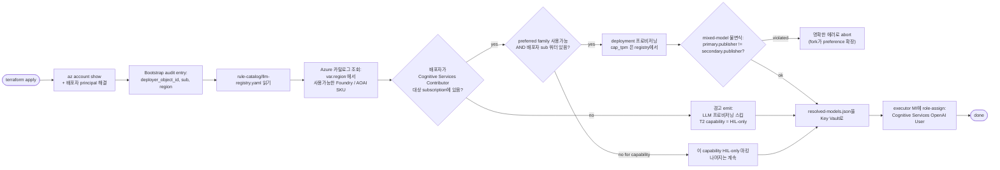

# Dev/Deploy Parity - 로컬 Fake vs Azure-First 프로비저닝

**목표**: FDAI의 모든 기능이 **개발자 랩탑에서 Azure 리소스 하나 없이 종단으로
동작**해야 하고, 동시에 Azure에 배포하면 **배포자의 Azure 권한과 리전 카탈로그가 어떤 LLM
(기타 리소스 포함) 이 프로비저닝될지를 결정**해야 한다. 두 명제가 동시에 참이어야 함:

- **Dev truth**: `dev-up.sh` + `uv run`으로 컨트롤 루프 전체가 오프라인 실행. 이 모드에서
  모든 LLM/클라우드 seam은 **결정론적 fake** 로 바인딩. 프로덕션과의 feature parity는
  "같은 T0 verdict, 같은 shadow-mode 결정, 같은 audit entry"로 측정 - T2 fake가
  결정론적이므로 T2 quality 자체는 의도적으로 낮음.
- **Deploy truth**: `terraform apply` 가 CSP-neutral 컨트랙트의 Azure 측 실현체를 생성.
  **LLM 부분은 배포자-스코프**: bootstrap resolver가 배포자 아이덴티티를 대상 리전
  카탈로그와 대조해 **배포자가 만들 권한이 있는 것만** 프로비저닝하고, resolved
  `{capability → deployment}` 매핑을 audit log에 기록.

두 모드 모두 **단일 코드 경로** 를 공유; composition-root 바인딩만 다름
([project-structure.md § Customization via Dependency Injection](project-structure-ko.md#customization-via-dependency-injection)).
실제 Azure 클라이언트 추가는 fork-side injection이고 `core/` 는 절대 안 건드림.

## 전수조사 - 로컬 동작 vs Azure 필요

2026-07-05 기준. "로컬" = fresh `git clone` 후 `bash scripts/dev-up.sh` + `uv run pytest`가
**Azure 자격증명 없이** 통과.

### 완전 로컬 동작 (Azure 불필요)

| 서브시스템 | 로컬 backend | 비고 |
|-----------|-------------|------|
| T0 결정론 엔진 | `opa` 바이너리 + Rego 정책 + rule catalog | 100% 오프라인; CI parity gate가 증명 |
| Rule catalog 로더 + shadow eval 파이프라인 | 파일시스템 YAML | 클라우드 콜 없음 |
| Risk gate + promotion registry | 인-메모리 `ActionPromotionRegistry` | seam 스왑 가능 |
| Executor + resource lock | 인-프로세스 | dev 모드에선 PR delivery 미배선 |
| Audit store | `InMemoryStateStore` (hash-chain 검증) | prod backend = Postgres |
| Event ingest + trust router | 인-프로세스 | 버스 미배선 |
| Verticals (Resilience / FinOps / Change Safety) | 순수 결정 모듈 | 클라우드 없음 |
| Quality gate | `StaticVerifier` + `MatchTypeCrossCheckModel` + `InMemoryGroundingSource` | [llm-strategy-ko.md § T2](llm-strategy-ko.md#t2--reasoning-tier-quality-gate-required) 참조 |
| T1 유사도 | `DeterministicEmbeddingModel` + `InMemoryPatternLibrary` | 해시 기반, 실제 임베딩 없음 |

### dev-up.sh 필요 (여전히 로컬)

| 서브시스템 | 로컬 backend | Prod backend |
|-----------|-------------|--------------|
| State store (통합 테스트) | `pgvector/pgvector:pg16` on `:5432` | Azure PostgreSQL Flexible + pgvector |
| Event bus (통합 테스트) | Redpanda on `:19092` (Kafka wire) | Event Hubs Kafka on `:9093` |

### 지금은 Azure가 필요 - 로컬 모드 추가 필요

| 서브시스템 | 상태 | 갭 |
|-----------|------|-----|
| Azure Resource Graph inventory | 어댑터 파일 존재 (`delivery/azure/inventory.py`) | 로컬 recorder 없음 / dev용 fixture-driven inventory backend 없음 |
| Managed Identity 토큰 (`WorkloadIdentity`) | Protocol만, 어댑터 없음 | Dev 모드용 결정론적 인-메모리 토큰 issuer 필요 |
| Key Vault secret provider (`SecretProvider`) | Protocol만, 어댑터 없음 | Dev 모드는 `.env` 에서 secret 읽어야 (이미 fork 패턴; `EnvSecretProvider`로 정식화) |
| GitOps PR publisher | 실제 GitHub 어댑터 존재 | Dev 모드 `RecordingRemediationPrPublisher` fake 이미 있음 ✅ |

### 아직 아예 안 만든 것

| 서브시스템 | 없는 산출물 | 결과 |
|-----------|-----------|------|
| Azure OpenAI / AI Foundry Terraform 모듈 | `infra/modules/llm/azure-openai/` | `T2_MODEL_ENDPOINT` env는 문서화되어 있으나 결코 채워지지 않음 |
| `rule-catalog/llm-registry.yaml` | [llm-strategy.md § Capability Preferences Registry](llm-strategy-ko.md#capability-preferences-registry) 에 설계됨 | capability→family 선호 소스 없음 |
| Bootstrap resolver CLI | [llm-strategy.md § Bootstrap Provisioner](llm-strategy-ko.md#bootstrap-provisioner) 에 설계됨 | 배포자 아이덴티티 + 리전 카탈로그 조회하는 게 없음 |
| `resolved-models.json` writer / reader | 설계됨 | 런타임 `capability → deployment` 매핑 없음 |
| Azure OpenAI 어댑터 (`AzureOpenAIEmbeddingModel`, `AzureOpenAICrossCheckModel`) | 미작성 | 프로덕션이 실제 LLM 바인딩 불가 |
| `AppConfig`의 `LlmConfig` | `schema.json` / `models.py` 에 없음 | 모드/엔드포인트/capability 선언 방법 없음 |
| Reconciler weekly Job | 설계됨 | drift / deprecation surface 안 됨 |

## Parity 컨트랙트 (MUST)

out-of-process 의존을 건드리는 모든 seam은 다음을 갖춰야:

1. **`shared/providers/` 의 Protocol** - 중립 wire contract. `core/` 는 Protocol만 import.
   `EventBus`, `StateStore`, `SecretProvider`, `WorkloadIdentity`, `Inventory` 및 LLM seam
   (`EmbeddingModel`, `CrossCheckModel`, `VerifierPolicy`, `GroundingSource`) 이미 준수.
2. **로컬 fake 구현** - 결정론적, 인-프로세스, secret-free. `runtime.env == "dev"` OR
   `llm.mode == "local-fake"` OR Azure 측 산출물 (예: `resolved-models.json`) 부재 시 자동
   선택.
3. **Azure 어댑터** - `delivery/azure/` 하위 (절대 `core/` 아님). `runtime.env in
   ("staging","prod")` AND Azure 측 산출물 존재 AND 배포자 아이덴티티가 해당 capability에 대해
   유효한 deployment를 해결한 경우 선택.
4. **미스매치 시 fail-fast** - `runtime.env == "prod"` 인데 Azure 어댑터가 capability 해결
   실패하면 프로세스가 시작을 거부. 프로덕션에서 로컬 fake로의 조용한 fallback은 **금지**
   ([llm-strategy.md § Bootstrap Provisioner](llm-strategy-ko.md#bootstrap-provisioner) 의
   "no HIL-silent fallback" 룰과 일치).

파이프라인을 exercise하는 모든 테스트는 (1)+(2) 모드로 실행 → CI parity gate가 Azure 토큰
필요 없음.

## 배포자-스코프 LLM 프로비저닝

`terraform apply` 시점의 resolver 동작:

**배포자 권한 게이트** (resolver가 카탈로그 건드리기 전 확인):

| 체크 | 실패 모드 | 후속조치 |
|------|---------|--------|
| `az account show` 가 로그인된 principal 반환 | abort - 배포자가 `az login` 필요 | 한 줄 진단 |
| Principal이 대상 subscription에 `Cognitive Services Contributor` (또는 `Owner`) 보유 | LLM 프로비저닝 스킵, 모든 `t2.*` 및 `t1.judge` capability를 `hil-only` 로, 경고 emit | fork가 role 부여 후 재실행 |
| 리전이 각 capability preference 중 최소 하나 family 노출 | 해당 capability만 `hil-only` 마킹, 경고 | fork가 `llm-registry.yaml` preference 확장 후 재실행 |
| 배포자 subscription이 요청한 `capacity_tpm` 쿼터 보유 | 요청의 ≥ 20% 이상 큰 최대 사용가능 capacity로 축소; 미만이면 거부 | fork가 쿼터 증가 요청 |
| Mixed-model 불변식 (`t2.reasoner.primary.publisher != t2.reasoner.secondary.publisher`) resolve 후 만족 | **abort** - quality gate 통과 못하는 T2 tier 부분 배포 안 함 | fork가 preference 조정 |

Resolver의 결정은 배포자 `object_id`, 리전, resolved capability map과 함께 **한 개의
bootstrap audit entry** 로 기록. 이 entry는 클린 replay: 동일 sub + region + registry로
resolver 재실행 시 동일 매핑 산출 (idempotent).

## 작업 계획 (phased, additive)

각 phase는 head에서 빌드/테스트 가능한 상태 유지. 멀티 클라우드는 **TBD**
([copilot-instructions § Implementation Focus](../../.github/copilot-instructions.md#implementation-focus-must)).

**2026-07-05 기준 상태**: W-A 이서 W-G까지 **배포됨**; W-H (문서 동기화)는
이 문서 초안과 함께 배포된 상태; W-I (매주 reconciler job)는 연기. 각 작업 항목은
실제 럭딩된 범위(코드, 테스트, 게이트 커버리지)를 반영.

### W-A: LLM용 Config schema + dev-mode 플래그 ✅  *(baseline, 배포)*

- `src/fdai/shared/config/schema.json` + `models.py` 에 `LlmConfig` 추가:
  - `mode`: `local-fake` | `azure` (`runtime.env == "dev"` 일 때 default `local-fake`).
  - `resolved_models_path`: 옵셔널 KV secret 이름 또는 파일시스템 경로.
  - `capabilities`: capability 이름 리스트 (`t1.embedding`, `t1.judge`,
    `t2.reasoner.primary`, `t2.reasoner.secondary`) - registry를 미러.
- Fail-fast validator: `mode == "azure"` 는 `resolved_models_path` 필수.
- 테스트: schema + pydantic validator.

### W-B: `rule-catalog/llm-registry.yaml` + schema ✅ *(catalog-as-code, 배포)*

- 신규 파일: 업스트림 기본값 있는 `rule-catalog/llm-registry.yaml` (mini → Opus tier).
- JSON Schema: `rule-catalog/schema/llm-registry.schema.json`.
- Python 로더: `fdai.rule_catalog.schema.llm_registry` - 다른 곳에서 쓰는 aggregating
  fail-close 패턴 사용 (`exemption.py` 참고).
- 테스트: schema 검증, mixed-model 불변식 체크.

### W-C: Bootstrap resolver CLI ✅ *(배포자-스코프, 배포)*

- 신규: `src/fdai/rule_catalog/schema/llm_resolver_cli.py`.
- 입력: `--registry`, `--region`, `--subscription-id`, `--dry-run`, `--out`.
- `DefaultAzureCredential` 사용 (배포자의 캐시된 CLI 자격).
- 조회:
  - `az cognitiveservices account list-models --location <region>` (SDK 경유) 로
    가용 family.
  - 대상 subscription의 role assignments (`azure-mgmt-authorization` 경유) 로 권한 게이트.
- `resolved-models.json` emit (또는 `--dry-run` 은 stdout).
- [배포자-스코프 LLM 프로비저닝](#배포자-스코프-llm-프로비저닝) 의 모든 체크 강제.
- 테스트: 두 SDK 클라이언트 mock; precedence + mixed-model 불변식 + `hil-only` fallback +
  동일 입력 idempotent 출력 assert.

### W-D: Azure OpenAI Terraform 모듈 + preflight ✅ *(infra, 배포)*

- 신규: `infra/modules/llm/azure-openai/`.
  - `main.tf`: `azurerm_cognitive_account` (kind=`OpenAI`) + 입력 변수의
    `resolved_models.json` 으로부터 N개 `azurerm_cognitive_deployment`.
  - `variables.tf`: `enable_llm` (default `false` - 최소 배포도 성공하도록),
    `resolved_models` (resolver 로부터의 object list).
  - `outputs.tf`: `endpoint`, `deployments` map, `resource_id`.
- Role assignment: executor MI → account의 `Cognitive Services OpenAI User`.
- 루트 `infra/main.tf` 에서 `var.enable_llm` 조건부로 모듈 wire.
- `infra/README.md` 갱신: resolver 먼저 → `enable_llm=true` 로 `terraform apply`.

### W-E: Azure OpenAI 어댑터 클래스 ✅ *(delivery, 배포)*

- `src/fdai/delivery/azure/llm/embeddings.py` - `EmbeddingModel` 을 구현하는
  `AzureOpenAIEmbeddingModel`, `openai.AzureOpenAI` (async 클라이언트) + `DefaultAzureCredential`.
- `src/fdai/delivery/azure/llm/cross_check.py` - `CrossCheckModel` 구현
  `AzureOpenAICrossCheckModel`.
- 타임아웃, retry-after honouring, structured output (`response_format={"type":"json_schema"}`)
  - [llm-strategy.md § Provider Abstraction](llm-strategy-ko.md#provider-abstraction) 참조.
- 테스트: `httpx.MockTransport` + 녹화 fixture - 라이브 네트워크 없음.

### W-F: Composition-root wiring ✅ *(binding, 배포)*

- `Container` 확장: `embedding_model: EmbeddingModel`, `cross_check_models`,
  `verifier_policy`, `grounding_source` 필드.
- `default_container(config)` 가 `config.llm.mode` 검사:
  - `local-fake` → 결정론적 fake 바인딩.
  - `azure` → `delivery/azure/llm/` 로부터 어댑터 import, `resolved-models.json` 로드,
    capability별 바인딩. 엔트리 부재 시 `ConfigError` raise (fail-fast).
- 테스트: 양쪽 branch; `local-fake` 가 `delivery.azure.llm` 을 import 안 함 assert.

### W-G: Dev-mode 아이덴티티 + secret + inventory 어댑터 ✅ *(parity 충전, 배포)*

- `shared/providers/testing/` 의 `EnvSecretProvider` (dev 사용 반영해
  `shared/providers/local/` 로 이름 변경).
- `LocalWorkloadIdentity` - dev-mode에서 어댑터가 수락하는 인-메모리 OIDC 토큰 issue (네트워크 없음).
- `FileFixtureInventory` - fork 가 생성자에 넘긴 어떤 YAML fixture 든 (`fixture=Path(...)`) 에서 `Resource` 레코드를 읽는다. 업스트림은 시드 fixture 를 배송하지 않으며, 권장 컨벤션은 `tests/scenarios/inventory/*.yaml` (frozen scenario replay 옆) 이라 verticals 가 ARG 없이 dry-run 가능.
- 테스트 + docstring이 정확한 fork-side 패턴 시연.

### W-H: 문서 동기화  *(이 phase)*

- ✅ 이 문서 자체.
- [deploy-and-onboard.md § Runtime Configuration Matrix](deploy-and-onboard-ko.md#runtime-configuration-matrix)
  에 `LLM_MODE`, `LLM_RESOLVED_MODELS_PATH` 추가.
- [deploy-and-onboard.md § Azure Resource Inventory](deploy-and-onboard-ko.md#azure-resource-inventory-minimum-set)
  에 row 11 (Azure OpenAI, opt-in) 추가.
- [tech-stack.md § Local Development](tech-stack-ko.md#local-development) 를 명시적으로
  "dev에서 LLM은 기본 fake 유지"로.
- [llm-strategy.md § Bootstrap Provisioner](llm-strategy-ko.md#bootstrap-provisioner) 를
  배포자-권한 게이트에 대해 이 문서 참조로.

### W-I: Reconciler weekly Job  *(later phase - deferred)*

Future work로 유지. 전체 설계는 이미
[llm-strategy.md § Reconciler Job](llm-strategy-ko.md#reconciler-job) 에 있음;
`infra/modules/compute/container-apps-job/` 재사용 + Python 엔트리로 shipping.

## Fork-Side 오버라이드 지점

위 모든 게 customer-agnostic 유지. Fork는 `core/` 를 안 건드리고 커스텀:

- 리전/컴플라이언스 오버라이드 있는 자체 `llm-registry.yaml` 제공.
- fork의 subscription을 가리키는 `AZURE_TENANT_ID` / `AZURE_SUBSCRIPTION_ID` env 제공.
  **이 리포는 그 값들을 절대 저장 안 함.**
- 추가 LLM 프로바이더 (예: Anthropic 직접 API) 등록: composition root에서 fork 소유
  `CrossCheckModel` 구현 바인딩 - [llm-strategy.md § Mixed-Model Family Strategies](llm-strategy-ko.md#mixed-model-family-strategies)
  의 `azure-foundry` / `external` / `hil-only` 토글.

## 검증 게이트

각 작업 항목은 CI에서 증명 가능해야:

- `runtime.env == "dev"` 종단 pytest 실행이 **`delivery.azure.*` 모듈을 zero import**
  (`scripts/check-core-imports.sh` 로 강제 - dev-mode 픽스처에서 `delivery.azure.llm.*`
  import 게이팅 추가).
- `Reader` 롤만 있는 fresh subscription에서 `enable_llm=false` 로 Terraform plan 성공 →
  LLM 모듈이 정말 opt-in 임을 증명.
- 녹화된 리전 카탈로그에 대한 resolver dry-run이 stable `resolved-models.json` 해시 →
  idempotency 증명.

## Open Questions

- **`resolved-models.json` 이 런타임에 어디 사나?** 옵션: Key Vault secret, ACR attestation,
  컨테이너 이미지 내 파일시스템. 선호: Key Vault (기존 secret contract에 맞음).
- **로컬 Ollama / LM Studio 경로를 두 번째 dev 모드로 추가할 가치?** 지금은 아님 -
  결정론 fake로 correctness 테스트 완전 parity; "의미론적" dev 모드는 composition root
  churn 없이 나중에 landing 가능.
- **Reconciler 알림 채널** - Teams로 가정; W-I 시점에 확정.
