# FinOps 패키지 전달 계획

이 계획은 FDAI를 패키지 callback 집합으로 축소하지 않고 독립적으로 빌드되는 비용 거버넌스
패키지를 전달합니다. 전달 순서는 exact 온톨로지 의미에서 시작해 고정된 에이전트의 모든 책임을
타입이 지정된 이벤트로 연결하고 관찰 모드에서 자율 종료를 입증한 뒤 패키지 소유권을 전환합니다.

> **아키텍처 경계:** 규범적인 패키지 계약은 [온톨로지 기반 FinOps 패키지
> 아키텍처](../architecture/finops-package-architecture-ko.md)에 있습니다. 결정 프레임과 15개
> 에이전트 choreography는 [FinOps 자율
> 운영](../architecture/finops-autonomous-operations-ko.md)에서 소유합니다.
> 구독 분석, 리소스 수준 SKU 결정, 절감액 귀속 및 Console 작업 영역은
> [FinOps 리소스 효율 및 SKU 결정](../architecture/finops-resource-efficiency-ko.md)에서
> 소유합니다.
>
> **상태 규칙:** 이 문서는 전달 계획이며 wave가 완료되었다는 근거가 아닙니다. 현재 전달 상태는
> [구현 ledger](../../roadmap-implementation/fork-and-sequencing/finops-package-delivery-plan.md)에
> 기록합니다.

## 설계 개요

핵심 경로는 파일 시스템보다 의미와 운영을 우선합니다.

W1과 W2는 W0 이후 독립적으로 진행할 수 있습니다. 두 wave가 하나의 매니페스트, 온톨로지
release, 자산 inventory 및 안정적인 식별자 집합으로 수렴한 뒤에만 런타임 활성화를 시작합니다.

## 현재 기준선

| 영역 | 현재 근거 | 전달 미비점 |
|------|-----------|-------------|
| FinOps 가드 | `core/verticals/cost_governance/finops.py`, 11개 집중 테스트 | 순수 로직은 독립 배포판이나 실제 조정기가 아닙니다. |
| 비용 조언 | Njord 비용 샘플과 이상 동작, `CostEstimator` Protocol과 컨트롤 루프 해석 | 중복 비용 표현과 패키지 연결에는 하나의 검토된 계약이 필요합니다. |
| 온톨로지 | 비용, 서비스, 복구, 아키텍처, 토폴로지, 대안, 효과 및 결과 선언이 있습니다. | 패키지 의미 프로필과 end-to-end 의도 인스턴스가 함께 고정되어 있지 않습니다. |
| 에이전트 런타임 | 고정 pantheon, 소유 토픽, 동시성, 판단, 실행, 감사 및 복구 기반이 있습니다. | 완전한 15개 에이전트 책임 모델을 입증하는 보존된 FinOps trace가 없습니다. |
| 자산 | 비용 Rule, Policy, ActionType, 시나리오 및 `cost-aware-remediation` Workflow가 있습니다. | 소유권, 중복 방지, 패키지 리소스 로드 및 동등성 검사에는 inventory가 필요합니다. |
| 확장 수명 주기 | 다이제스트에 연결된 비활성 설치와 원자적 기능 활성화가 있습니다. | 온톨로지 프로필, 자산 및 프로바이더 요구 사항을 원자적으로 검증하는 vertical 번들이 없습니다. |

## 전달 규칙

- 명시적인 호환성 결정이 새 버전을 승인하지 않는 한 안정적인 Object, Link, Rule, Workflow,
  ActionType, Topic 및 Audit 식별자를 모두 보존합니다.
- Core가 `fdai_cost_governance`에 의존하지 않게 합니다. 조립에서만 선택적 패키지를 가져옵니다.
- 빌드, 활성화, replay, 시나리오 근거 및 롤백에 하나의 exact 온톨로지 release와 하나의 정규
  패키지 매니페스트를 사용합니다.
- 모든 새 Rule과 Action을 관찰 모드로 유지합니다. 패키지 활성화로 promotion할 수 없습니다.
- 근거를 소비하는 모든 wave에서 누락, 오래됨, 불완전, 충돌, 합성, 중복, replay, 순서 변경 및
  프로바이더 unavailable 사례를 검증합니다.
- 독립 결과 정산과 최종 감사가 있기 전에는 자율 운영을 주장하지 않습니다.

## W0 - Inventory와 계약 고정

현재 비용 거버넌스 산출물과 코드 소유자를 모두 포함하는 machine-readable inventory를 만듭니다.
각 항목을 Core 커널, 패키지 소유 일반 vertical 자산, 배포 소유 값 또는 폐기할 중복으로
분류합니다.

전달 항목:

- Source, Test, Rule, Policy, ActionType, Workflow, Scenario, Projection 및 Provider inventory
- 안정적인 식별자와 import 경로 호환성 맵
- Njord 비용 모델을 `CostEstimator` 계약으로 조정하는 결정
- Allow, Hold, Deny, No-op, Approval, Execute, Rollback 및 Unverified-effect 결과를 포함하는
  기준 후보 corpus
- 패키지 버전, 호스트 범위, 온톨로지 release 범위 및 롤백 호환성 정책

종료 게이트:

- 모든 inventory 항목에 미래 소유자가 정확히 하나 있고 고객 값이 없습니다.
- 중복 또는 끊어진 참조는 inventory 검사를 통과하지 못합니다.
- 고정 corpus가 콘텐츠 다이제스트를 기록하면서 현재 Core 구현에서 replay됩니다.

## W1 - 온톨로지 프로필과 역량

도메인 로직을 이동하기 전에 패키지 의미 프로필을 만듭니다. 프로필은 기존 커널 선언을 참조하며
검토된 패키지 소유 쿼리 프로필이나 vertical 데이터만 추가합니다.

전달 항목:

- Target, Service, Workload, Environment, Objective, Evidence, Decision, ActionType,
  Expected-effect, Run 및 Outcome 선언의 exact 참조
- 비용 이상, right-sizing, cleanup, budget 및 settlement 질문에 사용하는 범위가 제한된 ObjectSet과
  근거 함수 프로필
- 정확한 결합 집합 식별자를 사용하는 구독 범위 포괄 범위 및 리소스 수준 결정 프로필
- VM, 데이터베이스, Kubernetes, 애플리케이션 플랫폼 및 Storage 리소스를 위한 버전 관리
  서비스 기능군별 크기 조정 프로필
- 유효 시간이 있는 `CostObjective`, `ServiceObjective`, `RecoveryObjective`,
  `ArchitectureConstraint`, `Ownership` 및 `ChangeWindow` fixture
- FinOps 자율 운영의 F1-F8 역량 fixture
- 의미 프로필 정규화와 SHA-256 식별자

종료 게이트:

- 하나의 exact 온톨로지 release에서 F1-F8 질문이 모두 통과합니다.
- 반대 방향 Link, 오래된 Intent, Unknown Service, 잘린 Graph, 혼합 Release, 충돌하는 Fact,
  누락된 Source Authority 및 검증되지 않은 Outcome이 자율성을 명시적으로 낮춥니다.
- Ontology Query, Function, Context Snapshot 또는 Profile이 실행 권한을 노출하지 않습니다.

## W2 - 독립 패키지 기반

`extensions/cost-governance/`를 네임스페이스 `fdai_cost_governance`를 사용하는
`fdai-cost-governance` 배포판으로 만듭니다. 빌드와 리소스 동등성을 입증하기 전에는 런타임
동작을 이동하지 않습니다.

전달 항목:

- `pyproject.toml`, 패키지 버전, 타입이 지정된 공개 facade, `py.typed`, README 및 집중 테스트
- 쿼리 프로필과 패키지 소유 카탈로그 자산의 패키지 리소스 매니페스트와 로더
- Core의 변경할 수 없는 `VerticalPackageManifest`와 `VerticalPackageBundle` 계약
- 비활성 우선 trust, digest, host, ontology, provider, duplicate-id 및 cross-reference 검사
- wheel과 source distribution 재현성 검사

종료 게이트:

- wheel과 source distribution이 저장소 상대 파일 읽기 없이 빌드됩니다.
- 활성화 실패가 현재의 변경할 수 없는 런타임을 바꾸지 않습니다.
- Core가 `fdai_cost_governance` 모듈을 가져오지 않습니다.
- 패키지가 없어도 기본 컨트롤 플레인이 정상이며 비용 거버넌스 unavailable을 보고합니다.

## W3 - 타입이 지정된 15개 에이전트 choreography

패키지 동작을 기존 pantheon 소유자와 토픽에 연결합니다. Topic, Agent, 직접 Agent 호출 또는 공유
변경 가능 Workflow 객체를 추가하지 않습니다.

전달 항목:

- 범위가 제한된 비용과 리소스 근거를 위한 Huginn ingress 어댑터
- Heimdall 근거 상태, 이상, 예측 및 독립 효과 hook
- Njord 소유 `object.cost-anomaly`와 `object.budget` 게시, 패키지 연결 `CostEstimator`, Freyr
  용량 반대 목표 연결
- 자동 실험 실행이 없는 조건부 Loki 실험 제안 연결
- Forseti 컨텍스트 구체화, 대안 필터링, 판단 및 Odin 중재
- 책임 모델에 설명된 Thor, Var, Vidar, Saga, Muninn, Norns, Mimir 및 Bragi 경로이며 각
  경로는 기존 소유 토픽 또는 읽기 전용 port를 사용합니다.

종료 게이트:

- 하나의 시나리오가 15개 책임에 모두 도달할 수 있음을 입증하며 각 토픽의 writer는 하나입니다.
- 관련 없는 subscriber가 겹쳐 실행되고 느린 consumer가 sibling을 차단하지 않으며 리소스별
  변경 순서를 유지합니다.
- Duplicate, Reorder, Restart, Backpressure, Deadline 및 Dead-letter 테스트가 중복 변경 없이
  하나의 최종 결과에 도달합니다.
- Bragi와 모든 패키지 코드에는 executor 경로가 없으며 Thor가 유일한 변경 principal입니다.

## W4 - 자율 결정과 복구

누락된 사실이 즉시 사람 작업이 되지 않도록 범위가 제한된 복구 단계를 구현합니다.

전달 항목:

- 전체 및 단계별 deadline을 적용한 새로운 컨텍스트 획득과 독립 출처 fallback
- 강한 제약을 적용한 대안 제거와 더 작은 대상, 기간, 용량 또는 영향 대안
- No-action 기준선, 명시적 hold deadline 및 타입이 지정된 차단
- 정책을 인식하는 상시 권한 검사와 남은 Var 승인 경로
- 효과 전에 Saga 의도 감사, hard dependency 실패 시 sticky 관찰 모드

종료 게이트:

- 각 복구 단계에 Success, Unavailable, Timeout, Conflict 및 Exhausted fixture가 있습니다.
- 재시도가 범위를 넓히거나 새 가설 없이 실제 요청을 반복하거나 권한을 높이지 않습니다.
- No-op, Deny, Hold, Approval 및 Execute를 별도로 측정할 수 있습니다.
- Saga 또는 Vidar가 없으면 변경이 차단되고 Var의 침묵은 실행을 허용하지 않습니다.

## W5 - 효과 정산과 통제된 학습

각 예상 효과를 독립 관측으로 종료하고 예상 절감액이 보고된 결과가 되지 않도록 합니다.

전달 항목:

- 다중 효과 비용, 용량, 서비스 및 복구 예상 계보
- 정산 horizon, telemetry grace, 완전성 증적, 개입 감지 및 censored 또는 평가 불가능 결과
- Vidar를 통한 중단 조건과 롤백 호출 및 독립적인 복구 후 관측
- Saga 최종 종료, Muninn replay 색인, 균형 잡힌 Norns cohort 및 Mimir 검증
- no-op과 정책 제외 에피소드를 별도로 보고하는 자율성 및 guard 지표

종료 게이트:

- 실행 출력이 관측 효과를 충족할 수 없습니다.
- 모든 예상 효과를 검증, 명시적 실패, censored 또는 평가 불가능으로 분류합니다.
- 학습은 Raw Telemetry, 불완전한 Lineage, 단일 결과 Cohort 및 Unverified Case를 차단합니다.
- 후보는 별도 promotion 전까지 회귀와 shadow 검토 과정에서 비활성으로 남습니다.

## W6 - Shadow 동등성, 소유권 전환 및 롤백

두 활성 writer를 허용하지 않고 동일한 고정 컨텍스트에서 이전 구현과 패키지 구현을 실행합니다.
결정, 이유, 토픽, 감사 payload 및 온톨로지 계보를 비교합니다.

전달 항목:

- 이전 import와 새 import의 호환 facade 및 deprecation 기간
- dual-read, single-publish 동등성 harness
- 중복 방지가 포함된 exact 자산 소유권 전환
- N-1 패키지 호환성과 이전 버전 롤백 연습
- 작업 replay 없이 등록을 제거하는 비활성 패키지 rebuild

종료 게이트:

- 필수 동등성 필드가 정확히 일치하거나 승인된 버전 계약이 각 차이를 설명합니다.
- 어느 에피소드도 두 구현에서 게시하지 않습니다.
- Disable, Failed Upgrade 및 Previous-version Rollback이 예상 런타임을 복원하고 감사 replay를
  보존합니다.
- 모든 운영 조립이 전환되기 전에는 Core 호환 facade 제거를 차단합니다.

## W7 - 운영 검증과 promotion 준비

범위가 제한된 배포 campaign에서 exact-revision 근거를 보존합니다. 이 wave는 시스템을
검증하지만 `ActionType`을 자동으로 promotion하지 않습니다.

종료 게이트:

- Package Install, Enable, Disable, Upgrade 및 Rollback 증적이 exact wheel, manifest,
  ontology release, runtime config 및 source revision을 연결합니다.
- 실제 관찰 모드 cohort가 sample count, autonomy outcome, recovery attempt, approval reason,
  effect settlement, rollback, policy escape 및 objective regression을 보고합니다.
- 독립 검토자가 package activation을 승인하고 각 ActionType promotion을 별도로 검토합니다.
- 정책 이탈 0건, 완전한 hard-dependency 근거 및 테스트된 롤백은 계속 release 차단 조건입니다.

## 검증 매트릭스

| 계층 | 집중 입증 항목 |
|------|----------------|
| 패키지 | Wheel과 sdist 빌드, 소스 checkout 없는 import, manifest와 resource digest 실패 |
| 온톨로지 | F1-F8 fixture, exact-release, direction, freshness, completeness, conflict 및 authority 검사 |
| 에이전트 | Pantheon parity, single-writer topic, 15개 consumer 전체, overlap, duplicate, reorder, restart 및 degradation |
| 결정 | T0 guard와 policy property, T1 exact-case reuse, T2 quality gate, hard constraint 및 arbitration |
| 작업 | 일곱 안전장치, 승인 분리, shadow no-mutation, idempotency, rollback 및 effect observation |
| 학습 | 완전한 lineage, 균형 잡힌 cohort, inert candidate, regression, shadow dwell 및 explicit promotion |
| 수명 주기 | Disabled install, atomic enable, incompatible hold, disable, upgrade, previous-version rollback 및 audit replay |

## 중단 조건

다음 상황에서는 전환을 멈추고 패키지를 비활성 상태로 유지합니다.

- 온톨로지 역량이 알 수 없음과 검증된 부재를 구분하지 못합니다.
- 패키지 handler가 연결된 에이전트가 소유하지 않는 객체를 게시합니다.
- 대안에서 보호되는 서비스 또는 복구 목표가 누락됩니다.
- 변경에 안전장치, hard dependency 또는 독립 효과 경로 중 하나가 없습니다.
- 동등성 검사에서 설명되지 않은 권한, 토픽, 감사 또는 결정 차이가 생깁니다.
- 자율성 증가와 정책 이탈, 목표 회귀 또는 정산 누락이 동시에 발생합니다.

## 완료 정의

패키지를 독립적으로 빌드하고, 활성화가 원자적이며, exact 온톨로지 프로필이 F1-F8에 답하고,
15개 책임이 기존 토픽을 통해 작동하고, 적격 반복 사례가 범위가 제한된 자율 경로를 따르고, 변경
상태 에피소드가 모두 정산되거나 명시적으로 대기하고, 학습이 통제되며, 전환과 롤백이 하나의 고정
revision에서 입증되면 이 계획이 완료됩니다. 적용 모드는 계속 별도 ActionType별 promotion 근거가
필요합니다.

## 관련 문서

| 자세히 알아볼 내용 | 문서 |
|--------------------|------|
| 패키지 아키텍처 | [온톨로지 기반 FinOps 패키지 아키텍처](../architecture/finops-package-architecture-ko.md) |
| 자율 운영 | [FinOps 자율 운영](../architecture/finops-autonomous-operations-ko.md) |
| 전달 구현 상태 | [FinOps Package Delivery Plan implementation ledger](../../roadmap-implementation/fork-and-sequencing/finops-package-delivery-plan.md) |
| 기존 통합 루프 범위 | [Phase 3 통합 컨트롤 루프](../phases/phase-3-integrated-loop-ko.md) |
| 기존 교차 에이전트 비용 흐름 | [에이전트 Workflow](../agents/agent-workflows-ko.md#1-cost-aware-fix) |
