# FinOps Package Delivery Plan

This plan delivers an independently built Cost Governance package without reducing FDAI to a set
of package callbacks. The delivery order starts with exact ontology meaning, connects all fixed
agent responsibilities through typed events, proves autonomous closure in observation mode, and
only then cuts over package ownership.

> **Architecture boundary:** The normative package contract is
> [Ontology-Grounded FinOps Package Architecture](../architecture/finops-package-architecture.md).
> The decision frame and 15-agent choreography are owned by
> [FinOps Autonomous Operations](../architecture/finops-autonomous-operations.md).
> Subscription analysis, resource-level SKU decisions, savings attribution, and the Console
> workspace are owned by
> [FinOps Resource Efficiency and SKU Decisions](../architecture/finops-resource-efficiency.md).
>
> **Status rule:** This is a delivery plan, not evidence that a wave is complete. Current delivery
> state is recorded in the [implementation ledger](../../roadmap-implementation/fork-and-sequencing/finops-package-delivery-plan.md).

## Design at a glance

The critical path is semantic and operational, not filesystem-first:

W1 and W2 can proceed independently after W0. Runtime activation begins only when both converge on
one manifest, ontology release, asset inventory, and stable identifier set.

## Current baseline

| Area | Evidence today | Delivery gap |
|------|----------------|--------------|
| FinOps package | `extensions/cost-governance/`; package build, resource, image, and lifecycle tests | Local build and lifecycle mechanics pass; governed image and lifecycle receipts remain W7 evidence. |
| Cost advice | Injected Njord advisory provider, activation-gated collection, and separate signed effect estimates | A live-authoritative provider cohort remains unrecorded. |
| Ontology | Exact semantic profile, additive declarations, and F1-F8 positive and negative fixtures | The profile is locally implemented; live evidence still must bind the same release. |
| Agent runtime | Fixed pantheon, owned topics, all-responsibility replay, recovery, settlement, and learning tests | Source and synthetic evidence do not prove operational autonomy. |
| Assets | Package-owned 12 rules, 12 policies, 12 fix templates, and one workflow with stable ids | The deprecated Core facade remains only for parity until governed rollback evidence permits removal. |
| Extension lifecycle | Atomic availability, enablement, upgrade, disable, and N-1 rollback mechanics | Live-authoritative receipts and independent promotion decisions remain open. |

## Delivery rules

- Preserve every stable object, link, rule, workflow, ActionType, topic, and audit identifier unless
  an explicit compatibility decision approves a new version.
- Keep Core independent of `fdai_cost_governance`; only composition imports the optional package.
- Use one exact ontology release and one canonical package manifest for build, activation, replay,
  scenario evidence, and rollback.
- Keep all new rules and actions in observation mode. Package enablement cannot promote them.
- Validate missing, stale, incomplete, conflicting, synthetic, duplicate, replayed, reordered, and
  provider-unavailable cases in every wave that consumes evidence.
- Do not claim autonomous operation until independent outcome settlement and terminal audit exist.

## W0 - Inventory and contract freeze

Create a machine-readable inventory of every current Cost Governance artifact and code owner.
Classify each item as Core kernel, package-owned generic vertical asset, deployment-owned value, or
retired duplicate.

Deliverables:

- source, tests, rule, policy, ActionType, Workflow, scenario, projection, and provider inventory;
- stable identifier and import-path compatibility map;
- Njord cost model to `CostEstimator` contract reconciliation decision;
- baseline candidate corpus covering allow, hold, deny, no-op, approval, execute, rollback, and
  unverified-effect outcomes;
- package version, host range, ontology release range, and rollback compatibility policy.

Exit gate:

- every inventoried item has exactly one future owner and no customer value;
- duplicate or dangling references fail the inventory check;
- the frozen corpus replays against the current Core implementation with content digests recorded.

## W1 - Ontology profile and competency

Build the package semantic profile before moving domain logic. The profile references existing
kernel declarations and adds only reviewed package-owned query profiles or vertical data.

Deliverables:

- exact references for target, service, workload, environment, objective, evidence, decision,
  ActionType, expected-effect, run, and outcome declarations;
- bounded ObjectSet and evidence-function profiles for cost anomaly, right-sizing, cleanup, budget,
  and settlement questions;
- subscription-scope coverage and resource-level decision profiles with exact coupled-set identity;
- versioned service-family sizing profiles for VM, database, Kubernetes, application platform, and
  storage resources;
- effective-time `CostObjective`, `ServiceObjective`, `RecoveryObjective`,
  `ArchitectureConstraint`, `Ownership`, and `ChangeWindow` fixtures;
- F1-F8 competency fixtures from FinOps Autonomous Operations;
- semantic-profile canonicalization and SHA-256 identity.

Exit gate:

- all F1-F8 questions pass on one exact ontology release;
- reversed links, stale intent, unknown service, truncated graph, mixed releases, conflicting facts,
  missing source authority, and unverified outcomes lower autonomy explicitly;
- no ontology query, function, context snapshot, or profile exposes execution authority.

## W2 - Independent package foundation

Create `extensions/cost-governance/` as the `fdai-cost-governance` distribution with namespace
`fdai_cost_governance`. Move no runtime behavior until build and resource parity are proven.

Deliverables:

- `pyproject.toml`, package version, typed public facade, `py.typed`, README, and focused tests;
- package-resource manifest and loaders for query profiles and package-owned catalog assets;
- immutable `VerticalPackageManifest` and `VerticalPackageBundle` contracts in Core;
- disabled-first trust, digest, host, ontology, provider, duplicate-id, and cross-reference checks;
- wheel and source distribution reproducibility checks.

Exit gate:

- wheel and source distribution build without repository-relative file reads;
- activation failure leaves the current immutable runtime unchanged;
- Core imports no `fdai_cost_governance` module;
- package absence keeps the base control plane healthy and reports Cost Governance unavailable.

## W3 - Typed 15-agent choreography

Bind package behavior to existing pantheon owners and topics. Do not add a topic, agent, direct
agent call, or shared mutable workflow object.

Deliverables:

- Huginn ingress adapters for bounded cost and resource evidence;
- Heimdall evidence-health, anomaly, forecast, and independent-effect hooks;
- Njord-owned `object.cost-anomaly` and `object.budget` publication, package-bound
  `CostEstimator`, and Freyr capacity counter-objective bindings;
- conditional Loki experiment proposal binding without automatic experiment execution;
- Forseti context materialization, option filtering, judgment, and Odin arbitration;
- Thor, Var, Vidar, Saga, Muninn, Norns, Mimir, and Bragi paths described by the responsibility
  model, each through its existing owned topic or read-only port.

Exit gate:

- one scenario proves all 15 responsibilities are reachable while each topic has one writer;
- unrelated subscribers overlap, slow consumers do not block siblings, and per-resource mutations
  remain ordered;
- duplicate, reorder, restart, backpressure, deadline, and dead-letter tests reach one terminal
  outcome without duplicate mutation;
- Bragi and all package code have no executor path, and Thor remains the sole mutation principal.

## W4 - Autonomous decision and recovery

Implement the bounded recovery ladder so a missing fact does not immediately become human work.

Deliverables:

- fresh-context reacquisition and independent-source fallback with total and per-stage deadlines;
- hard-constraint option removal and smaller target, duration, capacity, or impact alternatives;
- no-action baseline, explicit hold deadline, and typed denial;
- policy-aware standing-authorization check and residual Var approval path;
- Saga intent audit before any effect and sticky observation mode when hard dependencies fail.

Exit gate:

- each recovery step has success, unavailable, timeout, conflict, and exhausted fixtures;
- no retry widens scope, repeats a live request without a new hypothesis, or raises authority;
- no-op, deny, hold, approval, and execute remain separately measurable;
- missing Saga or Vidar blocks mutation, and silence from Var never permits execution.

## W5 - Effect settlement and governed learning

Close every expected effect against independent observation and prevent estimated savings from
becoming reported outcomes.

Deliverables:

- multi-effect cost, capacity, service, and recovery expectation lineage;
- settlement horizons, telemetry grace, completeness receipts, intervention detection, and
  censored or unscorable outcomes;
- stop-condition and rollback invocation through Vidar with independent post-recovery observation;
- Saga terminal closure, Muninn replay index, balanced Norns cohorts, and Mimir validation;
- autonomy and guard metrics with no-op and policy-excluded episodes reported separately.

Exit gate:

- execution output cannot satisfy an observed effect;
- every expected effect is verified, explicitly failed, censored, or unscorable;
- learning rejects raw telemetry, incomplete lineage, single-outcome cohorts, and unverified cases;
- a candidate remains inert through regression and shadow review until separate promotion.

## W6 - Shadow parity, ownership cutover, and rollback

Run old and package implementations over the same frozen contexts without allowing two active
writers. Compare decisions, reasons, topics, audit payloads, and ontology lineage.

Deliverables:

- old-to-new import compatibility facade and deprecation window;
- dual-read, single-publish parity harness;
- exact asset ownership cutover with duplicate prevention;
- N-1 package compatibility and previous-version rollback rehearsal;
- disabled package rebuild that removes registrations without replaying actions.

Exit gate:

- required parity fields match exactly or an approved versioned contract explains each difference;
- no episode publishes from both implementations;
- disable, failed upgrade, and previous-version rollback restore the expected runtime and preserve
  audit replay;
- Core compatibility facade removal remains blocked until all production compositions cut over.

## W7 - Operational validation and promotion readiness

Retain exact-revision evidence from a bounded deployment campaign. This wave validates the system;
it does not automatically promote an ActionType.

Exit gate:

- package install, enable, disable, upgrade, and rollback receipts bind the exact wheel, manifest,
  ontology release, runtime configuration, and source revision;
- a live observation-mode cohort reports sample counts, autonomy outcomes, recovery attempts,
  approval reasons, effect settlement, rollbacks, policy escapes, and objective regressions;
- independent reviewers approve package activation and separately review each ActionType promotion;
- zero policy escape, complete hard-dependency evidence, and tested rollback remain release blocks.

## Validation matrix

| Layer | Focused proof |
|-------|---------------|
| Package | Build wheel/sdist; import without source checkout; manifest and resource digest failures. |
| Ontology | F1-F8 fixtures; exact-release, direction, freshness, completeness, conflict, and authority checks. |
| Agents | Pantheon parity, single-writer topics, all 15 consumers, overlap, duplicate, reorder, restart, and degradation. |
| Decision | T0 guard and policy properties, T1 exact-case reuse, T2 quality gate, hard constraints, and arbitration. |
| Action | Seven safeguards, approval separation, shadow no-mutation, idempotency, rollback, and effect observation. |
| Learning | Complete lineage, balanced cohorts, inert candidate, regression, shadow dwell, and explicit promotion. |
| Lifecycle | Disabled install, atomic enable, incompatible hold, disable, upgrade, previous-version rollback, and audit replay. |

## Stop conditions

Pause cutover and keep the package disabled when any of these occurs:

- an ontology competency cannot distinguish unknown from verified absence;
- a package handler publishes an object its bound agent does not own;
- an option omits a protected service or recovery objective;
- a mutation lacks one safeguard, hard dependency, or independent effect path;
- parity produces unexplained authority, topic, audit, or decision differences;
- an autonomy increase coincides with policy escape, objective regression, or missing settlement.

## Completion definition

The plan is complete when the package builds independently, activation is atomic, the exact
ontology profile answers F1-F8, all 15 responsibilities operate through existing topics, eligible
repeatable cases follow the bounded autonomous path, every changed-state episode settles or stays
explicitly pending, learning remains governed, and cutover plus rollback are proven on one pinned
revision. Enforcement still requires separate per-ActionType promotion evidence.

## Related docs

| To learn about | Read |
|----------------|------|
| Package architecture | [Ontology-Grounded FinOps Package Architecture](../architecture/finops-package-architecture.md) |
| Autonomous operation | [FinOps Autonomous Operations](../architecture/finops-autonomous-operations.md) |
| Delivery implementation state | [FinOps Package Delivery Plan implementation ledger](../../roadmap-implementation/fork-and-sequencing/finops-package-delivery-plan.md) |
| Existing integrated-loop scope | [Phase 3 Integrated Control Loop](../phases/phase-3-integrated-loop.md) |
| Existing cross-agent cost flow | [Agent Workflows](../agents/agent-workflows.md#1-cost-aware-fix) |
