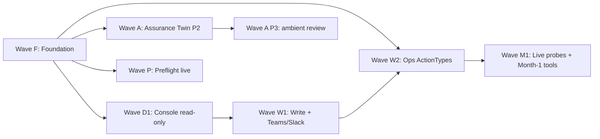

# 구현 계획 기록 (2026-07-06 표준 세트)

FDAI의 2026-07-06 작업 tranche를 조정한 historical record입니다. 당시 제안한
"표준 세트"와 단계별 wave를 보존하지만 현재 구현 authority는 각 subsystem owner 문서와
코드입니다.

- **표준 세트**: 2026-07-06에 추가된 설계 문서들에서 겹쳐 있던 추상을
  하나로 모으는 여섯 개의 설계 결정(R1, R2, R3, R4, R6, R7).
- **웨이브 플랜**: Foundation -> Console Day 1 -> Write set -> Ops
  ActionTypes -> Live probes에, Assurance Twin과 Preflight의 병렬 트랙 둘.

> 고객 비종속 범위: 아래의 모든 모듈 이름과 phase 라벨은 일반명이다.
> 포크는 `core/` 편집 없이
> [project-structure.md](../architecture/project-structure.md)의 DI seam으로만 조정한다.
>
> **현재 상태.** 이 문서의 "확정", "협상 불가", "shipped"는 당시 계획 snapshot입니다.
> 아래 reconciliation 이후의 section은 현재 backlog나 API 계약으로 사용하지 마세요.

## 현재 구현 reconciliation (2026-07-21)

| 결정 | 현재 상태 | 현재 authority |
|------|-----------|----------------|
| R1 | 채택 안 됨 | Axis A는 baseline이고 static blast/env를 포함한 ceiling axis는 독립적으로 autonomy를 낮춥니다. [`ceiling.py`](../../../src/fdai/core/risk_gate/ceiling.py)와 [execution-model-ko.md](../decisioning/execution-model-ko.md)가 authority입니다. |
| R2 | 채택 안 됨 | `ConversationCoordinator`는 명시적 `SystemConsoleTool` registry를 받습니다. ActionType catalog는 discovery evidence를 제공하지만 write tool의 자동 projection source는 아닙니다. |
| R3 | 채택 안 됨 | `LlmBindings` aggregate 아래 role-specific Protocol/adapter가 유지됩니다. 단일 `LlmBinding`/`AzureOpenAIChatBinding`은 없습니다. |
| R4 | 부분 구현 | `ScratchProjection`과 Assurance Twin consumer는 배포됐습니다. Deployment Preflight는 현재 `FeasibilityProbe`/`PreflightAnalyzer`를 사용합니다. |
| R6 | 채택 안 됨 | `operator_memory`는 독립 append/supersede store이며 audit-log materialized view가 아닙니다. |
| R7 | 채택 안 됨 | `ExecutionPath`는 `pr_manual`, `pr_native`, `direct_api`를 유지하고 `require_manual_merge` 필드는 없습니다. |

진행 중 작업과 미결정은 각 linked owner 문서의 status/open-decision section에서만 추적합니다.

## 1. 이 문서가 존재하는 이유

2026-07-06 트랜치에서 로드맵 문서 일곱 개가 새로 랜딩했다 (action-ontology,
execution-model, operator-console, assurance-twin, deployment-preflight,
prompt-composition 확장, db-dr-drill 런북). 나란히 놓고 보면 같은 개념이 두
곳에 동시에 나타나는 지점이 몇 개 있다.

- risk-classification 테이블의 `Axis A`는 이미 `blast_radius`와
  `environment`를 평가한다. 6-axis ceiling의 D(static_blast)와
  G(env)가 같은 신호를 다시 읽는다.
- 오퍼레이터 콘솔의 `ConsoleTool`과 ActionType의
  `trigger_kind=operator_request`는 같은 모양(name / argument_schema /
  RBAC 하한 / side_effect_class)을 두 개의 별도 카탈로그에서 표현한다.
- 계획된 다섯 개의 Azure OpenAI 어댑터(cross-check / proposer /
  critic / judge / conversational)가 전부 동일한 "role -> deployment id
  -> chat completions" 왕복을 한다.
- Assurance Twin의 `projection`과 Deployment Preflight의 스크래치
  분석기는 스코프만 다른 같은 프리미티브다.
- `operator_memory`와 `audit_log`는 둘 다 append-only에
  해시-어드레서블한 이벤트를 저장하며, 감사 로그는 이미 세션 상태의
  진리원(source of truth)으로 선언되어 있다.
- `pr_native`와 `pr_manual`은 병합 정책 라벨 하나만 차이 나는데도 서로
  다른 실행 경로로 모델링돼 있다.

표준 세트는 각 쌍을 하나의 권위 있는 표현으로 통합한다.

## 2. Historical 표준 세트 (2026-07-06 제안)

다음 항목은 당시 제안된 target shape입니다. 위 reconciliation과 충돌하면 현재 authority를
따릅니다.

### 2.1 R1 - Axis D와 G는 Axis A로부터의 파생만 담당

[execution-model.md § 2](../decisioning/execution-model.md#2-six-axis-ceiling--risk-classification-table)
의 6-axis ceiling은 이미 Axis A(risk-classification 테이블)를
`blast_radius`와 `environment`의 권위 있는 베이스라인으로 선언한다. R1은
그 권위를 의미적으로만이 아니라 구조적으로 만든다.

**계약 변경**

- RiskGate combinator는 `blast_radius`와 `environment` 기여를 Axis A
  내부에서 **정확히 한 번** 계산한다.
- 축 D(`static_blast`)와 G(`env`)는 가독성을 위해 `resolved_ceiling`에
  남지만, 그 level은 Axis A 판정에서 *파생*되며 독립 계산이 아니다.
  두 축 모두 ActionType `blast_radius` 블록이나 environment classifier를
  다시 조회하지 않는다.
- 로더 cross-check: Axis A가 이미 주장한 사실을 reason 문자열에 담는
  axis는 감사 엔트리에 Axis A rule id를 참조해야 한다
  (`derived_from: <matched_rule_id>`). 그래야 감사 리더가 파생 체인을
  볼 수 있고 D나 G를 두 번째 의견으로 오독하지 않는다.
- `min()` combinator는 그대로다 (4개의 독립 축 + A + 파생인 D와 G).

**효과**

- 신호당 분류 한 번. 튜닝 위치가 하나, A와 D가 서로 다른 답을 낼 위험
  없음.
- 프로퍼티 테스트: 모든 `FeatureVector`에 대해 Axis D와 G가 보고한 level은
  Axis A 판정 경로가 함의하는 값과 같다 (상수 복사가 아니라 테스트로 단언).

**비목표**

- [execution-model.md § 2](../decisioning/execution-model.md#2-six-axis-ceiling--risk-classification-table)
  에서 6-axis 어휘를 제거하는 것. 축별 분해를 오퍼레이터에게 보여주는
  글의 가치는 유지된다. 변경은 level이 어떻게 계산되는지에 국한된다.

### 2.2 R2 - ConsoleTool은 ActionType 카탈로그에 대한 프로젝션

오퍼레이터 콘솔의 `ConsoleTool` (write / approve / execute 계열)과
`trigger_kind in {operator_request, both}`인 ActionType은 같은 모양을
표현한다. R2는 ActionType 카탈로그를 이 툴들의 유일한 권위 있는 출처로
만든다.

**계약 변경**

- write 계열 콘솔 툴(`simulate_change`, `approve_hil`, `run_runbook`,
  `activate_break_glass`, 모든 `ops.*`, 모든 `governance.*`)은
  ActionType 카탈로그에서 `trigger_kind`로 필터한 **프로젝션**으로
  열거된다. 어떤 principal에 대한 `list_tools()`는
  `ActionTypeCatalog.filter(trigger_kind in {operator_request, both},
   principal_role >= min_role) union SystemConsoleTools`.
- 읽기 계열 툴(`describe_event`, `explain_verdict`, `explore_catalog`,
  `query_audit`, `query_inventory`)은 mutation에 매핑되지 않으므로
  작지만 별도의 셋(`SystemConsoleTool`, 다섯 개)으로 남는다. 각자
  argument_schema와 RBAC 하한을 가진 얇은 레지스트리를 유지하되
  ActionType은 아니다.
- 툴 발견 계약(name / description / parameters / rbac_floor /
  side_effect_class / failure_modes)은 그대로. ActionType으로부터
  계산되는 뷰가 될 뿐, 두 번째 진리원이 아니다.
- `ConsoleTool` Protocol은 카탈로그가 아니라 **표현 어댑터**가 된다.
  ActionType 호출을 래핑하고 콘솔 특화 동작(evidence_refs, preview
  텍스트, redaction 힌트)을 얹는다.

**효과**

- 카탈로그 하나, 로더 하나, 검증 표면 하나. 새 `ops.*` YAML을 추가하면
  구성된 RBAC 하한 하에 콘솔에 자동 노출된다. 미러 등록 불필요.
- [action-ontology.md § 9](../decisioning/action-ontology.md#9-audit-contract) 의
  감사 계약이 이미 매 dispatch에 `action_type_id`, `trigger_kind`,
  `side_effect_class`를 기록한다. 콘솔은 write 계열 호출에 대해
  별도 콘솔툴 감사 레코드를 쓸 필요가 없다.

**비목표**

- 읽기 계열 툴을 ActionType 모양에 억지로 넣는 것. `describe_event`와
  그 네 동료는 action이 아니다. 온톨로지에서 빼두는 편이 온톨로지를
  정직하게 유지한다.

### 2.3 R3 - role enum을 가진 통합 `LlmBinding`

계획된 다섯 Azure OpenAI 어댑터(`AzureOpenAICrossCheckModel`,
`AzureOpenAIProposer`, `AzureOpenAICritic`, `AzureOpenAIJudge`, 계획
중인 `AzureOpenAIConversationalModel`)는 같은 request / response
모양을 공유하고 prompt / deployment / role만 다르다. R3는 이들을 통합한다.

**계약 변경**

- 하나의 Protocol seam, `LlmBinding`. 고정된 enum에서 뽑은 `role`
  파라미터를 받는다: `t2_cross_check`, `proposer`, `critic`, `judge`,
  `narrator_t1`, `narrator_t2`.
- 하나의 Azure 구현체 `AzureOpenAIChatBinding`. role을 키로
  `resolved-models.json`에서 deployment id를 룩업한다. 기존
  role-specific 클래스는 공유 binding을 올바른 role로 호출하는 **얇은
  팩토리**가 된다 (하위호환용으로 한 릴리스 유지 후 제거).
- 컴포지션 루트 wiring은 하나의 Protocol -> 하나의 어댑터. 포크는
  대체 구현 하나를 바인딩해서 모든 LLM role을 교체한다.
- 프롬프트 컴포저
  ([prompts/composer.py](../../../src/fdai/core/prompts/composer.py))
  가 role 별 system prompt를 달리하는 유일한 컴포넌트다. binding은
  프롬프트 비종속.

**효과**

- role 추가 = `Enum.append + resolved-models.json 항목`. 새 어댑터
  클래스가 아니다. upstream은 다섯 번째 Azure OpenAI 어댑터를 도입하지
  않고 `narrator_t1`과 `narrator_t2`를 배송한다.
- 비용 텔레메트리(prompt_tokens, completion_tokens,
  model_deployment_id)가 모든 role에서 공통 모양으로 나온다. role
  간 비용 집계가 간단해진다.

**비목표**

- 배송된 `AzureOpenAICrossCheckModel / Proposer / Critic / Judge`
  클래스를 파괴적 릴리스로 통합하는 것. 마이그레이션은 가산적이다:
  `AzureOpenAIChatBinding` 도입, 기존 각 클래스를 그 위의 팩토리로
  재구현, 아무 caller도 직접 import하지 않게 되면 팩토리 제거.

### 2.4 R4 - Twin과 Preflight가 공유하는 `Projection` 프리미티브

Assurance Twin(subscription 전체)과 Deployment Preflight(단일 배포)는
둘 다 인벤토리 위에 read-only projection을 만들어 diff를 적용하고 T0
룰을 평가한다. R4는 그 프리미티브를 뽑아낸다.

**계약 변경**

- `shared/providers/projection.py`에 새 Protocol:

  ```python
  class ScratchProjection(Protocol):
      def apply_diff(self, diff: InventoryDiff) -> ScratchProjection: ...
      def evaluate(self, rules: RuleSet) -> Findings: ...
      # read-only, immutable, deterministic
  ```

- `core/deploy_preflight/analyzer.py`는 단일 타깃 diff로 프리미티브를
  소비한다.
- `core/assurance_twin/projection.py`는 subscription 전체 스냅샷을
  베이스라인으로 두고 리뷰용 per-change diff로 같은 프리미티브를
  소비한다.
- 두 소비자는 자체 outer 타입(`DeploymentReadinessReport`,
  `PostureAssessmentReport`)을 유지한다. projection 커널만 공유.

**효과**

- 결정성, 불변성, diff 리플레이를 테스트할 곳이 하나.
- Twin의 3-vertical 시뮬레이션 표면(§Twin as simulator)이
  `ScratchProjection.apply_diff(...).evaluate(vertical_rules)`가 된다 -
  같은 프리미티브, 세 소비자.

**비목표**

- 두 리포트 모양을 합치는 것. 단일 배포 readiness 판정과 전체 estate
  posture 점수는 소비자와 모양이 다르다. projection 커널만 공통이다.

### 2.5 R6 - `operator_memory`는 감사 로그의 materialized view

세션 상태와 operator memory 모두 append-only 해시-어드레서블 저장을
필요로 한다. 감사 로그가 이미 그것을 제공한다. R6는 감사 로그를
진리원으로 두고 `operator_memory` 테이블을 materialized view로 만든다.

**계약 변경**

- 감사 로그에 새로운 `action_kind` 값 도입:
  `operator.memory.append`, `operator.memory.supersede`,
  `operator.memory.expire`. 각각 memory 행의 필드(scope_kind,
  scope_ref, category, body, source_event, source_ref, author,
  approved_by, ttl)를 담는다.
- Postgres `operator_memory` 테이블은 쿼리 성능을 위해 남되 대응하는
  감사 엔트리로부터 재구축되는 **파생 뷰**가 된다. 재구축은 결정적이다:
  감사 로그를 리플레이하면 바이트 단위로 동일한 테이블이 나온다.
- 쓰기 경로: `OperatorMemoryStore.append(...)`는 감사 엔트리를 먼저
  기록(진리원)한 후 뷰를 업데이트한다.
- 읽기 경로: 호출자 관점에서는 그대로 - 그들이 조회하는 것은 뷰다 -
  하지만 저장소는 재구축(drop + replay)을 지원되는 관리 작업으로
  허용해야 한다.
- 새 세션 테이블 없음: `ConversationSession.turns`는
  [operator-console.md § 6](../interfaces/operator-console.md#6-session-model--memory)
  에 이미 있는 대로 감사 로그로부터 계속 프로젝션된다.

**효과**

- 지속 저장소가 두 개가 아니라 하나. GDPR류 삭제 요청은 감사 로그
  하나에 대해서 실행한다.
- 테스트 불변식: memory 연산의 모든 시퀀스에 대해
  `replay(audit) == current(operator_memory)`.

**비목표**

- `operator_memory` 테이블 제거. 쿼리 패턴(스코프 인덱스, supersede
  체인)이 materialization을 정당화한다. 변경은 그것이 파생이라는
  점뿐이다.

### 2.6 R7 - `pr_manual`은 `pr_native` 위의 플래그

`pr_native`와 `pr_manual` 실행 경로는 auto-merge 허용 여부만 다르다.
R7은 이 둘을 평평하게 만든다.

**계약 변경**

- `ActionType.execution_path` enum이 `pr_native | direct_api`로 축소.
- ActionType에 `require_manual_merge: bool` 필드 추가(기본 `false`).
  `true`이면 배송된 `GitOpsPrAdapter`가 axes가 무엇을 허용하든 `hil`
  라벨과 `merge-not-eligible` 라벨을 붙이고 auto-merge를 비활성화한다.
- [execution-model.md § 5.4](../decisioning/execution-model.md#54-executor-selection-at-dispatch)
  의 executor 선택 표가 무너져 내린다. Strict order는 다음이 된다:
  `require_manual_merge (any path) > pr_native (auto-merge 가능) >
  direct_api`. axis는 `require_manual_merge`를 *올릴* 수만 있고 (내릴
  수 없음), `direct_api`에서 `pr_native`로 *한 단계 내려갈* 수만 있다
  (속도를 위해 올릴 수 없음).
  [execution-model.md § 2.7](../decisioning/execution-model.md#27-combining) 의 절대
  올리지 않는 규칙은 유지된다.
- `execution_path: pr_manual`을 쓰던 기존 YAML은 `execution_path:
  pr_native` + `require_manual_merge: true`로 변환된다. 이 전환은
  기계적이며 [scripts/](../../../scripts) 아래의 스크립트가 커버한다.

**효과**

- enum 값 하나 감소. executor 경로 구현 하나. `GitOpsPrAdapter`가
  유일한 PR 경로이고 플래그가 라벨 셋을 다스린다.

**비목표**

- PR 경로와 direct API 통합. `pr_native`와 `direct_api`는 감사 /
  롤백 계약이 다르므로(git revert vs `rollback_contract`) 별개로
  남는다.

## 3. 표준 세트가 바꾸지 않는 것

명확성을 위해: 아래는 2026-07-06 문서에 기술된 그대로 유지된다. 하위
PR이 아래 중 어느 것이라도 바뀐 것으로 읽는다면 그 독해가 잘못된 것이다.

- 자율 액션마다의 네 가지 안전 불변식(stop-condition, rollback,
  blast-radius limit, audit entry). chat 특별예외 없음, direct-API
  완화 없음.
  [coding-conventions.instructions.md § Safety](../../../.github/instructions/coding-conventions.instructions.md#safety)
  참조.
- 새 액션은 shadow-first. enforce로의 승격은 액션별, `promotion_gate`
  측정, 별도 리뷰.
- LLM은 판사가 아니라 통역사. 실행 자격은 결정적 검증이 부여하며
  모델의 신뢰도가 부여하지 않는다
  ([architecture.instructions.md § LLM Quality Gate](../../../.github/instructions/architecture.instructions.md#llm-quality-gate-required-for-t2)).
- 룰 카탈로그는 고객 비종속을 유지한다. 고객별 값은 포크에 산다
  ([generic-scope.instructions.md](../../../.github/instructions/generic-scope.instructions.md)).

## 4. Historical 웨이브 순서

아래 웨이브는 의존관계 순이다. 각 웨이브는 명시적 exit gate를 가지며,
모든 gate가 측정 가능하고 초록으로 켜질 때까지 웨이브는 완료가 아니다.

### Wave F - Foundation

모든 다른 웨이브의 사전조건. 스키마와 risk-gate 통합을 건드리며 새로운
자율성을 추가하지 않는다.

- **F1** ActionType 스키마 확장.
  [action-ontology.md § 2](../decisioning/action-ontology.md#2-schema)의 새 필드:
  `trigger_kind`, `ceiling_by_tier`, `env_scope`, `prod_downgrade`,
  `execution_path`(R7로 enum 축소), `require_manual_merge`,
  `argument_schema`, `live_probe_ref`, `provenance`. 로더 cross-check
  는 [action-ontology.md § 8](../decisioning/action-ontology.md#8-loader--validation).
- **F2** `resolved_ceiling` JSON Schema를
  `src/fdai/shared/contracts/ontology/resolved-ceiling.json`
  에 배치.
  [execution-model.md § 8](../decisioning/execution-model.md#8-resolved_ceiling-audit-block)
  의 모양을 R1 파생 표기(축 D와 G의 `derived_from`)와 함께 반영.
- **F3** 배송된 16개 ActionType YAML
  ([action-ontology.md § 3.1](../decisioning/action-ontology.md#31-remediation)) 을
  새 필드로 백필. 전부 `trigger_kind = rule_violation`,
  `execution_path = pr_native`, `require_manual_merge = false`,
  `ceiling_by_tier`는 오늘의 암묵적 기본값에서.
- **F4** `RiskTable`과 `risk-classification.yaml` cross-check로
  Axes D와 G의 기여가 Axis A rule id를 참조하는지 확인 (R1 파생
  불변식).
- **F5** [action-ontology.md § 7.5](../decisioning/action-ontology.md#75-precedence)
  의 4-tier 우선순위를 가진 overlay 로더: runtime > Rego > 파일 overlay
  > upstream. 감사 엔트리는 이긴 계층을 명명한다.
- **F6** `RiskDecision` 마이그레이션: `quorum`, `matched_rule_id`,
  `catalog_version`, `resolved_ceiling`, `execution_path`,
  `require_manual_merge` 필드를 안전 기본값과 함께 추가. `outcome`은
  한 릴리스 동안 파생 별칭으로 유지.
- **F7** `ControlLoop`와 `composition.py`가 모든 dispatch를
  `evaluate_execution_authority()`
  ([execution-model.md § 3](../decisioning/execution-model.md#3-unified-riskgate)) 로
  라우팅. 어떤 ActionType도 승격되지 않았으므로 동작은 여전히
  shadow-only.
- **F8** R1 파생 불변식을 포함한 6-axis 프로퍼티 테스트.

**Exit gate**

- 기존의 모든 시나리오 스위트가 그린.
- 매 dispatch가 Axis A rule id를 명명하는 `resolved_ceiling` 블록을
  기록한다.
- 승격된 ActionType이 없다; 루프는 shadow-only 유지.

### Wave D1 - Operator Console Day 1 (read-only CLI)

F 뒤. [operator-console.md § Day 1](../interfaces/operator-console.md#day-1-this-session)
구현.

- **D1.1** 로컬 `az login` 개발용 `AzureCliWorkloadIdentity`.
- **D1.2** R3 role enum을 갖는 `LlmBinding` Protocol +
  `AzureOpenAIChatBinding`. 컴포지션 루트는
  `resolved-models.json`으로 narrator role을 배선.
- **D1.3** `ConversationCoordinator` + `ConversationSession` (상태 =
  audit-log 프로젝션;
  [operator-console.md § 6](../interfaces/operator-console.md#6-session-model--memory)).
- **D1.4** 다섯 개의 읽기 전용 툴(`describe_event`, `explain_verdict`,
  `explore_catalog`, `query_audit`, `query_inventory`)을
  `SystemConsoleTool`로 구현 (R2: ActionType 파생이 아님).
- **D1.5** 나레이터가 툴 스키마를 보기 전에 RBAC 게이트; Chat T0
  인텐트 매처.
- **D1.6** `CliReplChannel` 및 `tools/chat.py`. **전체 write set에 대해
  CLI 배선 완료**: `tools/chat.py`가 이제 5개 read tool과 함께 5개 write
  tool (`simulate_change`, `list_hil`, `approve_hil`, `run_runbook`,
  `activate_break_glass`)을 shipped in-memory fake로 조립; coordinator는
  각 verb를 새 Chat T0 intent 패턴으로 인식 (JSON 시나리오,
  positional-shorthand approve, params_json 런북, 자연어 break-glass
  reason 등) 하여 operator가 shell에서 모든 W1.1 tool을 end-to-end로
  구동 가능.
- **D1.7** 테스트: RBAC 매트릭스, escalation 트리거, verifier
  리체크, 골든 트랜스크립트, 세션 복구.

**Exit gate**

- Reader 롤 principal이 배포된 dev 환경 상대로 CLI REPL에서 모든
  Day-1 툴 시나리오를 완주.

### Wave W1 - 쓰기 세트, Teams / Slack pull, HIL 콜백

D1 뒤. [operator-console.md § Week 1](../interfaces/operator-console.md#week-1) 과
prompt-composition Wave 3 step B pipeline slice 3 잔재
([prompt-composition.md § Rollout waves](../decisioning/prompt-composition.md#rollout-waves))
구현.

- **W1.1** 쓰기 계열 툴(`simulate_change`, `approve_hil`, `list_hil`,
  `run_runbook`, `activate_break_glass`). R2에 따라 이들은 ActionType
  프로젝션이고 콘솔이 필터해서 노출하는 `governance.*` / `ops.*`
  ActionType YAML로 랜딩. **`simulate_change` 배송 완료**:
  `core/conversation/write_tools.py`가 한 개의 가설 이벤트를
  `EventIngest -> TrustRouter -> T0Engine -> ActionBuilder ->
  TemplateRenderer`로 in-memory 실행하며, 모든 PR intent
  (title, patch preview, 4개 safety-invariant 흔적)를 캡처하고,
  ShadowExecutor나 실제 PR publisher는 절대 호출하지 않으며,
  `query_audit`로 발견 가능하도록 정확히 하나의
  `console.simulate_change` 감사 엔트리를 기록. Contributor floor,
  `side_effect_class = 'simulate'`. **`list_hil` + `approve_hil`
  배송 완료** (같은 모듈): Approver-scoped 큐 projection은 새 CSP-중립
  `HilApprovalRegistry` Protocol (`shared/providers/hil_registry.py`
  + fake) 위에 얹혀 있음. `list_hil`은 Approver-visible full detail
  (submitter_oid, action_id, citing rules)을 반환하며, read-API의
  Reader 대시보드 tile과 구분됨. `approve_hil`은 registry write **이전**에
  4개 fail-closed 불변식을 적용: 존재 검사, verifier 재검사
  (`action_kind`가 shipped 카탈로그에 여전히 존재), `no_self_approval`
  (`principal.id == submitter_oid` 거부), terminal-state 존중
  (`HilItemAlreadyResolvedError`는 두 번째 write 없이 short-circuit).
  모든 terminal path가 정확히 하나의 `console.approve_hil` 감사
  엔트리를 기록. **`run_runbook` + `activate_break_glass` 배송 완료**
  (같은 모듈): `run_runbook`은 operator-console.md 3.2의 단일 툴
  설계를 그대로 shipping - dry-run 경로는 정적 `rbac_floor =
  Contributor`, 라이브 실행 (`dry_run=False`)은 caller가 Owner가
  아니면 거부. 새 CSP-중립 `RunbookRegistry` Protocol을 통해
  이름으로 라우팅; 모든 terminal path (unknown-name, registry error,
  dry/live 성공 또는 실패)가 `dry_run` boolean과
  `mode=shadow|enforce`를 담은 `console.run_runbook` 감사 엔트리를
  기록. `activate_break_glass`는 chat invariant 7
  (operator-console.md 7.2)을 강제: 방어적-다층 secret scrub
  (Azure/AWS/PEM/GH/Slack 패턴) 이후 reason이 반드시 20자 이상,
  TTL은 [60s, 4h] 범위로 bound (ctor 시점에 ceiling 강제), 새
  `BreakGlassPager` Protocol을 통한 pager 배송이 필수 - raise 시
  grant 거부 ("fail-closed on notification"). 모든 path가 감사됨 -
  성공과 거부 둘 다, 명확한 `refusal_kind` (`short_reason` /
  `invalid_expiry` / `expiry_below_minimum` /
  `expiry_above_ceiling` / `pager_no_channel` / `pager_delivery`)
  포함. Reader floor - 인증된 사용자면 누구나 시도 가능하며, RBAC
  resolver가 role membership을 여전히 gate.
- **W1.2** `TeamsBotChannel`과 `SlackBotChannel` (pull).
  [config/notifications-matrix.yaml](../../../config/notifications-matrix.yaml)
  의 push 채널 자격증명 재사용.
- **W1.3** Read-API HIL 콜백 (`POST /hil/{approval_id}/decision`,
  HMAC 검증). 읽기 API에서 유일하게 허용된 POST. **Shipped**:
  `delivery/read_api/hil_callback.py`가 POST 라우트의 유일한 카모-아웃이며,
  기본값은 OFF (opt-in은 `ReadApiConfig.hil_callback` + `hil_registry`).
  `timestamp.approval_id.body`에 대한 HMAC-SHA256, 재생 윈도우 설정 가능(기본 300s),
  바디 사이즈 측, no-self-approval 강제, 그리고 필수
  `X-FDAI-Signature` + `X-FDAI-Timestamp` 헤더 - Teams
  어댑터가 서명하는 것과 동일한 셔이프. 설정 누락 시 `build_app`에서
  fail-fast; `hil_callback`도 `hil_registry`도 없으면 4개 GET 라우트만
  등록됩니다(기존 읽기-전용 불변식 테스트 계속 통과). **Production round-trip
  배포 완료**: core 가 전체 Action 과 pending projection 을 shared Postgres
  `StateStore`에 park 합니다. `fdai-api`는 `PostgresHilApprovalRegistry`를 통해
  decision 을 원자적으로 기록하고 receipt-only event 를 `aw.hil.decisions`에
  publish 합니다. Core 는 별도 consumer group 으로 이 topic 을 소비한 후
  `HilResumeCoordinator.resolve`를 호출합니다. Read API 는 executor identity 를
  받지 않습니다. Broker delivery 실패는 durable decision receipt 를 보존하면서
  재시도 가능한 HTTP 503을 반환합니다.
- **W1.4** 알림 실패 시 fail-close하는 BreakGlass: 어떤 채널도 배송
  확인을 못하면 거부.
- **W1.5** Prompt-composition Wave 3 step B pipeline slice 3
  (fork-first 두 번째 승인 채널).
- **W1.6** `OperatorMemoryStore`를 통해 콘솔에 operator memory 노출
  (R6에 따라 감사 로그로 뒷받침). 스코프-바운디드 읽기/쓰기만; 결코
  나레이터 메모리에 병합되지 않음. **Shipped**: Reader-floor
  `query_operator_memory` 콘솔 툴
  (`core/conversation/system_tools.py::QueryOperatorMemoryTool`,
  `side_effect_class='read'`)이
  `OperatorMemoryStore.list_active_for_scope`에 위임 - 스토어의
  active-only 필터(superseded / expired 제거)가 단일 정책 면. 읽기 전용
  - 감사 또는 상태를 쓰지 않음; 매 생성 로우는 `operator-memory:<uuid>`
  evidence ref를 노출. Wave M1.5c에서 coordinator + CLI 배선.

**Exit gate**

- Teams의 Approver가 dev 상대로 "감지 -> chat 조사 -> 승인 -> shadow
  PR 오픈"을 완주. 매 turn / verdict / PR 링크가 감사 로그에 기록됨.

### Wave W2 - Ops ActionTypes, direct_api executor, 비용 게이트

W1 뒤.
[execution-model.md § Week 2](../decisioning/execution-model.md#week-2) 구현.

- **W2.1** [action-ontology.md § 3.2](../decisioning/action-ontology.md#32-ops) 의
  `ops.*` ActionType YAML. 비용 증가 항목은 `cost_impact_monthly`를
  선언해 Axis A 비용 게이트가 적용된다
  ([execution-model.md § 2.8](../decisioning/execution-model.md#28-cost-increasing-ops-actions)).
- **W2.2** [action-ontology.md § 3.3](../decisioning/action-ontology.md#33-governance)
  의 `governance.*` ActionType YAML. 전부 `execution_path: pr_native`.
- **W2.3** `src/fdai/core/executor/direct_api.py`의 Direct-API
  executor. 아이덤포턴시 키 재사용, `stop_conditions` 강제,
  `mutation_target=direct` HIL 아이템 지원. **배송 완료**:
  CSP-중립 :class:`DirectApiExecutor` Protocol + fake
  (`shared/providers/direct_api.py` +
  `shared/providers/testing/direct_api.py`)의 idempotency-by-key,
  ``enforce`` 프로모션 레이블 체크, 5-value outcome enum
  (`SUCCEEDED / ALREADY_APPLIED / PRECONDITION_FAILED / STOPPED /
  FAILED`) 뿐 아니라, `core/executor/direct_api.py` 글루
  (:class:`DirectApiShadowExecutor`)까지 shipping - 이는
  :class:`~fdai.core.executor.executor.ShadowExecutor`를 미러링:
  동일한 per-resource lock, 동일한 blast-radius cap, 동일한 4-safety
  invariant fail-close, 동일한 enforce-mode Action 거부 (shadow-only).
  모든 terminal path가 정확히 하나의
  ``action_kind = "executor.direct_api.<outcome>"`` 감사 엔트리 (8개
  distinct outcome) + ``execution_path = "direct_api"``를 기록하여
  PR-native 경로와 필터 가능. Composition-root wiring +
  `mutation_target=direct` HIL enqueue는 후속 작업.
- **W2.4** 배송되는 ops 액션용 Azure ARM 어댑터.
- **W2.5** Cost Governance vertical이 Axis A에 estimator를 노출
  ([execution-model.md § 2.8](../decisioning/execution-model.md#28-cost-increasing-ops-actions)).
  **Shipped**: `shared/providers/cost_estimator.py` (CSP-neutral
  `CostEstimator` Protocol + `CostEstimate` + `CostConfidence` +
  `CostEstimatorError`), 불변식은 `ABSTAIN <-> monthly_usd is None`.
  `resolve_cost_impact_monthly()` 어댑터는 abstain / raise / 미배선
  estimator 모두 `None` 반환 - Axis A는 "unknown"을 HIL fail-closed로
  다룸. `InMemoryCostEstimator` 페이크 (`seed(key, usd)` /
  `seed_abstain` / `next_error`) + control-loop 배선을
  `ControlLoop._resolve_cost_override`에서: rule-declared
  `remediation.cost_impact_monthly_usd`가 authoritative (`$0` 포함);
  rule이 침묵하면 estimator 조회, 그 외에는 `None`. 라이브 Azure Cost
  Management 어댑터는 fork territory.
- **W2.6** Executor 경로 선택 테스트 (R7:
  `require_manual_merge`는 엄격하게 올리기만 하고 내리지 않음).
  **배송 완료**: `core/executor/path_selection.py`가
  :func:`strictest_execution_path` (commutative, associative fold;
  ``None``은 no-opinion; ``(None, None)``은
  :class:`ExecutionPathSelectionError`로 fail-close)와
  :func:`is_strictly_stricter_than` (raise-only guard)를 export.
  73개 property test가 strictness ladder (`pr_manual > pr_native
  > direct_api`), 모든 3-tuple에 대한 commutativity + associativity,
  axis-can-only-raise 불변식, "output은 항상 input 중 하나" no-
  fabrication 규칙을 고정. RiskGate가 `forced_execution_path` axis
  output을 갖게 되면 ceiling-resolution 시점에 wire하고, executor는
  dispatch 시점에 defense-in-depth로 재조합 가능.

**Exit gate**

- Contributor가 콘솔에서 `quiet` live probe 아래 비-프로덕션 리소스에
  `ops.restart-service`를 실행. 감사가 `execution_path=direct_api`를
  보이고 모든 안전 불변식이 유지됨.

### Wave M1 - Live probes, 관측 심도, Rego overlays

W2 뒤. [execution-model.md § Month 1](../decisioning/execution-model.md#month-1) 과
[operator-console.md § Month 1](../interfaces/operator-console.md#month-1) 구현.

- **M1.1** `LiveBlastProbe` Protocol, `NoOpBlastProbe`,
  `AzureMonitorBlastProbe` (KQL과 Metrics API 어댑터).
  **Upstream 배송 완료**: CSP-중립 :class:`LiveBlastProbe` Protocol +
  :class:`NoOpBlastProbe` fake (`shared/providers/blast_probe.py` +
  `shared/providers/testing/blast_probe.py`)에 네 값 enum
  (`quiet / active / overloaded / no_opinion`),
  :class:`BlastProbeTimeoutError` / :class:`BlastProbeConfigError`
  에러 surface, `force_verdict` / `next_timeout` / `next_error`
  테스트 훅을 담아 shipping. 실제 :class:`AzureMonitorBlastProbe`는
  포크가 authoring하는 delivery 어댑터.
- **M1.2** [rule-catalog/probes/](../../../rule-catalog/probes) 아래의
  스타터 프로브: `vm_traffic_last_5m`, `storage_access_log`,
  `lb_backend_health`, `blast_radius_classifier` (외부-vs-내부 2-경로
  프로브로 `rca/causal_chain`에 공급; SRE 데모 커버리지 매트릭스
  [docs/internals/sre-demo-scenarios-08-fdai-coverage.md](../../../docs/internals/sre-demo-scenarios-08-fdai-coverage.md)
  항목 5 참조).
- **M1.3** ActionType이 `live_probe_ref`에 opt-in. 프로브 실패 ->
  `active`; 반복 실패 -> `shadow_only`
  ([execution-model.md § 4.2](../decisioning/execution-model.md#42-runtime-shape)).
  **Shipped**: `ops.restart-service` + `ops.scale-in` 둘 다
  `live_probe_ref: vm_traffic_last_5m`로 opt-in.
  `load_action_type_catalog(..., probes_root=...)`가 선언된 모든 probe
  id를 배송된 probe 카탈로그와 cross-check하여 알 수 없는 id 또는 broken
  probe 카탈로그에서 hard-fail (`probes:` 이슈 키를 surface, silent skip
  없음). `__main__` + `collect_cli`에 배선.
- **M1.4** `governance.override-ceiling` 런타임 (`policies/action_types/`
  하의 Rego fragment 작성기), exemption 워크플로우를 통해 시간-상자화.
  **Shipped**: `core/risk_gate/override_writer.py`는 순수 렌더러 -
  `OverrideRequest -> RegoOverlay(path, content)`이며 파일시스템 I/O 없음
  (caller가 PR로 파일 씀). Fail-closed: `target_level`이
  `{enforce_hil, shadow_only}` 밖, scope가 `{resource, resource-group}`
  밖, 잘못된 ISO-8601 `expires_at`, `[20, 500]` chars 밖의 justification,
  self-approval, `override_id`의 `'..'`. 렌더된 Rego는 METADATA
  front-matter + 네임스페이스화된
  `package fdai.action_types.<slug>.<override_slug>` +
  `applies` (action_type/scope 매치 + `now <= expires_at`) + verdict
  블록; 모든 string interpolation은 backslash + double-quote escaper
  통과.
- **M1.5** 관측 심도 툴(`query_log`, `query_metric`,
  `query_deployments`, `correlate_incident`)을 `AzureMonitorAdapter`와
  `DeploymentHistoryAdapter`로. **Upstream shipped**를 세 계층으로:
  (1) `shared/providers/observation.py` +
  `shared/providers/testing/observation.py` - 네 개 CSP-neutral
  Protocol (`LogQueryProvider` / `MetricQueryProvider` /
  `DeploymentHistoryProvider` / `IncidentCorrelator`) + 페이크, 모든
  에러가 `ObservationError`를 상속, 모든 메소드는 fail-close raise;
  (2) 네 개 Reader-floor 콘솔 툴
  (`QueryLogTool` / `QueryMetricTool` / `QueryDeploymentsTool` /
  `CorrelateIncidentTool`, `side_effect_class='read'`)이
  `ObservationError`를 catch -> `abstain` + preview (raw stacktrace
  노출 없음) 및 empty result를 `abstain`으로 취급 (나레이터가 zero rows를
  "이상 없음"으로 요약 못하도록); (3) coordinator + CLI 배선
  (`tools/chat.py`가 15개 툴 조립 = 기존 10개 + 5개 신규 read 버브).
  실제 Azure Monitor / DeploymentHistory 어댑터는 fork territory.
- **M1.6** 읽기 전용 콘솔 SPA 위의 `WebChatChannel`.
- **M1.7** Prompt-composition Wave 5 beta. **업스트림에 제공됨.** Opt-in Azure
  Responses `WebSearchProvider`, 결정론적 eligibility 및 privacy gate,
  domain-filtered citation snapshot, durable conversation replay evidence,
  eligible narrator deployment 사이의 주기적 rolling-p50 라우팅을 포함합니다.
  배포가 승인한 primary-source allowlist를 제공하기 전까지 비활성 상태입니다.

**Exit gate**

- 프로덕션 shadow 측정에서 live probe가 최소 한 번 자율성을 낮춘다;
  감사 엔트리가 `winning_axis=live_blast`를 보인다.

### Wave A - Assurance Twin (병렬 P2 / P3)

Wave F 배송 이후에는 Waves D1..M1과 독립.
[assurance-twin.md](../operations/assurance-twin.md) 구현.

- **A.1** `shared/providers/projection.py`에서 R4 프리미티브
  `ScratchProjection`.
- **A.2** `core/assurance_twin/projection.py`가 R4 프리미티브 위에
  전체 subscription projection 구축.
- **A.3** `core/assurance_twin/query.py`가 NL -> 타입드 온톨로지
  쿼리를 컴파일. T2 quality gate가 권위
  ([assurance-twin.md § 3](../operations/assurance-twin.md#3-verifiable-text-to-query-not-text-to-answer)).
  Upstream은 `TypedQuery` / `Predicate` 타입, `QueryVerifier` (알
  수 없는 resource_type, 비-read-only op, projection과 결합된
  count 쿼리를 거부), T0 문법을 다루는 결정론적
  `DeterministicPatternCompiler` (`list` / `count` /
  `list ... without ...` / `list ... with ...` /
  `list ... where ... is ...`), 그리고 `ScratchProjection`에서
  실행되는 `execute_query` 러너를 배송. 포크는 잔여 질문을 T2
  quality gate로 라우팅하는 자체 `NlQueryCompiler`를 설치하며,
  그 출력은 반드시 동일한 shipped `QueryVerifier`를 통과해야 한다.
- **A.4** `core/assurance_twin/review.py`가 GitHub Checks API
  어댑터로 IaC PR에 ambient 리뷰 게시. **Upstream shipped**:
  `shared/providers/iac_review.py` (`IacReviewPublisher` Protocol +
  `IacReview` + `ReviewReceipt` + `IacReviewPublishError`)는
  `review_key`로 idempotent; `shared/providers/testing/iac_review.py`가
  `InMemoryIacReviewPublisher` (records, idempotency, `next_error`
  훅) 제공. `publish_review()` 오케스트레이터는 세 outcome 중 하나
  (`POSTED / ALREADY_POSTED / PUBLISH_ERROR`) 반환하고 fail-closed -
  트윈으로 raise 안 됨. GitHub Checks 어댑터 (실제 HTTP 호출)는
  fork territory.
- **A.5** `core/assurance_twin/report.py`가
  `PostureAssessmentReport` 조립; 콘솔 SPA가 읽기 전용 패널 획득.
  **Upstream shipped**: `PostureAssessmentReport`는 findings로부터
  파생된 whole-estate verdict (`CLEAR / NEEDS_REVIEW / BLOCKED`)를
  생성; 호출자가 verdict를 spoof 못 함. Shadow-first: `blocks_action`은
  `ENFORCE + BLOCKED`일 때만 `True`. 집계 통계: `resource_count`,
  `rule_count`, `highest_severity`, `severity_counts`,
  `blocking_findings`. 콘솔 SPA 패널 landing은 fork territory.

**Exit gate**

- 답변된 모든 질문이 룰을 인용; 근거 없는 질문은 abstain하고 discovery
  루프에 피드.

### Wave P - Preflight 라이브 어댑터 + 토글 카탈로그

Wave F 배송 이후에는 Waves D1..M1과 독립.
[deployment-preflight.md § Delivery Increments](../deployment/deployment-preflight.md#delivery-increments)
의 delivery 증분 구현.

- **P.1** `delivery/azure/preflight/` 아래의 라이브 Azure preflight
  어댑터(Policy Insights, Resource Graph, Firewall/NSG, Quota).
  스크래치 평가에 R4 프리미티브 소비.
- **P.2**
  [deployment-preflight.md § Blocker to Terraform Toggle Mapping](../deployment/deployment-preflight.md#blocker-to-terraform-toggle-mapping)
  의 `infra/modules/` capability-mode 토글. **배송 완료**:
  `infra/modules/preflight-toggles/` 아래 5개 data-only Terraform
  서브 모듈 (`disk_provisioning`, `nsg_provisioning`,
  `registry_source`, `python_index_url`, `dependency_ordering`).
  각각 validated `mode` 변수 + toggle 별 auxiliary vars를 받아
  normalized outputs (`effective_mode` + toggle 별 config)를 emit;
  `resource` 블록 없음, provider 의존성 없음이라 CI에서 Azure
  구독 없이 `terraform validate` 통과. Consumer 모듈이 outputs를
  읽어 실제 resource shape를 결정 - toggle 모듈 자체는 live
  resource를 emit하지 않으므로 Preflight 분석기의
  `terraform_toggle` finding이 단일 변수 override에 1:1로 매핑.
- **P.3** 인프라 PR에 리포트를 게시하는 GitHub Check. **Upstream
  shipped**: `shared/providers/preflight_check.py`가 A.4 seam을
  미러링 - `PreflightCheckPublisher` Protocol + `PreflightCheck`
  intent + `ReviewReceipt` + `PreflightCheckPublishError`,
  `check_key`로 idempotent, `TYPE_CHECKING` 가드로
  `DeploymentReadinessReport` 참조하여 `shared/`가 `core/`에
  런타임 의존 없음. `InMemoryPreflightCheckPublisher` 페이크 +
  `core/deploy_preflight/check_publish.py::publish_preflight_check()`
  오케스트레이터는 동일한 세 outcome (`POSTED / ALREADY_POSTED /
  PUBLISH_ERROR`), fail-closed. 실제 GitHub Check REST 호출은
  fork territory.
- **P.4** `Inventory` delta 스트림으로 새로고침되는 Deployment
  Environment Profile 캐시. **Shipped**:
  `core/deploy_preflight/environment_profile.py` -
  `DeploymentEnvironmentProfile` (frozen dataclass with sorted
  `rule_ids` + 비-음수 `resource_type_counts`) 및 thread-safe
  `DeploymentEnvironmentProfileCache` (`Lock`). `get_fresh(scope, now,
  max_age_seconds)`는 missing / stale / 파싱 불가한 ISO-8601 모두
  `None` (fail-closed); `apply_inventory_delta(cache,
  changed_scopes)`가 Inventory delta 콜백이 호출하는 invalidate
  helper.

## 5. 의존 그래프



## 6. Historical 열린 결정

당시 OD-C1부터 OD-P2까지의 질문은 owner 문서와 구현으로 분산 해결되거나 대체됐습니다.
이 snapshot은 더 이상 wave를 block하지 않습니다.

## 7. Historical 포크 함의 (현재 계약 아님)

아래 항목은 당시 표준 세트가 모두 채택된다는 가정의 결과입니다. 현재 fork 계약은
[downstream-fork-guide-ko.md](downstream-fork-guide-ko.md)와 machine-readable framework surface를 따릅니다.

- **R2**는 포크의 커스텀 ops 액션에 대한 미러 등록 단계를 없앤다.
  `trigger_kind: operator_request`를 설정한 포크의
  `rule-catalog/action-types-overrides/` 항목은 선언된 RBAC 하한
  아래 콘솔에 자동 노출된다.
- **R3**는 LLM DI 표면을 단순화한다. 포크는 `LlmBinding`을 한 번
  구현하고 모든 role을 얻는다.
- **R4**는 포크가 자체 그래프나 자체 diff applier를 가져오고 싶을 때
  확장할 Protocol 하나(`ScratchProjection`)를 준다.
- **R6**는 포크의 감사 로그 보존 정책이 곧 유일한 operator_memory
  보존 정책이라는 뜻이다. 감사 로그의 짧은 TTL은 자동으로 memory
  뷰를 잘라낸다.
- 전체 포크 가이드는
  [downstream-fork-guide.md](downstream-fork-guide.md)에 유지된다.
  표준 세트는 `LlmBinding`과 `ScratchProjection` 외에 새 seam을
  추가하지 않는다.

## 8. 관련 문서

- [action-ontology.md](../decisioning/action-ontology.md) - R1/R2/R7이 랜딩하는
  스키마.
- [execution-model.md](../decisioning/execution-model.md) - R1이 제약하는 RiskGate.
- [operator-console.md](../interfaces/operator-console.md) - R2와 R3가 다듬는
  콘솔 모양.
- [assurance-twin.md](../operations/assurance-twin.md) - R4가 프리미티브를 공유하는
  Twin 서브시스템.
- [deployment-preflight.md](../deployment/deployment-preflight.md) - R4가
  프리미티브를 공유하는 Preflight 서브시스템.
- [prompt-composition.md](../decisioning/prompt-composition.md) - R3가 통합하는 LLM
  바인딩 표면; R6가 다듬는 operator_memory 저장.
- [downstream-fork-guide.md](downstream-fork-guide.md) - 표준 세트가
  단순화하는 포크 walkthrough.
- [architecture.instructions.md](../../../.github/instructions/architecture.instructions.md) -
  표준 세트가 추가하지 않는 도메인 어휘.
- [coding-conventions.instructions.md](../../../.github/instructions/coding-conventions.instructions.md) -
  모든 웨이브가 상속하는 안전 및 문서 계약.
