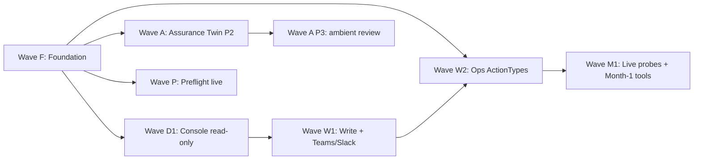

# 구현 계획 기록 (2026-07-06 표준 세트)

FDAI의 2026-07-06 작업 tranche를 조정한 historical 기록입니다. 당시 제안한
"표준 세트"와 단계별 wave를 보존하지만 현재 구현 권한은 각 subsystem 소유자 문서와
코드입니다.

- **표준 세트**: 2026-07-06에 추가된 설계 문서들에서 겹쳐 있던 추상을
 하나로 모으는 여섯 개의 설계 결정(R1, R2, R3, R4, R6, R7).
- **웨이브 플랜**: 기반 -> Console Day 1 -> 쓰기 집합 -> Ops
 ActionTypes -> 실제 운영 probes에, Assurance Twin과 Preflight의 병렬 트랙 둘.

> 고객 비종속 범위: 아래의 모든 모듈 이름과 단계 라벨은 일반명이다.
> 포크는 `core/` 편집 없이
> [project-structure.md](../architecture/project-structure.md)의 DI 경계으로만 조정한다.
>
> **현재 상태.** 이 문서의 "확정", "협상 불가", "shipped"는 당시 계획 스냅샷입니다.
> 아래 조정 이후의 섹션은 현재 적체나 API 계약으로 사용하지 마세요.

## 현재 구현 조정 (2026-07-21)

| 결정 | 현재 상태 | 현재 권한 |
|------|-----------|----------------|
| R1 | 채택 안 됨 | 축 A는 기준선이고 static 영향/env를 포함한 상한 축은 독립적으로 자율성을 낮춥니다. [`ceiling.py`](../../../services/core-control-plane/src/fdai/core/risk_gate/ceiling.py)와 [execution-model-ko.md](../decisioning/execution-model-ko.md)가 권한입니다. |
| R2 | 채택 안 됨 | `ConversationCoordinator`는 명시적 `SystemConsoleTool` 레지스트리를 받습니다. ActionType 카탈로그는 발견 근거를 제공하지만 쓰기 도구의 자동 변환 결과 출처는 아닙니다. |
| R3 | 채택 안 됨 | `LlmBindings` 집계 아래 role-specific 프로토콜/어댑터가 유지됩니다. 단일 `LlmBinding`/`AzureOpenAIChatBinding`은 없습니다. |
| R4 | 부분 구현 | `ScratchProjection`과 Assurance Twin 소비자는 배포됐습니다. 배포 Preflight는 현재 `FeasibilityProbe`/`PreflightAnalyzer`를 사용합니다. |
| R6 | 채택 안 됨 | `operator_memory`는 독립 덧붙이기/대체 저장소이며 audit-log materialized 화면이 아닙니다. |
| R7 | 채택 안 됨 | `ExecutionPath`는 `pr_manual`, `pr_native`, `direct_api`를 유지하고 `require_manual_merge` 필드는 없습니다. |

진행 중 작업과 미결정은 각 linked 소유자 문서의 상태/open-decision 섹션에서만 추적합니다.

## 1. 이 문서가 존재하는 이유

2026-07-06 트랜치에서 로드맵 문서 일곱 개가 새로 랜딩했다 (action-ontology,
execution-model, operator-console, assurance-twin, deployment-preflight,
prompt-composition 확장, db-dr-drill 런북). 나란히 놓고 보면 같은 개념이 두
곳에 동시에 나타나는 지점이 몇 개 있다.

- risk-classification 테이블의 `Axis A`는 이미 `blast_radius`와
 `environment`를 평가한다. 6-axis 상한의 D(static_blast)와
 G(env)가 같은 신호를 다시 읽는다.
- 오퍼레이터 콘솔의 `ConsoleTool`과 ActionType의
 `trigger_kind=operator_request`는 같은 모양(이름 / argument_schema /
 RBAC 하한 / side_effect_class)을 두 개의 별도 카탈로그에서 표현한다.
- 계획된 다섯 개의 Azure OpenAI 어댑터(교차 검증 / 제안자 /
 비평자 / 판정자 / conversational)가 전부 동일한 "역할 -> 배포 id
 -> 채팅 completions" 왕복을 한다.
- Assurance Twin의 `projection`과 배포 Preflight의 스크래치
 분석기는 스코프만 다른 같은 프리미티브다.
- `operator_memory`와 `audit_log`는 둘 다 추가 전용에
 해시-어드레서블한 이벤트를 저장하며, 감사 로그는 이미 세션 상태의
 진리원(정본)으로 선언되어 있다.
- `pr_native`와 `pr_manual`은 병합 정책 라벨 하나만 차이 나는데도 서로
 다른 실행 경로로 모델링돼 있다.

표준 세트는 각 쌍을 하나의 권위 있는 표현으로 통합한다.

## 2. Historical 표준 세트 (2026-07-06 제안)

다음 항목은 당시 제안된 대상 형태입니다. 위 조정과 충돌하면 현재 권한을
따릅니다.

### 2.1 R1 - 축 D와 G는 축 A로부터의 파생만 담당

[execution-model.md § 2](../decisioning/execution-model.md#2-six-axis-ceiling--risk-classification-table)
의 6-axis 상한은 이미 축 A(risk-classification 테이블)를
`blast_radius`와 `environment`의 권위 있는 베이스라인으로 선언한다. R1은
그 권위를 의미적으로만이 아니라 구조적으로 만든다.

**계약 변경**

- RiskGate combinator는 `blast_radius`와 `environment` 기여를 축 A
 내부에서 **정확히 한 번** 계산한다.
- 축 D(`static_blast`)와 G(`env`)는 가독성을 위해 `resolved_ceiling`에
 남지만, 그 수준은 축 A 판정에서 *파생*되며 독립 계산이 아니다.
 두 축 모두 ActionType `blast_radius` 블록이나 환경 classifier를
 다시 조회하지 않는다.
- 로더 교차 검증: 축 A가 이미 주장한 사실을 사유 문자열에 담는
 축은 감사 엔트리에 축 A 룰 id를 참조해야 한다
 (`derived_from: <matched_rule_id>`). 그래야 감사 리더가 파생 체인을
 볼 수 있고 D나 G를 두 번째 의견으로 오독하지 않는다.
- `min()` combinator는 그대로다 (4개의 독립 축 + A + 파생인 D와 G).

**효과**

- 신호당 분류 한 번. 튜닝 위치가 하나, A와 D가 서로 다른 답을 낼 위험
 없음.
- 프로퍼티 테스트: 모든 `FeatureVector`에 대해 축 D와 G가 보고한 수준은
 축 A 판정 경로가 함의하는 값과 같다 (상수 복사가 아니라 테스트로 단언).

**비목표**

- [execution-model.md § 2](../decisioning/execution-model.md#2-six-axis-ceiling--risk-classification-table)
 에서 6-axis 어휘를 제거하는 것. 축별 분해를 오퍼레이터에게 보여주는
 글의 가치는 유지된다. 변경은 수준이 어떻게 계산되는지에 국한된다.

### 2.2 R2 - ConsoleTool은 ActionType 카탈로그에 대한 프로젝션

오퍼레이터 콘솔의 `ConsoleTool` (쓰기 / approve / execute 계열)과
`trigger_kind in {operator_request, both}`인 ActionType은 같은 모양을
표현한다. R2는 ActionType 카탈로그를 이 툴들의 유일한 권위 있는 출처로
만든다.

**계약 변경**

- 쓰기 계열 콘솔 툴(`simulate_change`, `approve_hil`, `run_runbook`,
 `activate_break_glass`, 모든 `ops.*`, 모든 `governance.*`)은
 ActionType 카탈로그에서 `trigger_kind`로 필터한 **프로젝션**으로
 열거된다. 어떤 principal에 대한 `list_tools()`는
 `ActionTypeCatalog.필터(trigger_kind in {operator_request, both},
 principal_role >= min_role) union SystemConsoleTools`.
- 읽기 계열 툴(`describe_event`, `explain_verdict`, `explore_catalog`,
 `query_audit`, `query_inventory`)은 변경에 매핑되지 않으므로
 작지만 별도의 셋(`SystemConsoleTool`, 다섯 개)으로 남는다. 각자
 argument_schema와 RBAC 하한을 가진 얇은 레지스트리를 유지하되
 ActionType은 아니다.
- 툴 발견 계약(이름 / description / parameters / rbac_floor /
 side_effect_class / failure_modes)은 그대로. ActionType으로부터
 계산되는 뷰가 될 뿐, 두 번째 진리원이 아니다.
- `ConsoleTool` 프로토콜은 카탈로그가 아니라 **표현 어댑터**가 된다.
 ActionType 호출을 래핑하고 콘솔 특화 동작(evidence_refs, 미리 보기
 텍스트, 민감정보 제거 힌트)을 얹는다.

**효과**

- 카탈로그 하나, 로더 하나, 검증 표면 하나. 새 `ops.*` YAML을 추가하면
 구성된 RBAC 하한 하에 콘솔에 자동 노출된다. 미러 등록 불필요.
- [action-ontology.md § 9](../decisioning/action-ontology.md#9-audit-contract) 의
 감사 계약이 이미 매 전달에 `action_type_id`, `trigger_kind`,
 `side_effect_class`를 기록한다. 콘솔은 쓰기 계열 호출에 대해
 별도 콘솔툴 감사 레코드를 쓸 필요가 없다.

**비목표**

- 읽기 계열 툴을 ActionType 모양에 억지로 넣는 것. `describe_event`와
 그 네 동료는 액션이 아니다. 온톨로지에서 빼두는 편이 온톨로지를
 정직하게 유지한다.

### 2.3 R3 - 역할 enum을 가진 통합 `LlmBinding`

계획된 다섯 Azure OpenAI 어댑터(`AzureOpenAICrossCheckModel`,
`AzureOpenAIProposer`, `AzureOpenAICritic`, `AzureOpenAIJudge`, 계획
중인 `AzureOpenAIConversationalModel`)는 같은 요청 / 응답
모양을 공유하고 프롬프트 / 배포 / 역할만 다르다. R3는 이들을 통합한다.

**계약 변경**

- 하나의 프로토콜 경계, `LlmBinding`. 고정된 enum에서 뽑은 `role`
 파라미터를 받는다: `t2_cross_check`, `proposer`, `critic`, `judge`,
 `narrator_t1`, `narrator_t2`.
- 하나의 Azure 구현체 `AzureOpenAIChatBinding`. 역할을 키로
 `resolved-models.json`에서 배포 id를 룩업한다. 기존
 role-specific 클래스는 공유 연결을 올바른 역할로 호출하는 **얇은
 팩토리**가 된다 (하위호환용으로 한 릴리스 유지 후 제거).
- 컴포지션 루트 배선은 하나의 프로토콜 -> 하나의 어댑터. 포크는
 대체 구현 하나를 바인딩해서 모든 LLM 역할을 교체한다.
- 프롬프트 컴포저
 ([prompts/composer.py](../../../services/core-control-plane/src/fdai/core/prompts/composer.py))
 가 역할 별 system 프롬프트를 달리하는 유일한 컴포넌트다. 연결은
 프롬프트 비종속.

**효과**

- 역할 추가 = `Enum.append + resolved-models.json 항목`. 새 어댑터
 클래스가 아니다. 업스트림은 다섯 번째 Azure OpenAI 어댑터를 도입하지
 않고 `narrator_t1`과 `narrator_t2`를 배송한다.
- 비용 텔레메트리(prompt_tokens, completion_tokens,
 model_deployment_id)가 모든 역할에서 공통 모양으로 나온다. 역할
 간 비용 집계가 간단해진다.

**비목표**

- 배송된 `AzureOpenAICrossCheckModel / Proposer / Critic / Judge`
 클래스를 파괴적 릴리스로 통합하는 것. 마이그레이션은 가산적이다:
 `AzureOpenAIChatBinding` 도입, 기존 각 클래스를 그 위의 팩토리로
 재구현, 아무 호출자도 직접 가져오기하지 않게 되면 팩토리 제거.

### 2.4 R4 - Twin과 Preflight가 공유하는 `Projection` 프리미티브

Assurance Twin(구독 전체)과 배포 Preflight(단일 배포)는
둘 다 인벤토리 위에 읽기 전용 변환 결과를 만들어 차이를 적용하고 T0
룰을 평가한다. R4는 그 프리미티브를 뽑아낸다.

**계약 변경**

- `shared/providers/projection.py`에 새 프로토콜:

 ```python
 등급 ScratchProjection(프로토콜):
  def apply_diff(self, 차이: InventoryDiff) -> ScratchProjection: ...
  def evaluate(self, 룰: RuleSet) -> Findings: ...
  # 읽기 전용, 변경할 수 없는, 결정론적
 ```

- `core/deploy_preflight/analyzer.py`는 단일 타깃 차이로 프리미티브를
 소비한다.
- `core/assurance_twin/projection.py`는 구독 전체 스냅샷을
 베이스라인으로 두고 리뷰용 per-change 차이로 같은 프리미티브를
 소비한다.
- 두 소비자는 자체 outer 타입(`DeploymentReadinessReport`,
 `PostureAssessmentReport`)을 유지한다. 변환 결과 커널만 공유.

**효과**

- 결정성, 불변성, 차이 리플레이를 테스트할 곳이 하나.
- Twin의 3-vertical 시뮬레이션 표면(§Twin as simulator)이
 `ScratchProjection.apply_diff(...).evaluate(vertical_rules)`가 된다 -
 같은 프리미티브, 세 소비자.

**비목표**

- 두 리포트 모양을 합치는 것. 단일 배포 준비 상태 판정과 전체 estate
 자세 점수는 소비자와 모양이 다르다. 변환 결과 커널만 공통이다.

### 2.5 R6 - `operator_memory`는 감사 로그의 materialized 화면

세션 상태와 운영자 기억 모두 추가 전용 해시-어드레서블 저장을
필요로 한다. 감사 로그가 이미 그것을 제공한다. R6는 감사 로그를
진리원으로 두고 `operator_memory` 테이블을 materialized 화면으로 만든다.

**계약 변경**

- 감사 로그에 새로운 `action_kind` 값 도입:
 `operator.memory.append`, `operator.memory.supersede`,
 `operator.memory.expire`. 각각 기억 행의 필드(scope_kind,
 scope_ref, category, 본문, source_event, source_ref, 작성자,
 approved_by, ttl)를 담는다.
- Postgres `operator_memory` 테이블은 쿼리 성능을 위해 남되 대응하는
 감사 엔트리로부터 재구축되는 **파생 뷰**가 된다. 재구축은 결정적이다:
 감사 로그를 리플레이하면 바이트 단위로 동일한 테이블이 나온다.
- 쓰기 경로: `OperatorMemoryStore.append(...)`는 감사 엔트리를 먼저
 기록(진리원)한 후 뷰를 업데이트한다.
- 읽기 경로: 호출자 관점에서는 그대로 - 그들이 조회하는 것은 뷰다 -
 하지만 저장소는 재구축(폐기 + 재생)을 지원되는 관리 작업으로
 허용해야 한다.
- 새 세션 테이블 없음: `ConversationSession.turns`는
 [operator-console.md § 6](../interfaces/operator-console.md#6-session-model--memory)
 에 이미 있는 대로 감사 로그로부터 계속 프로젝션된다.

**효과**

- 지속 저장소가 두 개가 아니라 하나. GDPR류 삭제 요청은 감사 로그
 하나에 대해서 실행한다.
- 테스트 불변식: 기억 연산의 모든 시퀀스에 대해
 `replay(audit) == current(operator_memory)`.

**비목표**

- `operator_memory` 테이블 제거. 쿼리 패턴(스코프 인덱스, 대체
 체인)이 구체화를 정당화한다. 변경은 그것이 파생이라는
 점뿐이다.

### 2.6 R7 - `pr_manual`은 `pr_native` 위의 플래그

`pr_native`와 `pr_manual` 실행 경로는 auto-merge 허용 여부만 다르다.
R7은 이 둘을 평평하게 만든다.

**계약 변경**

- `ActionType.execution_path` enum이 `pr_native | direct_api`로 축소.
- ActionType에 `require_manual_merge: bool` 필드 추가(기본 `false`).
 `true`이면 배송된 `GitOpsPrAdapter`가 axes가 무엇을 허용하든 `hil`
 라벨과 `merge-not-eligible` 라벨을 붙이고 auto-merge를 비활성화한다.
- [execution-model.md § 5.4](../decisioning/execution-model.md#54-executor-selection-at-dispatch)
 의 실행기 선택 표가 무너져 내린다. Strict 순서는 다음이 된다:
 `require_manual_merge (any 경로) > pr_native (auto-merge 가능) >
 direct_api`. axis는 `require_manual_merge`를 *올릴* 수만 있고 (내릴
 수 없음), `direct_api`에서 `pr_native`로 *한 단계 내려갈* 수만 있다
 (속도를 위해 올릴 수 없음).
 [execution-model.md § 2.7](../decisioning/execution-model.md#27-combining) 의 절대
 올리지 않는 규칙은 유지된다.
- `execution_path: pr_manual`을 쓰던 기존 YAML은 `execution_path:
 pr_native` + `require_manual_merge: true`로 변환된다. 이 전환은
 기계적이며 [scripts/](../../../scripts) 아래의 스크립트가 커버한다.

**효과**

- enum 값 하나 감소. 실행기 경로 구현 하나. `GitOpsPrAdapter`가
 유일한 PR 경로이고 플래그가 라벨 셋을 다스린다.

**비목표**

- PR 경로와 direct API 통합. `pr_native`와 `direct_api`는 감사 /
 롤백 계약이 다르므로(git revert vs `rollback_contract`) 별개로
 남는다.

## 3. 표준 세트가 바꾸지 않는 것

명확성을 위해: 아래는 2026-07-06 문서에 기술된 그대로 유지된다. 하위
PR이 아래 중 어느 것이라도 바뀐 것으로 읽는다면 그 독해가 잘못된 것이다.

- 자율 액션마다의 7개 안전조건(stop-condition, 롤백, blast-radius 한도, 예행 실행,
 리소스 잠금, 멱등성, 감사 항목). 채팅 특별예외 없음, direct-API
 완화 없음.
 [coding-conventions.instructions.md § 안전성](../../../.github/instructions/coding-conventions.instructions.md#safety)
 참조.
- 새 액션은 shadow-first. 강제 적용로의 승격은 액션별, `promotion_gate`
 측정, 별도 리뷰.
- LLM은 판사가 아니라 통역사. 실행 자격은 결정적 검증이 부여하며
 모델의 신뢰도가 부여하지 않는다
 ([architecture.instructions.md § LLM Quality 게이트](../../../.github/instructions/architecture.instructions.md#llm-quality-gate-required-for-t2)).
- 룰 카탈로그는 고객 비종속을 유지한다. 고객별 값은 포크에 산다
 ([generic-scope.instructions.md](../../../.github/instructions/generic-scope.instructions.md)).

## 4. Historical 웨이브 순서

아래 웨이브는 의존관계 순이다. 각 웨이브는 명시적 exit 게이트를 가지며,
모든 게이트가 측정 가능하고 초록으로 켜질 때까지 웨이브는 완료가 아니다.

### Wave F - 기반

모든 다른 웨이브의 사전조건. 스키마와 risk-gate 통합을 건드리며 새로운
자율성을 추가하지 않는다.

- **F1** ActionType 스키마 확장.
 [action-ontology.md § 2](../decisioning/action-ontology.md#2-schema)의 새 필드:
 `trigger_kind`, `ceiling_by_tier`, `env_scope`, `prod_downgrade`,
 `execution_path`(R7로 enum 축소), `require_manual_merge`,
 `argument_schema`, `live_probe_ref`, `provenance`. 로더 교차 검증
 는 [action-ontology.md § 8](../decisioning/action-ontology.md#8-loader--validation).
- **F2** `resolved_ceiling` JSON 스키마를
 `services/core-control-plane/src/fdai/shared/contracts/ontology/resolved-ceiling.json`
 에 배치.
 [execution-model.md § 8](../decisioning/execution-model.md#8-resolved_ceiling-audit-block)
 의 모양을 R1 파생 표기(축 D와 G의 `derived_from`)와 함께 반영.
- **F3** 배송된 16개 ActionType YAML
 ([action-ontology.md § 3.1](../decisioning/action-ontology.md#31-remediation)) 을
 새 필드로 백필. 전부 `trigger_kind = rule_violation`,
 `execution_path = pr_native`, `require_manual_merge = false`,
 `ceiling_by_tier`는 오늘의 암묵적 기본값에서.
- **F4** `RiskTable`과 `risk-classification.yaml` 교차 검증으로
 Axes D와 G의 기여가 축 A 룰 id를 참조하는지 확인 (R1 파생
 불변식).
- **F5** [action-ontology.md § 7.5](../decisioning/action-ontology.md#75-precedence)
 의 4-tier 우선순위를 가진 오버레이 로더: 런타임 > Rego > 파일 오버레이
 > 업스트림. 감사 엔트리는 이긴 계층을 명명한다.
- **F6** `RiskDecision` 마이그레이션: `quorum`, `matched_rule_id`,
 `catalog_version`, `resolved_ceiling`, `execution_path`,
 `require_manual_merge` 필드를 안전 기본값과 함께 추가. `outcome`은
 한 릴리스 동안 파생 별칭으로 유지.
- **F7** `ControlLoop`와 `composition.py`가 모든 전달을
 `evaluate_execution_authority()`
 ([execution-model.md § 3](../decisioning/execution-model.md#3-unified-riskgate)) 로
 라우팅. 어떤 ActionType도 승격되지 않았으므로 동작은 여전히
 shadow-only.
- **F8** R1 파생 불변식을 포함한 6-axis 프로퍼티 테스트.

**Exit 게이트**

- 기존의 모든 시나리오 스위트가 그린.
- 매 전달이 축 A 룰 id를 명명하는 `resolved_ceiling` 블록을
 기록한다.
- 승격된 ActionType이 없다; 루프는 shadow-only 유지.

### Wave D1 - Operator Console Day 1 (읽기 전용 CLI)

F 뒤. [operator-console.md § Day 1](../interfaces/operator-console.md#day-1-this-session)
구현.

- **D1.1** 로컬 `az login` 개발용 `AzureCliWorkloadIdentity`.
- **D1.2** R3 역할 enum을 갖는 `LlmBinding` 프로토콜 +
 `AzureOpenAIChatBinding`. 컴포지션 루트는
 `resolved-models.json`으로 서술기 역할을 배선.
- **D1.3** `ConversationCoordinator` + `ConversationSession` (상태 =
 audit-log 프로젝션;
 [operator-console.md § 6](../interfaces/operator-console.md#6-session-model--memory)).
- **D1.4** 다섯 개의 읽기 전용 툴(`describe_event`, `explain_verdict`,
 `explore_catalog`, `query_audit`, `query_inventory`)을
 `SystemConsoleTool`로 구현 (R2: ActionType 파생이 아님).
- **D1.5** 나레이터가 툴 스키마를 보기 전에 RBAC 게이트; Chat T0
 인텐트 매처.
- **D1.6** `CliReplChannel` 및 `tools/chat.py`. **전체 쓰기 집합에 대해
 CLI 배선 완료**: `tools/chat.py`가 이제 5개 읽기 도구와 함께 5개 쓰기
 도구 (`simulate_change`, `list_hil`, `approve_hil`, `run_runbook`,
 `activate_break_glass`)을 shipped in-memory 가짜로 조립; 조정기는
 각 동사를 새 Chat T0 의도 패턴으로 인식 (JSON 시나리오,
 positional-shorthand approve, params_json 런북, 자연어 break-glass
 사유 등) 하여 운영자가 셸에서 모든 W1.1 도구를 종단 간으로
 구동 가능.
- **D1.7** 테스트: RBAC 매트릭스, 에스컬레이션 트리거, 검증기
 리체크, 골든 트랜스크립트, 세션 복구.

**Exit 게이트**

- 읽기 담당 롤 principal이 배포된 dev 환경 상대로 CLI REPL에서 모든
 Day-1 툴 시나리오를 완주.

### Wave W1 - 쓰기 세트, Teams / Slack pull, 사람 승인 콜백

D1 뒤. [operator-console.md § 주 1](../interfaces/operator-console.md#week-1) 과
prompt-composition Wave 3 단계 B 파이프라인 구획 3 잔재
([prompt-composition.md § 롤아웃 waves](../decisioning/prompt-composition.md#rollout-waves))
구현.

- **W1.1** 쓰기 계열 툴(`simulate_change`, `approve_hil`, `list_hil`,
 `run_runbook`, `activate_break_glass`). R2에 따라 이들은 ActionType
 프로젝션이고 콘솔이 필터해서 노출하는 `governance.*` / `ops.*`
 ActionType YAML로 랜딩. **`simulate_change` 배송 완료**:
 `core/conversation/write_tools.py`가 한 개의 가설 이벤트를
 `EventIngest -> TrustRouter -> T0Engine -> ActionBuilder ->
 TemplateRenderer`로 in-memory 실행하며, 모든 PR 의도
 (제목, patch 미리 보기, 4개 safety-invariant 흔적)를 캡처하고,
 ShadowExecutor나 실제 PR 발행기는 절대 호출하지 않으며,
 `query_audit`로 발견 가능하도록 정확히 하나의
 `console.simulate_change` 감사 엔트리를 기록. 기여자 하한,
 `side_effect_class = 'simulate'`. **`list_hil` + `approve_hil`
 배송 완료** (같은 모듈): Approver-scoped 큐 변환 결과는 새 CSP-중립
 `HilApprovalRegistry` 프로토콜 (`shared/providers/hil_registry.py`
 + 가짜) 위에 얹혀 있음. `list_hil`은 Approver-visible full 상세
 (submitter_oid, action_id, citing 룰)을 반환하며, Operator API의
 읽기 담당 대시보드 tile과 구분됨. `approve_hil`은 레지스트리 쓰기 **이전**에
 4개 실패 시 차단 불변식을 적용: 존재 검사, 검증기 재검사
 (`action_kind`가 shipped 카탈로그에 여전히 존재), `no_self_approval`
 (`principal.id == submitter_oid` 거부), terminal-state 존중
 (`HilItemAlreadyResolvedError`는 두 번째 쓰기 없이 short-circuit).
 모든 최종 경로가 정확히 하나의 `console.approve_hil` 감사
 엔트리를 기록. **`run_runbook` + `activate_break_glass` 배송 완료**
 (같은 모듈): `run_runbook`은 operator-console.md 3.2의 단일 툴
 설계를 그대로 shipping - 예행 실행 경로는 정적 `rbac_floor =
 기여자`, 라이브 실행 (`dry_run=false`)은 호출자가 Owner가
 아니면 거부. 새 CSP-중립 `RunbookRegistry` 프로토콜을 통해
 이름으로 라우팅; 모든 최종 경로 (unknown-name, 레지스트리 오류,
 dry/실제 운영 성공 또는 실패)가 `dry_run` boolean과
 `mode=shadow|enforce`를 담은 `console.run_runbook` 감사 엔트리를
 기록. `activate_break_glass`는 채팅 불변식 7
 (operator-console.md 7.2)을 강제: 방어적-다층 시크릿 scrub
 (Azure/AWS/PEM/GH/Slack 패턴) 이후 사유가 반드시 20자 이상,
 TTL은 [60s, 4h] 범위로 한계 (ctor 시점에 상한 강제), 새
 `BreakGlassPager` 프로토콜을 통한 pager 배송이 필수 - raise 시
 권한 부여 거부 ("실패 시 차단 on 알림"). 모든 경로가 감사됨 -
 성공과 거부 둘 다, 명확한 `refusal_kind` (`short_reason` /
 `invalid_expiry` / `expiry_below_minimum` /
 `expiry_above_ceiling` / `pager_no_channel` / `pager_delivery`)
 포함. 읽기 담당 하한 - 인증된 사용자면 누구나 시도 가능하며, RBAC
 해석기가 역할 구성원을 여전히 게이트.
- **W1.2** `TeamsBotChannel`과 `SlackBotChannel` (pull).
 [config/notifications-matrix.yaml](../../../config/notifications-matrix.yaml)
 의 push 채널 자격증명 재사용.
- **W1.3** Operator API HIL 콜백 (`POST /hil/{approval_id}/decision`,
 HMAC 검증). Operator API에서 유일하게 허용된 게시. **Shipped**:
 `delivery/operator_api/hil_callback.py`가 게시 라우트의 유일한 카모-아웃이며,
 기본값은 OFF (명시적 선택은 `OperatorApiConfig.hil_callback` + `hil_registry`).
 `timestamp.approval_id.body`에 대한 HMAC-SHA256, 재생 윈도우 설정 가능(기본 300s),
 바디 사이즈 측, no-self-approval 강제, 그리고 필수
 `X-FDAI-Signature` + `X-FDAI-Timestamp` 헤더 - Teams
 어댑터가 서명하는 것과 동일한 셔이프. 설정 누락 시 `build_app`에서
 fail-fast; `hil_callback`도 `hil_registry`도 없으면 4개 GET 라우트만
 등록됩니다(기존 읽기-전용 불변식 테스트 계속 통과). **운영 round-trip
 배포 완료**: 코어 가 전체 액션 과 pending 변환 결과 을 shared Postgres
 `StateStore`에 보류 합니다. `fdai-api`는 `PostgresHilApprovalRegistry`를 통해
 결정 을 원자적으로 기록하고 receipt-only 이벤트 를 `aw.hil.decisions`에
 publish 합니다. Core 는 별도 소비자 그룹 으로 이 토픽 을 소비한 후
 `HilResumeCoordinator.resolve`를 호출합니다. Operator API 는 실행기 신원 를
 받지 않습니다. 브로커 전달 실패는 영속 결정 증적 를 보존하면서
 재시도 가능한 HTTP 503을 반환합니다.
- **W1.4** 알림 실패 시 fail-close하는 BreakGlass: 어떤 채널도 배송
 확인을 못하면 거부.
- **W1.5** Prompt-composition Wave 3 단계 B 파이프라인 구획 3
 (fork-first 두 번째 승인 채널).
- **W1.6** `OperatorMemoryStore`를 통해 콘솔에 운영자 기억 노출
 (R6에 따라 감사 로그로 뒷받침). 스코프-바운디드 읽기/쓰기만; 결코
 나레이터 메모리에 병합되지 않음. **Shipped**: Reader-floor
 `query_operator_memory` 콘솔 툴
 (`core/conversation/system_tools.py::QueryOperatorMemoryTool`,
 `side_effect_class='read'`)이
 `OperatorMemoryStore.list_active_for_scope`에 위임 - 스토어의
 active-only 필터(대체된 / 만료된 제거)가 단일 정책 면. 읽기 전용
 - 감사 또는 상태를 쓰지 않음; 매 생성 로우는 `operator-memory:<uuid>`
 근거 참조를 노출. Wave M1.5c에서 조정기 + CLI 배선.

**Exit 게이트**

- Teams의 Approver가 dev 상대로 "감지 -> 채팅 조사 -> 승인 -> 그림자
 PR 오픈"을 완주. 매 턴 / 판정 / PR 링크가 감사 로그에 기록됨.

### Wave W2 - Ops ActionTypes, direct_api 실행기, 비용 게이트

W1 뒤.
[execution-model.md § 주 2](../decisioning/execution-model.md#week-2) 구현.

- **W2.1** [action-ontology.md § 3.2](../decisioning/action-ontology.md#32-ops) 의
 `ops.*` ActionType YAML. 비용 증가 항목은 `cost_impact_monthly`를
 선언해 축 A 비용 게이트가 적용된다
 ([execution-model.md § 2.8](../decisioning/execution-model.md#28-cost-increasing-ops-actions)).
- **W2.2** [action-ontology.md § 3.3](../decisioning/action-ontology.md#33-governance)
 의 `governance.*` ActionType YAML. 전부 `execution_path: pr_native`.
- **W2.3** `services/core-control-plane/src/fdai/core/executor/direct_api.py`의 Direct-API
 실행기. 아이덤포턴시 키 재사용, `stop_conditions` 강제,
 `mutation_target=direct` HIL 아이템 지원. **배송 완료**:
 CSP-중립 :등급:`DirectApiExecutor` 프로토콜 + 가짜
 (`shared/providers/direct_api.py` +
 `shared/providers/testing/direct_api.py`)의 idempotency-by-key,
 ``강제 적용`` 프로모션 레이블 체크, 5-value 결과 enum
 (`SUCCEEDED / ALREADY_APPLIED / PRECONDITION_FAILED / STOPPED /
 실패한`) 뿐 아니라, `core/executor/direct_api.py` 글루
 (:등급:`DirectApiShadowExecutor`)까지 shipping - 이는
 :등급:`~fdai.core.executor.executor.ShadowExecutor`를 미러링:
 동일한 per-resource 잠금, 동일한 blast-radius 상한, 동일한 7-safeguard
 fail-close, 동일한 enforce-mode 액션 거부 (shadow-only).
 모든 최종 경로가 정확히 하나의
 ``action_kind = "실행기.direct_api.<outcome>"`` 감사 엔트리 (8개
 서로 다른 결과) + ``execution_path = "direct_api"``를 기록하여
 PR-native 경로와 필터 가능. Composition-root 배선 +
 `mutation_target=direct` HIL 큐에 추가는 후속 작업.
- **W2.4** 배송되는 ops 액션용 Azure ARM 어댑터.
- **W2.5** 비용 거버넌스 버티컬이 축 A에 estimator를 노출
 ([execution-model.md § 2.8](../decisioning/execution-model.md#28-cost-increasing-ops-actions)).
 **Shipped**: `shared/providers/cost_estimator.py` (CSP-neutral
 `CostEstimator` 프로토콜 + `CostEstimate` + `CostConfidence` +
 `CostEstimatorError`), 불변식은 `ABSTAIN <-> monthly_usd is None`.
 `resolve_cost_impact_monthly()` 어댑터는 abstain / raise / 미배선
 estimator 모두 `None` 반환 - 축 A는 "알 수 없음"을 HIL 실패 시 차단으로
 다룸. `InMemoryCostEstimator` 페이크 (`seed(key, usd)` /
 `seed_abstain` / `next_error`) + control-loop 배선을
 `ControlLoop._resolve_cost_override`에서: rule-declared
 `remediation.cost_impact_monthly_usd`가 권위 있는 (`$0` 포함);
 룰이 침묵하면 estimator 조회, 그 외에는 `None`. 라이브 Azure 비용
 관리 어댑터는 포크 territory.
- **W2.6** 실행기 경로 선택 테스트 (R7:
 `require_manual_merge`는 엄격하게 올리기만 하고 내리지 않음).
 **배송 완료**: `core/executor/path_selection.py`가
 :func:`strictest_execution_path` (commutative, associative 접기;
 ``None``은 no-opinion; ``(None, None)``은
 :등급:`ExecutionPathSelectionError`로 fail-close)와
 :func:`is_strictly_stricter_than` (raise-only 가드)를 내보내기.
 73개 속성 테스트가 strictness 단계 구조 (`pr_manual > pr_native
 > direct_api`), 모든 3-tuple에 대한 commutativity + associativity,
 axis-can-only-raise 불변식, "출력은 항상 입력 중 하나" no-
 fabrication 규칙을 고정. RiskGate가 `forced_execution_path` 축
 출력을 갖게 되면 ceiling-resolution 시점에 wire하고, 실행기는
 전달 시점에 defense-in-depth로 재조합 가능.

**Exit 게이트**

- 기여자가 콘솔에서 `quiet` 실제 운영 탐색 아래 비-프로덕션 리소스에
 `ops.restart-service`를 실행. 감사가 `execution_path=direct_api`를
 보이고 모든 안전 불변식이 유지됨.

### Wave M1 - 실제 운영 probes, 관측 심도, Rego overlays

W2 뒤. [execution-model.md § 월 1](../decisioning/execution-model.md#month-1) 과
[operator-console.md § 월 1](../interfaces/operator-console.md#month-1) 구현.

- **M1.1** `LiveBlastProbe` 프로토콜, `NoOpBlastProbe`,
 `AzureMonitorBlastProbe` (KQL과 Metrics API 어댑터).
 **업스트림 배송 완료**: CSP-중립 :등급:`LiveBlastProbe` 프로토콜 +
 :등급:`NoOpBlastProbe` 가짜 (`shared/providers/blast_probe.py` +
 `shared/providers/testing/blast_probe.py`)에 네 값 enum
 (`quiet / active / overloaded / no_opinion`),
 :등급:`BlastProbeTimeoutError` / :등급:`BlastProbeConfigError`
 에러 표면, `force_verdict` / `next_timeout` / `next_error`
 테스트 훅을 담아 shipping. 실제 :등급:`AzureMonitorBlastProbe`는
 포크가 authoring하는 전달 어댑터.
- **M1.2** [rule-catalog/probes/](../../../rule-catalog/probes) 아래의
 스타터 프로브: `vm_traffic_last_5m`, `storage_access_log`,
 `lb_backend_health`, `blast_radius_classifier` (외부-vs-내부 2-경로
 프로브로 `rca/causal_chain`에 공급; SRE 데모 커버리지 매트릭스
 [docs/internals/sre-demo-scenarios-08-fdai-coverage.md](../../../docs/internals/sre-demo-scenarios-08-fdai-coverage.md)
 항목 5 참조).
- **M1.3** ActionType이 `live_probe_ref`에 명시적 선택. 프로브 실패 ->
 `active`; 반복 실패 -> `shadow_only`
 ([execution-model.md § 4.2](../decisioning/execution-model.md#42-runtime-shape)).
 **Shipped**: `ops.restart-service` + `ops.scale-in` 둘 다
 `live_probe_ref: vm_traffic_last_5m`로 명시적 선택.
 `load_action_type_catalog(..., probes_root=...)`가 선언된 모든 탐색
 id를 배송된 탐색 카탈로그와 교차 검증하여 알 수 없는 id 또는 broken
 탐색 카탈로그에서 hard-fail (`probes:` 이슈 키를 표면, silent 건너뜀
 없음). `__main__` + `collect_cli`에 배선.
- **M1.4** `governance.override-ceiling` 런타임 (`policies/action_types/`
 하의 Rego 조각 작성기), exemption 워크플로우를 통해 시간-상자화.
 **Shipped**: `core/risk_gate/override_writer.py`는 순수 렌더러 -
 `OverrideRequest -> RegoOverlay(path, content)`이며 파일시스템 I/O 없음
 (호출자가 PR로 파일 씀). 실패 시 차단: `target_level`이
 `{enforce_hil, shadow_only}` 밖, 범위가 `{resource, resource-group}`
 밖, 잘못된 ISO-8601 `expires_at`, `[20, 500]` chars 밖의 justification,
 자기 승인, `override_id`의 `'..'`. 렌더된 Rego는 메타데이터
 front-matter + 네임스페이스화된
 `package fdai.action_types.<slug>.<override_slug>` +
 `applies` (action_type/범위 매치 + `now <= expires_at`) + 판정
 블록; 모든 문자열 interpolation은 역슬래시 + double-quote escaper
 통과.
- **M1.5** 관측 심도 툴(`query_log`, `query_metric`,
 `query_deployments`, `correlate_incident`)을 `AzureMonitorAdapter`와
 `DeploymentHistoryAdapter`로. **업스트림 shipped**를 세 계층으로:
 (1) `shared/providers/observation.py` +
 `shared/providers/testing/observation.py` - 네 개 CSP-neutral
 프로토콜 (`LogQueryProvider` / `MetricQueryProvider` /
 `DeploymentHistoryProvider` / `IncidentCorrelator`) + 페이크, 모든
 에러가 `ObservationError`를 상속, 모든 메소드는 fail-close raise;
 (2) 네 개 Reader-floor 콘솔 툴
 (`QueryLogTool` / `QueryMetricTool` / `QueryDeploymentsTool` /
 `CorrelateIncidentTool`, `side_effect_class='read'`)이
 `ObservationError`를 catch -> `abstain` + 미리 보기 (raw stacktrace
 노출 없음) 및 빈 결과를 `abstain`으로 취급 (나레이터가 zero rows를
 "이상 없음"으로 요약 못하도록); (3) 조정기 + CLI 배선
 (`tools/chat.py`가 15개 툴 조립 = 기존 10개 + 5개 신규 읽기 버브).
 실제 Azure Monitor / DeploymentHistory 어댑터는 포크 territory.
- **M1.6** 읽기 전용 콘솔 SPA 위의 `WebChatChannel`.
- **M1.7** Prompt-composition Wave 5 beta. **업스트림에 제공됨.** 명시적 선택 Azure
 Responses `WebSearchProvider`, 결정론적 충족 여부 및 privacy 게이트,
 domain-filtered 인용 스냅샷, 영속 대화 재생 근거,
 조건을 충족한 서술기 배포 사이의 주기적 rolling-p50 라우팅을 포함합니다.
 배포가 승인한 primary-source 허용 목록을 제공하기 전까지 비활성 상태입니다.

**Exit 게이트**

- 프로덕션 그림자 측정에서 실제 운영 탐색이 최소 한 번 자율성을 낮춘다;
 감사 엔트리가 `winning_axis=live_blast`를 보인다.

### Wave A - Assurance Twin (병렬 P2 / P3)

Wave F 배송 이후에는 Waves D1..M1과 독립.
[assurance-twin.md](../operations/assurance-twin.md) 구현.

- **A.1** `shared/providers/projection.py`에서 R4 프리미티브
 `ScratchProjection`.
- **A.2** `core/assurance_twin/projection.py`가 R4 프리미티브 위에
 전체 구독 변환 결과 구축.
- **A.3** `core/assurance_twin/query.py`가 NL -> 타입드 온톨로지
 쿼리를 컴파일. T2 quality 게이트가 권위
 ([assurance-twin.md § 3](../operations/assurance-twin.md#3-verifiable-text-to-query-not-text-to-answer)).
 업스트림은 `TypedQuery` / `Predicate` 타입, `QueryVerifier` (알
 수 없는 resource_type, 비-read-only op, 변환 결과와 결합된
 개수 쿼리를 거부), T0 문법을 다루는 결정론적
 `DeterministicPatternCompiler` (`list` / `count` /
 `list ... without ...` / `list ... with ...` /
 `list ... where ... is ...`), 그리고 `ScratchProjection`에서
 실행되는 `execute_query` 러너를 배송. 포크는 잔여 질문을 T2
 quality 게이트로 라우팅하는 자체 `NlQueryCompiler`를 설치하며,
 그 출력은 반드시 동일한 shipped `QueryVerifier`를 통과해야 한다.
- **A.4** `core/assurance_twin/review.py`가 GitHub Checks API
 어댑터로 IaC PR에 주변 리뷰 게시. **업스트림 shipped**:
 `shared/providers/iac_review.py` (`IacReviewPublisher` 프로토콜 +
 `IacReview` + `ReviewReceipt` + `IacReviewPublishError`)는
 `review_key`로 멱등적; `shared/providers/testing/iac_review.py`가
 `InMemoryIacReviewPublisher` (records, 멱등성, `next_error`
 훅) 제공. `publish_review()` 오케스트레이터는 세 결과 중 하나
 (`POSTED / ALREADY_POSTED / PUBLISH_ERROR`) 반환하고 실패 시 차단 -
 트윈으로 raise 안 됨. GitHub Checks 어댑터 (실제 HTTP 호출)는
 포크 territory.
- **A.5** `core/assurance_twin/report.py`가
 `PostureAssessmentReport` 조립; 콘솔 SPA가 읽기 전용 패널 획득.
 **업스트림 shipped**: `PostureAssessmentReport`는 findings로부터
 파생된 whole-estate 판정 (`CLEAR / NEEDS_REVIEW / BLOCKED`)를
 생성; 호출자가 판정을 spoof 못 함. Shadow-first: `blocks_action`은
 `ENFORCE + BLOCKED`일 때만 `True`. 집계 통계: `resource_count`,
 `rule_count`, `highest_severity`, `severity_counts`,
 `blocking_findings`. 콘솔 SPA 패널 landing은 포크 territory.

**Exit 게이트**

- 답변된 모든 질문이 룰을 인용; 근거 없는 질문은 abstain하고 발견
 루프에 피드.

### Wave P - Preflight 라이브 어댑터 + 토글 카탈로그

Wave F 배송 이후에는 Waves D1..M1과 독립.
[deployment-preflight.md § 전달 Increments](../deployment/deployment-preflight.md#delivery-increments)
의 전달 증분 구현.

- **P.1** `delivery/azure/preflight/` 아래의 라이브 Azure preflight
 어댑터(Policy Insights, Resource Graph, Firewall/NSG, 할당량).
 스크래치 평가에 R4 프리미티브 소비.
- **P.2**
 [deployment-preflight.md § 차단 요인 to Terraform 토글 대응](../deployment/deployment-preflight.md#blocker-to-terraform-toggle-mapping)
 의 `infra/modules/` capability-mode 토글. **배송 완료**:
 `infra/modules/preflight-toggles/` 아래 5개 data-only Terraform
 서브 모듈 (`disk_provisioning`, `nsg_provisioning`,
 `registry_source`, `python_index_url`, `dependency_ordering`).
 각각 검증된 `mode` 변수 + 토글 별 auxiliary vars를 받아
 정규화된 outputs (`effective_mode` + 토글 별 구성)를 발행;
 `resource` 블록 없음, 프로바이더 의존성 없음이라 CI에서 Azure
 구독 없이 `terraform validate` 통과. 소비자 모듈이 outputs를
 읽어 실제 리소스 형태를 결정 - 토글 모듈 자체는 실제 운영
 리소스를 발행하지 않으므로 Preflight 분석기의
 `terraform_toggle` 발견 사항이 단일 변수 재정의에 1:1로 매핑.
- **P.3** 인프라 PR에 리포트를 게시하는 GitHub 검사. **업스트림
 shipped**: `shared/providers/preflight_check.py`가 A.4 경계를
 미러링 - `PreflightCheckPublisher` 프로토콜 + `PreflightCheck`
 의도 + `ReviewReceipt` + `PreflightCheckPublishError`,
 `check_key`로 멱등적, `TYPE_CHECKING` 가드로
 `DeploymentReadinessReport` 참조하여 `shared/`가 `core/`에
 런타임 의존 없음. `InMemoryPreflightCheckPublisher` 페이크 +
 `core/deploy_preflight/check_publish.py::publish_preflight_check()`
 오케스트레이터는 동일한 세 결과 (`POSTED / ALREADY_POSTED /
 PUBLISH_ERROR`), 실패 시 차단. 실제 GitHub 검사 REST 호출은
 포크 territory.
- **P.4** `Inventory` delta 스트림으로 새로고침되는 배포
 환경 프로파일 캐시. **Shipped**:
 `core/deploy_preflight/environment_profile.py` -
 `DeploymentEnvironmentProfile` (고정된 데이터 클래스 with sorted
 `rule_ids` + 비-음수 `resource_type_counts`) 및 thread-safe
 `DeploymentEnvironmentProfileCache` (`Lock`). `get_fresh(범위, now,
 max_age_seconds)`는 누락된 / stale / 파싱 불가한 ISO-8601 모두
 `None` (실패 시 차단); `apply_inventory_delta(캐시,
 changed_scopes)`가 인벤토리 delta 콜백이 호출하는 invalidate
 보조 로직.

## 5. 의존 그래프


```mermaid
flowchart LR
 F[Wave F: Foundation] --> D1[Wave D1: Console read-only]
 F --> W2[Wave W2: Ops ActionTypes]
 F --> A[Wave A: Assurance Twin P2]
 F --> P[Wave P: Preflight live]
 D1 --> W1[Wave W1: Write + Teams/Slack]
 W1 --> W2
 W2 --> M1[Wave M1: Live probes + Month-1 tools]
 A --> A_P3[Wave A P3: ambient review]
```

## 6. Historical 열린 결정

당시 OD-C1부터 OD-P2까지의 질문은 소유자 문서와 구현으로 분산 해결되거나 대체됐습니다.
이 스냅샷은 더 이상 wave를 블록하지 않습니다.

## 7. Historical 포크 함의 (현재 계약 아님)

아래 항목은 당시 표준 세트가 모두 채택된다는 가정의 결과입니다. 현재 포크 계약은
[downstream-fork-guide-ko.md](downstream-fork-guide-ko.md)와 기계가 읽는 framework 표면을 따릅니다.

- **R2**는 포크의 커스텀 ops 액션에 대한 미러 등록 단계를 없앤다.
 `trigger_kind: operator_request`를 설정한 포크의
 `rule-catalog/action-types-overrides/` 항목은 선언된 RBAC 하한
 아래 콘솔에 자동 노출된다.
- **R3**는 LLM DI 표면을 단순화한다. 포크는 `LlmBinding`을 한 번
 구현하고 모든 역할을 얻는다.
- **R4**는 포크가 자체 그래프나 자체 차이 applier를 가져오고 싶을 때
 확장할 프로토콜 하나(`ScratchProjection`)를 준다.
- **R6**는 포크의 감사 로그 보존 정책이 곧 유일한 operator_memory
 보존 정책이라는 뜻이다. 감사 로그의 짧은 TTL은 자동으로 기억
 뷰를 잘라낸다.
- 전체 포크 가이드는
 [downstream-fork-guide.md](downstream-fork-guide.md)에 유지된다.
 표준 세트는 `LlmBinding`과 `ScratchProjection` 외에 새 경계를
 추가하지 않는다.

## 8. 관련 문서

- [action-ontology.md](../decisioning/action-ontology.md) - R1/R2/R7이 랜딩하는
 스키마.
- [execution-model.md](../decisioning/execution-model.md) - R1이 제약하는 RiskGate.
- [operator-console.md](../interfaces/operator-console.md) - R2와 R3가 다듬는
 콘솔 모양.
- [assurance-twin.md](../operations/assurance-twin.md) - R4가 프리미티브를 공유하는
 Twin 서브시스템.
- [deployment-preflight.md](../deployment/deployment-preflight.md) - R4가
 프리미티브를 공유하는 Preflight 서브시스템.
- [prompt-composition.md](../decisioning/prompt-composition.md) - R3가 통합하는 LLM
 바인딩 표면; R6가 다듬는 operator_memory 저장.
- [downstream-fork-guide.md](downstream-fork-guide.md) - 표준 세트가
 단순화하는 포크 walkthrough.
- [architecture.instructions.md](../../../.github/instructions/architecture.instructions.md) -
 표준 세트가 추가하지 않는 도메인 어휘.
- [coding-conventions.instructions.md](../../../.github/instructions/coding-conventions.instructions.md) -
 모든 웨이브가 상속하는 안전 및 문서 계약.
