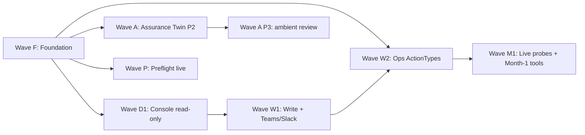

# Implementation Plan (Standard Set)

Authoritative sequencing document for the next tranche of AIOpsPilot work.
Consolidates the design decisions of 2026-07-06 (the "standard set") and the
phased wave plan that follows from them.

- **Standard Set**: six design decisions (R1, R2, R3, R4, R6, R7) that unify
  overlapping abstractions across the design docs added on 2026-07-06.
- **Wave plan**: Foundation -> Console Day 1 -> Write set -> Ops ActionTypes
  -> Live probes, plus two parallel tracks for Assurance Twin and Preflight.
- **Not a delivery commitment**: this doc is the coordinating record.
  Individual PRs are still measured against their own exit gates and the
  safety invariants in
  [coding-conventions.instructions.md](../../.github/instructions/coding-conventions.instructions.md#safety).

> Customer-agnostic scope: every module name and phase label below is generic.
> A fork tunes without editing `core/` via the DI seams in
> [project-structure.md](project-structure.md).

## 1. Why this doc exists

The 2026-07-06 tranche added seven new roadmap docs (action-ontology,
execution-model, operator-console, assurance-twin, deployment-preflight,
prompt-composition expansions, db-dr-drill runbook). Read side-by-side,
several concepts appear in two places at once:

- `Axis A` in the risk-classification table already evaluates
  `blast_radius` and `environment`; six-axis ceiling axes D (static_blast)
  and G (env) re-read the same signals.
- Operator console `ConsoleTool` and ActionType `trigger_kind=operator_request`
  express the same shape (name / argument_schema / RBAC floor /
  side_effect_class) from two different catalogs.
- Five planned Azure OpenAI adapters (cross-check / proposer / critic /
  judge / conversational) all do the same "role -> deployment id -> chat
  completions" round trip.
- Assurance Twin `projection` and Deployment Preflight scratch analyzer
  are the same primitive at different scopes.
- `operator_memory` and `audit_log` both store append-only, hash-addressable
  events, with the audit log already declared the source of truth for
  session state.
- `pr_native` and `pr_manual` differ only by a merge-policy label yet are
  modeled as two distinct execution paths.

The standard set collapses each pair into one authoritative representation.

## 2. Standard set (design decisions locked 2026-07-06)

Each decision is scoped, testable, and non-negotiable at the schema level
before Wave F starts. Deviating from any decision below in a downstream PR
requires an explicit change to this document first (docs-first, per
[coding-conventions.instructions.md](../../.github/instructions/coding-conventions.instructions.md#documentation-workflow)).

### 2.1 R1 - Axes D and G are derivation-only from Axis A

The six-axis ceiling in
[execution-model.md § 2](execution-model.md#2-six-axis-ceiling--risk-classification-table)
already declares Axis A (risk-classification table) as the authoritative
baseline for `blast_radius` and `environment`. R1 makes that authority
structural, not just semantic.

**Contract change**

- The RiskGate combinator computes `blast_radius` and `environment`
  contributions **exactly once**, inside Axis A.
- Axes D (`static_blast`) and G (`env`) are retained in
  `resolved_ceiling` for readability, but their level is *derived from*
  the Axis A verdict, not independently computed. Neither axis re-queries
  the ActionType `blast_radius` block or the environment classifier.
- Loader cross-check: any axis whose reason string contains a fact
  already claimed by Axis A must reference the Axis A rule id in the
  audit entry (`derived_from: <matched_rule_id>`), so a future audit
  reader sees the derivation chain and cannot mistake D or G for a
  second opinion.
- The `min()` combinator remains unchanged (four independent axes plus
  A, D-and-G-as-derivations).

**Effect**

- One classification per signal, not two. Fewer places to tune, no risk
  of A and D disagreeing.
- Property test: for every `FeatureVector`, the level reported on Axis D
  and Axis G is the value implied by Axis A's decision path (asserted by
  the test, not by copying constants).

**Non-goal**

- Removing the six-axis vocabulary from
  [execution-model.md § 2](execution-model.md#2-six-axis-ceiling--risk-classification-table).
  The prose value of showing operators a per-axis breakdown is preserved;
  the change is in how the levels are computed.

### 2.2 R2 - ConsoleTool is a projection over the ActionType catalog

Operator console `ConsoleTool` (write / approve / execute class) and
ActionType with `trigger_kind in {operator_request, both}` express the
same shape. R2 makes the ActionType catalog the sole authoritative source
for these tools.

**Contract change**

- Write-class console tools (`simulate_change`, `approve_hil`,
  `run_runbook`, `activate_break_glass`, every `ops.*`, every
  `governance.*`) are enumerated as **projections** of the ActionType
  catalog filtered by `trigger_kind`. `list_tools()` for a principal is
  `ActionTypeCatalog.filter(trigger_kind in {operator_request, both},
   principal_role >= min_role) union SystemConsoleTools`.
- Read-class tools (`describe_event`, `explain_verdict`, `explore_catalog`,
  `query_audit`, `query_inventory`) remain a small distinct set
  (`SystemConsoleTool`, five entries) since they do not map to a
  mutation. They keep their own thin registry with argument_schema and
  RBAC floor but no ActionType.
- Tool discovery contract (name / description / parameters / rbac_floor
  / side_effect_class / failure_modes) is unchanged - it becomes a view
  computed from the ActionType, not a second source of truth.
- The `ConsoleTool` Protocol becomes a **presentation adapter**, not a
  catalog. It wraps an ActionType invocation and adds console-specific
  behaviour (evidence_refs, preview text, redaction hints).

**Effect**

- One catalog, one loader, one validation surface. Adding a new
  `ops.*` YAML automatically exposes it in the console under the
  configured RBAC floor. No mirror registration required.
- The audit contract in
  [action-ontology.md § 9](action-ontology.md#9-audit-contract) already
  writes `action_type_id`, `trigger_kind`, and `side_effect_class` on
  every dispatch - the console never needs to write a separate
  console-tool audit record for a write-class call.

**Non-goal**

- Forcing read-class tools into the ActionType shape. `describe_event`
  and its four peers are not actions; keeping them out of the ontology
  keeps the ontology honest.

### 2.3 R3 - Unified `LlmBinding` with a role enum

Five planned Azure OpenAI adapters (`AzureOpenAICrossCheckModel`,
`AzureOpenAIProposer`, `AzureOpenAICritic`, `AzureOpenAIJudge`, the
planned `AzureOpenAIConversationalModel`) share the same request /
response shape and differ only in prompt / deployment / role. R3
consolidates them.

**Contract change**

- One Protocol seam, `LlmBinding`, with a `role` parameter drawn from a
  fixed enum: `t2_cross_check`, `proposer`, `critic`, `judge`,
  `narrator_t1`, `narrator_t2`.
- One Azure implementation, `AzureOpenAIChatBinding`, that looks up the
  deployment id from `resolved-models.json` keyed by the role. Existing
  role-specific classes become **thin factories** that call the shared
  binding with the correct role (kept for one release for backward
  compatibility, then removed).
- Composition-root wiring is one Protocol -> one adapter. A fork replaces
  every LLM role by binding a single alternate implementation.
- The prompt composer
  ([prompts/composer.py](../../src/aiopspilot/core/prompts/composer.py))
  is the only component that varies system prompt per role; the binding
  is prompt-agnostic.

**Effect**

- Adding a role is `Enum.append + resolved-models.json entry`, not a
  new adapter class. The upstream ships `narrator_t1` and `narrator_t2`
  without introducing a fifth Azure OpenAI adapter.
- Cost telemetry (prompt_tokens, completion_tokens, model_deployment_id)
  emits one common shape across all roles, so cross-role cost
  aggregation stays simple.

**Non-goal**

- Merging the shipped `AzureOpenAICrossCheckModel /Proposer / Critic /
  Judge` classes in a breaking release. The migration is additive:
  introduce `AzureOpenAIChatBinding`, re-implement each existing class
  as a factory over it, remove the factories once no caller imports
  them directly.

### 2.4 R4 - Shared `Projection` primitive for Twin and Preflight

Assurance Twin (whole subscription) and Deployment Preflight (single
deploy) both build a read-only projection over the inventory, apply a
diff, and evaluate T0 rules. R4 factors that primitive out.

**Contract change**

- New Protocol at `shared/providers/projection.py`:

  ```python
  class ScratchProjection(Protocol):
      def apply_diff(self, diff: InventoryDiff) -> ScratchProjection: ...
      def evaluate(self, rules: RuleSet) -> Findings: ...
      # read-only, immutable, deterministic
  ```

- `core/deploy_preflight/analyzer.py` consumes the primitive with a
  single-target diff.
- `core/assurance_twin/projection.py` consumes the same primitive with a
  whole-subscription snapshot as baseline plus per-change diffs for
  review.
- Both consumers keep their own outer types (`DeploymentReadinessReport`,
  `PostureAssessmentReport`); only the projection kernel is shared.

**Effect**

- One place to test determinism, immutability, and diff replay.
- Twin's simulation surface for the three verticals (§Twin as simulator)
  becomes `ScratchProjection.apply_diff(...).evaluate(vertical_rules)` -
  same primitive, three consumers.

**Non-goal**

- Merging the two report shapes. A single-deploy readiness verdict and
  a whole-estate posture score have different consumers and different
  shapes; only the projection kernel is common.

### 2.5 R6 - `operator_memory` is a materialized view of the audit log

Session state and operator memory both need append-only, hash-addressable
storage; the audit log already provides that. R6 makes the audit log the
source of truth and the `operator_memory` table a materialized view.

**Contract change**

- New `action_kind` values on the audit log:
  `operator.memory.append`, `operator.memory.supersede`,
  `operator.memory.expire`. Each carries the memory row's fields
  (scope_kind, scope_ref, category, body, source_event, source_ref,
  author, approved_by, ttl).
- The Postgres `operator_memory` table stays for query performance but
  becomes a **derived view** rebuilt from the corresponding audit
  entries. A rebuild is deterministic: replaying the audit log yields
  the same table byte for byte.
- Write path: `OperatorMemoryStore.append(...)` writes the audit entry
  first (source of truth), then updates the view.
- Read path: unchanged for callers - the view is what they query - but
  the store MUST tolerate a rebuild (drop + replay) as a supported
  admin operation.
- No new session table: `ConversationSession.turns` remains projected
  from the audit log, which is already the design in
  [operator-console.md § 6](operator-console.md#6-session-model--memory).

**Effect**

- One durable store instead of two. A GDPR-style deletion request runs
  against the audit log alone.
- Test invariant: for every sequence of memory operations, `replay(audit)
  == current(operator_memory)`.

**Non-goal**

- Removing the `operator_memory` table. Its query patterns (scope index,
  supersede chain) justify the materialization; the change is that it
  is derived, not authoritative.

### 2.6 R7 - `pr_manual` is a flag on `pr_native`

The `pr_native` and `pr_manual` execution paths differ only by whether
auto-merge is allowed. R7 flattens them.

**Contract change**

- `ActionType.execution_path` enum shrinks to `pr_native | direct_api`.
- ActionType adds `require_manual_merge: bool` (default `false`). When
  `true`, the shipped `GitOpsPrAdapter` sets the `hil` label and the
  `merge-not-eligible` label and disables auto-merge for the PR
  regardless of what the axes permit.
- The executor selection table in
  [execution-model.md § 5.4](execution-model.md#54-executor-selection-at-dispatch)
  collapses. Strict order becomes:
  `require_manual_merge (any path) > pr_native (auto-merge eligible) >
  direct_api`. An axis may only *raise* `require_manual_merge` (never
  clear it) and may only *step down* from `direct_api` to `pr_native`
  (never up for speed) - the never-raising rule from
  [execution-model.md § 2.7](execution-model.md#27-combining) is
  preserved.
- Existing YAMLs that would have set `execution_path: pr_manual`
  translate to `execution_path: pr_native` + `require_manual_merge:
  true`. The migration is mechanical and covered by a script under
  [scripts/](../../scripts/).

**Effect**

- One less enum value. One executor path implementation. The
  `GitOpsPrAdapter` is the only PR path; the flag governs the label
  set.

**Non-goal**

- Merging PR paths with direct API. `pr_native` and `direct_api` remain
  distinct because their audit / rollback contracts differ (git revert
  vs `rollback_contract`).

## 3. What the standard set does not change

For clarity: the following stay exactly as described in the 2026-07-06
docs. If a downstream PR reads one of these as changed, the reader is
mis-reading this document.

- The four safety invariants (stop-condition, rollback, blast-radius
  limit, audit entry) apply to every autonomous action, no chat-specific
  carve-outs, no direct-API relaxation. See
  [coding-conventions.instructions.md § Safety](../../.github/instructions/coding-conventions.instructions.md#safety).
- Shadow-first for every new action. Promotion to enforce is per-action,
  measured against `promotion_gate`, and separately reviewed.
- LLM is a translator, not a judge. Execution eligibility is granted by
  deterministic verification, never by a model's confidence
  ([architecture.instructions.md § LLM Quality Gate](../../.github/instructions/architecture.instructions.md#llm-quality-gate-required-for-t2)).
- The rule catalog stays customer-agnostic. Per-customer values live in
  a fork ([generic-scope.instructions.md](../../.github/instructions/generic-scope.instructions.md)).

## 4. Wave sequencing

The waves below are dependency-ordered. Each wave has an explicit exit
gate; a wave is not complete until every gate is measurable and green.

### Wave F - Foundation

Prerequisite for every other wave. Touches schema and the risk-gate
integration; does not add new autonomy.

- **F1** ActionType schema extension. New fields per
  [action-ontology.md § 2](action-ontology.md#2-schema): `trigger_kind`,
  `ceiling_by_tier`, `env_scope`, `prod_downgrade`, `execution_path`
  (enum shrunk per R7), `require_manual_merge`, `argument_schema`,
  `live_probe_ref`, `provenance`. Loader cross-checks per
  [action-ontology.md § 8](action-ontology.md#8-loader--validation).
- **F2** `resolved_ceiling` JSON Schema at
  `src/aiopspilot/shared/contracts/ontology/resolved-ceiling.schema.json`,
  matching the shape in
  [execution-model.md § 8](execution-model.md#8-resolved_ceiling-audit-block)
  with the R1 derivation notation (`derived_from` on Axes D and G).
- **F3** Backfill the 16 shipped ActionType YAMLs
  ([action-ontology.md § 3.1](action-ontology.md#31-remediation)) with the
  new fields. All `trigger_kind = rule_violation`, `execution_path =
  pr_native`, `require_manual_merge = false`, `ceiling_by_tier` from
  today's implicit defaults.
- **F4** `RiskTable` and `risk-classification.yaml` cross-check that
  Axes D and G contributions reference the Axis A rule id (R1
  derivation invariant).
- **F5** Overlay loader with the four-tier precedence in
  [action-ontology.md § 7.5](action-ontology.md#75-precedence):
  runtime > Rego > file overlay > upstream. Audit entry names the
  winning layer.
- **F6** `RiskDecision` migration: add `quorum`, `matched_rule_id`,
  `catalog_version`, `resolved_ceiling`, `execution_path`,
  `require_manual_merge` fields with safe defaults; keep `outcome` as
  a derived alias one release.
- **F7** `ControlLoop` and `composition.py` route every dispatch
  through `evaluate_execution_authority()`
  ([execution-model.md § 3](execution-model.md#3-unified-riskgate)).
  Behaviour still shadow-only because no ActionType is promoted.
- **F8** Six-axis property tests including R1 derivation invariant.

**Exit gate**

- All existing scenario suites green.
- Every dispatch writes a `resolved_ceiling` block that names the Axis
  A rule id.
- No ActionType has been promoted; the loop remains shadow-only.

### Wave D1 - Operator Console Day 1 (read-only CLI)

Follows F. Implements
[operator-console.md § Day 1](operator-console.md#day-1-this-session).

- **D1.1** `AzureCliWorkloadIdentity` for local `az login` dev.
- **D1.2** `LlmBinding` Protocol + `AzureOpenAIChatBinding` with the R3
  role enum. Composition-root wires narrator roles via
  `resolved-models.json`.
- **D1.3** `ConversationCoordinator` + `ConversationSession` (state =
  audit-log projection, per
  [operator-console.md § 6](operator-console.md#6-session-model--memory)).
- **D1.4** Five read-only tools (`describe_event`, `explain_verdict`,
  `explore_catalog`, `query_audit`, `query_inventory`) implemented as
  `SystemConsoleTool` (R2: not ActionType-derived).
- **D1.5** RBAC gate before narrator sees the tool schema; Chat T0
  intent matcher.
- **D1.6** `CliReplChannel` and `tools/chat.py`.
- **D1.7** Tests: RBAC matrix, escalation triggers, verifier re-check,
  golden transcript, session recovery.

**Exit gate**

- A Reader-role principal can complete every Day-1 tool scenario from
  the CLI REPL against the deployed dev environment.

### Wave W1 - Write set, Teams / Slack pull, HIL callback

Follows D1. Implements
[operator-console.md § Week 1](operator-console.md#week-1) and the
prompt-composition Wave 3 step B pipeline slice 3 leftover
([prompt-composition.md § Rollout waves](prompt-composition.md#rollout-waves)).

- **W1.1** Write-class tools (`simulate_change`, `approve_hil`,
  `list_hil`, `run_runbook`, `activate_break_glass`). Per R2, these are
  ActionType projections and land as `governance.*` / `ops.*` ActionType
  YAMLs that the console filters and exposes.
- **W1.2** `TeamsBotChannel` and `SlackBotChannel` (pull). Reuse the
  push channel credentials in
  [config/notifications-matrix.yaml](../../config/notifications-matrix.yaml).
- **W1.3** Read-API HIL callback (`POST /hil/{approval_id}/decision`,
  HMAC-verified). Only allowed POST on the read API.
- **W1.4** BreakGlass fail-closed on notification: refuse when no
  channel confirms delivery.
- **W1.5** Prompt-composition Wave 3 step B pipeline slice 3
  (fork-first second-approval channel).
- **W1.6** Operator memory exposed to the console via
  `OperatorMemoryStore` (per R6, backed by audit log). Scope-bounded
  reads/writes only; never merged into narrator memory.

**Exit gate**

- An Approver in Teams completes "detect -> chat inspect -> approve ->
  shadow PR opens" against dev; every turn / verdict / PR link is in
  the audit log.

### Wave W2 - Ops ActionTypes, direct_api executor, cost gate

Follows W1. Implements
[execution-model.md § Week 2](execution-model.md#week-2).

- **W2.1** `ops.*` ActionType YAMLs from
  [action-ontology.md § 3.2](action-ontology.md#32-ops). Cost-increasing
  entries declare `cost_impact_monthly` so the Axis A cost gate applies
  ([execution-model.md § 2.8](execution-model.md#28-cost-increasing-ops-actions)).
- **W2.2** `governance.*` ActionType YAMLs
  ([action-ontology.md § 3.3](action-ontology.md#33-governance)). All
  `execution_path: pr_native`.
- **W2.3** Direct-API executor at
  `src/aiopspilot/core/executor/direct_api.py` with idempotency-key
  reuse, `stop_conditions` enforcement, and `mutation_target=direct`
  HIL items. **Skeleton shipped**: the CSP-neutral
  :class:`DirectApiExecutor` Protocol + fake
  (`shared/providers/direct_api.py` +
  `shared/providers/testing/direct_api.py`) with idempotency-by-key,
  the ``enforce`` promotion-label check, and outcome enum
  (`SUCCEEDED / ALREADY_APPLIED / PRECONDITION_FAILED / STOPPED /
  FAILED`). The `core/executor/direct_api.py` glue (composition,
  audit wiring, HIL enqueue) is the remaining step and MUST honour
  the fallback-idempotency invariant in
  [execution-model.md § 5.4](execution-model.md#54-executor-selection-at-dispatch).
- **W2.4** Azure ARM adapters for the shipped ops actions.
- **W2.5** Cost Governance vertical exposes the estimator to Axis A
  ([execution-model.md § 2.8](execution-model.md#28-cost-increasing-ops-actions)).
- **W2.6** Executor path selection tests (R7: `require_manual_merge`
  strictly raises never lowers).

**Exit gate**

- Contributor via the console executes `ops.restart-service` on a
  non-prod resource under a `quiet` live probe; audit shows
  `execution_path=direct_api` and every safety invariant holds.

### Wave M1 - Live probes, observation depth, Rego overlays

Follows W2. Implements
[execution-model.md § Month 1](execution-model.md#month-1) and
[operator-console.md § Month 1](operator-console.md#month-1).

- **M1.1** `LiveBlastProbe` Protocol, `NoOpBlastProbe`, and
  `AzureMonitorBlastProbe` (KQL and Metrics API adapters).
- **M1.2** Starter probes under
  [rule-catalog/probes/](../../rule-catalog/probes/):
  `vm_traffic_last_5m`, `storage_access_log`, `lb_backend_health`.
- **M1.3** ActionTypes opt into `live_probe_ref`. Probe failure ->
  `active`; repeated failure -> `shadow_only`
  ([execution-model.md § 4.2](execution-model.md#42-runtime-shape)).
- **M1.4** `governance.override-ceiling` runtime (Rego fragment writer
  under `policies/action_types/`), time-boxed via the exemption
  workflow.
- **M1.5** Observation-depth tools (`query_log`, `query_metric`,
  `query_deployments`, `correlate_incident`) via `AzureMonitorAdapter`
  and `DeploymentHistoryAdapter`.
- **M1.6** `WebChatChannel` on the read-only console SPA.
- **M1.7** Prompt-composition Wave 5 beta (concrete `WebSearchProvider`
  fork adapter + composition wire).

**Exit gate**

- At least one live probe reduces autonomy at least once in production
  shadow measurement; the audit entry shows `winning_axis=live_blast`.

### Wave A - Assurance Twin (parallel P2 / P3)

Independent of Waves D1..M1 once Wave F ships. Implements
[assurance-twin.md](assurance-twin.md).

- **A.1** `ScratchProjection` primitive per R4 at
  `shared/providers/projection.py`.
- **A.2** `core/assurance_twin/projection.py` builds a whole-subscription
  projection on top of the R4 primitive.
- **A.3** `core/assurance_twin/query.py` compiles NL -> typed ontology
  query; the T2 quality gate is the authority
  ([assurance-twin.md § 3](assurance-twin.md#3-verifiable-text-to-query-not-text-to-answer)).
  Upstream ships the `TypedQuery` / `Predicate` types, the
  `QueryVerifier` (rejects unknown resource_type, non-read-only ops,
  and count-with-projection), a deterministic
  `DeterministicPatternCompiler` covering the T0 grammar
  (`list` / `count` / `list ... without ...` / `list ... with ...` /
  `list ... where ... is ...`), and the `execute_query` runner over
  `ScratchProjection`. A fork installs its own `NlQueryCompiler` that
  routes residual questions through the T2 quality gate; its output
  MUST pass through the same shipped `QueryVerifier`.
- **A.4** `core/assurance_twin/review.py` posts ambient reviews on IaC
  PRs via the GitHub Checks API adapter.
- **A.5** `core/assurance_twin/report.py` assembles the
  `PostureAssessmentReport`; the console SPA gains a read-only panel.

**Exit gate**

- Every answered question cites a rule; every ungroundable question
  abstains and feeds the discovery loop.

### Wave P - Preflight live adapters + toggle catalog

Independent of Waves D1..M1 once Wave F ships. Implements the delivery
increments in
[deployment-preflight.md § Delivery Increments](deployment-preflight.md#delivery-increments).

- **P.1** Live Azure preflight adapters (Policy Insights, Resource
  Graph, Firewall/NSG, Quota) under
  `delivery/azure/preflight/`. Consume the R4 primitive for scratch
  evaluation.
- **P.2** `infra/modules/` capability-mode toggles from
  [deployment-preflight.md § Blocker to Terraform Toggle Mapping](deployment-preflight.md#blocker-to-terraform-toggle-mapping).
- **P.3** GitHub Check that posts the report on infrastructure PRs.
- **P.4** Deployment Environment Profile cache refreshed via the
  `Inventory` delta stream.

## 5. Dependency graph



## 6. Open decisions

Standing decisions pending sign-off. Each one blocks a specific wave; a
wave does not start until its listed decisions are resolved.

- **OD-C1 (blocks D1)** Narrator prompt catalog path:
  `rule-catalog/prompts/narrator/` vs `rule-catalog/prompts/console/`.
  Reference:
  [operator-console.md § 15](operator-console.md#15-open-decisions-tracked).
- **OD-C2 (blocks W1)** `operator_memory` schema sign-off (per R6 the
  schema is the audit `action_kind` shape; the view schema follows).
- **OD-C3 (blocks W1)** Whether an active break-glass grant tightens
  the no-self-approval invariant to paired-approver-only. Owner:
  security-and-identity doc author.
- **OD-C4 (blocks D1)** CLI REPL history path and retention. Proposal:
  `~/.aiopspilot/console-history.jsonl`, capped at 10 MiB, redacted
  before write.
- **OD-P1 (blocks W2)** Cost estimator API surface for Axis A. Owner:
  Cost Governance vertical.
- **OD-P2 (blocks M1)** Which starter probes ship with Azure Monitor
  bindings vs stay `NoOpBlastProbe` at Month 1 gate.

## 7. Fork implications

- **R2** removes the mirror-registration step for a fork's custom ops
  actions. A fork's `rule-catalog/action-types-overrides/` entry that
  sets `trigger_kind: operator_request` is automatically exposed on the
  console under the declared RBAC floor.
- **R3** simplifies the LLM DI surface. A fork implements
  `LlmBinding` once and gets every role.
- **R4** gives forks a single Protocol (`ScratchProjection`) to
  extend when they want to bring their own graph or their own diff
  applier.
- **R6** means a fork's audit-log retention policy is the single
  operator_memory retention policy. A shorter TTL on the audit log
  automatically truncates the memory view.
- Full fork guidance stays in
  [downstream-fork-guide.md](downstream-fork-guide.md); the standard
  set does not add a new seam beyond `LlmBinding` and
  `ScratchProjection`.

## 8. Related docs

- [action-ontology.md](action-ontology.md) - schema R1/R2/R7 land in.
- [execution-model.md](execution-model.md) - the RiskGate that Axis
  R1 constrains.
- [operator-console.md](operator-console.md) - console shape R2 and R3
  refine.
- [assurance-twin.md](assurance-twin.md) - Twin subsystem R4 shares a
  primitive with.
- [deployment-preflight.md](deployment-preflight.md) - Preflight
  subsystem R4 shares a primitive with.
- [prompt-composition.md](prompt-composition.md) - LLM binding surface
  R3 unifies; operator_memory storage R6 refines.
- [downstream-fork-guide.md](downstream-fork-guide.md) - fork walkthrough
  the standard set simplifies.
- [architecture.instructions.md](../../.github/instructions/architecture.instructions.md) -
  domain vocabulary the standard set does not add to.
- [coding-conventions.instructions.md](../../.github/instructions/coding-conventions.instructions.md) -
  safety and documentation contract every wave inherits.
