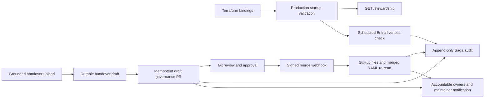

# 에이전트 운영 책임 수명 주기

이 문서는 FDAI 운영 책임(`stewardship`)의 구현된 runtime 및 governance 수명 주기를 정의합니다.
Handover-map schema와 ownership 개념은
[에이전트 운영 책임과 담당자 인수인계](agent-stewardship-and-handover-ko.md)를 참조하세요.

> Console은 read-only를 유지합니다. Ownership 변경은 draft pull request로 생성하고 Git host에서
> 검토하며, merge 후 signed webhook으로 관찰합니다. Stewardship은 RBAC capability를 부여하지
> 않으며 Thor의 executor identity를 받지 않습니다.

## 설계 개요

수명 주기에는 서로 독립적인 네 가지 safety boundary가 있습니다.

1. **Startup readiness**는 production에서 동일한 handover map을 load하고 placeholder identity를
   거부합니다.
2. **Scheduled health**는 control-loop hot path 밖에서 활성 Entra user를 확인하고 health state
   transition만 audit합니다.
3. **Draft delivery**는 grounded handover document를 idempotent governance PR 하나로 변환합니다.
4. **Merge observation**은 GitHub signature를 검증하고 changed file과 merged content를 다시 읽은
   다음 merge audit를 작성하고 새 accountable owner에게 알립니다.



## 구현 상태

| Capability | Owner | 상태 | 근거 |
|------------|-------|------|------|
| Production map binding | read API composition | 구현됨 | `build_prod_app()`이 `config/agent-stewardship.yaml`을 load하고 `GET /stewardship`을 등록합니다. |
| Real-binding readiness | Terraform plus resolver | 구현됨 | Container Apps가 `FDAI_STEWARDSHIP_REQUIRE_BINDINGS=1`, maintainer OID, agent별 override를 받습니다. |
| Stale identity audit | stewardship health monitor | 구현됨 | 설정한 interval로 Entra liveness를 실행하고 transition-only state 및 audit를 기록합니다. |
| Handover draft PR | ingestion consumer plus GitOps adapter | 구현됨, opt-in | 처리된 `handover_bootstrap` upload가 `config/agent-stewardship.yaml` draft PR 하나를 엽니다. |
| Merge notification and audit | signed GitHub webhook | 구현됨, opt-in | Adapter가 HMAC, changed file, repository, merge state, merged YAML을 검증한 후 기록합니다. |
| Console mutation | console | 의도적으로 없음 | SPA는 ownership 및 draft result를 읽기만 하며 Git credential을 보유하거나 executor를 호출하지 않습니다. |

Grounded T2 `HandoverInterpreter`는 선택적인 deployment binding으로 남습니다. Deterministic
extractor와 exact Graph resolution은 이 binding 없이 동작하며, 기본 interpreter는 추측하는 대신
검토 대상으로 보류합니다.

## 수명 주기 계약

### Production startup

Read API는 route를 구성하기 전에 ownership map을 load합니다. Production factory가 사용하는 동일한
environment mapping을 resolver에 전달하므로 deployment override와
`FDAI_STEWARDSHIP_REQUIRE_BINDINGS`가 projection을 제공하는 process에서 분리되지 않습니다.

`enable_read_api=true`인 deployment는 다음 값을 제공합니다.

- real maintainer OID 최소 1개, 권장 2개
- autonomous가 아닌 모든 pantheon agent의 accountable binding
- scheduled liveness check를 위한 `FDAI_IAM_DIRECTORY_PROVIDER=entra`
- 60초 이상의 liveness interval

Terraform은 apply 전에 completeness를 확인합니다. Resolver는 startup에서 schema version 1,
distinct real maintainer 및 steward subject, UUID-shaped personal-channel key, exact environment
token shape, forbidden-role absence, placeholder policy, agent parity, responsibility 값,
autonomous reason을 다시 확인합니다.

### Scheduled identity health

`StewardshipHealthMonitor`는 production human directory를 core `IdentityDirectory` protocol에
adapt합니다. Maintainer와 user-steward OID를 hot path 밖에서 검사합니다.

Monitor는 `stewardship_health:current` 아래 revisioned snapshot 하나를 저장합니다.

- 현재 stale finding
- check timestamp
- 단조 증가 revision
- audit correlation에 사용하는 deterministic fingerprint

결과가 바뀌지 않으면 no-op입니다. Clean-to-stale 또는 stale-to-clean transition은 state를
원자적으로 update하고 `stewardship.health.changed`를 append합니다. Graph failure는 error type만
log하고 다음 interval에 retry합니다. 모든 identity를 stale로 만들거나 control loop를 중지하지
않습니다. 첫 sweep는 named background task에서 시작하므로 Graph latency가 read API startup을
지연하지 않습니다. Read API는 최신 snapshot을 validate하고 stale finding을 `/stewardship`
coverage에 merge합니다. Malformed durable state는 base map을 숨기지 않고
`identity_health.status=unavailable`로 표시합니다.

### Draft PR 생성

Ingestion worker가 `HandoverDraftArtifact`를 저장한 다음 optional
`StewardshipGovernanceService`가 같은 core resolver로 rendered YAML을 validate하고
`RemediationPrPublisher`를 통해 draft PR을 publish합니다.

PR candidate는 현재 validated map에 대한 additive overlay입니다. Grounded mapping은 subject를
추가하거나 retag하지만 existing owner, maintainer, channel, threshold는 유지합니다. Service는
unmapped draft agent를 자동으로 autonomous로 바꾸거나 owner를 제거하지 않습니다. 제거는 사람이
reviewed PR에서 명시적으로 수행해야 합니다.

Proposal contract는 다음과 같이 고정됩니다.

| Field | Value |
|-------|-------|
| Target path | `config/agent-stewardship.yaml` |
| Mode | `shadow` |
| Labels | `shadow`, `governance`, `stewardship` |
| Idempotency key | `handover:<upload_id>` |
| Rollback | Merge된 configuration commit revert |
| Actor | 인증된 upload-session `actor_id` |

Publisher는 write 전에 기존 branch를 Git host에서 probe합니다. Publish 후 service는 durable
proposal state를 claim하고 `stewardship.change.requested`를 append합니다. 첫 claim만 operational
notification을 전송합니다. Remote PR 생성 후 local claim 전에 process가 중지되면 retry가 기존
PR을 찾고 duplicate 없이 누락된 local state를 복구합니다. Local state가 존재한 뒤에는 remote
call 전에 correlation id로 receipt를 resolve하므로 첫 PR이 closed된 후 upload를 재처리해도 다른
PR을 열지 않습니다.

### Merge observation

Governance가 enabled일 때만 ingestion gateway가
`POST /ingestion/webhooks/github/stewardship`을 등록합니다. Route는 최대 1 MiB를 허용하고 console
Entra flow 대신 HMAC authentication을 사용합니다.

Adapter는 다음 순서로 검사합니다.

1. `X-Hub-Signature-256`을 constant time으로 비교합니다.
2. `pull_request` delivery id와 configured `owner/repository`를 요구합니다.
3. `action=closed`, `merged=true`, PR number, merge commit SHA를 요구합니다.
4. Bounded 100-file page로 changed file을 최대 3000개 query하고
   `config/agent-stewardship.yaml`을 요구합니다.
5. Merge commit에서 해당 file을 다시 fetch하고 GitHub의 whitespace-wrapped base64 UTF-8
   content를 decode합니다.
6. Merged map을 validate하고 old/new map으로 affected agent를 계산합니다.
7. Append-only merge audit와 함께 `stewardship_governance:merge:<delivery_id>`를 claim합니다.
8. Merged map의 affected owner와 FDAI maintainer에게 알립니다.

GitHub login은 `github:<login>`과 같은 provider-qualified audit identity로 기록합니다. Entra OID로
표현하지 않습니다. Duplicate delivery는 두 번째 audit나 notification 없이 success를 반환합니다.

## 영향받는 owner 계산

Diff는 deterministic합니다.

- 변경된 agent block은 해당 agent에만 영향을 줍니다.
- Maintainer, personal channel, escalation timeout, coverage threshold 변경은 모든 escalation
  chain을 바꿀 수 있으므로 15개 agent 전체에 영향을 줍니다.
- Workflow document는 기존 recursive pantheon-name extraction을 계속 사용합니다.
- Unknown agent name은 resolver가 먼저 거부하므로 diff 단계에 도달하지 않습니다.

Requested notification은 현재 active map을 사용합니다. Merge notification은 새 accountable owner가
handover 결과를 받도록 merged map을 사용합니다.

## Deployment configuration

Document ingestion, read API, ChatOps를 활성화한 후에만
`enable_stewardship_governance=true`를 설정하세요. Terraform은 다음 deployment-owned 값을
요구합니다.

| Input | Runtime binding | Storage |
|-------|-----------------|---------|
| `stewardship_maintainers` | `FDAI_MAINTAINERS` | non-secret environment configuration |
| `stewardship_agent_bindings` | `FDAI_STEWARD_<AGENT>` | non-secret environment configuration |
| `gitops_owner`, `gitops_repo` | `FDAI_GITOPS_OWNER`, `FDAI_GITOPS_REPO` | non-secret environment configuration |
| `gitops_token` | `FDAI_GITOPS_TOKEN` | Key Vault reference only |
| `github_webhook_secret` | `FDAI_GITHUB_WEBHOOK_SECRET` | Key Vault reference only |
| `chatops_webhook_url` | `FDAI_CHATOPS_WEBHOOK_URL` | Key Vault reference only |

GitHub App 또는 token에는 adapter가 필요한 repository content, pull-request, issue-label permission만
부여하는 것이 좋습니다. Pull-request event용 GitHub webhook을 구성하고 published ingestion gateway
route를 가리키세요. Short-lived installation token은 deployment configuration으로 rotate하고 commit
또는 log하지 마세요.

## Failure 및 recovery

| Failure | 동작 | 복구 |
|---------|------|------|
| Placeholder 또는 missing owner | Terraform plan 또는 process startup 실패 | Real deployment binding을 제공하고 restart합니다. |
| Graph unavailable | 현재 ownership을 계속 사용하며 synthetic stale result를 만들지 않음 | 다음 monitor interval에 retry합니다. |
| GitHub publish 중단 | Worker가 동일 upload id로 retry | Remote idempotency probe로 기존 PR을 복구합니다. |
| Notification delivery 실패 | Router가 fallback을 시도한 후 HIL escalation을 persist | Channel을 복구하고 audit evidence에서 replay합니다. |
| Invalid webhook signature | GitHub I/O 전에 request 거부 | GitHub webhook secret을 수정합니다. |
| 관련 없는 PR merge | State 변경 없이 delivery acknowledge | 조치가 필요하지 않습니다. |
| Duplicate merge delivery | Durable claim이 no change 반환 | Duplicate audit 또는 notification을 emit하지 않습니다. |

## Verification

Deployment 전 focused ownership gate를 실행하세요.

```bash
bash scripts/governance/check-stewardship.sh
uv run pytest tests/core/stewardship tests/delivery/stewardship \
  tests/delivery/ingestion_gateway/test_handover.py -q --no-cov
terraform -chdir=infra validate
```

Deployment 후 다음을 확인하세요.

1. `GET /stewardship`이 15개 agent와 예상 coverage finding을 반환합니다.
2. 현재 `stewardship_health:current` snapshot이 존재하고 최근 `checked_at`을 가집니다.
3. Synthetic handover upload가 draft PR 하나와 request audit 하나를 생성합니다.
4. Upload 재처리가 동일한 PR reference를 반환합니다.
5. 검토된 test change merge가 merge audit 하나와 operational notification 하나를 생성합니다.
6. 동일 GitHub delivery id 재전송이 두 번째 record를 생성하지 않습니다.

## 관련 문서

| 알아볼 내용 | 문서 |
|-------------|------|
| Ownership schema 및 handover concept | [agent-stewardship-and-handover-ko.md](agent-stewardship-and-handover-ko.md) |
| Notification route 및 fallback | [channels-and-notifications-ko.md](channels-and-notifications-ko.md) |
| Human authorization | [user-rbac-and-identity-ko.md](user-rbac-and-identity-ko.md) |
| Azure deployment input | [../deployment/deploy-and-onboard-ko.md](../deployment/deploy-and-onboard-ko.md) |
