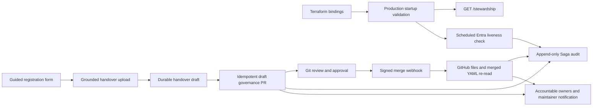

# 에이전트 운영 책임 수명 주기

이 문서는 FDAI 운영 책임(`stewardship`)의 구현된 런타임 및 거버넌스 수명 주기를 정의합니다.
Handover-map 스키마와 소유권 개념은
[에이전트 운영 책임과 담당자 인수인계](agent-stewardship-and-handover-ko.md)를 참조하세요.

> Console의 소유권 변환 결과는 읽기 전용을 유지합니다. Guided form은 인계 문서를
> 인제스트 경계에 제출합니다. 소유권 변경은 계속 초안 pull 요청으로 생성하고 Git
> host에서 검토하며, 병합 후 signed webhook으로 관찰합니다. 담당 체계는 RBAC 기능을
> 부여하지 않으며 Thor의 실행기 신원을 받지 않습니다.

## 설계 개요

수명 주기에는 서로 독립적인 네 가지 safety 경계가 있습니다.

1. **시작 준비 상태**는 운영에서 동일한 인계 map을 load하고 자리 표시자 신원을
  거부합니다.
2. **Scheduled health**는 control-loop hot 경로 밖에서 활성 Entra user를 확인하고 health 상태
  transition만 감사합니다.
3. **초안 전달**는 근거에 기반한 인계 문서를 멱등적 거버넌스 PR 하나로 변환합니다.
4. **병합 observation**은 GitHub 서명을 검증하고 changed file과 merged 내용을 다시 읽은
  다음 병합 감사를 작성하고 새 accountable 소유자에게 알립니다.


```mermaid
flowchart LR
  TF[Terraform bindings] --> START[Production startup validation]
  START --> VIEW[GET /stewardship]
  START --> HEALTH[Scheduled Entra liveness check]
  FORM[Guided registration form] --> DOC[Grounded handover upload]
  DOC --> DRAFT[Durable handover draft]
  DRAFT --> PR[Idempotent draft governance PR]
  PR --> REVIEW[Git review and approval]
  REVIEW --> HOOK[Signed merge webhook]
  HOOK --> VERIFY[GitHub files and merged YAML re-read]
  VERIFY --> AUDIT[Append-only Saga audit]
  VERIFY --> NOTIFY[Accountable owners and maintainer notification]
  HEALTH --> AUDIT
  PR --> AUDIT
  PR --> NOTIFY
```

## 구현 상태

### 구현 범위

| 영역 | 상태 | 근거 | 참고 |
|------|------|------|------|
| 시작 바인딩과 읽기 전용 변환 결과 | implemented | `services/operator-service/src/fdai_operator_service/`; `services/operator-service/tests/test_operator_operations_family.py`; `tests/integration/infra/test_operator_api_stewardship.py`; 집중 Operator 및 Terraform 테스트 (15 passed) | 경로와 배포 바인딩이 있습니다. 소스 배선만으로 실제 배포 준비 상태가 입증되지는 않습니다. |
| Terraform 바인딩 완전성 검사 | implemented | `infra/production-gates.tf`; `infra/modules/operator-api/container-app/main.tf`; `tests/integration/infra/test_operator_api_stewardship.py` | 운영 구성은 신원을 배포 소유로 유지하면서 관리자와 자율 운영이 아닌 모든 에이전트 바인딩을 요구합니다. |
| 안내형 등록과 근거 기반 영속 초안 | implemented | `console/src/routes/handover-editor.tsx`; `services/document-processing-worker/src/fdai_document_worker_service/handover.py`; 집중 콘솔 테스트 (21 passed); 집중 수집 전달 테스트 (9 passed) | SPA는 관리형 업로드를 제출하고 워커는 검토 전용 초안을 저장합니다. 어느 효과도 활성 지도를 변경하지 않습니다. |
| 멱등적 초안 거버넌스 PR 전달 | not-started | `StewardshipGovernanceService` 또는 인수인계 산출물에서 `RemediationPrPublisher`로 이어지는 동등한 조립이 없습니다. | 일반 GitOps 게시기는 있지만 담당 체계 초안과 연결되지 않았습니다. |
| 서명된 병합 수신과 후속 담당 체계 효과 | in-progress | `services/document-ingestion-api/src/fdai_ingestion_api_service/adapters/stewardship.py`; `services/document-ingestion-api/tests/test_ingestion_stewardship_webhook.py`; 집중 수집 전달 테스트 (9 passed) | HMAC, 저장소, 병합, 변경 파일, 병합 콘텐츠, 멱등 기록 검사가 있습니다. 해석기 검증, 영향받는 소유자 계산, 배정 다이제스트 일치, Saga 감사, IAM 트리거, 알림은 조립되지 않았습니다. |
| 예약 실행되는 영속 신원 상태 검사 | in-progress | `services/core-control-plane/src/fdai/core/stewardship/directory.py`; `infra/modules/operator-api/container-app/main.tf` | 유효하지 않은 OID 평가와 간격 설정은 있지만 예약 실행되는 `StewardshipHealthMonitor` 또는 `stewardship_health:*` 스냅샷 및 하트비트 조립은 찾지 못했습니다. |

### 구현 이력

| 날짜 | 상태 | 변경 | 근거 | 남은 작업 |
|------|------|------|------|-----------|
| 2026-08-13 | in-progress | 이전 출처를 재구성하지 않고 구현 원장을 도입했으며, 시작, 초안 생성, 서명된 병합 수신, 미구현 운영 효과를 구분하도록 수명 주기 주장을 바로잡았습니다. | `current change`; 구현 범위 표에 나열된 소스와 집중 검사. | 거버넌스 PR 게시, 병합 후 효과, 예약 실행되는 신원 상태 검사를 완료한 뒤 런타임 근거를 보존합니다. |

### 남은 작업

- [ ] 인수인계 산출물에서 `RemediationPrPublisher`로 이어지는 멱등 경로를 조립하고, 재시도가 `config/agent-stewardship.yaml`의 초안 PR 하나를 재사용함을 입증하는 집중 테스트를 통과시킵니다.
- [ ] 병합된 담당 체계 YAML을 해석기로 검증하고, 영향받는 소유자를 계산하며, 배정 제안 다이제스트를 결합하고, Saga 감사, IAM 요청 게시, 수신자 알림이 각각 한 번 발생함을 입증하는 집중 테스트를 통과시킵니다.
- [ ] 예약 실행되는 신원 상태 모니터를 구현하고, `stewardship_health:current` 및 `stewardship_health:last_success`에서 전이 시에만 수행되는 감사, 개정 번호가 일치하는 하트비트 갱신, 만료, Graph 실패 동작을 입증하는 테스트를 보존합니다.
- [ ] 어떤 행이든 `validated`로 올리기 전에 실제 시작 바인딩, 안내형 제안 및 검토된 병합, 알림 전달, 감사 종료, 유효하지 않음에서 정상으로의 신원 복구를 보여 주는 배포 증적과 운영 훈련을 보존합니다.

근거에 기반한 T2 `HandoverInterpreter`는 선택적인 배포 연결로 남습니다. 결정론적
추출기와 exact Graph 해석은 이 연결 없이 동작하며, 기본 interpreter는 추측하는 대신
검토 대상으로 보류합니다.

## 수명 주기 계약

### 운영 시작

Operator API는 경로를 구성하기 전에 소유권 map을 load합니다. 운영 factory가 사용하는 동일한
환경 대응을 해석기에 전달하므로 배포 재정의와
`FDAI_STEWARDSHIP_REQUIRE_BINDINGS`가 변환 결과를 제공하는 프로세스에서 분리되지 않습니다.

`enable_operator_api=true`인 배포는 다음 값을 제공합니다.

- real 관리자 OID 최소 1개, 권장 2개
- 자율이 아닌 모든 pantheon agent의 accountable 연결
- scheduled 생존 검사를 위한 `FDAI_IAM_DIRECTORY_PROVIDER=entra`
- 60초 이상의 생존 간격

Terraform은 apply 전에 완전성을 확인합니다. 해석기는 이행 중 스키마 v1과 새 map용
v2를 허용합니다. 시작에서 서로 다른 real 관리자 및 담당자 대상, UUID-shaped
personal-channel 키, exact 환경 토큰 형태, forbidden-role absence, 자리 표시자 정책,
agent parity, responsibility 및 임무 값, 자율 사유, v2 기본과 서로 다른
백업/에스컬레이션 커버리지를 확인합니다. 버전 1은 계속 동작하지만 derived-duty 및
missing-backup 발견 사항을 표시합니다.

### Scheduled 신원 health

`StewardshipHealthMonitor`는 운영 human 디렉터리를 코어 `IdentityDirectory` 프로토콜에
adapt합니다. 관리자와 user-steward OID를 hot 경로 밖에서 검사합니다.

Monitor는 `stewardship_health:current` 아래 revisioned transition 스냅샷을 저장합니다.

- 현재 stale 발견 사항
- transition 시각
- 단조 증가 개정 번호
- 감사 상관관계에 사용하는 결정론적 fingerprint

성공한 sweep마다 observation 시간, 만료 시간, 일치하는 transition 개정 번호를
`stewardship_health:last_success`에 저장합니다. 결과가 바뀌지 않으면 이 하트비트만 갱신하고 감사
기록을 만들지 않습니다. Clean-to-stale 또는 stale-to-clean transition은 transition 스냅샷을
원자적으로 갱신하고 `stewardship.health.changed`를 덧붙이기한 다음 하트비트를 갱신합니다. Graph
실패는 오류 타입만 로그하고 다음 간격에 재시도합니다. 하트비트를 갱신하거나 모든 신원을
stale로 만들거나 control loop를 중지하지 않습니다. 첫 sweep는 named background 작업에서 시작하므로
Graph 지연 시간이 Operator API 시작을 지연하지 않습니다. Operator API는 두 스냅샷이 모두 valid하고
개정 번호가 일치하며 하트비트가 만료되지 않았을 때만 stale 발견 사항을 `/stewardship` 커버리지에
병합합니다. Health 상태가 없거나 malformed, mismatched, 만료된이면 base map을 숨기지 않고
`identity_health.status=unavailable`로 표시합니다.

### 초안 PR 생성

인제스트 워커가 `HandoverDraftArtifact`를 저장한 다음 선택적
`StewardshipGovernanceService`가 같은 코어 해석기로 rendered YAML을 validate하고
`RemediationPrPublisher`를 통해 초안 PR을 publish합니다.

인계 콘솔 form은 배정마다 정본 agent name, responsibility, 대상 kind,
신원 display name 또는 이메일을 포함한 명시적 구조화된 줄 하나를 발행합니다.
결정론적 추출기는 fixed 15 agent name 중 하나만 허용합니다. Publish 후 산출물은 PR
참조, URL, 재생 플래그를 저장하므로 인증된 submitter가 재시도에서 반환된 동일한 멱등적
proposal을 열 수 있습니다.

Slack과 Teams는 exact `/handover` 첨부 directive 및 기여자 역할 floor를 통해서만 같은
경로에 들어갑니다. [conversation-attachments-ko.md](conversation-attachments-ko.md)를 참조하세요.

PR 후보는 현재 검증된 map에 대한 additive overlay입니다. 근거에 기반한 대응은 대상을
추가하거나 retag하지만 기존 소유자, 관리자, 채널, 임계값은 유지합니다. 서비스는
unmapped 초안 agent를 자동으로 자율로 바꾸거나 소유자를 제거하지 않습니다. 제거는 사람이
검토된 PR에서 명시적으로 수행해야 합니다.

Proposal 계약은 다음과 같이 고정됩니다.

| 필드 | 값 |
|-------|-------|
| 대상 경로 | `config/agent-stewardship.yaml` |
| 모드 | `shadow` |
| Labels | `shadow`, `governance`, `stewardship` |
| 멱등성 키 | `handover:<upload_id>` |
| Rollback | 병합된 구성 커밋 revert |
| Actor | 인증된 upload-session `actor_id` |

발행기는 쓰기 전에 기존 가지를 Git host에서 탐색합니다. Publish 후 서비스는 영속
proposal 상태를 점유하고 `stewardship.change.requested`를 덧붙이기합니다. 첫 점유만 operational
notification을 전송합니다. 원격 PR 생성 후 로컬 점유 전에 프로세스가 중지되면 재시도가 기존
PR을 찾고 중복 없이 누락된 로컬 상태를 복구합니다. 로컬 상태가 존재한 뒤에는 원격
호출 전에 상관관계 id로 증적을 해석하므로 첫 PR이 closed된 후 업로드를 재처리해도 다른
PR을 열지 않습니다.

승인된 human-assignment 사례도 같은 발행기를 사용하지만 더 엄격한 입력 gate를 적용합니다.
이 global map에는 `scope:platform` 임무만 표현할 수 있으며, rendered 후보는 모든
non-autonomous agent에 대해 schema-v2 기본 및 백업/에스컬레이션 커버리지를 완성해야 합니다.
Proposal 상태는 배정 사례 ID, PR ref, 정본 후보 다이제스트를 결합합니다. Signed 병합은
merged 다이제스트가 proposal과 일치할 때만 사례의 소유권 효과를 기록합니다. 부분 map 또는
mismatched 병합은 보류되며 IAM apply를 시작할 수 없습니다. 일치하는 증적을 저장한 뒤
거버넌스 서비스는 멱등 `human.assignment.iam_apply_requested` 출처 하나를 타입이 지정된 유입에
게시합니다. 인제스트 게이트웨이는 Graph 쓰기 ID를 받지 않습니다.
Storage, Event Hubs, 모델 및 담당 체계 어댑터는 동일한 exact 연결된 `FDAI_MI_CLIENT_ID`를
사용하며 주변 또는 system-assigned principal을 해석할 수 없습니다.

### 병합 observation

거버넌스가 활성화된일 때만 인제스트 게이트웨이가
`POST /ingestion/webhooks/github/stewardship`을 등록합니다. 경로는 최대 1 MiB를 허용하고 콘솔
Entra flow 대신 HMAC authentication을 사용합니다.

어댑터는 다음 순서로 검사합니다.

1. `X-Hub-Signature-256`을 constant 시간으로 비교합니다.
2. `pull_request` 전달 id와 구성된 `owner/repository`를 요구합니다.
3. `action=closed`, `merged=true`, PR number, 병합 커밋 SHA를 요구합니다.
4. 범위가 제한된 100-file 페이지로 changed file을 최대 3000개 조회하고
  `config/agent-stewardship.yaml`을 요구합니다.
5. 병합 커밋에서 해당 file을 다시 fetch하고 GitHub의 whitespace-wrapped base64 UTF-8
  내용을 decode합니다.
6. Merged map을 validate하고 old/new map으로 affected agent를 계산합니다.
7. 추가 전용 병합 감사와 함께 `stewardship_governance:merge:<delivery_id>`를 점유합니다.
8. Merged map의 affected 소유자와 FDAI 관리자에게 알립니다.

GitHub login은 `github:<login>`과 같은 provider-qualified 감사 신원으로 기록합니다. Entra OID로
표현하지 않습니다. 중복 전달은 두 번째 감사나 notification 없이 success를 반환합니다.

## 영향받는 소유자 계산

Diff는 결정론적합니다.

- 변경된 agent 블록은 해당 agent에만 영향을 줍니다.
- 관리자, personal 채널, 에스컬레이션 시간 초과, 커버리지 임계값 변경은 모든 에스컬레이션
 체인을 바꿀 수 있으므로 15개 agent 전체에 영향을 줍니다.
- 작업 흐름 문서는 기존 재귀 pantheon-name 추출을 계속 사용합니다.
- Unknown agent name은 해석기가 먼저 거부하므로 diff 단계에 도달하지 않습니다.

Requested notification은 현재 활성 map을 사용합니다. 병합 notification은 새 accountable 소유자가
인계 결과를 받도록 merged map을 사용합니다.

## 배포 구성

문서 인제스트, Operator API, ChatOps를 활성화한 후에만
`enable_stewardship_governance=true`를 설정하세요. Terraform은 다음 deployment-owned 값을
요구합니다.

| 입력 | 런타임 연결 | Storage |
|-------|-----------------|---------|
| `stewardship_maintainers` | `FDAI_MAINTAINERS` | non-secret 환경 구성 |
| `stewardship_agent_bindings` | `FDAI_STEWARD_<AGENT>` | non-secret 환경 구성 |
| `gitops_owner`, `gitops_repo` | `FDAI_GITOPS_OWNER`, `FDAI_GITOPS_REPO` | non-secret 환경 구성 |
| `gitops_token` | `FDAI_GITOPS_TOKEN` | Key Vault 참조 only |
| `github_webhook_secret` | `FDAI_GITHUB_WEBHOOK_SECRET` | Key Vault 참조 only |
| `chatops_webhook_url` | `FDAI_CHATOPS_WEBHOOK_URL` | Key Vault 참조 only |

GitHub App 또는 토큰에는 어댑터가 필요한 repository 내용, pull-request, issue-label 권한만
부여하는 것이 좋습니다. Pull-request event용 GitHub webhook을 구성하고 published 인제스트 게이트웨이
경로를 가리키세요. 수명이 짧은 installation 토큰은 배포 구성으로 rotate하고 커밋
또는 로그하지 마세요.

## 실패 및 복구

| 실패 | 동작 | 복구 |
|---------|------|------|
| 자리 표시자 또는 누락된 소유자 | Terraform 계획 또는 프로세스 시작 실패 | Real 배포 연결을 제공하고 재시작합니다. |
| Graph 사용 불가 | 현재 소유권을 계속 사용하며 synthetic stale 결과를 만들지 않음 | 다음 monitor 간격에 재시도합니다. |
| GitHub publish 중단 | 워커가 동일 업로드 id로 재시도 | 원격 멱등성 탐색으로 기존 PR을 복구합니다. |
| Notification 전달 실패 | 라우터가 대체 경로를 시도한 후 HIL 에스컬레이션을 저장 | 채널을 복구하고 감사 근거에서 재생합니다. |
| 잘못된 webhook 서명 | GitHub I/O 전에 요청 거부 | GitHub webhook 시크릿을 수정합니다. |
| 관련 없는 PR 병합 | 상태 변경 없이 전달 acknowledge | 조치가 필요하지 않습니다. |
| 중복 병합 전달 | 영속 점유가 no 변경 반환 | 중복 감사 또는 notification을 발행하지 않습니다. |

## 검증

배포 전 focused 소유권 gate를 실행하세요.

```bash
bash scripts/governance/check-stewardship.sh
uv run pytest services/core-control-plane/tests/core/stewardship services/core-control-plane/tests/delivery/stewardship \
 services/core-control-plane/tests/delivery/ingestion_gateway/test_handover.py -q --no-cov
terraform -chdir=infra validate
```

배포 후 다음을 확인하세요.

1. `GET /stewardship`이 15개 에이전트와 예상 커버리지 발견 사항을 반환합니다.
2. `stewardship_health:current`가 존재하고 `stewardship_health:last_success`가 동일 개정 번호와
  만료되지 않은 `expires_at`을 가집니다.
3. Synthetic 인계 업로드가 초안 PR 하나와 요청 감사 하나를 생성합니다.
4. 업로드 재처리가 동일한 PR 참조를 반환합니다.
5. 검토된 테스트 변경 병합이 병합 감사 하나와 operational notification 하나를 생성합니다.
6. 동일 GitHub 전달 id 재전송이 두 번째 기록을 생성하지 않습니다.

## 관련 문서

| 알아볼 내용 | 문서 |
|-------------|------|
| 소유권 스키마 및 인계 개념 | [agent-stewardship-and-handover-ko.md](agent-stewardship-and-handover-ko.md) |
| Notification 경로 및 대체 경로 | [channels-and-notifications-ko.md](channels-and-notifications-ko.md) |
| Human 권한 확인 | [user-rbac-and-identity-ko.md](user-rbac-and-identity-ko.md) |
| Azure 배포 입력 | [../deployment/deploy-and-onboard-ko.md](../deployment/deploy-and-onboard-ko.md) |
