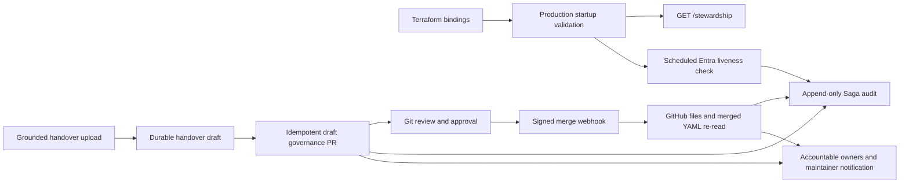

# Agent Operational Ownership Lifecycle

This document defines the implemented runtime and governance lifecycle for FDAI operational
ownership (`stewardship`). It complements the handover-map schema and ownership concepts in
[Agent operational ownership and ownership handover](agent-stewardship-and-handover.md).

> The console remains read-only. Ownership changes are generated as draft pull requests, reviewed
> through the Git host, and observed after merge through a signed webhook. Stewardship grants no
> RBAC capability and never receives Thor's executor identity.

## Design at a glance

The lifecycle has four independent safety boundaries:

1. **Startup readiness** loads the same handover map in production and rejects placeholder
   identities.
2. **Scheduled health** checks active Entra users off the control-loop hot path and audits only
   health-state transitions.
3. **Draft delivery** turns a grounded handover document into one idempotent governance PR.
4. **Merge observation** verifies the GitHub signature, re-reads changed files and merged content,
   then writes the merge audit and notifies the new accountable owners.



## Implementation status

| Capability | Owner | Status | Evidence |
|------------|-------|--------|----------|
| Production map binding | read API composition | Implemented | `build_prod_app()` loads `config/agent-stewardship.yaml` and registers `GET /stewardship`. |
| Real-binding readiness | Terraform plus resolver | Implemented | Container Apps receives `FDAI_STEWARDSHIP_REQUIRE_BINDINGS=1`, maintainer OIDs, and per-agent overrides. |
| Stale identity audit | stewardship health monitor | Implemented | Entra liveness runs on a configured interval and writes transition-only state plus audit. |
| Handover draft PR | ingestion consumer plus GitOps adapter | Implemented, opt-in | A processed `handover_bootstrap` upload opens one draft PR for `config/agent-stewardship.yaml`. |
| Merge notification and audit | signed GitHub webhook | Implemented, opt-in | The adapter verifies HMAC, changed files, repository, merge state, and merged YAML before recording. |
| Console mutation | console | Intentionally absent | The SPA reads ownership and draft results; it never holds Git credentials or calls an executor. |

The grounded T2 `HandoverInterpreter` remains an optional deployment binding. The deterministic
extractor and exact Graph resolution work without it, and the default interpreter holds for review
instead of guessing.

## Lifecycle contracts

### Production startup

The read API loads the ownership map before route construction. The same environment mapping used
by the production factory is passed into the resolver, so deployment overrides and
`FDAI_STEWARDSHIP_REQUIRE_BINDINGS` cannot diverge from the process that serves the projection.

A deployment with `enable_read_api=true` supplies:

- at least one real maintainer OID, with two recommended;
- an accountable binding for each non-autonomous pantheon agent;
- `FDAI_IAM_DIRECTORY_PROVIDER=entra` for scheduled liveness checks;
- a liveness interval of at least 60 seconds.

Terraform checks completeness before apply. The resolver then enforces schema version 1, distinct
real maintainers and steward subjects, UUID-shaped personal-channel keys, exact environment-token
shape, forbidden-role absence, placeholder policy, agent parity, responsibility values, and
autonomous reasons again at startup.

### Scheduled identity health

`StewardshipHealthMonitor` adapts the production human directory to the core `IdentityDirectory`
protocol. It checks maintainer and user-steward OIDs off the hot path.

The monitor stores one revisioned snapshot under `stewardship_health:current`:

- the current stale findings;
- the check timestamp;
- a monotonically increasing revision;
- a deterministic fingerprint used by the audit correlation.

An unchanged result is a no-op. A clean-to-stale or stale-to-clean transition atomically updates
state and appends `stewardship.health.changed`. A Graph failure logs only the error type and retries
at the next interval; it does not mark every identity stale and does not stop the control loop. The
first sweep starts in a named background task, so Graph latency never delays read-API startup. The
read API validates the latest snapshot and merges its stale findings into `/stewardship` coverage;
malformed durable state renders `identity_health.status=unavailable` without hiding the base map.

### Draft PR creation

After the ingestion worker stores a `HandoverDraftArtifact`, the optional
`StewardshipGovernanceService` validates the rendered YAML through the same core resolver and
publishes a draft PR through `RemediationPrPublisher`.

The PR candidate is an additive overlay on the current validated map. Grounded mappings add or
retag subjects, while existing owners, maintainers, channels, and thresholds remain intact. The
service never turns an unmapped draft agent autonomous or removes an owner automatically. A human
must make any removal explicitly in the reviewed PR.

The proposal contract is fixed:

| Field | Value |
|-------|-------|
| Target path | `config/agent-stewardship.yaml` |
| Mode | `shadow` |
| Labels | `shadow`, `governance`, `stewardship` |
| Idempotency key | `handover:<upload_id>` |
| Rollback | Revert the merged configuration commit |
| Actor | Authenticated upload-session `actor_id` |

The publisher probes the Git host for an existing branch before writing. After publish, the service
atomically claims durable proposal state and appends `stewardship.change.requested`. Only the first
claim sends the operational notification. If the process stops after remote PR creation but before
the local claim, a retry finds the existing PR and repairs the missing local state without opening a
duplicate. After local state exists, the service resolves the receipt by correlation id before any
remote call, so reprocessing cannot open another PR even after the first PR is closed.

### Merge observation

The ingestion gateway registers `POST /ingestion/webhooks/github/stewardship` only when governance
is enabled. The route accepts at most 1 MiB and uses HMAC authentication instead of the console
Entra flow.

The adapter performs these checks in order:

1. Compare `X-Hub-Signature-256` in constant time.
2. Require a `pull_request` delivery id and the configured `owner/repository`.
3. Require `action=closed`, `merged=true`, a PR number, and a merge commit SHA.
4. Query up to 3000 changed files in bounded 100-file pages and require
  `config/agent-stewardship.yaml`.
5. Fetch that file again at the merge commit and decode GitHub's whitespace-wrapped base64 UTF-8
  content.
6. Validate the merged map and compute affected agents from the old and new maps.
7. Claim `stewardship_governance:merge:<delivery_id>` with its append-only merge audit.
8. Notify the affected owners from the merged map plus the FDAI maintainers.

GitHub login is recorded as a provider-qualified audit identity such as `github:<login>`; it is not
misrepresented as an Entra OID. Duplicate deliveries return success without a second audit or
notification.

## Affected-owner calculation

The diff is deterministic:

- a changed agent block affects only that agent;
- changed maintainers, personal channels, escalation timeout, or coverage threshold affect all 15
  agents because those values can change every escalation chain;
- workflow documents continue to use recursive pantheon-name extraction;
- unknown agent names never reach diffing because the resolver rejects them first.

Requested notifications use the currently active map. Merge notifications use the merged map so the
new accountable owners receive the handover result.

## Deployment configuration

Set `enable_stewardship_governance=true` only after document ingestion, the read API, and ChatOps are
enabled. Terraform requires the following deployment-owned values:

| Input | Runtime binding | Storage |
|-------|-----------------|---------|
| `stewardship_maintainers` | `FDAI_MAINTAINERS` | non-secret environment configuration |
| `stewardship_agent_bindings` | `FDAI_STEWARD_<AGENT>` | non-secret environment configuration |
| `gitops_owner`, `gitops_repo` | `FDAI_GITOPS_OWNER`, `FDAI_GITOPS_REPO` | non-secret environment configuration |
| `gitops_token` | `FDAI_GITOPS_TOKEN` | Key Vault reference only |
| `github_webhook_secret` | `FDAI_GITHUB_WEBHOOK_SECRET` | Key Vault reference only |
| `chatops_webhook_url` | `FDAI_CHATOPS_WEBHOOK_URL` | Key Vault reference only |

The GitHub App or token should have only repository content, pull-request, and issue-label permissions
needed by the adapter. Configure the GitHub webhook for pull-request events and point it to the
published ingestion gateway route. Rotate the short-lived installation token through deployment
configuration; do not commit it or log it.

## Failure and recovery

| Failure | Behavior | Recovery |
|---------|----------|----------|
| Placeholder or missing owner | Terraform plan or process startup fails | Supply real deployment bindings and restart. |
| Graph unavailable | Current ownership remains usable; no synthetic stale result | Retry on the next monitor interval. |
| GitHub publish interrupted | Worker retry uses the same upload id | Existing PR is recovered by remote idempotency probe. |
| Notification delivery fails | Router tries fallbacks, then persists a HIL escalation | Repair the channel and replay from audit evidence. |
| Invalid webhook signature | Request is rejected before GitHub I/O | Correct the GitHub webhook secret. |
| Unrelated PR merge | Delivery is acknowledged without state change | No action required. |
| Duplicate merge delivery | Durable claim returns no change | No duplicate audit or notification is emitted. |

## Verification

Run the focused ownership gates before deployment:

```bash
bash scripts/governance/check-stewardship.sh
uv run pytest tests/core/stewardship tests/delivery/stewardship \
  tests/delivery/ingestion_gateway/test_handover.py -q --no-cov
terraform -chdir=infra validate
```

After deployment, verify:

1. `GET /stewardship` returns 15 agents and the expected coverage findings.
2. The current `stewardship_health:current` snapshot exists and has a recent `checked_at`.
3. A synthetic handover upload creates one draft PR and one request audit.
4. Reprocessing the upload returns the same PR reference.
5. Merging a reviewed test change produces one merge audit and one operational notification.
6. Re-delivering the same GitHub delivery id produces no second record.

## Related docs

| To learn about | Read |
|----------------|------|
| Ownership schema and handover concepts | [agent-stewardship-and-handover.md](agent-stewardship-and-handover.md) |
| Notification routes and fallback | [channels-and-notifications.md](channels-and-notifications.md) |
| Human authorization | [user-rbac-and-identity.md](user-rbac-and-identity.md) |
| Azure deployment inputs | [../deployment/deploy-and-onboard.md](../deployment/deploy-and-onboard.md) |
