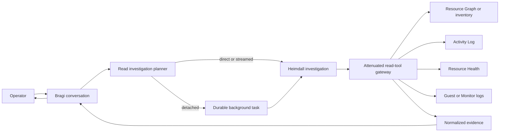

# Azure 읽기 조사

이 문서는 operator 질문이 bounded read-only Azure 조사로 전환되는 방식을 정의합니다. Bragi는
대화를 소유하고, Heimdall은 resource change 및 external actor 해석을 소유하며, provider adapter는
Thor의 execution identity를 사용하지 않고 evidence를 수집합니다.

> **범위:** 이 설계는 resource 조회, Activity Log attribution, Resource Health, guest log fallback,
> 구성된 NSG rule, VNet peering topology, 실행시간 예측, progress 전달 및 detached investigation
> session을 다룹니다. Azure 변경을 승인하거나 실행하지 않습니다.

## 설계 개요

Read investigation은 mutation control loop 밖에 유지됩니다. Deterministic planner가 typed read tool을
선택한 다음 측정된 tool latency를 기준으로 direct, streamed 또는 detached 실행 모드를 선택합니다.
모든 답변은 normalized server-owned evidence를 인용하거나 evidence가 unavailable임을 보고합니다.



## 소유권 및 경계

| Component | 책임 | 수행하지 않는 작업 |
|-----------|------|---------------------|
| Bragi | Operator turn을 분류하고 conversation context를 보존하며 progress와 최종 답변을 operator locale로 렌더링합니다. | Privileged credential로 Azure를 조회하거나 변경 실행 가능 여부를 결정하지 않습니다. |
| Heimdall | `resource_change_history` 및 `external_actor` 조사 의미를 소유하고 read evidence를 correlate하며 불확실성을 명시합니다. | Azure SDK를 import하거나 `az`를 spawn하거나 승인 또는 resource mutation을 수행하지 않습니다. |
| Huginn | 전달된 Azure signal을 지속적으로 ingest하고 normalize하여 이후 correlation에 사용합니다. | Ad hoc conversational request를 제공하지 않습니다. |
| Saga | 질문이 FDAI action에 관한 경우 FDAI audit chain에서 답합니다. | Correlation 없이 Azure Activity Log를 FDAI audit evidence로 취급하지 않습니다. |
| Thor | 기존 `ActionRun` 상태를 보고하고 승인된 typed action을 실행합니다. | Inventory, Activity Log, Resource Health 또는 guest-log read를 실행하지 않습니다. |
| Task worker | 격리된 depth-one attenuated read investigation 하나를 실행합니다. | Pantheon에 합류하거나 Pantheon object를 publish하거나 execution authority를 상속하지 않습니다. |

Operator 질문은 `object.event`로 publish하지 않습니다. 해당 topic은 detection, judgment, risk 및
execution processing으로 들어갑니다. Detached investigation은 optional wake signal을 내보내기 전에
task를 persist합니다. PostgreSQL이 source of truth이고 wake signal은 delivery hint일 뿐입니다.

## 구현 상태

| Capability | 현재 상태 | 근거 |
|------------|-----------|------|
| Bragi 및 Heimdall routing | 구현됨 | Deterministic 영어 및 한국어 actor, shutdown, history, health, state routing이 generic scoring 전에 Heimdall을 선택합니다. |
| Exact resource resolution | 구현됨 | `not_found`, bounded `ambiguous`, scope-bound exact reference가 resolution 성공 전 history query를 중지합니다. |
| Subscription health sweep | 구현됨 | Configured reader scope가 Resource Graph inventory와 Resource Health를 병렬 query한 다음 최대 16개 supported resource의 대표 metric을 concurrency 4 이하로 확인합니다. |
| Azure evidence adapter | 구현됨 | REST는 state, Activity Log, Resource Health, guest log, 구성된 NSG rule 및 VNet peering property를 지원합니다. Interactive local은 executor identity를 받지 않고 registered development operations gateway를 통해 NSG 및 peering read를 전달할 수 있습니다. Typed CLI fallback은 registered plan으로 resource, VM state, Activity Log를 지원합니다. |
| Read-tool attenuation | 구현됨 | `background.read-only`는 Reader tool 7개만 포함하고 mutation, approval, shell, arbitrary-query, nested-worker capability를 차단합니다. |
| Execution mode 및 progress | 구현됨 | Durable p50/p95 profile이 cloud I/O 전에 direct, streamed, detached mode를 선택합니다. Exact resolution은 barrier이며 독립 evidence tool은 bounded parallel limit 안에서 실행됩니다. Streamed mode는 bounded progress와 SSE comment heartbeat를 전송하고, stream close는 provider work를 cancel하며, terminal event는 한 번만 발생합니다. |
| Direct 및 streamed replay | 구현됨 | Owner-scoped PostgreSQL run ledger가 canonical request를 claim하고 lease를 renew하며 reclaim attempt를 제한합니다. Terminal usage를 보존하고 provider를 다시 호출하지 않고 completed result를 replay합니다. Command Deck direct read도 같은 executor를 사용합니다. Interactive local PostgreSQL profile도 같은 run store를 제공하며 in-memory replay path로 대체하지 않습니다. |
| Detached execution 및 quota | 구현됨 | Typed executor는 narrator history, screen state, event bus, Thor, executor identity를 받지 않습니다. Per-principal concurrency, cost, wall-clock, tool-call quota는 durable creation에서 적용됩니다. |
| Completion handoff | 구현됨 | Terminal result와 pending completion outbox가 원자적으로 commit됩니다. Bounded retry는 investigation을 다시 실행하지 않고 idempotent conversation 및 reply-ledger handoff를 replay합니다. |
| Live Azure scenario evidence | 일부 검증됨 | Caller attribution, Resource Health, unauthorized scope 및 ambiguous name은 read-only live validation을 통과했습니다. Guest-event match와 실제 provider `429`는 release evidence gap으로 남습니다. |

## Investigation request 및 plan

Planner는 eligible 질문을 immutable `ReadInvestigationRequest`로 변환합니다. Requester, conversation 및
correlation reference, intent, resource selector, lookback, requested evidence, budget 및 idempotency key를
전달합니다. Model이 tool description을 보기 전에 deterministic classification을 실행합니다.

초기 intent vocabulary는 다음과 같습니다.

- **`resource_state`**: Resource를 resolve하고 현재 observed state를 반환합니다.
- **`change_attribution`**: Bounded resource operation의 control-plane actor를 식별합니다.
- **`resource_change_history`**: Resolve된 resource 하나의 최근 allowlisted change를 반환합니다.
- **`platform_health`**: Azure platform availability evidence를 설명합니다.
- **`guest_shutdown`**: 구성된 guest log에서 operating-system shutdown event를 검색합니다.
- **`network_security`**: 구성된 NSG rule과 subnet 또는 NIC association을 반환합니다.
- **`network_peering`**: VNet 하나의 peering state, sync level, address space 및 traffic 또는
  gateway flag를 반환합니다.

Planner는 history를 조회하기 전에 resource name을 resolve합니다. Match가 없으면 `not_found`를
반환합니다. 여러 match는 bounded candidate와 함께 `ambiguous`를 반환하고 추가 cloud query를 하지
않습니다. 단일 match는 이후 tool이 확장할 수 없는 exact provider resource reference를 생성합니다.

## Read-tool catalog

각 tool에는 Reader RBAC, `side_effect_class=read`, server-owned query template, 고정 timeout, output cap
및 evidence schema가 있습니다.

| Tool | Primary provider | 목적 |
|------|------------------|------|
| `resolve_resource` | Resource Graph 또는 promoted inventory | Name, type, resource group 및 configured scope를 resource reference 하나로 resolve합니다. |
| `get_resource_state` | Resource provider instance view | 현재 resource state와 observation time을 확인합니다. |
| `query_resource_activity` | Azure Activity Log REST 또는 configured `AzureActivity` projection | Bounded control-plane operation 및 caller attribution을 반환합니다. |
| `query_resource_health` | Resource Health 또는 ARG `HealthResources` | Platform availability event와 customer operation을 구분합니다. |
| `query_guest_shutdown_events` | Log Analytics guest-log projection | Diagnostic collection이 구성된 경우 operating-system shutdown evidence를 찾습니다. |
| `query_network_security` | Network resource provider | 제한된 custom/default NSG rule field와 association을 반환합니다. |
| `query_network_peerings` | Network resource provider | 제한된 VNet peering state, synchronization, address-space 및 routing flag를 반환합니다. |

REST 또는 SDK adapter가 production default입니다. Azure CLI는 기존 typed command broker 뒤의
allowlisted fallback입니다. Model은 argv, KQL, ARG query, subscription id 또는 ARM URL을 생성하지
않습니다. Registered tool 및 bounded enum argument만 선택합니다.
Broker는 registered plan의 timeout 및 output cap을 적용합니다. Complete JSON은 typed adapter에
ephemeral output으로만 반환되고 command receipt는 bounded 4 KB diagnostic tail만 유지하며 broker는
반환 후 full output을 cache하지 않습니다. Raw CLI output은 persist되거나 narrator context에 전달되지
않습니다. Concurrent receipt-based execution은 serialize되므로 broker lifetime 동안 idempotency key
하나가 registered command를 최대 한 번만 호출합니다.
Plan timeout은 managed-identity login, subscription verification, command execution이 공유하는 하나의
cumulative deadline이며 setup work가 안내된 command budget을 배수로 늘릴 수 없습니다.

`FDAI_DEV_OPERATIONS_GATEWAY_URL`과 별도로 출력되는
`FDAI_DEV_OPERATIONS_GATEWAY_AUDIENCE`가 모두 구성되면 interactive local은 REST transport를
read-only gateway transport로 감쌉니다. Exact resource resolution이 subscription 및
resource-group-bound reference를 계속 제공합니다. 이 wrapper는 `azure.network.nsg.read`와
`azure.network.peering.read`만 노출합니다. HTTP 전에 확장된 resource reference를 차단하고 고정 byte
cap 안에서 response를 stream하며 gateway 실패 시 direct ARM으로 조용히 fallback하지 않고
unavailable을 보고합니다.

### Subscription health sweep

Command Deck tool `query_subscription_health`는 configured Azure scope를 점검해 달라는 operator
요청을 처리합니다. Scope는 server의 subscription과 resource-group allowlist에서만 가져오며 browser
input은 이를 넓힐 수 없습니다. Provider는 다음 bounded step을 수행합니다.

1. Resource Graph inventory와 `HealthResources`를 병렬 query합니다.
2. 대표 Azure Monitor metric을 확인할 supported resource를 최대 16개 선택합니다.
3. 최대 4개 metric을 동시에 query하고 server-owned threshold와 비교합니다.
4. Resource Health, 실패한 provisioning, metric 후보와 unsupported, unavailable, truncated count를
  반환합니다.

초기 metric map은 VM CPU, AKS node CPU, Storage availability, PostgreSQL/MySQL/SQL CPU 및
Application Gateway healthy-host count를 다룹니다. Unsupported resource type은 count에 남아
표시됩니다. Metric failure는 healthy 결론이 아니라 `partial`을 생성합니다. 응답은 결정적이며
narrator model을 호출하지 않습니다.

## Evidence 계약

Provider는 cloud-provider-neutral envelope을 반환합니다. Raw Azure response 및 raw CLI output은
narrator context에 들어가지 않습니다.

```json
{
  "status": "matched",
  "authority": "azure.activity_log",
  "resource_ref": "opaque-resource-ref",
  "observed_at": "2026-07-22T00:00:00Z",
  "freshness": "live",
  "truncated": false,
  "records": [
    {
      "operation_kind": "deallocate",
      "status": "succeeded",
      "actor_ref": "opaque-principal-ref",
      "actor_kind": "user",
      "occurred_at": "2026-07-21T23:58:00Z",
      "correlation_ref": "opaque-correlation-ref"
    }
  ],
  "evidence_refs": ["azure-activity:sha256:..."]
}
```

`status`는 `matched`, `ambiguous`, `none`, `unavailable` 중 하나입니다. Server projection은 authorized
caller label을 렌더링할 수 있지만 durable record 및 metric label은 opaque reference를 유지합니다.
Evidence text는 untrusted data이며 approval 또는 execution eligibility를 부여할 수 없습니다.

NSG `Allow` record는 구성된 rule evidence이며 port가 end-to-end로 도달 가능하다는 증거가 아닙니다.
답변은 이 제한을 명시합니다. FDAI가 실제 reachability 또는 양방향 연결을 주장하려면 effective NIC
rule, Network Watcher IP Flow Verify, 반대편 peering read 및 effective route가 추가 evidence step으로
필요합니다.

## Source 선택 및 fallback

Investigation은 operator에게 비슷해 보이는 4개 질문을 구분합니다.

1. **현재 상태:** Resource Graph 또는 inventory가 VM을 resolve하고 instance view가 `running`,
   `stopped` 또는 `deallocated`를 확인합니다.
2. **Control-plane actor:** Activity Log는 기록이 있는 경우 성공한 Stop, Power Off 또는 Deallocate
   operation과 caller를 식별합니다.
3. **Guest shutdown:** Control-plane operation이 없는 `stopped` VM은 Windows Event Log 또는 Linux
   syslog evidence가 필요합니다. Guest diagnostic이 없으면 actor를 추측하지 않고 `unavailable`을
   반환합니다.
4. **Platform event:** Resource Health는 host, maintenance 또는 platform availability context를
  제공합니다. ARG history가 비어 있으면 current-status fallback의 observation timestamp가 요청한
  lookback 안에 있을 때만 evidence로 사용합니다. 사용자가 event를 시작했다는 사실을 증명하지는
  않습니다.

Activity Log miss는 누구도 VM을 중지하지 않았음을 증명하지 않습니다. Retention, ingestion delay,
guest shutdown 및 platform failure를 explicit caveat로 유지합니다. Heimdall은 지원되는 가장 강한
결론을 명시하고 누락된 evidence를 나열합니다.

## 실행 모드

`InvestigationExecutionPolicy`는 측정된 plan estimate에서 하나의 모드를 선택합니다. Threshold는
routing code의 literal이 아니라 configuration입니다.

| Mode | 권장 초기 p95 구간 | 동작 |
|------|--------------------|------|
| `direct` | 최대 4초 | 현재 request에서 실행하고 답변 하나를 반환합니다. |
| `streamed` | 4초 초과 15초 이하 | Chat stream을 열어 두고 bounded semantic progress를 보냅니다. |
| `detached` | 15초 초과, multi-source fan-out 또는 explicit deep investigation | Durable background task를 만들고 task reference를 즉시 반환합니다. |

이 값은 시작 configuration이며 performance claim이 아닙니다. Deployment owner는 target environment에서
같은 scenario set을 측정한 후 값을 교체하는 것이 좋습니다. Detached work는 기존
`queued -> claimed -> running -> terminal` state machine을 재사용합니다. Worker는 parent transcript,
screen state, mutable memory, shell, executor identity 또는 mutation tool을 받지 않습니다.

Direct 및 streamed request는 authenticated principal과 idempotency key로 식별하는 별도의 owner-scoped
run ledger를 사용합니다. Ledger는 selector, lookback, evidence, 모든 budget field 및 explicit-deep flag를
포함한 canonical request projection의 digest를 저장합니다. 일치하는 completed request는 immutable
result를 replay합니다. Active request는 bounded retry interval을 반환하고 failed 또는 expired request는
총 세 번까지 key를 reclaim할 수 있습니다. Lease는 원래 wall-clock ceiling 안에서만 renew되며 terminal
row는 retention이 끝난 후에만 제거됩니다. Command Deck adapter도 ledger를 우회해 provider service를
직접 호출하지 않고 같은 direct executor를 사용합니다.

Detached creation은 context binding에도 같은 canonical request digest를 사용합니다. 따라서 budget 또는
다른 request field가 달라진 상태에서 key를 재사용하면 다른 limit으로 생성된 task를 replay하지 않고
conflict를 반환합니다.

## Latency 측정 및 예측

모든 provider call은 tool id, transport, operation class, status, queue 및 execution duration, result
count, truncation, cache status, recorded time 및 trace reference가 있는 `ToolCallReceipt`를 내보냅니다.
Adapter에 authoritative measured cost가 있으면 receipt에 `cost_microusd`도 포함할 수 있습니다. Run usage는
항상 reserved request budget을 기록합니다. 모든 receipt에 authoritative cost가 있을 때만 measured total을
기록하며, 하나라도 없으면 0으로 보고하지 않고 measured value를 unavailable 상태로 유지합니다. Metric
dimension은 resource id, principal id, prompt 및 query text를 제외합니다.

Durable latency profile은 `(tool_id, transport, operation_class)`별 bounded recent sample을 유지하고
sample count, failure rate, p50 및 p95를 노출합니다. Executor는 resource를 먼저 resolve한 다음 최대
4개의 configured parallel limit 안에서 독립 evidence source를 query합니다. Plan estimate는 resolution
p95와 evidence branch의 최대 p95를 더합니다. Detached work에는 queue delay를 추가합니다. Minimum
sample count 전에는 catalog `latency_class`를 사용하고 거짓 정밀도 대신 넓은 범위를 보고합니다.
Provider call이 다른 순서로 완료되어도 evidence와 receipt는 plan 순서를 유지합니다.

Estimate는 cloud I/O 전에 execution mode를 선택합니다. Elapsed time이 안내된 상한을 넘으면 Bragi가
delayed milestone 하나를 보내고 고정 wall-clock budget 안에서 계속합니다. Estimate는 timeout을
연장하거나 tool budget을 늘리지 않습니다.

## Progress 및 completion delivery

Progress는 command 또는 raw provider output이 아니라 operator에게 의미 있는 milestone을 설명합니다.

```text
investigation.planned
resource.resolving
resource.resolved
activity.querying
activity.completed
guest-log.unavailable
evidence.correlating
investigation.completed
```

기존 reporter는 event를 coalesce하고 개수를 제한합니다. Direct Command Deck stream은 tool이 시작하고
완료될 때 `activity` event를 보내고, resource resolution과 evidence collection이 operator 경험을
실질적으로 바꿀 때 bounded `milestone` message를 보냅니다. Activity는 실제 완료 순서를 따르지만
terminal evidence는 결정적인 plan 순서를 유지합니다. Streamed provider call이 idle인 동안 route는
표준 SSE comment frame `: heartbeat` 뒤에 빈 줄을 전송합니다. Heartbeat는 progress event를 만들지 않고
connection을 active 상태로 유지합니다. Provider task가 성공하거나 실패하면 stream은 terminal event
하나를 전송합니다. Failure terminal에는 제한된 reason만 포함하고 raw provider error text는 포함하지
않습니다.
Streamed response가 닫히면 in-flight investigation을 cancel하고 await하므로 disconnected client가
consumer 없는 provider read를 계속 실행하도록 남겨 두지 않습니다. Detached completion은 immutable
result를 먼저 commit한 다음 untrusted assistant turn을 append하고 durable background completion
outbox 및 reply ledger를 통해 enqueue합니다. Delivery failure는 investigation을 다시 실행하거나 result를
다시 작성할 수 없습니다.

Bragi는 operator experience가 달라질 때만 estimate를 전달합니다. 예:

> 현재 VM 상태와 최근 Azure Activity Log를 확인하겠습니다. 측정된 provider latency를 기준으로 보통
> 10-20초 정도 걸립니다.

## Identity, authorization 및 audit

Azure read는 configured resource group으로 scope가 제한된 dedicated `azure.reader` workload identity를
사용합니다. Console, Heimdall, task worker 및 ChatOps는 Thor의 executor identity를 받지 않습니다.
Identity에 실수로 더 넓은 permission이 있더라도 provider adapter는 resolved scope 밖의 resource를
거부합니다.

Production은 `FDAI_AZURE_READER_SUBSCRIPTION_ID`, `FDAI_AZURE_READER_CLIENT_ID`, 비어 있지 않은
comma-separated `FDAI_AZURE_READER_RESOURCE_GROUPS` allowlist가 모두 있을 때만 route를 등록합니다.
`FDAI_MONITOR_WORKSPACE_ID`는 optional이며, 없으면 다른 source는 계속 사용할 수 있지만 guest shutdown
evidence는 `unavailable`을 반환합니다.

Interactive local은 현재 Azure CLI token과 같은 server-owned scope를 사용합니다. Local runtime
environment generator는 active CLI subscription이 Terraform과 일치하는지 확인한 후 applied
subscription 및 resource group을 제공합니다. 이 credential은 Thor에 전달되지 않습니다.

Detached-task API는 별도의 `start-read-investigation` capability를 사용합니다. Contributor, Approver,
Owner role은 이 capability를 받으며 Reader와 Break-Glass는 받지 않습니다. Per-principal concurrency,
daily reserved 또는 measured cost, tool-call, wall-clock quota는 durable task creation에서 원자적으로
적용되며 PR-authoring authority와 분리됩니다.

Audit record에는 requester, intent, selected tool, scope digest, task 또는 request id, duration, terminal
status, evidence reference 및 delivery outcome이 포함됩니다. Bearer token, raw claim, raw CLI output,
prompt 및 unredacted caller payload는 제외합니다.

## 실패 동작

- **Ambiguous resource:** History query 전에 bounded candidate를 반환하고 resource group 또는
  subscription context를 요청합니다.
- **Unauthorized scope:** Unavailable을 보고하고 denied provider operation class를 기록합니다.
- **Provider throttling:** 원래 timeout 안에서 bounded retry와 jitter를 적용하며 scope 또는 wall-clock
  budget을 확장하지 않습니다.
- **Retention 부족:** 요청한 lookback이 source-specific configured retention을 넘으면 cloud I/O 전에
  `unavailable`을 반환합니다. Activity Log는 기본 90일, guest log는 기본 30일이며 deployment는 실제
  retention에 맞게 각 window를 더 좁힐 수 있습니다.
- **Partial evidence:** 지원되는 fact를 반환하고 누락된 source를 명시합니다.
- **Process loss:** 만료된 running attempt를 `unknown(process_lost)`로 표시하며 자동 replay하지
  않습니다.
- **Cancellation:** Pending provider work를 중지하고 `cancelled`를 commit하며 이미 작성된 completed
  evidence reference를 유지합니다.
- **Evidence의 prompt injection:** Provider string을 data로 취급하고 tool, scope, authorization 또는
  execution mode를 변경하려는 output을 차단합니다.

## 구현 순서 및 release gate

1. Provider-neutral contract, typed tool, normalized evidence 및 bilingual routing이 구현되었습니다.
2. Direct, streamed, detached execution, durable receipt 및 latency profile, quota, semantic progress,
  origin-channel completion enqueue가 구현되었습니다.
3. Structural test는 이 경로가 executor를 import하지 않고 Thor를 참조하지 않으며 `object.event`를
  publish하지 않음을 증명합니다.
4. Read-only live validation은 caller attribution, Resource Health, unauthorized scope 및 ambiguous
  name을 검증했습니다. Dedicated validation environment가 retained guest shutdown event와 자연스럽게
  발생한 provider `429`를 제공할 때까지 capability는 configuration-gated 상태를 유지합니다.

## Release evidence

Live check는 existing resource와 reader credential을 사용합니다. Azure resource를 create, update,
start, stop 또는 delete하지 않습니다. Live subscription에서 안전하게 유도할 수 없는 failure path는
customer-neutral synthetic payload를 사용하는 repository test로 검증합니다.

| Scenario | Evidence class | 결과 |
|----------|----------------|------|
| Successful caller attribution | Live | 통과했습니다. Exact resolution 및 projected Activity Log read가 user와 service-principal actor를 match했으며 opaque actor 및 correlation reference만 유지했습니다. |
| Resource Health | Live | 통과했습니다. 비어 있는 ARG projection이 current Resource Health REST endpoint로 fallback하여 normalized availability evidence를 반환했습니다. |
| Unauthorized scope | Live | 통과했습니다. 접근할 수 없는 scope가 failed bounded receipt와 함께 `unavailable`로 변환되었습니다. |
| Ambiguous resource name | Live | 통과했습니다. Duplicate name 하나가 bounded candidate 4개, exact resource binding 없음 및 history query 없음으로 반환되었습니다. |
| Guest OS shutdown | Live 및 contract | 완료되지 않았습니다. 접근 가능한 workspace 16개에는 available history 전체에서 retained Event 또는 Syslog shutdown record가 없었습니다. Live missing-workspace behavior는 `unavailable`을 반환했고 matched Event 및 Syslog normalization은 contract test만 통과했습니다. |
| Provider throttling | Contract | 동작은 통과했습니다. Synthetic `429` response가 bounded retry 및 terminal failure를 검증했습니다. Deliberate throttling은 bounded-read policy를 위반하므로 실제 live `429`는 유도하지 않았습니다. |
| Retention 부족 | Contract | 통과했습니다. Configured Activity Log 또는 guest-log retention을 넘는 lookback은 HTTP 전에 실패하고 provider boundary에서 unavailable로 normalize됩니다. |

완료되지 않은 guest-event row와 자연스럽게 발생한 live `429` 부재는 implementation defect가 아니라
release evidence로 남습니다. Dedicated validation environment가 Azure 변경 없이 해당 observation을
제공할 때까지 issue를 open 상태로 유지합니다.

## 검증

- 영어 및 한국어 intent test가 actor, shutdown, resource history, health 및 ambiguity를 검증합니다.
- Property test가 모든 investigation tool이 read-only이고 attenuation이 mutation, approval, shell,
  nested-worker 및 arbitrary-query capability를 차단하는지 증명합니다.
- Contract test가 REST 및 CLI fallback이 같은 bounded evidence envelope을 생성하는지 검증합니다.
- Scenario test가 investigation이 `object.event`를 publish하지 않고 Thor를 호출하지 않음을 증명합니다.
- Latency test가 cold profile, minimum sample, sequential 및 parallel estimate, threshold boundary, delayed
  milestone 및 cross-replica persistence를 검증합니다.
- Stream test가 terminal delivery 전 idle SSE comment heartbeat와 response close 시 in-flight provider
  task cancellation을 검증합니다.
- Background test가 lease contention, cancellation, timeout, process loss, progress cap, terminal
  immutability 및 durable reply handoff를 검증합니다.
- Live Azure check가 resource mutation 없이 Activity Log caller attribution, Resource Health fallback,
  unauthorized scope, ambiguous name 및 정직한 guest-log absence를 검증합니다.

## 관련 문서

| 알아볼 내용 | 문서 |
|-------------|------|
| Operator tool 및 chat tier | [Operator Console](operator-console-ko.md) |
| Detached investigation lifecycle | [Durable Background Task Sessions](background-task-sessions-ko.md) |
| Isolated tool attenuation | [Bounded Task Workers](../agents/bounded-task-workers-ko.md) |
| Azure inventory boundary | [Cloud Provider Neutrality](../architecture/csp-neutrality-ko.md) |
| Workload identity separation | [Security and Identity](../architecture/security-and-identity-ko.md) |
