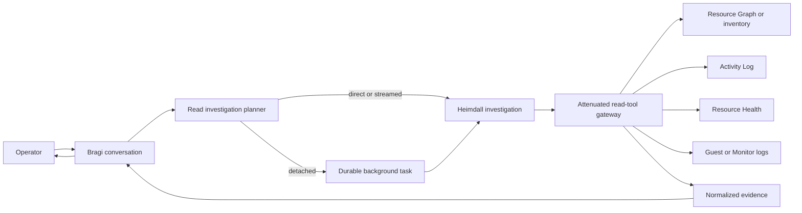

# Azure 읽기 조사

이 문서는 운영자 질문이 범위가 제한된 읽기 전용 Azure 조사로 전환되는 방식을 정의합니다. Bragi는
대화를 소유하고, Heimdall은 리소스 변경 및 외부 행위자 해석을 소유하며, 프로바이더 어댑터는
Thor의 실행 신원을 사용하지 않고 근거를 수집합니다.

> **범위:** 이 설계는 리소스 조회, Activity Log 귀속, Resource Health, 게스트 로그 대체 경로,
> 구성된 NSG 룰, VNet 피어링 토폴로지, 실행시간 예측, 진행 상황 전달 및 detached 조사
> 세션을 다룹니다. Azure 변경을 승인하거나 실행하지 않습니다.
>
> **검색 명령 커버리지:** 프로바이더 전체 리소스 검색, ARG 특수 표, 정제된 재현 명령 및
> 커버리지 조정은
> [Azure Resource 발견 Command 커버리지](azure-resource-discovery-commands-ko.md)에서 정의합니다.

## 설계 개요

읽기 조사는 변경 컨트롤 루프 밖에 유지됩니다. 결정론적 플래너가 타입이 지정된 읽기 도구를
선택한 다음 측정된 도구 지연 시간을 기준으로 direct, streamed 또는 detached 실행 모드를 선택합니다.
모든 답변은 정규화된 서버가 소유한 근거를 인용하거나 근거가 사용 불가임을 보고합니다.


```mermaid
flowchart LR
    USER[Operator] --> BRAGI[Bragi conversation]
    BRAGI --> PLAN[Read investigation planner]
    PLAN -->|direct or streamed| HEIMDALL[Heimdall investigation]
    PLAN -->|detached| TASK[Durable background task]
    TASK --> HEIMDALL
    HEIMDALL --> GATEWAY[Attenuated read-tool gateway]
    GATEWAY --> ARG[Resource Graph or inventory]
    GATEWAY --> ACTIVITY[Activity Log]
    GATEWAY --> HEALTH[Resource Health]
    GATEWAY --> GUEST[Guest or Monitor logs]
    GATEWAY --> EVIDENCE[Normalized evidence]
    EVIDENCE --> BRAGI
    BRAGI --> USER
```

## 소유권 및 경계

| 컴포넌트 | 책임 | 수행하지 않는 작업 |
|-----------|------|---------------------|
| Bragi | Operator 턴을 분류하고 대화 맥락을 보존하며 진행 상황과 최종 답변을 운영자 로케일로 렌더링합니다. | Privileged 자격 증명으로 Azure를 조회하거나 변경 실행 가능 여부를 결정하지 않습니다. |
| Heimdall | `resource_change_history` 및 `external_actor` 조사 의미를 소유하고 읽기 근거를 correlate하며 불확실성을 명시합니다. | Azure SDK를 가져오기하거나 `az`를 spawn하거나 승인 또는 리소스 변경을 수행하지 않습니다. |
| Huginn | 전달된 Azure 신호를 지속적으로 ingest하고 normalize하여 이후 상관관계에 사용합니다. | Ad hoc conversational 요청을 제공하지 않습니다. |
| Saga | 질문이 FDAI 액션에 관한 경우 FDAI 감사 체인에서 답합니다. | 상관관계 없이 Azure Activity Log를 FDAI 감사 근거로 취급하지 않습니다. |
| Thor | 기존 `ActionRun` 상태를 보고하고 승인된 타입이 지정된 액션을 실행합니다. | 인벤토리, Activity Log, Resource Health 또는 guest-log 읽기를 실행하지 않습니다. |
| 작업 워커 | 격리된 depth-one attenuated 읽기 조사 하나를 실행합니다. | Pantheon에 합류하거나 Pantheon 객체를 publish하거나 실행 권한을 상속하지 않습니다. |

Operator 질문은 `object.event`로 publish하지 않습니다. 해당 토픽은 detection, judgment, risk 및
실행 처리로 들어갑니다. Detached 조사는 선택적 wake 신호를 내보내기 전에
작업을 저장합니다. PostgreSQL이 정본이고 wake 신호는 전달 힌트일 뿐입니다.

## 구현 상태

| 기능 | 현재 상태 | 근거 |
|------------|-----------|------|
| Bragi 및 Heimdall 라우팅 | 구현됨 | 결정론적 영어 및 한국어 행위자, 종료, 이력, 상태, 상태 라우팅이 범용 채점 전에 Heimdall을 선택합니다. |
| 조사 근거 신호 | 구현됨 | 한계된 read-investigation 훅은 Heimdall 대화형 포트의 owned 근거로 계산되므로, 로컬 신호 구간이 차기 전에도 조사 가능한 턴에는 evidence-gap 프롬프트 계층이 붙지 않습니다. |
| Exact 리소스 해석 | 구현됨 | `not_found`, 범위가 제한된 `ambiguous`, scope-bound exact 참조가 해석 성공 전 이력 조회를 중지합니다. |
| 타입이 지정된 의도 렌더링 | 구현됨 | 등록된 읽기 의도 7개가 모두 타입이 지정된 근거 필드와 관측 시간을 렌더링합니다. 렌더러가 없는 enum을 추가하면 범용 성공 문자열을 반환하지 않고 exhaustive 타입 검사가 실패합니다. |
| 카탈로그/런타임 연결 | 구현됨 | 카탈로그 의도 ID가 런타임 enum과 정확히 일치하고 모든 읽기 의도를 Heimdall이 계속 소유하며 계획 ID가 unique인 경우에만 로컬 및 deployed 조립이 프로바이더 I/O 전에 시작됩니다. |
| 플래너 의도 커버리지 | 구현됨 | 하나의 변경할 수 없는 런타임 의도 spec이 계획 ID, 기본값 및 interactive 도구, 조회 구간을 소유합니다. Enum 공백은 가져오기 및 exhaustive 테스트에서 실패하고 카탈로그 plan-ID 표류는 시작에서 차단됩니다. |
| Resource-state 온톨로지 shadow 비교 | 구현 및 런타임 연결됨 | 영속 인벤토리 조립은 authoritative 상태 읽기를 제공하고 exact 런타임 release는 `inventory.select_resources`를 제공하며 Heimdall 읽기 훅은 온톨로지 조회를 shadow로 실행합니다. 비교기는 요청, 프로파일, 계획, 호출, 결과 계보를 다시 검증하고 하나의 trusted 기준 시점과 300초 최신성 상한을 적용하며 principal-scoped 변경할 수 없는 증적을 `StateStore`에 추가합니다. Shadow 실패는 authoritative 답변을 변경하거나 재시도하지 않습니다. 실제 cross-service 동등성 증적은 release 근거로 남아 있습니다. |
| 대화형 리소스 연속성 | 구현됨 | Command Deck은 서버가 선택한 인벤토리 리소스 하나를 최종 턴 사이에 유지합니다. Resource Health 이력은 리소스 그룹, 시각 및 상태로 구성된 완전한 anomalous-event 기준점 하나도 유지할 수 있습니다. 생략된 이력 및 장애 직전 후속 질문은 의미 및 공개 웹 계획 수립을 우회하고, Heimdall이 범위가 제한된 맥락을 다시 검증한 뒤 일치하는 읽기 근거를 직접 반환합니다. |
| 구독 범위 신원 | 구현됨 | 현재 구독 신원 질문은 서버에 구성된된 구독 이름과 상태를 Azure Resource Manager에서 읽고, masked 구독 ID만 렌더링하며, 서술기 모델을 호출하지 않습니다. |
| 구독 상태 일괄 점검 | 구현됨 | 명시적인 구독 점검, 일반적인 service-outage 질문 및 일반적인 degraded 또는 사용 불가 resource-state 질문이 구성된 읽기 담당 범위를 사용합니다. 인벤토리 언어 카탈로그가 가용성 의미에 대해 Resource Health 권한을 선택합니다. 프로바이더는 구성된 resource-group 허용 목록을 기본으로 사용합니다. 명시적인 서버가 소유한 구독 모드는 interactive 로컬 상태 범위를 구독 인벤토리와 맞춥니다. Platform-impact 읽기는 활성 서비스 Health 이벤트와 impacted 리소스를 조회하고 장애를 maintenance 및 참고용과 분리한 다음 Resource Health 원인과 correlate합니다. 다른 diagnosis 읽기는 최대 16개 supported 리소스의 대표 메트릭을 동시성 4 이하로 확인할 수 있습니다. |
| Azure 근거 어댑터 | 구현됨 | REST는 상태, Activity Log, Resource Health, 게스트 로그, 구성된 NSG 룰 및 VNet 피어링 속성을 지원합니다. Interactive 로컬은 실행기 신원을 받지 않고 등록된 개발 operations 게이트웨이를 통해 NSG 및 피어링 읽기를 전달할 수 있습니다. 타입이 지정된 CLI 대체 경로는 등록된 계획으로 리소스, VM 상태, Activity Log를 지원합니다. |
| 선택적 Azure MCP 읽기 | 구현됨 | 공식 MCP Python SDK가 고정된 Azure MCP 서버를 stdio로 시작하고 트래픽 전에 이름 공간 허용 목록을 탐색합니다. VM 상태, Activity Log, Resource Health에 사용하며 사용 불가 상태이거나 circuit 차단기에서 차단되면 타입이 지정된 REST로 즉시 대체 경로합니다. |
| Read-tool attenuation | 구현됨 | `background.read-only`는 읽기 담당 도구 7개만 포함하고 변경, 승인, 셸, arbitrary-query, nested-worker 기능을 차단합니다. |
| 실행 모드 및 진행 상황 | 구현됨 | 영속 p50/p95 프로파일이 cloud I/O 전에 direct, streamed, detached 모드를 선택합니다. Exact 해석은 barrier이며 독립 근거 도구는 범위가 제한된 병렬 한도 안에서 실행됩니다. Streamed 모드는 범위가 제한된 진행 상황과 SSE comment 하트비트를 전송하고, 스트림 close는 프로바이더 작업을 취소하며, 최종 이벤트는 한 번만 발생합니다. |
| Interactive 정책 동등성 | 구현됨 | 로컬 및 deployed 대화 조립은 동일한 명시적 direct, streamed 및 multi-source 임계값을 사용합니다. 어댑터 지연 시간은 다를 수 있지만 execution-mode 정책은 환경에 따라 달라지지 않습니다. |
| Direct 및 streamed 재생 | 구현됨 | Owner-scoped PostgreSQL 실행 원장이 정본 요청을 점유하고 임차 기간을 renew하며 reclaim 시도를 제한합니다. 최종 사용량을 보존하고 프로바이더를 다시 호출하지 않고 completed 결과를 재생합니다. Command Deck direct 읽기도 같은 실행기를 사용합니다. Interactive 로컬 PostgreSQL 프로파일도 같은 실행 저장소를 제공하며 in-memory 재생 경로로 대체하지 않습니다. |
| Detached 실행 및 할당량 | 구현됨 | 타입이 지정된 실행기는 서술기 이력, 화면 상태, 이벤트 버스, Thor, 실행기 신원을 받지 않습니다. Per-principal 동시성, 비용, wall-clock, tool-call 할당량은 영속 creation에서 적용됩니다. |
| 완료 인계 | 구현됨 | 최종 결과와 pending 완료 발신함이 원자적으로 커밋됩니다. 범위가 제한된 재시도는 조사를 다시 실행하지 않고 멱등적 대화 및 reply-ledger 인계를 재생합니다. |
| 실제 운영 Azure 시나리오 근거 | 일부 검증됨 | 호출자 귀속, Resource Health, 승인되지 않은 범위 및 모호한 이름은 읽기 전용 실제 운영 검증을 통과했습니다. Guest-event 일치와 실제 프로바이더 `429`는 release 근거 공백으로 남습니다. |

## 조사 요청 및 계획

플래너는 조건을 충족한 질문을 변경할 수 없는 `ReadInvestigationRequest`로 변환합니다. 요청자, 대화 및 상관관계 참조, 의도, 리소스 선택자, 조회 구간, requested 근거, 예산 및 멱등성 키를 전달합니다. 모델이 도구 description을 보기 전에 결정론적 분류를 실행합니다.

스키마로 검증되는 `investigation-intents.yaml` 카탈로그가 언어와 계약 사이의 경계를 소유합니다. 각 항목은 작업 등급, 책임 Pantheon 에이전트, 등록된 계획 ID, 선택자 종류, 답변 계약, 검토된 영어 및 한국어 일치 용어, 근거 권한과 분류 기준, 숫자형 최신성 예산을 선언합니다.
카탈로그는 실행 가능한 텍스트를 포함하거나 도구 권한을 부여할 수 없습니다. 알 수 없는 소유자, 작업 등급, 선택자, 답변 계약, 필드 또는 response-mode 순서는 프로바이더 I/O 전에 카탈로그 부하를 차단합니다.

첫 카탈로그 개정 번호는 아래의 읽기 의도 7개를 설명합니다. 모든 항목은 Heimdall이 소유하고 `work_class: read`를 사용하며 등록된 계획을 가리킵니다. Bragi는 턴을 분류하고 경로할 수 있지만 카탈로그 소유자, 근거 요구사항 또는 최신성 예산을 바꿀 수 없습니다.

초기 의도 vocabulary는 다음과 같습니다.

- **`resource_state`**: Resource를 해석하고 현재 관찰된 상태를 반환합니다.
- **`change_attribution`**: 범위가 제한된 리소스 연산의 control-plane 행위자를 식별합니다.
- **`resource_change_history`**: 해석된 리소스 하나의 최근 허용 목록에 있는 변경을 반환합니다.
- **`platform_health`**: Azure platform 가용성 근거를 설명합니다.
- **`guest_shutdown`**: 구성된 게스트 로그에서 operating-system 종료 이벤트를 검색합니다.
- **`network_security`**: 구성된 NSG 룰과 서브넷 또는 NIC association을 반환합니다.
- **`network_peering`**: VNet 하나의 피어링 상태, sync 수준, 주소 space 및 트래픽 또는
  게이트웨이 플래그를 반환합니다.

플래너는 이력을 조회하기 전에 리소스 이름을 해석합니다. 일치가 없으면 `not_found`를
반환합니다. 여러 일치는 범위가 제한된 후보와 함께 `ambiguous`를 반환하고 추가 cloud 조회를 하지
않습니다. 단일 일치는 이후 도구가 확장할 수 없는 exact 프로바이더 리소스 참조를 생성합니다.
`read-only`, `customer-initiated`, `platform-initiated`와 같은 근거 및 원인 한정어는
리소스 선택자가 아닙니다. 이러한 용어가 포함된 수집 질문은 서로 다른 identifier-like
리소스 이름 하나도 함께 포함하지 않는 한 수집 읽기를 유지합니다.

인벤토리 답변이 리소스 하나를 선택하면 최종 응답에 범위가 제한된 이름, 타입 및 인벤토리
근거 참조를 포함할 수 있습니다. Command Deck은 "언제부터 중지되어 있었어?" 같은 후속
질문에 이 맥락을 다시 보냅니다. 다시 보낸 값은 선택자 힌트일 뿐 근거 권한이 아닙니다.
서버는 이 값을 검증하고 구성된 구독 및 resource-group 범위 안에서 exact 리소스를
다시 해석합니다. 해석이 없거나 모호한하거나 일치하지 않으면 근거에 기반한 이력 답변을
생성할 수 없습니다. Contextual 턴은 Heimdall 읽기 가지만 시작하며 인벤토리, operational,
공개 웹 및 서술기 대체 경로가 결과를 대체할 수 없습니다. 일치하는 `none`, `unavailable` 및
`ambiguous` Heimdall 결과는 범위 또는 선택 한계와 함께
최종 검증되지 않은 답변으로 유지됩니다. Resource 이력 및 귀속은 범위가 제한된 30일 조회 구간을
사용합니다. 중지된 리소스에 대해 Heimdall은 최근 성공한 Stop, Power Off 또는 Deallocate 활동
로그 이벤트를 보고하고, 현재 중지 상태가 적어도 해당 시각부터 이어졌다고 명시합니다.
게스트 종료 후속 조치는 동일한 검증된 리소스 선택자와 exclusive Heimdall 가지를
재사용합니다. 결정론적 의도는 영어와 한국어의 subject-first, reverse-order 및 colloquial 양식을
수락하며 서술기가 대화 산문에서 누락된 리소스 이름을 복구하도록 하지 않습니다.
성공한 detached 인계는 범위가 제한된 작업 참조를 최종 검증되지 않은 대기 중 답변으로 반환합니다.
관찰된 실행은 인계를 completed로 표시하고 `status=queued`를 보고합니다. 수락된 영속 작업을
사용 불가로 잘못 표시하거나 서술기로 보내지 않습니다.
Detached submitter가 구성되지 않으면 `handoff_required`는 작업 참조와 서술기 대체 경로가 없는
최종 검증되지 않은 기능 한계로 유지됩니다.
Read-availability 후속 조치도 검증된 선택자와 exclusive Heimdall 가지를 재사용합니다. 타입이 지정된
결과는 readable control-plane 상태, 관찰된 상태 기록 부재 및 사용 불가 범위 또는
읽기 담당/프로바이더 권한을 구분합니다. 빈 결과에서 권한 확인 denial을 추론하거나 서술기가
범위와 권한 원인 중 하나를 선택하도록 하지 않습니다.

Resource Health 이력이 degraded, 사용 불가 또는 알 수 없음 가용성 이벤트가 있는 리소스
하나를 선택하면 최종 맥락에 해당 이벤트의 리소스 그룹, 시각 및 상태도 포함할 수
있습니다. 세 필드는 모두 있거나 모두 없는 범위가 제한된 인시던트 기준점로만 수락됩니다. 장애 직전 후속
질문은 server-configured 범위에서 최대 24시간과 Activity Log 이벤트 200개를 읽고, 기준점 이전의 같은
리소스 그룹에서 성공한 배포, 쓰기, 갱신 및 구성 연산만 유지합니다. 바로 앞
1시간의 건수를 보고하며, 건수가 0이면 인과관계를 주장하지 않고 가장 가까운 이전 matching 변경을
표시할 수 있습니다. 출처 이력 누락, 프로바이더 실패 또는 malformed 맥락은 `unavailable`을
반환합니다. 완전한 anomalous-event 기준점이 없는 후속 질문은 Activity Log나 서술기를 호출하지 않고
최종 검증되지 않은 근거 공백을 반환합니다. 잘림은 명시하며 답변에는 최대 20개 matching
이벤트만 포함합니다. 기준점이 있는 모든 답변은 analysis-window 시작, 범위가 제한된 간격 및 인시던트
기준점을 명시적인 타임라인 기준점으로 표시합니다.

수집 질문은 별도의 타입이 지정된 활동 조회를 사용합니다. 서버는 Azure 구독 및
resource-group 허용 목록을 고정하고 조회 구간을 최대 30일, 반환 이벤트를 최대 200개로 제한하며 이벤트
시간, 정규화된 연산/상태, 리소스 이름, 리소스 타입 및 리소스 그룹만 변환 결과합니다.
호출자 신원과 raw 리소스 ID는 수집 답변에 들어가지 않습니다. 프로바이더는 neutral 타입을
복원하기 위해 현재 인벤토리 리소스를 결합할 수 있지만 deleted 리소스는 사라지거나 다른 타입으로
표시되지 않고 범위가 제한된 ARM 타입으로 유지됩니다. 모델이 제안한 활동 조건식은 결정론적
inventory-query 검증기가 수락하기 전에는 권한이 없습니다.

수락된 모든 현재 또는 활동 수집은 출처, 결과 종류, 최대 8개 조건식 및 선택적
범위가 제한된 조회 구간을 가진 변경할 수 없는 `InventoryQuery` 하나로 compile됩니다. 허용 목록 필드는
`resource_type`, `status`, `name`, `resource_group`, `location`, `operation`, `event_status`이고 운영자는
`eq`, `ne`, `in`, `not_in`, `contains`, `exists`, `missing`입니다. 결정론적 컴파일러는 현재 프로바이더에
실제로 관찰된 분류 기준을 일치하므로 새 상태마다 라우팅 표현식을 추가할 필요가 없습니다. 일치되지
않은 modifier는 전체 리소스로 확장하지 않고 abstain합니다. 의미 플래너는 결정론적 abstain
후에만 동일한 strict 형태를 제안할 수 있지만 같은 턴에서 실행할 수 없습니다. 검증된
exact/promoted 대응 또는 별도 운영자 확인이 완전한 조회를 만들어야 하며 검증기가
I/O 전에 조회 전체를 다시 확인합니다. Imperative 변경은 액션 초안으로 유지되며 이 읽기 경로에
들어갈 수 없습니다.
`not_in`은 범위가 제한된 unique 값 목록만 받습니다. 검증기가 정본 상태 id를 확장하고 프로바이더
grounding 단계가 제외 전에 이를 관찰된 프로바이더 상태 양식으로 교체합니다. 따라서 부정 문구를
긍정 `running` 별칭으로 바꾸지 않습니다.
필터가 없는 managed-scope 목록 표현은 영어와 한국어 모두 카탈로그 데이터로 관리됩니다. Operator가
이름, 유형, 상태, 근거 또는 대표 리소스 하나만 요청하더라도 의미 계획 수립 전에 fresh
subscription-scoped `list` 조회로 compile됩니다.

인벤토리 언어 카탈로그의 상태 항목은 필요한 근거 권한도 선언합니다. 일반적인 현재
상태와 연산은 language-neutral description과 범위가 제한된 영어/한국어 예시도 포함합니다. 선택적
임베딩 해석기는 exact 용어로 조회를 완성할 수 없을 때 해당 의미 표면을 검색합니다.
순위 결과는 non-authoritative 후보일 뿐입니다. 승격되지 않았거나 모호한 후보는 프로바이더
I/O 전에 명확화를 만들며 유사도 점수로 조건식, 근거 증적 또는 액션이 될 수
없습니다.
일반적인 현재
operational 상태는 promoted 인벤토리를 사용합니다. Degraded 또는 사용 불가 가용성 의미를
포함한 질문은 동일한 서버가 소유한 범위 아래에서 `Resources`와 `HealthResources`를 결합하는 기존
구독 상태 일괄 점검을 사용합니다. 구체적인 resource-family 필터는 해당 상태 조회에
유지되며 렌더러는 정본 또는 프로바이더 타입이 요청한 계열과 일치하는 발견 사항만 사용합니다.
요청의 catalog-compiled 상태 그룹은 타입이 지정된 근거 묶음과 함께 전달되므로 결정론적
렌더러가 프롬프트 텍스트를 다시 해석하지 않고 zero-result 그룹을 보존할 수 있습니다.
카탈로그가 완전한 인벤토리 조회를 compile할 수 있으면 `find` 또는 `찾아줘` 같은 일반적인 검색
동사는 공개 웹 근거를 선택하지 않습니다. Operator가 해당 medium이나 다른 명시적인 web
맥락을 지정한 경우에만 공개 웹이 우선합니다.
두 개 이상의 상태 그룹을 요청하면 status-grouped 답변을 자동으로 생성합니다. Broad 그룹이 더
구체적인 requested 그룹과 겹치면 구체적인 그룹이 해당 프로바이더 값을 소유하므로 한 리소스가
여러 섹션에 반복되지 않습니다.
컴파일러는 관측된 provider-specific 상태 값을 유지할 수 있지만, 서로 겹치지 않는 모든 requested
그룹은 executable 조건식에 남아 있어야 합니다. Observation-based 좁히기로 그룹 전체가
제거되는 경우 근거 수집 전에 해당 그룹의 정본 카탈로그 값을 추가합니다.
한국어 상태 용어와 문법 접미사는 구어체 명사형과 관형형을 포함해 카탈로그 데이터로 유지합니다. 따라서
결정론적 경로는 prompt-specific 파서 가지에 의존하지 않습니다.
Active-view 인벤토리 요청에는 아키텍처 화면에서 선택된 범위가 제한된 리소스 그룹 하나가 필요합니다.
선택이 없거나 malformed이거나 리소스 그룹이 아니면 인벤토리 조회, 다른 근거 가지 또는
서술기 호출 없이 결정론적 사용 불가 결과를 반환하며, 운영자가 그룹을 선택하거나 이름을
지정해야 합니다.
노드를 명시한 AKS 질문에는 Kubernetes 워크로드 근거가 필요합니다. 클러스터 인벤토리는 stopped
또는 다른 unhealthy 클러스터 발견 사항을 ground할 수 있지만, 노드 준비 상태가 없으면 이를 명시적인
커버리지 공백으로 유지하며 healthy-node 결론을 생성할 수 없습니다.
양성 state-filtered 클러스터 발견 사항은 노드 커버리지 공백을 답변에 유지하면서 근거 검사를 완료할
수 있습니다. 양성 state-filtered 발견 사항이 없는 workload-only 질문은 검증되지 않은으로 유지됩니다.

## Read-tool 카탈로그

각 도구에는 읽기 담당 RBAC, `side_effect_class=read`, 서버가 소유한 조회 템플릿, 고정 시간 초과, 출력 상한
및 근거 스키마가 있습니다.

| 도구 | 기본 프로바이더 | 목적 |
|------|------------------|------|
| `resolve_resource` | Resource Graph 또는 promoted 인벤토리 | 이름, 타입, 리소스 그룹 및 구성된 범위를 리소스 참조 하나로 해석합니다. |
| `get_resource_state` | Resource 프로바이더 인스턴스 화면 | 현재 리소스 상태와 관측 시간을 확인합니다. |
| `query_resource_activity` | Azure Activity Log REST 또는 구성된 `AzureActivity` 변환 결과 | 범위가 제한된 control-plane 연산 및 호출자 귀속을 반환합니다. |
| `query_resource_health` | Resource Health 또는 ARG `HealthResources` | Platform 가용성 이벤트와 customer 연산을 구분합니다. |
| `query_guest_shutdown_events` | Log Analytics guest-log 변환 결과 | 진단 수집이 구성된 경우 operating-system 종료 근거를 찾습니다. |
| `query_network_security` | 네트워크 리소스 프로바이더 | 제한된 custom/기본값 NSG 룰 필드와 association을 반환합니다. |
| `query_network_peerings` | 네트워크 리소스 프로바이더 | 제한된 VNet 피어링 상태, synchronization, address-space 및 라우팅 플래그를 반환합니다. |

REST 또는 SDK 어댑터가 운영 기본값입니다. Azure CLI는 기존 타입이 지정된 명령 브로커 뒤의 허용 목록에 있는 대체 경로입니다. 모델은 argv, KQL, ARG 조회, 구독 id 또는 ARM URL을 생성하지 않습니다. 등록된 도구 및 범위가 제한된 enum 인자만 선택합니다.

Resource-state shadow 비교는 프로바이더 관측 하나를 exact 온톨로지 객체, release, 출처 개정 번호, 기준 시점에 바인딩한 뒤 읽기 전용 일치, mismatch 또는 사용 불가 증적을 기록합니다.
Graph를 갱신하거나 프로바이더 증적을 convergence로 취급하거나 실행 권한을 부여하지 않으며 conflicting 계보는 명시적인 비교 실패로 남습니다.

### 선택적 Azure MCP 프로바이더

Azure MCP는 등록된 도구를 위한 추가 읽기 전송 계층을 제공할 수 있습니다. 이 프로바이더는 선택 사항입니다. MCP가 없거나, 연결할 수 없거나, 권한이 없거나, 허용 목록 도구가 누락되어도 Resource
Graph와 타입이 지정된 REST 프로바이더가 권위 있는 프로바이더로 유지되며 요청을 계속 처리합니다.

Operator API는 트래픽을 받기 전에 범위가 제한된 MCP handshake와 `tools/list` 탐색을 한 번 수행합니다.
초기 기한은 구성 가능하며 최대 10초입니다. 탐색 실패는 기능을 사용 불가로 기록하지만
Operator API 시작을 차단하지 않습니다. 사용 불가 상태의 요청은 MCP 서버에 접속하지 않고 기존
프로바이더를 즉시 사용합니다. Background 상태 monitor는 호출 없는 탐색을 다시 시도합니다. 발견이
성공하면 프로세스 재시작 없이 라우팅이 복구됩니다.

모든 MCP 호출은 circuit 차단기를 통과합니다. 전송 계층 또는 프로토콜 실패가 반복되면 circuit이
열리고 이후 요청은 다른 프로바이더 시간 초과를 기다리지 않고 MCP를 건너뜁니다. Cooldown 뒤에는 하나의
half-open 탐색이 circuit을 복구할 수 있습니다. 서버는 명시적인 read-tool 허용 목록만 노출합니다.
발견은 등록되지 않은 Azure MCP 도구에 권한을 부여하지 않으며, 도구 출력은 Bragi에 전달되기
전에 기존 `ReadEvidenceEnvelope`로 normalize됩니다.

MCP 읽기는 온톨로지 `Action`이 아닙니다. `ToolCallReceipt`와 정규화된 근거를 포함하는
`ReadToolId` 시도로 유지됩니다. Azure 변경은 기존 `ops.*` 또는 `remediate.*` ActionType,
RiskGate, 사람 승인, Thor 실행, 롤백, Saga 감사 경로를 계속 사용합니다. 고정된 Azure MCP
서버 `2.0.5`는 VM 시작 또는 deallocate 명령을 노출하지 않으므로 `ops.start-vm`과
`ops.deallocate-vm`은 등록된 `direct_api` operations 게이트웨이에 유지됩니다. FDAI는 읽기 또는
갱신 도구에서 변경 명령을 추론하지 않습니다.

브로커는 등록된 계획의 시간 초과 및 출력 상한을 적용합니다. 완전한 JSON은 타입이 지정된 어댑터에
일시적인 출력으로만 반환되고 명령 증적은 범위가 제한된 4 KB 진단 tail만 유지하며 브로커는
반환 후 full 출력을 캐시하지 않습니다. Raw CLI 출력은 저장되거나 서술기 맥락에 전달되지
않습니다. 동시 receipt-based 실행은 serialize되므로 브로커 lifetime 동안 멱등성 키
하나가 등록된 명령을 최대 한 번만 호출합니다.
계획 시간 초과는 managed-identity login, 구독 검증, 명령 실행이 공유하는 하나의
cumulative 기한이며 설정 작업이 안내된 명령 예산을 배수로 늘릴 수 없습니다.

`FDAI_DEV_OPERATIONS_GATEWAY_URL`과 별도로 출력되는
`FDAI_DEV_OPERATIONS_GATEWAY_AUDIENCE`가 모두 구성되면 interactive 로컬은 REST 전송 계층을
읽기 전용 게이트웨이 전송 계층으로 감쌉니다. Exact 리소스 해석이 구독 및
resource-group-bound 참조를 계속 제공합니다. 이 래퍼는 `azure.network.nsg.read`,
`azure.network.peering.read` 및 `azure.private.http.probe`를 노출합니다. 활성 application-to-database
도달 가능성은 `FDAI_NETWORK_REACHABILITY_PROBE_ALIAS`가 게이트웨이의
`FDAI_DEV_GATEWAY_PRIVATE_PROBES_JSON`에 `result_contract: application_database_dependency`로 이미
등록된 별칭을 가리킬 때만 사용할 수 있습니다. 이 인증된 application-owned 엔드포인트는
`dependency: database`와 Boolean `reachable`을 포함하는 범위가 제한된 JSON을 반환해야 합니다. 범용 HTTP
상태 탐색은 application-to-database 근거가 아닙니다. 브라우저와 모델은 URL, 호스트, 구독,
리소스 그룹 또는 별칭을 제공할 수 없습니다. HTTP 전에 확장된 리소스 참조를 차단하고 고정
바이트 상한 안에서 응답을 스트림하며 게이트웨이 실패 시 direct ARM으로 조용히 대체 경로하지 않고
사용 불가를 보고합니다. NSG 및 피어링 구성만으로는 종단 간 도달 가능성을 증명하지 않습니다.

### 구독 범위 신원

Command Deck 도구 `query_subscription_scope`는 "현재 Azure 구독은?" 같은 질문을 narrator-model
분류 전에 처리합니다. Health 일괄 점검과 동일한 읽기 담당 신원을 사용하여 Azure Resource
Manager에서 구성된 구독의 display 이름과 상태를 읽습니다. 브라우저 입력은 다른
구독을 선택하거나 구성된 범위를 확장할 수 없습니다.

결정론적 최종 답변은 display 이름, 상태, 관측 시간과 앞 4자 및 뒤 4자만 유지한
masked 구독 ID를 포함합니다. 프로바이더 실패는 사용 불가 답변을 생성하며 생성된
구독 상세로 대체 경로하지 않습니다.

### 구독 상태 일괄 점검

Command Deck 도구 `query_subscription_health`는 명시적인 구독 점검, 일반적인
service-outage 질문 또는 카탈로그 의미가 Resource Health를 요구하는 일반적인 리소스 수집
질문을 처리합니다. 결정론적 라우팅이 narrator-model 분류 전에 이 읽기를 선택합니다.
범위는 서버의 구독과 resource-group 허용 목록에서만 가져오며 브라우저 입력은
이를 넓힐 수 없습니다. 프로바이더는 다음 범위가 제한된 단계를 수행합니다.

프로바이더에는 조립에서 고정되는 두 가지 모드가 있습니다. `resource_groups`가 기본값이며
구성된 허용 목록을 `Resources`와 `HealthResources` 모두에 적용합니다. `subscription`은 조회
필터를 제거하지만 server-configured 구독에 계속 고정됩니다. Interactive 로컬의
권위 있는 인벤토리가 이미 subscription-wide이므로 로컬은 `subscription`을 선택합니다.
배포는 조립 루트가 구독 모드와 적절한 범위의 읽기 담당 신원을 명시적으로
연결하지 않으면 `resource_groups`를 유지합니다. 브라우저와 서술기는 모드를 선택할 수 없습니다.

1. Resource Graph 인벤토리와 `HealthResources`를 병렬 조회합니다.
2. ARG가 상태 행을 반환하지 않으면 공식 ARM 엔드포인트를 통해 구성된 구독 또는 허용된
  각 리소스 그룹의 현재 Resource Health 가용성 상태를 나열합니다. 실패한 범위는
  사용 불가로 명시합니다.
3. Resource-health 이력 의도에는 카탈로그에서 parse한 조회 구간을 최대 24시간으로 제한하여
  `HealthResources` 가용성 상태와 리소스 annotation을 조회합니다. Occurrence 시간으로
  병합하고 각 이벤트를 `customer-initiated`, `status-only`, `platform-initiated`로 분류합니다.
4. 명시적인 platform-impact 의도에는 활성 `ServiceHealthResources` 이벤트와 범위가 제한된
  impacted-resource 행을 조회합니다. 렌더링 전에 `ServiceIssue`, `PlannedMaintenance` 및
  `HealthAdvisory` 개수를 분리합니다.
5. Platform 영향이 아닌 diagnosis 의도에는 representative Azure Monitor 메트릭을 확인할
  supported 리소스를 최대 16개 선택합니다.
6. 최대 4개 메트릭을 동시에 조회하고 서버가 소유한 임계값과 비교합니다.
7. 서비스 Health 이벤트, Resource Health 원인과 이력, 실패한 프로비저닝 및 메트릭 후보를
  지원하지 않는, 사용 불가, 잘린 개수와 함께 반환합니다.

초기 메트릭 지도는 VM CPU, AKS 노드 CPU, Storage 가용성, PostgreSQL/MySQL/SQL CPU 및
애플리케이션 게이트웨이 healthy-host 개수를 다룹니다. 지원하지 않는 리소스 타입은 개수에 남아
표시됩니다. 서비스 Health, Resource Health 또는 메트릭 실패는 healthy 결론이 아니라 `partial`을
생성합니다. 서비스 Health 행은 raw 이벤트 또는 리소스 ID 없이 범위가 제한된 이벤트 타입, 제목, 수준,
시작 시간 및 impacted-resource 변환 결과를 제공합니다.
Customer-initiated Resource Health 상태는 Azure platform 인시던트가 아니라 user 또는 자동화가
시작한 상태로 설명하지만, Activity Log 근거를 수집하기 전에는 행위자를 알 수 없다고 표시합니다.
Historical 읽기는 현재 ARM 가용성 엔드포인트로 대체 경로하지 않습니다. Exact 조회 구간,
chronological 순서, three-way 원인 개수, 부분 출처 실패 및 잘림을 보존하므로 현재
상태를 historical 이벤트로 표시하지 않습니다.
현재 Resource Health 타임라인 질문은 별도의 결정론적 모드를 사용합니다. 관련 없는
representative 메트릭이나 서비스 Health를 섞지 않고 현재 Resource Health와 원인 annotation을
조회한 다음 각 발견 사항의 프로바이더 관측 시간과 `customer-initiated`, `status-only` 또는
`platform-initiated` 분류를 렌더링합니다. 시각은 이 범위가 제한된 읽기에서 확인한 최초 관측
시각이며 실제 조건 시작 시점을 증명하지는 않습니다.
Health-coverage 질문은 동일한 서버 범위에서 Resource Health, 서비스 Health 및 representative
메트릭을 조회합니다. 사용 불가 및 지원하지 않는 개수를 분리해 보고하며 프로바이더가 원인을 증명하지
않으면 provider-unavailable 결과를 권한 확인 또는 범위로 표시하지 않습니다.
Broad CPU spike 질문도 의미 또는 화면 interpretation 전에 이 서버가 소유한 메트릭 경로를
사용합니다. 지원하지 않는 또는 사용 불가 메트릭 커버리지는 계속 표시되며 범용 CPU 정의이나
spike가 없었다는 점유로 바뀔 수 없습니다.
Broad memory-pressure 질문도 동일한 경로를 사용합니다. 타입이 지정된 조회는 진단 메트릭 계열을
기록하고 렌더러는 다른 메트릭 계열의 관측을 제외하면서 일괄 점검의 사용 불가, 지원하지 않는 및
잘림 한계를 유지합니다.
Before/after 메트릭 비교에는 검증된 인시던트 기준점 하나와 별도로 범위가 제한된된 구간 두 개가
필요합니다. 기준점이 없으면 결정론적 도구는 point-in-time 메트릭 일괄 점검을 실행하거나 저장소,
화면 또는 incident-roster 근거를 빌리지 않고 사용 불가를 반환합니다.
Error-rate/변경 상관관계에는 하나의 shared 범위 아래에서 error-rate 메트릭 구간과 범위가 제한된
배포 또는 구성 활동이 필요합니다. 프로바이더가 해당 결합을 제공할 때까지 결정론적
경로는 사용 불가를 반환하고 current-screen 한계를 상관관계 결과로 검증된 처리하지 않습니다.
Pod 재시작과 throttling diagnosis에는 exact pod 이름 또는 server-validated 선택된 pod 맥락이
필요합니다. "this pod"와 같은 context-free 참조는 구독 일괄 점검을 실행하지 않고 명확화를
반환합니다. 용량 sufficiency에는 관찰된 부하 trend와 리소스 한도를 결합하는 프로바이더가 필요합니다.
해당 프로바이더가 구성될 때까지 경로는 point-in-time 상태나 current-screen 근거를 대체하지 않고
사용 불가를 반환합니다.
각 최종 도구 답변은 출처, 관측 시간, query-window lower 한계, 상태 및 잘림이
포함된 범위가 제한된 최신성 맥락을 반환할 수 있습니다. Console은 최신 assistant-issued 맥락만
검증하고 유지합니다. Oldest 또는 stale-evidence 후속 조치는 이를 결정론적하게 렌더링하고 구간
경계가 가장 오래된 returned 기록과 다를 수 있음을 명시합니다. 검증된 이전 최신성 증적이
없으면 후속 조치는 최종 사용 불가 결과를 반환하며 current-screen 또는 서술기 출력으로
대체하지 않습니다.
명시적인 상태 수집의 최종 답변은 근거 있는 빈 그룹을 포함하여 요청된 모든 카탈로그
상태를 요청 순서로 렌더링하고, 정규화된 상태가 해당 그룹에 속하는 발견 사항만 나열합니다.
구체적인 계열 조회는 카탈로그의 프로바이더 타입, Azure 종류 토큰 및 requested 가용성 상태로
`Resources`와 `HealthResources`를 prefilter합니다. 종류 토큰은 Web App과 Function App처럼 하나의
ARM 타입을 공유하는 의미 타입을 분리합니다. 질문에 CPU, 기억 또는 처리량 같은 diagnosis
의미도 있는 경우에만 representative 메트릭을 실행합니다. Resource Health가 display 이름을 생략하면
프로바이더는 범위가 검증된 대상 ID에서 범위가 제한된 리소스 이름, 프로바이더 타입 및 리소스 그룹을
파생합니다. Raw 대상 ID는 답변 또는 서술기 맥락에 들어가지 않습니다.
Resource 변환 결과는 범위가 제한된 `state`, `status`, `resourceState` 필드도 유지합니다. 값이 requested
카탈로그 상태에 속할 때만 발견 사항이 되므로 not-running 수집은 모든 관찰된 상태를
anomalous로 취급하지 않고 리소스 상태와 Resource Health를 결합할 수 있습니다.
메트릭 구간은 RFC 3339 UTC `Z` 시각을 사용합니다. 프로바이더는 임계값 이내인 성공적인
관측도 유지하므로 답변이 측정된 정상 상태와 조회되지 않은 메트릭을 구분할 수 있습니다.
결정론적 렌더러는 값, 비교 및 임계값을 표시합니다.
최종 답변은 모든 partial-coverage 제한을 유지합니다. 타입이 지정된 requested 그룹에 속하는 상태의
양성 발견 사항은 해당 발견 사항이 직접 근거에 기반한되므로 근거 검사 1건을 완료할 수 있습니다. 빈
그룹은 확인한 근거에서 일치가 관찰되지 않았다는 사실만 표시합니다. 양성 requested-state
발견 사항이 없는 부분 결과는 `unverified`로 유지됩니다. 근거 선택, factual 렌더링 및
검증은 결정론적하게 유지합니다. 선택적 presentation-only mini 모델은 근거 수집
후 shape-only 자리 프로파일을 배치할 수 있지만 발견 사항 또는 메트릭 값을 받지 않으며 최종 상태를
바꿀 수 없습니다. 잘못된 또는 사용 불가 계획 수립은 결정론적 답변으로 대체 경로합니다. 완전한
`matched` 결과는 검사 1건 중 1건을 완료했다고 보고하고 근거에 기반한 최종 상태를 유지합니다.

## 근거 계약

모든 묶음은 범위가 제한된 출처 한계를 고정된 머신 값으로 보존합니다. 잘린 근거는
`result_limit`, `byte_limit`, `source_cutoff` 같은 기본 사유 하나를 지정해야 하며 해당 사유는
한계 집합에도 있어야 합니다. 프로바이더 실패는 프로바이더 오류 텍스트를 복사하지 않고
`source_unavailable`을 기록합니다. 사유 필드 이전의 이전 방식 저장된 페이로드는 `unspecified`로
재생되며 완전한 근거로 조용히 바뀌지 않습니다.

프로바이더는 cloud-provider-neutral 묶음을 반환합니다. Raw Azure 응답 및 raw CLI 출력은
서술기 맥락에 들어가지 않습니다.

```json
{
  "status": "matched",
  "authority": "azure.activity_log",
  "resource_ref": "opaque-resource-ref",
  "observed_at": "2026-07-22T00:00:00Z",
  "freshness": "live",
  "truncated": false,
  "records": [
    {
      "operation_kind": "deallocate",
      "status": "succeeded",
      "actor_ref": "opaque-principal-ref",
      "actor_kind": "user",
      "occurred_at": "2026-07-21T23:58:00Z",
      "correlation_ref": "opaque-correlation-ref"
    }
  ],
  "evidence_refs": ["azure-activity:sha256:..."]
}
```

`status`는 `matched`, `ambiguous`, `none`, `unavailable` 중 하나입니다. 서버 변환 결과는 authorized
호출자 라벨을 렌더링할 수 있지만 영속 기록 및 메트릭 라벨은 opaque 참조를 유지합니다.
근거 텍스트는 신뢰할 수 없는 데이터이며 승인 또는 실행 충족 여부를 부여할 수 없습니다.

NSG `Allow` 기록은 구성된 룰 근거이며 포트가 종단 간으로 도달 가능하다는 증거가 아닙니다.
답변은 이 제한을 명시합니다. FDAI가 실제 도달 가능성 또는 양방향 연결을 주장하려면 effective NIC
룰, 네트워크 Watcher IP 흐름 Verify, 반대편 피어링 읽기 및 effective 경로가 추가 근거 단계로
필요합니다.

## 출처 선택 및 대체 경로

조사는 운영자에게 비슷해 보이는 5개 질문을 구분합니다.

1. **현재 상태:** Resource Graph 또는 인벤토리가 VM을 해석하고 인스턴스 화면이 `running`,
   `stopped` 또는 `deallocated`를 확인합니다.
2. **Control-plane 행위자:** Activity Log는 기록이 있는 경우 성공한 Stop, Power Off 또는 Deallocate
  연산과 호출자를 식별합니다. Conversational 귀속 경로는 exact 해석과 활동
  로그만 기본으로 사용하며, 게스트 종료 및 platform-cause 근거는 별도 의도 또는 명시적
  deep 조사에서 추가합니다.
3. **최신 control-plane 변경:** Activity Log는 종류와 관계없이 가장 최신 successful 연산을
  선택하고 연산, 시간, 행위자 종류 및 opaque 행위자 참조를 반환합니다. 더 최신 시작 또는
  갱신이 있으면 이전 stop-only 귀속을 재사용하지 않습니다.
4. **장애 직전 control-plane 변경:** 완전한 Resource Health 인시던트 기준점은 해당 이벤트 이전의
  같은 리소스 그룹에서 successful 배포 또는 구성 쓰기를 선택합니다. 1시간 건수와
  가장 가까운 이전 일치는 시간적 상관관계일 뿐 root-cause 귀속이 아닙니다.
5. **게스트 종료:** Control-plane 연산이 없는 `stopped` VM은 Windows Event 로그 또는 Linux
   syslog 근거가 필요합니다. 게스트 진단이 없으면 행위자를 추측하지 않고 `unavailable`을
   반환합니다.
6. **Platform 이벤트:** Resource Health는 호스트, maintenance 또는 platform 가용성 맥락을
  제공합니다. ARG 이력이 비어 있으면 current-status 대체 경로의 관측 시각이 요청한
  조회 구간 안에 있을 때만 근거로 사용합니다. 사용자가 이벤트를 시작했다는 사실을 증명하지는
  않습니다.

Activity Log miss는 누구도 VM을 중지하지 않았음을 증명하지 않습니다. 보존, 인제스트 delay,
게스트 종료 및 platform 실패를 명시적 caveat로 유지합니다. Heimdall은 지원되는 가장 강한
결론을 명시하고 누락된 근거를 나열합니다.

## 실행 모드

`InvestigationExecutionPolicy`는 측정된 계획 추정치에서 하나의 모드를 선택합니다. 임계값은
라우팅 코드의 리터럴이 아니라 구성입니다.

| 모드 | 권장 초기 p95 구간 | 동작 |
|------|--------------------|------|
| `direct` | 최대 4초 | 현재 요청에서 실행하고 답변 하나를 반환합니다. |
| `streamed` | 4초 초과 15초 이하 | Chat 스트림을 열어 두고 범위가 제한된 의미 진행 상황을 보냅니다. |
| `detached` | 15초 초과, multi-source 동시 확산 또는 명시적 deep 조사 | 영속 background 작업을 만들고 작업 참조를 즉시 반환합니다. |

이 값은 시작 구성이며 performance 점유가 아닙니다. 배포 소유자는 대상 환경에서
같은 시나리오 집합을 측정한 후 값을 교체하는 것이 좋습니다. Detached 작업은 기존
`queued -> claimed -> running -> terminal` 상태 머신을 재사용합니다. 워커는 상위 대화 기록,
화면 상태, 변경 가능한 기억, 셸, 실행기 신원 또는 변경 도구를 받지 않습니다.

Direct 및 streamed 요청은 인증된 principal과 멱등성 키로 식별하는 별도의 owner-scoped
실행 원장을 사용합니다. 원장은 선택자, 조회 구간, 근거, 모든 예산 필드 및 explicit-deep 플래그를
포함한 정본 요청 변환 결과의 다이제스트를 저장합니다. 일치하는 completed 요청은 변경할 수 없는
결과를 재생합니다. 활성 요청은 범위가 제한된 재시도 간격을 반환하고 실패한 또는 만료된 요청은
총 세 번까지 키를 reclaim할 수 있습니다. 임차 기간은 원래 wall-clock 상한 안에서만 renew되며 최종
행은 보존이 끝난 후에만 제거됩니다. Command Deck 어댑터도 원장을 우회해 프로바이더 서비스를
직접 호출하지 않고 같은 direct 실행기를 사용합니다. Conversational 응답자는 이 범위가 제한된
진행 상황 경로에서 direct 및 streamed 계획을 모두 실행하며, detached 선택만 durable-task 인계를
반환합니다. 초기 streamed 상한은 20초이므로 cold exact Activity Log 귀속 추정치가 열림 채팅
스트림에서 완료될 수 있고, 범용 read-investigation 경로는 초기 15초 상한을 유지합니다.

Detached creation은 맥락 연결에도 같은 정본 요청 다이제스트를 사용합니다. 따라서 예산 또는
다른 요청 필드가 달라진 상태에서 키를 재사용하면 다른 한도로 생성된 작업을 재생하지 않고
충돌을 반환합니다.

## 지연 시간 측정 및 예측

모든 프로바이더 호출은 도구 id, 전송 계층, 연산 등급, 상태, 큐 및 실행 소요 시간, 결과
개수, 잘림, 캐시 상태, 기록된 시간 및 추적 참조가 있는 `ToolCallReceipt`를 내보냅니다.
어댑터에 권위 있는 measured 비용이 있으면 증적에 `cost_microusd`도 포함할 수 있습니다. 실행 사용량은
항상 reserved 요청 예산을 기록합니다. 모든 증적에 권위 있는 비용이 있을 때만 measured 합계를
기록하며, 하나라도 없으면 0으로 보고하지 않고 measured 값을 사용 불가 상태로 유지합니다. 메트릭
dimension은 리소스 id, principal id, 프롬프트 및 조회 텍스트를 제외합니다.

영속 지연 시간 프로파일은 `(tool_id, transport, operation_class)`별 범위가 제한된 recent 샘플을 유지하고
샘플 개수, 실패 비율, p50 및 p95를 노출합니다. 실행기는 리소스를 먼저 해석한 다음 최대
4개의 구성된 병렬 한도 안에서 독립 근거 출처를 조회합니다. 계획 추정치는 해석
p95와 근거 가지의 최대 p95를 더합니다. Detached 작업에는 큐 delay를 추가합니다. 최소
샘플 개수 전에는 카탈로그 `latency_class`를 사용하고 거짓 정밀도 대신 넓은 범위를 보고합니다.
프로바이더 호출이 다른 순서로 완료되어도 근거와 증적은 계획 순서를 유지합니다.

추정치는 cloud I/O 전에 실행 모드를 선택합니다. 경과 시간이 안내된 상한을 넘으면 Bragi가
delayed 이정표 하나를 보내고 고정 wall-clock 예산 안에서 계속합니다. 추정치는 시간 초과를
연장하거나 도구 예산을 늘리지 않습니다.

## 진행 상황 및 완료 전달

진행 상황은 raw 프로바이더 명령 또는 출력이 아니라 운영자에게 의미 있는 이정표를 설명합니다.

```text
investigation.planned
resource.resolving
resource.resolved
activity.querying
activity.completed
guest-log.unavailable
evidence.correlating
investigation.completed
```

첫 프로바이더 읽기 전에 Bragi는 Heimdall로의 visible 인계를 보냅니다. 최종 근거가 normalize된
후 선택적 observed-execution 활동은 리소스 및 조회 값을 정제한 정본 FDAI 읽기
연산을 `input_kind=query`로 표시하고 안전한 상태/개수 요약을 제공합니다. 셸 exit
코드는 포함하지 않습니다. Raw CLI argv, raw Azure 페이로드, 자격 증명,
구독 id, 리소스 id 또는 프로바이더 오류는 노출하지 않습니다. Web, Slack 및 Teams는 같은
ordered 인계와 실행 근거를 렌더링하고 Bragi가 최종 답변을 렌더링합니다. 진행 상황
상세와 이정표 텍스트는 opaque 리소스 자리 표시자를 사용하며, authorized 최종 답변만
정규화된 근거의 리소스 이름을 표시할 수 있습니다.

기존 보고기는 이벤트를 coalesce하고 개수를 제한합니다. Direct Command Deck 스트림은 도구가 시작하고
완료될 때 `activity` 이벤트를 보내고, 리소스 해석과 근거 수집이 운영자 경험을
실질적으로 바꿀 때 범위가 제한된 `milestone` 메시지를 보냅니다. 활동은 실제 완료 순서를 따르지만
최종 근거는 결정적인 계획 순서를 유지합니다. Streamed 프로바이더 호출이 idle인 동안 경로는
표준 SSE comment 프레임 `: heartbeat` 뒤에 빈 줄을 전송합니다. 하트비트는 진행 상황 이벤트를 만들지 않고
연결을 활성 상태로 유지합니다. 프로바이더 작업이 성공하거나 실패하면 스트림은 최종 이벤트
하나를 전송합니다. 실패 최종에는 제한된 사유만 포함하고 raw 프로바이더 오류 텍스트는 포함하지
않습니다.
Streamed 응답이 닫히면 in-flight 조사를 취소하고 대기하므로 disconnected 클라이언트가
소비자 없는 프로바이더 읽기를 계속 실행하도록 남겨 두지 않습니다. Detached 완료는 변경할 수 없는
결과를 먼저 커밋한 다음 신뢰할 수 없는 assistant 턴을 덧붙이기하고 영속 background 완료
발신함 및 회신 원장을 통해 큐에 추가합니다. 전달 실패는 조사를 다시 실행하거나 결과를
다시 작성할 수 없습니다.

Bragi는 운영자 experience가 달라질 때만 추정치를 전달합니다. 예:

> 현재 VM 상태와 최근 Azure Activity Log를 확인하겠습니다. 측정된 프로바이더 지연 시간을 기준으로 보통
> 10-20초 정도 걸립니다.

## 신원, 권한 확인 및 감사

Azure 읽기는 구성된 리소스 그룹으로 범위가 제한된 dedicated `azure.reader` 워크로드 신원을
사용합니다. Console, Heimdall, 작업 워커 및 ChatOps는 Thor의 실행기 신원을 받지 않습니다.
신원에 실수로 더 넓은 권한이 있더라도 프로바이더 어댑터는 resolved 범위 밖의 리소스를
거부합니다.

운영은 `FDAI_AZURE_READER_SUBSCRIPTION_ID`, `FDAI_AZURE_READER_CLIENT_ID`, 비어 있지 않은
comma-separated `FDAI_AZURE_READER_RESOURCE_GROUPS` 허용 목록이 모두 있을 때만 경로를 등록합니다.
`FDAI_MONITOR_WORKSPACE_ID`는 선택적이며, 없으면 다른 출처는 계속 사용할 수 있지만 게스트 종료
근거는 `unavailable`을 반환합니다. 읽기 담당 연결이 활성화되면 시작은 트래픽을 받기 전에
run-ledger 표를 탐색하고 필요한 이행이 없으면 즉시 실패합니다.

배포된 Operator API는 dedicated Operator API managed 신원과 해당 신원이 읽기 담당을 가진 리소스
그룹에서 세 읽기 담당 설정을 제공합니다. 이 읽기 담당 연결이 있으면 Azure MCP는 기본적으로
활성화된입니다. `FDAI_AZURE_MCP_ENABLED=false`는 REST 경로를 비활성화하지 않고 MCP만
비활성화합니다. 설정이 없고 선택적 Azure MCP SDK가 설치되지 않은 경우 조립은 시작을
차단하지 않고 REST 경로를 유지합니다. 명시적인 `true`는 선택적 의존성을 요구하며 누락 시
빠르게 실패합니다. Stdio 하위는 Azure 신원 엔드포인트 필드, Azure 클라이언트 및 구독 선택,
TLS와 프로세스 경로 필드, 텔레메트리 선호 설정만 받습니다. 데이터베이스 URL, 웹훅 및 다른 애플리케이션
시크릿은 하위 환경에 복사되지 않습니다.

범위가 제한된 컨트롤은 `FDAI_AZURE_MCP_STARTUP_TIMEOUT_SECONDS`,
`FDAI_AZURE_MCP_CALL_TIMEOUT_SECONDS`, `FDAI_AZURE_MCP_HEALTH_INTERVAL_SECONDS`,
`FDAI_AZURE_MCP_RESET_TIMEOUT_SECONDS`입니다. `FDAI_AZURE_MCP_COMMAND`는 경로 또는 인자가 아닌
하나의 executable 이름만 받습니다. Command 인자는 `server start`로 서버가 소유한 상태를
유지합니다.

고정된 Azure MCP 패키지에는 glibc-linked .NET executable이 포함되며 musl 휠 또는 출처
분포는 제공되지 않습니다. 따라서 런타임 이미지는 digest-pinned Python Debian slim을
사용하고 ICU를 설치하며, .NET 번들 추출과 user 캐시를 위한 writable nonroot 위치를
제공합니다. Container 검증은 이미지를 빌드하고 UID 65532로 `azmcp tools list`를 실행합니다.
Base-image 변경은 추출, globalization 또는 캐시 경고 없이 해당 smoke 테스트가 통과해야
완료됩니다.

Interactive 로컬은 현재 Azure CLI 토큰과 같은 서버가 소유한 범위를 사용합니다. 로컬 런타임
환경 generator는 활성 CLI 구독이 Terraform과 일치하는지 확인한 후 applied
구독 및 리소스 그룹을 제공합니다. 이 자격 증명은 Thor에 전달되지 않습니다.

Detached-task API는 별도의 `start-read-investigation` 기능을 사용합니다. 기여자, Approver,
Owner 역할은 이 기능을 받으며 읽기 담당과 Break-Glass는 받지 않습니다. Per-principal 동시성,
daily reserved 또는 measured 비용, tool-call, wall-clock 할당량은 영속 작업 creation에서 원자적으로
적용되며 PR-authoring 권한과 분리됩니다.

감사 기록에는 요청자, 의도, 선택된 도구, 범위 다이제스트, 작업 또는 요청 id, 소요 시간, 최종
상태, 근거 참조 및 전달 결과가 포함됩니다. Bearer 토큰, raw 점유, raw CLI 출력,
프롬프트 및 unredacted 호출자 페이로드는 제외합니다.

## 실패 동작

- **모호한 리소스:** 이력 조회 전에 범위가 제한된 후보를 반환하고 리소스 그룹 또는
  구독 맥락을 요청합니다.
- **승인되지 않은 범위:** 사용 불가를 보고하고 거부된 프로바이더 연산 등급을 기록합니다.
- **프로바이더 throttling:** ARG 요청은 할당량이 0이면 `x-ms-user-quota-resets-after`만큼 기다리는
  shared 게이트를 사용합니다. Numeric `Retry-After` 또는 범위가 제한된 지터는 시간 초과와 범위 안에 있습니다.
- **보존 부족:** 요청한 조회 구간이 source-specific 구성된 보존을 넘으면 cloud I/O 전에
  `unavailable`을 반환합니다. Activity Log는 기본 90일, 게스트 로그는 기본 30일이며 배포는 실제
  보존에 맞게 각 구간을 더 좁힐 수 있습니다.
- **부분 근거:** 지원되는 사실을 반환하고 누락된 출처를 명시합니다.
- **프로세스 loss:** 만료된 running 시도를 `unknown(process_lost)`로 표시하며 자동 재생하지
  않습니다.
- **취소:** Pending 프로바이더 작업을 중지하고 `cancelled`를 커밋하며 이미 작성된 completed
  근거 참조를 유지합니다.
- **근거의 프롬프트 주입:** 프로바이더 문자열을 데이터로 취급하고 도구, 범위, 권한 확인 또는
  실행 모드를 변경하려는 출력을 차단합니다.

## 구현 순서 및 release 게이트

1. 프로바이더 중립적인 계약, 타입이 지정된 도구, 정규화된 근거 및 bilingual 라우팅이 구현되었습니다.
2. Direct, streamed, detached 실행, 영속 증적 및 지연 시간 프로파일, 할당량, 의미 진행 상황,
  origin-channel 완료 큐에 추가가 구현되었습니다.
3. Structural 테스트는 이 경로가 실행기를 가져오기하지 않고 Thor를 참조하지 않으며 `object.event`를
  publish하지 않음을 증명합니다.
4. 읽기 전용 실제 운영 검증은 호출자 귀속, Resource Health, 승인되지 않은 범위 및 모호한
  이름을 검증했습니다. Dedicated 검증 환경이 retained 게스트 종료 이벤트와 자연스럽게
  발생한 프로바이더 `429`를 제공할 때까지 기능은 configuration-gated 상태를 유지합니다.

## 검증 및 release 근거

- 영어 및 한국어 의도 테스트가 행위자, 종료, 리소스 이력, 상태 및 모호함을 검증합니다.
- Property 테스트가 모든 조사 도구가 읽기 전용이고 attenuation이 변경, 승인, 셸,
  nested-worker 및 arbitrary-query 기능을 차단하는지 증명합니다.
- 계약 테스트가 REST 및 CLI 대체 경로가 같은 범위가 제한된 근거 묶음을 생성하는지 검증합니다.
- 시나리오 테스트가 조사가 `object.event`를 publish하지 않고 Thor를 호출하지 않음을 증명합니다.
- 지연 시간 테스트가 cold 프로파일, 최소 샘플, 순차 및 병렬 추정치, 임계값 경계, delayed
  이정표 및 cross-replica 영속성을 검증합니다.
- 스트림 테스트가 최종 전달 전 idle SSE comment 하트비트와 응답 close 시 in-flight 프로바이더
  작업 취소를 검증합니다.
- Background 테스트가 임차 기간 contention, 취소, 시간 초과, 프로세스 loss, 진행 상황 상한, 최종
  immutability 및 영속 회신 인계를 검증합니다.
- 실제 운영 Azure 검사가 리소스 변경 없이 Activity Log 호출자 귀속, Resource Health 대체 경로,
  승인되지 않은 범위, 모호한 이름 및 정직한 guest-log absence를 검증합니다.

## 관련 문서

| 알아볼 내용 | 문서 |
|-------------|------|
| Operator 도구 및 채팅 계층 | [Operator Console](operator-console-ko.md) |
| Detached 조사 수명 주기 | [영속 Background 작업 Sessions](background-task-sessions-ko.md) |
| Isolated 도구 attenuation | [범위가 제한된 작업 Workers](../agents/bounded-task-workers-ko.md) |
| Azure 인벤토리 경계 | [Cloud 프로바이더 Neutrality](../architecture/csp-neutrality-ko.md) |
| 워크로드 신원 separation 및 실제 운영 release 근거 | [Security and 신원](../architecture/security-and-identity-ko.md), [운영 및 검증](../operations/operating-and-verification-ko.md#azure-read-investigation-release-evidence) |
