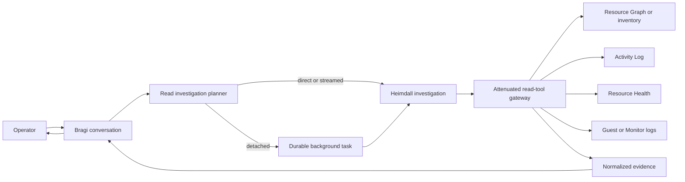

# Azure 읽기 조사

이 문서는 operator 질문이 bounded read-only Azure 조사로 전환되는 방식을 정의합니다. Bragi는
대화를 소유하고, Heimdall은 resource change 및 external actor 해석을 소유하며, provider adapter는
Thor의 execution identity를 사용하지 않고 evidence를 수집합니다.

> **범위:** 이 설계는 resource 조회, Activity Log attribution, Resource Health, guest log fallback,
> 구성된 NSG rule, VNet peering topology, 실행시간 예측, progress 전달 및 detached investigation
> session을 다룹니다. Azure 변경을 승인하거나 실행하지 않습니다.
>
> **검색 명령 커버리지:** Provider 전체 resource 검색, ARG 특수 table, 정제된 재현 command 및
> coverage reconciliation은
> [Azure Resource Discovery Command Coverage](azure-resource-discovery-commands-ko.md)에서 정의합니다.

## 설계 개요

Read investigation은 mutation control loop 밖에 유지됩니다. Deterministic planner가 typed read tool을
선택한 다음 측정된 tool latency를 기준으로 direct, streamed 또는 detached 실행 모드를 선택합니다.
모든 답변은 normalized server-owned evidence를 인용하거나 evidence가 unavailable임을 보고합니다.


```mermaid
flowchart LR
    USER[Operator] --> BRAGI[Bragi conversation]
    BRAGI --> PLAN[Read investigation planner]
    PLAN -->|direct or streamed| HEIMDALL[Heimdall investigation]
    PLAN -->|detached| TASK[Durable background task]
    TASK --> HEIMDALL
    HEIMDALL --> GATEWAY[Attenuated read-tool gateway]
    GATEWAY --> ARG[Resource Graph or inventory]
    GATEWAY --> ACTIVITY[Activity Log]
    GATEWAY --> HEALTH[Resource Health]
    GATEWAY --> GUEST[Guest or Monitor logs]
    GATEWAY --> EVIDENCE[Normalized evidence]
    EVIDENCE --> BRAGI
    BRAGI --> USER
```

## 소유권 및 경계

| Component | 책임 | 수행하지 않는 작업 |
|-----------|------|---------------------|
| Bragi | Operator turn을 분류하고 conversation context를 보존하며 progress와 최종 답변을 operator locale로 렌더링합니다. | Privileged credential로 Azure를 조회하거나 변경 실행 가능 여부를 결정하지 않습니다. |
| Heimdall | `resource_change_history` 및 `external_actor` 조사 의미를 소유하고 read evidence를 correlate하며 불확실성을 명시합니다. | Azure SDK를 import하거나 `az`를 spawn하거나 승인 또는 resource mutation을 수행하지 않습니다. |
| Huginn | 전달된 Azure signal을 지속적으로 ingest하고 normalize하여 이후 correlation에 사용합니다. | Ad hoc conversational request를 제공하지 않습니다. |
| Saga | 질문이 FDAI action에 관한 경우 FDAI audit chain에서 답합니다. | Correlation 없이 Azure Activity Log를 FDAI audit evidence로 취급하지 않습니다. |
| Thor | 기존 `ActionRun` 상태를 보고하고 승인된 typed action을 실행합니다. | Inventory, Activity Log, Resource Health 또는 guest-log read를 실행하지 않습니다. |
| Task worker | 격리된 depth-one attenuated read investigation 하나를 실행합니다. | Pantheon에 합류하거나 Pantheon object를 publish하거나 execution authority를 상속하지 않습니다. |

Operator 질문은 `object.event`로 publish하지 않습니다. 해당 topic은 detection, judgment, risk 및
execution processing으로 들어갑니다. Detached investigation은 optional wake signal을 내보내기 전에
task를 persist합니다. PostgreSQL이 source of truth이고 wake signal은 delivery hint일 뿐입니다.

## 구현 상태

| Capability | 현재 상태 | 근거 |
|------------|-----------|------|
| Bragi 및 Heimdall routing | 구현됨 | Deterministic 영어 및 한국어 actor, shutdown, history, health, state routing이 generic scoring 전에 Heimdall을 선택합니다. |
| Investigation evidence signal | 구현됨 | Bound된 read-investigation hook은 Heimdall 대화형 포트의 owned evidence로 계산되므로, 로컬 신호 window가 차기 전에도 조사 가능한 turn에는 evidence-gap prompt layer가 붙지 않습니다. |
| Exact resource resolution | 구현됨 | `not_found`, bounded `ambiguous`, scope-bound exact reference가 resolution 성공 전 history query를 중지합니다. |
| Typed intent rendering | 구현됨 | 등록된 read intent 7개가 모두 typed evidence field와 observation time을 렌더링합니다. Renderer가 없는 enum을 추가하면 generic success string을 반환하지 않고 exhaustive type checking이 실패합니다. |
| Catalog/runtime binding | 구현됨 | Catalog intent ID가 runtime enum과 정확히 일치하고 모든 read intent를 Heimdall이 계속 소유하며 plan ID가 unique인 경우에만 local 및 deployed composition이 provider I/O 전에 시작됩니다. |
| Planner intent coverage | 구현됨 | 하나의 immutable runtime intent spec이 plan ID, default 및 interactive tool, lookback을 소유합니다. Enum gap은 import 및 exhaustive test에서 실패하고 catalog plan-ID drift는 startup에서 차단됩니다. |
| 대화형 resource 연속성 | 구현됨 | Command Deck은 server가 선택한 inventory resource 하나를 terminal turn 사이에 유지합니다. Resource Health history는 resource group, timestamp 및 status로 구성된 완전한 anomalous-event anchor 하나도 유지할 수 있습니다. 생략된 history 및 장애 직전 후속 질문은 semantic 및 public-web planning을 우회하고, Heimdall이 bounded context를 다시 검증한 뒤 일치하는 read evidence를 직접 반환합니다. |
| Subscription scope identity | 구현됨 | 현재 subscription identity 질문은 server에 configured된 subscription name과 state를 Azure Resource Manager에서 읽고, masked subscription ID만 렌더링하며, narrator model을 호출하지 않습니다. |
| Subscription health sweep | 구현됨 | 명시적인 subscription 점검, 일반적인 service-outage 질문 및 일반적인 degraded 또는 unavailable resource-state 질문이 configured reader scope를 사용합니다. Inventory language catalog가 availability 의미에 대해 Resource Health authority를 선택합니다. Provider는 configured resource-group allowlist를 기본으로 사용합니다. 명시적인 server-owned subscription mode는 interactive local health 범위를 subscription inventory와 맞춥니다. Platform-impact read는 active Service Health event와 impacted resource를 query하고 outage를 maintenance 및 advisory와 분리한 다음 Resource Health cause와 correlate합니다. 다른 diagnosis read는 최대 16개 supported resource의 대표 metric을 concurrency 4 이하로 확인할 수 있습니다. |
| Azure evidence adapter | 구현됨 | REST는 state, Activity Log, Resource Health, guest log, 구성된 NSG rule 및 VNet peering property를 지원합니다. Interactive local은 executor identity를 받지 않고 registered development operations gateway를 통해 NSG 및 peering read를 전달할 수 있습니다. Typed CLI fallback은 registered plan으로 resource, VM state, Activity Log를 지원합니다. |
| 선택적 Azure MCP read | 구현됨 | 공식 MCP Python SDK가 고정된 Azure MCP Server를 stdio로 시작하고 traffic 전에 namespace allowlist를 probe합니다. VM state, Activity Log, Resource Health에 사용하며 unavailable 상태이거나 circuit breaker에서 차단되면 typed REST로 즉시 fallback합니다. |
| Read-tool attenuation | 구현됨 | `background.read-only`는 Reader tool 7개만 포함하고 mutation, approval, shell, arbitrary-query, nested-worker capability를 차단합니다. |
| Execution mode 및 progress | 구현됨 | Durable p50/p95 profile이 cloud I/O 전에 direct, streamed, detached mode를 선택합니다. Exact resolution은 barrier이며 독립 evidence tool은 bounded parallel limit 안에서 실행됩니다. Streamed mode는 bounded progress와 SSE comment heartbeat를 전송하고, stream close는 provider work를 cancel하며, terminal event는 한 번만 발생합니다. |
| Interactive policy parity | 구현됨 | Local 및 deployed conversation composition은 동일한 명시적 direct, streamed 및 multi-source threshold를 사용합니다. Adapter latency는 다를 수 있지만 execution-mode policy는 environment에 따라 달라지지 않습니다. |
| Direct 및 streamed replay | 구현됨 | Owner-scoped PostgreSQL run ledger가 canonical request를 claim하고 lease를 renew하며 reclaim attempt를 제한합니다. Terminal usage를 보존하고 provider를 다시 호출하지 않고 completed result를 replay합니다. Command Deck direct read도 같은 executor를 사용합니다. Interactive local PostgreSQL profile도 같은 run store를 제공하며 in-memory replay path로 대체하지 않습니다. |
| Detached execution 및 quota | 구현됨 | Typed executor는 narrator history, screen state, event bus, Thor, executor identity를 받지 않습니다. Per-principal concurrency, cost, wall-clock, tool-call quota는 durable creation에서 적용됩니다. |
| Completion handoff | 구현됨 | Terminal result와 pending completion outbox가 원자적으로 commit됩니다. Bounded retry는 investigation을 다시 실행하지 않고 idempotent conversation 및 reply-ledger handoff를 replay합니다. |
| Live Azure scenario evidence | 일부 검증됨 | Caller attribution, Resource Health, unauthorized scope 및 ambiguous name은 read-only live validation을 통과했습니다. Guest-event match와 실제 provider `429`는 release evidence gap으로 남습니다. |

## Investigation request 및 plan

Planner는 eligible 질문을 immutable `ReadInvestigationRequest`로 변환합니다. Requester, conversation 및 correlation reference, intent, resource selector, lookback, requested evidence, budget 및 idempotency key를 전달합니다. Model이 tool description을 보기 전에 deterministic classification을 실행합니다.

Schema로 검증되는 `investigation-intents.yaml` catalog가 언어와 계약 사이의 경계를 소유합니다. 각 entry는 work class, 책임 Pantheon agent, 등록된 plan ID, selector kind, answer contract, 검토된 영어 및 한국어 match term, evidence authority와 facet, 숫자형 freshness budget을 선언합니다.
Catalog는 실행 가능한 text를 포함하거나 tool authority를 부여할 수 없습니다. 알 수 없는 owner, work class, selector, answer contract, field 또는 response-mode order는 provider I/O 전에 catalog load를 차단합니다.

첫 catalog revision은 아래의 read intent 7개를 설명합니다. 모든 entry는 Heimdall이 소유하고 `work_class: read`를 사용하며 등록된 plan을 가리킵니다. Bragi는 turn을 분류하고 route할 수 있지만 catalog owner, evidence requirement 또는 freshness budget을 바꿀 수 없습니다.

초기 intent vocabulary는 다음과 같습니다.

- **`resource_state`**: Resource를 resolve하고 현재 observed state를 반환합니다.
- **`change_attribution`**: Bounded resource operation의 control-plane actor를 식별합니다.
- **`resource_change_history`**: Resolve된 resource 하나의 최근 allowlisted change를 반환합니다.
- **`platform_health`**: Azure platform availability evidence를 설명합니다.
- **`guest_shutdown`**: 구성된 guest log에서 operating-system shutdown event를 검색합니다.
- **`network_security`**: 구성된 NSG rule과 subnet 또는 NIC association을 반환합니다.
- **`network_peering`**: VNet 하나의 peering state, sync level, address space 및 traffic 또는
  gateway flag를 반환합니다.

Planner는 history를 조회하기 전에 resource name을 resolve합니다. Match가 없으면 `not_found`를
반환합니다. 여러 match는 bounded candidate와 함께 `ambiguous`를 반환하고 추가 cloud query를 하지
않습니다. 단일 match는 이후 tool이 확장할 수 없는 exact provider resource reference를 생성합니다.
`read-only`, `customer-initiated`, `platform-initiated`와 같은 evidence 및 cause qualifier는
resource selector가 아닙니다. 이러한 term이 포함된 collection 질문은 distinct identifier-like
resource name 하나도 함께 포함하지 않는 한 collection read를 유지합니다.

Inventory 답변이 resource 하나를 선택하면 terminal response에 bounded name, type 및 inventory
evidence reference를 포함할 수 있습니다. Command Deck은 "언제부터 중지되어 있었어?" 같은 후속
질문에 이 context를 다시 보냅니다. 다시 보낸 값은 selector hint일 뿐 evidence authority가 아닙니다.
Server는 이 값을 검증하고 configured subscription 및 resource-group scope 안에서 exact resource를
다시 resolve합니다. Resolution이 없거나 ambiguous하거나 일치하지 않으면 grounded history 답변을
생성할 수 없습니다. Contextual turn은 Heimdall read branch만 시작하며 inventory, operational,
public-web 및 narrator fallback이 결과를 대체할 수 없습니다. 일치하는 `none`, `unavailable` 및
`ambiguous` Heimdall 결과는 scope 또는 selection limitation과 함께
terminal unverified 답변으로 유지됩니다. Resource history 및 attribution은 bounded 30일 lookback을
사용합니다. 중지된 resource에 대해 Heimdall은 최근 성공한 Stop, Power Off 또는 Deallocate Activity
Log event를 보고하고, 현재 중지 상태가 적어도 해당 timestamp부터 이어졌다고 명시합니다.
Guest shutdown follow-up은 동일한 validated resource selector와 exclusive Heimdall branch를
재사용합니다. Deterministic intent는 영어와 한국어의 subject-first, reverse-order 및 colloquial form을
수락하며 narrator가 conversation prose에서 누락된 resource name을 복구하도록 하지 않습니다.
성공한 detached handoff는 bounded task reference를 terminal unverified queued 답변으로 반환합니다.
Observed execution은 handoff를 completed로 표시하고 `status=queued`를 보고합니다. 수락된 durable work를
unavailable로 잘못 표시하거나 narrator로 보내지 않습니다.
Detached submitter가 구성되지 않으면 `handoff_required`는 task reference와 narrator fallback이 없는
terminal unverified capability limitation으로 유지됩니다.
Read-availability follow-up도 validated selector와 exclusive Heimdall branch를 재사용합니다. Typed
result는 readable control-plane state, observed state record 부재 및 unavailable scope 또는
reader/provider authority를 구분합니다. Empty result에서 authorization denial을 추론하거나 narrator가
scope와 permission cause 중 하나를 선택하도록 하지 않습니다.

Resource Health history가 degraded, unavailable 또는 unknown availability event가 있는 resource
하나를 선택하면 terminal context에 해당 event의 resource group, timestamp 및 status도 포함할 수
있습니다. 세 field는 모두 있거나 모두 없는 bounded incident anchor로만 수락됩니다. 장애 직전 후속
질문은 server-configured scope에서 최대 24시간과 Activity Log event 200개를 읽고, anchor 이전의 같은
resource group에서 성공한 deployment, write, update 및 configuration operation만 유지합니다. 바로 앞
1시간의 건수를 보고하며, 건수가 0이면 인과관계를 주장하지 않고 가장 가까운 이전 matching change를
표시할 수 있습니다. Provenance 누락, provider failure 또는 malformed context는 `unavailable`을
반환합니다. 완전한 anomalous-event anchor가 없는 후속 질문은 Activity Log나 narrator를 호출하지 않고
terminal unverified evidence gap을 반환합니다. Truncation은 명시하며 답변에는 최대 20개 matching
event만 포함합니다. Anchor가 있는 모든 답변은 analysis-window 시작, bounded interval 및 incident
anchor를 명시적인 timeline landmark로 표시합니다.

Collection 질문은 별도의 typed activity query를 사용합니다. Server는 Azure subscription 및
resource-group allowlist를 고정하고 lookback을 최대 30일, 반환 event를 최대 200개로 제한하며 event
time, normalized operation/status, resource name, resource type 및 resource group만 projection합니다.
Caller identity와 raw resource ID는 collection answer에 들어가지 않습니다. Provider는 neutral type을
복원하기 위해 current inventory resource를 join할 수 있지만 deleted resource는 사라지거나 다른 type으로
표시되지 않고 bounded ARM type으로 유지됩니다. Model이 제안한 activity predicate는 deterministic
inventory-query verifier가 수락하기 전에는 authority가 없습니다.

수락된 모든 current 또는 activity collection은 source, result kind, 최대 8개 predicate 및 optional
bounded lookback을 가진 immutable `InventoryQuery` 하나로 compile됩니다. Allowlist field는
`resource_type`, `status`, `name`, `resource_group`, `location`, `operation`, `event_status`이고 operator는
`eq`, `ne`, `in`, `not_in`, `contains`, `exists`, `missing`입니다. Deterministic compiler는 current provider에
실제로 관찰된 facet을 match하므로 새 status마다 routing expression을 추가할 필요가 없습니다. Match되지
않은 modifier는 전체 resource로 확장하지 않고 abstain합니다. Semantic planner는 deterministic abstain
후에만 동일한 strict shape를 제안할 수 있지만 같은 turn에서 실행할 수 없습니다. Verified
exact/promoted mapping 또는 별도 operator confirmation이 complete query를 만들어야 하며 verifier가
I/O 전에 query 전체를 다시 확인합니다. Imperative change는 action draft로 유지되며 이 read path에
들어갈 수 없습니다.
`not_in`은 bounded unique value list만 받습니다. Verifier가 canonical state id를 확장하고 provider
grounding 단계가 제외 전에 이를 관찰된 provider status form으로 교체합니다. 따라서 negative phrase를
positive `running` alias로 바꾸지 않습니다.
Filter가 없는 managed-scope 목록 표현은 영어와 한국어 모두 catalog data로 관리됩니다. Operator가
이름, 유형, 상태, evidence 또는 대표 resource 하나만 요청하더라도 semantic planning 전에 fresh
subscription-scoped `list` query로 compile됩니다.

Inventory language catalog의 state entry는 필요한 evidence authority도 선언합니다. 일반적인 current
state와 operation은 language-neutral description과 bounded 영어/한국어 example도 포함합니다. Optional
embedding resolver는 exact term으로 query를 완성할 수 없을 때 해당 semantic surface를 검색합니다.
Ranking 결과는 non-authoritative candidate일 뿐입니다. 승격되지 않았거나 모호한 candidate는 provider
I/O 전에 clarification을 만들며 similarity score로 predicate, evidence receipt 또는 action이 될 수
없습니다.
일반적인 current
operational state는 promoted inventory를 사용합니다. Degraded 또는 unavailable availability 의미를
포함한 질문은 동일한 server-owned scope 아래에서 `Resources`와 `HealthResources`를 결합하는 기존
subscription health sweep을 사용합니다. 구체적인 resource-family filter는 해당 health query에
유지되며 renderer는 canonical 또는 provider type이 요청한 family와 일치하는 finding만 사용합니다.
Request의 catalog-compiled state group은 typed evidence envelope과 함께 전달되므로 deterministic
renderer가 prompt text를 다시 해석하지 않고 zero-result group을 보존할 수 있습니다.
Catalog가 complete inventory query를 compile할 수 있으면 `find` 또는 `찾아줘` 같은 일반적인 search
verb는 public web evidence를 선택하지 않습니다. Operator가 해당 medium이나 다른 명시적인 web
context를 지정한 경우에만 public web이 우선합니다.
두 개 이상의 state group을 요청하면 status-grouped answer를 자동으로 생성합니다. Broad group이 더
구체적인 requested group과 겹치면 구체적인 group이 해당 provider value를 소유하므로 한 resource가
여러 section에 반복되지 않습니다.
Compiler는 관측된 provider-specific state value를 유지할 수 있지만, 서로 겹치지 않는 모든 requested
group은 executable predicate에 남아 있어야 합니다. Observation-based narrowing으로 group 전체가
제거되는 경우 evidence retrieval 전에 해당 group의 canonical catalog value를 추가합니다.
한국어 state term과 문법 suffix는 구어체 명사형과 관형형을 포함해 catalog data로 유지합니다. 따라서
deterministic route는 prompt-specific parser branch에 의존하지 않습니다.
Active-view inventory 요청에는 Architecture 화면에서 선택된 bounded resource group 하나가 필요합니다.
선택이 없거나 malformed이거나 resource group이 아니면 inventory query, 다른 evidence branch 또는
narrator 호출 없이 deterministic unavailable 결과를 반환하며, operator가 group을 선택하거나 이름을
지정해야 합니다.
Node를 명시한 AKS 질문에는 Kubernetes workload evidence가 필요합니다. Cluster inventory는 stopped
또는 다른 unhealthy cluster finding을 ground할 수 있지만, node readiness가 없으면 이를 명시적인
coverage gap으로 유지하며 healthy-node 결론을 생성할 수 없습니다.
양성 state-filtered cluster finding은 node coverage gap을 answer에 유지하면서 evidence check를 완료할
수 있습니다. 양성 state-filtered finding이 없는 workload-only 질문은 unverified로 유지됩니다.

## Read-tool catalog

각 tool에는 Reader RBAC, `side_effect_class=read`, server-owned query template, 고정 timeout, output cap
및 evidence schema가 있습니다.

| Tool | Primary provider | 목적 |
|------|------------------|------|
| `resolve_resource` | Resource Graph 또는 promoted inventory | Name, type, resource group 및 configured scope를 resource reference 하나로 resolve합니다. |
| `get_resource_state` | Resource provider instance view | 현재 resource state와 observation time을 확인합니다. |
| `query_resource_activity` | Azure Activity Log REST 또는 configured `AzureActivity` projection | Bounded control-plane operation 및 caller attribution을 반환합니다. |
| `query_resource_health` | Resource Health 또는 ARG `HealthResources` | Platform availability event와 customer operation을 구분합니다. |
| `query_guest_shutdown_events` | Log Analytics guest-log projection | Diagnostic collection이 구성된 경우 operating-system shutdown evidence를 찾습니다. |
| `query_network_security` | Network resource provider | 제한된 custom/default NSG rule field와 association을 반환합니다. |
| `query_network_peerings` | Network resource provider | 제한된 VNet peering state, synchronization, address-space 및 routing flag를 반환합니다. |

REST 또는 SDK adapter가 production default입니다. Azure CLI는 기존 typed command broker 뒤의
allowlisted fallback입니다. Model은 argv, KQL, ARG query, subscription id 또는 ARM URL을 생성하지
않습니다. Registered tool 및 bounded enum argument만 선택합니다.

### 선택적 Azure MCP provider

Azure MCP는 registered tool을 위한 추가 read transport를 제공할 수 있습니다. 이 provider는 선택
사항입니다. MCP가 없거나, 연결할 수 없거나, 권한이 없거나, allowlist tool이 누락되어도 Resource
Graph와 typed REST provider가 authoritative provider로 유지되며 요청을 계속 처리합니다.

Operator API는 traffic을 받기 전에 bounded MCP handshake와 `tools/list` probe를 한 번 수행합니다.
초기 deadline은 구성 가능하며 최대 10초입니다. Probe 실패는 capability를 unavailable로 기록하지만
Operator API 시작을 차단하지 않습니다. Unavailable 상태의 요청은 MCP server에 접속하지 않고 기존
provider를 즉시 사용합니다. Background health monitor는 호출 없는 probe를 다시 시도합니다. Discovery가
성공하면 process restart 없이 routing이 복구됩니다.

모든 MCP 호출은 circuit breaker를 통과합니다. Transport 또는 protocol 실패가 반복되면 circuit이
열리고 이후 요청은 다른 provider timeout을 기다리지 않고 MCP를 건너뜁니다. Cooldown 뒤에는 하나의
half-open probe가 circuit을 복구할 수 있습니다. Server는 명시적인 read-tool allowlist만 노출합니다.
Discovery는 등록되지 않은 Azure MCP tool에 권한을 부여하지 않으며, tool output은 Bragi에 전달되기
전에 기존 `ReadEvidenceEnvelope`로 normalize됩니다.

MCP read는 ontology `Action`이 아닙니다. `ToolCallReceipt`와 normalized evidence를 포함하는
`ReadToolId` attempt로 유지됩니다. Azure mutation은 기존 `ops.*` 또는 `remediate.*` ActionType,
RiskGate, 사람 승인, Thor execution, rollback, Saga audit 경로를 계속 사용합니다. 고정된 Azure MCP
Server `2.0.5`는 VM start 또는 deallocate command를 노출하지 않으므로 `ops.start-vm`과
`ops.deallocate-vm`은 registered `direct_api` operations gateway에 유지됩니다. FDAI는 read 또는
update tool에서 mutation command를 추론하지 않습니다.

Broker는 registered plan의 timeout 및 output cap을 적용합니다. Complete JSON은 typed adapter에
ephemeral output으로만 반환되고 command receipt는 bounded 4 KB diagnostic tail만 유지하며 broker는
반환 후 full output을 cache하지 않습니다. Raw CLI output은 persist되거나 narrator context에 전달되지
않습니다. Concurrent receipt-based execution은 serialize되므로 broker lifetime 동안 idempotency key
하나가 registered command를 최대 한 번만 호출합니다.
Plan timeout은 managed-identity login, subscription verification, command execution이 공유하는 하나의
cumulative deadline이며 setup work가 안내된 command budget을 배수로 늘릴 수 없습니다.

`FDAI_DEV_OPERATIONS_GATEWAY_URL`과 별도로 출력되는
`FDAI_DEV_OPERATIONS_GATEWAY_AUDIENCE`가 모두 구성되면 interactive local은 REST transport를
read-only gateway transport로 감쌉니다. Exact resource resolution이 subscription 및
resource-group-bound reference를 계속 제공합니다. 이 wrapper는 `azure.network.nsg.read`,
`azure.network.peering.read` 및 `azure.private.http.probe`를 노출합니다. Active application-to-database
reachability는 `FDAI_NETWORK_REACHABILITY_PROBE_ALIAS`가 gateway의
`FDAI_DEV_GATEWAY_PRIVATE_PROBES_JSON`에 `result_contract: application_database_dependency`로 이미
등록된 alias를 가리킬 때만 사용할 수 있습니다. 이 authenticated application-owned endpoint는
`dependency: database`와 Boolean `reachable`을 포함하는 bounded JSON을 반환해야 합니다. Generic HTTP
status probe는 application-to-database evidence가 아닙니다. Browser와 model은 URL, host, subscription,
resource group 또는 alias를 제공할 수 없습니다. HTTP 전에 확장된 resource reference를 차단하고 고정
byte cap 안에서 response를 stream하며 gateway 실패 시 direct ARM으로 조용히 fallback하지 않고
unavailable을 보고합니다. NSG 및 peering 구성만으로는 end-to-end reachability를 증명하지 않습니다.

### Subscription scope identity

Command Deck tool `query_subscription_scope`는 "현재 Azure 구독은?" 같은 질문을 narrator-model
classification 전에 처리합니다. Health sweep과 동일한 Reader identity를 사용하여 Azure Resource
Manager에서 configured subscription의 display name과 state를 읽습니다. Browser input은 다른
subscription을 선택하거나 configured scope를 확장할 수 없습니다.

Deterministic terminal answer는 display name, state, observation time과 앞 4자 및 뒤 4자만 유지한
masked subscription ID를 포함합니다. Provider 실패는 unavailable answer를 생성하며 generated
subscription detail로 fallback하지 않습니다.

### Subscription health sweep

Command Deck tool `query_subscription_health`는 명시적인 subscription 점검, 일반적인
service-outage 질문 또는 catalog 의미가 Resource Health를 요구하는 일반적인 resource collection
질문을 처리합니다. Deterministic routing이 narrator-model classification 전에 이 read를 선택합니다.
Scope는 server의 subscription과 resource-group allowlist에서만 가져오며 browser input은
이를 넓힐 수 없습니다. Provider는 다음 bounded step을 수행합니다.

Provider에는 composition에서 고정되는 두 가지 mode가 있습니다. `resource_groups`가 기본값이며
configured allowlist를 `Resources`와 `HealthResources` 모두에 적용합니다. `subscription`은 query
filter를 제거하지만 server-configured subscription에 계속 고정됩니다. Interactive local의
authoritative inventory가 이미 subscription-wide이므로 local은 `subscription`을 선택합니다.
Deployment는 composition root가 subscription mode와 적절한 scope의 reader identity를 명시적으로
binding하지 않으면 `resource_groups`를 유지합니다. Browser와 narrator는 mode를 선택할 수 없습니다.

1. Resource Graph inventory와 `HealthResources`를 병렬 query합니다.
2. ARG가 health row를 반환하지 않으면 공식 ARM endpoint를 통해 configured subscription 또는 허용된
  각 resource group의 current Resource Health availability status를 나열합니다. 실패한 scope는
  unavailable로 명시합니다.
3. Resource-health history intent에는 catalog에서 parse한 lookback을 최대 24시간으로 제한하여
  `HealthResources` availability status와 resource annotation을 query합니다. Occurrence time으로
  merge하고 각 event를 `customer-initiated`, `status-only`, `platform-initiated`로 분류합니다.
4. 명시적인 platform-impact intent에는 active `ServiceHealthResources` event와 bounded
  impacted-resource row를 query합니다. Rendering 전에 `ServiceIssue`, `PlannedMaintenance` 및
  `HealthAdvisory` count를 분리합니다.
5. Platform impact가 아닌 diagnosis intent에는 representative Azure Monitor metric을 확인할
  supported resource를 최대 16개 선택합니다.
6. 최대 4개 metric을 동시에 query하고 server-owned threshold와 비교합니다.
7. Service Health event, Resource Health cause와 history, 실패한 provisioning 및 metric 후보를
  unsupported, unavailable, truncated count와 함께 반환합니다.

초기 metric map은 VM CPU, AKS node CPU, Storage availability, PostgreSQL/MySQL/SQL CPU 및
Application Gateway healthy-host count를 다룹니다. Unsupported resource type은 count에 남아
표시됩니다. Service Health, Resource Health 또는 metric failure는 healthy 결론이 아니라 `partial`을
생성합니다. Service Health row는 raw event 또는 resource ID 없이 bounded event type, title, level,
start time 및 impacted-resource projection을 제공합니다.
Customer-initiated Resource Health state는 Azure platform incident가 아니라 user 또는 automation이
시작한 상태로 설명하지만, Activity Log evidence를 수집하기 전에는 actor를 알 수 없다고 표시합니다.
Historical read는 current ARM availability endpoint로 fallback하지 않습니다. Exact lookback,
chronological order, three-way cause count, partial source failure 및 truncation을 보존하므로 current
status를 historical event로 표시하지 않습니다.
Current Resource Health timeline 질문은 별도의 deterministic mode를 사용합니다. 관련 없는
representative metric이나 Service Health를 섞지 않고 current Resource Health와 cause annotation을
query한 다음 각 finding의 provider observation time과 `customer-initiated`, `status-only` 또는
`platform-initiated` 분류를 렌더링합니다. Timestamp는 이 bounded read에서 확인한 최초 관측
시각이며 실제 condition onset을 증명하지는 않습니다.
Health-coverage 질문은 동일한 server scope에서 Resource Health, Service Health 및 representative
metric을 query합니다. Unavailable 및 unsupported count를 분리해 보고하며 provider가 원인을 증명하지
않으면 provider-unavailable 결과를 authorization 또는 scope로 표시하지 않습니다.
Broad CPU spike 질문도 semantic 또는 screen interpretation 전에 이 server-owned metric path를
사용합니다. Unsupported 또는 unavailable metric coverage는 계속 표시되며 generic CPU definition이나
spike가 없었다는 claim으로 바뀔 수 없습니다.
Broad memory-pressure 질문도 동일한 path를 사용합니다. Typed query는 diagnostic metric family를
기록하고 renderer는 다른 metric family의 observation을 제외하면서 sweep의 unavailable, unsupported 및
truncation limitation을 유지합니다.
Before/after metric comparison에는 verified incident anchor 하나와 별도로 bounded된 window 두 개가
필요합니다. Anchor가 없으면 deterministic tool은 point-in-time metric sweep을 실행하거나 repository,
screen 또는 incident-roster evidence를 빌리지 않고 unavailable을 반환합니다.
Error-rate/change correlation에는 하나의 shared scope 아래에서 error-rate metric window와 bounded
deployment 또는 configuration activity가 필요합니다. Provider가 해당 join을 제공할 때까지 deterministic
route는 unavailable을 반환하고 current-screen limitation을 correlation result로 verified 처리하지 않습니다.
Pod restart와 throttling diagnosis에는 exact pod name 또는 server-validated selected pod context가
필요합니다. "this pod"와 같은 context-free reference는 subscription sweep을 실행하지 않고 clarification을
반환합니다. Capacity sufficiency에는 observed load trend와 resource limit을 join하는 provider가 필요합니다.
해당 provider가 구성될 때까지 route는 point-in-time health나 current-screen evidence를 대체하지 않고
unavailable을 반환합니다.
각 terminal tool 답변은 source, observation time, query-window lower bound, status 및 truncation이
포함된 bounded freshness context를 반환할 수 있습니다. Console은 최신 assistant-issued context만
검증하고 유지합니다. Oldest 또는 stale-evidence follow-up은 이를 deterministic하게 렌더링하고 window
boundary가 가장 오래된 returned record와 다를 수 있음을 명시합니다. 검증된 이전 freshness receipt가
없으면 follow-up은 terminal unavailable result를 반환하며 current-screen 또는 narrator output으로
대체하지 않습니다.
명시적인 status collection의 terminal answer는 근거 있는 empty group을 포함하여 요청된 모든 catalog
state를 request 순서로 렌더링하고, normalized state가 해당 group에 속하는 finding만 나열합니다.
구체적인 family query는 catalog의 provider type, Azure kind token 및 requested availability state로
`Resources`와 `HealthResources`를 prefilter합니다. Kind token은 Web App과 Function App처럼 하나의
ARM type을 공유하는 semantic type을 분리합니다. 질문에 CPU, memory 또는 throughput 같은 diagnosis
의미도 있는 경우에만 representative metric을 실행합니다. Resource Health가 display name을 생략하면
provider는 scope가 검증된 target ID에서 bounded resource name, provider type 및 resource group을
파생합니다. Raw target ID는 answer 또는 narrator context에 들어가지 않습니다.
Resource projection은 bounded `state`, `status`, `resourceState` field도 유지합니다. 값이 requested
catalog state에 속할 때만 finding이 되므로 not-running collection은 모든 observed state를
anomalous로 취급하지 않고 resource state와 Resource Health를 결합할 수 있습니다.
Metric window는 RFC 3339 UTC `Z` timestamp를 사용합니다. Provider는 threshold 이내인 성공적인
observation도 유지하므로 answer가 측정된 정상 상태와 query되지 않은 metric을 구분할 수 있습니다.
Deterministic renderer는 value, comparison 및 threshold를 표시합니다.
Terminal answer는 모든 partial-coverage 제한을 유지합니다. Typed requested group에 속하는 상태의
양성 finding은 해당 finding이 직접 grounded되므로 evidence check 1건을 완료할 수 있습니다. Empty
group은 확인한 evidence에서 match가 관찰되지 않았다는 사실만 표시합니다. 양성 requested-state
finding이 없는 partial result는 `unverified`로 유지됩니다. Evidence selection, factual rendering 및
verification은 deterministic하게 유지합니다. Optional presentation-only mini model은 evidence collection
후 shape-only slot profile을 배치할 수 있지만 finding 또는 metric value를 받지 않으며 terminal status를
바꿀 수 없습니다. Invalid 또는 unavailable planning은 deterministic answer로 fallback합니다. Complete
`matched` result는 check 1건 중 1건을 완료했다고 보고하고 grounded terminal status를 유지합니다.

## Evidence 계약

모든 envelope은 bounded source limitation을 stable machine value로 보존합니다. Truncated evidence는
`result_limit`, `byte_limit`, `source_cutoff` 같은 primary reason 하나를 지정해야 하며 해당 reason은
limitation set에도 있어야 합니다. Provider failure는 provider error text를 복사하지 않고
`source_unavailable`을 기록합니다. Reason field 이전의 legacy persisted payload는 `unspecified`로
replay되며 complete evidence로 조용히 바뀌지 않습니다.

Provider는 cloud-provider-neutral envelope을 반환합니다. Raw Azure response 및 raw CLI output은
narrator context에 들어가지 않습니다.

```json
{
  "status": "matched",
  "authority": "azure.activity_log",
  "resource_ref": "opaque-resource-ref",
  "observed_at": "2026-07-22T00:00:00Z",
  "freshness": "live",
  "truncated": false,
  "records": [
    {
      "operation_kind": "deallocate",
      "status": "succeeded",
      "actor_ref": "opaque-principal-ref",
      "actor_kind": "user",
      "occurred_at": "2026-07-21T23:58:00Z",
      "correlation_ref": "opaque-correlation-ref"
    }
  ],
  "evidence_refs": ["azure-activity:sha256:..."]
}
```

`status`는 `matched`, `ambiguous`, `none`, `unavailable` 중 하나입니다. Server projection은 authorized
caller label을 렌더링할 수 있지만 durable record 및 metric label은 opaque reference를 유지합니다.
Evidence text는 untrusted data이며 approval 또는 execution eligibility를 부여할 수 없습니다.

NSG `Allow` record는 구성된 rule evidence이며 port가 end-to-end로 도달 가능하다는 증거가 아닙니다.
답변은 이 제한을 명시합니다. FDAI가 실제 reachability 또는 양방향 연결을 주장하려면 effective NIC
rule, Network Watcher IP Flow Verify, 반대편 peering read 및 effective route가 추가 evidence step으로
필요합니다.

## Source 선택 및 fallback

Investigation은 operator에게 비슷해 보이는 5개 질문을 구분합니다.

1. **현재 상태:** Resource Graph 또는 inventory가 VM을 resolve하고 instance view가 `running`,
   `stopped` 또는 `deallocated`를 확인합니다.
2. **Control-plane actor:** Activity Log는 기록이 있는 경우 성공한 Stop, Power Off 또는 Deallocate
  operation과 caller를 식별합니다. Conversational attribution path는 exact resolution과 Activity
  Log만 기본으로 사용하며, guest shutdown 및 platform-cause evidence는 별도 intent 또는 explicit
  deep investigation에서 추가합니다.
3. **Latest control-plane change:** Activity Log는 종류와 관계없이 가장 최신 successful operation을
  선택하고 operation, time, actor kind 및 opaque actor reference를 반환합니다. 더 최신 start 또는
  update가 있으면 이전 stop-only attribution을 재사용하지 않습니다.
4. **장애 직전 control-plane change:** 완전한 Resource Health incident anchor는 해당 event 이전의
  같은 resource group에서 successful deployment 또는 configuration write를 선택합니다. 1시간 건수와
  가장 가까운 이전 match는 시간적 correlation일 뿐 root-cause attribution이 아닙니다.
5. **Guest shutdown:** Control-plane operation이 없는 `stopped` VM은 Windows Event Log 또는 Linux
   syslog evidence가 필요합니다. Guest diagnostic이 없으면 actor를 추측하지 않고 `unavailable`을
   반환합니다.
6. **Platform event:** Resource Health는 host, maintenance 또는 platform availability context를
  제공합니다. ARG history가 비어 있으면 current-status fallback의 observation timestamp가 요청한
  lookback 안에 있을 때만 evidence로 사용합니다. 사용자가 event를 시작했다는 사실을 증명하지는
  않습니다.

Activity Log miss는 누구도 VM을 중지하지 않았음을 증명하지 않습니다. Retention, ingestion delay,
guest shutdown 및 platform failure를 explicit caveat로 유지합니다. Heimdall은 지원되는 가장 강한
결론을 명시하고 누락된 evidence를 나열합니다.

## 실행 모드

`InvestigationExecutionPolicy`는 측정된 plan estimate에서 하나의 모드를 선택합니다. Threshold는
routing code의 literal이 아니라 configuration입니다.

| Mode | 권장 초기 p95 구간 | 동작 |
|------|--------------------|------|
| `direct` | 최대 4초 | 현재 request에서 실행하고 답변 하나를 반환합니다. |
| `streamed` | 4초 초과 15초 이하 | Chat stream을 열어 두고 bounded semantic progress를 보냅니다. |
| `detached` | 15초 초과, multi-source fan-out 또는 explicit deep investigation | Durable background task를 만들고 task reference를 즉시 반환합니다. |

이 값은 시작 configuration이며 performance claim이 아닙니다. Deployment owner는 target environment에서
같은 scenario set을 측정한 후 값을 교체하는 것이 좋습니다. Detached work는 기존
`queued -> claimed -> running -> terminal` state machine을 재사용합니다. Worker는 parent transcript,
screen state, mutable memory, shell, executor identity 또는 mutation tool을 받지 않습니다.

Direct 및 streamed request는 authenticated principal과 idempotency key로 식별하는 별도의 owner-scoped
run ledger를 사용합니다. Ledger는 selector, lookback, evidence, 모든 budget field 및 explicit-deep flag를
포함한 canonical request projection의 digest를 저장합니다. 일치하는 completed request는 immutable
result를 replay합니다. Active request는 bounded retry interval을 반환하고 failed 또는 expired request는
총 세 번까지 key를 reclaim할 수 있습니다. Lease는 원래 wall-clock ceiling 안에서만 renew되며 terminal
row는 retention이 끝난 후에만 제거됩니다. Command Deck adapter도 ledger를 우회해 provider service를
직접 호출하지 않고 같은 direct executor를 사용합니다. Conversational responder는 이 bounded
progress path에서 direct 및 streamed plan을 모두 실행하며, detached selection만 durable-task handoff를
반환합니다. 초기 streamed ceiling은 20초이므로 cold exact Activity Log attribution estimate가 open chat
stream에서 완료될 수 있고, generic read-investigation route는 초기 15초 ceiling을 유지합니다.

Detached creation은 context binding에도 같은 canonical request digest를 사용합니다. 따라서 budget 또는
다른 request field가 달라진 상태에서 key를 재사용하면 다른 limit으로 생성된 task를 replay하지 않고
conflict를 반환합니다.

## Latency 측정 및 예측

모든 provider call은 tool id, transport, operation class, status, queue 및 execution duration, result
count, truncation, cache status, recorded time 및 trace reference가 있는 `ToolCallReceipt`를 내보냅니다.
Adapter에 authoritative measured cost가 있으면 receipt에 `cost_microusd`도 포함할 수 있습니다. Run usage는
항상 reserved request budget을 기록합니다. 모든 receipt에 authoritative cost가 있을 때만 measured total을
기록하며, 하나라도 없으면 0으로 보고하지 않고 measured value를 unavailable 상태로 유지합니다. Metric
dimension은 resource id, principal id, prompt 및 query text를 제외합니다.

Durable latency profile은 `(tool_id, transport, operation_class)`별 bounded recent sample을 유지하고
sample count, failure rate, p50 및 p95를 노출합니다. Executor는 resource를 먼저 resolve한 다음 최대
4개의 configured parallel limit 안에서 독립 evidence source를 query합니다. Plan estimate는 resolution
p95와 evidence branch의 최대 p95를 더합니다. Detached work에는 queue delay를 추가합니다. Minimum
sample count 전에는 catalog `latency_class`를 사용하고 거짓 정밀도 대신 넓은 범위를 보고합니다.
Provider call이 다른 순서로 완료되어도 evidence와 receipt는 plan 순서를 유지합니다.

Estimate는 cloud I/O 전에 execution mode를 선택합니다. Elapsed time이 안내된 상한을 넘으면 Bragi가
delayed milestone 하나를 보내고 고정 wall-clock budget 안에서 계속합니다. Estimate는 timeout을
연장하거나 tool budget을 늘리지 않습니다.

## Progress 및 completion delivery

Progress는 raw provider command 또는 output이 아니라 operator에게 의미 있는 milestone을 설명합니다.

```text
investigation.planned
resource.resolving
resource.resolved
activity.querying
activity.completed
guest-log.unavailable
evidence.correlating
investigation.completed
```

첫 provider read 전에 Bragi는 Heimdall로의 visible handoff를 보냅니다. Terminal evidence가 normalize된
후 optional observed-execution activity는 resource 및 query value를 정제한 canonical FDAI read
operation을 `input_kind=query`로 표시하고 안전한 status/count summary를 제공합니다. Shell exit
code는 포함하지 않습니다. Raw CLI argv, raw Azure payload, credential,
subscription id, resource id 또는 provider error는 노출하지 않습니다. Web, Slack 및 Teams는 같은
ordered handoff와 execution evidence를 렌더링하고 Bragi가 최종 답변을 렌더링합니다. Progress
detail과 milestone text는 opaque resource placeholder를 사용하며, authorized terminal answer만
normalized evidence의 resource name을 표시할 수 있습니다.

기존 reporter는 event를 coalesce하고 개수를 제한합니다. Direct Command Deck stream은 tool이 시작하고
완료될 때 `activity` event를 보내고, resource resolution과 evidence collection이 operator 경험을
실질적으로 바꿀 때 bounded `milestone` message를 보냅니다. Activity는 실제 완료 순서를 따르지만
terminal evidence는 결정적인 plan 순서를 유지합니다. Streamed provider call이 idle인 동안 route는
표준 SSE comment frame `: heartbeat` 뒤에 빈 줄을 전송합니다. Heartbeat는 progress event를 만들지 않고
connection을 active 상태로 유지합니다. Provider task가 성공하거나 실패하면 stream은 terminal event
하나를 전송합니다. Failure terminal에는 제한된 reason만 포함하고 raw provider error text는 포함하지
않습니다.
Streamed response가 닫히면 in-flight investigation을 cancel하고 await하므로 disconnected client가
consumer 없는 provider read를 계속 실행하도록 남겨 두지 않습니다. Detached completion은 immutable
result를 먼저 commit한 다음 untrusted assistant turn을 append하고 durable background completion
outbox 및 reply ledger를 통해 enqueue합니다. Delivery failure는 investigation을 다시 실행하거나 result를
다시 작성할 수 없습니다.

Bragi는 operator experience가 달라질 때만 estimate를 전달합니다. 예:

> 현재 VM 상태와 최근 Azure Activity Log를 확인하겠습니다. 측정된 provider latency를 기준으로 보통
> 10-20초 정도 걸립니다.

## Identity, authorization 및 audit

Azure read는 configured resource group으로 scope가 제한된 dedicated `azure.reader` workload identity를
사용합니다. Console, Heimdall, task worker 및 ChatOps는 Thor의 executor identity를 받지 않습니다.
Identity에 실수로 더 넓은 permission이 있더라도 provider adapter는 resolved scope 밖의 resource를
거부합니다.

Production은 `FDAI_AZURE_READER_SUBSCRIPTION_ID`, `FDAI_AZURE_READER_CLIENT_ID`, 비어 있지 않은
comma-separated `FDAI_AZURE_READER_RESOURCE_GROUPS` allowlist가 모두 있을 때만 route를 등록합니다.
`FDAI_MONITOR_WORKSPACE_ID`는 optional이며, 없으면 다른 source는 계속 사용할 수 있지만 guest shutdown
evidence는 `unavailable`을 반환합니다. Reader binding이 활성화되면 startup은 traffic을 받기 전에
run-ledger table을 probe하고 필요한 migration이 없으면 즉시 실패합니다.

배포된 Operator API는 dedicated Operator API managed identity와 해당 identity가 Reader를 가진 resource
group에서 세 reader setting을 제공합니다. 이 reader binding이 있으면 Azure MCP는 기본적으로
enabled입니다. `FDAI_AZURE_MCP_ENABLED=false`는 REST path를 비활성화하지 않고 MCP만
비활성화합니다. 설정이 없고 optional Azure MCP SDK가 설치되지 않은 경우 composition은 startup을
차단하지 않고 REST path를 유지합니다. 명시적인 `true`는 optional dependency를 요구하며 누락 시
빠르게 실패합니다. Stdio child는 Azure identity endpoint field, Azure client 및 subscription 선택,
TLS와 process path field, telemetry preference만 받습니다. Database URL, webhook 및 다른 application
secret은 child environment에 복사되지 않습니다.

Bounded control은 `FDAI_AZURE_MCP_STARTUP_TIMEOUT_SECONDS`,
`FDAI_AZURE_MCP_CALL_TIMEOUT_SECONDS`, `FDAI_AZURE_MCP_HEALTH_INTERVAL_SECONDS`,
`FDAI_AZURE_MCP_RESET_TIMEOUT_SECONDS`입니다. `FDAI_AZURE_MCP_COMMAND`는 path 또는 argument가 아닌
하나의 executable name만 받습니다. Command argument는 `server start`로 server-owned 상태를
유지합니다.

고정된 Azure MCP package에는 glibc-linked .NET executable이 포함되며 musl wheel 또는 source
distribution은 제공되지 않습니다. 따라서 runtime image는 digest-pinned Python Debian slim을
사용하고 ICU를 설치하며, .NET bundle extraction과 user cache를 위한 writable nonroot location을
제공합니다. Container verification은 image를 build하고 UID 65532로 `azmcp tools list`를 실행합니다.
Base-image 변경은 extraction, globalization 또는 cache warning 없이 해당 smoke test가 통과해야
완료됩니다.

Interactive local은 현재 Azure CLI token과 같은 server-owned scope를 사용합니다. Local runtime
environment generator는 active CLI subscription이 Terraform과 일치하는지 확인한 후 applied
subscription 및 resource group을 제공합니다. 이 credential은 Thor에 전달되지 않습니다.

Detached-task API는 별도의 `start-read-investigation` capability를 사용합니다. Contributor, Approver,
Owner role은 이 capability를 받으며 Reader와 Break-Glass는 받지 않습니다. Per-principal concurrency,
daily reserved 또는 measured cost, tool-call, wall-clock quota는 durable task creation에서 원자적으로
적용되며 PR-authoring authority와 분리됩니다.

Audit record에는 requester, intent, selected tool, scope digest, task 또는 request id, duration, terminal
status, evidence reference 및 delivery outcome이 포함됩니다. Bearer token, raw claim, raw CLI output,
prompt 및 unredacted caller payload는 제외합니다.

## 실패 동작

- **Ambiguous resource:** History query 전에 bounded candidate를 반환하고 resource group 또는
  subscription context를 요청합니다.
- **Unauthorized scope:** Unavailable을 보고하고 denied provider operation class를 기록합니다.
- **Provider throttling:** ARG request는 quota가 0이면 `x-ms-user-quota-resets-after`만큼 기다리는
  shared gate를 사용합니다. Numeric `Retry-After` 또는 bounded jitter는 timeout과 scope 안에 있습니다.
- **Retention 부족:** 요청한 lookback이 source-specific configured retention을 넘으면 cloud I/O 전에
  `unavailable`을 반환합니다. Activity Log는 기본 90일, guest log는 기본 30일이며 deployment는 실제
  retention에 맞게 각 window를 더 좁힐 수 있습니다.
- **Partial evidence:** 지원되는 fact를 반환하고 누락된 source를 명시합니다.
- **Process loss:** 만료된 running attempt를 `unknown(process_lost)`로 표시하며 자동 replay하지
  않습니다.
- **Cancellation:** Pending provider work를 중지하고 `cancelled`를 commit하며 이미 작성된 completed
  evidence reference를 유지합니다.
- **Evidence의 prompt injection:** Provider string을 data로 취급하고 tool, scope, authorization 또는
  execution mode를 변경하려는 output을 차단합니다.

## 구현 순서 및 release gate

1. Provider-neutral contract, typed tool, normalized evidence 및 bilingual routing이 구현되었습니다.
2. Direct, streamed, detached execution, durable receipt 및 latency profile, quota, semantic progress,
  origin-channel completion enqueue가 구현되었습니다.
3. Structural test는 이 경로가 executor를 import하지 않고 Thor를 참조하지 않으며 `object.event`를
  publish하지 않음을 증명합니다.
4. Read-only live validation은 caller attribution, Resource Health, unauthorized scope 및 ambiguous
  name을 검증했습니다. Dedicated validation environment가 retained guest shutdown event와 자연스럽게
  발생한 provider `429`를 제공할 때까지 capability는 configuration-gated 상태를 유지합니다.

## 검증 및 release evidence

- 영어 및 한국어 intent test가 actor, shutdown, resource history, health 및 ambiguity를 검증합니다.
- Property test가 모든 investigation tool이 read-only이고 attenuation이 mutation, approval, shell,
  nested-worker 및 arbitrary-query capability를 차단하는지 증명합니다.
- Contract test가 REST 및 CLI fallback이 같은 bounded evidence envelope을 생성하는지 검증합니다.
- Scenario test가 investigation이 `object.event`를 publish하지 않고 Thor를 호출하지 않음을 증명합니다.
- Latency test가 cold profile, minimum sample, sequential 및 parallel estimate, threshold boundary, delayed
  milestone 및 cross-replica persistence를 검증합니다.
- Stream test가 terminal delivery 전 idle SSE comment heartbeat와 response close 시 in-flight provider
  task cancellation을 검증합니다.
- Background test가 lease contention, cancellation, timeout, process loss, progress cap, terminal
  immutability 및 durable reply handoff를 검증합니다.
- Live Azure check가 resource mutation 없이 Activity Log caller attribution, Resource Health fallback,
  unauthorized scope, ambiguous name 및 정직한 guest-log absence를 검증합니다.

## 관련 문서

| 알아볼 내용 | 문서 |
|-------------|------|
| Operator tool 및 chat tier | [Operator Console](operator-console-ko.md) |
| Detached investigation lifecycle | [Durable Background Task Sessions](background-task-sessions-ko.md) |
| Isolated tool attenuation | [Bounded Task Workers](../agents/bounded-task-workers-ko.md) |
| Azure inventory boundary | [Cloud Provider Neutrality](../architecture/csp-neutrality-ko.md) |
| Workload identity separation 및 live release evidence | [Security and Identity](../architecture/security-and-identity-ko.md), [운영 및 검증](../operations/operating-and-verification-ko.md#azure-read-investigation-release-evidence) |
