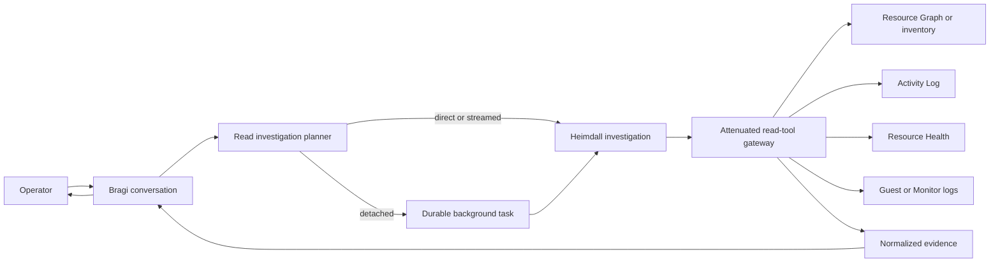

# Azure Read Investigations

This document defines how an operator question becomes a bounded, read-only Azure investigation.
Bragi owns the conversation, Heimdall owns resource-change and external-actor interpretation, and
provider adapters gather evidence without using Thor's execution identity.

> **Scope:** This design covers resource lookup, Activity Log attribution, Resource Health, guest
> log fallback, configured NSG rules, VNet peering topology, execution-time prediction, progress
> delivery, and detached investigation sessions.
> It does not authorize or execute an Azure change.

## Design at a glance

A read investigation stays outside the mutation control loop. A deterministic planner selects
typed read tools, then chooses a direct, streamed, or detached execution mode from measured tool
latency. Every answer cites normalized server-owned evidence or reports that evidence is
unavailable.



## Ownership and boundaries

| Component | Responsibility | Does not do |
|-----------|----------------|-------------|
| Bragi | Classify the operator turn, preserve conversation context, and render progress and the final answer in the operator locale | Query Azure with privileged credentials or decide that a change may execute |
| Heimdall | Own `resource_change_history` and `external_actor` investigation semantics, correlate read evidence, and state uncertainty | Import an Azure SDK, spawn `az`, approve, or mutate a resource |
| Huginn | Continuously ingest and normalize forwarded Azure signals for later correlation | Serve an ad hoc conversational request |
| Saga | Answer from the FDAI audit chain when the question concerns an FDAI action | Treat Azure Activity Log as FDAI audit evidence without correlation |
| Thor | Report existing `ActionRun` status and execute an approved typed action | Run inventory, Activity Log, Resource Health, or guest-log reads |
| Task worker | Run one isolated, depth-one, attenuated read investigation | Join the Pantheon, publish a Pantheon object, or inherit execution authority |

An operator question is not published as `object.event`. That topic enters detection, judgment,
risk, and execution processing. A detached investigation persists its task before an optional wake
signal is emitted. PostgreSQL remains the source of truth; a wake signal is only a delivery hint.

## Implementation status

| Capability | Current state | Evidence |
|------------|---------------|----------|
| Bragi and Heimdall routing | Implemented | Deterministic English and Korean actor, shutdown, history, health, and state routing selects Heimdall before generic scoring. |
| Exact resource resolution | Implemented | `not_found`, bounded `ambiguous`, and one scope-bound exact reference stop history queries until resolution succeeds. |
| Subscription health sweep | Implemented | The configured reader scope queries Resource Graph inventory and Resource Health in parallel, then checks representative metrics for up to 16 supported resources with concurrency limited to four. |
| Azure evidence adapters | Implemented | REST covers state, Activity Log, Resource Health, guest logs, configured NSG rules, and VNet peering properties. Interactive local can route NSG and peering reads through the registered development operations gateway without receiving its executor identity. The typed CLI fallback covers resource, VM state, and Activity Log through registered plans. |
| Read-tool attenuation | Implemented | `background.read-only` contains exactly seven Reader tools and denies mutation, approval, shell, arbitrary-query, and nested-worker capabilities. |
| Execution modes and progress | Implemented | Durable p50/p95 profiles select direct, streamed, or detached mode before cloud I/O. Exact resolution is a barrier, independent evidence tools run under a bounded parallel limit, streamed mode emits bounded progress and SSE comment heartbeats, stream close cancels provider work, and the terminal event occurs once. |
| Direct and streamed replay | Implemented | An owner-scoped PostgreSQL run ledger claims each canonical request, renews its lease, bounds reclaim attempts, retains terminal usage, and replays completed results without another provider call. Command Deck direct reads use the same executor. The interactive local PostgreSQL profile supplies the same run store and does not substitute an in-memory replay path. |
| Detached execution and quotas | Implemented | The typed executor receives no narrator history, screen state, event bus, Thor, or executor identity. Per-principal concurrency, cost, wall-clock, and tool-call quotas are enforced at durable creation. |
| Completion handoff | Implemented | The terminal result and pending completion outbox commit atomically. Bounded retries replay idempotent conversation and reply-ledger handoff without rerunning the investigation. |
| Live Azure scenario evidence | Partially validated | Caller attribution, Resource Health, unauthorized scope, and ambiguous names passed read-only live validation. Guest-event matching and an actual provider `429` remain release evidence gaps. |

## Investigation request and plan

The planner turns an eligible question into an immutable `ReadInvestigationRequest`. It carries the
requester, conversation and correlation references, intent, resource selector, lookback, requested
evidence, budget, and idempotency key. Deterministic classification runs before any model sees a
tool description.

The initial intent vocabulary is:

- **`resource_state`**: Resolve a resource and return its current observed state.
- **`change_attribution`**: Identify the control-plane actor behind a bounded resource operation.
- **`resource_change_history`**: Return recent allowlisted changes for one resolved resource.
- **`platform_health`**: Explain Azure platform availability evidence.
- **`guest_shutdown`**: Search configured guest logs for an operating-system shutdown event.
- **`network_security`**: Return configured NSG rules and their subnet or NIC associations.
- **`network_peering`**: Return one VNet's peering state, sync level, address spaces, and traffic or
  gateway flags.

The planner resolves a resource name before querying history. Zero matches produce `not_found`.
Multiple matches produce `ambiguous` with bounded candidates and no further cloud query. A single
match produces an exact provider resource reference that later tools cannot widen.

## Read-tool catalog

Each tool has Reader RBAC, `side_effect_class=read`, a server-owned query template, a fixed timeout,
an output cap, and an evidence schema.

| Tool | Primary provider | Purpose |
|------|------------------|---------|
| `resolve_resource` | Resource Graph or promoted inventory | Resolve name, type, resource group, and configured scope to one resource reference |
| `get_resource_state` | Resource provider instance view | Confirm current resource state and observation time |
| `query_resource_activity` | Azure Activity Log REST or configured `AzureActivity` projection | Return bounded control-plane operations and caller attribution |
| `query_resource_health` | Resource Health or ARG `HealthResources` | Distinguish platform availability events from customer operations |
| `query_guest_shutdown_events` | Log Analytics guest-log projection | Find operating-system shutdown evidence when diagnostic collection is configured |
| `query_network_security` | Network resource provider | Return bounded custom and default NSG rule fields and associations |
| `query_network_peerings` | Network resource provider | Return bounded VNet peering state, synchronization, address-space, and routing flags |

REST or SDK adapters are the production default. Azure CLI is an allowlisted fallback behind the
existing typed command broker. The model never creates argv, KQL, an ARG query, a subscription id,
or an ARM URL. It selects a registered tool and bounded enum arguments only.
The broker applies the registered plan's timeout and output cap. Complete JSON is returned only as
ephemeral output to the typed adapter; the command receipt retains a bounded 4 KB diagnostic tail,
and the broker does not cache the full output after return. Raw CLI output is not persisted or
passed to narrator context. Concurrent receipt-based executions are serialized so one
idempotency key invokes the registered command at most once per broker lifetime.
The plan timeout is one cumulative deadline shared by managed-identity login, subscription
verification, and command execution; setup work cannot multiply the announced command budget.

When `FDAI_DEV_OPERATIONS_GATEWAY_URL` and its separately emitted
`FDAI_DEV_OPERATIONS_GATEWAY_AUDIENCE` are both configured, interactive local wraps the REST
transport with a read-only gateway transport. Exact resource resolution still supplies the
subscription and resource-group-bound reference. Only `azure.network.nsg.read` and
`azure.network.peering.read` are exposed by this wrapper. It rejects widened resource references
before HTTP, streams responses under a fixed byte cap, and reports gateway failure as unavailable
instead of silently falling back to direct ARM.

### Subscription health sweep

The Command Deck tool `query_subscription_health` handles an operator request to inspect the
configured Azure scope. Scope comes only from the server's subscription and resource-group
allowlist. Browser input cannot widen it. The provider performs these bounded steps:

1. Query Resource Graph inventory and `HealthResources` in parallel.
2. Select up to 16 supported resources for representative Azure Monitor metrics.
3. Query at most four metrics concurrently and compare them with server-owned thresholds.
4. Return Resource Health, failed provisioning, and metric candidates with unsupported,
   unavailable, and truncated counts.

The initial metric map covers VM CPU, AKS node CPU, Storage availability, PostgreSQL/MySQL/SQL CPU,
and Application Gateway healthy-host count. Unsupported resource types remain counted and visible.
A metric failure produces `partial`, never a healthy conclusion. The response is deterministic and
does not call the narrator model.

## Evidence contract

Providers return a cloud-provider-neutral envelope. Raw Azure responses and raw CLI output do not
enter narrator context.

```json
{
  "status": "matched",
  "authority": "azure.activity_log",
  "resource_ref": "opaque-resource-ref",
  "observed_at": "2026-07-22T00:00:00Z",
  "freshness": "live",
  "truncated": false,
  "records": [
    {
      "operation_kind": "deallocate",
      "status": "succeeded",
      "actor_ref": "opaque-principal-ref",
      "actor_kind": "user",
      "occurred_at": "2026-07-21T23:58:00Z",
      "correlation_ref": "opaque-correlation-ref"
    }
  ],
  "evidence_refs": ["azure-activity:sha256:..."]
}
```

`status` is one of `matched`, `ambiguous`, `none`, or `unavailable`. A server projection may
render an authorized caller label, but durable records and metric labels retain opaque references.
Evidence text is untrusted data and cannot grant approval or execution eligibility.

An NSG `Allow` record is configured-rule evidence, not proof that a port is reachable end to end.
The answer names that limitation. Effective NIC rules, Network Watcher IP Flow Verify, reciprocal
peering reads, and effective routes remain additional evidence steps before FDAI can claim actual
reachability or bidirectional connectivity.

## Source selection and fallbacks

The investigation separates four questions that look similar to an operator:

1. **Current state:** Resource Graph or inventory resolves the VM; instance view confirms
   `running`, `stopped`, or `deallocated`.
2. **Control-plane actor:** Activity Log identifies a successful Stop, Power Off, or Deallocate
   operation and its caller when that record exists.
3. **Guest shutdown:** A `stopped` VM without a control-plane operation requires Windows Event Log
   or Linux syslog evidence. Missing guest diagnostics produces `unavailable`, not a guessed actor.
4. **Platform event:** Resource Health provides host, maintenance, or platform availability
    context. When ARG history is empty, the current-status fallback is evidence only if its
    observation timestamp is inside the requested lookback. It does not prove a user initiated the
    event.

An Activity Log miss does not prove that no one stopped a VM. Retention, ingestion delay, guest
shutdown, and platform failure remain explicit caveats. Heimdall states the strongest supported
conclusion and lists missing evidence.

## Execution modes

`InvestigationExecutionPolicy` selects one mode from a measured plan estimate. Thresholds are
configuration, not literals embedded in routing code.

| Mode | Suggested initial p95 band | Behavior |
|------|----------------------------|----------|
| `direct` | Up to 4 seconds | Execute in the current request and return one answer |
| `streamed` | More than 4 and up to 15 seconds | Keep the chat stream open and emit bounded semantic progress |
| `detached` | More than 15 seconds, multi-source fan-out, or explicit deep investigation | Create a durable background task and return its task reference immediately |

These values are starting configuration, not performance claims. Deployment owners replace them
after measuring the same scenario set in the target environment. Detached work reuses the existing
`queued -> claimed -> running -> terminal` state machine. Its worker receives no parent transcript,
screen state, mutable memory, shell, executor identity, or mutation tool.

Direct and streamed requests use a separate owner-scoped run ledger keyed by the authenticated
principal and idempotency key. The ledger stores a digest of the canonical request projection,
including selector, lookback, evidence, every budget field, and the explicit-deep flag. A matching
completed request replays its immutable result. An active request returns a bounded retry interval,
and a failed or expired request can reclaim its key up to three total attempts. Leases renew only
inside the original wall-clock ceiling, and terminal rows are removed only after retention expires.
The Command Deck adapter uses this same direct executor instead of calling the provider service
around the ledger.

Detached creation uses the same canonical request digest in its context binding. Reusing a key
with a different budget or other request field therefore returns a conflict instead of replaying a
task created under different limits.

## Latency measurement and estimates

Every provider call emits a `ToolCallReceipt` with tool id, transport, operation class, status,
queue and execution duration, result count, truncation, cache status, recorded time, and trace
reference. A receipt can also carry `cost_microusd` when the adapter has an authoritative measured
cost. Run usage always records the reserved request budget. It records a measured total only when
every receipt has an authoritative cost; otherwise the measured value stays unavailable instead of
being reported as zero. Metric dimensions exclude resource ids, principal ids, prompts, and query
text.

A durable latency profile keeps bounded recent samples per
`(tool_id, transport, operation_class)` and exposes sample count, failure rate, p50, and p95. The
executor resolves the resource first, then queries independent evidence sources under a configured
parallel limit of at most four. Plan estimates add the resolution p95 to the maximum evidence-branch
p95. Detached work adds queue delay. Before the minimum sample count is met, the planner uses a
catalog `latency_class` and reports a broad range instead of false precision. Evidence and receipts
retain plan order even when provider calls complete in a different order.

The estimate selects execution mode before cloud I/O begins. If elapsed time crosses the announced
upper range, Bragi emits one delayed milestone and continues inside the fixed wall-clock budget.
The estimate never extends a timeout or increases a tool budget.

## Progress and completion delivery

Progress describes operator-meaningful milestones, not commands or raw provider output:

```text
investigation.planned
resource.resolving
resource.resolved
activity.querying
activity.completed
guest-log.unavailable
evidence.correlating
investigation.completed
```

The existing reporter coalesces events and caps their count. The direct Command Deck stream emits
`activity` events as tools start and finish, plus bounded `milestone` messages when resource
resolution and evidence collection materially change the operator experience. Activity follows
actual completion order while the terminal evidence remains deterministic in plan order. While a
streamed provider call is idle, the route emits the standards-compliant SSE comment frame
`: heartbeat` followed by a blank line. The heartbeat keeps the connection active without
inventing a progress event. The stream emits one terminal event after the provider task succeeds
or fails; failure terminals contain only a bounded reason and never raw provider error text.
Closing a streamed response cancels and awaits its in-flight investigation, so a disconnected
client cannot leave provider reads running without a consumer. Detached completion commits the
immutable result first, then appends an untrusted assistant turn and enqueues it through the
durable background completion outbox and reply ledger. Delivery failure cannot rerun the
investigation or rewrite its result.

Bragi communicates an estimate only when it changes the operator experience. Example:

> I will check the current VM state and its recent Azure Activity Log. Based on measured provider
> latency, this usually takes about 10 to 20 seconds.

## Identity, authorization, and audit

Azure reads use a dedicated `azure.reader` workload identity scoped to configured resource groups.
The console, Heimdall, task workers, and ChatOps never receive Thor's executor identity. Provider
adapters reject a resource outside the resolved scope even if the identity has broader permissions
by mistake.

Production registers the routes only when `FDAI_AZURE_READER_SUBSCRIPTION_ID`,
`FDAI_AZURE_READER_CLIENT_ID`, and a non-empty comma-separated
`FDAI_AZURE_READER_RESOURCE_GROUPS` allowlist are present. `FDAI_MONITOR_WORKSPACE_ID` is optional;
without it, guest shutdown evidence reports `unavailable` while other sources remain usable.

Interactive local uses the same server-owned scope with the current Azure CLI token. The local
runtime environment generator supplies the applied subscription and resource group after checking
that the active CLI subscription matches Terraform. It never gives that credential to Thor.

The detached-task API uses the separate `start-read-investigation` capability. Contributor,
Approver, and Owner roles receive it; Reader and Break-Glass do not. Per-principal concurrency,
daily reserved or measured cost, tool-call, and wall-clock quotas are enforced atomically when the
durable task is created, independently from PR-authoring authority.

Audit records include requester, intent, selected tools, scope digest, task or request id, duration,
terminal status, evidence references, and delivery outcome. They exclude bearer tokens, raw claims,
raw CLI output, prompts, and unredacted caller payloads.

## Failure behavior

- **Ambiguous resource:** Return bounded candidates and request resource group or subscription
  context before any history query.
- **Unauthorized scope:** Report unavailable and record the denied provider operation class.
- **Provider throttling:** Apply bounded retry with jitter inside the original timeout; never widen
  scope or wall-clock budget.
- **Insufficient retention:** Return unavailable before cloud I/O when a requested lookback exceeds
  its source-specific configured retention. Activity Log defaults to 90 days and guest logs default
  to 30 days; deployments can narrow either window to their actual retention.
- **Partial evidence:** Return supported facts and name the missing source.
- **Process loss:** Mark an expired running attempt `unknown(process_lost)`; do not replay it
  automatically.
- **Cancellation:** Stop pending provider work, commit `cancelled`, and retain completed evidence
  references already written.
- **Prompt injection in evidence:** Treat provider strings as data and deny output that attempts to
  change tools, scope, authorization, or execution mode.

## Implementation sequence and release gate

1. Provider-neutral contracts, typed tools, normalized evidence, and bilingual routing are
  implemented.
2. Direct, streamed, and detached execution, durable receipts and latency profiles, quotas,
  semantic progress, and origin-channel completion enqueue are implemented.
3. Structural tests prove the path does not import an executor, reference Thor, or publish
  `object.event`.
4. Read-only live validation covers caller attribution, Resource Health, unauthorized scope, and
  ambiguous names. The capability remains configuration-gated until a dedicated validation
  environment supplies a retained guest shutdown event and a naturally occurring provider `429`.

## Release evidence

The live checks use existing resources and a reader credential. They do not create, update, start,
stop, or delete an Azure resource. Repository tests use synthetic, customer-neutral payloads for
failure paths that are not safe to induce against a live subscription.

| Scenario | Evidence class | Result |
|----------|----------------|--------|
| Successful caller attribution | Live | Passed. Exact resolution and projected Activity Log reads matched user and service-principal actors while retaining only opaque actor and correlation references. |
| Resource Health | Live | Passed. An empty ARG projection fell back to the current Resource Health REST endpoint and returned normalized availability evidence. |
| Unauthorized scope | Live | Passed. An inaccessible scope became `unavailable` with a failed bounded receipt. |
| Ambiguous resource name | Live | Passed. One duplicate name returned four bounded candidates, no exact resource binding, and no history query. |
| Guest OS shutdown | Live and contract | Incomplete. Sixteen accessible workspaces contained no retained Event or Syslog shutdown record across their available history. Live missing-workspace behavior returned `unavailable`; matched Event and Syslog normalization passed contract tests only. |
| Provider throttling | Contract | Behavior passed. Synthetic `429` responses exercised bounded retry and terminal failure. An actual live `429` was not induced because deliberate throttling would violate the bounded-read policy. |
| Insufficient retention | Contract | Passed. Lookbacks beyond configured Activity Log or guest-log retention fail before HTTP and normalize as unavailable through the provider boundary. |

The incomplete guest-event row and missing naturally occurring live `429` remain release evidence,
not implementation defects. Keep the issue open until the dedicated validation environment can
produce those observations without an Azure change.

## Verification

- English and Korean intent tests cover actor, shutdown, resource history, health, and ambiguity.
- Property tests prove every investigation tool is read-only and attenuation rejects mutation,
  approval, shell, nested-worker, and arbitrary-query capabilities.
- Contract tests prove REST and CLI fallback produce the same bounded evidence envelope.
- Scenario tests prove an investigation never publishes `object.event` and never invokes Thor.
- Latency tests cover cold profiles, minimum samples, sequential and parallel estimates, threshold
  boundaries, delayed milestones, and cross-replica persistence.
- Stream tests cover idle SSE comment heartbeats before terminal delivery and cancellation of the
  in-flight provider task when the response closes.
- Background tests cover lease contention, cancellation, timeout, process loss, progress caps,
  terminal immutability, and durable reply handoff.
- Live Azure checks verify Activity Log caller attribution, Resource Health fallback, unauthorized
  scope, ambiguous names, and honest guest-log absence without mutating a resource.

## Related docs

| To learn about | Read |
|----------------|------|
| Operator tools and chat tiers | [Operator Console](operator-console.md) |
| Detached investigation lifecycle | [Durable Background Task Sessions](background-task-sessions.md) |
| Isolated tool attenuation | [Bounded Task Workers](../agents/bounded-task-workers.md) |
| Azure inventory boundary | [Cloud Provider Neutrality](../architecture/csp-neutrality.md) |
| Workload identity separation | [Security and Identity](../architecture/security-and-identity.md) |
