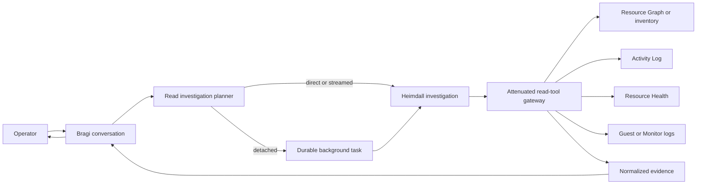

# Azure Read Investigations

This document defines how an operator question becomes a bounded, read-only Azure investigation.
Bragi owns the conversation, Heimdall owns resource-change and external-actor interpretation, and
provider adapters gather evidence without using Thor's execution identity.

> **Scope:** This design covers resource lookup, Activity Log attribution, Resource Health, guest
> log fallback, execution-time prediction, progress delivery, and detached investigation sessions.
> It does not authorize or execute an Azure change.

## Design at a glance

A read investigation stays outside the mutation control loop. A deterministic planner selects
typed read tools, then chooses a direct, streamed, or detached execution mode from measured tool
latency. Every answer cites normalized server-owned evidence or reports that evidence is
unavailable.



## Ownership and boundaries

| Component | Responsibility | Does not do |
|-----------|----------------|-------------|
| Bragi | Classify the operator turn, preserve conversation context, and render progress and the final answer in the operator locale | Query Azure with privileged credentials or decide that a change may execute |
| Heimdall | Own `resource_change_history` and `external_actor` investigation semantics, correlate read evidence, and state uncertainty | Import an Azure SDK, spawn `az`, approve, or mutate a resource |
| Huginn | Continuously ingest and normalize forwarded Azure signals for later correlation | Serve an ad hoc conversational request |
| Saga | Answer from the FDAI audit chain when the question concerns an FDAI action | Treat Azure Activity Log as FDAI audit evidence without correlation |
| Thor | Report existing `ActionRun` status and execute an approved typed action | Run inventory, Activity Log, Resource Health, or guest-log reads |
| Task worker | Run one isolated, depth-one, attenuated read investigation | Join the Pantheon, publish a Pantheon object, or inherit execution authority |

An operator question is not published as `object.event`. That topic enters detection, judgment,
risk, and execution processing. A detached investigation persists its task before an optional wake
signal is emitted. PostgreSQL remains the source of truth; a wake signal is only a delivery hint.

## Existing implementation baseline

| Capability | Current state | Required work |
|------------|---------------|---------------|
| Bragi responder registration and Heimdall question domains | Implemented | Extend deterministic routing for actor, shutdown, and resource-history wording in English and Korean |
| Azure inventory and VM state | Implemented | Add exact resource resolution and ambiguity handling for bare resource names |
| Direct Activity Log recovery adapter | Implemented for inventory continuity | Add an on-demand read projection that retains operation, caller, time, status, and correlation fields |
| Typed Azure CLI read broker | Implemented for resource, group, VM list, and VM state commands | Add only registered ARG and Activity Log plans if REST transport cannot satisfy the query |
| Task-worker capability attenuation | Implemented | Register Azure read tools in a server-owned `background.read-only` profile |
| Durable task state, lease, timeout, cancellation, and progress SSE | Implemented | Replace the narrator-only executor with an attenuated tool-capable investigation executor |
| Command duration and task start/finish timestamps | Partially implemented | Add provider-neutral tool receipts, durable latency profiles, and an ETA policy |
| Completion handoff | Conversation append is implemented | Complete durable reply-ledger enqueue for origin-channel delivery after process loss |

## Investigation request and plan

The planner turns an eligible question into an immutable `ReadInvestigationRequest`. It carries the
requester, conversation and correlation references, intent, resource selector, lookback, requested
evidence, budget, and idempotency key. Deterministic classification runs before any model sees a
tool description.

The initial intent vocabulary is:

- **`resource_state`**: Resolve a resource and return its current observed state.
- **`change_attribution`**: Identify the control-plane actor behind a bounded resource operation.
- **`resource_change_history`**: Return recent allowlisted changes for one resolved resource.
- **`platform_health`**: Explain Azure platform availability evidence.
- **`guest_shutdown`**: Search configured guest logs for an operating-system shutdown event.

The planner resolves a resource name before querying history. Zero matches produce `not_found`.
Multiple matches produce `ambiguous` with bounded candidates and no further cloud query. A single
match produces an exact provider resource reference that later tools cannot widen.

## Read-tool catalog

Each tool has Reader RBAC, `side_effect_class=read`, a server-owned query template, a fixed timeout,
an output cap, and an evidence schema.

| Tool | Primary provider | Purpose |
|------|------------------|---------|
| `resolve_resource` | Resource Graph or promoted inventory | Resolve name, type, resource group, and configured scope to one resource reference |
| `get_resource_state` | Resource provider instance view | Confirm current resource state and observation time |
| `query_resource_activity` | Azure Activity Log REST or configured `AzureActivity` projection | Return bounded control-plane operations and caller attribution |
| `query_resource_health` | Resource Health or ARG `HealthResources` | Distinguish platform availability events from customer operations |
| `query_guest_shutdown_events` | Log Analytics guest-log projection | Find operating-system shutdown evidence when diagnostic collection is configured |

REST or SDK adapters are the production default. Azure CLI is an allowlisted fallback behind the
existing typed command broker. The model never creates argv, KQL, an ARG query, a subscription id,
or an ARM URL. It selects a registered tool and bounded enum arguments only.

## Evidence contract

Providers return a cloud-provider-neutral envelope. Raw Azure responses and raw CLI output do not
enter narrator context.

```json
{
  "status": "matched",
  "authority": "azure.activity_log",
  "resource_ref": "opaque-resource-ref",
  "observed_at": "2026-07-22T00:00:00Z",
  "freshness": "live",
  "truncated": false,
  "records": [
    {
      "operation_kind": "deallocate",
      "status": "succeeded",
      "actor_ref": "opaque-principal-ref",
      "actor_kind": "user",
      "occurred_at": "2026-07-21T23:58:00Z",
      "correlation_ref": "opaque-correlation-ref"
    }
  ],
  "evidence_refs": ["azure-activity:sha256:..."]
}
```

`status` is one of `matched`, `ambiguous`, `none`, or `unavailable`. A server projection may
render an authorized caller label, but durable records and metric labels retain opaque references.
Evidence text is untrusted data and cannot grant approval or execution eligibility.

## Source selection and fallbacks

The investigation separates four questions that look similar to an operator:

1. **Current state:** Resource Graph or inventory resolves the VM; instance view confirms
   `running`, `stopped`, or `deallocated`.
2. **Control-plane actor:** Activity Log identifies a successful Stop, Power Off, or Deallocate
   operation and its caller when that record exists.
3. **Guest shutdown:** A `stopped` VM without a control-plane operation requires Windows Event Log
   or Linux syslog evidence. Missing guest diagnostics produces `unavailable`, not a guessed actor.
4. **Platform event:** Resource Health provides host, maintenance, or platform availability
   context. It does not prove a user initiated the event.

An Activity Log miss does not prove that no one stopped a VM. Retention, ingestion delay, guest
shutdown, and platform failure remain explicit caveats. Heimdall states the strongest supported
conclusion and lists missing evidence.

## Execution modes

`InvestigationExecutionPolicy` selects one mode from a measured plan estimate. Thresholds are
configuration, not literals embedded in routing code.

| Mode | Suggested initial p95 band | Behavior |
|------|----------------------------|----------|
| `direct` | Up to 4 seconds | Execute in the current request and return one answer |
| `streamed` | More than 4 and up to 15 seconds | Keep the chat stream open and emit bounded semantic progress |
| `detached` | More than 15 seconds, multi-source fan-out, or explicit deep investigation | Create a durable background task and return its task reference immediately |

These values are starting configuration, not performance claims. Deployment owners replace them
after measuring the same scenario set in the target environment. Detached work reuses the existing
`queued -> claimed -> running -> terminal` state machine. Its worker receives no parent transcript,
screen state, mutable memory, shell, executor identity, or mutation tool.

## Latency measurement and estimates

Every provider call emits a `ToolCallReceipt` with tool id, transport, operation class, status,
queue and execution duration, result count, truncation, cache status, recorded time, and trace
reference. Metric dimensions exclude resource ids, principal ids, prompts, and query text.

A durable latency profile keeps bounded recent samples per
`(tool_id, transport, operation_class)` and exposes sample count, failure rate, p50, and p95. For
sequential steps, estimated p95 is the sum of step p95 values. For parallel fan-out, it is the
maximum branch p95. Detached work adds queue delay. Before the minimum sample count is met, the
planner uses a catalog `latency_class` and reports a broad range instead of false precision.

The estimate selects execution mode before cloud I/O begins. If elapsed time crosses the announced
upper range, Bragi emits one delayed milestone and continues inside the fixed wall-clock budget.
The estimate never extends a timeout or increases a tool budget.

## Progress and completion delivery

Progress describes operator-meaningful milestones, not commands or raw provider output:

```text
investigation.planned
resource.resolving
resource.resolved
activity.querying
activity.completed
guest-log.unavailable
evidence.correlating
investigation.completed
```

The existing reporter coalesces events and caps their count. SSE returns stored progress,
heartbeats, and one terminal event. Detached completion commits the immutable result first, then
appends an untrusted assistant turn and enqueues it through the durable reply ledger. Delivery
failure cannot rerun the investigation or rewrite its result.

Bragi communicates an estimate only when it changes the operator experience. Example:

> I will check the current VM state and its recent Azure Activity Log. Based on measured provider
> latency, this usually takes about 10 to 20 seconds.

## Identity, authorization, and audit

Azure reads use a dedicated `azure.reader` workload identity scoped to configured resource groups.
The console, Heimdall, task workers, and ChatOps never receive Thor's executor identity. Provider
adapters reject a resource outside the resolved scope even if the identity has broader permissions
by mistake.

The current detached-task API uses the Contributor `author-draft-pr` capability. Automatic
read-only investigations should use a separate `start-read-investigation` capability with
per-principal concurrency, daily cost, tool-call, and wall-clock quotas. Deployments decide which
operator roles receive it without conflating read investigation with PR authoring.

Audit records include requester, intent, selected tools, scope digest, task or request id, duration,
terminal status, evidence references, and delivery outcome. They exclude bearer tokens, raw claims,
raw CLI output, prompts, and unredacted caller payloads.

## Failure behavior

- **Ambiguous resource:** Return bounded candidates and request resource group or subscription
  context before any history query.
- **Unauthorized scope:** Report unavailable and record the denied provider operation class.
- **Provider throttling:** Apply bounded retry with jitter inside the original timeout; never widen
  scope or wall-clock budget.
- **Partial evidence:** Return supported facts and name the missing source.
- **Process loss:** Mark an expired running attempt `unknown(process_lost)`; do not replay it
  automatically.
- **Cancellation:** Stop pending provider work, commit `cancelled`, and retain completed evidence
  references already written.
- **Prompt injection in evidence:** Treat provider strings as data and deny output that attempts to
  change tools, scope, authorization, or execution mode.

## Implementation sequence

1. Add provider-neutral resource resolution, activity, health, and guest-log contracts.
2. Add typed tools and normalized evidence projections with deterministic fixtures.
3. Extend Bragi routing and Heimdall composition without importing delivery code into either agent.
4. Implement direct and streamed paths; prove Thor and the mutation bus are untouched.
5. Add `ToolCallReceipt`, durable latency profiles, and configuration-driven execution policy.
6. Replace the narrator-only background executor with an attenuated tool-capable executor.
7. Complete progress rendering and durable origin-channel completion delivery.
8. Run live Azure validation for caller attribution, guest shutdown, Resource Health, throttling,
   and insufficient-retention cases before enabling the capability by default.

## Verification

- English and Korean intent tests cover actor, shutdown, resource history, health, and ambiguity.
- Property tests prove every investigation tool is read-only and attenuation rejects mutation,
  approval, shell, nested-worker, and arbitrary-query capabilities.
- Contract tests prove REST and CLI fallback produce the same bounded evidence envelope.
- Scenario tests prove an investigation never publishes `object.event` and never invokes Thor.
- Latency tests cover cold profiles, minimum samples, sequential and parallel estimates, threshold
  boundaries, delayed milestones, and cross-replica persistence.
- Background tests cover lease contention, cancellation, timeout, process loss, progress caps,
  terminal immutability, and durable reply handoff.
- Live Azure tests verify Activity Log caller attribution and honest guest-log and Resource Health
  fallback without mutating a resource.

## Related docs

| To learn about | Read |
|----------------|------|
| Operator tools and chat tiers | [Operator Console](operator-console.md) |
| Detached investigation lifecycle | [Durable Background Task Sessions](background-task-sessions.md) |
| Isolated tool attenuation | [Bounded Task Workers](../agents/bounded-task-workers.md) |
| Azure inventory boundary | [Cloud Provider Neutrality](../architecture/csp-neutrality.md) |
| Workload identity separation | [Security and Identity](../architecture/security-and-identity.md) |
