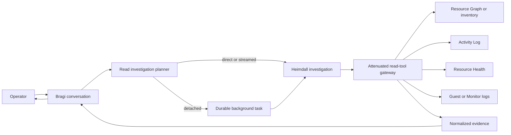

# Azure Read Investigations

This document defines how an operator question becomes a bounded, read-only Azure investigation.
Bragi owns the conversation, Heimdall owns resource-change and external-actor interpretation, and
provider adapters gather evidence without using Thor's execution identity.

> **Scope:** This design covers resource lookup, Activity Log attribution, Resource Health, guest
> log fallback, configured NSG rules, VNet peering topology, execution-time prediction, progress
> delivery, and detached investigation sessions.
> It does not authorize or execute an Azure change.
>
> **Discovery command coverage:** Provider-wide resource discovery, ARG-specialized tables,
> sanitized reproduction commands, and coverage reconciliation are defined in
> [Azure Resource Discovery Command Coverage](azure-resource-discovery-commands.md).

## Design at a glance

A read investigation stays outside the mutation control loop. A deterministic planner selects
typed read tools, then chooses a direct, streamed, or detached execution mode from measured tool
latency. Every answer cites normalized server-owned evidence or reports that evidence is
unavailable.


```mermaid
flowchart LR
    USER[Operator] --> BRAGI[Bragi conversation]
    BRAGI --> PLAN[Read investigation planner]
    PLAN -->|direct or streamed| HEIMDALL[Heimdall investigation]
    PLAN -->|detached| TASK[Durable background task]
    TASK --> HEIMDALL
    HEIMDALL --> GATEWAY[Attenuated read-tool gateway]
    GATEWAY --> ARG[Resource Graph or inventory]
    GATEWAY --> ACTIVITY[Activity Log]
    GATEWAY --> HEALTH[Resource Health]
    GATEWAY --> GUEST[Guest or Monitor logs]
    GATEWAY --> EVIDENCE[Normalized evidence]
    EVIDENCE --> BRAGI
    BRAGI --> USER
```

## Ownership and boundaries

| Component | Responsibility | Does not do |
|-----------|----------------|-------------|
| Bragi | Classify the operator turn, preserve conversation context, and render progress and the final answer in the operator locale | Query Azure with privileged credentials or decide that a change may execute |
| Heimdall | Own `resource_change_history` and `external_actor` investigation semantics, correlate read evidence, and state uncertainty | Import an Azure SDK, spawn `az`, approve, or mutate a resource |
| Huginn | Continuously ingest and normalize forwarded Azure signals for later correlation | Serve an ad hoc conversational request |
| Saga | Answer from the FDAI audit chain when the question concerns an FDAI action | Treat Azure Activity Log as FDAI audit evidence without correlation |
| Thor | Report existing `ActionRun` status and execute an approved typed action | Run inventory, Activity Log, Resource Health, or guest-log reads |
| Task worker | Run one isolated, depth-one, attenuated read investigation | Join the Pantheon, publish a Pantheon object, or inherit execution authority |

An operator question is not published as `object.event`. That topic enters detection, judgment,
risk, and execution processing. A detached investigation persists its task before an optional wake
signal is emitted. PostgreSQL remains the source of truth; a wake signal is only a delivery hint.

## Implementation status

| Capability | Current state | Evidence |
|------------|---------------|----------|
| Bragi and Heimdall routing | Implemented | Deterministic English and Korean actor, shutdown, history, health, and state routing selects Heimdall before generic scoring. |
| Investigation evidence signal | Implemented | A bound read-investigation hook counts as owned evidence for Heimdall's conversational port, so an investigable turn is not composed with the evidence-gap prompt layer even before the local signal window fills. |
| Exact resource resolution | Implemented | `not_found`, bounded `ambiguous`, and one scope-bound exact reference stop history queries until resolution succeeds. |
| Typed intent rendering | Implemented | All seven registered read intents render typed evidence fields and observation time. Adding an enum without a renderer fails exhaustive type checking instead of returning a generic success string. |
| Catalog/runtime binding | Implemented | Local and deployed composition fail before provider I/O unless catalog intent IDs exactly match the runtime enum, every read intent remains owned by Heimdall, and plan IDs are unique. |
| Conversational resource continuity | Implemented | Command Deck retains one server-selected inventory resource across terminal turns. Resource Health history may also retain one complete anomalous-event anchor: resource group, timestamp, and status. Elliptical history and pre-incident follow-ups bypass semantic and public-web planning, then Heimdall revalidates the bounded context and returns matching read evidence directly. |
| Subscription scope identity | Implemented | Current-subscription identity questions read the server-configured subscription name and state from Azure Resource Manager, render only a masked subscription ID, and never call the narrator model. |
| Subscription health sweep | Implemented | Explicit subscription checks, general service-outage questions, and generic degraded or unavailable resource-state questions use the configured reader scope. The inventory language catalog selects Resource Health authority for availability semantics. The provider defaults to the configured resource-group allowlist. An explicit server-owned subscription mode aligns interactive local health with its subscription inventory. Platform-impact reads query active Service Health events and impacted resources, separate outages from maintenance and advisories, and correlate Resource Health causes. Other diagnosis reads can check representative metrics for up to 16 supported resources with concurrency limited to four. |
| Azure evidence adapters | Implemented | REST covers state, Activity Log, Resource Health, guest logs, configured NSG rules, and VNet peering properties. Interactive local can route NSG and peering reads through the registered development operations gateway without receiving its executor identity. The typed CLI fallback covers resource, VM state, and Activity Log through registered plans. |
| Optional Azure MCP reads | Implemented | The official MCP Python SDK starts the pinned Azure MCP Server over stdio, probes its namespace allowlist before traffic, uses it for VM state, Activity Log, and Resource Health, and immediately falls back to typed REST when unavailable or rejected by its circuit breaker. |
| Read-tool attenuation | Implemented | `background.read-only` contains exactly seven Reader tools and denies mutation, approval, shell, arbitrary-query, and nested-worker capabilities. |
| Execution modes and progress | Implemented | Durable p50/p95 profiles select direct, streamed, or detached mode before cloud I/O. Exact resolution is a barrier, independent evidence tools run under a bounded parallel limit, streamed mode emits bounded progress and SSE comment heartbeats, stream close cancels provider work, and the terminal event occurs once. |
| Interactive policy parity | Implemented | Local and deployed conversation composition use the same explicit direct, streamed, and multi-source thresholds. Adapter latency can differ, but the execution-mode policy does not drift by environment. |
| Direct and streamed replay | Implemented | An owner-scoped PostgreSQL run ledger claims each canonical request, renews its lease, bounds reclaim attempts, retains terminal usage, and replays completed results without another provider call. Command Deck direct reads use the same executor. The interactive local PostgreSQL profile supplies the same run store and does not substitute an in-memory replay path. |
| Detached execution and quotas | Implemented | The typed executor receives no narrator history, screen state, event bus, Thor, or executor identity. Per-principal concurrency, cost, wall-clock, and tool-call quotas are enforced at durable creation. |
| Completion handoff | Implemented | The terminal result and pending completion outbox commit atomically. Bounded retries replay idempotent conversation and reply-ledger handoff without rerunning the investigation. |
| Live Azure scenario evidence | Partially validated | Caller attribution, Resource Health, unauthorized scope, and ambiguous names passed read-only live validation. Guest-event matching and an actual provider `429` remain release evidence gaps. |

## Investigation request and plan

The planner turns an eligible question into an immutable `ReadInvestigationRequest`. It carries the
requester, conversation and correlation references, intent, resource selector, lookback, requested
evidence, budget, and idempotency key. Deterministic classification runs before any model sees a
tool description.

The schema-validated `investigation-intents.yaml` catalog owns the language-to-contract boundary.
Each entry declares a work class, accountable Pantheon agent, registered plan ID, selector kind,
answer contract, reviewed English and Korean match terms, evidence authorities and facets, and a
numeric freshness budget. The catalog cannot contain executable text or grant tool authority. An
unknown owner, work class, selector, answer contract, field, or response-mode order blocks catalog
loading before provider I/O.

The first catalog revision describes the seven read intents below. Every entry is owned by
Heimdall, uses `work_class: read`, and points to a registered plan. Bragi can classify and route a
turn, but it cannot replace the catalog owner, evidence requirements, or freshness budget.

The initial intent vocabulary is:

- **`resource_state`**: Resolve a resource and return its current observed state.
- **`change_attribution`**: Identify the control-plane actor behind a bounded resource operation.
- **`resource_change_history`**: Return recent allowlisted changes for one resolved resource.
- **`platform_health`**: Explain Azure platform availability evidence.
- **`guest_shutdown`**: Search configured guest logs for an operating-system shutdown event.
- **`network_security`**: Return configured NSG rules and their subnet or NIC associations.
- **`network_peering`**: Return one VNet's peering state, sync level, address spaces, and traffic or
  gateway flags.

The planner resolves a resource name before querying history. Zero matches produce `not_found`.
Multiple matches produce `ambiguous` with bounded candidates and no further cloud query. A single
match produces an exact provider resource reference that later tools cannot widen.

When an inventory answer selects one resource, the terminal response can include its bounded name,
type, and inventory evidence reference. Command Deck echoes that context on a later question such
as "Since when has it been stopped?" The echoed value is a selector hint, not evidence authority:
the server validates it and resolves the exact resource again inside its configured subscription
and resource-group scope. A missing, ambiguous, or mismatched resolution cannot produce a grounded
history answer. The contextual turn starts only the Heimdall read branch; inventory, operational,
public-web, and narrator fallbacks cannot replace its result. Matching `none`, `unavailable`, and
`ambiguous` Heimdall results remain terminal unverified answers with their scope or selection
limitation. Resource history and attribution use a bounded 30-day lookback. For a stopped resource,
Heimdall reports the latest successful Stop, Power Off, or Deallocate Activity Log event and states
that the current stopped state is confirmed from at least that timestamp.
Guest shutdown follow-ups reuse the same validated resource selector and exclusive Heimdall branch.
The deterministic intent accepts English and Korean subject-first, reverse-order, and colloquial
forms; it never asks the narrator to recover a missing resource name from conversation prose.
A successful detached handoff returns the bounded task reference as a terminal unverified queued
answer. Observed execution marks the handoff complete and reports `status=queued`; it does not
mislabel accepted durable work as unavailable or send it through the narrator.
When no detached submitter is configured, `handoff_required` remains a terminal unverified
capability limitation with no task reference and no narrator fallback.
Read-availability follow-ups also reuse the validated selector and exclusive Heimdall branch. The
typed result distinguishes a readable control-plane state, no observed state record, and unavailable
scope or reader/provider authority. It never infers authorization denial from an empty result or
asks the narrator to choose between scope and permission causes.

When Resource Health history selects one resource with a degraded, unavailable, or unknown
availability event, the terminal context may additionally carry that event's resource group,
timestamp, and status. The three fields are accepted only as an all-or-none bounded incident
anchor. A pre-incident follow-up reads at most 24 hours and 200 Activity Log events from the
server-configured scope, keeps successful deployment, write, update, and configuration operations
from the same resource group before the anchor, and reports the count in the immediate preceding
hour. If that count is zero, Heimdall may show the nearest earlier matching changes without
claiming causation. Missing provenance, provider failure, or malformed context returns
`unavailable`; a follow-up with no complete anomalous-event anchor returns a terminal unverified
evidence gap without calling Activity Log or the narrator. Truncation is explicit, and at most 20
matching events enter the answer. Every anchored answer renders the analysis-window start, bounded
interval, and incident anchor as explicit timeline landmarks.

Collection questions use a separate typed activity query. The server fixes the Azure subscription
and resource-group allowlist, caps the lookback at 30 days and the returned events at 200, and
projects only event time, normalized operation and status, resource name, resource type, and
resource group. Caller identity and raw resource IDs do not enter collection answers. The provider
may join a current inventory resource to recover its neutral type, but a deleted resource remains a
bounded ARM type instead of disappearing or being relabeled. A model-proposed activity predicate
has no authority until the deterministic inventory-query verifier accepts it.

Every accepted current or activity collection compiles to one immutable `InventoryQuery` with a
source, result kind, at most eight predicates, and an optional bounded lookback. Allowlisted fields
are `resource_type`, `status`, `name`, `resource_group`, `location`, `operation`, and
`event_status`; operators are `eq`, `ne`, `in`, `contains`, `exists`, and `missing`. The
deterministic compiler matches facets actually observed in the current provider, so a new status
does not require another routing expression. Unmatched modifiers abstain instead of widening to all
resources. A semantic planner can propose the same strict shape only after deterministic
abstention, and the verifier rechecks the complete query before I/O. Imperative changes remain
action drafts and cannot enter this read path.
Unfiltered managed-scope list wording is catalog data in both English and Korean. It compiles to a
fresh subscription-scoped `list` query before semantic planning, even when the operator requests
only names, types, status, evidence, or one representative resource.

State entries in the inventory language catalog also declare their required evidence authority.
Ordinary current operational states use promoted inventory. Questions that include degraded or
unavailable availability semantics use the existing subscription health sweep, which joins
`Resources` with `HealthResources` under the same server-owned scope. A concrete resource-family
filter remains attached to that health query, and the renderer accepts only findings whose
canonical or provider type matches the requested family. The request's catalog-compiled state
groups travel with the typed evidence envelope so the deterministic renderer can preserve
zero-result groups without reinterpreting prompt text.
When the catalog can compile a complete inventory query, a generic search verb such as `find` or
`찾아줘` does not select public web evidence. Public web takes precedence only when the operator
names that medium or another explicit web context.
Two or more requested state groups automatically produce a status-grouped answer. When a broad
group overlaps a more specific requested group, the specific group owns that provider value so one
resource is not repeated across sections.
The compiler may retain observed provider-specific state values, but every disjoint requested group
must remain represented in the executable predicate. If observation-based narrowing would remove a
group entirely, the compiler adds that group's canonical catalog values before evidence retrieval.
Korean state terms and grammatical suffixes remain catalog data, including colloquial nominal and
adnominal forms, so the deterministic route does not depend on prompt-specific parser branches.
An active-view inventory request requires one bounded resource group selected on the Architecture
screen. A missing, malformed, or non-group selection returns a deterministic unavailable result
without querying inventory, starting another evidence branch, or calling the narrator; the operator
must select or name the group.
AKS questions that name nodes require Kubernetes workload evidence. Cluster inventory can ground a
stopped or otherwise unhealthy cluster finding, but missing node readiness remains an explicit
coverage gap and cannot produce a healthy-node conclusion.
A positive state-filtered cluster finding can complete its evidence check while the answer retains
the node coverage gap. A workload-only question without a positive state-filtered finding remains
unverified.

## Read-tool catalog

Each tool has Reader RBAC, `side_effect_class=read`, a server-owned query template, a fixed timeout,
an output cap, and an evidence schema.

| Tool | Primary provider | Purpose |
|------|------------------|---------|
| `resolve_resource` | Resource Graph or promoted inventory | Resolve name, type, resource group, and configured scope to one resource reference |
| `get_resource_state` | Resource provider instance view | Confirm current resource state and observation time |
| `query_resource_activity` | Azure Activity Log REST or configured `AzureActivity` projection | Return bounded control-plane operations and caller attribution |
| `query_resource_health` | Resource Health or ARG `HealthResources` | Distinguish platform availability events from customer operations |
| `query_guest_shutdown_events` | Log Analytics guest-log projection | Find operating-system shutdown evidence when diagnostic collection is configured |
| `query_network_security` | Network resource provider | Return bounded custom and default NSG rule fields and associations |
| `query_network_peerings` | Network resource provider | Return bounded VNet peering state, synchronization, address-space, and routing flags |

REST or SDK adapters are the production default. Azure CLI is an allowlisted fallback behind the
existing typed command broker. The model never creates argv, KQL, an ARG query, a subscription id,
or an ARM URL. It selects a registered tool and bounded enum arguments only.

### Optional Azure MCP provider

Azure MCP can provide an additional read transport for registered tools. It remains optional:
Resource Graph and typed REST providers stay authoritative and continue serving requests when MCP
is absent, unreachable, unauthorized, or missing an allowlisted tool.

The Operator API performs one bounded MCP handshake and `tools/list` probe before accepting traffic.
The initial deadline is configurable and capped at 10 seconds. Probe failure records the capability
as unavailable but does not block the Operator API. While unavailable, a request does not contact the
MCP server and immediately uses the existing provider. A background health monitor retries the
non-invoking probe. Successful discovery restores routing without a process restart.

Every MCP call passes through a circuit breaker. Repeated transport or protocol failures open the
circuit, and later requests skip MCP without waiting for another provider timeout. After the
cooldown, one half-open probe can restore the circuit. The server exposes only an explicit read-tool
allowlist. Discovery never grants authority to an unregistered Azure MCP tool, and tool output is
normalized into the existing `ReadEvidenceEnvelope` before it reaches Bragi.

An MCP read is not an ontology `Action`. It remains a `ReadToolId` attempt with a
`ToolCallReceipt` and normalized evidence. Azure mutations continue to use their existing
`ops.*` or `remediate.*` ActionType, RiskGate, human approval, Thor execution, rollback, and Saga
audit path. The pinned Azure MCP Server `2.0.5` does not expose VM start or deallocate commands,
so `ops.start-vm` and `ops.deallocate-vm` remain on the registered `direct_api` operations gateway.
FDAI does not infer a mutation command from a read or update tool.

The broker applies the registered plan's timeout and output cap. Complete JSON is returned only as
ephemeral output to the typed adapter; the command receipt retains a bounded 4 KB diagnostic tail,
and the broker does not cache the full output after return. Raw CLI output is not persisted or
passed to narrator context. Concurrent receipt-based executions are serialized so one
idempotency key invokes the registered command at most once per broker lifetime.
The plan timeout is one cumulative deadline shared by managed-identity login, subscription
verification, and command execution; setup work cannot multiply the announced command budget.

When `FDAI_DEV_OPERATIONS_GATEWAY_URL` and its separately emitted
`FDAI_DEV_OPERATIONS_GATEWAY_AUDIENCE` are both configured, interactive local wraps the REST
transport with a read-only gateway transport. Exact resource resolution still supplies the
subscription and resource-group-bound reference. The wrapper exposes `azure.network.nsg.read`,
`azure.network.peering.read`, and `azure.private.http.probe`. Active application-to-database
reachability is available only when `FDAI_NETWORK_REACHABILITY_PROBE_ALIAS` names an alias already
registered in the gateway's `FDAI_DEV_GATEWAY_PRIVATE_PROBES_JSON` with
`result_contract: application_database_dependency`. That authenticated application-owned endpoint
must return bounded JSON containing `dependency: database` and a Boolean `reachable`; a generic
HTTP status probe is not application-to-database evidence. The browser and model cannot supply a
URL, host, subscription, resource group, or alias. The wrapper rejects widened resource references
before HTTP, streams responses under a fixed byte cap, and reports gateway failure as unavailable
instead of silently falling back to direct ARM. NSG and peering configuration alone never proves
end-to-end reachability.

### Subscription scope identity

The Command Deck tool `query_subscription_scope` handles questions such as "What is the current
Azure subscription?" before narrator-model classification. It reads the configured subscription's
display name and state from Azure Resource Manager with the same Reader identity used by the health
sweep. Browser input cannot select another subscription or widen the configured scope.

The deterministic terminal answer includes the display name, state, observation time, and a
masked subscription ID that retains only four leading and four trailing characters. Provider
failure produces an unavailable answer and does not fall back to generated subscription details.

### Subscription health sweep

The Command Deck tool `query_subscription_health` handles an explicit subscription check, a
general service-outage question, or a generic resource collection question whose catalog semantics
require Resource Health. Deterministic routing selects this read before narrator-model
classification. Scope comes only from the server's subscription and resource-group allowlist.
Browser input cannot widen it. The provider performs these bounded steps:

The provider has two immutable composition modes. `resource_groups` is the default and applies the
configured allowlist to both `Resources` and `HealthResources`. `subscription` removes that query
filter but remains fixed to the server-configured subscription. Interactive local selects
`subscription` because its authoritative inventory is already subscription-wide. Deployment keeps
`resource_groups` unless its composition root explicitly selects subscription mode and binds an
appropriately scoped reader identity. Neither the browser nor the narrator can select the mode.

1. Query Resource Graph inventory and `HealthResources` in parallel.
2. If ARG returns no health rows, list current Resource Health availability statuses for the
  configured subscription or each allowed resource group through the official ARM endpoint. A
  failed scope remains explicitly unavailable.
3. For resource-health history intent, query `HealthResources` availability statuses and resource
  annotations under the catalog-parsed lookback, capped at 24 hours. Merge them by occurrence time
  and classify each event as `customer-initiated`, `status-only`, or `platform-initiated`.
4. For explicit platform-impact intent, query active `ServiceHealthResources` events and their
  bounded impacted-resource rows. Separate `ServiceIssue`, `PlannedMaintenance`, and
  `HealthAdvisory` counts before rendering.
5. For diagnosis intent that isn't platform impact, select up to 16 supported resources for
  representative Azure Monitor metrics.
6. Query at most four metrics concurrently and compare them with server-owned thresholds.
7. Return Service Health events, Resource Health causes and history, failed provisioning, and metric
  candidates with unsupported, unavailable, and truncated counts.

The initial metric map covers VM CPU, AKS node CPU, Storage availability, PostgreSQL/MySQL/SQL CPU,
and Application Gateway healthy-host count. Unsupported resource types remain counted and visible.
A Service Health, Resource Health, or metric failure produces `partial`, never a healthy
conclusion. Service Health rows expose bounded event type, title, level, start time, and impacted
resource projections without raw event or resource IDs. A
customer-initiated Resource Health state is explained as user- or automation-initiated rather than
an Azure platform incident, but the actor remains unknown until Activity Log evidence is collected.
Historical reads don't fall back to the current ARM availability endpoint. They preserve the exact
lookback, chronological order, three-way cause counts, partial source failures, and truncation, so a
current status cannot be presented as a historical event.
Health-coverage questions query Resource Health, Service Health, and representative metrics under
the same server scope. They report unavailable and unsupported counts separately, and don't label a
provider-unavailable result as authorization or scope unless the provider proves that cause.
Broad CPU spike questions also use this server-owned metric path before semantic or screen
interpretation. Unsupported or unavailable metric coverage remains visible and cannot become a
generic CPU definition or a claim that no spike occurred.
Broad memory-pressure questions follow the same path. The typed query records the diagnostic metric
family, and rendering excludes observations from other metric families while retaining the sweep's
unavailable, unsupported, and truncation limits.
Before/after metric comparisons require one verified incident anchor and two separately bounded
windows. Without that anchor, the deterministic tool returns unavailable without running a
point-in-time metric sweep or borrowing repository, screen, or incident-roster evidence.
Error-rate/change correlation requires an error-rate metric window and bounded deployment or
configuration activity under one shared scope. Until a provider supplies that join, the
deterministic route returns unavailable and never verifies a current-screen limitation as a
correlation result.
Pod restart and throttling diagnosis requires an exact pod name or a server-validated selected pod
context. A context-free reference such as "this pod" returns a clarification without querying the
subscription sweep. Capacity sufficiency requires a provider that joins observed load trends with
resource limits; until that provider is configured, the route returns unavailable without
substituting point-in-time health or current-screen evidence.
Each terminal tool answer can return a bounded freshness context with source, observation time,
query-window lower bound, status, and truncation. The Console validates and retains only the latest
assistant-issued context. Oldest or stale-evidence follow-ups render it deterministically and state
that the window boundary may differ from the oldest returned record. Without a verified prior
freshness receipt, the follow-up returns a terminal unavailable result and doesn't substitute
current-screen or narrator output.
For an explicit status collection, the terminal answer renders every requested catalog state in
request order, including a grounded empty group, and lists only findings whose normalized state
belongs to that group. A concrete family query prefilters `Resources` and `HealthResources` by the
catalog's provider type, Azure kind tokens, and requested availability states. Kind tokens keep
semantic types such as Web Apps and Function Apps separate when they share one ARM type. It runs
representative metrics only when the question also contains diagnosis semantics such as CPU,
memory, or throughput. If Resource Health omits its display name, the provider derives the bounded
resource name, provider type, and resource group from the scope-validated target ID. The raw target
ID does not enter the answer or narrator context.
The resource projection also retains bounded `state`, `status`, and `resourceState` fields. A value
becomes a finding only when it belongs to a requested catalog state, so a not-running collection can
combine resource state with Resource Health without treating every observed state as anomalous.
Metric windows use RFC 3339 UTC `Z` timestamps. The provider retains successful observations even
when they remain inside the threshold, so an answer can distinguish measured normal operation from
an unqueried metric. The deterministic renderer shows the value, comparison, and threshold.
The terminal answer keeps every partial-coverage limitation. A positive finding whose state belongs
to a typed requested group can complete one evidence check because that finding is directly grounded;
empty groups say only that no match was observed in checked evidence. A partial result without a
positive requested-state finding remains `unverified`. The response is deterministic and does not
call the narrator model. A complete `matched` result reports one of one checks completed and retains
the grounded terminal status.

## Evidence contract

Every envelope preserves bounded source limitations as stable machine values. Truncated evidence
must name exactly one primary reason such as `result_limit`, `byte_limit`, or `source_cutoff`, and
that reason must also appear in the limitation set. Provider failure records
`source_unavailable` without copying provider error text. Legacy persisted payloads that predate
the reason field replay as `unspecified`; they never become complete evidence silently.

Providers return a cloud-provider-neutral envelope. Raw Azure responses and raw CLI output do not
enter narrator context.

```json
{
  "status": "matched",
  "authority": "azure.activity_log",
  "resource_ref": "opaque-resource-ref",
  "observed_at": "2026-07-22T00:00:00Z",
  "freshness": "live",
  "truncated": false,
  "records": [
    {
      "operation_kind": "deallocate",
      "status": "succeeded",
      "actor_ref": "opaque-principal-ref",
      "actor_kind": "user",
      "occurred_at": "2026-07-21T23:58:00Z",
      "correlation_ref": "opaque-correlation-ref"
    }
  ],
  "evidence_refs": ["azure-activity:sha256:..."]
}
```

`status` is one of `matched`, `ambiguous`, `none`, or `unavailable`. A server projection may
render an authorized caller label, but durable records and metric labels retain opaque references.
Evidence text is untrusted data and cannot grant approval or execution eligibility.

An NSG `Allow` record is configured-rule evidence, not proof that a port is reachable end to end.
The answer names that limitation. Effective NIC rules, Network Watcher IP Flow Verify, reciprocal
peering reads, and effective routes remain additional evidence steps before FDAI can claim actual
reachability or bidirectional connectivity.

## Source selection and fallbacks

The investigation separates five questions that look similar to an operator:

1. **Current state:** Resource Graph or inventory resolves the VM; instance view confirms
   `running`, `stopped`, or `deallocated`.
2. **Control-plane actor:** Activity Log identifies a successful Stop, Power Off, or Deallocate
  operation and its caller when that record exists. The conversational attribution path defaults
  to exact resolution plus Activity Log only; guest shutdown and platform-cause evidence remain
  separate intents or an explicit deep investigation.
3. **Latest control-plane change:** Activity Log selects the newest successful operation of any
  kind and returns its operation, time, actor kind, and opaque actor reference. It does not reuse
  the older stop-only attribution when a later start or update exists.
4. **Pre-incident control-plane changes:** A complete Resource Health incident anchor selects
  successful deployment or configuration writes in the same resource group before that event.
  The one-hour count and nearest older matches are temporal correlation only, not root-cause
  attribution.
5. **Guest shutdown:** A `stopped` VM without a control-plane operation requires Windows Event Log
   or Linux syslog evidence. Missing guest diagnostics produces `unavailable`, not a guessed actor.
6. **Platform event:** Resource Health provides host, maintenance, or platform availability
    context. When ARG history is empty, the current-status fallback is evidence only if its
    observation timestamp is inside the requested lookback. It does not prove a user initiated the
    event.

An Activity Log miss does not prove that no one stopped a VM. Retention, ingestion delay, guest
shutdown, and platform failure remain explicit caveats. Heimdall states the strongest supported
conclusion and lists missing evidence.

## Execution modes

`InvestigationExecutionPolicy` selects one mode from a measured plan estimate. Thresholds are
configuration, not literals embedded in routing code.

| Mode | Suggested initial p95 band | Behavior |
|------|----------------------------|----------|
| `direct` | Up to 4 seconds | Execute in the current request and return one answer |
| `streamed` | More than 4 and up to 15 seconds | Keep the chat stream open and emit bounded semantic progress |
| `detached` | More than 15 seconds, multi-source fan-out, or explicit deep investigation | Create a durable background task and return its task reference immediately |

These values are starting configuration, not performance claims. Deployment owners replace them
after measuring the same scenario set in the target environment. Detached work reuses the existing
`queued -> claimed -> running -> terminal` state machine. Its worker receives no parent transcript,
screen state, mutable memory, shell, executor identity, or mutation tool.

Direct and streamed requests use a separate owner-scoped run ledger keyed by the authenticated
principal and idempotency key. The ledger stores a digest of the canonical request projection,
including selector, lookback, evidence, every budget field, and the explicit-deep flag. A matching
completed request replays its immutable result. An active request returns a bounded retry interval,
and a failed or expired request can reclaim its key up to three total attempts. Leases renew only
inside the original wall-clock ceiling, and terminal rows are removed only after retention expires.
The Command Deck adapter uses this same direct executor instead of calling the provider service
around the ledger.
The conversational responder executes both direct and streamed plans in this bounded progress path;
only a detached selection returns a durable-task handoff. Its initial streamed ceiling is 20
seconds so a cold exact Activity Log attribution estimate can complete in the open chat stream;
generic read-investigation routes retain the 15-second initial ceiling.

Detached creation uses the same canonical request digest in its context binding. Reusing a key
with a different budget or other request field therefore returns a conflict instead of replaying a
task created under different limits.

## Latency measurement and estimates

Every provider call emits a `ToolCallReceipt` with tool id, transport, operation class, status,
queue and execution duration, result count, truncation, cache status, recorded time, and trace
reference. A receipt can also carry `cost_microusd` when the adapter has an authoritative measured
cost. Run usage always records the reserved request budget. It records a measured total only when
every receipt has an authoritative cost; otherwise the measured value stays unavailable instead of
being reported as zero. Metric dimensions exclude resource ids, principal ids, prompts, and query
text.

A durable latency profile keeps bounded recent samples per
`(tool_id, transport, operation_class)` and exposes sample count, failure rate, p50, and p95. The
executor resolves the resource first, then queries independent evidence sources under a configured
parallel limit of at most four. Plan estimates add the resolution p95 to the maximum evidence-branch
p95. Detached work adds queue delay. Before the minimum sample count is met, the planner uses a
catalog `latency_class` and reports a broad range instead of false precision. Evidence and receipts
retain plan order even when provider calls complete in a different order.

The estimate selects execution mode before cloud I/O begins. If elapsed time crosses the announced
upper range, Bragi emits one delayed milestone and continues inside the fixed wall-clock budget.
The estimate never extends a timeout or increases a tool budget.

## Progress and completion delivery

Progress describes operator-meaningful milestones, not raw provider commands or output:

```text
investigation.planned
resource.resolving
resource.resolved
activity.querying
activity.completed
guest-log.unavailable
evidence.correlating
investigation.completed
```

Before the first provider read, Bragi emits a visible handoff to Heimdall. After terminal evidence
is normalized, an optional observed-execution activity shows the canonical FDAI read operation,
with `input_kind=query`, redacted resource and query values, and a safe status/count summary. It
does not carry a shell exit code. It never exposes raw
CLI argv, raw Azure payloads, credentials, subscription ids, resource ids, or provider errors.
Web, Slack, and Teams render the same ordered handoff and execution evidence; Bragi renders the
final answer. Progress detail and milestone text use an opaque resource placeholder; only the
authorized terminal answer can name a resource from normalized evidence.

The existing reporter coalesces events and caps their count. The direct Command Deck stream emits
`activity` events as tools start and finish, plus bounded `milestone` messages when resource
resolution and evidence collection materially change the operator experience. Activity follows
actual completion order while the terminal evidence remains deterministic in plan order. While a
streamed provider call is idle, the route emits the standards-compliant SSE comment frame
`: heartbeat` followed by a blank line. The heartbeat keeps the connection active without
inventing a progress event. The stream emits one terminal event after the provider task succeeds
or fails; failure terminals contain only a bounded reason and never raw provider error text.
Closing a streamed response cancels and awaits its in-flight investigation, so a disconnected
client cannot leave provider reads running without a consumer. Detached completion commits the
immutable result first, then appends an untrusted assistant turn and enqueues it through the
durable background completion outbox and reply ledger. Delivery failure cannot rerun the
investigation or rewrite its result.

Bragi communicates an estimate only when it changes the operator experience. Example:

> I will check the current VM state and its recent Azure Activity Log. Based on measured provider
> latency, this usually takes about 10 to 20 seconds.

## Identity, authorization, and audit

Azure reads use a dedicated `azure.reader` workload identity scoped to configured resource groups.
The console, Heimdall, task workers, and ChatOps never receive Thor's executor identity. Provider
adapters reject a resource outside the resolved scope even if the identity has broader permissions
by mistake.

Production registers the routes only when `FDAI_AZURE_READER_SUBSCRIPTION_ID`,
`FDAI_AZURE_READER_CLIENT_ID`, and a non-empty comma-separated
`FDAI_AZURE_READER_RESOURCE_GROUPS` allowlist are present. `FDAI_MONITOR_WORKSPACE_ID` is optional;
without it, guest shutdown evidence reports `unavailable` while other sources remain usable. When
the reader binding is enabled, startup probes the run-ledger table before accepting traffic and
fails immediately if the required migration is missing.

The deployed Operator API supplies those three reader settings from its dedicated Operator API managed
identity and the resource group on which that identity has Reader. Azure MCP is enabled by default
when this reader binding exists. `FDAI_AZURE_MCP_ENABLED=false` disables it without disabling the
REST path. When the setting is unset and the optional Azure MCP SDK isn't installed, composition
keeps the REST path instead of blocking startup. An explicit `true` requires the optional dependency
and fails fast when it is missing. The stdio child receives only the Azure identity endpoint fields, Azure client and
subscription selection, TLS and process-path fields, and telemetry preference. Database URLs,
webhooks, and other application secrets are not copied into the child environment.

The bounded controls are `FDAI_AZURE_MCP_STARTUP_TIMEOUT_SECONDS`,
`FDAI_AZURE_MCP_CALL_TIMEOUT_SECONDS`, `FDAI_AZURE_MCP_HEALTH_INTERVAL_SECONDS`, and
`FDAI_AZURE_MCP_RESET_TIMEOUT_SECONDS`. `FDAI_AZURE_MCP_COMMAND` accepts one executable name, not
a path or arguments. The command arguments remain server-owned as `server start`.

The pinned Azure MCP package contains a glibc-linked .NET executable and does not publish a musl
wheel or source distribution. The runtime image therefore uses digest-pinned Python Debian slim,
installs ICU, and supplies writable nonroot locations for .NET bundle extraction and user cache.
Container verification builds the image and runs `azmcp tools list` as UID 65532. A base-image
change is incomplete until that smoke test passes without extraction, globalization, or cache
warnings.

Interactive local uses the same server-owned scope with the current Azure CLI token. The local
runtime environment generator supplies the applied subscription and resource group after checking
that the active CLI subscription matches Terraform. It never gives that credential to Thor.

The detached-task API uses the separate `start-read-investigation` capability. Contributor,
Approver, and Owner roles receive it; Reader and Break-Glass do not. Per-principal concurrency,
daily reserved or measured cost, tool-call, and wall-clock quotas are enforced atomically when the
durable task is created, independently from PR-authoring authority.

Audit records include requester, intent, selected tools, scope digest, task or request id, duration,
terminal status, evidence references, and delivery outcome. They exclude bearer tokens, raw claims,
raw CLI output, prompts, and unredacted caller payloads.

## Failure behavior

- **Ambiguous resource:** Return bounded candidates and request resource group or subscription
  context before any history query.
- **Unauthorized scope:** Report unavailable and record the denied provider operation class.
- **Provider throttling:** Honor a numeric `Retry-After` value inside the original timeout. Missing
  or malformed values use bounded jitter. Neither path widens scope or wall-clock budget.
- **Insufficient retention:** Return unavailable before cloud I/O when a requested lookback exceeds
  its source-specific configured retention. Activity Log defaults to 90 days and guest logs default
  to 30 days; deployments can narrow either window to their actual retention.
- **Partial evidence:** Return supported facts and name the missing source.
- **Process loss:** Mark an expired running attempt `unknown(process_lost)`; do not replay it
  automatically.
- **Cancellation:** Stop pending provider work, commit `cancelled`, and retain completed evidence
  references already written.
- **Prompt injection in evidence:** Treat provider strings as data and deny output that attempts to
  change tools, scope, authorization, or execution mode.

## Implementation sequence and release gate

1. Provider-neutral contracts, typed tools, normalized evidence, and bilingual routing are
  implemented.
2. Direct, streamed, and detached execution, durable receipts and latency profiles, quotas,
  semantic progress, and origin-channel completion enqueue are implemented.
3. Structural tests prove the path does not import an executor, reference Thor, or publish
  `object.event`.
4. Read-only live validation covers caller attribution, Resource Health, unauthorized scope, and
  ambiguous names. The capability remains configuration-gated until a dedicated validation
  environment supplies a retained guest shutdown event and a naturally occurring provider `429`.

## Release evidence

The live checks use existing resources and a reader credential. They do not create, update, start,
stop, or delete an Azure resource. Repository tests use synthetic, customer-neutral payloads for
failure paths that are not safe to induce against a live subscription.

| Scenario | Evidence class | Result |
|----------|----------------|--------|
| Successful caller attribution | Live | Passed. Exact resolution and projected Activity Log reads matched user and service-principal actors while retaining only opaque actor and correlation references. |
| Resource Health | Live | Passed. An empty ARG projection fell back to the current Resource Health REST endpoint and returned normalized availability evidence. |
| Unauthorized scope | Live | Passed. An inaccessible scope became `unavailable` with a failed bounded receipt. |
| Ambiguous resource name | Live | Passed. One duplicate name returned four bounded candidates, no exact resource binding, and no history query. |
| Guest OS shutdown | Live and contract | Incomplete. Sixteen accessible workspaces contained no retained Event or Syslog shutdown record across their available history. Live missing-workspace behavior returned `unavailable`; matched Event and Syslog normalization passed contract tests only. |
| Provider throttling | Contract | Behavior passed. Synthetic `429` responses exercised bounded retry and terminal failure. An actual live `429` was not induced because deliberate throttling would violate the bounded-read policy. |
| Insufficient retention | Contract | Passed. Lookbacks beyond configured Activity Log or guest-log retention fail before HTTP and normalize as unavailable through the provider boundary. |

The incomplete guest-event row and missing naturally occurring live `429` remain release evidence,
not implementation defects. Keep the issue open until the dedicated validation environment can
produce those observations without an Azure change.

## Verification

- English and Korean intent tests cover actor, shutdown, resource history, health, and ambiguity.
- Property tests prove every investigation tool is read-only and attenuation rejects mutation,
  approval, shell, nested-worker, and arbitrary-query capabilities.
- Contract tests prove REST and CLI fallback produce the same bounded evidence envelope.
- Scenario tests prove an investigation never publishes `object.event` and never invokes Thor.
- Latency tests cover cold profiles, minimum samples, sequential and parallel estimates, threshold
  boundaries, delayed milestones, and cross-replica persistence.
- Stream tests cover idle SSE comment heartbeats before terminal delivery and cancellation of the
  in-flight provider task when the response closes.
- Background tests cover lease contention, cancellation, timeout, process loss, progress caps,
  terminal immutability, and durable reply handoff.
- Live Azure checks verify Activity Log caller attribution, Resource Health fallback, unauthorized
  scope, ambiguous names, and honest guest-log absence without mutating a resource.

## Related docs

| To learn about | Read |
|----------------|------|
| Operator tools and chat tiers | [Operator Console](operator-console.md) |
| Detached investigation lifecycle | [Durable Background Task Sessions](background-task-sessions.md) |
| Isolated tool attenuation | [Bounded Task Workers](../agents/bounded-task-workers.md) |
| Azure inventory boundary | [Cloud Provider Neutrality](../architecture/csp-neutrality.md) |
| Workload identity separation | [Security and Identity](../architecture/security-and-identity.md) |
