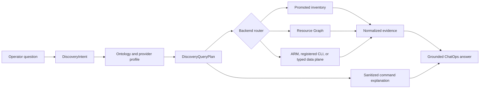

# Azure 리소스 검색 명령 커버리지

이 문서는 FDAI가 권한이 있는 범위에서 식별 가능한 모든 Azure 리소스를 찾고, 운영자에게
재현 가능한 Azure CLI 또는 Azure Resource Graph 명령을 보여주는 방법을 정의합니다. Narrator가
명령을 만들거나 범위를 넓히지 않으면서 제한된 읽기 조사 설계를 확장합니다.

> **범위:** 이 설계는 읽기 전용 리소스 검색, 명령 설명, 공급자 유형 커버리지, 대체 경로 선택,
> 커버리지 측정을 다룹니다. 변경 권한을 부여하거나 자격 증명을 노출하지 않으며, 임의 shell 또는
> Kusto 텍스트를 ChatOps 도구로 바꾸지 않습니다.
>
> **완전성 경계:** "모든 리소스"는 구성된 읽기 담당 신원이 열거할 수 있는 선언된 검색 범위의
> 모든 개체를 뜻합니다. FDAI는 접근 불가, 미지원, data-plane 전용, 미매핑 개체를 커버리지 공백으로
> 보고하며 테넌트 전체를 완전히 검색했다고 주장하지 않습니다.

## 설계 요약

FDAI는 운영자 질문을 형식화된 검색 의도로 컴파일하고, 해당 의도를 Azure 검색 프로필 카탈로그와
대조한 후 가장 좁은 검증된 백엔드를 선택합니다. 같은 불변 계획에서 정규화된 근거와 정제된
`CommandExplanation`을 생성하므로, 서버 자격 증명이나 실행된 raw argv를 노출하지 않고 읽기를
재현하는 방법을 답변에 표시할 수 있습니다.



## 구현 상태

### 구현 범위

| 영역 | 상태 | 근거 | 참고 |
|------|------|------|------|
| 리소스 어휘와 Azure 타입 구분 | implemented | [`resource-types.yaml`](../../../rule-catalog/vocabulary/resource-types.yaml), [`resource_type.py`](../../../services/core-control-plane/src/fdai/rule_catalog/schema/resource_type.py), 집중 카탈로그 및 ARG 테스트 | 카탈로그에 등록된 타입에 한해 조회 용어, 범주 용어, 안정적인 매핑 요약값 및 검토된 Azure `kind` 구분이 있습니다. |
| 인벤토리 언어 레지스트리 | implemented | [`inventory_query_language.py`](../../../services/core-control-plane/src/fdai/rule_catalog/schema/inventory_query_language.py), [`test_inventory_query_language.py`](../../../services/core-control-plane/tests/rule_catalog/test_inventory_query_language.py) | 검증된 레지스트리와 요약값이 있습니다. 이는 `InventoryQuery` 또는 `DiscoveryQueryPlan` 컴파일러가 아닙니다. |
| 선택적 Azure 인벤토리 어댑터 | implemented | [`arg_query.py`](../../../services/core-control-plane/src/fdai/delivery/azure/arg_query.py), [`inventory.py`](../../../services/core-control-plane/src/fdai/delivery/azure/inventory.py), [`arm_inventory.py`](../../../services/core-control-plane/src/fdai/delivery/azure/arm_inventory.py) 및 집중 테스트 | ARG와 ARM 어댑터는 카탈로그에서 확인한 리소스 타입을 제한된 페이지 처리와 실패 시 차단 동작으로 조회합니다. 중앙 검색 계획 라우터를 뜻하지는 않습니다. |
| 선택적 운영자 인벤토리 필터링 | implemented | [`_system_inventory_tool.py`](../../../services/core-control-plane/src/fdai/core/conversation/_system_inventory_tool.py), [`test_system_tools.py`](../../../services/core-control-plane/tests/conversation/test_system_tools.py) | 도구는 제공된 스냅샷을 중립 타입, ID 부분 문자열 및 리소스 그룹으로 필터링합니다. 범용 검색 의도를 컴파일하지는 않습니다. |
| Console 프로바이더 실행 정보 파싱 | implemented | [`inventory-execution-display.ts`](../../../console/src/deck/inventory-execution-display.ts) 및 집중 테스트 | Console은 구조가 유효하고 민감정보가 제거되었으며 범위가 제한된 `provider_execution` 레코드만 IQL과 분리해 표시합니다. |
| 프로바이더 실행 증적 생성 | implemented | [`discovery_receipts.py`](../../../services/core-control-plane/src/fdai/delivery/azure/discovery_receipts.py), [`discovery_evidence.py`](../../../packages/service-contracts/src/fdai_service_contracts/discovery_evidence.py), 집중 Python 및 Console 파서 테스트 | 생성기는 정확한 등록 계획과 제한된 결과 요약을 받으며 raw argv, 자격 증명, 연속 토큰, 리소스 id 또는 프로바이더 오류를 받지 않습니다. |
| 포괄적 검색 계약과 프로파일 | implemented | [`discovery.py`](../../../packages/service-contracts/src/fdai_service_contracts/discovery.py), [`discovery_profiles.py`](../../../services/core-control-plane/src/fdai/delivery/azure/discovery_profiles.py), [`discovery_observations.py`](../../../services/core-control-plane/src/fdai/delivery/azure/discovery_observations.py), 집중 계약 및 delivery 테스트 | 고정되고 digest에 바인딩된 의도, 계획, 프로파일 및 매핑되거나 미매핑된 프로바이더 관찰이 실행 가능한 텍스트와 해석되지 않은 수정자를 거부합니다. |
| 중앙 라우팅, 명령 설명 및 커버리지 증명 | in-progress | [`router.py`](../../../services/core-control-plane/src/fdai/core/discovery/router.py), [`discovery_explanation.py`](../../../services/core-control-plane/src/fdai/delivery/azure/discovery_explanation.py), [`discovery_coverage.py`](../../../services/core-control-plane/src/fdai/delivery/azure/discovery_coverage.py), 집중 테스트 | 정확히 동등한 대체 경로, 정본 병합, 정제된 설명 및 실제 운영 증적만 인정하는 조정이 구현되었습니다. 이 행을 `validated`로 올리려면 통제된 실제 운영 canary 증적이 필요합니다. |

### 구현 이력

| 날짜 | 상태 | 변경 | 근거 | 남은 작업 |
|------|------|------|------|-----------|
| 2026-08-13 | in-progress | 이 구현 원장을 도입하고 이전 기준선 요약을 바로잡았습니다. 이전 이력은 재구성하지 않았습니다. | 현재 변경. 집중 검사 결과는 카탈로그 레지스트리 `38 passed`, Azure 어댑터 `116 passed`, 시스템 도구 `19 passed`, Console 파서 `2 passed`입니다. | 아래의 미완료 계약, 증적 생성기, 라우팅, 설명, 커버리지 및 통제된 런타임 근거를 구현합니다. |
| 2026-08-14 | in-progress | 불변 검색 계약과 Azure 프로파일을 추가하고 미매핑 프로바이더 관찰을 보존했으며, 정확히 동등한 라우팅과 정본 병합 및 정제된 실행/명령 설명 증적과 실제 운영 증적 전용 커버리지 조정을 구현했습니다. | `current change`; 집중 검색 테스트 `34 passed`, Console 파서 `6 passed`, 작업 범위 Ruff, 운영 파일 8개의 strict mypy 및 Console typecheck가 통과했습니다. | 주장한 리소스 컨테이너 및 ARM 리소스 universe에 대해 최신 통제된 읽기 전용 canary 증적을 보존합니다. |
| 2026-08-14 | in-progress | 문서화된 `unmapped` 커버리지 상태를 추가하고 서버 및 Console 명령 근거의 환경 할당을 거부했습니다. | `current change`; 집중 검색 테스트 `36 passed`, Console 파서 `7 passed`, 작업 범위 Ruff, strict 계약 mypy 및 Console typecheck가 통과했습니다. | 주장한 리소스 컨테이너 및 ARM 리소스 universe에 대해 최신 통제된 읽기 전용 canary 증적을 보존합니다. |

### 남은 작업

- [x] 실행 가능한 텍스트와 해석되지 않은 수정자를 거부하는 프로파일 스키마 테스트와 함께 제한된 `DiscoveryIntent` 및 불변 `DiscoveryQueryPlan` 계약을 추가합니다.
- [x] 알 수 없는 Azure 프로바이더 타입을 제한된 `mapping_status=unmapped` 관찰로 보존하고, 이를 제외하거나 중립 온톨로지로 승격하지 않는다는 집중 테스트를 추가합니다.
- [x] 서버 소유 `provider_execution` 증적 생성기를 구현하고 자격 증명, 페이지 나누기 토큰, 원본 리소스 ID 및 프로바이더 오류가 Console 레코드에 도달할 수 없음을 증명합니다.
- [x] 범위나 조건식을 약화하지 않는 중앙 백엔드 적격성, 동등 대체 경로, 계획별 완전성 및 정본 병합 테스트를 구현합니다.
- [x] 등록된 계획에서 정제된 `CommandExplanation` 레코드를 생성하고 shell 제어, 식별자, 민감정보 제거 및 동등 명령 표시를 위한 속성 및 golden 테스트를 통과합니다.
- [ ] 해당 행을 `validated`로 승격하기 전에 각 주장 범위에 대한 커버리지 조정 및 통제된 읽기 전용 실제 운영 canary 증적을 기록합니다.

## 현재 기준선과 공백

현재 구현에는 카탈로그 소유 리소스 조회 용어와 범주 용어, 검증된 인벤토리 언어
레지스트리, 선택적 스냅샷 필터, 그리고 카탈로그에서 확인한 리소스 타입을 한 번에 하나씩 조회하는
Azure ARG 및 ARM 어댑터가 있습니다. 구체적인 용어는 범용 범주 용어보다 우선합니다. Web
App과 Function App의 `Microsoft.Web/sites`처럼 ARM 타입을 공유하는 경우 전체 ARG 행에 일치하는
`kind`가 있어야 하며, 구분자가 없는 출처는 의미적 타입을 추측하지 않습니다. 이 조각들은
아직 불변 `InventoryQuery`를 컴파일하거나 ARG에서 ARM으로 중앙 라우팅하거나 프로바이더 실행
증적을 생성하지 않습니다.

현재 기준선은 포괄적인 검색을 충족하지 못합니다.

- **Semantic 커버리지가 선택적임:** Neutral vocabulary에는 현재 운영 vertical에 필요한 리소스
 유형만 의도적으로 포함됩니다. 알 수 없는 Azure 유형은 미매핑 관찰로 반환되지 않고 제외됩니다.
- **하나의 매핑으로 부족함:** 검색에는 다른 ARG 표, 여러 ARM 유형, 상위 확장, 전용 CLI
 확장 또는 버전이 지정된 REST 엔드포인트가 필요할 수 있습니다.
- **조회와 설명 표면이 좁음:** Console은 유효하고 범위가 제한된 `provider_execution` 레코드를
 파싱할 수 있지만 현재 운영 경로는 이를 생성하지 않습니다. 프로바이더 타입, tag, 범위 kind,
 management 그룹, CLI 선행 조건, 계획별 대체 경로 사유 및 cross-provider 명령 explanation은
 아직 없습니다.
- **ARG와 ARM은 부분적임:** 특수 ARG 표, 프로바이더별 상세, 테넌트 디렉터리 개체 및
 data-plane 개체에는 서로 다른 형식화된 계획과 신원이 필요합니다.

## 검색 범위

완전성은 성공한 조회 하나가 아니라 범위별로 측정하며 이 표는 목표 커버리지를 정의합니다.
현재 범위는 구독 및 구성된 그룹이며 더 넓은 범위 커버리지는 계획된 상태입니다.

| 범위 | 예 | 기본 검색 | 필요한 대체 경로 또는 공백 상태 |
|------|----|-----------|----------------------------------|
| Resource 컨테이너 | Management 그룹, 구독, 리소스 그룹 | ARG `ResourceContainers` | ARM 범위 API 또는 명시적 사용 불가 |
| ARM 리소스 | Top-level 및 확장 리소스 | ARG `Resources` | `az resource list`, ARM list API |
| ARM 하위 리소스 | Subnet, SQL 데이터베이스, agent pool, diagnostic 설정 | 인덱싱된 ARG 표/타입 | 상위 확장, 타입이 지정된 CLI/REST |
| ARG 특수 개체 | Policy, RBAC, health, advisor, security, alert, support | 담당 ARG 표 | 타입이 지정된 서비스 API 또는 지원하지 않는 |
| Resource 상세 및 상태 | VM instance 화면, 구성된 NSG rule, peering 상태 | 타입이 지정된 REST/프로바이더 | 등록된 전용 CLI 계획 |
| 테넌트 디렉터리 개체 | Entra application, 그룹, 서비스 principal | Microsoft Graph 타입이 지정된 프로바이더 | ARM/ARG 커버리지 밖으로 명시 |
| 서비스 data-plane 개체 | Kubernetes 워크로드, 블롭 컨테이너, Key Vault 개체 | 별도 권한의 타입이 지정된 프로바이더 | 읽기 담당 인벤토리로 커버하지 않음 |

각 응답은 검색한 범위와 건너뛴 범위 및 이유를 표시합니다. 요청된 모든 범위가 잘림이나 권한 공백
없이 완료된 경우에만 "일치 항목 없음"이 유효합니다.

## 온톨로지와 공급자 매핑

운영 온톨로지는 서로 다른 두 의미를 보존하는 것이 좋습니다.

- **Semantic 리소스 타입:** `compute.vm`처럼 rule, objective, relationship 및 액션에서
 사용하는 안정적인 cloud-provider-neutral 유형입니다.
- **관찰된 프로바이더 타입:** `Resources`의 `Microsoft.Compute/virtualMachines`처럼 검색 중
 관찰한 정확한 Azure 타입 및 범위입니다.

모든 Azure 프로바이더 타입을 neutral 온톨로지에 추가하지 않는 것이 좋습니다. 새로 관찰한 Azure
타입은 `mapping_status=unmapped`, 제한된 프로바이더 타입, 범위 kind 및 근거 참조와 함께
반환합니다. 거버넌스는 나중에 기존 semantic 타입에 매핑하거나 검토된 neutral 타입을 추가할 수
있습니다. 해당 리소스는 매핑 전에 검색할 수 있습니다.

버전이 지정된 Azure 검색 프로필은 semantic 타입 선언과 분리하는 것이 좋습니다. 각 프로필은
다음을 기록합니다.

| 필드 | 목적 |
|------|------|
| `provider_type` | 대소문자를 구분하지 않는 정확한 ARM 또는 Graph 타입입니다. |
| `semantic_type` | 선택적 neutral 타입 및 대응 개정 번호입니다. |
| `scope_kinds` | 테넌트, management 그룹, 구독, 리소스 그룹, 리소스 또는 data plane입니다. |
| `arg_tables` | 순서가 지정된 ARG 표 및 제한된 변환 결과입니다. |
| `arm_plans` | API 버전이 고정된 범용 또는 타입이 지정된 REST 연산입니다. |
| `cli_plans` | 등록된 명령 id, 버전, 선행 조건 및 출력 스키마입니다. |
| `identity_profile` | 배포 역할 배정을 포함하지 않는 필수 읽기 담당 기능입니다. |
| `limits` | 페이지, 행, 바이트, 시간 초과, 동시 확산 및 최신성 제한입니다. |
| `provenance` | Microsoft 참조, 관찰된 CLI 버전, 검증 시간 및 테스트 증적입니다. |

프로바이더 대응은 카탈로그 data입니다. Bragi는 형식화된 검색 의도를 선택할 수 있지만 프로파일,
KQL, URL, 명령 id, 확장 name 또는 argv를 작성할 수 없습니다.

## 형식화된 계약

### 검색 의도

`DiscoveryIntent`는 실행 가능한 텍스트를 포함하지 않고 현재 조회 의미를 확장합니다.

- 결과 kind는 `list`, `count`, `types`, `relationships` 또는 `coverage`입니다.
- 요청된 범위와 name, 타입, 그룹, location, tag, 상태 및 link 조건식을 포함합니다.
- 서버 소유 범위와 최신성, 결과, 페이지, 바이트 및 wall-clock 제한을 포함합니다.
- 재현 가능한 명령 설명 요청 여부를 포함합니다.

값은 제한되고 정규화된 상태를 유지합니다. 모델이 제안한 의도는 결정론적 검증기가 모든
필드를 수락하고 해석되지 않은 modifier를 거부하기 전까지 권한이 없습니다.

### 검색 조회 계획

`DiscoveryQueryPlan`은 의도와 특정 검색 프로필 개정 번호에서 생성된 불변이며 재생 가능한
백엔드 계획입니다. 다음을 기록합니다.

- 백엔드 kind 및 등록된 표 또는 연산 id이며, 운영자 제공 실행 텍스트는 받지 않습니다.
- 서버가 소유한 범위, 권한 확인 상한, 컴파일된 조건식 및 제한된 변환 결과입니다.
- 페이지 나누기, stop 조건, 출력 스키마 및 정규화 대응입니다.
- 더 높은 우선순위 백엔드가 부적합했던 대체 순서와 이유입니다.
- 검증에 사용한 카탈로그, Azure CLI, 확장 및 API 버전입니다.

의도의 범위가 여러 ARG 표에 걸치면 여러 계획으로 동시 확산할 수 있습니다. 결과는 계획별
완전성과 최신성을 보존하면서 정본 프로바이더 참조로 병합합니다.

### 명령 설명

`CommandExplanation`은 shell 실행 증적이 아닌 표현 근거입니다. 다음을 포함합니다.

- `<subscription-id>` 같은 자리 표시자가 있는 정제된 CLI 및 KQL 템플릿입니다.
- Command id, 카탈로그 버전, 백엔드, 범위, CLI 버전 및 확장 선행 조건입니다.
- 결과 한도, 페이지 나누기, 검증 상태 및 시각입니다.
- 민감정보 제거 및 substitution 지침입니다.
- 서버가 REST 또는 인벤토리를 사용했으며 표시된 CLI는 동등한 재현 명령일 뿐인 경우의 설명입니다.

향후 `CommandExplanation` 렌더러는 catalog-owned 구문과 별도로 검증된 scalar 값만 인용합니다.
접근 토큰, 테넌트 id, 실제 구독 id, raw 리소스 id, shell 운영자, 환경 배정
또는 프로바이더 오류 텍스트는 렌더링하지 않습니다. 현재 범용 스냅샷 증적은 더 좁은 예외로,
인증된 콘솔에 구독 id와 실행된 범용 argv를 표시하지만 페이지 나누기 토큰, 자격 증명,
raw 리소스 id 및 프로바이더 오류는 계속 생략합니다.

## 백엔드 선택

다음은 목표 라우팅 순서입니다. 현재 전송 계층은 중앙 계획 병합 없이 고정 경로를 사용합니다.
목표 라우터는 요청 결과를 증명할 수 있는 가장 좁은 백엔드를 선택합니다.

1. **Promoted 인벤토리:** Provider-type 커버리지가 요청 범위와 조건식을 포함하면 fresh하고
  완전한한 스냅샷을 사용합니다.
2. **ARG:** Cross-resource search, 집계, relationship 또는 ARG에만 있는 개체에는 프로파일의
  담당 표를 사용합니다. 조회 템플릿은 catalog-owned이며 전용 컴파일러가 KQL 값을 escape합니다.
3. **범용 ARM:** ARG에 인덱싱되지 않은 일반 ARM 리소스 또는 ARG 사용 불가 상황에는
  `az resource list`나 구독/resource-group list API를 사용합니다.
4. **타입이 지정된 ARM 또는 전용 CLI:** 범용 발견으로 증명할 수 없는 리소스 상태, 중첩된 객체
  또는 프로바이더별 변환 결과에는 등록된 계획을 사용합니다.
5. **타입이 지정된 data plane:** 별도로 구성된 프로바이더와 신원 프로파일만 사용합니다. ARM 읽기 담당의
  권한을 상속하지 않습니다.

백엔드 실패가 범위를 조용히 넓히거나 조건식을 약화하지 않습니다. 다음 대체 경로는 같은
의도와 출력 계약을 충족해야 하며, 그렇지 않으면 계획은 `unsupported` 또는 `unavailable`을
보고합니다.
페이지 또는 행 제한에 도달하면 `partial`을 보고하며 잘린 no-match를 완전한한 빈 결과로 바꾸지 않습니다.

## 예: `fdai`가 포함된 리소스 그룹

FDAI는 어떤 경로가 근거를 제공했는지 식별하면서 동등한 두 읽기 경로를 모두 표시할 수 있습니다.

```azurecli
az group list \
 --subscription <subscription-id> \
 --query "[?contains(name, 'fdai')].{name:name,location:location,tags:tags}" \
 --output json
```

```azurecli
az graph query \
 --subscriptions <subscription-id> \
 --graph-query "ResourceContainers | where type =~ 'microsoft.resources/subscriptions/resourcegroups' | where name contains 'fdai' | project id, name, subscriptionId, location, tags | order by name asc" \
 --first 1000 \
 --output json
```

일반 리소스 검색에는 같은 의도가 `Resources`를 대상으로 합니다. Policy, 역할 배정,
health 또는 advisor 질문에는 모든 조회를 `Resources`로 보내지 않고 프로파일이 담당 특수 표를
선택합니다.

## 초기 계획

직관적인 첫 계획은 알려진 모든 Azure 타입을 `resource-types.yaml`에 추가하고, 타입별 Azure CLI
명령 하나를 등록하며, 실행된 명령을 노출하고, 전용 CLI에서 `az resource list`, ARG 순으로
대체하는 것입니다. 그러나 이 방식은 semantic 의미, 프로바이더 동작, 런타임 근거 및 표현을
한 카탈로그에 결합하고 특정 시점의 Azure 명령 목록을 완전한 것으로 취급합니다.

## 초기 계획 비평

초기 계획은 실제 Azure와 ChatOps 조건에서 다음과 같이 실패합니다.

- **정적 목록은 낡음:** Core CLI 명령, 확장, API 버전 및 ARG 표 커버리지는 서로
 독립적으로 변경됩니다. 조정 절차가 없으면 큰 checked-in 목록은 오래된 상태가 됩니다.
- **온톨로지가 오염됨:** 수천 개 프로바이더 타입이 수천 개의 안정적인 운영 개념을 뜻하지 않습니다.
 Azure 이름 공간을 neutral 온톨로지로 복사하면 portability와 거버넌스가 손상됩니다.
- **대체 순서가 잘못됨:** 전용 CLI 명령이 없거나 확장에 의존하고, ARG보다 느리거나 덜
 완전할 수 있습니다. 백엔드 순서는 명령의 격이 아니라 요청된 근거에 따라야 합니다.
- **거짓 완전성:** 읽기 담당 RBAC, Lighthouse 위임, ARG 인덱싱, PII scrubbing, 페이지 나누기 및
 프로바이더 registration이 개체를 숨길 수 있습니다. 성공한 조회가 전체 범위 검색을 증명하지 않습니다.
- **안전하지 않은 투명성:** Raw argv에는 배포 범위와 정확한 리소스 id가 포함될 수 있습니다.
 이를 서술기 또는 브라우저에 보내면 기존 근거 최소화 경계와 충돌합니다.
- **ARG 과대평가:** ARG는 많은 ARM 및 거버넌스 개체를 다루지만 모든 control-plane 상세,
 테넌트 디렉터리 객체 또는 서비스 data-plane 객체를 다루지는 않습니다.
- **범용 ARM 과소평가:** `az resource list`는 특수 ARG 표, instance 화면, 프로바이더별 하위
 listing 또는 data-plane enumeration을 대체할 수 없습니다.
- **제한 없는 테스트:** Command와 리소스 타입별 수동 테스트는 변하는 platform의 지속적인
 완전성을 입증할 수 없습니다.

## 개선된 구현 계획

1. **기준 시나리오:** Name, 타입, tag, 범위, 상태, relationship, 하위 리소스, 특수 ARG 표,
  CLI-only 상세, ARG-only 객체, unknown 타입, 권한 확인 공백, 잘림 및 no 일치에 대한
  bilingual 사례를 측정합니다.
2. **계약과 프로필:** 프로바이더 중립적인 발견 및 explanation 계약과 versioned Azure 프로파일
  카탈로그를 추가하고 unmapped 프로바이더 타입을 보존합니다.
3. **컴파일러와 라우팅:** 제한된 조건식과 등록된 ARG 구문만 컴파일합니다. 대체 전에 조건식
  동등성을 증명하고 병합 중 계획별 완전성을 유지합니다.
4. **실행과 설명:** 범용, ARG 및 승인된 provider-specific 읽기를 등록합니다. 계획에서
  `CommandExplanation`을 생성하고 시작 시 CLI 선행 조건을 검증합니다.
5. **ChatOps UX:** 요약, 검색 범위, 커버리지, 근거 출처 및 접힌 reproduction 블록을
  렌더링합니다. 실행되지 않은 동등한 명령에는 해당 사실을 표시합니다.
6. **커버리지 조정:** ARM 메타데이터, ARG 표 타입, Microsoft 참조, 설치된 CLI
  확장, 등록된 프로파일 및 canary 증적을 비교합니다. 확장 설치, 프로바이더 활성화, RBAC
  확장 또는 온톨로지 편집 없이 inert 카탈로그 변경을 제안합니다.
7. **검증과 롤아웃:** Observation 모드에서 시작합니다. 계약/속성 테스트, golden 렌더링,
  mocked 페이지 나누기/대체 경로 및 읽기 전용 실제 운영 canary로 각 범위를 gate합니다.

## 커버리지 원장과 종료 조건

커버리지 원장이 증명 표면입니다. 각 행은 cloud, 프로바이더 타입, universe, 범위 kind, 백엔드,
프로파일 개정 번호 및 관찰된 platform 버전으로 식별합니다.

| 상태 | 의미 |
|------|------|
| `covered` | 검증된 계획이 제한 안에서 완료되고 예상 스키마를 정규화했습니다. |
| `fallback` | 기본 백엔드는 사용 불가이지만 동등한 검증 계획이 완료되었습니다. |
| `partial` | 일부 페이지, 범위, 속성 또는 universe가 사용 불가이거나 잘린입니다. |
| `unsupported` | 요청된 근거 계약을 충족하는 등록된 읽기 계획이 없습니다. |
| `unauthorized` | 읽기 담당 신원이 대상 범위 또는 프로바이더를 열거할 수 없습니다. |
| `unmapped` | 프로바이더 객체를 찾았지만 검토된 semantic 타입 대응이 없습니다. |

첫 release는 다음 조건을 충족하면 완료됩니다.

- 모든 competency 시나리오가 타입이 지정된 계획 또는 명시적인 지원하지 않는 이유를 반환합니다.
- Resource 그룹과 범용 ARM 리소스가 exact 및 contains-name 검색을 지원합니다.
- 구성된 각 ARG 표가 고정된 제한 안에서 서로 다른 프로바이더 타입을 열거할 수 있습니다.
- 알 수 없는 프로바이더 타입이 unmapped 결과로 남습니다.
- CLI-only 및 ARG-only 고정본이 올바른 백엔드를 선택합니다.
- 일치하는 모든 답변이 요청 시 검증되고 정제된 명령 explanation을 렌더링할 수 있습니다.
- Command explanation에 실제 테넌트, 구독, 리소스 id, 자격 증명 또는 shell control
 운영자가 포함되지 않습니다.
- 권한 확인 실패, 잘림 또는 건너뛴 universe를 완전한 빈 결과로 렌더링하지 않습니다.
- 영어와 한국어 시나리오 집단이 같은 typed-query 및 권한 검사를 통과합니다.

## 결정

- **명령 투명성은 파생됨:** FDAI는 raw 프로세스 argv 또는 출력이 아닌 정제된 재현 계획을 표시합니다.
- **프로바이더 커버리지는 semantic 온톨로지와 분리됨:** Azure 타입은 통제된 neutral 타입에 매핑되기
 전에도 검색할 수 있습니다.
- **완전성은 명시적이며 범위가 제한됨:** 모든 답변에 검색한 universe, 잘림,
 권한 확인, 최신성 및 대응 상태가 포함됩니다.
- **임의 조회는 계속 사용 불가임:** Operator는 타입이 지정된 의도를 선택하고 catalog-owned 컴파일러가
 KQL, REST 경로 및 CLI argv를 생성합니다.
- **Platform drift는 변경을 제안함:** 조정은 inert하고 검토 가능한 후보를 만들며
 확장, 프로바이더, 권한 또는 온톨로지를 자동으로 변경하지 않습니다.

## 관련 문서

| 알아볼 내용 | 문서 |
|-------------|------|
| 읽기 조사 실행과 근거 | [Azure 읽기 Investigations](azure-read-investigations-ko.md) |
| ChatOps 도구와 서술기 경계 | [Operator Console](operator-console-ko.md) |
| 공유 semantic 리소스 의미 | [Operating 온톨로지](../architecture/operating-ontology-ko.md) |
| 읽기 담당과 실행기 신원 분리 | [Security and 신원](../architecture/security-and-identity-ko.md) |
