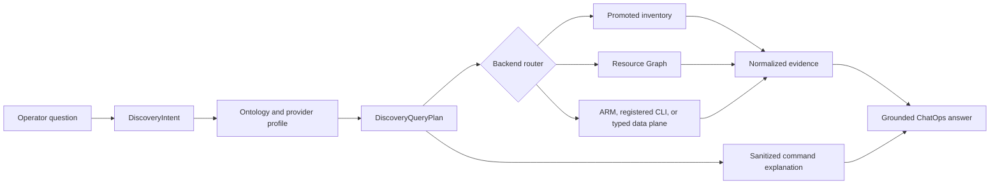

# Azure 리소스 검색 명령 커버리지

이 문서는 FDAI가 권한이 있는 범위에서 식별 가능한 모든 Azure 리소스를 찾고, 운영자에게
재현 가능한 Azure CLI 또는 Azure Resource Graph 명령을 보여주는 방법을 정의합니다. Narrator가
명령을 만들거나 범위를 넓히지 않으면서 제한된 읽기 조사 설계를 확장합니다.

> **범위:** 이 설계는 읽기 전용 리소스 검색, 명령 설명, 공급자 유형 커버리지, 대체 경로 선택,
> 커버리지 측정을 다룹니다. 변경 권한을 부여하거나 자격 증명을 노출하지 않으며, 임의 shell 또는
> Kusto 텍스트를 ChatOps 도구로 바꾸지 않습니다.
>
> **완전성 경계:** "모든 리소스"는 구성된 reader identity가 열거할 수 있는 선언된 검색 범위의
> 모든 개체를 뜻합니다. FDAI는 접근 불가, 미지원, data-plane 전용, 미매핑 개체를 커버리지 공백으로
> 보고하며 tenant 전체를 완전히 검색했다고 주장하지 않습니다.
>
> **구현 상태:** 선택적 inventory 경로를 위한 catalog 소유 resource `query_terms`, category term 및
> deterministic `InventoryQuery` compilation은 구현되었습니다. Interactive local은 cached snapshot을
> 만든 strict bounded receipt를 기록합니다. 인증된 subscription id, exact generic Azure CLI argv,
> 측정된 command duration, result count 및 allowlist된 preview row 최대 10개를 현재 turn의 IQL과 분리해 표시하며 pagination
> token은 계속 redaction합니다. Azure Resource
> Graph와 local CLI projection도 검토된 Azure `kind` token으로 공유 ARM type을 구분합니다. 더 넓은
> `DiscoveryIntent`, `DiscoveryQueryPlan`, provider profile, unmapped resource 보존, centralized
> fallback 및 `CommandExplanation`은 목표 설계로 남아 있습니다.

## 설계 요약

FDAI는 운영자 질문을 형식화된 검색 의도로 컴파일하고, 해당 의도를 Azure 검색 프로필 카탈로그와
대조한 후 가장 좁은 검증된 backend를 선택합니다. 같은 불변 계획에서 정규화된 근거와 정제된
`CommandExplanation`을 생성하므로, 서버 자격 증명이나 실행된 raw argv를 노출하지 않고 읽기를
재현하는 방법을 답변에 표시할 수 있습니다.



## 현재 기준선과 공백

현재 경로는 일반적인 영어와 한국어 인벤토리 질문을 불변 `InventoryQuery`로 컴파일합니다.
Production은 각 vocabulary 항목의 `azure_arm_type`을 기준으로 Azure Resource Graph(ARG)를
분할 조회하고, interactive local은 ARG를 사용한 뒤 `az resource list`로 대체합니다.
Natural-language resource form은 `resource-types.yaml`에서 가져오므로, 검토된 type이나 term을
추가할 때 Python alias를 수정할 필요가 없습니다. 구체적인 term은 generic category term보다
우선합니다. Web App과 Function App의 `Microsoft.Web/sites`처럼 ARM type을 공유하는 경우 전체
ARG row에 일치하는 `kind`가 있어야 하며, discriminator가 없는 source는 semantic type을 추측하지
않습니다.

현재 기준선은 포괄적인 검색을 충족하지 못합니다.

- **Semantic 커버리지가 선택적임:** Neutral vocabulary에는 현재 운영 vertical에 필요한 리소스
  유형만 의도적으로 포함됩니다. 알 수 없는 Azure 유형은 미매핑 관찰로 반환되지 않고 제외됩니다.
- **하나의 매핑으로 부족함:** 검색에는 다른 ARG table, 여러 ARM 유형, parent 확장, 전용 CLI
  extension 또는 버전이 지정된 REST endpoint가 필요할 수 있습니다.
- **Query와 설명 표면이 좁음:** Interactive local은 실제 generic snapshot-refresh receipt만
  제공합니다. Provider type, tag, scope kind, management group, CLI prerequisite, plan별 fallback
  reason 및 cross-provider command explanation은 아직 없습니다.
- **ARG와 ARM은 부분적임:** 특수 ARG table, provider별 detail, tenant directory 개체 및
  data-plane 개체에는 서로 다른 형식화된 계획과 identity가 필요합니다.

## 검색 범위

완전성은 성공한 query 하나가 아니라 범위별로 측정하며 이 table은 목표 coverage를 정의합니다.
현재 scope는 subscription 및 구성된 group이며 더 넓은 scope coverage는 계획된 상태입니다.

| 범위 | 예 | 기본 검색 | 필요한 대체 경로 또는 공백 상태 |
|------|----|-----------|----------------------------------|
| Resource container | Management group, subscription, resource group | ARG `ResourceContainers` | ARM scope API 또는 명시적 unavailable |
| ARM resource | Top-level 및 extension resource | ARG `Resources` | `az resource list`, ARM list API |
| ARM child resource | Subnet, SQL database, agent pool, diagnostic setting | 인덱싱된 ARG table/type | Parent 확장, typed CLI/REST |
| ARG 특수 개체 | Policy, RBAC, health, advisor, security, alert, support | 담당 ARG table | Typed service API 또는 unsupported |
| Resource detail 및 state | VM instance view, 구성된 NSG rule, peering state | Typed REST/provider | 등록된 전용 CLI plan |
| Tenant directory 개체 | Entra application, group, service principal | Microsoft Graph typed provider | ARM/ARG 커버리지 밖으로 명시 |
| Service data-plane 개체 | Kubernetes workload, blob container, Key Vault 개체 | 별도 권한의 typed provider | Reader inventory로 커버하지 않음 |

각 응답은 검색한 범위와 건너뛴 범위 및 이유를 표시합니다. 요청된 모든 범위가 잘림이나 권한 공백
없이 완료된 경우에만 "일치 항목 없음"이 유효합니다.

## 온톨로지와 공급자 매핑

운영 온톨로지는 서로 다른 두 의미를 보존하는 것이 좋습니다.

- **Semantic resource type:** `compute.vm`처럼 rule, objective, relationship 및 action에서
  사용하는 안정적인 cloud-provider-neutral 유형입니다.
- **Observed provider type:** `Resources`의 `Microsoft.Compute/virtualMachines`처럼 검색 중
  관찰한 정확한 Azure type 및 scope입니다.

모든 Azure provider type을 neutral ontology에 추가하지 않는 것이 좋습니다. 새로 관찰한 Azure
type은 `mapping_status=unmapped`, 제한된 provider type, scope kind 및 evidence reference와 함께
반환합니다. Governance는 나중에 기존 semantic type에 매핑하거나 검토된 neutral type을 추가할 수
있습니다. 해당 resource는 매핑 전에 검색할 수 있습니다.

버전이 지정된 Azure 검색 프로필은 semantic type 선언과 분리하는 것이 좋습니다. 각 프로필은
다음을 기록합니다.

| 필드 | 목적 |
|------|------|
| `provider_type` | 대소문자를 구분하지 않는 정확한 ARM 또는 Graph type입니다. |
| `semantic_type` | 선택적 neutral type 및 mapping revision입니다. |
| `scope_kinds` | Tenant, management group, subscription, resource group, resource 또는 data plane입니다. |
| `arg_tables` | 순서가 지정된 ARG table 및 제한된 projection입니다. |
| `arm_plans` | API version이 고정된 generic 또는 typed REST operation입니다. |
| `cli_plans` | 등록된 command id, version, prerequisite 및 output schema입니다. |
| `identity_profile` | 배포 role assignment를 포함하지 않는 필수 reader capability입니다. |
| `limits` | Page, row, byte, timeout, fan-out 및 freshness 제한입니다. |
| `provenance` | Microsoft reference, 관찰된 CLI version, validation time 및 test receipt입니다. |

Provider mapping은 catalog data입니다. Bragi는 형식화된 검색 의도를 선택할 수 있지만 profile,
KQL, URL, command id, extension name 또는 argv를 작성할 수 없습니다.

## 형식화된 계약

### 검색 의도

`DiscoveryIntent`는 실행 가능한 텍스트를 포함하지 않고 현재 query 의미를 확장합니다.

- Result kind는 `list`, `count`, `types`, `relationships` 또는 `coverage`입니다.
- 요청된 범위와 name, type, group, location, tag, status 및 link predicate를 포함합니다.
- 서버 소유 scope와 freshness, result, page, byte 및 wall-clock 제한을 포함합니다.
- 재현 가능한 명령 설명 요청 여부를 포함합니다.

값은 제한되고 정규화된 상태를 유지합니다. Model이 제안한 intent는 deterministic verifier가 모든
field를 수락하고 해석되지 않은 modifier를 거부하기 전까지 권한이 없습니다.

### 검색 query plan

`DiscoveryQueryPlan`은 intent와 특정 검색 프로필 revision에서 생성된 불변이며 replay 가능한
backend plan입니다. 다음을 기록합니다.

- Backend kind 및 등록된 table 또는 operation id이며, operator 제공 실행 텍스트는 받지 않습니다.
- Server-owned scope, authorization ceiling, 컴파일된 predicate 및 제한된 projection입니다.
- Pagination, stop condition, output schema 및 normalization mapping입니다.
- 더 높은 우선순위 backend가 부적합했던 대체 순서와 이유입니다.
- 검증에 사용한 catalog, Azure CLI, extension 및 API version입니다.

Intent의 범위가 여러 ARG table에 걸치면 여러 plan으로 fan-out할 수 있습니다. 결과는 plan별
completeness와 freshness를 보존하면서 canonical provider reference로 병합합니다.

### 명령 설명

`CommandExplanation`은 shell 실행 receipt가 아닌 presentation evidence입니다. 다음을 포함합니다.

- `<subscription-id>` 같은 placeholder가 있는 정제된 CLI 및 KQL template입니다.
- Command id, catalog version, backend, scope, CLI version 및 extension prerequisite입니다.
- Result limit, pagination, validation status 및 timestamp입니다.
- Redaction 및 substitution 지침입니다.
- 서버가 REST 또는 inventory를 사용했으며 표시된 CLI는 동등한 재현 명령일 뿐인 경우의 설명입니다.

향후 `CommandExplanation` renderer는 catalog-owned syntax와 별도로 검증된 scalar value만 인용합니다.
Access token, tenant id, 실제 subscription id, raw resource id, shell operator, environment assignment
또는 provider error text는 렌더링하지 않습니다. 현재 generic snapshot receipt는 더 좁은 예외로,
인증된 console에 subscription id와 실행된 generic argv를 표시하지만 pagination token, credential,
raw resource id 및 provider error는 계속 생략합니다.

## Backend 선택

다음은 목표 routing 순서입니다. 현재 transport는 중앙 plan 병합 없이 고정 경로를 사용합니다.
목표 router는 요청 결과를 증명할 수 있는 가장 좁은 backend를 선택합니다.

1. **Promoted inventory:** Provider-type 커버리지가 요청 범위와 predicate를 포함하면 fresh하고
   complete한 snapshot을 사용합니다.
2. **ARG:** Cross-resource search, aggregation, relationship 또는 ARG에만 있는 개체에는 profile의
   담당 table을 사용합니다. Query template은 catalog-owned이며 전용 compiler가 KQL 값을 escape합니다.
3. **Generic ARM:** ARG에 인덱싱되지 않은 일반 ARM resource 또는 ARG unavailable 상황에는
   `az resource list`나 subscription/resource-group list API를 사용합니다.
4. **Typed ARM 또는 전용 CLI:** Generic discovery로 증명할 수 없는 resource state, nested object
   또는 provider별 projection에는 등록된 plan을 사용합니다.
5. **Typed data plane:** 별도로 구성된 provider와 identity profile만 사용합니다. ARM reader의
   permission을 상속하지 않습니다.

Backend failure가 scope를 조용히 넓히거나 predicate를 약화하지 않습니다. 다음 대체 경로는 같은
intent와 output contract를 충족해야 하며, 그렇지 않으면 plan은 `unsupported` 또는 `unavailable`을
보고합니다.
Page 또는 row 제한에 도달하면 `partial`을 보고하며 잘린 no-match를 complete한 empty result로 바꾸지 않습니다.

## 예: `fdai`가 포함된 resource group

FDAI는 어떤 경로가 evidence를 제공했는지 식별하면서 동등한 두 읽기 경로를 모두 표시할 수 있습니다.

```azurecli
az group list \
  --subscription <subscription-id> \
  --query "[?contains(name, 'fdai')].{name:name,location:location,tags:tags}" \
  --output json
```

```azurecli
az graph query \
  --subscriptions <subscription-id> \
  --graph-query "ResourceContainers | where type =~ 'microsoft.resources/subscriptions/resourcegroups' | where name contains 'fdai' | project id, name, subscriptionId, location, tags | order by name asc" \
  --first 1000 \
  --output json
```

일반 resource 검색에는 같은 intent가 `Resources`를 대상으로 합니다. Policy, role assignment,
health 또는 advisor 질문에는 모든 query를 `Resources`로 보내지 않고 profile이 담당 특수 table을
선택합니다.

## 초기 계획

직관적인 첫 계획은 알려진 모든 Azure type을 `resource-types.yaml`에 추가하고, type별 Azure CLI
command 하나를 등록하며, 실행된 command를 노출하고, 전용 CLI에서 `az resource list`, ARG 순으로
대체하는 것입니다. 그러나 이 방식은 semantic 의미, provider 동작, runtime evidence 및 presentation을
한 catalog에 결합하고 특정 시점의 Azure command 목록을 완전한 것으로 취급합니다.

## 초기 계획 비평

초기 계획은 실제 Azure와 ChatOps 조건에서 다음과 같이 실패합니다.

- **정적 목록은 낡음:** Core CLI command, extension, API version 및 ARG table 커버리지는 서로
  독립적으로 변경됩니다. 조정 절차가 없으면 큰 checked-in 목록은 오래된 상태가 됩니다.
- **Ontology가 오염됨:** 수천 개 provider type이 수천 개의 안정적인 운영 개념을 뜻하지 않습니다.
  Azure namespace를 neutral ontology로 복사하면 portability와 governance가 손상됩니다.
- **대체 순서가 잘못됨:** 전용 CLI command가 없거나 extension에 의존하고, ARG보다 느리거나 덜
  완전할 수 있습니다. Backend 순서는 command의 격이 아니라 요청된 evidence에 따라야 합니다.
- **거짓 완전성:** Reader RBAC, Lighthouse delegation, ARG indexing, PII scrubbing, pagination 및
  provider registration이 개체를 숨길 수 있습니다. 성공한 query가 전체 범위 검색을 증명하지 않습니다.
- **안전하지 않은 투명성:** Raw argv에는 배포 scope와 정확한 resource id가 포함될 수 있습니다.
  이를 narrator 또는 browser에 보내면 기존 evidence 최소화 경계와 충돌합니다.
- **ARG 과대평가:** ARG는 많은 ARM 및 governance 개체를 다루지만 모든 control-plane detail,
  tenant directory object 또는 service data-plane object를 다루지는 않습니다.
- **Generic ARM 과소평가:** `az resource list`는 특수 ARG table, instance view, provider별 child
  listing 또는 data-plane enumeration을 대체할 수 없습니다.
- **제한 없는 테스트:** Command와 resource type별 수동 테스트는 변하는 platform의 지속적인
  완전성을 입증할 수 없습니다.

## 개선된 구현 계획

1. **기준 scenario:** Name, type, tag, scope, status, relationship, child resource, 특수 ARG table,
   CLI-only detail, ARG-only object, unknown type, authorization gap, truncation 및 no match에 대한
   bilingual case를 측정합니다.
2. **계약과 프로필:** Provider-neutral discovery 및 explanation contract와 versioned Azure profile
   catalog를 추가하고 unmapped provider type을 보존합니다.
3. **Compiler와 routing:** 제한된 predicate와 등록된 ARG syntax만 컴파일합니다. 대체 전에 predicate
   동등성을 증명하고 병합 중 plan별 completeness를 유지합니다.
4. **실행과 설명:** Generic, ARG 및 승인된 provider-specific read를 등록합니다. Plan에서
   `CommandExplanation`을 생성하고 시작 시 CLI prerequisite를 검증합니다.
5. **ChatOps UX:** Summary, 검색 scope, coverage, evidence source 및 접힌 reproduction block을
   렌더링합니다. 실행되지 않은 동등한 command에는 해당 사실을 표시합니다.
6. **Coverage reconciliation:** ARM metadata, ARG table type, Microsoft reference, 설치된 CLI
   extension, 등록된 profile 및 canary receipt를 비교합니다. Extension 설치, provider 활성화, RBAC
   확장 또는 ontology 편집 없이 inert catalog change를 제안합니다.
7. **검증과 rollout:** Observation mode에서 시작합니다. Contract/property test, golden rendering,
   mocked pagination/fallback 및 read-only live canary로 각 범위를 gate합니다.

## 커버리지 원장과 종료 조건

Coverage ledger가 증명 표면입니다. 각 row는 cloud, provider type, universe, scope kind, backend,
profile revision 및 관찰된 platform version으로 식별합니다.

| 상태 | 의미 |
|------|------|
| `covered` | 검증된 plan이 제한 안에서 완료되고 예상 schema를 정규화했습니다. |
| `fallback` | 기본 backend는 unavailable이지만 동등한 검증 plan이 완료되었습니다. |
| `partial` | 일부 page, scope, property 또는 universe가 unavailable이거나 truncated입니다. |
| `unsupported` | 요청된 evidence contract를 충족하는 등록된 read plan이 없습니다. |
| `unauthorized` | Reader identity가 대상 scope 또는 provider를 열거할 수 없습니다. |
| `unmapped` | Provider object를 찾았지만 검토된 semantic type mapping이 없습니다. |

첫 release는 다음 조건을 충족하면 완료됩니다.

- 모든 competency scenario가 typed plan 또는 명시적인 unsupported 이유를 반환합니다.
- Resource group과 generic ARM resource가 exact 및 contains-name 검색을 지원합니다.
- 구성된 각 ARG table이 고정된 제한 안에서 distinct provider type을 열거할 수 있습니다.
- 알 수 없는 provider type이 unmapped result로 남습니다.
- CLI-only 및 ARG-only fixture가 올바른 backend를 선택합니다.
- 일치하는 모든 답변이 요청 시 검증되고 정제된 command explanation을 렌더링할 수 있습니다.
- Command explanation에 실제 tenant, subscription, resource id, credential 또는 shell control
  operator가 포함되지 않습니다.
- Authorization failure, truncation 또는 건너뛴 universe를 완전한 빈 결과로 렌더링하지 않습니다.
- 영어와 한국어 scenario cohort가 같은 typed-query 및 authority 검사를 통과합니다.

## 결정

- **명령 투명성은 파생됨:** FDAI는 raw process argv 또는 output이 아닌 정제된 재현 plan을 표시합니다.
- **Provider 커버리지는 semantic ontology와 분리됨:** Azure type은 governed neutral type에 매핑되기
  전에도 검색할 수 있습니다.
- **완전성은 명시적이며 범위가 제한됨:** 모든 답변에 검색한 universe, truncation,
  authorization, freshness 및 mapping status가 포함됩니다.
- **임의 query는 계속 unavailable임:** Operator는 typed intent를 선택하고 catalog-owned compiler가
  KQL, REST path 및 CLI argv를 생성합니다.
- **Platform drift는 변경을 제안함:** Reconciliation은 inert하고 검토 가능한 candidate를 만들며
  extension, provider, permission 또는 ontology를 자동으로 변경하지 않습니다.

## 관련 문서

| 알아볼 내용 | 문서 |
|-------------|------|
| Read investigation 실행과 evidence | [Azure Read Investigations](azure-read-investigations-ko.md) |
| ChatOps tool과 narrator boundary | [Operator Console](operator-console-ko.md) |
| 공유 semantic resource 의미 | [Operating Ontology](../architecture/operating-ontology-ko.md) |
| Reader와 executor identity 분리 | [Security and Identity](../architecture/security-and-identity-ko.md) |
