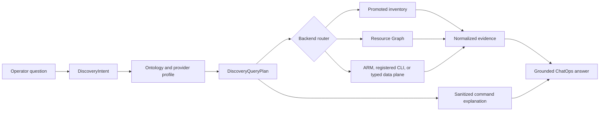

# Azure Resource Discovery Command Coverage

This document defines how FDAI can find every identifiable Azure resource in its authorized scope
and show the operator a reproducible Azure CLI or Azure Resource Graph command. It extends the
bounded read-investigation design without allowing the narrator to invent commands or widen scope.

> **Scope:** This design covers read-only resource discovery, command explanation, provider-type
> coverage, fallback selection, and coverage measurement. It does not authorize mutation, expose
> credentials, or turn arbitrary shell or Kusto text into a ChatOps tool.
>
> **Completeness boundary:** "Every resource" means every object in a declared discovery universe
> that the configured reader identity can enumerate. FDAI reports inaccessible, unsupported,
> data-plane-only, and unmapped objects as coverage gaps instead of claiming tenant-wide
> completeness.
>
> **Implementation status:** Catalog-owned resource `query_terms`, category terms, and deterministic
> `InventoryQuery` compilation are implemented for the selective inventory path. Azure Resource Graph
> and local CLI projection also separate shared ARM types with reviewed Azure `kind` tokens. The broader
> `DiscoveryIntent`, `DiscoveryQueryPlan`, provider profiles, unmapped-resource preservation,
> centralized fallback, and `CommandExplanation` remain target design.

## Design at a glance

FDAI compiles an operator question into a typed discovery intent, resolves that intent against an
Azure discovery-profile catalog, and chooses the narrowest verified backend. The same immutable
plan produces normalized evidence and a sanitized `CommandExplanation`, so the answer can show
how to reproduce the read without exposing the server's credentials or raw executed argv.



## Current baseline and gaps

The current path compiles common English and Korean inventory questions into an immutable
`InventoryQuery`. Production shards Azure Resource Graph (ARG) by each vocabulary entry's
`azure_arm_type`; interactive local uses ARG and falls back to `az resource list`.
Natural-language resource forms come from `resource-types.yaml`, so adding a reviewed type or term
does not require a Python alias edit. Concrete terms take precedence over generic category terms.
For shared ARM types, such as Web Apps and Function Apps under `Microsoft.Web/sites`, a full ARG row
must carry a matching `kind`; a source without that discriminator does not guess the semantic type.

The baseline does not satisfy comprehensive discovery:

- **Semantic coverage is selective:** The neutral vocabulary intentionally contains only the
  resource types needed by current operational verticals. Unknown Azure types are dropped instead
  of being returned as unmapped observations.
- **One mapping is insufficient:** Discovery can require another ARG table, several ARM types,
  parent expansion, a dedicated CLI extension, or a versioned REST endpoint.
- **The query and explanation surfaces are narrow:** Provider type, tags, scope kind, management
  group, KQL, CLI prerequisites, fallback reasons, and command explanations are absent.
- **ARG and ARM are partial:** Specialized ARG tables, provider-specific details, tenant directory
  objects, and data-plane objects require different typed plans and identities.

## Discovery universe

Completeness is measured per universe, not one successful query. The table defines target coverage.
Current scope is subscription plus configured groups; broader scope coverage is planned.

| Universe | Examples | Preferred discovery | Required fallback or gap state |
|----------|----------|---------------------|--------------------------------|
| Resource containers | Management groups, subscriptions, resource groups | ARG `ResourceContainers` | ARM scope APIs or explicit unavailable |
| ARM resources | Top-level and extension resources | ARG `Resources` | `az resource list`, ARM list API |
| ARM child resources | Subnets, SQL databases, agent pools, diagnostic settings | ARG table/type when indexed | Parent expansion, typed CLI/REST |
| ARG specialized objects | Policy, RBAC, health, advisor, security, alerts, support | Owning ARG table | Typed service API or unsupported |
| Resource details and state | VM instance view, configured NSG rules, peering state | Typed REST/provider | Registered dedicated CLI plan |
| Tenant directory objects | Entra applications, groups, service principals | Microsoft Graph typed provider | Explicitly outside ARM/ARG coverage |
| Service data-plane objects | Kubernetes workloads, blob containers, Key Vault objects | Separately authorized typed provider | Not covered by Reader inventory |

Each response states which universes were searched, which were skipped, and why. "No matches" is
valid only when every requested universe completed without truncation or authorization gaps.

## Ontology and provider mapping

The operating ontology should preserve two different meanings:

- **Semantic resource type:** The stable cloud-provider-neutral type used by rules, objectives,
  relationships, and actions, such as `compute.vm`.
- **Observed provider type:** The exact Azure type and scope observed during discovery, such as
  `Microsoft.Compute/virtualMachines` in `Resources`.

FDAI should not add every Azure provider type to the neutral ontology. A newly observed Azure type
is returned with `mapping_status=unmapped`, its bounded provider type, scope kind, and evidence
reference. Governance can later map it to an existing semantic type or add a reviewed neutral type.
The resource remains searchable before that mapping exists.

A versioned Azure discovery profile should be separate from the semantic type declaration. Each
profile records:

| Field | Purpose |
|-------|---------|
| `provider_type` | Exact case-insensitive ARM or Graph type. |
| `semantic_type` | Optional neutral type and mapping revision. |
| `scope_kinds` | Tenant, management group, subscription, resource group, resource, or data plane. |
| `arg_tables` | Ordered ARG tables and bounded projections. |
| `arm_plans` | Generic or typed REST operations with pinned API versions. |
| `cli_plans` | Registered command ids, versions, prerequisites, and output schemas. |
| `identity_profile` | Required reader capability without embedding a deployment role assignment. |
| `limits` | Page, row, byte, timeout, fan-out, and freshness bounds. |
| `provenance` | Microsoft reference, observed CLI version, validation time, and test receipt. |

Provider mappings are catalog data. Bragi may select a typed discovery intent, but it cannot write
a profile, KQL, URL, command id, extension name, or argv.

## Typed contracts

### Discovery intent

`DiscoveryIntent` extends the current query semantics without carrying executable text:

- result kind: `list`, `count`, `types`, `relationships`, or `coverage`;
- requested universes and predicates over name, type, group, location, tags, status, and links;
- server-owned scope plus freshness, result, page, byte, and wall-clock ceilings;
- whether a reproducible command explanation is requested.

Values remain bounded and normalized. A model-proposed intent has no authority until a
deterministic verifier accepts every field and rejects unresolved modifiers.

### Discovery query plan

`DiscoveryQueryPlan` is the immutable, replayable backend plan produced from the intent and a
specific discovery-profile revision. It records:

- backend kind and registered table or operation id, never operator-provided executable text;
- server-owned scope, authorization ceiling, compiled predicates, and bounded projection;
- pagination, stop conditions, output schema, and normalization mapping;
- fallback order and reasons a higher-priority backend was ineligible;
- catalog, Azure CLI, extension, and API versions used for validation.

One intent may fan out to several plans when its universe spans multiple ARG tables. Results merge
by canonical provider reference while preserving per-plan completeness and freshness.

### Command explanation

`CommandExplanation` is presentation evidence, not a shell execution receipt. It contains:

- a sanitized CLI and KQL template with placeholders such as `<subscription-id>`;
- command id, catalog version, backend, scope, CLI version, and extension prerequisites;
- result limits, pagination, validation status, and timestamp;
- redaction and substitution instructions;
- a statement when the server used REST or inventory and the shown CLI is only an equivalent
  reproduction command.

The renderer quotes only catalog-owned syntax and separately validated scalar values. It never
renders access tokens, tenant ids, live subscription ids, raw resource ids, shell operators,
environment assignments, or provider error text. The raw argv used by the server remains outside
the SPA and narrator context.

## Backend selection

This is the target routing order. Current transports use fixed paths without central plan merging.
The target router selects the narrowest backend that can prove the requested result:

1. **Promoted inventory:** Use a fresh complete snapshot when its provider-type coverage includes
   the requested universe and predicates.
2. **ARG:** Use the profile's owning table for cross-resource search, aggregation, relationships,
   or an object available only in ARG. Query templates are catalog-owned and KQL values are
   escaped by a dedicated compiler.
3. **Generic ARM:** Use `az resource list` or the subscription/resource-group list API for ordinary
   ARM resources not indexed by ARG or when ARG is unavailable.
4. **Typed ARM or dedicated CLI:** Use a registered plan for resource state, nested objects, or a
   provider-specific projection that generic discovery cannot prove.
5. **Typed data plane:** Use only a separately configured provider and identity profile. Never
   inherit permission from the ARM reader.

Backend failure does not silently widen scope or weaken predicates. The next fallback must satisfy
the same intent and output contract; otherwise the plan reports `unsupported` or `unavailable`.
Reaching a page or row cap reports `partial`; it never turns a truncated no-match into a complete empty result.

## Example: resource groups containing `fdai`

FDAI can show both equivalent read paths while identifying which one supplied the evidence.

```azurecli
az group list \
  --subscription <subscription-id> \
  --query "[?contains(name, 'fdai')].{name:name,location:location,tags:tags}" \
  --output json
```

```azurecli
az graph query \
  --subscriptions <subscription-id> \
  --graph-query "ResourceContainers | where type =~ 'microsoft.resources/subscriptions/resourcegroups' | where name contains 'fdai' | project id, name, subscriptionId, location, tags | order by name asc" \
  --first 1000 \
  --output json
```

For a general resource search, the same intent targets `Resources`. For a policy, role assignment,
health, or advisor question, the profile selects the owning specialized table instead of forcing
the query through `Resources`.

## Initial plan

An intuitive first plan is to add every known Azure type to `resource-types.yaml`, register one
Azure CLI command for each type, expose the command that ran, and fall back from dedicated CLI to
`az resource list` and then ARG.

This plan appears direct, but it combines semantic meaning, provider mechanics, runtime evidence,
and presentation into one catalog. It also treats a point-in-time Azure command list as complete.

## Critique of the initial plan

The initial plan fails under realistic Azure and ChatOps conditions:

- **Static lists decay:** Core CLI commands, extensions, API versions, and ARG table coverage change
  independently. A large checked-in list becomes stale without a reconciliation process.
- **Ontology pollution:** Thousands of provider types are not thousands of stable operational
  concepts. Copying Azure's namespace into the neutral ontology breaks portability and governance.
- **Wrong fallback order:** A dedicated CLI command may be absent, extension-dependent, slower, or
  less complete than ARG. Backend order must depend on the requested evidence, not command prestige.
- **False completeness:** Reader RBAC, Lighthouse delegation, ARG indexing, PII scrubbing,
  pagination, and provider registration can all hide objects. A successful query does not prove
  that the whole declared scope was searched.
- **Unsafe transparency:** Raw executed argv can contain deployment scope and exact resource ids.
  Sending it to the narrator or browser conflicts with existing evidence-minimization boundaries.
- **ARG overclaim:** ARG covers many ARM and governance objects but not every control-plane detail,
  tenant directory object, or service data-plane object.
- **Generic ARM underclaim:** `az resource list` cannot replace specialized ARG tables, instance
  views, provider-specific child listings, or data-plane enumeration.
- **Unbounded testing:** One hand-authored test per command and resource type cannot establish
  ongoing completeness across a changing platform.

## Improved implementation plan

1. **Baseline scenarios:** Measure bilingual cases for name, type, tag, scope, status,
  relationships, child resources, specialized ARG tables, CLI-only details, ARG-only objects,
  unknown types, authorization gaps, truncation, and no matches.
2. **Contracts and profiles:** Add provider-neutral discovery and explanation contracts plus a
  versioned Azure profile catalog. Preserve unmapped provider types.
3. **Compilers and routing:** Compile only bounded predicates and registered ARG syntax. Prove
  predicate equivalence before fallback and retain per-plan completeness during merge.
4. **Execution and explanation:** Register generic, ARG, and approved provider-specific reads.
  Generate `CommandExplanation` from the plan and validate CLI prerequisites at startup.
5. **ChatOps UX:** Render summary, searched scope, coverage, evidence source, and a collapsed
  reproduction block. Label equivalent commands that did not run.
6. **Coverage reconciliation:** Compare ARM metadata, ARG table types, Microsoft references,
  installed CLI extensions, registered profiles, and canary receipts. Propose inert catalog
  changes without installing extensions, enabling providers, widening RBAC, or editing ontology.
7. **Verification and rollout:** Start in observation mode. Gate each universe on contract and
  property tests, golden rendering, mocked pagination and fallback, and read-only live canaries.

## Coverage ledger and exit criteria

The coverage ledger is the proof surface. Each row is keyed by cloud, provider type, universe,
scope kind, backend, profile revision, and observed platform version.

| State | Meaning |
|-------|---------|
| `covered` | A validated plan completed within bounds and normalized the expected schema. |
| `fallback` | The preferred backend was unavailable, but an equivalent verified plan completed. |
| `partial` | Some pages, scopes, properties, or universes were unavailable or truncated. |
| `unsupported` | No registered read plan can satisfy the requested evidence contract. |
| `unauthorized` | The reader identity cannot enumerate the target scope or provider. |
| `unmapped` | The provider object was found but has no reviewed semantic type mapping. |

The first release is complete when:

- every competency scenario returns a typed plan or an explicit unsupported reason;
- resource groups and generic ARM resources support exact and contains-name discovery;
- every configured ARG table can enumerate its distinct provider types within fixed bounds;
- unknown provider types remain visible as unmapped results;
- CLI-only and ARG-only fixtures select the correct backend;
- every matched answer can render a validated, sanitized command explanation when requested;
- no command explanation contains a live tenant, subscription, resource id, credential, or shell
  control operator;
- no authorization failure, truncation, or skipped universe is rendered as an empty complete set;
- English and Korean scenario cohorts pass the same typed-query and authority checks.

## Decisions

- **Command transparency is derived:** FDAI shows a sanitized reproduction plan, not raw process
  argv or output.
- **Provider coverage is separate from semantic ontology:** Azure types can be discovered before
  they are mapped to a governed neutral type.
- **Completeness is explicit and scoped:** Every answer carries searched universes, truncation,
  authorization, freshness, and mapping status.
- **Arbitrary query remains unavailable:** Operators select typed intent. Catalog-owned compilers
  produce KQL, REST paths, and CLI argv.
- **Platform drift proposes changes:** Reconciliation creates inert reviewed candidates and never
  changes extensions, providers, permissions, or ontology automatically.

## Related docs

| To learn about | Read |
|----------------|------|
| Read-investigation execution and evidence | [Azure Read Investigations](azure-read-investigations.md) |
| ChatOps tools and narrator boundaries | [Operator Console](operator-console.md) |
| Shared semantic resource meaning | [Operating Ontology](../architecture/operating-ontology.md) |
| Reader and executor identity separation | [Security and Identity](../architecture/security-and-identity.md) |
