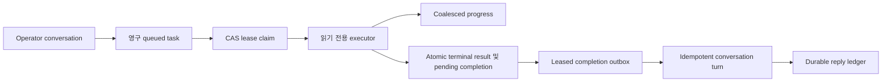

# 영구 Background Task Session

이 설계는 operator conversation에서 시작하는 영구 detached 읽기 전용 조사를 정의합니다. Task 및
attempt state, lease, progress, cancellation, restart 동작, conversation handoff, 사용자 delivery
경계, operator visibility를 다룹니다.

> **범위:** Background task는 cloud 변경을 실행하지 않습니다. Mutation 요청은 계속 typed
> control loop, safety check, 사람 승인, Thor 실행, rollback, Saga audit를 통과합니다.

## 설계 요약

Contributor가 제한된 task record를 만들면 실행을 기다리지 않고 `202`를 받습니다. Coordinator는
lease로 queued attempt를 claim하고, 격리된 typed read service를 실행하며, terminal result와 pending
completion을 하나의 transaction으로 저장합니다. 별도의 leased completion outbox가 provenance label이
있는 conversation turn을 추가하고 immutable reply를 durable conversation delivery ledger에 enqueue합니다.



## Contract 및 상태

`BackgroundTask`는 owner principal, origin conversation 및 channel, 읽기 전용 kind, 제한된 prompt,
context digest, capability profile, budget, correlation ID, idempotency key, creation time,
retention deadline을 저장합니다. 첫 profile은 `background.read-only`만 지원합니다.

`BackgroundTaskAttempt`는 execution history를 task definition과 분리합니다. 상태는 다음과 같습니다.

```text
queued -> claimed -> running -> succeeded | failed | cancelled | timed_out | unknown
```

Queued attempt에는 lease와 result가 없습니다. Claimed 및 running attempt에는 lease가 있고 result가
없습니다. Terminal attempt에는 변경할 수 없는 result가 있고 lease가 없습니다. Constructor와 database
constraint가 같은 규칙을 적용합니다.

각 terminal attempt에는 다음 state machine을 사용하는 completion outbox row 하나가 있습니다.

```text
pending -> sending -> delivered
                   -> failed -> sending
                   -> abandoned
```

`sending`만 lease를 가집니다. Claim과 함께 delivery attempt count가 증가하며 최대 8회로 제한됩니다.
`delivered`와 `abandoned`는 terminal completion state입니다.

## Claim, lease 및 restart 동작

PostgreSQL은 `FOR UPDATE SKIP LOCKED`로 queued row 하나를 claim합니다. Start, renew, completion은
하나의 conditional update에서 expected revision, lease token, 만료되지 않은 lease, 허용된 prior state를
요구합니다. 두 coordinator가 같은 attempt를 소유할 수 없습니다.

Coordinator는 executor가 active인 동안 lease를 renew합니다. 만료된 claimed 또는 running attempt는
제한된 reconciliation query를 통해 `unknown(process_lost)`이 됩니다. Queued로 돌아가지 않고 자동 retry도
하지 않습니다. 향후 retry는 명시적으로 retryable인 task kind 또는 operator-confirmed action에만 linked
attempt를 만듭니다.

## 실행 및 격리

제공되는 executor는 다음 조건으로 typed read-investigation service를 실행합니다.

- Server-owned scope, exact resource resolution, registered read tool 7개를 사용합니다.
- Narrator backend, parent screen state, transcript, hidden reasoning, mutable memory, event bus,
  Thor, executor identity를 전달하지 않습니다.
- Raw provider output 대신 normalized evidence result와 bounded semantic progress를 반환합니다.

Coordinator는 concurrency, wall time, token, cost, tool-call, progress, lease usage를 제한합니다. Timeout,
cancellation, executor error는 각각 구분된 terminal reason을 생성합니다.
Daily cost window는 task-provided timestamp가 아니라 store의 UTC clock을 사용합니다. Quota가 활성화된
경우 server time과 300초 넘게 차이 나는 creation timestamp는 insert 전에 차단되므로 caller가 task를
backdate 또는 future-date하여 다른 quota day를 선택할 수 없습니다.

## Progress 및 backpressure

Progress는 kind, 제한된 message, timestamp, usage로 구성됩니다. Reporter는 configured interval마다 최대
한 event를 기록하고 interval 안의 최신 update를 coalesce합니다. Store는 task별 event cap과 monotonic
sequence를 적용합니다. 임의 command log를 conversation record에 저장하지 않습니다.

인증된 operator는 GET 또는 server-sent events (SSE) stream으로 progress를 읽을 수 있습니다. Stream은
저장된 progress, running 중의 제한된 heartbeat, terminal event 하나를 전송하고 종료합니다. 다른 owner의
task는 없는 task와 같은 404 response를 사용합니다.

## Command 및 authorization

Production read API는 dedicated Azure reader binding이 설정된 경우에만 route를 등록합니다.

- `POST /background-tasks`는 Contributor `start-read-investigation` capability가 필요하고 즉시 반환합니다.
- `GET /background-tasks` 및 `GET /background-tasks/{task_id}`는 owner scope를 적용합니다.
- `GET /background-tasks/{task_id}/progress` 및 `/progress/stream`은 owner scope를 적용합니다.
- `POST /background-tasks/{task_id}/cancel`은 owner 또는 FDAI Owner가 필요합니다.

Create와 cancel은 기존 hash-chained state-store audit 경계를 통해 기록됩니다. Request body와 budget은
제한됩니다. Idempotency는 owner 및 key scope를 사용합니다.

## Completion outbox 및 retry

Terminal attempt update와 `pending` completion insert는 하나의 PostgreSQL transaction으로 commit됩니다.
Coordinator는 `FOR UPDATE SKIP LOCKED`로 due `pending` 또는 `failed` completion을 claim하고 row를
`sending`으로 변경하며, 최종 compare-and-set update에 lease token을 요구합니다. Sink publish timeout은
completion lease 이내로 제한됩니다.

Sink failure는 completion row만 변경합니다. Result를 다시 작성하거나 task execution을 다시 실행하지
않습니다. Retry는 bounded exponential backoff를 사용하고 coordinator가 가장 가까운 due completion
retry를 process 안에서 schedule합니다. External wake signal이나 새 task 생성을 기다리지 않습니다.
8회 시도 후 또는 다음 retry가 retention deadline에 도달하면 completion은 `abandoned`가 됩니다.

Process가 `sending` lease를 잃으면 reconciliation이 row를 due `failed`로 변경합니다. Attempt 또는
retention bound가 소진된 경우에는 `abandoned`로 변경합니다. 이후 coordinator는 investigation을
replay하지 않고 reconciled row를 claim할 수 있습니다.

## 완료 순서 및 replay

Completion audit, history turn 및 outbound-enqueue audit sequence는 안전하게 replay할 수 있습니다.
Sink는
`background-task.completed` 및 `background-task.delivery-enqueued` audit event를 durable state marker를
통해 기록하며, marker와 audit entry는 원자적으로 commit됩니다. Attempt 및 action별 deterministic
marker가 sink retry 중에도 해당 audit event를 한 번만 작성하게 합니다.

Conversation turn은 deterministic turn 및 idempotency ID, `[Background task result: ...]` label,
correlation metadata, `trusted=false`를 유지합니다. Outbound submit은 stable attempt origin을 재사용하므로
durable reply ledger도 replay를 deduplicate합니다. Provider delivery는 별도의 claim/lease/ack concern으로
남으며 외부 chat provider의 exactly-once delivery를 보장하지 않습니다.

## 운영 및 retention

List 및 detail projection은 status, budget, lease expiry, usage, progress, duration input, terminal reason을
표시합니다. 넓은 context를 제외하고 다른 principal의 task count를 노출하지 않습니다. Retention purge는
task attempt가 terminal이고 task retention deadline이 지났으며 completion이 `delivered` 또는
`abandoned`인 경우에만 row를 선택합니다. Attempt를 삭제하면 progress 및 completion outbox row가
cascade됩니다. 따라서 pending, sending 또는 retryable failed completion이 있으면 recovery를 위해 task
history가 유지됩니다.

Coordinator는 제한된 shutdown interval 동안 active work를 drain합니다. 남은 work는 process 안에서
cancel되고 process loss 뒤 lease가 만료되면 `unknown`이 됩니다.

## 검증

검증 범위에는 contract bound, mutation-profile 차단, concurrent claim, stale revision 및 lease 차단,
terminal immutability, owner 및 admin cancellation, progress sequence 및 cap, coalescing, bounded
concurrency, timeout, shutdown, task 및 completion process-loss reconciliation, atomic
terminal-plus-outbox commit, 8회 delivery bound, self-scheduled retry, retention purge predicate, live
PostgreSQL migration 및 restart, 즉시 HTTP response, RBAC, cross-owner hiding, SSE completion, 격리된
backend input, replay-idempotent conversation handoff가 포함됩니다.

## 관련 문서

| 알아볼 내용 | 문서 |
|-------------|------|
| 격리된 조사 worker | [제한된 작업 워커](../agents/bounded-task-workers-ko.md) |
| Operator conversation 경계 | [Operator Console](operator-console-ko.md) |
| 사용자 delivery durability | [영구 conversation delivery](durable-conversation-delivery-ko.md) |
| Runtime parity | [Runtime Parity](../deployment/dev-and-deploy-parity-ko.md) |
