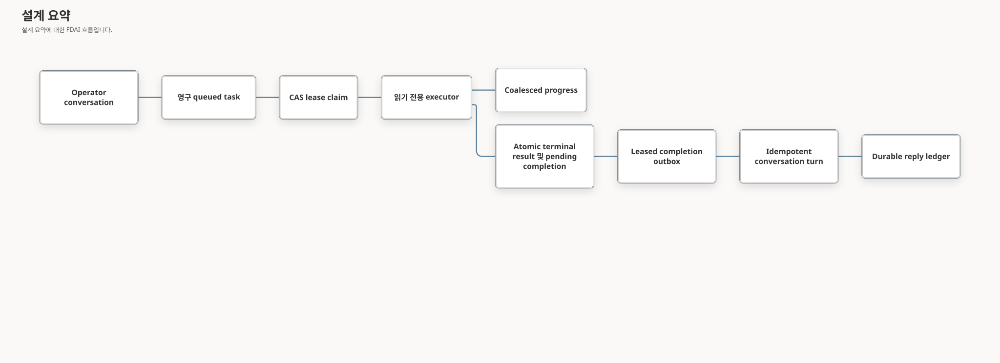

# 영구 Background 작업 세션

이 설계는 운영자 대화에서 시작하는 영구 detached 읽기 전용 조사를 정의합니다. 작업 및
시도 상태, 임차 기간, 진행 상황, 취소, 재시작 동작, 대화 인계, 사용자 전달
경계, 운영자 가시성을 다룹니다.

> **범위:** Background 작업은 cloud 변경을 실행하지 않습니다. 변경 요청은 계속 타입이 지정된
> control loop, safety 검사, 사람 승인, Thor 실행, 롤백, Saga 감사를 통과합니다.
> Direct 및 streamed 읽기 조사는 별도의 Core 소유 실행 원장과 append-only 진행 상황 저장소를
> 사용합니다. 플래너와 읽기 프로바이더는 공유하지만 이 detached 시도 상태 머신을 재사용하지 않습니다.

## 설계 요약

기여자가 제한된 작업 기록을 만들면 실행을 기다리지 않고 `202`를 받습니다. 조정기는
임차 기간으로 대기 중 시도를 점유하고, 격리된 타입이 지정된 읽기 서비스를 실행하며, 최종 결과와 pending
완료를 하나의 트랜잭션으로 저장합니다. 별도의 leased 완료 발신함이 출처 이력 라벨이
있는 대화 턴을 추가하고 변경할 수 없는 회신을 영속 대화 전달 원장에 큐에 추가합니다.



## 계약 및 상태

`BackgroundTask`는 소유자 principal, 출처 대화 및 채널, 읽기 전용 kind, 제한된 프롬프트,
맥락 다이제스트, 기능 프로파일, 예산, 상관관계 ID, 멱등성 키, creation 시간,
보존 기한을 저장합니다. 첫 프로파일은 `background.read-only`만 지원합니다.
새 작업은 읽기 조사의 책임 에이전트로 Heimdall도 기록합니다. 기계적인
`background-task-coordinator`는 별도의 실행 워커로 유지하며, 기존 레코드에는 에이전트
귀속을 추론하여 채우지 않고 null로 유지합니다.

`BackgroundTaskAttempt`는 실행 이력을 작업 정의와 분리합니다. 상태는 다음과 같습니다.

```text
queued -> claimed -> running -> succeeded | failed | cancelled | timed_out | unknown
```

대기 중 시도에는 임차 기간과 결과가 없습니다. Claimed 및 running 시도에는 임차 기간이 있고 결과가
없습니다. 최종 시도에는 변경할 수 없는 결과가 있고 임차 기간이 없습니다. 생성자와 database
제약이 같은 규칙을 적용합니다.

각 최종 시도에는 다음 상태 머신을 사용하는 완료 발신함 행 하나가 있습니다.

```text
pending -> sending -> delivered
          -> failed -> sending
          -> abandoned
```

`sending`만 임차 기간을 가집니다. 점유와 함께 전달 시도 개수가 증가하며 최대 8회로 제한됩니다.
`delivered`와 `abandoned`는 최종 완료 상태입니다.

## 점유, 임차 기간 및 재시작 동작

PostgreSQL은 `FOR UPDATE SKIP LOCKED`로 대기 중 행 하나를 점유합니다. 시작, renew, 완료는
하나의 conditional 갱신에서 예상 개정 번호, 임차 기간 토큰, 만료되지 않은 임차 기간, 허용된 이전 상태를
요구합니다. 두 조정기가 같은 시도를 소유할 수 없습니다.

조정기는 실행기가 활성인 동안 임차 기간을 renew합니다. 만료된 claimed 또는 running 시도는
제한된 조정 조회를 통해 `unknown(process_lost)`이 됩니다. 대기 중으로 돌아가지 않고 자동 재시도도
하지 않습니다. 향후 재시도는 명시적으로 retryable인 작업 kind 또는 operator-confirmed 액션에만 linked
시도를 만듭니다.

## 실행 및 격리

목표 실행기는 다음 조건으로 타입이 지정된 read-investigation 서비스를 실행합니다.

- 서버가 소유한 범위, exact 리소스 해석, 등록된 읽기 도구 7개를 사용합니다.
- Narrator 백엔드, 상위 screen 상태, transcript, hidden reasoning, 변경 가능한 기억, event 버스,
 Thor, 실행기 신원을 전달하지 않습니다.
- Raw 프로바이더 출력 대신 정규화된 근거 결과와 범위가 제한된 semantic 진행 상황을 반환합니다.

조정기는 동시성, wall 시간, 토큰, 비용, tool-call, 진행 상황, 임차 기간 사용량을 제한합니다. 시간 초과,
취소, 실행기 오류는 각각 구분된 최종 사유를 생성합니다.
Daily 비용 구간은 task-provided 시각이 아니라 저장소의 UTC 시계를 사용합니다. 할당량이 활성화된
경우 서버 시간과 300초 넘게 차이 나는 creation 시각은 삽입 전에 차단되므로 호출자가 작업을
backdate 또는 future-date하여 다른 할당량 일을 선택할 수 없습니다.

## 진행 상황 및 backpressure

진행 상황은 kind, 제한된 message, 시각, 사용량 및 영속적인 append-order 키로 구성됩니다.
보고기는 구성된 간격마다 최대 한 이벤트를 기록하고 간격 안의 최신 갱신을 coalesce합니다. 저장소는
작업별 event 상한, 작업별 단조 증가 sequence 및 전역 단조 증가 append order를 적용합니다.
별도의 트랜잭션형 projection outbox는 재생 cursor를 전진시키는 대신 미게시 snapshot 및
progress 행을 lease로 점유하므로, 동시 트랜잭션의 commit 순서가 뒤바뀌어도 작업이 누락되지
않습니다. 임의 명령 로그를 대화 기록에 저장하지 않습니다.

목표 Operator API에서는 인증된 운영자가 GET 또는 server-sent events (SSE) 스트림으로 진행
상황을 읽을 수 있습니다. 최종 snapshot은 명시적인 progress watermark를 함께 전달하므로 스트림은
저장된 진행 상황, running 중이거나 선행 progress를 기다리는 동안의 제한된 하트비트, 그리고
projected progress watermark가 충족된 뒤의 최종 event 하나만 전송하고 종료합니다. 다른
소유자의 작업은 없는 작업과 같은 404 응답을 사용합니다.

## Command 및 권한 확인

독립 Operator Service는 고정된 conversation-family 매니페스트에서 다음 경로를 항상 구성합니다.
각 경로는 호출자 권한을 확인하고 주입된 변환 결과 판독기, 제안 발신함 또는 이벤트 스트림으로
위임합니다. 의존성이 없으면 `503`으로 닫힙니다. 버전이 지정된
`background-task-projection` `1.0.0` 전송 계약은 task, progress, completion 쓰기와
같은 트랜잭션 안에서 채워지는 영속 projection outbox에서 Core 소유 snapshot 및 progress
레코드를 점유한 뒤 Operator 소유 `operator_background_task_projection` 및
`operator_background_task_progress` 테이블로 반영합니다. Operator 경로는 이제 이
테이블만 읽고 Core `background_task_*` 테이블을 직접 조회하지 않습니다.

목표 background-task 구체화 로직은 다음 작업별 계약을 적용합니다.

- `POST /background-tasks`는 기여자 `start-read-investigation` 기능이 필요하고 즉시 반환합니다.
- `GET /background-tasks` 및 `GET /background-tasks/{task_id}`는 소유자 범위를 적용합니다.
- `GET /background-tasks/{task_id}/progress` 및 `/progress/stream`은 소유자 범위를 적용합니다.
- `POST /background-tasks/{task_id}/cancel`은 소유자 또는 FDAI Owner가 필요합니다.

생성과 취소는 기존 hash-chained state-store 감사 경계를 통해 기록됩니다. 요청 본문과 예산은
제한됩니다. 멱등성은 소유자 및 키 범위를 사용합니다.

교차 프로세스 읽기 조사 취소 명령은 정본 작업 identity를 대상으로 합니다. Core는 이를 대화형
실행 원장 또는 이 detached 작업 저장소 중 하나로 경로하고 선택된 상태 머신의 단일 writer를
유지합니다. Operator SSE 응답을 닫는 것은 취소 명령이 아닙니다. 전달 구독자만 분리하며 활성
영속 실행 또는 작업은 계속됩니다.

## 완료 발신함 및 재시도

최종 시도 갱신과 `pending` 완료 삽입은 하나의 PostgreSQL 트랜잭션으로 커밋됩니다.
조정기는 `FOR UPDATE SKIP LOCKED`로 due `pending` 또는 `failed` 완료를 점유하고 행을
`sending`으로 변경하며, 최종 compare-and-set 갱신에 임차 기간 토큰을 요구합니다. 싱크 publish 시간 초과는
완료 임차 기간 이내로 제한됩니다.

싱크 실패는 완료 행만 변경합니다. 결과를 다시 작성하거나 작업 실행을 다시 실행하지
않습니다. 재시도는 범위가 제한된 exponential 재시도 대기를 사용하고 조정기가 가장 가까운 due 완료
재시도를 프로세스 안에서 예약합니다. 외부 wake 신호이나 새 작업 생성을 기다리지 않습니다.
8회 시도 후 또는 다음 재시도가 보존 기한에 도달하면 완료는 `abandoned`가 됩니다.
싱크가 구성되지 않은 경우에도 조정은 보존 기한에 남아 있는 `pending` 완료를
`abandoned(retention_expired)`로 종료합니다. 최종 전이는 스키마 동등성을 위해 범위가 제한된
전달 시도 1회를 기록하며, 기존 정리가 작업을 다시 실행하지 않고 제거할 수 있게 합니다.

프로세스가 `sending` 임차 기간을 잃으면 조정이 행을 due `failed`로 변경합니다. 시도 또는
보존 한계가 소진된 경우에는 `abandoned`로 변경합니다. 이후 조정기는 조사를
재생하지 않고 reconciled 행을 점유할 수 있습니다.

## 완료 순서 및 재생

완료 감사, 이력 턴 및 outbound-enqueue 감사 순서는 안전하게 재생할 수 있도록 설계됩니다.
최종 projection 전송은 completion 시점의 progress watermark를 가변 task snapshot과 분리해
저장하며, 점유 쿼리는 해당 watermark 이하의 미게시 progress 행이 모두 확인되기 전에는 최종
snapshot을 넘기지 않습니다. 따라서 재생은 snapshot을 backlog에 묶어 두지 않으면서도 선행
progress가 보이기 전에 클라이언트가 종료되지 않게 합니다. 목표 싱크는
`background-task.completed` 및 `background-task.delivery-enqueued` 감사 이벤트를 영속 상태
표시를 통해 기록하며, 표시와 감사 항목은 원자적으로 커밋됩니다. 시도 및 액션별 결정론적
표시가 싱크 재시도 중에도 해당 감사 이벤트를 한 번만 작성하게 합니다.

대화 턴은 결정론적 턴 및 멱등성 ID, `[Background task result: ...]` 라벨,
상관관계 메타데이터, `trusted=false`를 유지합니다. Outbound 제출은 고정된 시도 출처를 재사용하므로
영속 회신 원장도 재생을 deduplicate합니다. 프로바이더 전달은 별도의 점유/임차 기간/ack 관심사로
남으며 외부 chat 프로바이더의 exactly-once 전달을 보장하지 않습니다.

## 운영 및 보존

목록 및 상세 변환 결과는 상태, 예산, 임차 기간 만료, 사용량, 진행 상황, 소요 시간 입력, 최종 사유를
표시합니다. 응답 계약은 최대 500자의 요청 요약, 최대 2,000자의 결과 요약, 최대 16개의 근거 참조,
잘림 표시, null이 가능한 책임 에이전트 귀속 및 별도의 실행 워커 라벨도 지원합니다. 버전이 지정된
전송 계약은 이제 이러한 범위 제한 필드를 `operator_background_task_projection`에 채우고,
`operator_background_task_progress`는 작업별로 범위가 제한된 진행 이력을 유지합니다.
Operator는 자기 소유 변환 결과 테이블만 읽고 넓은 맥락이나 다른 principal의 작업 개수를
노출하지 않습니다. Operator 보존 워커는 계약 기한이 지나면 만료된 변환 결과 행과 고아가 된 진행
레코드를 삭제합니다. 보존 정리는
작업 시도가 최종이고 작업 보존 기한이 지났으며 완료가 `delivered` 또는
`abandoned`인 경우에만 행을 선택합니다. 시도를 삭제하면 진행 상황 및 완료 발신함 행이
cascade됩니다. 따라서 pending, sending 또는 retryable 실패한 완료가 있으면 복구를 위해 작업
이력이 유지됩니다.

조정기는 제한된 종료 간격 동안 활성 작업을 배출합니다. 남은 작업은 프로세스 안에서
취소되고 프로세스 loss 뒤 임차 기간이 만료되면 `unknown`이 됩니다.

요청으로 생성된 attempt는 생성 감사 claim fence 뒤에서 시작합니다. Task store는 멱등적인
StateStore 표식과 감사 항목이 commit되고 서비스가 attempt에 표식을 기록하기 전에는 해당 attempt를
claim할 수 있게 만들지 않습니다. 재전달은 같은 표식을 재사용하고 claim fence만 복구합니다. 따라서
감사 또는 표식 실패는 감사되지 않은 provider 읽기를 허용하지 않고 영속 작업을 claim 불가 상태로
유지합니다.

## 검증

집중 핵심 테스트는 계약 한계, mutation-profile 차단, 동시 점유, stale 개정 번호 및 임차 기간
차단, 최종 immutability, 소유자 및 admin 취소, 진행 상황 순서 및 상한, coalescing, 범위가
제한된 동시성, 시간 초과, 종료, 작업 및 완료 process-loss 조정, atomic terminal-plus-outbox
커밋, 8회 전달 한계, self-scheduled 재시도, 보존 정리 조건식 및 replay-idempotent 대화 인계를
검증합니다. PostgreSQL 제품군은 지원되는 로컬 서비스에서 이행, 점유, 할당량, 재시작 읽기,
조정, 재시도 및 정리를 검증합니다.

Operator 제품군 테스트는 고정 경로, 권한 확인 묶음, 본문 한계, 취소 제안 분류,
background-task 목록, 상세, 진행 상황, 유한 SSE 재생, 다른 소유자에 대한 404 동등성 및
닫힘 실패 `503` 동작을 검증합니다. 집중 교차 프로세스 테스트는 이제 요청 및 취소 publish,
Core의 wake 전 영속화, 타입이 지정된 detached 실행 및 취소, 버전이 지정된 작업 snapshot 및
progress 게시, Operator 소유 변환 결과 upsert, 중복 및 reorder 안전성, 다른 소유자 격리를
입증합니다. 관리되는 재시작 및 deployed 전달 근거는 아래 프로덕션 검증 작업에 남아 있습니다.

## 구현 상태

### 구현 범위

| 영역 | 상태 | 근거 | 참고 |
|------|------|------|------|
| 핵심 레코드, 할당량, 저장소 및 조정기 로직 | implemented | `services/core-control-plane/src/fdai/core/background_task/`; `services/core-control-plane/tests/core/background_task/` | 범위가 제한된 레코드, 상태 전이, 할당량 결정, 메모리 내 저장소, 임차 기간 조정기, 재시도 예약, 취소 및 종료 동작에 focused 단위 테스트가 있습니다. 새 작업은 Heimdall 책임 귀속을 영속화하며 기존 레코드는 null 귀속을 유지할 수 있습니다. |
| PostgreSQL 작업 및 완료 영속성 | implemented | `alembic/versions/20260720_0040_background_task.py`; `alembic/versions/20260722_0051_background_task_completion.py`; `alembic/versions/20260829_0088_background_task_completion_updated_at.py`; `service-migrations/branches/core-control-plane/versions/20260826_core_background_task_runtime_grants.py`; `service-migrations/branches/core-control-plane/versions/20260829_core_background_task_progress_order.py`; `services/core-control-plane/src/fdai/delivery/persistence/postgres_background_task.py`; `services/core-control-plane/src/fdai/delivery/persistence/postgres_background_task_completion.py`; 집중 live PostgreSQL 테스트(`19 passed`, skip 없음) | 격리된 지원 로컬 데이터베이스에서 원자적 점유, 임차 기간, 할당량, 진행 상황, 완료 발신함, 조정, 재시도, 재시작 읽기, 보존 정리, lease 만료 후 projection outbox 재생, progress-before-terminal 점유 순서, 그리고 동시 commit reorder 안전성을 입증했습니다. 추가된 completion `updated_at`, 최종 progress watermark 및 트랜잭션형 projection outbox가 wall-clock 또는 append-order cursor 없이도 전달 상태 재생을 결정론적으로 유지합니다. 관리되는 runtime 근거는 별도입니다. |
| 프로덕션 실행기 및 조정기 구성 | implemented | `services/core-control-plane/src/fdai/core/background_task/read_investigation_executor.py`; `services/core-control-plane/src/fdai/runtime/read_investigation_runtime.py`; 집중 실행기, consumer, runtime, coordinator 및 PostgreSQL 테스트 | 선택적 Core binding은 타입이 지정된 실행기, 영속 저장소, 감독되는 coordinator, 요청 consumer, 조정 loop, 할당량, 취소, 범위가 제한된 종료 및 background-task projection 게시자를 생성하며 다른 서비스를 만들거나 실행 권한을 부여하지 않습니다. |
| Core-to-Operator 작업 변환 결과 전송 계약 | implemented | `packages/service-contracts/src/fdai_service_contracts/background_task_projection.py`; `services/core-control-plane/src/fdai_core_service/background_task_projection.py`; `services/core-control-plane/src/fdai/delivery/persistence/postgres_background_task_projection_feed.py`; `services/operator-service/src/fdai_operator_service/background_task_projection_runtime.py`; `services/operator-service/src/fdai_operator_service/postgres_background_task_projection.py`; `service-migrations/branches/operator-service/versions/20260829_operator_background_task_projection_transport.py`; 집중 계약, producer, consumer, 경로, migration 및 소유권 테스트 | Core는 source 쓰기 트랜잭션 안에서 채워지는 영속 claim/lease outbox에서 버전이 지정된 snapshot 및 progress 레코드를 게시합니다. Progress는 watermark 계약을 위해 append-order identity를 유지하고, 최종 snapshot은 그 watermark로 미게시 progress를 기다리며, Operator는 이를 `operator_background_task_projection` 및 `operator_background_task_progress`에 반영하고, 중복 및 오래된 reorder를 제거하며, purge된 projection을 되살리지 않도록 만료된 source 행을 무시하고, Core `background_task_*` 테이블 권한을 더 이상 받지 않습니다. |
| 완료 싱크 및 영속 대화 인계 | in-progress | Core EventBus 완료 싱크, `read-investigation-completion` `1.0.0`, Operator 완료 저장소, consumer, 대화 writer 및 migration grant, 집중 완료 및 권한 검사 | Core는 기존 임차 발신함에서 변경할 수 없는 최종 결과 하나를 publish합니다. Operator 운영 조립은 exact 제안에 결속된 inbox 레코드와 멱등적인 Web assistant turn 하나를 원자적으로 수락합니다. 채널 outbound enqueue, completion inbox 보존 및 통제된 재시작 근거는 열린 상태입니다. |
| Operator API 경로, 변환 결과 및 진행 상황 스트림 | implemented | `services/operator-service/src/fdai_operator_service/families/conversation/background_tasks.py`; `services/operator-service/src/fdai_operator_service/postgres_family_store.py`; `services/operator-service/src/fdai_operator_service/postgres_background_task_projection.py`; `service-migrations/branches/operator-service/versions/20260829_operator_background_task_projection_transport.py`; 집중 변환 결과, PostgreSQL 및 제품군 테스트 | 소유자 조건을 적용한 SQL이 Operator 소유 변환 결과 테이블만 사용해 범위가 제한된 목록, 상세, 진행 상황 및 유한 SSE 재생을 구체화하고 다른 소유자에 대해 같은 404를 반환합니다. 최대 500자의 요청 요약, 최대 2,000자의 결과 요약, 최대 16개의 근거 참조, 잘림 표시 및 null이 가능한 Heimdall 책임 귀속을 채웁니다. Operator 런타임은 자기 변환 결과 테이블만 쓰며 Core background-task 읽기 권한은 갖지 않습니다. |
| FDAI Console 작업 컨트롤 | in-progress | `console/src/routes/background-tasks.tsx`; `console/src/routes/background-tasks.css`; `console/src/routes/background-tasks.model.ts`; `console/src/routes/background-tasks.model.test.ts` | 이중 언어 읽기 전용 경로는 요청한 작업, 에이전트 책임, 결과와 근거 및 활동 타임라인을 우선 표시합니다. 기술 사용량은 별도로 펼쳐서 볼 수 있습니다. 기존 레코드는 명시적인 사용할 수 없음 및 귀속 미기록 상태로 표시합니다. 해당 API consumer가 없으므로 생성, 취소, 재시도 또는 실행 컨트롤은 의도적으로 제공하지 않습니다. |
| 감사, 원격 분석 및 운영 근거 | in-progress | `services/core-control-plane/src/fdai/core/background_task/service.py`; `services/core-control-plane/src/fdai/delivery/persistence/background_task_lifecycle_audit.py`; `services/core-control-plane/src/fdai/delivery/persistence/background_task_completion_audit.py` | 운영 생성 및 취소는 멱등적인 StateStore lifecycle 표식을 사용합니다. 생성은 표식이 commit될 때까지 영속 claim fence 뒤에 유지됩니다. 완료 표식 영속성도 구현되고 검증됐지만 운영 완료 싱크, 런타임 원격 분석, 재시작 증적 또는 관리되는 전달 근거는 없습니다. |

### 구현 이력

| 날짜 | 상태 | 변경 | 근거 | 남은 작업 |
|------|------|------|------|-----------|
| 2026-08-19 | implemented | Coordinator test fixture에서 실제 시간에 따른 만료를 제거했습니다. 2026-07-20으로 고정된 task가 30일 동안만 데이터를 보존했기 때문에 실제 clock이 2026-08-19에 persistence 및 retry assertion 전에 attempt를 purge하기 시작했습니다. 이제 fixture는 production retention 동작을 바꾸지 않고 결정론적인 nonexpiring horizon을 사용합니다. | [이슈 #218](https://github.com/dotnetpower/fdai/issues/218). 두 failure는 parent revision에서 재현되고 fixture 수정 뒤 통과합니다. Focused coordinator 파일은 case 6개와 Ruff 및 format 검사를 통과했습니다. | Fixture 만료에 남은 작업은 없습니다. Production composition은 아래에서 별도로 추적합니다. |
| 2026-08-13 | in-progress | 구현 ledger를 도입했으며 이전 출처 이력은 재구성하지 않았습니다. | 현재 owner 문서 쌍 변경과 구현 범위 표에 나열된 focused core, PostgreSQL 및 Operator API 검사입니다. | 실행기, 조정기, 완료 싱크, API 구체화 로직, Console 컨트롤, live 영속성 검사 및 관리되는 운영 근거를 연결해야 합니다. |
| 2026-08-14 | implemented | 격리된 지원 로컬 PostgreSQL database에서 모든 focused background-task 영속성 case를 실행하고 실행 후 database를 삭제했습니다. | `current change`; `services/core-control-plane/tests/persistence/test_background_task.py`; `12 passed`, skip 없음. | 프로덕션 executor와 completion sink를 조립하고 Operator 및 Console surface를 materialize하며 governed 운영 근거를 보존합니다. |
| 2026-08-16 | in-progress | 결정론적 대화 턴을 추가하고 영속 전달 원장으로 변경할 수 없는 회신을 제출하는 완료 싱크를 구현했습니다. | `pytest services/core-control-plane/tests/core/background_task/`가 턴과 전달 레코드 하나를 재사용하는 재생, 최종 상태 전용 게시, 신뢰되지 않는 턴, 닫힘 실패 채널 처리를 포함해 집중 테스트 29개를 통과했습니다. | 싱크와 조정기를 프로덕션 조립에 연결하고 완료 감사 표시를 추가하며 관리되는 전달 증적을 보존해야 합니다. |
| 2026-08-23 | in-progress | 독립 Operator Service 및 대화 런타임 업데이트 이후 detached 작업 경계를 다시 점검했습니다. 경로 매니페스트와 일반 권한 확인, 제안 및 스트림 묶음은 구현되어 있지만 background 작업을 구체화하거나 실행하지 않으므로 구현 범위의 상태를 승격하지 않았습니다. | `current change`; `uv run pytest -q --no-cov services/core-control-plane/tests/core/background_task services/operator-service/tests/test_operator_conversation_family.py` (`39 passed`); `services/operator-service/src/fdai_operator_service/families/conversation/`; `services/operator-service/src/fdai_operator_service/family_adapters.py`. | 일반 shadow 처리를 작업 전용 어댑터로 교체하고 실행기와 조정기를 연결하며 Console 컨트롤 및 관리되는 운영 근거를 추가해야 합니다. |
| 2026-08-23 | in-progress | 원자적 완료 감사 표시, 최소 권한 PostgreSQL 접근을 사용하는 소유자 범위 background-task 읽기 구체화 로직, 이중 언어 읽기 전용 Console 경로를 추가했습니다. 하드닝 12회에서 결정론적 최종 재생, 256자 식별자, 오래된 상세 응답, 안전한 `503` 묶음, PostgreSQL 감사 모드, 완전한 256개 진행 이벤트 재생 및 정상 상태 전이 조정을 수정했습니다. 쓰기 또는 실행 권한은 추가하지 않았고 Low 잔여 tradeoff만 남았습니다. | `current change`; 집중 backend 슬라이스(`108 passed`), 최종 Operator 슬라이스(`21 passed`), Console 탐색/모델 슬라이스(`28 passed`), Ruff, strict mypy, Console typecheck, 프로덕션 build 및 bundle gate, catalog 18쌍 동등성, service-migration inventory 및 단일 Operator migration head. 인증된 표준 포트 로컬 Console 읽기에서 소유자 범위 작업 4개, progress 이벤트 2개와 전달 완료 상태가 있는 선택된 최종 상세 하나, document/main/detail 가로 overflow 0 및 44 px 모바일 상세 명령을 확인했습니다. | 프로덕션 제안 consumer와 detached 조정기 전송을 정의하고 연결한 뒤 생성/취소 컨트롤과 관리되는 배포 근거를 추가해야 합니다. |
| 2026-08-23 | in-progress | 새로 생성된 읽기 조사에 영속 Heimdall 책임 귀속을 추가하고 읽기 전용 Console을 요청한 작업, 책임 에이전트, 결과, 근거 및 활동 중심으로 다시 설계했습니다. API 계약은 책임 에이전트와 기계적 실행 워커를 분리하며 기존 레코드의 귀속은 null로 유지합니다. | `current change`; `services/core-control-plane/src/fdai/core/background_task/`; `services/operator-service/src/fdai_operator_service/families/conversation/background_tasks.py`; `console/src/routes/background-tasks.tsx`; `console/src/routes/background-tasks.css`; 집중 Operator 변환 결과 테스트(`8 passed`), Console decoder 테스트(`6 passed`), Ruff, source mypy, Console typecheck, 프로덕션 build 및 bundle gate. 인증된 390 px 표준 포트 화면에서 문서, 상세 및 타임라인의 가로 overflow 0과 44 px 상세 명령을 측정했습니다. | 소유자 범위 PostgreSQL 판독기에서 범위가 제한된 설명, 근거 및 에이전트 필드를 채워야 합니다. 프로덕션 생성/취소 consumer와 detached 조정기 구성도 남아 있습니다. |
| 2026-08-23 | implemented | 버전이 지정된 시작 및 취소 consumer를 타입이 지정된 읽기 전용 실행기와 감독되는 Core coordinator에 연결했습니다. 하드닝으로 동시 tick을 직렬화하고 후속 작업을 잃지 않으면서 wake burst를 coalesce했으며 반복 취소 권한을 보존하고 wire 제어문자 drift를 차단하고 UTC 자정을 넘는 PostgreSQL active 할당량을 유지했습니다. | `current change`; 집중 교차 프로세스, background-task, PostgreSQL, Operator projection, 토픽 및 로컬 환경 게이트 152개가 skip 또는 warning 없이 통과했고 할당량 검사가 로컬 PostgreSQL에서 통과했습니다. | 버전이 지정된 최종 완료 인계를 정의하고 Operator 소유 대화 전달 경로를 연결하며 관리되는 재시작 및 전달 근거를 보존합니다. |
| 2026-08-23 | implemented | 운영 완료 싱크가 없을 때도 보존을 제한했습니다. In-memory 및 PostgreSQL 조정은 보존 기한에 최종 상태가 아닌 완료를 abandoned로 바꾸고, 최종 정리는 변경할 수 없는 결과를 다시 작성하거나 조사를 다시 실행하지 않고 작업, 진행 상황 및 발신함 행을 제거합니다. | `current change`; 집중 in-memory 보존 검사 1개와 pending-to-abandoned-to-purge 회귀를 포함한 격리 PostgreSQL 영속성 검사 15개가 skip 없이 통과했습니다. | 사용자 전달을 주장하기 전에 버전이 지정된 완료 전송을 정의하고 연결합니다. |
| 2026-08-23 | implemented | 멱등적인 StateStore lifecycle 감사 writer와 생성 감사 claim fence를 추가했습니다. 감사 또는 표식 실패는 영속 요청을 claim 불가 상태로 유지하고, 재전달은 감사 표식 하나를 재사용하며 표식이 영속된 뒤에만 fence를 해제합니다. Detached 전용 binding에서 사용하지 않는 direct/streamed 정책 및 실행 저장소 생성을 제거했습니다. | `current change`; 집중 메모리 및 runtime 검사 42개, lifecycle 및 전체 PostgreSQL 영속성 검사 20개가 skip 없이 통과했고 Ruff와 strict mypy가 통과했습니다. | 최종 완료 전달을 정의하고 연결한 뒤 관리되는 재시작 및 전달 근거를 보존합니다. |
| 2026-08-26 | implemented | 보호된 복구 중 detached 조정기가 `background_task_attempt`를 조정할 때 `permission denied`가 발생해 명시적 Core migration grant를 추가했습니다. 이제 runtime 역할은 attempt에 CRUD, progress에 읽기와 추가, completion에 읽기, 추가 및 갱신 권한만 받으며 `PUBLIC` 권한은 계속 해제됩니다. | `current change`; `20260826_core_background_task_runtime_grants.py`; 집중 migration grant 회귀 검사 통과. | 정확히 증명된 Core 이미지를 build 및 배포하고 보호된 서비스 workflow로 migration을 적용한 뒤, 배포된 검증을 주장하기 전에 crash-free 재시작 증적을 보존합니다. |
| 2026-08-26 | 진행 중 | Operator 완료 inbox와 Web 대화 writer를 추가했습니다. Service migration은 `conversation_record` 읽기, 삽입 및 갱신과 append-only `conversation_turn`을 부여하고, readiness는 해당 exact 쓰기와 inbox sequence 권한이 없으면 실패 시 닫힙니다. 하나의 writable CTE가 조사를 다시 실행하지 않고 제안, turn 및 inbox를 dedupe합니다. | `current change`; 집중 Operator readiness, 완료 저장소 및 migration 권한 검사가 통과했습니다. | 채널 outbound enqueue, 보존 정리 및 통제된 process-loss 근거를 추가합니다. |
| 2026-08-29 | implemented | Operator Service의 Core `background_task_*` 직접 읽기를 버전이 지정된 Core-to-Operator 변환 결과 전송 계약으로 교체했습니다. Core는 자기 영속 작업 테이블에서 결정론적인 snapshot 및 progress 레코드를 게시하고, Operator는 이를 소유자 범위 변환 결과 테이블에 반영하며 중복과 오래된 reorder를 억제하고 기한 기반 정리를 수행합니다. 새 Operator migration은 기존 Core 테이블 읽기 권한도 함께 철회합니다. | `current change`; `packages/service-contracts/tests/test_background_task_projection.py`(`5 passed`); `services/core-control-plane/tests/core/background_task/test_projection_transport.py`와 `services/core-control-plane/tests/runtime/test_read_investigation_runtime.py`(합계 `18 passed`); `services/operator-service/tests/test_background_task_projection.py`, `test_postgres_background_task_projection.py`, `test_background_task_projection_transport.py`, `test_operator_conversation_family.py`, `test_read_investigation_completion_composition.py`, `test_operator_service_postgres.py`, `test_semantic_kafka_adapter.py`(합계 `130 passed`); `tests/integration/services/test_service_migration_inventory.py`와 `tests/integration/scripts/test_service_test_suites.py`(합계 `87 passed`). | completion 전달을 위한 channel binding resolution 및 durable outbound enqueue를 추가하고, 그다음 `validated`를 주장하기 전에 governed 재시작 및 runtime telemetry 근거를 남겨야 합니다. |

### 남은 작업

- [x] 지원되는 로컬 서비스에서 모든 focused PostgreSQL 사례를 실행하고 건너뛴 사례 없이 점유, 임차 기간, 할당량, 발신함, 조정, 재시도, 재시작 및 정리 근거가 통과했음을 기록합니다.
- [x] 버전이 지정된 요청 전송을 통해 범위가 제한된 시작, 임차 기간 갱신, 조정, 취소, 할당량 및 종료 동작과 함께 프로덕션 읽기 전용 실행기를 구현하고 `BackgroundTaskCoordinator`를 Core 런타임에 구성합니다.
- [x] 조사를 다시 실행하지 않고 결정론적 대화 턴을 추가하고 영속 전달 원장을 통해 변경할 수 없는 회신을 제출하도록 완료 싱크를 구현합니다.
- [x] `background-task.completed`와 `background-task.delivery-enqueued`를 원자적 단일 기록 StateStore 표시로 작성하고 동시 재생 및 충돌 테스트를 추가합니다.
- [x] 버전이 지정된 최종 완료 계약, Core publisher, Operator inbox 및 멱등적인 Web assistant-turn writer를 Core에 Operator 대화 쓰기 권한을 주지 않고 정의하고 연결합니다.
- [x] Core `background_task_*` 직접 읽기를 버전이 지정된 `background-task-projection` 전송 계약으로 교체하고, Core snapshot 및 progress 게시, Operator 소유 변환 결과 테이블, 중복 및 reorder 처리, 닫힘 실패 보존 및 readiness를 함께 구현합니다.
- [ ] 채널 binding 해석과 영속 outbound enqueue를 추가하고 계약 기한에 inbox 행을 정리하며 통제된 재시도 및 재시작 근거를 보존합니다.
- [x] 다른 소유자에 대한 404 동등성과 최소 권한 Operator 변환 결과 읽기를 포함하여 Operator API 경로 뒤에 소유자 범위 목록, 상세, 진행 상황 및 유한 SSE 재생을 구체화합니다.
- [x] 소유자 범위 PostgreSQL 작업 조회 두 곳에서 최대 500자의 요청 요약, 최대 2,000자의 결과 요약, 최대 16개의 근거 참조, 잘림 표시 및 null이 가능한 Heimdall 귀속을 채우고 집중 변환 결과 및 잘못된 귀속 거부 테스트를 통과합니다.
- [x] 소유자 범위, digest 검증, wake 전 영속화 및 명시적 poison-record 처리를 보존하며 버전이 지정된 프로덕션 전송을 통해 생성 및 취소 제안을 소비합니다.
- [x] 집중 decoder 테스트와 함께 이중 언어 FDAI Console 작업 목록, 상세, 진행 상황 및 명시적 새로 고침 화면을 추가하고 변경 컨트롤은 제공하지 않습니다.
- [ ] 프로덕션 제안 consumer가 권위 있는 작업 및 취소 증적을 반환한 뒤에만 Console 생성 및 취소 컨트롤을 추가합니다.
- [x] 멱등적인 생성 및 취소 lifecycle 감사를 운영 요청 consumer에 연결하고 생성 감사가 영속되기 전에는 claim을 차단합니다.
- [ ] 어느 영역이든 `validated`로 승격하기 전에 관리되는 재시작, 프로세스 손실, 완료 재시도, 보존, 전달 및 runtime 원격 분석 증적을 기록합니다.

## 관련 문서

| 알아볼 내용 | 문서 |
|-------------|------|
| 격리된 조사 워커 | [제한된 작업 워커](../agents/bounded-task-workers-ko.md) |
| Operator 대화 경계 | [Operator Console](operator-console-ko.md) |
| 사용자 전달 내구성 | [영구 대화 전달](durable-conversation-delivery-ko.md) |
| 런타임 parity | [런타임 Parity](../deployment/dev-and-deploy-parity-ko.md) |
