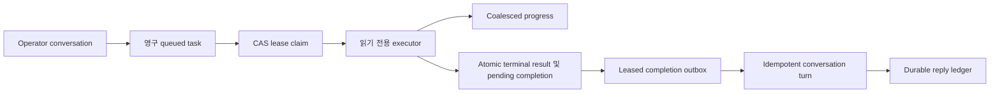

# 영구 Background 작업 세션

이 설계는 운영자 대화에서 시작하는 영구 detached 읽기 전용 조사를 정의합니다. 작업 및
시도 상태, 임차 기간, 진행 상황, 취소, 재시작 동작, 대화 인계, 사용자 전달
경계, 운영자 가시성을 다룹니다.

> **범위:** Background 작업은 cloud 변경을 실행하지 않습니다. 변경 요청은 계속 타입이 지정된
> control loop, safety 검사, 사람 승인, Thor 실행, 롤백, Saga 감사를 통과합니다.

## 설계 요약

기여자가 제한된 작업 기록을 만들면 실행을 기다리지 않고 `202`를 받습니다. 조정기는
임차 기간으로 대기 중 시도를 점유하고, 격리된 타입이 지정된 읽기 서비스를 실행하며, 최종 결과와 pending
완료를 하나의 트랜잭션으로 저장합니다. 별도의 leased 완료 발신함이 출처 이력 라벨이
있는 대화 턴을 추가하고 변경할 수 없는 회신을 영속 대화 전달 원장에 큐에 추가합니다.


```mermaid
flowchart LR
  USER[Operator conversation] --> CREATE[영구 queued task]
  CREATE --> CLAIM[CAS lease claim]
  CLAIM --> RUN[읽기 전용 executor]
  RUN --> PROGRESS[Coalesced progress]
  RUN --> RESULT[Atomic terminal result 및 pending completion]
  RESULT --> OUTBOX[Leased completion outbox]
  OUTBOX --> TURN[Idempotent conversation turn]
  TURN --> DELIVERY[Durable reply ledger]
```

## 계약 및 상태

`BackgroundTask`는 소유자 principal, 출처 대화 및 채널, 읽기 전용 kind, 제한된 프롬프트,
맥락 다이제스트, 기능 프로파일, 예산, 상관관계 ID, 멱등성 키, creation 시간,
보존 기한을 저장합니다. 첫 프로파일은 `background.read-only`만 지원합니다.

`BackgroundTaskAttempt`는 실행 이력을 작업 정의와 분리합니다. 상태는 다음과 같습니다.

```text
queued -> claimed -> running -> succeeded | failed | cancelled | timed_out | unknown
```

대기 중 시도에는 임차 기간과 결과가 없습니다. Claimed 및 running 시도에는 임차 기간이 있고 결과가
없습니다. 최종 시도에는 변경할 수 없는 결과가 있고 임차 기간이 없습니다. 생성자와 database
제약이 같은 규칙을 적용합니다.

각 최종 시도에는 다음 상태 머신을 사용하는 완료 발신함 행 하나가 있습니다.

```text
pending -> sending -> delivered
          -> failed -> sending
          -> abandoned
```

`sending`만 임차 기간을 가집니다. 점유와 함께 전달 시도 개수가 증가하며 최대 8회로 제한됩니다.
`delivered`와 `abandoned`는 최종 완료 상태입니다.

## 점유, 임차 기간 및 재시작 동작

PostgreSQL은 `FOR UPDATE SKIP LOCKED`로 대기 중 행 하나를 점유합니다. 시작, renew, 완료는
하나의 conditional 갱신에서 예상 개정 번호, 임차 기간 토큰, 만료되지 않은 임차 기간, 허용된 이전 상태를
요구합니다. 두 조정기가 같은 시도를 소유할 수 없습니다.

조정기는 실행기가 활성인 동안 임차 기간을 renew합니다. 만료된 claimed 또는 running 시도는
제한된 조정 조회를 통해 `unknown(process_lost)`이 됩니다. 대기 중으로 돌아가지 않고 자동 재시도도
하지 않습니다. 향후 재시도는 명시적으로 retryable인 작업 kind 또는 operator-confirmed 액션에만 linked
시도를 만듭니다.

## 실행 및 격리

제공되는 실행기는 다음 조건으로 타입이 지정된 read-investigation 서비스를 실행합니다.

- 서버가 소유한 범위, exact 리소스 해석, 등록된 읽기 도구 7개를 사용합니다.
- Narrator 백엔드, 상위 screen 상태, transcript, hidden reasoning, 변경 가능한 기억, event 버스,
 Thor, 실행기 신원을 전달하지 않습니다.
- Raw 프로바이더 출력 대신 정규화된 근거 결과와 범위가 제한된 semantic 진행 상황을 반환합니다.

조정기는 동시성, wall 시간, 토큰, 비용, tool-call, 진행 상황, 임차 기간 사용량을 제한합니다. 시간 초과,
취소, 실행기 오류는 각각 구분된 최종 사유를 생성합니다.
Daily 비용 구간은 task-provided 시각이 아니라 저장소의 UTC 시계를 사용합니다. 할당량이 활성화된
경우 서버 시간과 300초 넘게 차이 나는 creation 시각은 삽입 전에 차단되므로 호출자가 작업을
backdate 또는 future-date하여 다른 할당량 일을 선택할 수 없습니다.

## 진행 상황 및 backpressure

진행 상황은 kind, 제한된 message, 시각, 사용량으로 구성됩니다. 보고기는 구성된 간격마다 최대
한 이벤트를 기록하고 간격 안의 최신 갱신을 coalesce합니다. 저장소는 작업별 event 상한과 단조 증가
순서를 적용합니다. 임의 명령 로그를 대화 기록에 저장하지 않습니다.

인증된 운영자는 GET 또는 server-sent events (SSE) 스트림으로 진행 상황을 읽을 수 있습니다. 스트림은
저장된 진행 상황, running 중의 제한된 하트비트, 최종 event 하나를 전송하고 종료합니다. 다른 소유자의
작업은 없는 작업과 같은 404 응답을 사용합니다.

## Command 및 권한 확인

운영 Operator API는 dedicated Azure reader 연결이 설정된 경우에만 경로를 등록합니다.

- `POST /background-tasks`는 기여자 `start-read-investigation` 기능이 필요하고 즉시 반환합니다.
- `GET /background-tasks` 및 `GET /background-tasks/{task_id}`는 소유자 범위를 적용합니다.
- `GET /background-tasks/{task_id}/progress` 및 `/progress/stream`은 소유자 범위를 적용합니다.
- `POST /background-tasks/{task_id}/cancel`은 소유자 또는 FDAI Owner가 필요합니다.

생성과 취소는 기존 hash-chained state-store 감사 경계를 통해 기록됩니다. 요청 본문과 예산은
제한됩니다. 멱등성은 소유자 및 키 범위를 사용합니다.

## 완료 발신함 및 재시도

최종 시도 갱신과 `pending` 완료 삽입은 하나의 PostgreSQL 트랜잭션으로 커밋됩니다.
조정기는 `FOR UPDATE SKIP LOCKED`로 due `pending` 또는 `failed` 완료를 점유하고 행을
`sending`으로 변경하며, 최종 compare-and-set 갱신에 임차 기간 토큰을 요구합니다. 싱크 publish 시간 초과는
완료 임차 기간 이내로 제한됩니다.

싱크 실패는 완료 행만 변경합니다. 결과를 다시 작성하거나 작업 실행을 다시 실행하지
않습니다. 재시도는 범위가 제한된 exponential 재시도 대기를 사용하고 조정기가 가장 가까운 due 완료
재시도를 프로세스 안에서 예약합니다. 외부 wake 신호이나 새 작업 생성을 기다리지 않습니다.
8회 시도 후 또는 다음 재시도가 보존 기한에 도달하면 완료는 `abandoned`가 됩니다.

프로세스가 `sending` 임차 기간을 잃으면 조정이 행을 due `failed`로 변경합니다. 시도 또는
보존 한계가 소진된 경우에는 `abandoned`로 변경합니다. 이후 조정기는 조사를
재생하지 않고 reconciled 행을 점유할 수 있습니다.

## 완료 순서 및 재생

완료 감사, 이력 턴 및 outbound-enqueue 감사 순서는 안전하게 재생할 수 있습니다.
싱크는
`background-task.completed` 및 `background-task.delivery-enqueued` 감사 이벤트를 영속 상태 표시를
통해 기록하며, 표시와 감사 항목은 원자적으로 커밋됩니다. 시도 및 액션별 결정론적
표시가 싱크 재시도 중에도 해당 감사 이벤트를 한 번만 작성하게 합니다.

대화 턴은 결정론적 턴 및 멱등성 ID, `[Background task result: ...]` 라벨,
상관관계 메타데이터, `trusted=false`를 유지합니다. Outbound 제출은 고정된 시도 출처를 재사용하므로
영속 회신 원장도 재생을 deduplicate합니다. 프로바이더 전달은 별도의 점유/임차 기간/ack 관심사로
남으며 외부 chat 프로바이더의 exactly-once 전달을 보장하지 않습니다.

## 운영 및 보존

List 및 상세 변환 결과는 상태, 예산, 임차 기간 만료, 사용량, 진행 상황, 소요 시간 입력, 최종 사유를
표시합니다. 넓은 맥락을 제외하고 다른 principal의 작업 개수를 노출하지 않습니다. 보존 정리는
작업 시도가 최종이고 작업 보존 기한이 지났으며 완료가 `delivered` 또는
`abandoned`인 경우에만 행을 선택합니다. 시도를 삭제하면 진행 상황 및 완료 발신함 행이
cascade됩니다. 따라서 pending, sending 또는 retryable 실패한 완료가 있으면 복구를 위해 작업
이력이 유지됩니다.

조정기는 제한된 종료 간격 동안 활성 작업을 배출합니다. 남은 작업은 프로세스 안에서
취소되고 프로세스 loss 뒤 임차 기간이 만료되면 `unknown`이 됩니다.

## 검증

검증 범위에는 계약 한계, mutation-profile 차단, 동시 점유, stale 개정 번호 및 임차 기간 차단,
최종 immutability, 소유자 및 admin 취소, 진행 상황 순서 및 상한, coalescing, 범위가 제한된
동시성, 시간 초과, 종료, 작업 및 완료 process-loss 조정, atomic
terminal-plus-outbox 커밋, 8회 전달 한계, self-scheduled 재시도, 보존 정리 조건식, live
PostgreSQL 이행 및 재시작, 즉시 HTTP 응답, RBAC, cross-owner hiding, SSE 완료, 격리된
백엔드 입력, replay-idempotent 대화 인계가 포함됩니다.

## 구현 상태

### 구현 범위

| 영역 | 상태 | 근거 | 참고 |
|------|------|------|------|
| 핵심 레코드, 할당량, 저장소 및 조정기 로직 | implemented | `services/core-control-plane/src/fdai/core/background_task/`; `services/core-control-plane/tests/core/background_task/` | 범위가 제한된 레코드, 상태 전이, 할당량 결정, 메모리 내 저장소, 임차 기간 조정기, 재시도 예약, 취소 및 종료 동작에 focused 단위 테스트가 있습니다. |
| PostgreSQL 작업 및 완료 영속성 | in-progress | `alembic/versions/20260720_0040_background_task.py`; `alembic/versions/20260722_0051_background_task_completion.py`; `services/core-control-plane/src/fdai/delivery/persistence/postgres_background_task.py`; `services/core-control-plane/src/fdai/delivery/persistence/postgres_background_task_completion.py`; `services/core-control-plane/tests/persistence/test_background_task.py` | 스키마, 작업 저장소 및 완료 발신함은 있지만 모든 focused live 사례에 `FDAI_DATABASE_URL`이 필요하며 현재 근거 확인에서는 건너뛰었습니다. |
| 프로덕션 실행기 및 조정기 구성 | not-started | `services/core-control-plane/src/fdai/core/background_task/coordinator.py`; `services/core-control-plane/src/fdai/runtime/` | 실행기는 테스트 대역으로 실행되는 프로토콜이며 조정기를 시작하는 프로덕션 런타임 구성이 없습니다. |
| 완료 싱크 및 영속 대화 인계 | not-started | `services/core-control-plane/src/fdai/core/background_task/coordinator.py`; `services/core-control-plane/tests/core/background_task/test_coordinator.py` | 싱크 재시도는 테스트 대역으로 모델링하고 검사하지만 대화 턴을 추가하거나 영속 회신을 제출하는 프로덕션 싱크는 없습니다. |
| Operator API 경로, 변환 결과 및 진행 상황 스트림 | in-progress | `services/operator-service/src/fdai_operator_service/families/conversation/manifest.py`; `services/operator-service/src/fdai_operator_service/families/conversation/factory.py`; `services/operator-service/tests/test_operator_conversation_family.py` | 경로 선언과 일반 제안/읽기 전달은 있지만 권위 있는 목록, 상세, 진행 상황, 취소 및 SSE 구체화 로직은 구현되지 않았습니다. |
| FDAI Console 작업 컨트롤 | not-started | `console/src` | 현재 source 클라이언트는 background 작업을 생성, 조회, 점검, 스트리밍 또는 취소하지 않습니다. |
| 감사, 원격 분석 및 운영 근거 | in-progress | `services/core-control-plane/src/fdai/core/background_task/service.py` | 생성 및 취소 감사 호출은 프로토콜 뒤에 있지만 프로덕션 감사 연결, 런타임 원격 분석, 재시작 증적 또는 관리되는 전달 근거는 확인되지 않았습니다. |

### 구현 이력

| 날짜 | 상태 | 변경 | 근거 | 남은 작업 |
|------|------|------|------|-----------|
| 2026-08-13 | in-progress | 구현 ledger를 도입했으며 이전 출처 이력은 재구성하지 않았습니다. | 현재 owner 문서 쌍 변경과 구현 범위 표에 나열된 focused core, PostgreSQL 및 Operator API 검사입니다. | 실행기, 조정기, 완료 싱크, API 구체화 로직, Console 컨트롤, live 영속성 검사 및 관리되는 운영 근거를 연결해야 합니다. |

### 남은 작업

- [ ] 지원되는 로컬 서비스에서 모든 focused PostgreSQL 사례를 실행하고 건너뛴 사례 없이 점유, 임차 기간, 할당량, 발신함, 조정, 재시도, 재시작 및 정리 근거가 통과했음을 기록합니다.
- [ ] 프로덕션 읽기 전용 실행기를 구현하고 범위가 제한된 시작, 임차 기간 갱신, 조정 및 종료 동작과 함께 `BackgroundTaskCoordinator`를 런타임에 구성합니다.
- [ ] 조사를 다시 실행하지 않고 결정론적 대화 턴을 추가하고 영속 전달 원장을 통해 변경할 수 없는 회신을 제출하도록 완료 싱크를 구현합니다.
- [ ] 선언된 Operator API 경로 뒤에 소유자 범위 목록, 상세, 진행 상황, 취소 및 SSE 작업을 구체화하고 cross-owner 404 동등성과 재생 안전 제안 처리를 포함합니다.
- [ ] Focused 상호 작용 및 접근성 검사와 함께 FDAI Console 작업 생성, 진행 상황, 상세 및 취소 컨트롤을 추가합니다.
- [ ] 감사 및 원격 분석을 프로덕션 surface에 연결한 후 어느 영역이든 `validated`로 승격하기 전에 관리되는 재시작, 프로세스 손실, 완료 재시도, 보존 및 전달 증적을 기록합니다.

## 관련 문서

| 알아볼 내용 | 문서 |
|-------------|------|
| 격리된 조사 워커 | [제한된 작업 워커](../agents/bounded-task-workers-ko.md) |
| Operator 대화 경계 | [Operator Console](operator-console-ko.md) |
| 사용자 전달 내구성 | [영구 대화 전달](durable-conversation-delivery-ko.md) |
| 런타임 parity | [런타임 Parity](../deployment/dev-and-deploy-parity-ko.md) |
