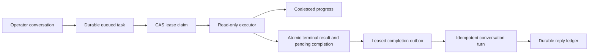

# Durable Background Task Sessions

This design defines durable, detached read-only investigations started from an operator
conversation. It covers task and attempt state, leases, progress, cancellation, restart behavior,
conversation handoff, user delivery boundaries, and operator visibility.

> **Scope:** Background tasks do not execute cloud changes. Mutation requests continue through the
> typed control loop, safety checks, human approval, Thor execution, rollback, and Saga audit.

## Design at a glance

A Contributor creates a bounded task record and receives `202` without waiting for execution. A
coordinator claims the queued attempt with a lease, runs the isolated typed read service, and stores
the terminal result together with a pending completion in one transaction. A separately leased
completion outbox appends the provenance-labeled conversation turn and enqueues the immutable reply
through the durable conversation delivery ledger.



## Contracts and state

`BackgroundTask` stores the owner principal, origin conversation and channel, read-only kind,
bounded prompt, context digest, capability profile, budgets, correlation ID, idempotency key,
creation time, and retention deadline. The only initial profile is `background.read-only`.

`BackgroundTaskAttempt` separates execution history from the task definition. Its state is:

```text
queued -> claimed -> running -> succeeded | failed | cancelled | timed_out | unknown
```

Queued attempts have no lease or result. Claimed and running attempts have a lease and no result.
Terminal attempts have an immutable result and no lease. Constructor and database constraints
apply the same rule.

Each terminal attempt has one completion outbox row with this state machine:

```text
pending -> sending -> delivered
                   -> failed -> sending
                   -> abandoned
```

Only `sending` carries a lease. A claim increments the delivery attempt count, which is bounded at
eight. `delivered` and `abandoned` are terminal completion states.

## Claims, leases, and restart behavior

PostgreSQL claims one queued row with `FOR UPDATE SKIP LOCKED`. Start, renew, and completion require
the expected revision, lease token, nonexpired lease, and allowed prior state in one conditional
update. Two coordinators cannot own the same attempt.

The coordinator renews its lease while the executor is active. An expired claimed or running
attempt becomes `unknown(process_lost)` through a bounded reconciliation query. It is not returned
to queued and is not automatically retried. A future retry creates a linked attempt only for an
explicitly retryable task kind or an operator-confirmed action.

## Execution and isolation

The shipped executor runs the typed read-investigation service with:

- A server-owned scope, exact resource resolution, and the seven registered read tools.
- No narrator backend, parent screen state, transcript, hidden reasoning, mutable memory, event bus,
  Thor, or executor identity.
- A normalized evidence result and bounded semantic progress instead of raw provider output.

The coordinator bounds concurrency, wall time, token, cost, tool-call, progress, and lease usage.
Timeout, cancellation, and executor error each produce a distinct terminal reason.
Daily cost windows use the store's UTC clock rather than a task-provided timestamp. When quota is
enabled, a creation timestamp more than 300 seconds from server time is rejected before insertion,
so a caller cannot select another quota day by backdating or future-dating a task.

## Progress and backpressure

Progress is structured as kind, bounded message, timestamp, and usage. The reporter emits at most
one event per configured interval and coalesces newer updates within that interval. The store
applies a per-task event cap and monotonic sequence. It never stores arbitrary command logs in the
conversation record.

Authenticated operators can read progress through GET or a server-sent events (SSE) stream. The
stream emits stored progress, bounded heartbeats while running, and one terminal event before it
closes. Cross-owner tasks use the same 404 response as missing tasks.

## Commands and authorization

The production read API registers routes only when a dedicated Azure reader binding is configured:

- `POST /background-tasks` requires the Contributor `start-read-investigation` capability and returns
  immediately.
- `GET /background-tasks` and `GET /background-tasks/{task_id}` are owner-scoped.
- `GET /background-tasks/{task_id}/progress` and `/progress/stream` are owner-scoped.
- `POST /background-tasks/{task_id}/cancel` requires the owner or an FDAI Owner.

Create and cancel are audited through the existing hash-chained state-store audit boundary. Request
bodies and budgets are bounded. Idempotency is scoped by owner and key.

## Completion outbox and retries

The terminal attempt update and `pending` completion insertion commit in one PostgreSQL transaction.
The coordinator claims due `pending` or `failed` completions with `FOR UPDATE SKIP LOCKED`, changes
the row to `sending`, and requires the lease token for the final compare-and-set update. The sink
publish timeout is bounded by the completion lease.

A sink failure changes only the completion row. It never rewrites the result or reruns task
execution. Retry uses bounded exponential backoff, and the coordinator schedules its nearest due
completion retry in process. It does not wait for an external wake signal or a newly created task.
After eight attempts, or when the next retry reaches retention, the completion becomes `abandoned`.

If a process loses a `sending` lease, reconciliation changes the row to due `failed`, or to
`abandoned` when the attempt or retention bound is exhausted. A later coordinator can claim the
reconciled row without replaying the investigation.

## Completion ordering and replay

The completion audit, history turn, and outbound-enqueue audit sequence is safe to replay. The
sink writes
`background-task.completed` and `background-task.delivery-enqueued` audit events through durable
state markers that commit the marker and audit entry atomically. A deterministic marker per
attempt and action keeps those audit events single-write across sink retries.

The conversation turn keeps deterministic turn and idempotency IDs, a
`[Background task result: ...]` label, correlation metadata, and `trusted=false`. The outbound
submit reuses the stable attempt origin, so the durable reply ledger also deduplicates replay.
Provider delivery remains a separate claim/lease/ack concern and does not claim exactly-once
delivery from external chat providers.

## Operations and retention

List and detail projections expose status, budget, lease expiry, usage, progress, duration inputs,
and terminal reason. They omit broad context and do not expose another principal's task count.
Retention purge selects a row only when the task attempt is terminal, the task retention deadline
has elapsed, and completion is `delivered` or `abandoned`. Deleting the attempt cascades its
progress and completion outbox rows. A pending, sending, or retryable failed completion therefore
keeps the task history available for recovery.

The coordinator drains active work for a bounded shutdown interval. Remaining work is cancelled in
process and becomes `unknown` when its lease expires after process loss.

## Verification

Coverage includes contract bounds, mutation-profile denial, concurrent claims, stale revision and
lease rejection, terminal immutability, owner and admin cancellation, progress sequence and cap,
coalescing, bounded concurrency, timeout, shutdown, task and completion process-loss reconciliation,
atomic terminal-plus-outbox commit, eight-attempt delivery bounds, self-scheduled retry, retention
purge predicates, live PostgreSQL migration and restart, immediate HTTP response, RBAC, cross-owner
hiding, SSE completion, isolated backend inputs, and replay-idempotent conversation handoff.

## Related docs

| To learn about | Read |
|----------------|------|
| Isolated investigation workers | [Bounded Task Workers](../agents/bounded-task-workers.md) |
| Operator conversation boundaries | [Operator Console](operator-console.md) |
| User delivery durability | [Durable Conversation Delivery](durable-conversation-delivery.md) |
| Runtime parity | [Runtime Parity](../deployment/dev-and-deploy-parity.md) |
