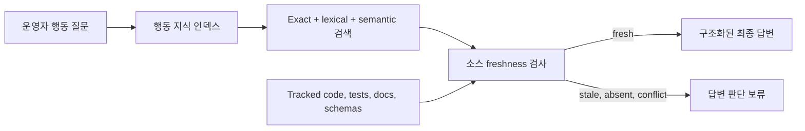

# Command Deck 행동 지식

이 설계는 Command Deck이 일반 답변에 소스 코드를 포함하지 않고 구조화된 계약을 통해 FDAI
시스템 동작을 설명하는 방식을 정의합니다. 답변에 사용하는 행동 지식과 권위 및 freshness
확인에만 사용하는 소스 근거를 분리합니다.

> 범위: 행동 검색은 읽기 전용입니다. 검색된 근거는 액션을 승인, 실행, 승격하거나 다른 방식으로
> 권한을 부여할 수 없습니다.

## 설계 요약

Command Deck은 저장소 소스 chunk가 아니라 `BehaviorKnowledgeIndex`를 검색합니다. 각 결과는
trigger, preconditions, processing steps, outcomes, exclusions, safety behavior, owner,
implementation status, 제한된 provenance를 제공합니다. 소스 파일과 테스트는 계약을 검증하고
stale record를 찾는 두 번째 계층으로 유지합니다.

## 2계층 계약

### 행동 지식 인덱스

`BehaviorSpec`은 기본 검색 단위입니다. 다음 정보를 포함합니다.

- **Identity**: `behavior_id`, `subject_kind`, `subject_id`입니다.
- **Status**: `implemented`, `configured`, `designed`, `not_applicable`입니다.
- **Answer structure**: 질문 alias, trigger, preconditions, processing steps, outcomes,
  exclusions, safety behavior입니다.
- **Localized content**: locale별로 같은 structured field를 제공합니다. 한국어 content도 검색에
  참여하며 model에 source evidence 번역을 요청하지 않고 렌더링합니다.
- **Ownership**: 행동을 담당하는 에이전트 또는 서브시스템입니다.
- **Index metadata**: 384차원 embedding, indexed commit, extractor version, source manifest
  hash입니다.

색인된 텍스트는 명령이 아니라 데이터입니다. Command Deck은 서버 소유 경로에서 구조화된 필드를
렌더링하며 검색 콘텐츠를 승인 또는 실행 권한으로 취급하지 않습니다.

### 소스 근거

`BehaviorSource`는 다음 citation metadata만 기록합니다.

- source kind: `code`, `test`, `doc`, `schema`;
- 저장소 상대 path와 symbol;
- line start와 line end;
- Git blob hash;
- authority role: implementation, verification, design, configuration.

소스 본문은 chat evidence에 포함되지 않습니다. 일반 답변은 path, symbol, line range, blob hash,
indexed commit을 표시할 수 있지만 raw code는 표시하지 않습니다.

## 검색 및 권위

reference index와 PostgreSQL adapter는 같은 정렬 계약을 사용합니다.

1. 정확한 question alias 일치를 가장 먼저 정렬합니다.
2. 정확한 identifier와 normalized subject-token overlap을 그다음에 정렬합니다. Token
  normalization은 Latin identifier와 한국어 조사를 분리하고 단순 영문 복수형을 정규화합니다.
3. Minimum score를 넘은 lexical 검색과 384차원 semantic 검색을 결합합니다.
4. 같은 match class에서는 implemented 및 test-backed record가 designed-only record보다 먼저 옵니다.
5. 비교 질문은 하나를 임의 선택하지 않고 fresh contract 두 개를 결합합니다.
6. Stable `behavior_id`로 결정적 tie-break를 수행합니다.

PostgreSQL adapter는 `tsvector`, `pg_trgm`, pgvector cosine similarity를 결합합니다. In-memory
adapter는 exact 및 authority 순서를 동일하게 유지하고 lexical 및 semantic candidate에
reciprocal-rank fusion을 사용합니다. OpenSearch는 이 설계에 포함되지 않습니다. 실제 corpus 크기,
query rate, sharding 또는 aggregation 요구가 PostgreSQL 경계를 넘는다는 측정 결과가 있을 때만
향후 index adapter를 검토합니다.

## Freshness 및 conflict 동작

저장소 validator는 `git ls-files`에서 allowlist를 만듭니다. Tracked path만 hash하므로 ignored file,
generated artifact, local environment file, secret, Terraform state 및 plan, log, untracked file은
source evidence에 들어갈 수 없습니다.

근거가 불확실하면 Command Deck은 더 안전한 결과를 선택합니다.

- **Fresh**: 구조화된 behavior와 citation을 렌더링합니다.
- **Stale blob hash**: 현재 behavior로 확정하지 않고 재색인을 요청합니다.
- **Conflicting exact contracts**: 하나를 임의로 고르지 않고 답변을 검토 대상으로 보류합니다.
- **No evidence or unavailable index**: 검증 가능한 behavior evidence가 없다고 표시합니다.
- **Implementation과 design 차이**: implemented 및 test-backed evidence를 우선하고 designed-only
  record를 별도로 식별합니다.

## 행동 범위

Built-in seed set은 13개 contract를 포함합니다. 초기 3개에 architecture contract 10개를
추가했습니다.

| Behavior | Owner | Implemented evidence |
|----------|-------|----------------------|
| 결정적 Incident ID와 member merge | `IncidentRegistry` | Incident registry code와 lifecycle test |
| Odin cross-domain arbitration 및 non-intervention | `Odin`, trigger owner는 `Forseti` | Forseti/Odin code, arbitration code, arbitration test |
| Issue fingerprint deduplication | `Saga` | Saga code, governance test, Issue lifecycle schema |
| Trust routing 및 T2 quality gate | `TrustRouter`, `QualityGate` | Core implementation과 focused test |
| 사람 승인 및 shadow promotion | `RiskGate`, `Var`, `ActionPromotionRegistry` | Agent/core implementation과 regression test |
| Executor safety, event deduplication, rollback | `ShadowExecutor`, `EventIngest`, `Vidar` | Core/agent implementation과 idempotency test |
| Console identity boundary 및 local evidence parity | Read API composition과 `Thor` | Configuration contract와 local read-API test |
| Narrator translator-only path | `Bragi` | Agent implementation과 typed-pipeline re-entry test |

Odin 계약은 single-domain 및 unanimous recommendation을 명시적으로 제외합니다. Portfolio review는
designed-only로, temporal fairness는 선택적 dependency-injected behavior로 표시합니다.

## Command Deck 답변 경로

Repository resolver는 첫 chat evidence lookup에서 한 번 초기화됩니다. Tracked seed source만
hash하고 process lifetime 동안 in-memory index를 유지합니다. 각 질문에 대해 read API는 다음
단계를 수행합니다.

1. Client가 제공한 behavior evidence를 제거합니다.
2. Server-owned behavior index에서 evidence를 조회합니다. Retrieval floor보다 score가 낮으면
  behavior evidence를 반환하지 않고 다음 authority path에 turn을 넘깁니다.
3. 관련 없는 operational, agent, tool, glossary, web evidence 경로를 건너뜁니다.
4. Narrator backend를 호출하지 않고 deterministic evidence fast path를 사용합니다.
5. Freshness를 검증하고 question focus를 선택한 다음 localized 필수 section을 렌더링합니다.
6. Terminal verification metadata에 citation reference를 반환합니다.

답변은 항상 trigger, preconditions, processing steps, outcomes, exclusions, safety and fallback
behavior, owner, implementation status, citations 또는 provenance 구조를 사용합니다.

## 구현 상태

배포된 동작을 정확히 표현하도록 현재 구현을 다음과 같이 구분합니다.

- **Implemented**: shared `BehaviorSpec`, localized `BehaviorContent`, `BehaviorSource`,
  `BehaviorKnowledgeIndex` 계약; in-memory hybrid index; tracked-source freshness validator;
  built-in behavior seed 13개;
  server-owned chat resolver; deterministic terminal renderer 및 verifier; PostgreSQL/pgvector
  adapter; offline test와 live-database rank parity test.
- **Designed, not production-bound**: generated PostgreSQL schema migration, production composition
  binding, incremental index 또는 sync CLI입니다. 이 기능이 구현되기 전에는 read API가 tracked
  checkout의 repository seed를 사용하며 repository metadata를 사용할 수 없으면 답변을 보류합니다.

## 검증

Focused test는 exact alias priority, normalized subject ranking, idempotent reindexing, stale hash,
implemented 및 test-backed authority, source citation shape와 symbol precision, source body
exclusion, client evidence replacement, prompt-injection isolation, comparison, localization,
PostgreSQL/in-memory rank parity를 검사합니다. Frozen architecture holdout paraphrase 20개는 routing,
status, current citation, precise symbol, authority, structure, fact, exclusion 및 safety,
localization, directness를 평가합니다. 2026-07-20 측정 결과는 `10.0/10`입니다. 20개 질문이 모두
정확히 route되었고 cold initialization은 46.6 ms, warm 200 sample은 p50 8.4 ms와 p95 20.5 ms로
측정되었습니다. 이 수치는 local in-memory checkout 측정이며 deployed pgvector latency 주장이
아닙니다. `FDAI_DATABASE_URL`이 설정되면 live database parity test를 실행합니다.

## 관련 문서

| 알아볼 내용 | 읽을 문서 |
|-------------|-----------|
| 대화 안전성 및 tool | [Operator Console](operator-console-ko.md) |
| Provider 및 delivery 경계 | [Project Structure](../architecture/project-structure-ko.md) |
| Odin 및 Forseti 책임 | [Agent Pantheon](../agents/agent-pantheon-ko.md) |
| Incident lifecycle | [Incident Response and Reliability](../operations/incident-response-and-reliability-ko.md) |
