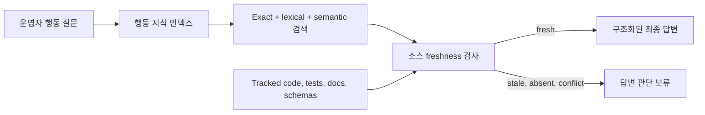

# Command Deck 행동 지식

이 설계는 Command Deck이 일반 답변에 소스 코드를 포함하지 않고 구조화된 계약을 통해 FDAI
시스템 동작을 설명하는 방식을 정의합니다. 답변에 사용하는 행동 지식과 권위 및 최신성
확인에만 사용하는 소스 근거를 분리합니다.

> 범위: 행동 검색은 읽기 전용입니다. 검색된 근거는 액션을 승인, 실행, 승격하거나 다른 방식으로
> 권한을 부여할 수 없습니다.

## 설계 요약

Command Deck은 저장소 소스 조각이 아니라 `BehaviorKnowledgeIndex`를 검색합니다. 각 결과는
트리거, preconditions, 처리 단계, outcomes, exclusions, 안전성 행동, 소유자,
구현 상태, 제한된 출처 이력을 제공합니다. 소스 파일과 테스트는 계약을 검증하고
stale 기록을 찾는 두 번째 계층으로 유지합니다.

```mermaid
flowchart LR
    Q[운영자 행동 질문] --> B[행동 지식 인덱스]
    B --> H[Exact + lexical + semantic 검색]
    H --> F[소스 freshness 검사]
    F -->|fresh| A[구조화된 최종 답변]
    F -->|stale, absent, conflict| X[답변 판단 보류]
    S[Tracked code, tests, docs, schemas] --> F
```

## 2계층 계약

### 행동 지식 인덱스

`BehaviorSpec`은 기본 검색 단위입니다. 다음 정보를 포함합니다.

- **신원**: `behavior_id`, `subject_kind`, `subject_id`입니다.
- **상태**: `implemented`, `configured`, `designed`, `not_applicable`입니다.
- **답변 structure**: 질문 별칭, 트리거, preconditions, 처리 단계, outcomes,
  exclusions, 안전성 행동입니다.
- **Localized 내용**: 로케일별로 같은 구조화된 필드를 제공합니다. 한국어 내용도 검색에
  참여하며 모델에 출처 근거 번역을 요청하지 않고 렌더링합니다.
- **소유권**: 행동을 담당하는 에이전트 또는 서브시스템입니다.
- **인덱스 메타데이터**: 384차원 임베딩, indexed 커밋, 추출기 버전, 출처 매니페스트
  해시입니다.

색인된 텍스트는 명령이 아니라 데이터입니다. Command Deck은 서버 소유 경로에서 구조화된 필드를
렌더링하며 검색 콘텐츠를 승인 또는 실행 권한으로 취급하지 않습니다.

### 소스 근거

`BehaviorSource`는 다음 인용 메타데이터만 기록합니다.

- 출처 종류: `code`, `test`, `doc`, `schema`;
- 저장소 상대 경로와 symbol;
- 줄 시작과 줄 end;
- Git 블롭 해시;
- 권한 역할: 구현, 검증, design, 구성.

소스 본문은 채팅 근거에 포함되지 않습니다. 일반 답변은 경로, symbol, 줄 범위, 블롭 해시,
indexed 커밋을 표시할 수 있지만 raw 코드는 표시하지 않습니다.

인용한 테스트가 늘어나거나 이동하면 시드는 같은 변경에서 exact symbol 줄 범위를 갱신합니다.
줄만 이동해도 이 갱신이 필요합니다. 최신성 테스트는 경로와 블롭이 현재여도 stale 범위를
거부합니다. 인용된 파일을 고치면서 시드를 갱신하지 않은 변경은 전체 모음을 red로 만들고,
그 실패는 원인이 된 변경이 아니라 행동 knowledge 아래에서 드러납니다. 그래서 이 갱신은
줄을 옮긴 커밋에 속합니다.

범위만 유지보수하는 변경은 인용 메타데이터만 바꾸며 답변 내용나 구현 상태는
바꾸지 않습니다. 한 인용을 고친 뒤 집합의 뒤쪽에 있는 다른 stale 출처를 놓치지 않도록 전체
시드 정밀도 테스트를 실행합니다.

## 검색 및 권위

참조 인덱스와 PostgreSQL 어댑터는 같은 정렬 계약을 사용합니다.

1. 정확한 질문 별칭 일치를 가장 먼저 정렬합니다.
2. 정확한 식별자와 정규화된 subject-token overlap을 그다음에 정렬합니다. 토큰
  정규화는 Latin 식별자와 한국어 조사를 분리하고 단순 영문 복수형을 정규화합니다.
3. 최소 점수를 넘은 lexical 검색과 384차원 의미 검색을 결합합니다.
4. 같은 일치 등급에서는 implemented 및 test-backed 기록이 designed-only 기록보다 먼저 옵니다.
5. 비교 질문은 하나를 임의 선택하지 않고 fresh 계약 두 개를 결합합니다.
6. 고정된 `behavior_id`로 결정적 tie-break를 수행합니다.

PostgreSQL 어댑터는 `tsvector`, `pg_trgm`, pgvector cosine 유사도를 결합합니다. In-memory
어댑터는 exact-class, top-hit 및 권한 순서를 동일하게 유지하고 lexical 및 의미 후보에
reciprocal-rank fusion을 사용합니다. In-memory lexical scorer는 정규화된 토큰 overlap을
사용하므로 low-confidence hybrid tail 순서는 다를 수 있습니다. OpenSearch는 이 설계에 포함되지 않습니다. 실제 말뭉치 크기,
조회 비율, sharding 또는 집계 요구가 PostgreSQL 경계를 넘는다는 측정 결과가 있을 때만
향후 인덱스 어댑터를 검토합니다.

## 최신성 및 충돌 동작

저장소 검증기는 `git ls-files`에서 허용 목록을 만듭니다. Tracked 경로만 해시하므로 ignored 파일,
생성된 산출물, 로컬 환경 파일, 시크릿, Terraform 상태 및 계획, 로그, untracked 파일은
출처 근거에 들어갈 수 없습니다.

근거가 불확실하면 Command Deck은 더 안전한 결과를 선택합니다.

- **Fresh**: 구조화된 행동과 인용을 렌더링합니다.
- **Stale 블롭 해시**: 현재 행동으로 확정하지 않고 재색인을 요청합니다.
- **Conflicting exact contracts**: 하나를 임의로 고르지 않고 답변을 검토 대상으로 보류합니다.
- **No 근거 or 사용 불가 인덱스**: 검증 가능한 행동 근거가 없다고 표시합니다.
- **구현과 design 차이**: implemented 및 test-backed 근거를 우선하고 designed-only
  기록을 별도로 식별합니다.

## 행동 범위

Built-in 시드 집합은 13개 계약을 포함합니다. 초기 3개에 아키텍처 계약 10개를
추가했습니다.

| 행동 | Owner | Implemented 근거 |
|----------|-------|----------------------|
| 결정적 인시던트 ID, 구성원 병합, 단조 증가 심각도 및 수명 주기 notice | `IncidentRegistry` | 인시던트 레지스트리 코드와 수명 주기 테스트 |
| Odin cross-domain 중재 및 non-intervention | `Odin`, 트리거 소유자는 `Forseti` | Forseti/Odin 코드, 중재 코드, 중재 테스트 |
| Issue 지문 deduplication | `Saga` | Saga 코드, 거버넌스 테스트, Issue 수명 주기 스키마 |
| Trust 라우팅 및 T2 quality 게이트 | `TrustRouter`, `QualityGate` | Core 구현과 focused 테스트 |
| 사람 승인 및 shadow 승격 | `RiskGate`, `Var`, `ActionPromotionRegistry` | 에이전트/코어 구현과 회귀 테스트 |
| 실행기 안전성, 이벤트 deduplication, 롤백 | `ShadowExecutor`, `EventIngest`, `Vidar` | Core/에이전트 구현과 멱등성 테스트 |
| Console 신원 경계 및 로컬 근거 동등성 | Operator API 조립과 `Thor` | 구성 계약과 로컬 Operator API 테스트 |
| Narrator translator-only 경로 | `Bragi` | 에이전트 구현, typed-pipeline re-entry 및 기본/기여자 정규화 테스트 |

Odin 계약은 single-domain 및 unanimous 권고를 명시적으로 제외합니다. Portfolio 검토는
designed-only로, temporal fairness는 선택적 dependency-injected 행동으로 표시합니다.

## Command Deck 답변 경로

저장소 해석기는 첫 채팅 근거 조회에서 한 번 초기화됩니다. Tracked 시드 출처만
해시하고 프로세스 lifetime 동안 in-memory 인덱스를 유지합니다. 각 질문에 대해 Operator API는 다음
단계를 수행합니다.

1. 클라이언트가 제공한 행동 근거를 제거합니다.
2. 서버가 소유한 인덱스를 초기화하거나 검색하기 전에 행동 대상과 behavior-question 의도를
  모두 요구합니다. 관련 없는 데이터, 액션, operational 프롬프트는 다음 권한 경로로 넘기며,
  런타임 인시던트 상태, 개수, recency 질문은 operational 읽기로 유지하고 bare Issue 또는
  인시던트 정의는 개념 조회로 유지합니다. Lexical 수집은 Hangul 2음절 토큰을 추가해
  띄어쓰기와 조사 차이가 있는 한국어 paraphrase를 처리하고 exact 별칭은 hybrid 일치보다 계속
  우선합니다. 수집 하한보다 점수가 낮을 때도 다음 권한으로 넘깁니다.
3. 관련 없는 operational, 에이전트, 도구, glossary, web 근거 경로를 건너뜁니다.
4. Narrator 백엔드를 호출하지 않고 결정론적 근거 fast 경로를 사용합니다.
5. 최신성을 검증하고 질문 focus를 선택한 다음 localized 필수 섹션을 렌더링합니다.
6. 최종 검증 메타데이터에 인용 참조를 반환합니다.

답변은 항상 트리거, preconditions, 처리 단계, outcomes, exclusions, 안전성 and 대체 경로
행동, 소유자, 구현 상태, citations 또는 출처 이력 구조를 사용합니다.

## 구현 상태

배포된 동작을 정확히 표현하도록 현재 구현을 다음과 같이 구분합니다.

- **Implemented**: shared `BehaviorSpec`, localized `BehaviorContent`, `BehaviorSource`,
  `BehaviorKnowledgeIndex` 계약; in-memory hybrid 인덱스; tracked-source 최신성 검증기;
  built-in 행동 시드 13개;
  서버가 소유한 채팅 해석기; 결정론적 최종 렌더러 및 검증기; PostgreSQL/pgvector
  어댑터; offline 테스트와 live-database 순위 동등성 테스트.
- **Designed, not production-bound**: 생성된 PostgreSQL 스키마 이행, 운영 조립
  연결, incremental 인덱스 또는 sync CLI입니다. 이 기능이 구현되기 전에는 Operator API가 tracked
  체크아웃의 저장소 시드를 사용하며 저장소 메타데이터를 사용할 수 없으면 답변을 보류합니다.

## 검증

Focused 테스트는 exact 별칭 priority, 정규화된 대상 순위, 멱등적 reindexing, stale 해시,
implemented 및 test-backed 권한, 출처 인용 형태와 symbol 정밀도, 출처 본문
exclusion, 클라이언트 근거 replacement, prompt-injection 격리, 비교, localization,
PostgreSQL/in-memory top-hit 및 exact-class 동등성을 검사합니다. Source-precision 검증은 모든
built-in 시드를 검사하므로 에이전트, 수명 주기 또는 local-composition 테스트 symbol을 이동시키는 코드는
영향받은 모든 범위를 같은 변경에서 갱신합니다. 고정된 아키텍처 holdout paraphrase 20개는 라우팅,
상태, 현재 인용, precise symbol, 권한, structure, 사실, exclusion 및 안전성,
localization, directness를 평가합니다. 2026-07-20 측정 결과는 `10.0/10`입니다. 20개 질문이 모두
정확히 경로되었고 cold initialization은 46.6 ms, warm 200 샘플은 p50 8.4 ms와 p95 20.5 ms로
측정되었습니다. 이 수치는 로컬 in-memory 체크아웃 측정이며 deployed pgvector 지연 시간 주장이
아닙니다. `FDAI_DATABASE_URL`이 설정되면 실제 운영 데이터베이스 동등성 테스트를 실행합니다.

## 관련 문서

| 알아볼 내용 | 읽을 문서 |
|-------------|-----------|
| 대화 안전성 및 도구 | [Operator Console](operator-console-ko.md) |
| 프로바이더 및 전달 경계 | [Project Structure](../architecture/project-structure-ko.md) |
| Odin 및 Forseti 책임 | [에이전트 Pantheon](../agents/agent-pantheon-ko.md) |
| 인시던트 수명 주기 | [Operator-Initiated SRE and ARB](../operations/operator-initiated-sre-and-arb-ko.md) |
