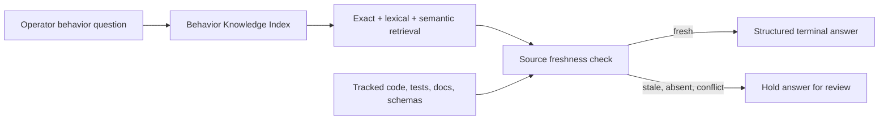

# Behavior Knowledge for Command Deck

This design defines how Command Deck explains FDAI system behavior from structured contracts while
keeping source code out of normal answers. It separates answerable behavior knowledge from source
evidence used only for authority and freshness checks.

> Scope: Behavior retrieval is read-only. Retrieved evidence cannot approve, execute, promote, or
> otherwise authorize an action.

## Design at a glance

Command Deck searches a `BehaviorKnowledgeIndex`, not repository source chunks. Each result states
the trigger, preconditions, processing steps, outcomes, exclusions, safety behavior, owner,
implementation status, and bounded provenance. Source files and tests remain a second layer that
validates the contract and detects stale records.

## Two-layer contract

### Behavior Knowledge Index

`BehaviorSpec` is the primary retrieval unit. It contains:

- **Identity**: `behavior_id`, `subject_kind`, and `subject_id`.
- **Status**: `implemented`, `configured`, `designed`, or `not_applicable`.
- **Answer structure**: question aliases, trigger, preconditions, processing steps, outcomes,
  exclusions, and safety behavior.
- **Localized content**: the same structured fields by locale. Korean content participates in
  retrieval and renders without asking a model to translate source evidence.
- **Ownership**: the agent or subsystem responsible for the behavior.
- **Index metadata**: a 384-dimensional embedding, indexed commit, extractor version, and source
  manifest hash.

The indexed text is data, not an instruction. Command Deck renders the structured fields through a
server-owned path and never treats retrieval content as approval or execution authority.

### Source Evidence

`BehaviorSource` records only citation metadata:

- source kind: `code`, `test`, `doc`, or `schema`;
- repository-relative path and symbol;
- line start and line end;
- Git blob hash;
- authority role: implementation, verification, design, or configuration.

Source bodies are not part of chat evidence. A normal answer may show the path, symbol, line range,
blob hash, and indexed commit, but not raw code.

When a cited test grows or moves, the seed updates its exact symbol line range in the same change;
the freshness test rejects a stale range even when the path and blob are otherwise current.

## Retrieval and authority

The reference index and PostgreSQL adapter use the same ordering contract:

1. Exact question alias matches rank first.
2. Exact identifiers and normalized subject-token overlap rank next. Token normalization separates
  Latin identifiers from Korean particles and normalizes simple English plurals.
3. Lexical retrieval and 384-dimensional semantic retrieval are fused above a minimum score.
4. Implemented, test-backed records outrank designed-only records in the same match class.
5. A comparison question combines two fresh contracts instead of silently choosing one.
6. Deterministic tie-breaking uses the stable `behavior_id`.

The PostgreSQL adapter combines `tsvector`, `pg_trgm`, and pgvector cosine similarity. The in-memory
adapter mirrors exact-class, top-hit, and authority ordering and uses reciprocal-rank fusion for
lexical and semantic candidates. Low-confidence hybrid tail order can differ because its lexical
scorer uses normalized token overlap. OpenSearch is not part of this design. A future index adapter can be considered
only after measured corpus size, query rate, sharding, or aggregation requirements exceed the
PostgreSQL boundary.

## Freshness and conflict behavior

The repository validator builds its allowlist from `git ls-files`. It hashes only tracked paths, so
ignored files, generated artifacts, local environment files, secrets, Terraform state and plans,
logs, and untracked files cannot enter source evidence.

Command Deck chooses the safer result when evidence is uncertain:

- **Fresh**: render the structured behavior and citations.
- **Stale blob hash**: do not confirm the behavior as current; request reindexing.
- **Conflicting exact contracts**: do not choose one silently; hold the answer for review.
- **No evidence or unavailable index**: state that no verifiable behavior evidence is available.
- **Implementation and design differ**: prefer implemented, test-backed evidence and identify the
  designed-only record separately.

## Behavior coverage

The built-in seed set contains 13 contracts. Ten architecture contracts extend the initial three:

| Behavior | Owner | Implemented evidence |
|----------|-------|----------------------|
| Deterministic Incident ID and member merge | `IncidentRegistry` | Incident registry code and lifecycle tests |
| Odin cross-domain arbitration and non-intervention | `Odin` with `Forseti` trigger ownership | Forseti and Odin code, arbitration code, and arbitration tests |
| Issue fingerprint deduplication | `Saga` | Saga code, governance tests, and the Issue lifecycle schema |
| Trust routing and T2 quality gate | `TrustRouter`, `QualityGate` | Core implementation and focused tests |
| Human approval and shadow promotion | `RiskGate`, `Var`, `ActionPromotionRegistry` | Agent/core implementation and regression tests |
| Executor safety, event deduplication, and rollback | `ShadowExecutor`, `EventIngest`, `Vidar` | Core/agent implementation and idempotency tests |
| Console identity boundary and local evidence parity | Read API composition and `Thor` | Configuration contract plus local read-API tests |
| Narrator translator-only path | `Bragi` | Agent implementation and typed-pipeline re-entry tests |

The Odin contract explicitly excludes single-domain and unanimous recommendations. It also marks
portfolio review as designed-only and temporal fairness as optional dependency-injected behavior.

## Command Deck answer path

The repository resolver initializes once on the first chat evidence lookup. It hashes only tracked
seed sources and keeps the in-memory index for the process lifetime. For each question, the read API
performs these steps:

1. Remove any client-supplied behavior evidence.
2. Require both a behavior subject and behavior-question intent before initializing or searching
  the server-owned index. Unrelated data, action, and operational prompts move to the next
  authority path. Runtime Incident state, count, and recency questions remain operational reads;
  bare Issue or Incident definitions remain concept queries. Lexical retrieval adds Hangul
  two-syllable tokens so Korean paraphrases survive spacing and particles; exact aliases still
  outrank hybrid matches. A score below the retrieval floor also moves to the next authority.
3. Skip unrelated operational, agent, tool, glossary, and web evidence paths.
4. Use the deterministic evidence fast path instead of calling the narrator backend.
5. Verify freshness, select a question focus, and render localized required sections.
6. Return citation references in terminal verification metadata.

The answer always uses this shape: trigger, preconditions, processing steps, outcomes, exclusions,
safety and fallback behavior, owner, implementation status, and citations or provenance.

## Implementation status

The current implementation is intentionally split so deployed claims remain accurate:

- **Implemented**: shared `BehaviorSpec`, localized `BehaviorContent`, `BehaviorSource`, and
  `BehaviorKnowledgeIndex` contracts; in-memory hybrid index; tracked-source freshness validator;
  13 built-in behavior seeds;
  server-owned chat resolver; deterministic terminal renderer and verifier; PostgreSQL/pgvector
  adapter; offline tests and a live-database rank parity test.
- **Designed, not production-bound**: generated PostgreSQL schema migration, production composition
  binding, and an incremental index or sync CLI. Until those land, the read API uses repository seeds
  in a tracked checkout and holds the answer when repository metadata is unavailable.

## Verification

Focused tests cover exact alias priority, normalized subject ranking, idempotent reindexing, stale
hashes, implemented and test-backed authority, source citation shape and symbol precision, source
body exclusion, client evidence replacement, prompt-injection isolation, comparisons, localization,
and PostgreSQL/in-memory top-hit and exact-class parity. A frozen set of 20 holdout architecture paraphrases scores
routing, status, current citations, precise symbols, authority, structure, facts, exclusions and
safety, localization, and directness. The measured 2026-07-20 result is `10.0/10`: 20 of 20 route
correctly, cold initialization is 46.6 ms, and 200 warm samples measure 8.4 ms p50 and 20.5 ms p95.
These are local in-memory checkout measurements, not a deployed pgvector latency claim. The live
database parity test runs when `FDAI_DATABASE_URL` is configured.

## Related docs

| To learn about | Read |
|----------------|------|
| Conversational safety and tools | [Operator Console](operator-console.md) |
| Provider and delivery boundaries | [Project Structure](../architecture/project-structure.md) |
| Odin and Forseti responsibilities | [Agent Pantheon](../agents/agent-pantheon.md) |
| Incident lifecycle | [Operator-Initiated SRE and ARB](../operations/operator-initiated-sre-and-arb.md) |
