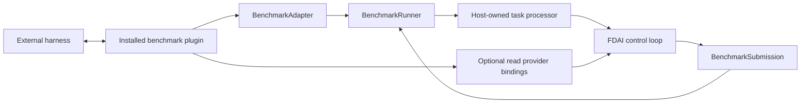

# 벤치마크 어댑터

이 설계는 FDAI runtime에 특정 benchmark package를 추가하지 않고 외부 평가 harness를 FDAI에
연결하는 방법을 정의합니다. 기본 distribution은 안정적인 contract와 bounded runner를
소유합니다. 각 integration은 `benchmarks/` 아래에 독립적으로 설치되는 plugin으로 유지됩니다.

> **범위:** Benchmark adapter는 harness lifecycle과 data를 변환합니다. FDAI action을 판단,
> 승인, 승격 또는 실행하지 않습니다.
>
> **구현 상태:** Generic task, submission, adapter, plugin, provider-binding 및 runner contract가
> 구현되었습니다. SREGym package는 conductor lifecycle 변환을 구현합니다. 기본 distribution은
> 아직 production `BenchmarkTaskProcessor`, benchmark CLI, SREGym observation provider 또는
> SREGym execution binding을 제공하지 않습니다.

## 설계 요약

FDAI wheel에는 SREGym, SWE-bench 또는 다른 harness protocol이 포함되지 않습니다. 명시적으로
설치된 package를 `fdai.benchmark_adapters` Python entry-point group을 통해 발견합니다. Plugin은
외부 harness adapter와 선택적인 read-only provider replacement를 반환합니다. Host가 소유하는
task processor는 normal FDAI event, decision 및 audit path를 통해 작업을 전달할 책임을 계속
가집니다.



## Package 경계

두 layer는 서로 다른 release 및 dependency 경계를 가집니다.

| Layer | 위치 | 책임 |
|-------|------|------|
| Generic framework | `src/fdai/benchmarking/` | 안정적인 value, lifecycle Protocol, plugin discovery, explicit provider binding 및 bounded runner입니다. |
| Harness plugin | `benchmarks/<name>/` | Harness transport, package dependency, entry-point registration, container asset 및 adapter test입니다. |

Harness plugin은 별도 Python distribution입니다. FDAI만 설치하면 benchmark integration이
설치되거나 활성화되지 않습니다. Plugin을 제거해도 FDAI runtime은 변경되지 않습니다.

## Contract

### Task 및 submission

`BenchmarkTask`는 run id, task id, open stage string, objective, target reference 및 bounded
metadata를 전달합니다. 하나의 runner가 code repair, operational recovery, security assessment 및
향후 benchmark shape를 지원할 수 있도록 stage는 diagnosis 전용 enum 대신 open 상태를
유지합니다.

`BenchmarkSubmission`은 같은 identity, terminal `completed`, `held` 또는 `failed` status,
bounded summary, 최대 256개의 evidence reference 및 선택적 audit reference를 반환합니다.
Runner는 task와 identity가 다른 submission을 차단합니다.

### Harness adapter

`BenchmarkAdapter`는 네 개의 asynchronous operation을 제공합니다.

1. `start()`는 작업을 받기 전에 prerequisite를 검증합니다.
2. `next_task()`는 task 하나를 반환하거나 terminal harness state에서 `None`을 반환합니다.
3. `submit()`은 correlation이 유지된 결과 하나를 harness로 반환합니다.
4. `close()`는 성공 또는 실패 시 transport resource를 해제합니다.

Runner는 중복 task identity를 차단하고 구성된 task count에서 중단합니다. Processing 또는
submission이 실패해도 `close()`가 실행됩니다.

### Provider binding

`BenchmarkBindings`는 새 immutable `Container`의 `MetricProvider`, `LogQueryProvider`,
`TraceQueryProvider` 또는 `Inventory`를 교체할 수 있습니다. 명시하지 않은 seam은 기존의 정확한
instance를 유지합니다. 이 bundle은 promotion state, risk policy, approval 및 mutation executor를
의도적으로 제외합니다.

명시된 모든 override는 container를 교체하기 전에 runtime-checkable provider Protocol을 충족해야
합니다. 잘못된 provider는 첫 metric, log, trace 또는 inventory query에서 실패하는 대신 plugin
composition 단계에서 차단됩니다.

Mutation이 필요한 benchmark는 host composition이 선택한 기존 governed execution adapter를
사용하는 것이 좋습니다. Benchmark plugin은 두 번째 execution path를 만들거나 ActionType을
observation mode에서 enforcement mode로 올릴 수 없습니다.

## Plugin discovery

설치된 package는 정확한 entry point 하나를 등록합니다.

```toml
[project.entry-points."fdai.benchmark_adapters"]
example = "fdai_bench_example:create_plugin"
```

Discovery는 deterministic하며 중복 이름을 차단합니다. Loading은 누락된 plugin, callable이 아닌
factory, entry-point 이름과 다른 `plugin_id`, host의 정확한 version이 아닌 benchmark API version을
차단합니다. Package installation은 operator가 통제하는 supply chain action으로 유지됩니다.
Entry-point discovery는 public package downloader 또는 signature verifier가 아닙니다.

## Runtime 및 안전 경계

모든 plugin에 다음 경계를 적용합니다.

- **Agent 직접 호출 없음:** Task processor는 FDAI typed ingress를 통해 publish합니다. Pantheon
  agent를 직접 import하거나 호출하지 않습니다.
- **숨은 판단 없음:** Adapter는 stage와 payload만 변환합니다. Tier를 선택하거나 decision 또는
  approval을 만들 수 없습니다.
- **권한 증가 없음:** Plugin configuration은 promotion, risk, role, approval 또는 execution mode를
  변경할 수 없습니다.
- **Bounded evidence:** External metric, log, trace 및 inventory는 기존 provider contract를 통해
  들어오며 untrusted evidence로 유지됩니다.
- **Correlation이 유지된 출력:** 모든 submission은 task identity를 보존하고, terminal FDAI audit
  reference가 있으면 포함하는 것이 좋습니다.
- **Oracle 접근 없음:** Plugin은 평가되는 agent에 노출된 harness interface만 사용합니다. Problem
  definition, expected answer 또는 grading internal을 검사하지 않습니다.

## SREGym plugin

독립 `benchmarks/sregym/` distribution은 현재 다음 conductor surface를 변환합니다.

| Surface | Mapping |
|---------|---------|
| `GET /status` | 현재 open 또는 terminal benchmark stage입니다. |
| `GET /get_app` | Objective metadata 및 bounded Kubernetes namespace target입니다. |
| `POST /submit` | Correlation이 유지된 FDAI submission summary입니다. |

Plaintext conductor URL은 loopback 또는 SREGym의 정확한 `host.docker.internal` agent-container
alias에서만 허용됩니다. Non-container 실행에서는 wildcard bind address를 loopback으로
정규화합니다. 구성 URL의 credential, query string 및 fragment는 차단됩니다. 알 수 없는 stage와
malformed response는 fail closed됩니다.

Conductor JSON response는 parsing 전에 bounded buffer로 stream됩니다. 기본
`max_response_bytes` limit은 1,000,000 byte입니다. 구성된 limit을 초과하면 stream을 중단하고
body를 JSON decoder에 전달하지 않은 채 adapter가 실패합니다.

Adapter는 가장 최근 `next_task()` 호출이 반환한 정확한 run, task 및 stage identity에 대한
submission만 허용합니다. Conductor가 submission을 수락한 후에만 이 identity를 clear하므로,
transport failure는 같은 결과를 재시도할 수 있지만 발급되지 않았거나 stage가 다른 submission은
허용되지 않습니다.
이 identity가 outstanding 상태인 동안 다른 `next_task()` 호출은 conductor를 polling하기 전에
실패합니다.

SREGym metric, log, trace 및 Kubernetes MCP transport는 이 slice에서 구현되지 않았습니다. 기존
provider 및 governed execution contract를 통해 bind되기 전까지 이 plugin만으로는 완전한 SREGym
evaluation agent가 아닙니다.

## 검증

Integration을 개발할 때 두 focused suite를 사용합니다.

```bash
.venv/bin/python -m pytest -q --no-cov tests/benchmarking
PYTHONPATH=src:benchmarks/sregym/src .venv/bin/python -m pytest \
  -q --no-cov benchmarks/sregym/tests
```

Generic suite는 contract bound, immutable metadata, duplicate 및 identity rejection, plugin
compatibility, task limit, cleanup 및 provider preservation을 검증합니다. 각 plugin은 자체
distribution에서 transport 및 harness-specific test를 소유합니다.

## 관련 문서

| 알아볼 내용 | 문서 |
|-------------|------|
| Repository 및 dependency 경계 | [Project Structure](../architecture/project-structure-ko.md) |
| Provider injection contract | [CSP Neutrality](../architecture/csp-neutrality-ko.md) |
| Governed execution path | [Execution Model](../decisioning/execution-model-ko.md) |
| Observable evaluation artifact | [Governed Trajectory Datasets](governed-trajectory-datasets-ko.md) |
