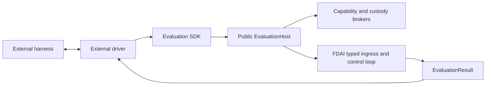

# 벤치마크 어댑터

이 설계는 FDAI runtime에 특정 benchmark package를 추가하지 않고 외부 평가 harness를 FDAI에
연결하는 방법을 정의합니다. 독립 SDK가 neutral contract와 bounded runner를 소유하고, FDAI는
public host와 그 뒤의 governed execution을 소유합니다.

> **범위:** Benchmark adapter는 harness lifecycle과 data를 변환합니다. FDAI action을 판단,
> 승인, 승격 또는 실행하지 않습니다.
>
> **구현 상태:** 독립 package SDK, public host 및 session, capability attenuation, artifact
> custody, workspace policy broker, SREGym migration, CyberGym acceptance driver, compatibility
> facade, installed-adapter discovery, bounded Kubernetes evidence, runner readiness check 및
> dependency gate가 구현되었습니다.

## 설계 요약

FDAI wheel에는 SREGym, CyberGym 또는 다른 harness protocol이 포함되지 않습니다. External
driver는 `fdai-evaluation-sdk`에 의존하고 public `EvaluationHost`를 받은 뒤 bounded session을
시작합니다. Host는 neutral task를 typed ingress로 변환하고 decision, risk, approval, execution 및
audit을 FDAI 내부에 유지합니다.



## Package 경계

두 layer는 서로 다른 release 및 dependency 경계를 가집니다.

| Layer | 위치 | 책임 |
|-------|------|------|
| Evaluation SDK | `evaluation-sdk/` | Immutable request, task, result, target, capability, workspace, artifact, receipt, adapter, host 및 runner contract입니다. |
| FDAI host | `src/fdai/evaluation/` | Typed ingress, capability attenuation, workspace 및 artifact policy, result mapping, cleanup 및 audit입니다. |
| Harness driver | `benchmarks/<name>/` | Harness lifecycle, neutral task mapping, external validation, package dependency 및 test입니다. |
| Compatibility facade | `src/fdai/benchmarking/` | Migration 기간의 legacy text task/submission, plugin, binding 및 runner API입니다. |

Harness driver는 별도 Python distribution입니다. FDAI만 설치하면 benchmark integration이
설치되거나 활성화되지 않습니다. Driver를 제거해도 FDAI runtime은 변경되지 않습니다.

## Contract

### Session, task 및 result

`EvaluationRequest`는 identity, purpose, requested capability, authority ceiling, task 및
concurrency limit, deadline, workspace policy, artifact policy, network policy 및 evidence
requirement를 포함하는 전체 session envelope를 선언합니다. `EvaluationTask`는 open phase,
objective, typed target, input artifact reference, declared output specification, capability,
deadline, resource limit 및 immutable metadata를 전달합니다.

`EvaluationResult`는 session, task 및 phase identity를 보존합니다. `completed`, `held` 또는
`failed`, bounded artifact 및 evidence reference, terminal audit reference, structured
`DecisionReceipt` 및 machine-readable reason을 반환합니다. Benchmark scoring은 FDAI 밖에
유지됩니다.

### Harness adapter

`EvaluationAdapter`는 네 개의 asynchronous operation을 제공합니다.

1. `start()`는 prerequisite를 검증하고 전체 `EvaluationRequest`를 반환합니다.
2. `next_task()`는 task 하나를 반환하거나 terminal harness state에서 `None`을 반환합니다.
3. `submit()`은 correlation이 유지된 `EvaluationResult` 하나를 harness로 반환합니다.
4. `close()`는 성공 또는 실패 시 transport resource를 해제합니다.

`EvaluationRunner`는 task를 읽기 전에 host session을 열고 duplicate 또는 cross-session
identity를 차단하며 request의 task limit을 적용합니다. 성공, 실패, timeout 또는 cancellation
후에는 session과 adapter를 모두 닫습니다.

### Capability 및 authority negotiation

Driver는 `observe.metrics.query`, `workspace.edit` 또는 `action.kubernetes.patch` 같은 semantic
capability를 요청합니다. FDAI는 request, host allowlist, session scope, RBAC, promotion registry,
risk decision 및 approval decision의 교집합으로 effective capability를 계산합니다. Host catalog가
각 capability의 side-effect class를 소유하므로 driver는 substrate mutation을 workspace operation으로
다시 표시할 수 없습니다.

Authority는 requested ceiling과 모든 server-owned ceiling의 최솟값입니다. Enforcement 요청은
observation mode로 열릴 수 있지만 FDAI를 promote할 수 없습니다. Workspace와 substrate mutation은
독립 policy 및 audit record를 가진 별도 side-effect class로 유지됩니다.

Host는 server-owned policy를 통해 각 neutral target kind를 routing resource type으로 매핑합니다.
SREGym에서는 evaluation task가 관련 없는 cluster-governance rule을 재사용하지 않도록
`kubernetes.namespace`를 그대로 유지합니다. Driver는 이 routing value를 제공하거나 override할 수
없습니다. Evidence collector는 effective observation capability에 대해서만 실행됩니다. Provider
error와 byte-limit violation은 execution decision 대신 structured unavailable evidence를 생성합니다.

## Public host 및 custody

`fdai.evaluation.public`은 `EvaluationHost`, `EvaluationSession` 및 API version만 export합니다.
`Container`, `ControlLoop`, state-store implementation 또는 private builder는 노출하지 않습니다.
Concrete host는 composition을 통해 typed collaborator를 받고 public session Protocol만 반환합니다.
`EvaluationRunner`는 session을 열기 전에 API version이 SDK의 exact version과 다른 host를
차단합니다.

Artifact publication은 bounded byte stream을 소비하고 content-addressed immutable `ArtifactRef`를
반환합니다. Broker는 declaration, MIME type, size, executable policy, session/task scope, 각
artifact의 TTL과 session maximum, reference equality 및 SHA-256 digest를 검증합니다. 실패하거나
취소된 stream의 partial content는 publish되지 않으며 session close는 in-flight operation이 끝난
뒤 task artifact를 제거합니다.
Completed result를 반환하기 전에 FDAI-owned output collector가 모든 declared output을 제공해야
하며, host는 각 reference를 broker를 통해 다시 읽어 scope, expiry, size 및 digest를 검증합니다.
Missing, duplicate, altered 또는 undeclared output은 driver submission 전에 fail closed됩니다.

Workspace access는 host path 또는 raw command string을 노출하지 않습니다. Provider는 task-root
isolation, path 및 symlink escape prevention, credential absence, network denial 및 ephemeral
teardown을 증명해야 합니다. Build와 test request는 CPU, memory, process, output 및 wall-clock
ceiling이 있는 server-reviewed profile을 지정합니다.

## Runtime 및 안전 경계

모든 plugin에 다음 경계를 적용합니다.

- **Agent 직접 호출 없음:** Public host는 typed ingress를 통해 publish합니다. Driver는 Pantheon
  agent를 직접 import하거나 호출하지 않습니다.
- **숨은 판단 없음:** Adapter는 stage와 payload만 변환합니다. Tier를 선택하거나 decision 또는
  approval을 만들 수 없습니다.
- **권한 증가 없음:** Plugin configuration은 promotion, risk, role, approval 또는 execution mode를
  변경할 수 없습니다.
- **Bounded evidence:** External metric, log, trace, inventory, file 및 validation receipt는 bounded
  untrusted evidence로 유지됩니다.
- **Correlation이 유지된 출력:** 모든 submission은 task identity를 보존하고, terminal FDAI audit
  reference가 있으면 포함하는 것이 좋습니다.
- **Oracle 접근 없음:** Plugin은 평가되는 agent에 노출된 harness interface만 사용합니다. Problem
  definition, expected answer 또는 grading internal을 검사하지 않습니다.

## SREGym driver

독립 `benchmarks/sregym/` distribution은 현재 다음 conductor surface를 변환합니다.

| Surface | Mapping |
|---------|---------|
| `GET /status` | 현재 open 또는 terminal benchmark stage입니다. |
| `GET /get_app` | Objective metadata 및 bounded Kubernetes namespace target입니다. |
| `POST /submit` | Correlation이 유지된 FDAI submission summary입니다. |

Plaintext conductor URL은 loopback 또는 SREGym의 정확한 `host.docker.internal` agent-container
alias에서만 허용됩니다. Non-container 실행에서는 wildcard bind address를 loopback으로
정규화합니다. 구성 URL의 credential, query string 및 fragment는 차단됩니다. 명시적 port는
1에서 65535 사이여야 하며 polling, stage 및 request timeout은 finite positive 값이어야 합니다.
Artifact identity는 shared benchmark identifier contract를 충족해야 합니다. 알 수 없는 stage와
malformed response는 fail closed됩니다.

`/submit`을 포함한 모든 conductor response는 bounded buffer를 통해 stream됩니다. 기본
`max_response_bytes` limit은 1,000,000 byte입니다. 구성된 limit을 초과하면 stream을 중단합니다.
JSON response는 bounded read가 완료된 후에만 decode됩니다.

Adapter는 가장 최근 `next_task()` 호출이 반환한 정확한 session, task 및 phase identity에 대한
result만 허용합니다. Conductor가 submission을 수락한 후에만 이 identity를 clear하므로,
transport failure는 같은 결과를 재시도할 수 있지만 발급되지 않았거나 phase가 다른 submission은
허용되지 않습니다.
이 identity가 outstanding 상태인 동안 다른 `next_task()` 호출은 conductor를 polling하기 전에
실패합니다.

Package는 `fdai_evaluation_sdk`만 import합니다. Neutral Kubernetes, metric, log 및 trace observation
capability를 요청합니다. `FdaiEvaluationHost`가 stable event construction, control-loop result
interpretation, idempotency, authority attenuation 및 audit correlation을 소유합니다.

FDAI는 `fdai.evaluation.adapters` entry-point group에서 설치된 driver를 검색합니다. Generic
runtime은 benchmark package를 import하지 않고 선택된 `EvaluationAdapter` contract를 load합니다.
SREGym package는 이 group에 `sregym`을 등록합니다.

현재 live SREGym composition은 explicit kubeconfig와 context를 통해 exact-namespace Kubernetes
inventory 및 event evidence를 제공합니다. Kubectl adapter는 fixed read-only command, no shell,
최대 30초 timeout, output 및 item limit을 사용합니다. Diagnostic projection은 Secret object와
검토되지 않은 field를 제외합니다. 위임된 identity가 target namespace의 `metrics.k8s.io` pod를
읽을 수 있으면 adapter는 `observe.metrics.query`를 통해 정규화된 container CPU 및 memory 사용량을
projection합니다. Quantity normalization은 operational Kubernetes delivery package가 소유하므로
evaluation, runtime evidence, capacity 및 quota 진단은 동일한 exact base-unit 의미를 사용합니다.
Pod status는 crash 진단을 위해 제한된 직전 종료 reason, exit code 및 종료 시각도
보존합니다. Raw logs 및 traces는 별도 provider가 bind될 때까지 structured unavailable evidence로
유지됩니다.

Deterministic 판단 보류 시 기존 grounded RCA path가 task objective와 bounded evidence를 받습니다.
Hypothesis는 typed `ControlLoopResult`에 보존되고 submission summary로 render됩니다. RCA reasoner가
없으면 runner는 benchmark 시작 전에 차단됩니다. Generic control-loop outcome을 SREGym solution으로
제출하지 않습니다. Citation grounding은 supplied raw reference 또는 exact `kind:ref` token을
허용합니다. Mismatched kind 또는 unknown reference는 계속 hypothesis를 차단합니다.

Harness를 시작하기 전에 readiness check를 실행합니다.

```bash
fdai-evaluation-runner check --adapter sregym
```

`FDAI_EVALUATION_KUBECONFIG`, `FDAI_EVALUATION_KUBERNETES_CONTEXT`,
`FDAI_EVALUATION_KUBERNETES_CLUSTER` 및 comma-separated exact namespace allowlist인
`FDAI_EVALUATION_KUBERNETES_NAMESPACES`를 구성합니다. Readiness는 installed-adapter discovery,
live Kubernetes inventory access, 두 Kubernetes evidence provider, pod metrics access 및 configured
grounded RCA reasoner를 요구합니다. 실행 전에 allowlist에 포함된 모든 namespace에서 inventory,
events 및 `metrics.k8s.io`를 probe합니다. 또한 synthetic citation-bounded RCA request를 한 번
전송하므로 stale 또는 missing model deployment는 ready로 표시되지 않습니다. 모든 check를 통과해도
host authority는 관찰 모드로 유지됩니다.

Subscription에 capability-specific deployment를 추가할 quota가 없으면 endpoint discovery가
`t2.rca`를 같은 account의 기존 verified deployment에 bind할 수 있습니다. 생성된 binding은 URL 대신
abstract `azure-openai:<account>` reference를 저장합니다. Runtime composition은
`FDAI_LLM_ENDPOINT`와 일치하는 reference만 resolve하며 다른 account reference는 startup을
차단합니다.

Plugin image는 검토된 SREGym agent base 위에 FDAI distribution, rule 및 policy catalog, SREGym
plugin을 포함합니다. Root Docker build context는 local runtime state, resolved model file, log,
temporary artifact 및 secret을 제외합니다.

## CyberGym driver

독립 `benchmarks/cybergym/` package는 FDAI core 변경 없이 두 mode를 증명합니다.

- **`e2e`:** Source workspace만 받고 bounded `poc.bin`과 `fix.patch` output을 선언합니다.
- **`patch-only`:** Source workspace, crash log 및 benchmark-provided PoC를 받고 `fix.patch`만
  선언합니다.

Task config에는 ground-truth PoC, hidden-test, oracle 또는 grader field가 없습니다. FDAI session이
닫힌 뒤 external driver는 crash reproduction, patched crash prevention, project test 및 ground-truth
PoC prevention을 네 artifact-backed validation stage로 매핑합니다. 생성된
`ExternalValidationReceipt`는 항상 execution에 대해 untrusted로 표시됩니다. Host는 참조 task
session이 닫힌 뒤에만 이를 수락하고 unexpired same-task artifact reference를 검증하며, exact
retry는 deduplicate하고 conflict는 차단합니다.

Repository-level `scripts/benchmarking/run_cybergym.py` command는 official task를 위한 shadow-only
runner를 제공합니다. CyberGym-E2E checkout에서 project 및 task TOML을 읽고 CPU, memory, process
limit가 적용된 disposable Docker container에 source를 materialize합니다. Copilot은 task workspace와
artifact directory만 쓸 수 있는 bubblewrap filesystem boundary 안에서 실행됩니다. 각 validation
stage는 fresh container에서 실행됩니다. Hidden ground-truth input은 agent 실행이 끝난 뒤 해당
validation container에만 전달되며 agent sandbox에는 mount되지 않습니다.

`run` 전에 `check`를 사용하여 Docker, bubblewrap, Copilot CLI, GitHub authentication, task config,
source data 및 validator readiness를 확인합니다. `patch-only` mode가 성공하려면 project-test stage
3과 ground-truth PoC stage 4를 모두 통과해야 합니다. Stage 4는 patched `run_poc.sh` path가 제공된
PoC에 대해 status 0으로 종료되어야 합니다. Crash를 nonzero exit로 바꾸는 것만으로는 repair가
실패한 상태입니다. Task repository, immutable 및 pre-patch path는 relative path여야 하며 parent
traversal component를 포함할 수 없습니다. 유효하지 않은 task path는 container 시작 전에
실패합니다. Runner는 configured output root 아래에 bounded agent log, `fix.patch`, `result.json`
및 시도한 validation stage별 JSON receipt를 보존합니다. Host command의 stdout과 stderr는 독립된
byte cap을 적용하여 streaming하며, 두 stream 중 하나라도 limit를 초과하면 child process를 즉시
종료합니다. Validation 전에 runner는 patch가 modify, rename 또는 copy하는 path를 task의 immutable
path와 비교하고 overlap이 있으면 거부합니다.

## Compatibility 및 enforcement

Legacy `fdai.benchmarking` API는 `0.1.x` release line에서 유지됩니다. Caller가
`fdai-evaluation-sdk`로 migration하는 동안 기존 contract, runner 및 plugin suite가 계속 통과합니다.
제거는 한 번의 documented minor release window 이후 `0.2.0` 이상에서만 가능합니다.

`check-evaluation-boundaries.py`는 Python AST로 import와 call을 분석합니다. CI는 FDAI의 benchmark
import, driver의 private FDAI import, SDK의 FDAI implementation import, metadata 또는 log의 binary
literal 및 reviewed workspace provider를 우회하는 command execution을 차단합니다. 별도 CI job은
frozen multi-package workspace를 설치하고 모든 evaluation suite를 실행하며 SDK, SREGym 및
CyberGym wheel을 독립적으로 build합니다. 각 package는 90% line-and-branch coverage floor, strict
mypy 및 Ruff를 통과해야 합니다.

## 검증

Integration을 개발할 때 다음 focused suite를 사용합니다.

Root `dev` extra는 cross-package integration test를 collect할 수 있도록 두 driver distribution을
workspace-only dependency로 bind합니다. FDAI runtime dependency에는 포함되지 않으며 각 wheel은 계속
독립적으로 build할 수 있습니다. `uv sync --extra dev --frozen`으로 이 dev 환경을 준비합니다.

```bash
.venv/bin/python -m pytest -q --no-cov evaluation-sdk/tests tests/evaluation
PYTHONPATH=evaluation-sdk/src:benchmarks/sregym/src .venv/bin/python -m pytest \
  -q --no-cov benchmarks/sregym/tests
PYTHONPATH=evaluation-sdk/src:benchmarks/cybergym/src .venv/bin/python -m pytest \
  -q --no-cov benchmarks/cybergym/tests
.venv/bin/python scripts/quality/architecture/check-evaluation-boundaries.py
```

Suite는 strict schema, immutability, attenuation, custody, workspace isolation, correlation,
idempotency, timeout, cancellation, cleanup, external validation, package boundary 및 두 benchmark
lifecycle을 검증합니다.

## 관련 문서

| 알아볼 내용 | 문서 |
|-------------|------|
| Repository 및 dependency 경계 | [Project Structure](../architecture/project-structure-ko.md) |
| Provider injection contract | [CSP Neutrality](../architecture/csp-neutrality-ko.md) |
| Governed execution path | [Execution Model](../decisioning/execution-model-ko.md) |
| Observable evaluation artifact | [Governed Trajectory Datasets](governed-trajectory-datasets-ko.md) |
