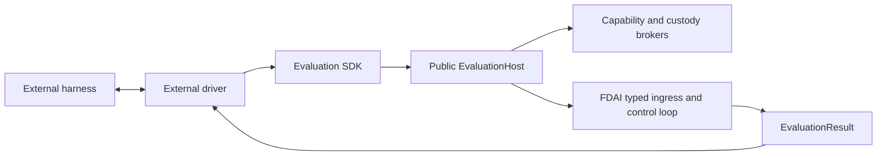

# 벤치마크 어댑터

이 설계는 FDAI 런타임에 특정 벤치마크 패키지를 추가하지 않고 외부 평가 실행 장치를 FDAI에
연결하는 방법을 정의합니다. 독립 SDK가 neutral 계약과 범위가 제한된 실행기를 소유하고, FDAI는
공개 호스트와 그 뒤의 통제된 실행을 소유합니다.

> **범위:** 벤치마크 어댑터는 실행 장치 수명 주기와 데이터를 변환합니다. FDAI 액션을 판단,
> 승인, 승격 또는 실행하지 않습니다.
>
> **구현 상태:** 독립 패키지 SDK, 공개 호스트 및 세션, 기능 attenuation, 산출물
> 보관, workspace 정책 브로커, SREGym 이행, CyberGym acceptance driver, 호환성
> 파사드, installed-adapter 발견, 범위가 제한된 Kubernetes 근거, 실행기 준비 상태 검사 및
> 의존성 게이트가 구현되었습니다.

## 설계 요약

FDAI 휠에는 SREGym, CyberGym 또는 다른 실행 장치 프로토콜이 포함되지 않습니다. 외부
driver는 `fdai-evaluation-sdk`에 의존하고 공개 `EvaluationHost`를 받은 뒤 범위가 제한된 세션을
시작합니다. 호스트는 neutral 작업을 타입이 지정된 유입으로 변환하고 결정, risk, 승인, 실행 및
감사를 FDAI 내부에 유지합니다.



## 패키지 경계

두 계층은 서로 다른 release 및 의존성 경계를 가집니다.

| 계층 | 위치 | 책임 |
|-------|------|------|
| Evaluation SDK | `evaluation-sdk/` | 변경할 수 없는 요청, 작업, 결과, 대상, 기능, workspace, 산출물, 증적, 어댑터, 호스트 및 실행기 계약입니다. |
| FDAI 호스트 | `services/core-control-plane/src/fdai/evaluation/` | 타입이 지정된 유입, 기능 attenuation, workspace 및 산출물 정책, 결과 대응, 정리 및 감사입니다. |
| 실행 장치 driver | `benchmarks/<name>/` | 실행 장치 수명 주기, neutral 작업 대응, 외부 검증, 패키지 의존성 및 테스트입니다. |
| 호환성 파사드 | `services/core-control-plane/src/fdai/benchmarking/` | 이행 기간의 이전 방식 텍스트 작업/제출, 플러그인, 연결 및 실행기 API입니다. |

실행 장치 driver는 별도 Python 분포입니다. FDAI만 설치하면 벤치마크 통합이
설치되거나 활성화되지 않습니다. Driver를 제거해도 FDAI 런타임은 변경되지 않습니다.

## 계약

### 세션, 작업 및 결과

`EvaluationRequest`는 신원, 용도, requested 기능, 권한 상한, 작업 및
동시성 한도, 기한, workspace 정책, 산출물 정책, 네트워크 정책 및 근거
요구사항을 포함하는 전체 세션 묶음을 선언합니다. `EvaluationTask`는 열림 단계,
목표, 타입이 지정된 대상, 입력 산출물 참조, declared 출력 명세, 기능,
기한, 리소스 한도 및 변경할 수 없는 메타데이터를 전달합니다.

`EvaluationResult`는 세션, 작업 및 단계 신원을 보존합니다. `completed`, `held` 또는
`failed`, 범위가 제한된 산출물 및 근거 참조, 최종 감사 참조, 구조화된
`DecisionReceipt` 및 기계가 읽는 사유를 반환합니다. 벤치마크 채점은 FDAI 밖에
유지됩니다.

### 실행 장치 어댑터

`EvaluationAdapter`는 네 개의 asynchronous 연산을 제공합니다.

1. `start()`는 선행 조건을 검증하고 전체 `EvaluationRequest`를 반환합니다.
2. `next_task()`는 작업 하나를 반환하거나 최종 실행 장치 상태에서 `None`을 반환합니다.
3. `submit()`은 상관관계가 유지된 `EvaluationResult` 하나를 실행 장치로 반환합니다.
4. `close()`는 성공 또는 실패 시 전송 계층 리소스를 해제합니다.

`EvaluationRunner`는 작업을 읽기 전에 호스트 세션을 열고 중복 또는 cross-session
신원을 차단하며 요청의 작업 한도를 적용합니다. 성공, 실패, 시간 초과 또는 취소
후에는 세션과 어댑터를 모두 닫습니다.

### 기능 및 권한 negotiation

Driver는 `observe.metrics.query`, `workspace.edit` 또는 `action.kubernetes.patch` 같은 의미
기능을 요청합니다. FDAI는 요청, 호스트 허용 목록, 세션 범위, RBAC, 승격 레지스트리,
risk 결정 및 승인 결정의 교집합으로 effective 기능을 계산합니다. 호스트 카탈로그가
각 기능의 side-effect 등급을 소유하므로 driver는 기반 변경을 workspace 연산으로
다시 표시할 수 없습니다.

권한은 requested 상한과 모든 서버가 소유한 상한의 최솟값입니다. 적용 요청은
관측 모드로 열릴 수 있지만 FDAI를 promote할 수 없습니다. Workspace와 기반 변경은
독립 정책 및 감사 기록을 가진 별도 side-effect 등급으로 유지됩니다.

호스트는 서버가 소유한 정책을 통해 각 neutral 대상 종류를 라우팅 리소스 타입으로 매핑합니다.
SREGym에서는 evaluation 작업이 관련 없는 cluster-governance 룰을 재사용하지 않도록
`kubernetes.namespace`를 그대로 유지합니다. Driver는 이 라우팅 값을 제공하거나 재정의할 수
없습니다. 근거 수집기는 effective 관측 기능에 대해서만 실행됩니다. 프로바이더
오류와 byte-limit violation은 실행 결정 대신 구조화된 사용 불가 근거를 생성합니다.

## 공개 호스트 및 보관

`fdai.evaluation.public`은 `EvaluationHost`, `EvaluationSession` 및 API 버전만 내보내기합니다.
`Container`, `ControlLoop`, state-store 구현 또는 비공개 빌더는 노출하지 않습니다.
구체적인 호스트는 조립을 통해 타입이 지정된 collaborator를 받고 공개 세션 프로토콜만 반환합니다.
`EvaluationRunner`는 세션을 열기 전에 API 버전이 SDK의 exact 버전과 다른 호스트를
차단합니다.

산출물 게시는 범위가 제한된 바이트 스트림을 소비하고 내용 기반 주소를 가진 변경할 수 없는 `ArtifactRef`를
반환합니다. 브로커는 선언, MIME 타입, 크기, executable 정책, 세션/작업 범위, 각
산출물의 TTL과 세션 최대, 참조 equality 및 SHA-256 다이제스트를 검증합니다. 실패하거나
취소된 스트림의 부분 내용은 publish되지 않으며 세션 close는 in-flight 연산이 끝난
뒤 작업 산출물을 제거합니다.
Completed 결과를 반환하기 전에 FDAI-owned 출력 수집기가 모든 declared 출력을 제공해야
하며, 호스트는 각 참조를 브로커를 통해 다시 읽어 범위, 만료, 크기 및 다이제스트를 검증합니다.
누락된, 중복, altered 또는 undeclared 출력은 driver 제출 전에 실패 시 차단됩니다.

Workspace 접근은 호스트 경로 또는 raw 명령 문자열을 노출하지 않습니다. 프로바이더는 task-root
격리, 경로 및 symlink escape prevention, 자격 증명 absence, 네트워크 denial 및 일시적인
정리를 증명해야 합니다. 빌드와 테스트 요청은 CPU, 기억, 프로세스, 출력 및 wall-clock
상한이 있는 server-reviewed 프로파일을 지정합니다.

## 런타임 및 안전 경계

모든 플러그인에 다음 경계를 적용합니다.

- **에이전트 직접 호출 없음:** 공개 호스트는 타입이 지정된 유입을 통해 publish합니다. Driver는 Pantheon
  에이전트를 직접 가져오기하거나 호출하지 않습니다.
- **숨은 판단 없음:** 어댑터는 단계와 페이로드만 변환합니다. Tier를 선택하거나 결정 또는
  승인을 만들 수 없습니다.
- **권한 증가 없음:** 플러그인 구성은 승격, risk, 역할, 승인 또는 실행 모드를
  변경할 수 없습니다.
- **범위가 제한된 근거:** 외부 메트릭, 로그, 추적, 인벤토리, 파일 및 검증 증적은 범위가 제한된
  신뢰할 수 없는 근거로 유지됩니다.
- **상관관계가 유지된 출력:** 모든 제출은 작업 신원을 보존하고, 최종 FDAI 감사
  참조가 있으면 포함하는 것이 좋습니다.
- **Oracle 접근 없음:** 플러그인은 평가되는 에이전트에 노출된 실행 장치 인터페이스만 사용합니다. Problem
  정의, 예상 답변 또는 grading 내부를 검사하지 않습니다.

## SREGym driver

독립 `benchmarks/sregym/` 분포는 현재 다음 conductor 표면을 변환합니다.

| 표면 | 대응 |
|---------|---------|
| `GET /status` | 현재 열림 또는 최종 벤치마크 단계입니다. |
| `GET /get_app` | 목표 메타데이터 및 범위가 제한된 Kubernetes 이름 공간 대상입니다. |
| `POST /submit` | 상관관계가 유지된 FDAI 제출 요약입니다. |

Plaintext conductor URL은 loopback 또는 SREGym의 정확한 `host.docker.internal` agent-container
별칭에서만 허용됩니다. Non-container 실행에서는 와일드카드 연결 주소를 loopback으로
정규화합니다. 구성 URL의 자격 증명, 조회 문자열 및 조각은 차단됩니다. 명시적 포트는
1에서 65535 사이여야 하며 polling, 단계 및 요청 시간 초과는 finite 긍정 값이어야 합니다.
산출물 신원은 shared 벤치마크 식별자 계약을 충족해야 합니다. 알 수 없는 단계와
malformed 응답은 실패 시 차단됩니다.

`/submit`을 포함한 모든 conductor 응답은 범위가 제한된 버퍼를 통해 스트림됩니다. 기본
`max_response_bytes` 한도는 1,000,000 바이트입니다. 구성된 한도를 초과하면 스트림을 중단합니다.
JSON 응답은 범위가 제한된 읽기가 완료된 후에만 decode됩니다.

어댑터는 가장 최근 `next_task()` 호출이 반환한 정확한 세션, 작업 및 단계 신원에 대한
결과만 허용합니다. Conductor가 제출을 수락한 후에만 이 신원을 clear하므로,
전송 계층 실패는 같은 결과를 재시도할 수 있지만 발급되지 않았거나 단계가 다른 제출은
허용되지 않습니다.
이 신원이 outstanding 상태인 동안 다른 `next_task()` 호출은 conductor를 polling하기 전에
실패합니다.

패키지는 `fdai_evaluation_sdk`만 가져옵니다. Neutral Kubernetes 및 메트릭 관측 기능을
요청합니다. `FdaiEvaluationHost`가 고정된 이벤트 construction, control-loop 결과
interpretation, 멱등성, 권한 attenuation 및 감사 상관관계를 소유합니다.

FDAI는 `fdai.evaluation.adapters` entry-point 그룹에서 설치된 driver를 검색합니다. 범용
런타임은 벤치마크 패키지를 가져오기하지 않고 선택된 `EvaluationAdapter` 계약을 부하합니다.
SREGym 패키지는 이 그룹에 `sregym`을 등록합니다.

현재 실제 운영 SREGym 조립은 명시적 kubeconfig와 맥락을 통해 exact-namespace Kubernetes
인벤토리 및 이벤트 근거와 명시적 cluster-scoped 노드 용량 근거를 제공합니다. 노드
근거는 별도 observe-only 기능입니다. 노드 신원, 준비 상태, schedulability 및 검증된
CPU와 기억 allocatable quantity만 변환 결과하고 주소, 라벨 및 extended 리소스는 제외합니다.
Kubectl 어댑터는 fixed 읽기 전용 명령, no 셸, 최대 30초 시간 초과, 출력 및 항목 한도를
사용합니다. 진단 변환 결과는 시크릿 객체와 검토되지 않은 필드를 제외합니다. 위임된
신원이 대상 이름 공간의 `metrics.k8s.io` pod를
읽을 수 있으면 어댑터는 `observe.metrics.query`를 통해 정규화된 컨테이너 CPU 및 기억 사용량을
변환 결과합니다. Metrics, admission, 소유자, 인벤토리, 이벤트, 노드, 용량 및 의존성
프로바이더는 모두 실행 전 실패 시 차단 준비 상태에 참여합니다. Quantity 정규화는 operational
Kubernetes 전달 패키지가 소유하므로
evaluation, 런타임 근거, 용량 및 할당량 진단은 동일한 exact base-unit 의미를 사용합니다.
Pod 인벤토리는 이미지 또는 명령 리터럴을 보존하지 않고 변경할 수 없는 UID와 집계 CPU/기억
요청 및 검토된 출처 경로를 변환 결과합니다. 공유 hold-only 집약기는 exact FailedScheduling
Pod UID와 완전한 조건을 충족한 노드 상한이 일치할 때만 용량 발견 사항을 생성합니다. 잘린,
stale, conflicting 또는 불완전한 근거는 발견 사항을 생성하지 않습니다. SREGym은 별도
observe-only `observe.kubernetes.capacity` 기능을 통해 이 결합을 요청합니다. Pod 상태는 비정상 종료
진단을 위해 제한된 직전 종료 사유, exit 코드 및 종료 시각도
보존합니다. 로그 및 추적 기능은 범위가 제한된 프로바이더를 설치할 때까지 advertise하지 않습니다.

공유 Kubernetes 패키지에는 hold-only 엔드포인트 의존성 집약기도 있습니다. 완전한
same-namespace 변환 결과, exact short `host:port` 환경 참조, absent 서비스 및 referenced
포트를 선언한 healthy same-name 백엔드가 모두 있을 때만 missing-Service 발견 사항을 생성합니다.
Present, 외부, 모호한, unhealthy, mismatched 또는 잘린 근거는 발견 사항을 생성하지
않습니다.
SREGym은 별도 observe-only `observe.kubernetes.dependencies` 기능을 통해 completed 인벤토리
결합을 요청합니다. 준비 상태는 실행 전에 이 기능을 탐색하며 사용 불가 또는 잘린
인벤토리는 absence 발견 사항을 생성할 수 없습니다.

실패한 Kubernetes admission 이벤트는 범위가 제한된 웹훅 TLS, 시간 초과, 사용 불가 또는 Pod Security
거절 코드로 분류됩니다. 분류에는 실패한 이벤트 사유가 필요합니다. Informational 텍스트,
malformed 웹훅 신원 및 인식되지 않은 메시지는 분류하지 않습니다. 인식된 admission
실패의 projected 이벤트는 raw 메시지 대신 구조화된 코드와 범위가 제한된 신원 또는 Pod Security
필드만 보존합니다. 따라서 admission 응답이 echoed 시크릿 또는 검토되지 않은 값을
결정론적 발견 사항으로 전달하지 못합니다.
워크로드 인벤토리는 범위가 제한된 상태 조건의 활성 admission 실패도 인식합니다. Normal
조건과 inactive historical 실패는 non-finding으로 유지됩니다. 인식된 조건은 exact
상태 조건 출처 경로와 함께 `evidence_strength=direct_resource_condition`인 hold-only
후보를 생성하고 raw 메시지는 보존하지 않습니다. FDAI는 캠페인의 fixed numeric 순위
가중치를 복사하지 않습니다. 다운스트림 순위는 상관관계를 proven causation으로 취급하지 않고
명시적 근거 강도를 비교할 수 있습니다.

Requested Pod 포트를 사용할 수 없다고 보고하는 검토된 스케줄러 Event 사유 텍스트는 raw 메시지를
보존하지 않고 구조화된 `host_port_conflict` 코드로 축약합니다. Hold-only 후보에는 완전한
인벤토리/이벤트 증적, 5분 근거 구간 안의 이벤트, exact affected Pod UID 및 완전한 valid
`hostPort`/프로토콜 변환 결과가 필요합니다. 발견 사항은 범위가 제한된 포트 사실과 검토된 출처 경로만
포함합니다. Name-only, stale, future, malformed, 모호한 또는 잘린 근거는 발견 사항을
생성하지 않으며 이벤트만으로 어느 노드가 conflicting 소켓을 소유하는지 증명하지 않습니다.
출처 캠페인의 host-port 충돌 reason-specific RCA priority는 포트하지 않습니다. Absorbed
발견 사항은 `candidate_only` 및 `hold`로 유지되므로 사유 문자열이 권위 있는 structural 원인으로
승격할 수 없습니다. Future 정렬은 reason-specific 가지를 추가하지 않고 범용 검토된
evidence-strength 및 contradiction 메타데이터를 비교해야 합니다.
프로바이더 중립적인 로그 reduction은 exact Pod UID, 컨테이너 신원 및 5분 근거 구간 안의
시각을 가진 범위가 제한된 기록에서 검토된 `EADDRINUSE`, `address already in use`, Linux `errno
98` 서명만 인식합니다. Raw 본문, 주소 또는 포트 없이 occurrence 개수를 포함한 hold-only
socket-bind 후보를 생성합니다. 누락된 UID, stale, future, oversized, unrecognized 또는 불완전한
기록은 발견 사항을 생성하지 않습니다. 구체적인 범위가 제한된 `observe.logs.query` 프로바이더는 별도 작업이므로
이 의미 집약기만으로 방식이 operationalized되지는 않습니다.
로그 대상 선택도 프로바이더 중립적인이며 범위가 제한된입니다. Exact Pod UID, valid creation 시각
및 완전한 container-status 변환 결과가 필요합니다. Pod 상한의 절반은 active-failure, 재시작,
준비 상태 priority로 선택하고 나머지는 recency로 채운 뒤 priority 순서로 돌아갑니다. 각 Pod의 별도
컨테이너 상한 안에서는 failing 컨테이너가 restarted/healthy 컨테이너보다 앞섭니다. 따라서 오래된
unhealthy 적체와 최근 healthy Pod burst 모두 relevant 근거를 starvation시키지 못합니다.
불완전한 또는 모호한 신원은 대상을 생성하지 않습니다.
프로바이더 중립적인 로그 reduction은 검토된 decode, application-failure 및 stream-stall 서명을
recent exact-Pod-UID 관측 2개 이후에만 집계합니다. 기록은 1KiB로 제한하고 raw 본문은
발견 사항에 포함하지 않습니다. 누락된 신원, stale, oversized, unrecognized 또는 불완전한
근거는 abstain합니다. 구체적인 로그 프로바이더는 별도 작업입니다.
출처 캠페인의 CronJob 하위 deletion, sidecar patching, finalizer/RBAC 변경, deny-all
복원 및 reason-specific RCA precedence는 포트하지 않습니다. 신원 정규화,
세대 검사 및 의미 churn 허용 오차는 7개 액션 safeguard나 causal 권한을 독립적으로
증명하지 않습니다.

Observe-only `observe.kubernetes.owners` 기능은 범위가 제한된 이름 공간 인벤토리에서 최대 8개
custom 소유자 참조를 따라갑니다. 각 조회는 소유자 참조 UID를 보존하며 반환된 custom
리소스의 API 그룹, 종류, 이름, 이름 공간 및 변경할 수 없는 UID가 모두 일치할 때만 허용합니다.
Recreated 이름, cross-namespace 소유자, 잘못된 참조, 조회 실패 및 omitted 소유자는 근거를
불완전한으로 만들고 부분 소유자 집합을 노출하지 않습니다. 변환 결과는 범위가 제한된 신원,
세대, deletion 및 조건 필드만 보존하며 임의 custom 리소스 spec 문자열은 제외합니다.
출처 캠페인의 arbitrary custom 소유자 spec field-basename 검증은 포트하지 않습니다. 일치하는
CRD OpenAPI 스키마와 exact 스키마 경로가 없으면 `runAsUser`, `effect` 또는 `updateStrategy`라는 필드
이름만으로 Kubernetes security-context, toleration 또는 워크로드 strategy 의미를 증명할 수
없습니다. 따라서 FDAI는 해당 값을 변환 결과하거나 구성 발견 사항을 생성하지 않습니다.
완전한 워크로드 변환 결과에 projected custom 소유자 UID와 일치하는 controller 소유자 참조가
하나 있으면 degraded 하위는 hold-only `custom_owner_has_degraded_workload` 후보를 생성합니다.
이는 direct 소유권 관계를 증명하지만 소유자 구성이 성능 저하를 일으켰다고
증명하지 않습니다. 출처 캠페인의 `configuration_precedes` 주장과 임의 custom spec 변환 결과는
구성 변경 시각 또는 interventional 근거가 없으므로 의도적으로 거부합니다.

인벤토리 근거는 Pod 이미지 pull 실패와 owning 배포, StatefulSet 또는 DaemonSet
템플릿의 표류를 correlate할 수 있습니다. 상관관계에는 완전한 컨테이너 변환 결과, 각 홉의
exact controller 소유자 하나, 체인 내 모든 리소스의 변경할 수 없는 UID 일치, 인식된 waiting 사유 및
같은 컨테이너 이름의 서로 다른 SHA-256 image-reference 지문이 필요합니다. Raw 이미지
참조는 변환 결과하지 않습니다. Recreated, 모호한, malformed 또는 잘린 근거는
발견 사항을 생성하지 않으며 결과는 템플릿 표류가 pull 실패를 일으켰다는 주장이 아닌 hold-only
후보로 유지됩니다.
출처 캠페인의 automatic operator-namespace 탐색은 포트하지 않습니다. 이 구현은 custom
리소스 plural을 종류 이름에서 추론하고, broad API-group 읽기 접근을 controller 신원으로
취급하며, 완전한 RBAC 변환 결과 없이 조회를 확장했습니다. 허용 목록에 있는 이름 공간만으로 인벤토리
확장을 시작하지 않습니다. Future 탐색 기능은 discovered CRD plural 신원, exact 검토된
동사/리소스, 완전한 역할/연결 변환 결과 및 명시적 범위가 제한된 범위를 사용해야 합니다.

캠페인의 범용 custom-resource patch 허용 목록은 포트하지 않습니다. Exact API-version/종류
허용 목록과 세대 검사는 새 변경 기본 요소에 필요하지만 충분하지 않습니다. 출처
변경은 arbitrary custom 리소스에 대한 영속 대상 잠금, persistent 중복 suppression,
효과 이전 감사 의도, 범위가 제한된 롤백 훈련 및 observer-independent 효과 검증을
독립적으로 증명하지 않습니다. 따라서 현재 실제 운영 실행기는
`remediate.kubernetes-patch`를 미등록 상태로 유지합니다. Future 구현은 새로운
shadow-first ActionType으로 시작하고 real staging 기반에서 7개 safeguard를 모두 충족해야
합니다. Evaluation 환경 variable은 해당 권한을 부여할 수 없습니다.

Admission 근거는 범위가 제한된 MutatingWebhookConfiguration 및
ValidatingWebhookConfiguration 변환 결과를 읽습니다. 구조화된 실패한 이벤트는 완전한
변환 결과 전체에서 웹훅 이름이 유일하고 affected 리소스가 대상 이름 공간에 있을 때만
구성 후보를 식별할 수 있습니다. TLS, 시간 초과 및 백엔드 실패는 검토된 출처
경로와 범위가 제한된 실패 정책/서비스 신원을 보존합니다. 웹훅 URL과 CA 번들은 계속
제외합니다. 발견 사항은 후보 전용이며 웹훅 이름 일치는 구성이 외부 실패를
일으켰다는 증명이 아닙니다.
누락된 웹훅 백엔드 의미는 이름 공간 인벤토리보다 강한 absence 경계를 사용합니다.
후보에는 완전한 웹훅 변환 결과 하나와 successful 읽기가 absence를 확인한 exact targeted
서비스 증적 하나가 필요합니다. Present, 실패한, 모호한, malformed 또는 잘린 증적은
발견 사항을 생성하지 않습니다. 후보는 구성 신원, 웹훅 이름, 실패 정책,
서비스 신원 및 검토된 출처 경로만 보존합니다. Targeted 증적 프로바이더는 별도 작업이며
집약기만으로 제공된다고 간주하지 않습니다. Admission evaluation 프로바이더는 최대 8개의 exact
허용 목록에 있는 `service/{name} --ignore-not-found` 읽기를 수행합니다. 빈 successful 출력만 absence를
확인하며 out-of-scope, 실패한, oversized, malformed 또는 identity-mismatched 응답은 서비스
근거를 불완전한으로 만듭니다.
FDAI는 웹훅 서비스 참조를 사용해 백엔드 이름 공간의 full 인벤토리를 수집하지 않습니다.
해당 참조는 이름 공간 내 모든 리소스에 대한 의존성나 근거 표면 확장 권한을
증명하지 않습니다. Exact targeted 서비스 증적이 백엔드 absence 근거에서 출처 캠페인의
broad cross-namespace 탐색을 대체합니다.
FDAI는 웹훅 백엔드 Pod를 선택하는 deny-all NetworkPolicy도 API-server 트래픽 차단의 증거로
취급하지 않습니다. 서비스 선택자와 Pod 라벨은 구성원을 증명하지만 control-plane 네트워크
경로나 정책 적용 지점을 증명하지 않습니다. Direct 경로 근거가 없으면 이는 unproven
상관관계로 남고 causal 발견 사항을 생성하지 않습니다.
출처 캠페인의 automatic `failurePolicy: Fail` to `Ignore` 복구 시드는 포트하지 않습니다.
이 변경은 admission security 의도를 fail-open으로 바꾸고 누락된 백엔드를 복구하지 않으며,
resulting admission과 롤백이 intended 컨트롤을 보존한다는 독립적인 증명도 없습니다. Approval,
resource-version 검사 및 서버 예행 실행만으로 해당 결과를 증명할 수 없습니다. 따라서 누락된
백엔드 발견 사항은 hold-only로 유지되며 control-plane patch 권한을 부여하지 않습니다.
TLS trust 실패에도 같은 거절을 적용합니다. `failurePolicy` 변경은 certificate 검증을
우회하며 trust 체인이나 intended admission 컨트롤을 복구하지 않습니다.
웹훅 이름 공간 선택자가 표현식 없이 exact
`kubernetes.io/metadata.name=<namespace>` 일치 라벨 하나만 포함할 때 missing-backend 후보는
해당 이름 공간과 검토된 선택자 경로를 기록합니다. Extra 라벨, 표현식, malformed 선택자 또는
presence-only 변환 결과는 영향 범위를 생략합니다. 준비 상태는 affected 워크로드를 식별하거나
이름 공간 집합을 확장하지 않습니다.

Cumulative 시간 초과 근거는 별도 후보 전용 방식입니다. 서로 다른 웹훅 이름의
구조화된 시간 초과 이벤트가 최소 2개이고, affected 리소스 변경할 수 없는 UID가 같으며, trusted 근거
기준 시점으로 끝나는 5분 구간 안의 시각이 있어야 합니다. 중복, stale, future, UID-conflicting,
malformed 또는 잘린 이벤트는 발견 사항을 생성하지 않습니다. 출처 캠페인 구현과 달리 direct
policy-path 및 temporal 근거 없이 NetworkPolicy나 degraded 워크로드를 원인으로 추론하지 않습니다.
출처 캠페인의 cumulative-timeout NetworkPolicy 복구 patch는 포트하지 않습니다. Common
백엔드 포트와 유입 deny-all 정책만으로 API-server 트래픽이 해당 정책을 통과한다는 사실이나
범위가 제한된 출처 선택자를 증명할 수 없습니다. 포트의 unrestricted 유입을 추가하면 unrelated
트래픽을 넓힐 수 있고 독립적인 효과 및 rollback-outcome 근거도 없습니다. 따라서 시간 초과
후보는 `remediate.kubernetes-patch` 권한을 부여하지 않습니다.

공유 Kubernetes 패키지에는 hold-only admission resource-drift 집약기가 있습니다. Exact 코어/v1
Pod 생성 룰을 가진 완전한 selector-free, namespace-unscoped
MutatingWebhookConfiguration 하나와 정규화된 요청 또는 한도 표류 사이의 후보 전용
상관관계를 보고합니다. 완전한 워크로드 선택자도 완전한 Pod 라벨과 일치해야 합니다.
집약기는 웹훅이 표류를 일으켰다고 주장하지 않습니다. 여러 mutator, conditional mutator,
scoped mutator, incompatible mutator, semantically equivalent quantity 및 불완전한 근거는
발견 사항을 생성하지 않습니다. 별도 observe-only `observe.kubernetes.admission` 기능은 범위가 제한된
이름 공간 인벤토리와 범위가 제한된 cluster-scoped 웹훅 변환 결과를 결합합니다. 웹훅 URL, CA 번들
및 검토되지 않은 필드는 변환 결과하지 않습니다. 이는 이름 공간 범위 또는 룰 applicability를
증명하지 않고 mutator 하나를 causal로 취급하던 출처 캠페인 동작을 강화합니다.

Restricted Pod Security admission 근거는 recent 구조화된 거절이 exact ReplicaSet UID
하나를 지정하고 완전한 single-controller 참조가 exact 배포 UID 하나에 도달하며 해당
배포의 desired 복제본이 준비된 복제본보다 많을 때만 correlate합니다. 발견 사항은 closed 검토된
violation vocabulary, 프로파일/버전, 변경할 수 없는 신원을 포함하고 raw 메시지는 제외합니다. 알 수 없음,
stale, future, recreated, 모호한, healthy 또는 잘린 근거는 발견 사항을 생성하지 않습니다.
Diagnosis는 후보 전용이며 SecurityContext patch를 변환 결과하거나 authorize하지 않습니다.

생존 실패 근거는 raw 메시지를 보존하지 않는 recent 구조화된 `Unhealthy` Event 하나에서
reduce합니다. 후보에는 exact Pod UID, 완전한 single-controller Pod-to-ReplicaSet 및
ReplicaSet-to-Deployment UID 체인, degraded 배포, 세 리소스에서 동일한 liveness-probe
지문 하나가 필요합니다. 탐색 명령, HTTP 경로, 헤더 및 주소는 변환 결과하지 않고
방식, 범위가 제한된 시각 및 SHA-256 정의 지문만 보존합니다. 표류, 모호함, stale/future
Event 및 잘린 근거는 abstain합니다. FDAI는 출처 캠페인의 fixed sleep 및 second Event
읽기를 복사하지 않으며 normal 근거 최신성이 해당 관심사를 소유합니다.
동일한 full-chain 탐색 신원이 모든 홉에서 initial delay 0, 기간 1초, 시작 탐색 부재를
가질 때 기존 후보에 `aggressive_schedule=true`를 추가합니다. 새 사유, priority 가지 또는
액션 권한을 만들지 않습니다. 체인의 시작 게이트가 불일치하면 abstain합니다.
준비 상태 실패는 동일한 recent Event, exact UID-chain, degraded-owner 및 identical privacy-safe
지문 kernel을 재사용합니다. 분류에는 kubelet 보고기와 검토된 readiness-failure
문구도 필요합니다. Raw 메시지나 fixed-delay Event 새로 고침 없이 별도 hold-only 후보를
생성하며 표류, stale 신원, 모호함 및 잘림은 abstain합니다.
프로바이더 중립적인 저장소 의미는 degraded multi-replica 워크로드에 완전한 필수 hostname
anti-affinity, exact matching 템플릿 라벨 선택자, 완전한 mounted-volume 경로 및 same-namespace
`ReadWriteOnce` PVC 하나가 있을 때만 hold-only placement 후보를 생성합니다. RWX, unmounted,
selector-mismatched, single-replica, 모호한 또는 불완전한 근거는 abstain합니다. 구체적인 PVC,
양, mount 및 anti-affinity 인벤토리 변환 결과는 별도 프로바이더 작업입니다.
프로바이더 중립적인 init 의존성 의미는 running init 컨테이너 하나, exact 변경할 수 없는
Pod-to-ReplicaSet-to-Deployment 체인, 세 spec에서 동일한 범위가 제한된 명령 지문 및 서비스
의존성 하나, 해당 서비스 absence를 확인한 targeted 증적 하나를 요구합니다. Present,
conflicting, command-drifted, stopped, 모호한 또는 불완전한 근거는 abstain합니다. Raw
명령은 보존하지 않으며 구체적인 명령/의존성 변환 결과는 별도 프로바이더 작업입니다.
프로바이더 중립적인 ConfigMap mount 의미는 degraded 워크로드, 완전한 양/container-mount
변환 결과, mounted ConfigMap 양 하나 및 same-namespace ConfigMap absence를 확인한 exact targeted
증적 하나를 요구합니다. Present, conflicting, unmounted, healthy, 모호한 또는 불완전한
근거는 abstain합니다. 구체적인 ConfigMap 및 mount 변환 결과는 별도 프로바이더 작업입니다.
프로바이더 중립적인 롤아웃 의미는 완전한 strategy 근거에서 degraded 배포의 available
복제본이 0이고 `maxSurge=0`이며 `maxUnavailable`이 desired 복제본 전체를 허용할 때 hold-only
후보를 생성합니다. Healthy, safe, malformed, 불완전한 또는 잘린 근거는 abstain합니다.
구체적인 strategy 변환 결과와 교정은 별도 작업입니다.
프로바이더 중립적인 CoreDNS 의미는 범위가 제한된 `template` 블록 하나의 헤더가 `svc.cluster.local`을
대상하고 sole 검토된 일치가 exact all-Service pattern이며 NXDOMAIN을 반환할 때만 인식합니다.
Arbitrary 정규식은 실행하지 않습니다. Specific-Service, 중복, malformed, oversized,
non-NXDOMAIN, 불완전한 또는 잘린 근거는 abstain합니다. Corefile 변환 결과는 별도
프로바이더 작업입니다.
출처 캠페인의 automatic Corefile 템플릿 제거 및 CoreDNS 재시작은 포트하지 않습니다.
Global DNS 변경에는 independently 관찰된 서비스 해석, CoreDNS 롤아웃 상태, 범위가 제한된
영향 범위 및 스냅샷 복원 결과가 필요합니다. 모든 safeguard를 검증할 때까지 실제 운영
실행기는 `remediate.coredns-nxdomain-template`를 미등록 상태로 유지하고 기반 호출을 수행하지
않습니다.
프로바이더 중립적인 서비스 의미는 엔드포인트 근거가 완료하고 빈이며 서비스 선택자가
완료하고, same-namespace 워크로드 하나의 완전한 템플릿 라벨이 exact 일치하며 desired
복제본이 0일 때만 hold-only scaled-to-zero 후보를 생성합니다. 준비된, nonzero, 모호한,
selector-mismatched, 불완전한 또는 잘린 근거는 abstain합니다. 구체적인 엔드포인트 및 라벨
변환 결과는 별도 프로바이더 작업입니다.
프로바이더 중립적인 autoscaling 의미는 완전한 HPA 하나가 CPU 사용률을 사용하고 closed
`ScalingActive=False` metric-failure 사유 하나를 가지며 exact 완전한 워크로드 템플릿 하나를
대상하고, completely projected 컨테이너 하나 이상에 긍정 CPU 요청이 없을 때 hold-only
후보를 생성합니다. 활성, valid-request, non-CPU, 모호한, malformed, 불완전한 또는
잘린 근거는 abstain합니다. 구체적인 HPA 변환 결과는 별도 프로바이더 작업입니다.
출처 캠페인의 결정론적 SecurityContext patch는 포트하지 않습니다. Syntactically 근거에 기반한
템플릿 변경도 프로세스 신원, 기능 및 워크로드 행동을 바꿀 수 있으며 admission
성공만으로 롤아웃 상태, 애플리케이션 정확성 또는 롤백 복원을 증명할 수 없습니다.
해당 효과와 7개 액션 safeguard를 독립적으로 검증할 때까지 실제 운영 실행기는
`remediate.kubernetes-patch`를 미등록 상태로 유지하고 기반 호출을 수행하지 않습니다.

결정론적 판단 보류 시 기존 근거에 기반한 RCA 경로가 작업 목표와 범위가 제한된 근거를 받습니다.
가설은 타입이 지정된 `ControlLoopResult`에 보존되고 제출 요약으로 렌더링됩니다. RCA reasoner가
없으면 실행기는 벤치마크 시작 전에 차단됩니다. 범용 control-loop 결과를 SREGym solution으로
제출하지 않습니다. 인용 grounding은 supplied raw 참조 또는 exact `kind:ref` 토큰을
허용합니다. Mismatched 종류 또는 알 수 없음 참조는 계속 가설을 차단합니다.

실행 장치를 시작하기 전에 준비 상태 검사를 실행합니다.

```bash
fdai-evaluation-runner check --adapter sregym
```

`FDAI_EVALUATION_KUBECONFIG`, `FDAI_EVALUATION_KUBERNETES_CONTEXT`,
`FDAI_EVALUATION_KUBERNETES_CLUSTER` 및 comma-separated exact 이름 공간 허용 목록인
`FDAI_EVALUATION_KUBERNETES_NAMESPACES`를 구성합니다. 준비 상태는 installed-adapter 발견,
실제 운영 Kubernetes 인벤토리, 이벤트 및 노드 근거 접근, pod metrics 접근 및 구성된 근거에 기반한
RCA reasoner를 요구합니다. 실행 전에 허용 목록에 포함된 모든 이름 공간에서 인벤토리, 이벤트,
Nodes, 용량 결합 및 `metrics.k8s.io`를 탐색합니다. 또한 synthetic citation-bounded RCA 요청을 한 번
전송하므로 stale 또는 누락된 모델 배포는 준비된으로 표시되지 않습니다. 모든 검사를 통과해도
호스트 권한은 관찰 모드로 유지됩니다.

구독에 capability-specific 배포를 추가할 할당량이 없으면 엔드포인트 발견이
`t2.rca`를 같은 계정의 기존 검증된 배포에 연결할 수 있습니다. 생성된 연결은 URL 대신
abstract `azure-openai:<account>` 참조를 저장합니다. 런타임 조립은
`FDAI_LLM_ENDPOINT`와 일치하는 참조만 해석하며 다른 계정 참조는 시작을
차단합니다.

플러그인 이미지는 digest-pinned SREGym 에이전트 base 위에 FDAI 분포, 룰 및 정책 카탈로그,
SREGym 플러그인을 포함합니다. 고정된 FDAI/SREGym workspace 패키지와 진단 원장을 설치하고,
검토된 OPA binary를 포함하며 UID 65532로 실행합니다. 루트 Docker 빌드 맥락은 로컬 런타임
상태, resolved 모델 파일, 로그, temporary 산출물 및 시크릿을 제외합니다.

## CyberGym driver

독립 `benchmarks/cybergym/` 패키지는 FDAI 코어 변경 없이 두 모드를 증명합니다.

- **`e2e`:** 출처 workspace만 받고 범위가 제한된 `poc.bin`과 `fix.patch` 출력을 선언합니다.
- **`patch-only`:** 출처 workspace, 비정상 종료 로그 및 benchmark-provided PoC를 받고 `fix.patch`만
  선언합니다.

작업 구성에는 ground-truth PoC, hidden-test, oracle 또는 grader 필드가 없습니다. FDAI 세션이
닫힌 뒤 외부 driver는 비정상 종료 reproduction, patched 비정상 종료 prevention, project 테스트 및 ground-truth
PoC prevention을 네 artifact-backed 검증 단계로 매핑합니다. 생성된
`ExternalValidationReceipt`는 항상 실행에 대해 신뢰할 수 없는으로 표시됩니다. 호스트는 참조 작업
세션이 닫힌 뒤에만 이를 수락하고 unexpired same-task 산출물 참조를 검증하며, exact
재시도는 deduplicate하고 충돌은 차단합니다.

Repository-level `scripts/benchmarking/run_cybergym.py` 명령은 official 작업을 위한 shadow-only
실행기를 제공합니다. CyberGym-E2E 체크아웃에서 project 및 작업 TOML을 읽고 CPU, 기억, 프로세스
한도가 적용된 disposable Docker 컨테이너에 출처를 materialize합니다. Copilot은 작업 workspace와
산출물 디렉터리만 쓸 수 있는 bubblewrap 파일 시스템 경계 안에서 실행됩니다. 각 검증
단계는 fresh 컨테이너에서 실행됩니다. Hidden ground-truth 입력은 에이전트 실행이 끝난 뒤 해당
검증 컨테이너에만 전달되며 에이전트 샌드박스에는 mount되지 않습니다.

`run` 전에 `check`를 사용하여 Docker, bubblewrap, Copilot CLI, GitHub authentication, 작업 구성,
출처 데이터 및 검증기 준비 상태를 확인합니다. `patch-only` 모드가 성공하려면 project-test 단계
3과 ground-truth PoC 단계 4를 모두 통과해야 합니다. 단계 4는 patched `run_poc.sh` 경로가 제공된
PoC에 대해 상태 0으로 종료되어야 합니다. 비정상 종료를 nonzero exit로 바꾸는 것만으로는 복구가
실패한 상태입니다. 작업 저장소, 변경할 수 없는 및 pre-patch 경로는 relative 경로여야 하며 상위
탐색 컴포넌트를 포함할 수 없습니다. 유효하지 않은 작업 경로는 컨테이너 시작 전에
실패합니다. 실행기는 구성된 출력 루트 아래에 범위가 제한된 에이전트 로그, `fix.patch`, `result.json`
및 시도한 검증 단계별 JSON 증적을 보존합니다. 호스트 명령의 stdout과 stderr는 독립된
바이트 상한을 적용하여 스트리밍하며, 두 스트림 중 하나라도 한도를 초과하면 하위 프로세스를 즉시
종료합니다. 검증 전에 실행기는 patch가 modify, 이름 변경 또는 copy하는 경로를 작업의 변경할 수 없는
경로와 비교하고 overlap이 있으면 거부합니다.

## 호환성 및 적용

이전 방식 `fdai.benchmarking` API는 `0.1.x` release 줄에서 유지됩니다. 호출자가
`fdai-evaluation-sdk`로 이행하는 동안 기존 계약, 실행기 및 플러그인 모음이 계속 통과합니다.
제거는 한 번의 documented minor release 구간 이후 `0.2.0` 이상에서만 가능합니다.

`check-evaluation-boundaries.py`는 Python AST로 가져오기와 호출을 분석합니다. CI는 FDAI의 벤치마크
가져오기, driver의 비공개 FDAI 가져오기, SDK의 FDAI 구현 가져오기, 메타데이터 또는 로그의 binary
리터럴 및 검토된 workspace 프로바이더를 우회하는 명령 실행을 차단합니다. 별도 CI 작업은
고정된 multi-package workspace를 설치하고 모든 evaluation 모음을 실행하며 SDK, SREGym 및
CyberGym 휠을 독립적으로 빌드합니다. 각 패키지는 90% line-and-branch 커버리지 하한, strict
mypy 및 Ruff를 통과해야 합니다.

## 검증

통합을 개발할 때 다음 focused 모음을 사용합니다.

루트 `dev` extra는 cross-package 통합 테스트를 collect할 수 있도록 두 driver 분포를
workspace-only 의존성으로 연결합니다. FDAI 런타임 의존성에는 포함되지 않으며 각 휠은 계속
독립적으로 빌드할 수 있습니다. `uv sync --extra dev --frozen`으로 이 dev 환경을 준비합니다.

```bash
.venv/bin/python -m pytest -q --no-cov evaluation-sdk/tests
PYTHONPATH=evaluation-sdk/src:benchmarks/sregym/src .venv/bin/python -m pytest \
  -q --no-cov benchmarks/sregym/tests
PYTHONPATH=evaluation-sdk/src:benchmarks/cybergym/src .venv/bin/python -m pytest \
  -q --no-cov benchmarks/cybergym/tests
.venv/bin/python scripts/quality/architecture/check-evaluation-boundaries.py
```

모음은 strict 스키마, immutability, attenuation, 보관, workspace 격리, 상관관계,
멱등성, 시간 초과, 취소, 정리, 외부 검증, 패키지 경계 및 두 벤치마크
수명 주기를 검증합니다.

## 구현 상태

### 구현 범위

| 영역 | 상태 | 근거 | 참고 |
|------|------|------|------|
| Evaluation SDK | implemented | `evaluation-sdk/src/fdai_evaluation_sdk/`; `evaluation-sdk/tests/` | 버전이 지정된 계약, 기능 축소, workspace 정책, 보관 및 실행기 수명 주기에 focused 검사가 있습니다. |
| FDAI evaluation 호스트 통합 | in-progress | `services/core-control-plane/src/fdai/evaluation/` | 호스트 구현은 있지만 현재 트리에서 전용 focused Core evaluation 모음을 찾지 못했습니다. Driver 테스트는 전체 FDAI 호스트 구현이 아니라 공개 SDK 경계를 실행합니다. |
| SREGym driver 및 준비 상태 계약 | implemented | `benchmarks/sregym/`; `benchmarks/sregym/tests/` | 독립적으로 패키징된 어댑터와 플러그인이 있습니다. 실제 클러스터 준비 상태 탐색 및 시나리오 캠페인 통과는 패키지 구현이 아니라 운영 근거입니다. |
| CyberGym driver 및 shadow 실행기 | implemented | `benchmarks/cybergym/`; `benchmarks/cybergym/tests/`; `scripts/benchmarking/run_cybergym.py` | 두 모드, 외부 검증 증적, workspace 격리, 경로 제한 및 단계별 검증이 구현되고 focused 테스트를 거쳤습니다. |
| Evaluation 의존성 및 호환성 게이트 | implemented | `scripts/quality/architecture/check-evaluation-boundaries.py`; `services/core-control-plane/src/fdai/benchmarking/` | AST 경계 적용과 `0.1.x` 호환성 파사드가 있습니다. 제거는 문서화된 release 구간을 계속 통과해야 합니다. |
| 관리되는 실제 benchmark 근거 | in-progress | [SREGym driver](#sregym-driver); [CyberGym driver](#cybergym-driver) | 저장소 테스트는 동작 방식을 입증합니다. 정확한 대상 이미지와 의존성을 사용한 관리되는 SREGym 준비 상태 및 공식 CyberGym 실행 증적은 여기에 보존되지 않았습니다. |

### 구현 이력

| 날짜 | 상태 | 변경 | 근거 | 남은 작업 |
|------|------|------|------|-----------|
| 2026-08-14 | in-progress | 구현 ledger를 도입했으며 이전 출처 이력은 재구성하지 않았습니다. | `current change`; 구현 범위 표에 나열된 패키지 source, focused 모음 및 경계 검사입니다. | 실행 권한을 높이지 않고 관리되는 준비 상태 및 benchmark 실행 근거를 보존해야 합니다. |

### 남은 작업

- [ ] Benchmark 구현을 가져오지 않으면서 ingress, workspace 보관, 기능 축소, 외부 검증, 정리 및 실패 경계를 다루는 focused FDAI evaluation-host 테스트를 추가합니다.
- [ ] 다이제스트로 고정된 대상 이미지에서 `fdai-evaluation-runner check --adapter sregym`을 실행하고 선언된 모든 Kubernetes 및 근거 기반 RCA 준비 상태 탐색에 대한 관리되는 증적을 보존합니다.
- [ ] 관찰 전용 권한을 보존하는 공식 SREGym 시나리오 증적 하나 이상과 숨겨진 입력을 노출하지 않고 필수 검증 단계를 모두 입증하는 공식 CyberGym 증적 하나 이상을 보존합니다.
- [ ] 실제 결과를 운영 근거로 취급하기 전에 정확한 이미지, 패키지, 카탈로그, 정책, benchmark 개정, 의존성 및 검증 증적 다이제스트를 기록합니다.

## 관련 문서

| 알아볼 내용 | 문서 |
|-------------|------|
| 저장소 및 의존성 경계 | [Project Structure](../architecture/project-structure-ko.md) |
| 프로바이더 주입 계약 | [CSP Neutrality](../architecture/csp-neutrality-ko.md) |
| 통제된 실행 경로 | [실행 모델](../decisioning/execution-model-ko.md) |
| Observable evaluation 산출물 | [통제된 Trajectory Datasets](governed-trajectory-datasets-ko.md) |
