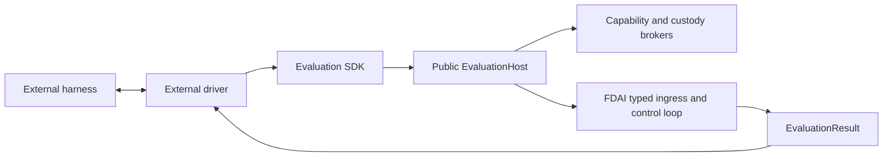

# 벤치마크 어댑터

이 설계는 FDAI runtime에 특정 benchmark package를 추가하지 않고 외부 평가 harness를 FDAI에
연결하는 방법을 정의합니다. 독립 SDK가 neutral contract와 bounded runner를 소유하고, FDAI는
public host와 그 뒤의 governed execution을 소유합니다.

> **범위:** Benchmark adapter는 harness lifecycle과 data를 변환합니다. FDAI action을 판단,
> 승인, 승격 또는 실행하지 않습니다.
>
> **구현 상태:** 독립 package SDK, public host 및 session, capability attenuation, artifact
> custody, workspace policy broker, SREGym migration, CyberGym acceptance driver, compatibility
> facade, installed-adapter discovery, bounded Kubernetes evidence, runner readiness check 및
> dependency gate가 구현되었습니다.

## 설계 요약

FDAI wheel에는 SREGym, CyberGym 또는 다른 harness protocol이 포함되지 않습니다. External
driver는 `fdai-evaluation-sdk`에 의존하고 public `EvaluationHost`를 받은 뒤 bounded session을
시작합니다. Host는 neutral task를 typed ingress로 변환하고 decision, risk, approval, execution 및
audit을 FDAI 내부에 유지합니다.



## Package 경계

두 layer는 서로 다른 release 및 dependency 경계를 가집니다.

| Layer | 위치 | 책임 |
|-------|------|------|
| Evaluation SDK | `evaluation-sdk/` | Immutable request, task, result, target, capability, workspace, artifact, receipt, adapter, host 및 runner contract입니다. |
| FDAI host | `src/fdai/evaluation/` | Typed ingress, capability attenuation, workspace 및 artifact policy, result mapping, cleanup 및 audit입니다. |
| Harness driver | `benchmarks/<name>/` | Harness lifecycle, neutral task mapping, external validation, package dependency 및 test입니다. |
| Compatibility facade | `src/fdai/benchmarking/` | Migration 기간의 legacy text task/submission, plugin, binding 및 runner API입니다. |

Harness driver는 별도 Python distribution입니다. FDAI만 설치하면 benchmark integration이
설치되거나 활성화되지 않습니다. Driver를 제거해도 FDAI runtime은 변경되지 않습니다.

## Contract

### Session, task 및 result

`EvaluationRequest`는 identity, purpose, requested capability, authority ceiling, task 및
concurrency limit, deadline, workspace policy, artifact policy, network policy 및 evidence
requirement를 포함하는 전체 session envelope를 선언합니다. `EvaluationTask`는 open phase,
objective, typed target, input artifact reference, declared output specification, capability,
deadline, resource limit 및 immutable metadata를 전달합니다.

`EvaluationResult`는 session, task 및 phase identity를 보존합니다. `completed`, `held` 또는
`failed`, bounded artifact 및 evidence reference, terminal audit reference, structured
`DecisionReceipt` 및 machine-readable reason을 반환합니다. Benchmark scoring은 FDAI 밖에
유지됩니다.

### Harness adapter

`EvaluationAdapter`는 네 개의 asynchronous operation을 제공합니다.

1. `start()`는 prerequisite를 검증하고 전체 `EvaluationRequest`를 반환합니다.
2. `next_task()`는 task 하나를 반환하거나 terminal harness state에서 `None`을 반환합니다.
3. `submit()`은 correlation이 유지된 `EvaluationResult` 하나를 harness로 반환합니다.
4. `close()`는 성공 또는 실패 시 transport resource를 해제합니다.

`EvaluationRunner`는 task를 읽기 전에 host session을 열고 duplicate 또는 cross-session
identity를 차단하며 request의 task limit을 적용합니다. 성공, 실패, timeout 또는 cancellation
후에는 session과 adapter를 모두 닫습니다.

### Capability 및 authority negotiation

Driver는 `observe.metrics.query`, `workspace.edit` 또는 `action.kubernetes.patch` 같은 semantic
capability를 요청합니다. FDAI는 request, host allowlist, session scope, RBAC, promotion registry,
risk decision 및 approval decision의 교집합으로 effective capability를 계산합니다. Host catalog가
각 capability의 side-effect class를 소유하므로 driver는 substrate mutation을 workspace operation으로
다시 표시할 수 없습니다.

Authority는 requested ceiling과 모든 server-owned ceiling의 최솟값입니다. Enforcement 요청은
observation mode로 열릴 수 있지만 FDAI를 promote할 수 없습니다. Workspace와 substrate mutation은
독립 policy 및 audit record를 가진 별도 side-effect class로 유지됩니다.

Host는 server-owned policy를 통해 각 neutral target kind를 routing resource type으로 매핑합니다.
SREGym에서는 evaluation task가 관련 없는 cluster-governance rule을 재사용하지 않도록
`kubernetes.namespace`를 그대로 유지합니다. Driver는 이 routing value를 제공하거나 override할 수
없습니다. Evidence collector는 effective observation capability에 대해서만 실행됩니다. Provider
error와 byte-limit violation은 execution decision 대신 structured unavailable evidence를 생성합니다.

## Public host 및 custody

`fdai.evaluation.public`은 `EvaluationHost`, `EvaluationSession` 및 API version만 export합니다.
`Container`, `ControlLoop`, state-store implementation 또는 private builder는 노출하지 않습니다.
Concrete host는 composition을 통해 typed collaborator를 받고 public session Protocol만 반환합니다.
`EvaluationRunner`는 session을 열기 전에 API version이 SDK의 exact version과 다른 host를
차단합니다.

Artifact publication은 bounded byte stream을 소비하고 content-addressed immutable `ArtifactRef`를
반환합니다. Broker는 declaration, MIME type, size, executable policy, session/task scope, 각
artifact의 TTL과 session maximum, reference equality 및 SHA-256 digest를 검증합니다. 실패하거나
취소된 stream의 partial content는 publish되지 않으며 session close는 in-flight operation이 끝난
뒤 task artifact를 제거합니다.
Completed result를 반환하기 전에 FDAI-owned output collector가 모든 declared output을 제공해야
하며, host는 각 reference를 broker를 통해 다시 읽어 scope, expiry, size 및 digest를 검증합니다.
Missing, duplicate, altered 또는 undeclared output은 driver submission 전에 fail closed됩니다.

Workspace access는 host path 또는 raw command string을 노출하지 않습니다. Provider는 task-root
isolation, path 및 symlink escape prevention, credential absence, network denial 및 ephemeral
teardown을 증명해야 합니다. Build와 test request는 CPU, memory, process, output 및 wall-clock
ceiling이 있는 server-reviewed profile을 지정합니다.

## Runtime 및 안전 경계

모든 plugin에 다음 경계를 적용합니다.

- **Agent 직접 호출 없음:** Public host는 typed ingress를 통해 publish합니다. Driver는 Pantheon
  agent를 직접 import하거나 호출하지 않습니다.
- **숨은 판단 없음:** Adapter는 stage와 payload만 변환합니다. Tier를 선택하거나 decision 또는
  approval을 만들 수 없습니다.
- **권한 증가 없음:** Plugin configuration은 promotion, risk, role, approval 또는 execution mode를
  변경할 수 없습니다.
- **Bounded evidence:** External metric, log, trace, inventory, file 및 validation receipt는 bounded
  untrusted evidence로 유지됩니다.
- **Correlation이 유지된 출력:** 모든 submission은 task identity를 보존하고, terminal FDAI audit
  reference가 있으면 포함하는 것이 좋습니다.
- **Oracle 접근 없음:** Plugin은 평가되는 agent에 노출된 harness interface만 사용합니다. Problem
  definition, expected answer 또는 grading internal을 검사하지 않습니다.

## SREGym driver

독립 `benchmarks/sregym/` distribution은 현재 다음 conductor surface를 변환합니다.

| Surface | Mapping |
|---------|---------|
| `GET /status` | 현재 open 또는 terminal benchmark stage입니다. |
| `GET /get_app` | Objective metadata 및 bounded Kubernetes namespace target입니다. |
| `POST /submit` | Correlation이 유지된 FDAI submission summary입니다. |

Plaintext conductor URL은 loopback 또는 SREGym의 정확한 `host.docker.internal` agent-container
alias에서만 허용됩니다. Non-container 실행에서는 wildcard bind address를 loopback으로
정규화합니다. 구성 URL의 credential, query string 및 fragment는 차단됩니다. 명시적 port는
1에서 65535 사이여야 하며 polling, stage 및 request timeout은 finite positive 값이어야 합니다.
Artifact identity는 shared benchmark identifier contract를 충족해야 합니다. 알 수 없는 stage와
malformed response는 fail closed됩니다.

`/submit`을 포함한 모든 conductor response는 bounded buffer를 통해 stream됩니다. 기본
`max_response_bytes` limit은 1,000,000 byte입니다. 구성된 limit을 초과하면 stream을 중단합니다.
JSON response는 bounded read가 완료된 후에만 decode됩니다.

Adapter는 가장 최근 `next_task()` 호출이 반환한 정확한 session, task 및 phase identity에 대한
result만 허용합니다. Conductor가 submission을 수락한 후에만 이 identity를 clear하므로,
transport failure는 같은 결과를 재시도할 수 있지만 발급되지 않았거나 phase가 다른 submission은
허용되지 않습니다.
이 identity가 outstanding 상태인 동안 다른 `next_task()` 호출은 conductor를 polling하기 전에
실패합니다.

Package는 `fdai_evaluation_sdk`만 import합니다. Neutral Kubernetes, metric, log 및 trace observation
capability를 요청합니다. `FdaiEvaluationHost`가 stable event construction, control-loop result
interpretation, idempotency, authority attenuation 및 audit correlation을 소유합니다.

FDAI는 `fdai.evaluation.adapters` entry-point group에서 설치된 driver를 검색합니다. Generic
runtime은 benchmark package를 import하지 않고 선택된 `EvaluationAdapter` contract를 load합니다.
SREGym package는 이 group에 `sregym`을 등록합니다.

현재 live SREGym composition은 explicit kubeconfig와 context를 통해 exact-namespace Kubernetes
inventory 및 event evidence와 explicit cluster-scoped Node capacity evidence를 제공합니다. Node
evidence는 별도 observe-only capability입니다. Node identity, readiness, schedulability 및 검증된
CPU와 memory allocatable quantity만 projection하고 address, label 및 extended resource는 제외합니다.
Kubectl adapter는 fixed read-only command, no shell, 최대 30초 timeout, output 및 item limit을
사용합니다. Diagnostic projection은 Secret object와 검토되지 않은 field를 제외합니다. 위임된
identity가 target namespace의 `metrics.k8s.io` pod를
읽을 수 있으면 adapter는 `observe.metrics.query`를 통해 정규화된 container CPU 및 memory 사용량을
projection합니다. Quantity normalization은 operational Kubernetes delivery package가 소유하므로
evaluation, runtime evidence, capacity 및 quota 진단은 동일한 exact base-unit 의미를 사용합니다.
Pod inventory는 image 또는 command literal을 보존하지 않고 immutable UID와 aggregate CPU/memory
request 및 검토된 source path를 projection합니다. 공유 hold-only reducer는 exact FailedScheduling
Pod UID와 complete eligible Node ceiling이 일치할 때만 capacity finding을 생성합니다. Truncated,
stale, conflicting 또는 incomplete evidence는 finding을 생성하지 않습니다. SREGym은 별도
observe-only `observe.kubernetes.capacity` capability를 통해 이 join을 요청합니다. Pod status는 crash
진단을 위해 제한된 직전 종료 reason, exit code 및 종료 시각도
보존합니다. Raw logs 및 traces는 별도 provider가 bind될 때까지 structured unavailable evidence로
유지됩니다.

공유 Kubernetes package에는 hold-only endpoint dependency reducer도 있습니다. Complete
same-namespace projection, exact short `host:port` environment reference, absent Service 및 referenced
port를 선언한 healthy same-name backend가 모두 있을 때만 missing-Service finding을 생성합니다.
Present, external, ambiguous, unhealthy, mismatched 또는 truncated evidence는 finding을 생성하지
않습니다.
SREGym은 별도 observe-only `observe.kubernetes.dependencies` capability를 통해 completed inventory
join을 요청합니다. Readiness는 실행 전에 이 capability를 probe하며 unavailable 또는 truncated
inventory는 absence finding을 생성할 수 없습니다.

실패한 Kubernetes admission event는 bounded webhook TLS, timeout, unavailable 또는 Pod Security
rejection code로 분류됩니다. 분류에는 failed event reason이 필요합니다. Informational text,
malformed webhook identity 및 인식되지 않은 message는 분류하지 않습니다. 인식된 admission
failure의 projected event는 raw message 대신 structured code와 bounded identity 또는 Pod Security
field만 보존합니다. 따라서 admission response가 echoed secret 또는 검토되지 않은 값을
deterministic finding으로 전달하지 못합니다.
Workload inventory는 bounded status condition의 active admission failure도 인식합니다. Normal
condition과 inactive historical failure는 non-finding으로 유지됩니다. 인식된 condition은 exact
status condition source path와 함께 `evidence_strength=direct_resource_condition`인 hold-only
candidate를 생성하고 raw message는 보존하지 않습니다. FDAI는 campaign의 fixed numeric ranking
weight를 복사하지 않습니다. Downstream ranking은 correlation을 proven causation으로 취급하지 않고
explicit evidence strength를 비교할 수 있습니다.

Requested Pod port를 사용할 수 없다고 보고하는 reviewed scheduler Event reason text는 raw message를
보존하지 않고 structured `host_port_conflict` code로 축약합니다. Hold-only candidate에는 complete
inventory/event receipt, 5분 evidence window 안의 event, exact affected Pod UID 및 complete valid
`hostPort`/protocol projection이 필요합니다. Finding은 bounded port fact와 reviewed source path만
포함합니다. Name-only, stale, future, malformed, ambiguous 또는 truncated evidence는 finding을
생성하지 않으며 event만으로 어느 Node가 conflicting socket을 소유하는지 증명하지 않습니다.
Source campaign의 host-port conflict reason-specific RCA priority는 port하지 않습니다. Absorbed
finding은 `candidate_only` 및 `hold`로 유지되므로 reason string이 authoritative structural cause로
승격할 수 없습니다. Future ordering은 reason-specific branch를 추가하지 않고 generic reviewed
evidence-strength 및 contradiction metadata를 비교해야 합니다.
Provider-neutral log reduction은 exact Pod UID, container identity 및 5분 evidence window 안의
timestamp를 가진 bounded record에서 reviewed `EADDRINUSE`, `address already in use`, Linux `errno
98` signature만 인식합니다. Raw body, address 또는 port 없이 occurrence count를 포함한 hold-only
socket-bind candidate를 생성합니다. Missing UID, stale, future, oversized, unrecognized 또는 incomplete
record는 finding을 생성하지 않습니다. Concrete bounded `observe.logs.query` provider는 별도 작업이므로
이 semantic reducer만으로 mechanism이 operationalized되지는 않습니다.
Log target selection도 provider-neutral이며 bounded입니다. Exact Pod UID, valid creation timestamp
및 complete container-status projection이 필요합니다. Pod ceiling의 절반은 active-failure, restart,
readiness priority로 선택하고 나머지는 recency로 채운 뒤 priority order로 돌아갑니다. 각 Pod의 별도
container ceiling 안에서는 failing container가 restarted/healthy container보다 앞섭니다. 따라서 오래된
unhealthy backlog와 최근 healthy Pod burst 모두 relevant evidence를 starvation시키지 못합니다.
Incomplete 또는 ambiguous identity는 target을 생성하지 않습니다.

Observe-only `observe.kubernetes.owners` capability는 bounded namespace inventory에서 최대 8개
custom owner reference를 따라갑니다. 각 lookup은 owner reference UID를 보존하며 반환된 custom
resource의 API group, kind, name, namespace 및 immutable UID가 모두 일치할 때만 허용합니다.
Recreated name, cross-namespace owner, invalid reference, lookup failure 및 omitted owner는 evidence를
incomplete로 만들고 partial owner set을 노출하지 않습니다. Projection은 bounded identity,
generation, deletion 및 condition field만 보존하며 임의 custom resource spec string은 제외합니다.
Source campaign의 arbitrary custom owner spec field-basename validation은 port하지 않습니다. 일치하는
CRD OpenAPI schema와 exact schema path가 없으면 `runAsUser`, `effect` 또는 `updateStrategy`라는 field
name만으로 Kubernetes security-context, toleration 또는 workload strategy semantic을 증명할 수
없습니다. 따라서 FDAI는 해당 value를 projection하거나 configuration finding을 생성하지 않습니다.
Complete workload projection에 projected custom owner UID와 일치하는 controller owner reference가
하나 있으면 degraded child는 hold-only `custom_owner_has_degraded_workload` candidate를 생성합니다.
이는 direct ownership relationship을 증명하지만 owner configuration이 degradation을 일으켰다고
증명하지 않습니다. Source campaign의 `configuration_precedes` 주장과 임의 custom spec projection은
configuration change timestamp 또는 interventional evidence가 없으므로 의도적으로 거부합니다.

Inventory evidence는 Pod image pull failure와 owning Deployment, StatefulSet 또는 DaemonSet
template의 drift를 correlate할 수 있습니다. Correlation에는 complete container projection, 각 hop의
exact controller owner 하나, chain 내 모든 resource의 immutable UID match, 인식된 waiting reason 및
같은 container name의 서로 다른 SHA-256 image-reference fingerprint가 필요합니다. Raw image
reference는 projection하지 않습니다. Recreated, ambiguous, malformed 또는 truncated evidence는
finding을 생성하지 않으며 결과는 template drift가 pull failure를 일으켰다는 주장이 아닌 hold-only
candidate로 유지됩니다.
Source campaign의 automatic operator-namespace traversal은 port하지 않습니다. 이 구현은 custom
resource plural을 kind name에서 추론하고, broad API-group read access를 controller identity로
취급하며, complete RBAC projection 없이 query를 확장했습니다. Allowlisted namespace만으로 inventory
확장을 시작하지 않습니다. Future traversal capability는 discovered CRD plural identity, exact reviewed
verb/resource, complete role/binding projection 및 explicit bounded scope를 사용해야 합니다.

Campaign의 generic custom-resource patch allowlist는 port하지 않습니다. Exact API-version/kind
allowlist와 generation check는 새 mutation primitive에 필요하지만 충분하지 않습니다. Source
change는 arbitrary custom resource에 대한 durable target lock, persistent duplicate suppression,
pre-effect audit intent, bounded rollback drill 및 observer-independent effect verification을
독립적으로 증명하지 않습니다. 따라서 current live executor는
`remediate.kubernetes-patch`를 미등록 상태로 유지합니다. Future implementation은 새로운
shadow-first ActionType으로 시작하고 real staging substrate에서 7개 safeguard를 모두 충족해야
합니다. Evaluation environment variable은 해당 authority를 부여할 수 없습니다.

Admission evidence는 bounded MutatingWebhookConfiguration 및
ValidatingWebhookConfiguration projection을 읽습니다. Structured failed event는 complete
projection 전체에서 webhook name이 유일하고 affected resource가 target namespace에 있을 때만
configuration candidate를 식별할 수 있습니다. TLS, timeout 및 backend failure는 검토된 source
path와 bounded failure policy/Service identity를 보존합니다. Webhook URL과 CA bundle은 계속
제외합니다. Finding은 candidate-only이며 webhook name 일치는 configuration이 external failure를
일으켰다는 증명이 아닙니다.
Missing webhook backend semantic은 namespace inventory보다 강한 absence boundary를 사용합니다.
Candidate에는 complete webhook projection 하나와 successful read가 absence를 확인한 exact targeted
Service receipt 하나가 필요합니다. Present, failed, ambiguous, malformed 또는 truncated receipt는
finding을 생성하지 않습니다. Candidate는 configuration identity, webhook name, failure policy,
Service identity 및 reviewed source path만 보존합니다. Targeted receipt provider는 별도 작업이며
reducer만으로 제공된다고 간주하지 않습니다. Admission evaluation provider는 최대 8개의 exact
allowlisted `service/{name} --ignore-not-found` read를 수행합니다. Empty successful output만 absence를
확인하며 out-of-scope, failed, oversized, malformed 또는 identity-mismatched response는 Service
evidence를 incomplete로 만듭니다.
FDAI는 webhook Service reference를 사용해 backend namespace의 full inventory를 수집하지 않습니다.
해당 reference는 namespace 내 모든 resource에 대한 dependency나 evidence surface 확장 authority를
증명하지 않습니다. Exact targeted Service receipt가 backend absence evidence에서 source campaign의
broad cross-namespace traversal을 대체합니다.
FDAI는 webhook backend Pod를 선택하는 deny-all NetworkPolicy도 API-server traffic 차단의 증거로
취급하지 않습니다. Service selector와 Pod label은 membership을 증명하지만 control-plane network
path나 policy enforcement point를 증명하지 않습니다. Direct path evidence가 없으면 이는 unproven
correlation으로 남고 causal finding을 생성하지 않습니다.
Source campaign의 automatic `failurePolicy: Fail` to `Ignore` recovery seed는 port하지 않습니다.
이 mutation은 admission security intent를 fail-open으로 바꾸고 missing backend를 복구하지 않으며,
resulting admission과 rollback이 intended control을 보존한다는 independent proof도 없습니다. Approval,
resource-version check 및 server dry-run만으로 해당 outcome을 증명할 수 없습니다. 따라서 missing
backend finding은 hold-only로 유지되며 control-plane patch authority를 부여하지 않습니다.
TLS trust failure에도 같은 rejection을 적용합니다. `failurePolicy` 변경은 certificate validation을
우회하며 trust chain이나 intended admission control을 복구하지 않습니다.
Webhook namespace selector가 expression 없이 exact
`kubernetes.io/metadata.name=<namespace>` match label 하나만 포함할 때 missing-backend candidate는
해당 namespace와 reviewed selector path를 기록합니다. Extra label, expression, malformed selector 또는
presence-only projection은 impact scope를 생략합니다. Readiness는 affected workload를 식별하거나
namespace set을 확장하지 않습니다.

Cumulative timeout evidence는 별도 candidate-only mechanism입니다. 서로 다른 webhook name의
structured timeout event가 최소 2개이고, affected resource immutable UID가 같으며, trusted evidence
cutoff로 끝나는 5분 window 안의 timestamp가 있어야 합니다. Duplicate, stale, future, UID-conflicting,
malformed 또는 truncated event는 finding을 생성하지 않습니다. Source campaign 구현과 달리 direct
policy-path 및 temporal evidence 없이 NetworkPolicy나 degraded workload를 원인으로 추론하지 않습니다.
Source campaign의 cumulative-timeout NetworkPolicy recovery patch는 port하지 않습니다. Common
backend port와 ingress deny-all policy만으로 API-server traffic이 해당 policy를 통과한다는 사실이나
bounded source selector를 증명할 수 없습니다. Port의 unrestricted ingress를 추가하면 unrelated
traffic을 넓힐 수 있고 independent effect 및 rollback-outcome evidence도 없습니다. 따라서 timeout
candidate는 `remediate.kubernetes-patch` authority를 부여하지 않습니다.

공유 Kubernetes package에는 hold-only admission resource-drift reducer가 있습니다. Exact core/v1
Pod CREATE rule을 가진 complete selector-free, namespace-unscoped
MutatingWebhookConfiguration 하나와 normalized request 또는 limit drift 사이의 candidate-only
correlation을 보고합니다. Complete workload selector도 complete Pod label과 일치해야 합니다.
Reducer는 webhook이 drift를 일으켰다고 주장하지 않습니다. 여러 mutator, conditional mutator,
scoped mutator, incompatible mutator, semantically equivalent quantity 및 incomplete evidence는
finding을 생성하지 않습니다. 별도 observe-only `observe.kubernetes.admission` capability는 bounded
namespace inventory와 bounded cluster-scoped webhook projection을 join합니다. Webhook URL, CA bundle
및 검토되지 않은 field는 projection하지 않습니다. 이는 namespace scope 또는 rule applicability를
증명하지 않고 mutator 하나를 causal로 취급하던 source campaign 동작을 강화합니다.

Restricted Pod Security admission evidence는 recent structured rejection이 exact ReplicaSet UID
하나를 지정하고 complete single-controller reference가 exact Deployment UID 하나에 도달하며 해당
Deployment의 desired replica가 ready replica보다 많을 때만 correlate합니다. Finding은 closed reviewed
violation vocabulary, profile/version, immutable identity를 포함하고 raw message는 제외합니다. Unknown,
stale, future, recreated, ambiguous, healthy 또는 truncated evidence는 finding을 생성하지 않습니다.
Diagnosis는 candidate-only이며 SecurityContext patch를 projection하거나 authorize하지 않습니다.

Liveness failure evidence는 raw message를 보존하지 않는 recent structured `Unhealthy` Event 하나에서
reduce합니다. Candidate에는 exact Pod UID, complete single-controller Pod-to-ReplicaSet 및
ReplicaSet-to-Deployment UID chain, degraded Deployment, 세 resource에서 동일한 liveness-probe
fingerprint 하나가 필요합니다. Probe command, HTTP path, header 및 address는 projection하지 않고
mechanism, bounded timing 및 SHA-256 definition fingerprint만 보존합니다. Drift, ambiguity, stale/future
Event 및 truncated evidence는 abstain합니다. FDAI는 source campaign의 fixed sleep 및 second Event
read를 복사하지 않으며 normal evidence freshness가 해당 concern을 소유합니다.
동일한 full-chain probe identity가 모든 hop에서 initial delay 0, period 1초, startup probe 부재를
가질 때 기존 candidate에 `aggressive_schedule=true`를 추가합니다. 새 reason, priority branch 또는
action authority를 만들지 않습니다. Chain의 startup gate가 불일치하면 abstain합니다.
Source campaign의 deterministic SecurityContext patch는 port하지 않습니다. Syntactically grounded
template change도 process identity, capability 및 workload behavior를 바꿀 수 있으며 admission
success만으로 rollout health, application correctness 또는 rollback restoration을 증명할 수 없습니다.
해당 effect와 7개 action safeguard를 독립적으로 검증할 때까지 live executor는
`remediate.kubernetes-patch`를 미등록 상태로 유지하고 substrate call을 수행하지 않습니다.

Deterministic 판단 보류 시 기존 grounded RCA path가 task objective와 bounded evidence를 받습니다.
Hypothesis는 typed `ControlLoopResult`에 보존되고 submission summary로 render됩니다. RCA reasoner가
없으면 runner는 benchmark 시작 전에 차단됩니다. Generic control-loop outcome을 SREGym solution으로
제출하지 않습니다. Citation grounding은 supplied raw reference 또는 exact `kind:ref` token을
허용합니다. Mismatched kind 또는 unknown reference는 계속 hypothesis를 차단합니다.

Harness를 시작하기 전에 readiness check를 실행합니다.

```bash
fdai-evaluation-runner check --adapter sregym
```

`FDAI_EVALUATION_KUBECONFIG`, `FDAI_EVALUATION_KUBERNETES_CONTEXT`,
`FDAI_EVALUATION_KUBERNETES_CLUSTER` 및 comma-separated exact namespace allowlist인
`FDAI_EVALUATION_KUBERNETES_NAMESPACES`를 구성합니다. Readiness는 installed-adapter discovery,
live Kubernetes inventory, event 및 Node evidence access, pod metrics access 및 configured grounded
RCA reasoner를 요구합니다. 실행 전에 allowlist에 포함된 모든 namespace에서 inventory, events,
Nodes, capacity join 및 `metrics.k8s.io`를 probe합니다. 또한 synthetic citation-bounded RCA request를 한 번
전송하므로 stale 또는 missing model deployment는 ready로 표시되지 않습니다. 모든 check를 통과해도
host authority는 관찰 모드로 유지됩니다.

Subscription에 capability-specific deployment를 추가할 quota가 없으면 endpoint discovery가
`t2.rca`를 같은 account의 기존 verified deployment에 bind할 수 있습니다. 생성된 binding은 URL 대신
abstract `azure-openai:<account>` reference를 저장합니다. Runtime composition은
`FDAI_LLM_ENDPOINT`와 일치하는 reference만 resolve하며 다른 account reference는 startup을
차단합니다.

Plugin image는 검토된 SREGym agent base 위에 FDAI distribution, rule 및 policy catalog, SREGym
plugin을 포함합니다. Root Docker build context는 local runtime state, resolved model file, log,
temporary artifact 및 secret을 제외합니다.

## CyberGym driver

독립 `benchmarks/cybergym/` package는 FDAI core 변경 없이 두 mode를 증명합니다.

- **`e2e`:** Source workspace만 받고 bounded `poc.bin`과 `fix.patch` output을 선언합니다.
- **`patch-only`:** Source workspace, crash log 및 benchmark-provided PoC를 받고 `fix.patch`만
  선언합니다.

Task config에는 ground-truth PoC, hidden-test, oracle 또는 grader field가 없습니다. FDAI session이
닫힌 뒤 external driver는 crash reproduction, patched crash prevention, project test 및 ground-truth
PoC prevention을 네 artifact-backed validation stage로 매핑합니다. 생성된
`ExternalValidationReceipt`는 항상 execution에 대해 untrusted로 표시됩니다. Host는 참조 task
session이 닫힌 뒤에만 이를 수락하고 unexpired same-task artifact reference를 검증하며, exact
retry는 deduplicate하고 conflict는 차단합니다.

Repository-level `scripts/benchmarking/run_cybergym.py` command는 official task를 위한 shadow-only
runner를 제공합니다. CyberGym-E2E checkout에서 project 및 task TOML을 읽고 CPU, memory, process
limit가 적용된 disposable Docker container에 source를 materialize합니다. Copilot은 task workspace와
artifact directory만 쓸 수 있는 bubblewrap filesystem boundary 안에서 실행됩니다. 각 validation
stage는 fresh container에서 실행됩니다. Hidden ground-truth input은 agent 실행이 끝난 뒤 해당
validation container에만 전달되며 agent sandbox에는 mount되지 않습니다.

`run` 전에 `check`를 사용하여 Docker, bubblewrap, Copilot CLI, GitHub authentication, task config,
source data 및 validator readiness를 확인합니다. `patch-only` mode가 성공하려면 project-test stage
3과 ground-truth PoC stage 4를 모두 통과해야 합니다. Stage 4는 patched `run_poc.sh` path가 제공된
PoC에 대해 status 0으로 종료되어야 합니다. Crash를 nonzero exit로 바꾸는 것만으로는 repair가
실패한 상태입니다. Task repository, immutable 및 pre-patch path는 relative path여야 하며 parent
traversal component를 포함할 수 없습니다. 유효하지 않은 task path는 container 시작 전에
실패합니다. Runner는 configured output root 아래에 bounded agent log, `fix.patch`, `result.json`
및 시도한 validation stage별 JSON receipt를 보존합니다. Host command의 stdout과 stderr는 독립된
byte cap을 적용하여 streaming하며, 두 stream 중 하나라도 limit를 초과하면 child process를 즉시
종료합니다. Validation 전에 runner는 patch가 modify, rename 또는 copy하는 path를 task의 immutable
path와 비교하고 overlap이 있으면 거부합니다.

## Compatibility 및 enforcement

Legacy `fdai.benchmarking` API는 `0.1.x` release line에서 유지됩니다. Caller가
`fdai-evaluation-sdk`로 migration하는 동안 기존 contract, runner 및 plugin suite가 계속 통과합니다.
제거는 한 번의 documented minor release window 이후 `0.2.0` 이상에서만 가능합니다.

`check-evaluation-boundaries.py`는 Python AST로 import와 call을 분석합니다. CI는 FDAI의 benchmark
import, driver의 private FDAI import, SDK의 FDAI implementation import, metadata 또는 log의 binary
literal 및 reviewed workspace provider를 우회하는 command execution을 차단합니다. 별도 CI job은
frozen multi-package workspace를 설치하고 모든 evaluation suite를 실행하며 SDK, SREGym 및
CyberGym wheel을 독립적으로 build합니다. 각 package는 90% line-and-branch coverage floor, strict
mypy 및 Ruff를 통과해야 합니다.

## 검증

Integration을 개발할 때 다음 focused suite를 사용합니다.

Root `dev` extra는 cross-package integration test를 collect할 수 있도록 두 driver distribution을
workspace-only dependency로 bind합니다. FDAI runtime dependency에는 포함되지 않으며 각 wheel은 계속
독립적으로 build할 수 있습니다. `uv sync --extra dev --frozen`으로 이 dev 환경을 준비합니다.

```bash
.venv/bin/python -m pytest -q --no-cov evaluation-sdk/tests tests/evaluation
PYTHONPATH=evaluation-sdk/src:benchmarks/sregym/src .venv/bin/python -m pytest \
  -q --no-cov benchmarks/sregym/tests
PYTHONPATH=evaluation-sdk/src:benchmarks/cybergym/src .venv/bin/python -m pytest \
  -q --no-cov benchmarks/cybergym/tests
.venv/bin/python scripts/quality/architecture/check-evaluation-boundaries.py
```

Suite는 strict schema, immutability, attenuation, custody, workspace isolation, correlation,
idempotency, timeout, cancellation, cleanup, external validation, package boundary 및 두 benchmark
lifecycle을 검증합니다.

## 관련 문서

| 알아볼 내용 | 문서 |
|-------------|------|
| Repository 및 dependency 경계 | [Project Structure](../architecture/project-structure-ko.md) |
| Provider injection contract | [CSP Neutrality](../architecture/csp-neutrality-ko.md) |
| Governed execution path | [Execution Model](../decisioning/execution-model-ko.md) |
| Observable evaluation artifact | [Governed Trajectory Datasets](governed-trajectory-datasets-ko.md) |
