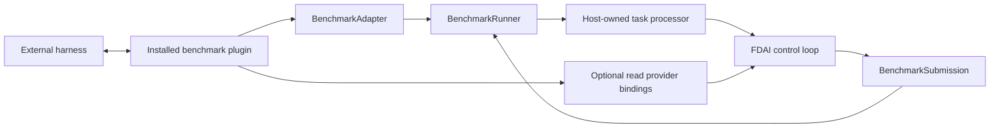

# Benchmark Adapters

This design defines how external evaluation harnesses connect to FDAI without adding a
benchmark-specific package to the FDAI runtime. The base distribution owns stable contracts and a
bounded runner. Each integration remains an independently installed plugin under `benchmarks/`.

> **Scope:** A benchmark adapter translates harness lifecycle and data. It does not judge, approve,
> promote, or execute an FDAI action.
>
> **Implementation status:** The generic task, submission, adapter, plugin, provider-binding, and
> runner contracts are implemented. The SREGym package implements conductor lifecycle translation.
> The base distribution does not yet provide a production `BenchmarkTaskProcessor`, benchmark CLI,
> SREGym observation providers, or an SREGym execution binding.

## Design at a glance

The FDAI wheel contains no SREGym, SWE-bench, or other harness protocol. It discovers an explicitly
installed package through the `fdai.benchmark_adapters` Python entry-point group. The plugin returns
an external harness adapter and optional read-only provider replacements. A host-owned task
processor remains responsible for sending work through the normal FDAI event, decision, and audit
path.



## Package boundary

The two layers have different release and dependency boundaries:

| Layer | Location | Responsibility |
|-------|----------|----------------|
| Generic framework | `src/fdai/benchmarking/` | Stable values, lifecycle Protocol, plugin discovery, explicit provider binding, and bounded runner. |
| Harness plugin | `benchmarks/<name>/` | Harness transport, package dependencies, entry-point registration, container assets, and adapter tests. |

A harness plugin is a separate Python distribution. Installing FDAI alone does not install or
activate any benchmark integration. Removing a plugin leaves the FDAI runtime unchanged.

## Contracts

### Task and submission

`BenchmarkTask` carries a run id, task id, open stage string, objective, target reference, and
bounded metadata. The stage stays open rather than using a diagnosis-specific enum so one runner
can support code repair, operational recovery, security assessment, and future benchmark shapes.

`BenchmarkSubmission` returns the same identity, a terminal `completed`, `held`, or `failed`
status, a bounded summary, at most 256 evidence references, and an optional audit reference. The
runner rejects a submission whose identity differs from its task.

### Harness adapter

`BenchmarkAdapter` exposes four asynchronous operations:

1. `start()` validates prerequisites before accepting work.
2. `next_task()` returns one task or `None` at terminal harness state.
3. `submit()` returns one correlated result to the harness.
4. `close()` releases transport resources on success or failure.

The runner rejects duplicate task identities and stops at a configured task count. `close()` runs
even when processing or submission fails. Values returned by the adapter and task processor must
be `BenchmarkTask` and `BenchmarkSubmission` instances; invalid collaborator output fails before
field access or harness submission.

### Provider binding

`BenchmarkBindings` may replace `MetricProvider`, `LogQueryProvider`, `TraceQueryProvider`, or
`Inventory` on a new immutable `Container`. Unspecified seams retain their exact existing
instances. This bundle intentionally excludes promotion state, risk policy, approval, and mutation
executors.

Every declared override must satisfy its runtime-checkable provider Protocol before the container
is replaced. An invalid provider blocks plugin composition instead of failing on the first metric,
log, trace, or inventory query.

A benchmark that needs mutation must use an existing governed execution adapter selected by the
host composition. The benchmark plugin cannot introduce a second execution path or raise an
ActionType from observation mode to enforcement mode.

## Plugin discovery

An installed package registers one exact entry point:

```toml
[project.entry-points."fdai.benchmark_adapters"]
example = "fdai_bench_example:create_plugin"
```

Discovery is deterministic and rejects duplicate names. Loading rejects a missing plugin, a
non-callable factory, an entry-point name that differs from `plugin_id`, and a benchmark API version
other than the host's exact version. Registry enumeration, entry-point import, and factory failures
are normalized without exposing provider error text. Package installation remains an
operator-controlled supply chain action; entry-point discovery is not a public package downloader
or a signature verifier.

## Runtime and safety boundaries

The following boundaries apply to every plugin:

- **No agent calls:** The task processor publishes through FDAI's typed ingress. It does not import
  or call a Pantheon agent directly.
- **No hidden judgment:** The adapter translates stages and payloads only. It cannot select a tier,
  issue a decision, or construct an approval.
- **No authority increase:** Plugin configuration cannot change promotion, risk, role, approval, or
  execution mode.
- **Bounded evidence:** External metrics, logs, traces, and inventory enter through existing
  provider contracts and remain untrusted evidence.
- **Correlated output:** Every submission preserves the task identity and should include the
  terminal FDAI audit reference when one exists.
- **No oracle access:** A plugin uses only the harness interface exposed to evaluated agents. It
  does not inspect problem definitions, expected answers, or grading internals.

## SREGym plugin

The independent `benchmarks/sregym/` distribution currently translates these conductor surfaces:

| Surface | Mapping |
|---------|---------|
| `GET /status` | Current open or terminal benchmark stage. |
| `GET /get_app` | Objective metadata and bounded Kubernetes namespace target. |
| `POST /submit` | Correlated FDAI submission summary. |

Plaintext conductor URLs are accepted only on loopback or SREGym's exact
`host.docker.internal` agent-container alias. A wildcard bind address is normalized to loopback for
non-container runs. Credentials, query strings, and fragments in the configured URL are rejected.
An explicit port must be between 1 and 65535, and polling, stage, and request timeouts must be
finite and positive. Unknown stages and malformed responses fail closed.

Every conductor response, including `/submit`, is streamed through a bounded buffer. The default
`max_response_bytes` limit is 1,000,000 bytes; exceeding the configured limit stops the stream.
JSON responses are decoded only after the bounded read completes.

The adapter accepts a submission only for the exact run, task, and stage identity returned by its
latest `next_task()` call. It clears that identity only after the conductor accepts the submission,
so a transport failure can retry the same result without permitting an unissued or wrong-stage
submission.
While that identity is outstanding, another `next_task()` call fails before polling the conductor.

SREGym metric, log, trace, and Kubernetes MCP transports are not implemented in this slice. Until
they bind through the existing providers and governed execution contracts, this plugin alone is not
a complete SREGym evaluation agent.

## Verification

Use two focused suites while developing an integration:

```bash
.venv/bin/python -m pytest -q --no-cov tests/benchmarking
PYTHONPATH=src:benchmarks/sregym/src .venv/bin/python -m pytest \
  -q --no-cov benchmarks/sregym/tests
```

The generic suite verifies contract bounds, immutable metadata, duplicate and identity rejection,
plugin compatibility, task limits, cleanup, and provider preservation. Each plugin owns transport
and harness-specific tests in its distribution.

## Related docs

| To learn about | Read |
|----------------|------|
| Repository and dependency boundaries | [Project Structure](../architecture/project-structure.md) |
| Provider injection contracts | [CSP Neutrality](../architecture/csp-neutrality.md) |
| Governed execution paths | [Execution Model](../decisioning/execution-model.md) |
| Observable evaluation artifacts | [Governed Trajectory Datasets](governed-trajectory-datasets.md) |
