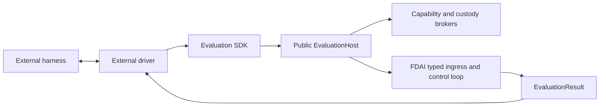

# Benchmark Adapters

This design defines how external evaluation harnesses connect to FDAI without adding a
benchmark-specific package to the FDAI runtime. A standalone SDK owns neutral contracts and a
bounded runner. FDAI owns the public host and governed execution behind it.

> **Scope:** A benchmark adapter translates harness lifecycle and data. It does not judge, approve,
> promote, or execute an FDAI action.
>
> **Implementation status:** The independently packageable SDK, public host and session,
> capability attenuation, artifact custody, workspace policy broker, SREGym migration, CyberGym
> acceptance driver, installed-adapter discovery, bounded Kubernetes evidence, runner readiness
> checks, compatibility facade, and dependency gates are implemented.

## Design at a glance

The FDAI wheel contains no SREGym, CyberGym, or other harness protocol. An external driver depends
on `fdai-evaluation-sdk`, receives a public `EvaluationHost`, and initiates a bounded session. The
host turns neutral tasks into typed ingress and keeps decision, risk, approval, execution, and audit
inside FDAI.



## Package boundary

The layers have different release and dependency boundaries:

| Layer | Location | Responsibility |
|-------|----------|----------------|
| Evaluation SDK | `evaluation-sdk/` | Immutable request, task, result, target, capability, workspace, artifact, receipt, adapter, host, and runner contracts. |
| FDAI host | `src/fdai/evaluation/` | Typed ingress, capability attenuation, workspace and artifact policy, result mapping, cleanup, and audit. |
| Harness driver | `benchmarks/<name>/` | Harness lifecycle, neutral task mapping, external validation, package dependencies, and tests. |
| Compatibility facade | `src/fdai/benchmarking/` | Legacy text task/submission, plugin, binding, and runner API during migration. |

A harness driver is a separate Python distribution. Installing FDAI alone does not install or
activate a benchmark integration. Removing a driver leaves the FDAI runtime unchanged.

## Contracts

### Session, task, and result

`EvaluationRequest` declares the complete session envelope: identity, purpose, requested
capabilities, authority ceiling, task and concurrency limits, deadline, workspace policy, artifact
policy, network policy, and evidence requirements. `EvaluationTask` carries an open phase,
objective, typed target, input artifact references, declared output specifications, capabilities,
deadline, resource limits, and immutable metadata.

`EvaluationResult` preserves the session, task, and phase identity. It returns `completed`, `held`,
or `failed`, bounded artifact and evidence references, a terminal audit reference, a structured
`DecisionReceipt`, and a machine-readable reason. Benchmark scoring stays outside FDAI.

### Harness adapter

`EvaluationAdapter` exposes four asynchronous operations:

1. `start()` validates prerequisites and returns the complete `EvaluationRequest`.
2. `next_task()` returns one task or `None` at terminal harness state.
3. `submit()` returns one correlated `EvaluationResult` to the harness.
4. `close()` releases transport resources on success or failure.

`EvaluationRunner` opens the host session before reading tasks, rejects duplicate or cross-session
identities, enforces the request's task limit, and closes both the session and adapter after
success, failure, timeout, or cancellation.

### Capability and authority negotiation

Drivers request semantic capabilities such as `observe.metrics.query`, `workspace.edit`, or
`action.kubernetes.patch`. FDAI computes effective capabilities as the intersection of the request,
host allowlist, session scope, RBAC, promotion registry, risk decision, and approval decision. The
host catalog owns each capability's side-effect class, so a driver cannot relabel a substrate
mutation as a workspace operation.

Authority is the minimum of the requested ceiling and every server-owned ceiling. A request for
enforcement can therefore open as observation mode, but it can never promote FDAI. Workspace and
substrate mutations remain separate side-effect classes with independent policy and audit records.

The host maps each neutral target kind to a routing resource type through server-owned policy.
For SREGym, `kubernetes.namespace` remains `kubernetes.namespace` so an evaluation task does not
reuse unrelated cluster-governance rules. The driver cannot supply or override that routing value.
Evidence collectors run only for effective observation capabilities. Provider errors and
byte-limit violations produce structured unavailable evidence instead of an execution decision.

## Public host and custody

`fdai.evaluation.public` exports only `EvaluationHost`, `EvaluationSession`, and the API version.
It does not expose `Container`, `ControlLoop`, state-store implementations, or private builders.
The concrete host accepts typed collaborators through composition and returns only the public
session Protocol. `EvaluationRunner` rejects a host whose API version differs from the SDK's exact
version before opening a session.

Artifact publication consumes bounded byte streams and returns content-addressed immutable
`ArtifactRef` values. The broker verifies declarations, MIME type, size, executable policy,
session/task scope, each artifact's TTL against the session maximum, reference equality, and
SHA-256 digest. Partial content from a failed or cancelled stream is never published, and session
close waits for in-flight operations before removing task artifacts.
Before a completed result is returned, an FDAI-owned output collector must provide every declared
output and the host re-reads each reference through the broker to verify scope, expiry, size, and
digest. Missing, duplicate, altered, or undeclared outputs fail closed before driver submission.

Workspace access exposes no host path or raw command string. A provider must prove task-root
isolation, path and symlink escape prevention, credential absence, network denial, and ephemeral
teardown. Build and test requests name server-reviewed profiles with CPU, memory, process, output,
and wall-clock ceilings.

## Runtime and safety boundaries

The following boundaries apply to every plugin:

- **No agent calls:** The public host publishes through typed ingress. Drivers don't import or call
  a Pantheon agent directly.
- **No hidden judgment:** The adapter translates stages and payloads only. It cannot select a tier,
  issue a decision, or construct an approval.
- **No authority increase:** Plugin configuration cannot change promotion, risk, role, approval, or
  execution mode.
- **Bounded evidence:** External metrics, logs, traces, inventory, files, and validation receipts
  remain bounded untrusted evidence.
- **Correlated output:** Every submission preserves the task identity and should include the
  terminal FDAI audit reference when one exists.
- **No oracle access:** A plugin uses only the harness interface exposed to evaluated agents. It
  does not inspect problem definitions, expected answers, or grading internals.

## SREGym driver

The independent `benchmarks/sregym/` distribution currently translates these conductor surfaces:

| Surface | Mapping |
|---------|---------|
| `GET /status` | Current open or terminal benchmark stage. |
| `GET /get_app` | Objective metadata and bounded Kubernetes namespace target. |
| `POST /submit` | Correlated FDAI submission summary. |

Plaintext conductor URLs are accepted only on loopback or SREGym's exact
`host.docker.internal` agent-container alias. A wildcard bind address is normalized to loopback for
non-container runs. Credentials, query strings, and fragments in the configured URL are rejected.
An explicit port must be between 1 and 65535, and polling, stage, and request timeouts must be
finite and positive. The artifact identity must satisfy the shared benchmark identifier contract.
Unknown stages and malformed responses fail closed.

Every conductor response, including `/submit`, is streamed through a bounded buffer. The default
`max_response_bytes` limit is 1,000,000 bytes; exceeding the configured limit stops the stream.
JSON responses are decoded only after the bounded read completes.

The adapter accepts a result only for the exact session, task, and phase identity returned by its
latest `next_task()` call. It clears that identity only after the conductor accepts the submission,
so a transport failure can retry the same result without permitting an unissued or wrong-phase
submission.
While that identity is outstanding, another `next_task()` call fails before polling the conductor.

The package imports only `fdai_evaluation_sdk`. It requests neutral Kubernetes, metric, log, and
trace observation capabilities. `FdaiEvaluationHost` owns stable event construction, control-loop
result interpretation, idempotency, authority attenuation, and audit correlation.

FDAI discovers installed drivers through the `fdai.evaluation.adapters` entry-point group. The
generic runtime loads the selected `EvaluationAdapter` contract without importing a benchmark
package. The SREGym package registers `sregym` in that group.

The current live SREGym composition provides exact-namespace Kubernetes inventory and event
evidence through an explicit kubeconfig and context. The kubectl adapter uses fixed read-only
commands, no shell, a 30-second maximum timeout, output and item limits, and a diagnostic projection
that excludes Secret objects and unreviewed fields. Metrics, logs, and traces remain structured
unavailable evidence until their providers are bound.

On deterministic hold for review, the existing grounded RCA path receives the task objective and
bounded evidence. Its hypothesis is preserved in the typed `ControlLoopResult` and rendered as the
submission summary. The runner blocks before a benchmark starts when the RCA reasoner is absent;
it never submits a generic control-loop outcome as an SREGym solution. Citation grounding accepts
the supplied raw reference or its exact `kind:ref` token; a mismatched kind or unknown reference
still blocks the hypothesis.

Run the readiness check before starting a harness:

```bash
fdai-evaluation-runner check --adapter sregym
```

Configure `FDAI_EVALUATION_KUBECONFIG`, `FDAI_EVALUATION_KUBERNETES_CONTEXT`,
`FDAI_EVALUATION_KUBERNETES_CLUSTER`, and the comma-separated exact namespace allowlist in
`FDAI_EVALUATION_KUBERNETES_NAMESPACES`. Readiness requires installed-adapter discovery, live
Kubernetes inventory access, both Kubernetes evidence providers, and a configured grounded RCA
reasoner. It also sends one synthetic citation-bounded RCA request so a stale or missing model
deployment cannot report ready. The host authority remains observation mode even when all checks
pass.

When the subscription has no spare quota for a capability-specific deployment, endpoint discovery
can bind `t2.rca` to an existing verified deployment in the same account. The generated binding
stores an abstract `azure-openai:<account>` reference instead of a URL. Runtime composition resolves
only the reference that matches `FDAI_LLM_ENDPOINT`; another account reference blocks startup.

The plugin image contains the FDAI distribution, rule and policy catalogs, and SREGym plugin on top
of the reviewed SREGym agent base. The root Docker build context excludes local runtime state,
resolved model files, logs, temporary artifacts, and secrets.

## CyberGym driver

The independent `benchmarks/cybergym/` package demonstrates both required modes without an FDAI
core change:

- **`e2e`:** accepts only a source workspace and declares bounded `poc.bin` and `fix.patch`
  outputs.
- **`patch-only`:** accepts a source workspace, crash log, and benchmark-provided PoC, then
  declares only `fix.patch`.

The task config has no ground-truth PoC, hidden-test, oracle, or grader field. After the FDAI
session closes, the external driver maps crash reproduction, patched crash prevention, project
tests, and ground-truth PoC prevention to four artifact-backed validation stages. The resulting
`ExternalValidationReceipt` is always marked untrusted for execution. The host accepts it only
after the referenced task session closes, verifies unexpired same-task artifact references, and
deduplicates exact retries while rejecting conflicts.

## Compatibility and enforcement

The legacy `fdai.benchmarking` API remains available through the `0.1.x` release line. Its existing
contract, runner, and plugin suites stay green while callers migrate to `fdai-evaluation-sdk`.
Removal is eligible only in `0.2.0` or later after one documented minor release window.

`check-evaluation-boundaries.py` parses imports and calls with Python AST. CI blocks benchmark
imports into FDAI, private FDAI imports from drivers, FDAI implementation imports from the SDK,
binary literals in metadata or logs, and command execution that bypasses the reviewed workspace
provider. A separate CI job installs the frozen multi-package workspace, runs every evaluation
suite with a 90% line-and-branch coverage floor, runs strict mypy and Ruff, and builds the SDK,
SREGym, and CyberGym wheels independently.

## Verification

Use these focused suites while developing an integration:

The root `dev` extra binds both driver distributions as workspace-only dependencies so
`uv sync --extra dev --frozen` can collect the cross-package integration tests. They remain absent
from FDAI runtime dependencies and independently buildable wheels.

```bash
.venv/bin/python -m pytest -q --no-cov evaluation-sdk/tests tests/evaluation
PYTHONPATH=evaluation-sdk/src:benchmarks/sregym/src .venv/bin/python -m pytest \
  -q --no-cov benchmarks/sregym/tests
PYTHONPATH=evaluation-sdk/src:benchmarks/cybergym/src .venv/bin/python -m pytest \
  -q --no-cov benchmarks/cybergym/tests
.venv/bin/python scripts/quality/architecture/check-evaluation-boundaries.py
```

The suites verify strict schemas, immutability, attenuation, custody, workspace isolation,
correlation, idempotency, timeout, cancellation, cleanup, external validation, package boundaries,
and both benchmark lifecycles.

## Related docs

| To learn about | Read |
|----------------|------|
| Repository and dependency boundaries | [Project Structure](../architecture/project-structure.md) |
| Provider injection contracts | [CSP Neutrality](../architecture/csp-neutrality.md) |
| Governed execution paths | [Execution Model](../decisioning/execution-model.md) |
| Observable evaluation artifacts | [Governed Trajectory Datasets](governed-trajectory-datasets.md) |
