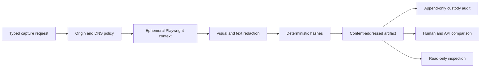

# 브라우저 근거 수집

브라우저 근거 수집은 승인된 대시보드나 레거시 웹 화면에 적절한 API가 없을 때 근거 공백을
채웁니다. Shadow 모드에서 범위가 제한된 읽기 전용 근거만 수집하며 일반 브라우저 제어, 승인
또는 실행 화면을 만들지 않습니다.

> **구현 상태 (2026-07-21):** Provider-neutral 계약, URL 및 DNS 정책, 마스킹과 custody,
> 선택적 Playwright delivery adapter, PostgreSQL metadata, typed console tool, evidence workflow
> step, shadow comparison 및 읽기 전용 검사 panel이 구현되었습니다. 실제 격리 browser image와
> live dashboard scenario는 승격 검토 전에 deployment evidence가 더 필요합니다.

## 설계 개요

서버는 정확한 origin policy를 선택하고 credential이 없는 `BrowserCaptureRequest`만 받습니다.
Delivery adapter는 ephemeral browser context 하나를 만들고 선언된 근거를 캡처한 뒤 민감한
content를 마스킹하여 core service에 전달합니다. Core service는 정제된 byte를 hash하고 저장하며
append-only custody audit record를 연결하고 추출한 모든 content를 신뢰되지 않은 것으로 표시합니다.

## 계약 및 담당

| 책임 | 담당 | 계약 |
|------|------|------|
| Policy, canonicalization, redaction, hashing, shadow comparison | `core/browser_evidence/` | Pure and provider-neutral |
| Public capture facade | `shared/providers/browser_evidence.py` | Async `capture(...)`; browser handle 없음 |
| Browser runtime | `delivery/browser/` | 선택적 async Playwright adapter |
| Durable artifact metadata and payload | `delivery/persistence/postgres_browser_evidence.py` | Alembic `0050` |
| Runtime binding | `composition/wire_browser_evidence.py` | 명시적 fail-closed DI seam |
| Inspection | read API 및 Console Evidence domain | GET-only metadata, control 없음 |

Provider는 `capture(policy, request)` 작업 하나만 노출합니다. `click`, `fill`, `press`, `select`,
clipboard, page, context, script evaluation, upload 또는 download API를 노출하지 않습니다. Bragi는
typed operator request를 evidence-only console tool로 번역할 수 있지만 browser handle을 받지 않으며
browser content를 사용해 action을 승인하거나 실행할 수 없습니다.

## 서버 소유 origin policy

각 policy는 변경 불가한 `policy_id`와 version을 가집니다. Request는 정확한 pair를 참조하며 다음
값을 제공할 수 없습니다.

- **Destination authority**: 정확한 HTTPS scheme, IDNA-normalized host, port 443, path prefix 및
  allowlisted query key입니다.
- **Authentication**: 불투명한 `auth_profile_ref`입니다. Credential은 delivery runtime에 남으며
  request, artifact, error 또는 audit record에 들어가지 않습니다.
- **Redirects**: 최대 횟수와 정확한 trusted internal destination입니다. Destination scheme, host,
  port 및 path가 모두 일치하지 않으면 cross-origin navigation이 차단됩니다.
- **Bounds**: Response byte, screenshot byte, text character, snapshot character, selector, redirect,
  timeout 및 retention day입니다.
- **Redaction**: Sensitive-region selector, text pattern 및 secret canary marker입니다.

Policy 등록은 HTTP, non-default port, 잘못된 IDNA name, secret 형태의 auth reference, 중복 version
및 잘못된 limit을 거부합니다. URL user information과 fragment는 항상 차단됩니다.

## Network 및 interaction 안전

모든 top-level navigation, redirect 및 connection은 canonicalize한 뒤 DNS를 다시 resolve합니다.
모든 답은 globally routable이어야 하고 처음 pin한 address set과 일치해야 합니다. DNS error, empty
또는 invalid answer, mixed trust 및 address change는 검토를 위해 capture를 보류합니다. 이를 통해
private, loopback, link-local, multicast, reserved, unspecified 및 metadata address를 차단합니다.

Browser request route는 `GET`과 `HEAD`만 허용합니다. `POST`, `PUT`, `PATCH`, `DELETE`, form submit
및 mutating fetch 또는 XHR call을 중단합니다. File URL, extension, popup, download, file chooser,
clipboard access 및 cross-origin request는 차단됩니다. 하나의 subrequest라도 차단되면 전체 capture가
무효가 되며 partial success는 보관되지 않습니다.

## 격리 runtime

Delivery adapter는 `BrowserRuntimeIsolation` receipt를 기록합니다. 다음 조건이 모두 참일 때만 capture를
받아들입니다.

- **Identity**: Thor 또는 executor workload identity가 없습니다.
- **Filesystem**: Host filesystem mount를 사용할 수 없습니다.
- **Environment**: Browser launch 전에 process environment를 정리합니다.
- **Network**: Deployment boundary가 egress를 policy destination으로 제한합니다.
- **Profile**: Browser profile과 context는 ephemeral이며 download가 비활성화됩니다.

Opt-in Playwright 구현은 `browser-evidence` dependency extra에 lock됩니다. 격리 worker에서
`uv sync --extra browser-evidence`로 설치한 뒤 해당 worker image에 Chromium을 provision합니다.
Core 및 read API image에는 이 extra를 포함하지 않습니다. 구현은 async Python, isolated context와
page 하나, fixed viewport와 device scale, blocked service worker와 extension, request
interception, locator wait, locator text, ARIA snapshot, screenshot mask 및
popup/download/file-chooser handler를 사용합니다. Playwright가 없거나 호환되지
않거나 timeout 또는 crash가 발생하면 결과는 `unavailable`입니다. Service는 success를 만들지 않습니다.

## 마스킹 및 변경 불가 artifact

민감한 screenshot region은 screenshot byte가 adapter를 떠나기 전에 mask됩니다. Visible text와 ARIA
snapshot은 hashing 또는 storage 전에 built-in secret pattern, policy pattern, secret canary 및
deterministic character limit을 통과합니다. 필수 screenshot mask가 없으면 capture가 무효입니다.

`BrowserEvidenceArtifact`는 policy id/version, canonical source/final URL, capture time, selector,
screenshot/text/snapshot hash, redaction manifest, browser version, custody audit reference, content
digest, prompt-injection finding, isolation evidence 및 expiry를 저장합니다. Artifact id는
`sha256:<content_digest>`입니다. Storage는 write와 replay 때 payload hash를 검증하고 같은 artifact id에
다른 content를 넣는 것을 거부합니다.

추출한 content는 항상 `untrusted=true` 및 `can_authorize_action=false`입니다. Prompt-injection finding은
evidence metadata로 유지됩니다. Instruction, approval, policy, grounding 또는 execution authority가 될 수
없습니다.

## Operator 및 workflow 화면

`BrowserEvidenceConsoleTool`은 typed policy id/version, source URL 및 stable selector만 받습니다. Page나
interaction primitive 대신 artifact receipt를 반환합니다. `WorkflowStepKind.EVIDENCE`는 별도의
`WorkflowEvidenceDispatcher`를 사용합니다. `ActionType`을 resolve하지 않고 action dispatcher, risk gate
또는 executor를 호출하지 않습니다. Unavailable 또는 abstained evidence는 workflow step을 fail-closed로
종료합니다.

Console Evidence view는 검사 전용입니다. Source host, policy, capture와 expiry, redaction count,
prompt-injection scan status, isolation status, hash 및 custody reference를 표시합니다. Read API는 이
panel을 통해 screenshot, visible text 또는 snapshot payload를 반환하지 않으며 capture, promotion,
approval 또는 execution control도 제공하지 않습니다.

## Shadow 측정 및 승격

`BrowserEvidenceShadowComparator`는 browser digest와 사용 가능한 human 및 API reference를 비교하고
fidelity, conflict, unavailable count, abstention 및 policy escape를 기록합니다. 충돌하거나 unavailable인
reference가 있으면 abstain합니다. Comparator는 항상 `promotion_eligible=false`를 보고하며 promotion
authority는 governed capability registry에 남습니다.

향후 승격 검토 전에 정확한 policy와 browser image는 다음을 입증하는 것이 좋습니다.

- Frozen scenario set과 선언된 minimum sample window의 measured fidelity입니다.
- SSRF, redirect, DNS rebinding, interaction, credential 및 redaction policy escape가 0건입니다.
- Timeout, crash, unavailable, retention, custody replay 및 incident-response drill 성공입니다.
- Reviewed restricted-egress evidence와 executor credential이 없다는 확인입니다.

## 운영 및 incident response

Operator는 unverified isolation receipt, secret canary finding, DNS change, policy denial,
popup/download/file-chooser event 또는 hash mismatch를 security event로 다루는 것이 좋습니다. Browser
worker를 중지하고 custody record와 runtime log를 보존하며 영향받은 auth profile을 revoke하고 artifact를
quarantine한 뒤 egress 및 DNS telemetry를 검사하고 capability를 shadow mode로 유지합니다. Capture를
통과시키기 위해 policy를 넓혀 재시도하지 않습니다.

Retention은 policy가 소유합니다. Artifact row는 expiry timestamp를 가지며
`BrowserEvidenceArtifactStore.purge_expired(now, limit)`이 PostgreSQL row lock을 사용하는 bounded
cleanup을 제공하면서 append-only custody audit를 보존합니다. Production은 별도 job에서 이를
호출합니다. Legal-hold extension은 Console control이 아니라 deployment의 governed retention
process에 속합니다.

## 검증

Focused test는 SSRF 및 metadata address, DNS rebinding, redirect, Unicode hostname, file URL,
popup/download/upload event, mutation method, cross-origin request, public API 최소화, secret 및
visual/text redaction, injection scan, bound, timeout/crash handling, hash, custody, replay, human/API
conflict, unavailable abstention, executor credential 부재, workflow authority 분리, read API projection 및
Console decoding을 다룹니다.

Real-browser release evidence는 target restricted-egress image 안에서 선택적 Playwright adapter를 synthetic
allowlisted HTTPS fixture에 대해 추가 실행하는 것이 좋습니다. Unit test는 browser binary 없이 adapter
enforcement를 입증하기 위해 fake driver를 사용합니다.

## 관련 문서

| 알아볼 내용 | 문서 |
|-------------|------|
| Module 및 DI boundary | [프로젝트 구조](../architecture/project-structure-ko.md) |
| Identity, egress 및 untrusted content | [보안 및 ID](../architecture/security-and-identity-ko.md) |
| Operator tool authority | [Operator console](operator-console-ko.md) |
| Local 및 deployed runtime parity | [Runtime parity](../deployment/dev-and-deploy-parity-ko.md) |
| Workflow step authority | [Process automation](../decisioning/process-automation-ko.md) |
