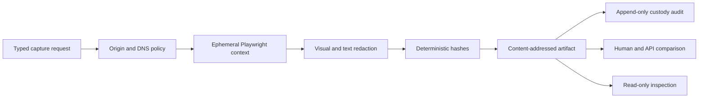

# 브라우저 근거 수집

브라우저 근거 수집은 승인된 대시보드나 레거시 웹 화면에 적절한 API가 없을 때 근거 공백을
채웁니다. Shadow 모드에서 범위가 제한된 읽기 전용 근거만 수집하며 일반 브라우저 제어, 승인
또는 실행 화면을 만들지 않습니다.

> **현재 구현 경계:** 프로바이더 중립적인 계약, URL 및 DNS 정책, 민감정보 제거, 메모리 내
> 보관, 선택적 Playwright 전달 어댑터, 타입이 지정된 도구 및 작업 흐름 화면, shadow 비교가
> 있습니다. 프로덕션 영속 산출물 어댑터, 전용 Operator API 및 Console 검사 화면, 격리 브라우저
> 이미지, 실제 운영 대시보드 근거는 아직 남아 있습니다.

## 설계 개요

서버는 정확한 출처 정책을 선택하고 자격 증명이 없는 `BrowserCaptureRequest`만 받습니다.
전달 어댑터는 일시적인 브라우저 맥락 하나를 만들고 선언된 근거를 캡처한 뒤 민감한
내용을 마스킹하여 코어 서비스에 전달합니다. Core 서비스는 정제된 바이트를 해시하고 저장하며
추가 전용 보관 감사 기록을 연결하고 추출한 모든 내용을 신뢰되지 않은 것으로 표시합니다.

```mermaid
flowchart LR
    REQUEST[Typed capture request] --> POLICY[Origin and DNS policy]
    POLICY --> BROWSER[Ephemeral Playwright context]
    BROWSER --> REDACT[Visual and text redaction]
    REDACT --> HASH[Deterministic hashes]
    HASH --> STORE[Content-addressed artifact]
    STORE --> AUDIT[Append-only custody audit]
    STORE --> SHADOW[Human and API comparison]
    STORE --> VIEW[Read-only inspection]
```

## 계약 및 담당

| 책임 | 담당 | 계약 |
|------|------|------|
| Policy, canonicalization, 민감정보 제거, hashing, shadow 비교 | `core/browser_evidence/` | Pure and 프로바이더 중립적인 |
| 공개 수집 파사드 | `shared/providers/browser_evidence.py` | 비동기 `capture(...)`; 브라우저 handle 없음 |
| 브라우저 런타임 | `delivery/browser/` | 선택적 비동기 Playwright 어댑터 |
| 영속 산출물 메타데이터 및 페이로드 | 구현되지 않음. 현재 구체 저장소는 메모리 내 구현 | `BrowserEvidenceArtifactStore` 프로토콜 |
| 런타임 연결 | `composition/wire_browser_evidence.py` | 명시적 실패 시 차단 DI 경계 |
| 점검 | 대상 Operator API 및 Console 근거 도메인 | 전용 프로덕션 경로나 패널이 등록되지 않음 |

프로바이더는 `capture(policy, request)` 작업 하나만 노출합니다. `click`, `fill`, `press`, `select`,
clipboard, 페이지, 맥락, 스크립트 evaluation, 업로드 또는 download API를 노출하지 않습니다. Bragi는
타입이 지정된 운영자 요청을 evidence-only 콘솔 도구로 번역할 수 있지만 브라우저 handle을 받지 않으며
브라우저 내용을 사용해 액션을 승인하거나 실행할 수 없습니다.

## 서버 소유 출처 정책

각 정책은 변경 불가한 `policy_id`와 버전을 가집니다. 요청은 정확한 쌍을 참조하며 다음
값을 제공할 수 없습니다.

- **대상 권한**: 정확한 HTTPS 체계, IDNA-normalized 호스트, 포트 443, 경로 접두사 및
  허용 목록에 있는 조회 키입니다.
- **Authentication**: 불투명한 `auth_profile_ref`입니다. 자격 증명은 전달 런타임에 남으며
  요청, 산출물, 오류 또는 감사 기록에 들어가지 않습니다.
- **Redirects**: 최대 횟수와 정확한 trusted 내부 대상입니다. 대상 체계, 호스트,
  포트 및 경로가 모두 일치하지 않으면 cross-origin 탐색이 차단됩니다.
- **한계치**: 응답 바이트, screenshot 바이트, 텍스트 character, 스냅샷 character, 선택자, redirect,
  시간 초과 및 보존 일입니다.
- **민감정보 제거**: Sensitive-region 선택자, 텍스트 pattern 및 시크릿 canary 표시입니다.

Policy 등록은 HTTP, non-default 포트, 잘못된 IDNA 이름, 시크릿 형태의 auth 참조, 중복 버전
및 잘못된 한도를 거부합니다. URL user information과 조각은 항상 차단됩니다.

## 네트워크 및 interaction 안전

모든 top-level 탐색, redirect 및 연결은 canonicalize한 뒤 DNS를 다시 해석합니다.
모든 답은 globally routable이어야 하고 처음 pin한 주소 집합과 일치해야 합니다. DNS 오류, 빈
또는 잘못된 답변, mixed trust 및 주소 변경은 검토를 위해 수집을 보류합니다. 이를 통해
비공개, loopback, link-local, multicast, reserved, unspecified 및 메타데이터 주소를 차단합니다.

브라우저 요청 경로는 `GET`과 `HEAD`만 허용합니다. `POST`, `PUT`, `PATCH`, `DELETE`, 양식 제출
및 mutating fetch 또는 XHR 호출을 중단합니다. 파일 URL, 확장, popup, download, 파일 chooser,
clipboard 접근 및 cross-origin 요청은 차단됩니다. 하나의 subrequest라도 차단되면 전체 수집이
무효가 되며 부분 성공은 보관되지 않습니다.

## 격리 런타임

전달 어댑터는 `BrowserRuntimeIsolation` 증적을 기록합니다. 다음 조건이 모두 참일 때만 수집을
받아들입니다.

- **신원**: Thor 또는 실행기 워크로드 신원이 없습니다.
- **파일 시스템**: 호스트 파일 시스템 mount를 사용할 수 없습니다.
- **환경**: 브라우저 launch 전에 프로세스 환경을 정리합니다.
- **네트워크**: 배포 경계가 egress를 정책 대상으로 제한합니다.
- **프로파일**: 브라우저 프로파일과 맥락은 일시적인이며 download가 비활성화됩니다.

명시적 선택 Playwright 구현은 `browser-evidence` 의존성 extra에 잠금됩니다. 격리 워커에서
`uv sync --extra browser-evidence`로 설치한 뒤 해당 워커 이미지에 Chromium을 provision합니다.
Core 및 Operator API 이미지에는 이 extra를 포함하지 않습니다. 구현은 비동기 Python, isolated 맥락과
페이지 하나, fixed 뷰포트와 장치 규모, 차단된 서비스 워커와 확장, 요청
interception, 위치 지정자 wait, 위치 지정자 텍스트, ARIA 스냅샷, screenshot 마스킹 및
popup/download/file-chooser 핸들러를 사용합니다. Playwright가 없거나 호환되지
않거나 시간 초과 또는 비정상 종료가 발생하면 결과는 `unavailable`입니다. 서비스는 성공을 만들지 않습니다.

## 마스킹 및 변경 불가 산출물

민감한 screenshot 지역은 screenshot 바이트가 어댑터를 떠나기 전에 마스킹됩니다. Visible 텍스트와 ARIA
스냅샷은 hashing 또는 저장소 전에 built-in 시크릿 pattern, 정책 pattern, 시크릿 canary 및
결정론적 character 한도를 통과합니다. 필수 screenshot 마스킹이 없으면 수집이 무효입니다.

`BrowserEvidenceArtifact`는 정책 id/버전, 정본 출처/최종 URL, 수집 시간, 선택자,
screenshot/텍스트/스냅샷 해시, 민감정보 제거 매니페스트, 브라우저 버전, 보관 감사 참조, 내용
다이제스트, prompt-injection 발견 사항, 격리 근거 및 만료를 저장합니다. 산출물 id는
`sha256:<content_digest>`입니다. Storage는 쓰기와 재생 때 페이로드 해시를 검증하고 같은 산출물 id에
다른 내용을 넣는 것을 거부합니다.

추출한 내용은 항상 `untrusted=true` 및 `can_authorize_action=false`입니다. Prompt-injection 발견 사항은
근거 메타데이터로 유지됩니다. Instruction, 승인, 정책, grounding 또는 실행 권한이 될 수
없습니다.

## Operator 및 작업 흐름 화면

`BrowserEvidenceConsoleTool`은 타입이 지정된 정책 id/버전, 출처 URL 및 고정된 선택자만 받습니다. 페이지나
interaction 기본 요소 대신 산출물 증적을 반환합니다. `WorkflowStepKind.EVIDENCE`는 별도의
`WorkflowEvidenceDispatcher`를 사용합니다. `ActionType`을 해석하지 않고 액션 디스패처, risk 게이트
또는 실행기를 호출하지 않습니다. 사용 불가 또는 abstained 근거는 작업 흐름 단계를 실패 시 차단으로
종료합니다.

대상 Console 근거 화면은 검사 전용입니다. 출처 호스트, 정책, 수집과 만료, 민감정보 제거 개수,
prompt-injection 검사 상태, 격리 상태, 해시 및 보관 참조를 표시합니다. 현재 전용 Operator API
경로나 Console 패널은 등록되지 않았습니다. 추가할 때 API는 screenshot, visible 텍스트 및
스냅샷 페이로드를 제외해야 하며 화면은 수집, 승격, 승인 또는 실행 컨트롤을 제공하지 않아야 합니다.

## Shadow 측정 및 승격

`BrowserEvidenceShadowComparator`는 브라우저 다이제스트와 사용 가능한 human 및 API 참조를 비교하고
fidelity, 충돌, 사용 불가 개수, abstention 및 정책 escape를 기록합니다. 충돌하거나 사용 불가인
참조가 있으면 abstain합니다. 비교기는 항상 `promotion_eligible=false`를 보고하며 승격
권한은 통제된 기능 레지스트리에 남습니다.

향후 승격 검토 전에 정확한 정책과 브라우저 이미지는 다음을 입증하는 것이 좋습니다.

- 고정된 시나리오 집합과 선언된 최소 샘플 구간의 measured fidelity입니다.
- SSRF, redirect, DNS rebinding, interaction, 자격 증명 및 민감정보 제거 정책 escape가 0건입니다.
- 시간 초과, 비정상 종료, 사용 불가, 보존, 보관 재생 및 incident-response 훈련 성공입니다.
- 검토된 restricted-egress 근거와 실행기 자격 증명이 없다는 확인입니다.

## 운영 및 인시던트 응답

Operator는 검증되지 않은 격리 증적, 시크릿 canary 발견 사항, DNS 변경, 정책 denial,
popup/download/file-chooser 이벤트 또는 해시 mismatch를 security 이벤트로 다루는 것이 좋습니다. 브라우저
워커를 중지하고 보관 기록과 런타임 로그를 보존하며 영향받은 auth 프로파일을 철회하고 산출물을
격리 구역한 뒤 egress 및 DNS 텔레메트리를 검사하고 기능을 shadow 모드로 유지합니다. 수집을
통과시키기 위해 정책을 넓혀 재시도하지 않습니다.

보존은 정책이 소유합니다. 저장소 계약에는 범위가 제한된 만료 정리가 포함되고 메모리 내 구현이
이 수명 주기를 실행합니다. 프로덕션 영속 어댑터와 별도 정리 작업은 추가 전용 보관 감사를
보존하면서 행 잠금을 추가해야 합니다. Legal-hold 확장은 Console 컨트롤이 아니라 배포의 통제된
보존 프로세스에 속합니다.

## 검증

Focused core 테스트는 SSRF 및 메타데이터 주소, DNS rebinding, redirect, Unicode hostname, 파일 URL,
popup/download/업로드 이벤트, 변경 메서드, cross-origin 요청, 공개 API 최소화, 시크릿 및
visual/텍스트 민감정보 제거, 주입 검사, 한계, 시간 초과/비정상 종료 처리, 해시, 보관, 재생, human/API
충돌, 사용 불가 abstention, 실행기 자격 증명 부재 및 작업 흐름 권한 분리를 다룹니다. 전용
영속성, Operator API 변환 결과 및 Console 디코딩 테스트는 해당 구현 화면과 함께 남아 있습니다.

## 구현 상태

### 구현 범위

| 영역 | 상태 | 근거 | 참고 |
|------|------|------|------|
| 계약, 정책, 민감정보 제거, 저장 규칙 및 shadow 비교 | implemented | `services/core-control-plane/src/fdai/core/browser_evidence/`; `services/core-control-plane/src/fdai/shared/providers/browser_evidence.py`; `services/core-control-plane/tests/core/browser_evidence/` | Focused core 테스트는 범위가 제한된 정책, 근거 전용 권한, 민감정보 제거, 메모리 내 보관, 재생 및 shadow 판단 보류를 다룹니다. |
| 선택적 Playwright 전달 어댑터 | in-progress | `services/core-control-plane/src/fdai/delivery/browser/` | 어댑터는 있지만 전용 focused delivery 모음이나 제한된 egress 이미지 증적은 찾지 못했습니다. |
| 영속성 및 보존 작업 | not-started | `BrowserEvidenceArtifactStore` 프로토콜; `InMemoryBrowserEvidenceArtifactStore` | PostgreSQL 산출물 어댑터, 이행 또는 프로덕션 정리 작업이 없습니다. |
| Operator API 및 Console 검사 | not-started | [Operator 및 작업 흐름 화면](#operator-및-작업-흐름-화면) | 도구 및 작업 흐름 계약은 있지만 전용 프로덕션 읽기 경로나 Console 패널은 등록되지 않았습니다. |
| 승격 근거 | not-started | [Shadow 측정 및 승격](#shadow-측정-및-승격) | 비교기는 항상 `promotion_eligible=false`를 보고하며 관리되는 실제 fidelity 또는 보안 훈련 구간은 보존되지 않았습니다. |

### 구현 이력

| 날짜 | 상태 | 변경 | 근거 | 남은 작업 |
|------|------|------|------|-----------|
| 2026-08-14 | in-progress | 구현 ledger를 도입하고 PostgreSQL 영속성 및 검사 화면에 대한 오래된 주장을 수정했으며 이전 출처 이력은 재구성하지 않았습니다. | `current change`; 구현 범위 표에 나열된 현재 source 및 focused core 검사입니다. | 영속 보관 및 읽기 화면을 구현한 뒤 승격 검토 전에 격리된 실제 근거를 보존해야 합니다. |

### 남은 작업

- [ ] 해시 충돌, 재생, 범위가 제한된 만료, legal hold 및 동시 정리 테스트가 있는 PostgreSQL `BrowserEvidenceArtifactStore`와 이행을 구현합니다.
- [ ] 수집한 페이로드 바이트를 반환하거나 수집 컨트롤을 노출하지 않는 Owner 또는 Reader 범위 GET-only Operator API 메타데이터 경로와 Console 검사 패널을 등록합니다.
- [ ] Focused Playwright delivery 테스트를 추가하고 SSRF, redirect, DNS rebinding, 변경, 자격 증명, 민감정보 제거, 시간 초과, 비정상 종료 및 보관 재생 훈련을 다루는 제한된 egress 이미지 증적을 보존합니다.
- [ ] 승격 검토를 요청하기 전에 정책 escape가 0건인 고정된 실제 fidelity 구간을 보존합니다.

Real-browser release 근거는 대상 restricted-egress 이미지 안에서 선택적 Playwright 어댑터를 synthetic
허용 목록에 있는 HTTPS 고정본에 대해 추가 실행하는 것이 좋습니다. 단위 테스트는 브라우저 binary 없이 어댑터
적용을 입증하기 위해 가짜 driver를 사용합니다.

## 관련 문서

| 알아볼 내용 | 문서 |
|-------------|------|
| 모듈 및 DI 경계 | [프로젝트 구조](../architecture/project-structure-ko.md) |
| 신원, egress 및 신뢰할 수 없는 내용 | [보안 및 ID](../architecture/security-and-identity-ko.md) |
| Operator 도구 권한 | [Operator 콘솔](operator-console-ko.md) |
| 로컬 및 deployed 런타임 동등성 | [런타임 동등성](../deployment/dev-and-deploy-parity-ko.md) |
| 작업 흐름 단계 권한 | [프로세스 자동화](../decisioning/process-automation-ko.md) |
