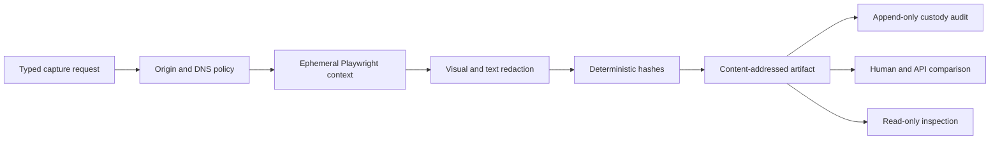

# Browser Evidence Collection

Browser evidence collection fills gaps where an approved dashboard or legacy web surface has no
suitable API. It captures bounded, read-only evidence in shadow mode and never creates a general
browser-control, approval, or execution surface.

> **Implementation status (2026-07-21):** Provider-neutral contracts, URL and DNS policy,
> redaction and custody, an optional Playwright delivery adapter, PostgreSQL metadata, a typed
> console tool, an evidence workflow step, shadow comparison, and a read-only inspection panel are
> implemented. A real isolated browser image and live dashboard scenario still require deployment
> evidence before the capability can be considered for promotion.

## Design at a glance

The server selects an exact origin policy and accepts only a credential-free
`BrowserCaptureRequest`. The delivery adapter creates one ephemeral browser context, captures the
declared evidence, redacts sensitive content, and returns material to the core service. The core
service hashes and stores the sanitized bytes, links an append-only custody audit record, and marks
all extracted content as untrusted.

## Contracts and ownership

| Responsibility | Owner | Contract |
|----------------|-------|----------|
| Policy, canonicalization, redaction, hashing, shadow comparison | `core/browser_evidence/` | Pure and provider-neutral |
| Public capture facade | `shared/providers/browser_evidence.py` | Async `capture(...)`; no browser handle |
| Browser runtime | `delivery/browser/` | Optional async Playwright adapter |
| Durable artifact metadata and payload | `delivery/persistence/postgres_browser_evidence.py` | Alembic `0050` |
| Runtime binding | `composition/wire_browser_evidence.py` | Explicit, fail-closed DI seam |
| Inspection | read API and Console Evidence domain | GET-only metadata, no controls |

The provider exposes one operation: `capture(policy, request)`. It exposes no `click`, `fill`,
`press`, `select`, clipboard, page, context, script-evaluation, upload, or download API. Bragi can
translate a typed operator request into the evidence-only console tool, but it never receives a
browser handle and cannot use browser content to approve or execute an action.

## Server-owned origin policy

Each policy has an immutable `policy_id` and version. A request references that exact pair and
cannot supply any of the following values:

- **Destination authority**: Exact HTTPS schemes, IDNA-normalized hosts, port 443, path prefixes,
  and allowlisted query keys.
- **Authentication**: An opaque `auth_profile_ref`. Credentials remain in the delivery runtime and
  never enter a request, artifact, error, or audit record.
- **Redirects**: A maximum count plus exact trusted internal destinations. Cross-origin navigation
  is denied unless the destination scheme, host, port, and path all match.
- **Bounds**: Response bytes, screenshot bytes, text characters, snapshot characters, selectors,
  redirects, timeout, and retention days.
- **Redaction**: Sensitive-region selectors, text patterns, and secret canary markers.

Policy registration rejects HTTP, non-default ports, malformed IDNA names, secret-shaped auth
references, duplicate versions, and invalid limits. URL user information and fragments are always
denied.

## Network and interaction safety

Every top-level navigation, redirect, and connection is canonicalized and resolves DNS again. All
answers must be globally routable and must match the first pinned address set. DNS errors, empty or
invalid answers, mixed trust, and address changes hold the capture for review. This blocks private,
loopback, link-local, multicast, reserved, unspecified, and metadata addresses.

The browser request route allows only `GET` and `HEAD`. It aborts `POST`, `PUT`, `PATCH`, `DELETE`,
form submission, and mutating fetch or XHR calls. File URLs, extensions, popups, downloads, file
choosers, clipboard access, and cross-origin requests are denied. A denied subrequest invalidates
the complete capture; partial success isn't retained.

## Isolated runtime

The delivery adapter records a `BrowserRuntimeIsolation` receipt. A capture is accepted only when
all of these conditions are true:

- **Identity**: No Thor or executor workload identity is present.
- **Filesystem**: No host filesystem mount is available.
- **Environment**: The process environment is scrubbed before browser launch.
- **Network**: Egress is restricted to policy destinations by the deployment boundary.
- **Profile**: The browser profile and context are ephemeral and downloads are disabled.

The opt-in Playwright implementation is locked in the `browser-evidence` dependency extra. Install
it in the isolated worker with `uv sync --extra browser-evidence`, then provision Chromium in that
worker image. The core and read API images omit the extra. The implementation uses async Python,
one isolated context and page, fixed viewport and device scale, blocked service workers and
extensions, request interception, locator waits, locator text, ARIA snapshots, screenshot masks,
and popup/download/file-chooser handlers.
If Playwright is absent, incompatible, times out, or crashes, the result is `unavailable`; the
service never synthesizes success.

## Redaction and immutable artifacts

Sensitive screenshot regions are masked before screenshot bytes leave the adapter. Visible text
and ARIA snapshots pass built-in secret patterns, policy patterns, secret canaries, and deterministic
character limits before hashing or storage. A missing required screenshot mask invalidates the
capture.

`BrowserEvidenceArtifact` stores policy id/version, canonical source/final URL, capture time,
selectors, screenshot/text/snapshot hashes, redaction manifest, browser version, custody audit
reference, content digest, prompt-injection findings, isolation evidence, and expiry. The artifact
id is `sha256:<content_digest>`. Storage verifies payload hashes on write and replay and rejects an
artifact id reused with different content.

Extracted content always has `untrusted=true` and `can_authorize_action=false`. Prompt-injection
findings remain evidence metadata. They cannot become instructions, approval, policy, grounding, or
execution authority.

## Operator and workflow surfaces

`BrowserEvidenceConsoleTool` accepts only typed policy id/version, source URL, and stable selectors.
It returns an artifact receipt, never a page or interaction primitive. `WorkflowStepKind.EVIDENCE`
uses a separate `WorkflowEvidenceDispatcher`; it does not resolve an `ActionType` and never calls
the action dispatcher, risk gate, or executor. Unavailable or abstained evidence fails that workflow
step closed.

The Console Evidence view is inspection-only. It shows source host, policy, capture and expiry,
redaction count, prompt-injection scan status, isolation status, hashes, and custody reference. The
read API doesn't return screenshot, visible text, or snapshot payloads through this panel, and the
view has no capture, promotion, approval, or execution controls.

## Shadow measurement and promotion

`BrowserEvidenceShadowComparator` compares the browser digest with available human and API
references and records fidelity, conflict, unavailable count, abstention, and policy escapes.
Conflicting or unavailable references cause abstention. The comparator always reports
`promotion_eligible=false`; promotion authority remains in the governed capability registry.

Before a future promotion review, the exact policy and browser image should demonstrate:

- Measured fidelity on a frozen scenario set and declared minimum sample window.
- Zero SSRF, redirect, DNS rebinding, interaction, credential, and redaction policy escapes.
- Successful timeout, crash, unavailable, retention, custody replay, and incident-response drills.
- Reviewed restricted-egress evidence and confirmation that no executor credential is present.

## Operations and incident response

Operators should treat an unverified isolation receipt, secret canary finding, DNS change, policy
denial, popup/download/file-chooser event, or hash mismatch as a security event. Stop the browser
worker, preserve custody records and runtime logs, revoke the affected auth profile, quarantine the
artifact, inspect egress and DNS telemetry, and keep the capability in shadow mode. Never retry with
a wider policy to make the capture pass.

Retention is policy-owned. Artifact rows carry an expiry timestamp, and
`BrowserEvidenceArtifactStore.purge_expired(now, limit)` provides bounded cleanup with row locking
in PostgreSQL while preserving the append-only custody audit. Production invokes it from a separate
job. A legal-hold extension belongs in the deployment's governed retention process, not a Console
control.

## Verification

Focused tests cover SSRF and metadata addresses, DNS rebinding, redirects, Unicode hostnames, file
URLs, popup/download/upload events, mutation methods, cross-origin requests, public API minimization,
secret and visual/text redaction, injection scanning, bounds, timeout/crash handling, hashes,
custody, replay, human/API conflict, unavailable abstention, no executor credential, workflow
authority separation, read API projection, and Console decoding.

Real-browser release evidence should additionally run the optional Playwright adapter inside the
target restricted-egress image against a synthetic allowlisted HTTPS fixture. Unit tests use a fake
driver to prove adapter enforcement without requiring a browser binary.

## Related docs

| To learn about | Read |
|----------------|------|
| Module and DI boundaries | [Project structure](../architecture/project-structure.md) |
| Identity, egress, and untrusted content | [Security and identity](../architecture/security-and-identity.md) |
| Operator tool authority | [Operator console](operator-console.md) |
| Local and deployed runtime parity | [Runtime parity](../deployment/dev-and-deploy-parity.md) |
| Workflow step authority | [Process automation](../decisioning/process-automation.md) |
