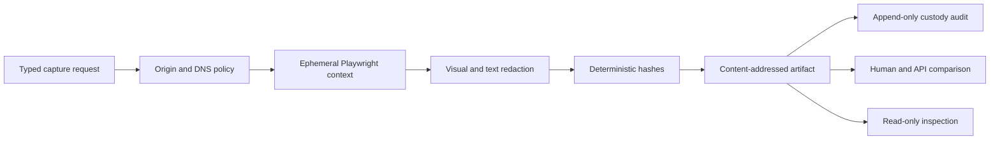

# Browser Evidence Collection

Browser evidence collection fills gaps where an approved dashboard or legacy web surface has no
suitable API. It captures bounded, read-only evidence in shadow mode and never creates a general
browser-control, approval, or execution surface.

> **Current implementation boundary:** Provider-neutral contracts, URL and DNS policy, redaction,
> in-memory custody, an optional Playwright delivery adapter, typed tool and workflow surfaces, and
> shadow comparison exist. A production durable artifact adapter, dedicated Operator API and
> Console inspection surface, isolated browser image, and live dashboard evidence remain open.

## Design at a glance

The server selects an exact origin policy and accepts only a credential-free
`BrowserCaptureRequest`. The delivery adapter creates one ephemeral browser context, captures the
declared evidence, redacts sensitive content, and returns material to the core service. The core
service hashes and stores the sanitized bytes, links an append-only custody audit record, and marks
all extracted content as untrusted.

```mermaid
flowchart LR
    REQUEST[Typed capture request] --> POLICY[Origin and DNS policy]
    POLICY --> BROWSER[Ephemeral Playwright context]
    BROWSER --> REDACT[Visual and text redaction]
    REDACT --> HASH[Deterministic hashes]
    HASH --> STORE[Content-addressed artifact]
    STORE --> AUDIT[Append-only custody audit]
    STORE --> SHADOW[Human and API comparison]
    STORE --> VIEW[Read-only inspection]
```

## Contracts and ownership

| Responsibility | Owner | Contract |
|----------------|-------|----------|
| Policy, canonicalization, redaction, hashing, shadow comparison | `core/browser_evidence/` | Pure and provider-neutral |
| Public capture facade | `shared/providers/browser_evidence.py` | Async `capture(...)`; no browser handle |
| Browser runtime | `delivery/browser/` | Optional async Playwright adapter |
| Durable artifact metadata and payload | Not implemented; the current concrete store is in-memory | `BrowserEvidenceArtifactStore` protocol |
| Runtime binding | `composition/wire_browser_evidence.py` | Explicit, fail-closed DI seam |
| Inspection | Target Operator API and Console Evidence domain | No dedicated production route or panel is registered |

The provider exposes one operation: `capture(policy, request)`. It exposes no `click`, `fill`,
`press`, `select`, clipboard, page, context, script-evaluation, upload, or download API. Bragi can
translate a typed operator request into the evidence-only console tool, but it never receives a
browser handle and cannot use browser content to approve or execute an action.

## Server-owned origin policy

Each policy has an immutable `policy_id` and version. A request references that exact pair and
cannot supply any of the following values:

- **Destination authority**: Exact HTTPS schemes, IDNA-normalized hosts, port 443, path prefixes,
  and allowlisted query keys.
- **Authentication**: An opaque `auth_profile_ref`. Credentials remain in the delivery runtime and
  never enter a request, artifact, error, or audit record.
- **Redirects**: A maximum count plus exact trusted internal destinations. Cross-origin navigation
  is denied unless the destination scheme, host, port, and path all match.
- **Bounds**: Response bytes, screenshot bytes, text characters, snapshot characters, selectors,
  redirects, timeout, and retention days.
- **Redaction**: Sensitive-region selectors, text patterns, and secret canary markers.

Policy registration rejects HTTP, non-default ports, malformed IDNA names, secret-shaped auth
references, duplicate versions, and invalid limits. URL user information and fragments are always
denied.

## Network and interaction safety

Every top-level navigation, redirect, and connection is canonicalized and resolves DNS again. All
answers must be globally routable and must match the first pinned address set. DNS errors, empty or
invalid answers, mixed trust, and address changes hold the capture for review. This blocks private,
loopback, link-local, multicast, reserved, unspecified, and metadata addresses.

The browser request route allows only `GET` and `HEAD`. It aborts `POST`, `PUT`, `PATCH`, `DELETE`,
form submission, and mutating fetch or XHR calls. File URLs, extensions, popups, downloads, file
choosers, clipboard access, and cross-origin requests are denied. A denied subrequest invalidates
the complete capture; partial success isn't retained.

## Isolated runtime

The delivery adapter records a `BrowserRuntimeIsolation` receipt. A capture is accepted only when
all of these conditions are true:

- **Identity**: No Thor or executor workload identity is present.
- **Filesystem**: No host filesystem mount is available.
- **Environment**: The process environment is scrubbed before browser launch.
- **Network**: Egress is restricted to policy destinations by the deployment boundary.
- **Profile**: The browser profile and context are ephemeral and downloads are disabled.

The opt-in Playwright implementation is locked in the `browser-evidence` dependency extra. Install
it in the isolated worker with `uv sync --extra browser-evidence`, then provision Chromium in that
worker image. The core and Operator API images omit the extra. The implementation uses async Python,
one isolated context and page, fixed viewport and device scale, blocked service workers and
extensions, request interception, locator waits, locator text, ARIA snapshots, screenshot masks,
and popup/download/file-chooser handlers.
If Playwright is absent, incompatible, times out, or crashes, the result is `unavailable`; the
service never synthesizes success.

## Redaction and immutable artifacts

Sensitive screenshot regions are masked before screenshot bytes leave the adapter. Visible text
and ARIA snapshots pass built-in secret patterns, policy patterns, secret canaries, and deterministic
character limits before hashing or storage. A missing required screenshot mask invalidates the
capture.

`BrowserEvidenceArtifact` stores policy id/version, canonical source/final URL, capture time,
selectors, screenshot/text/snapshot hashes, redaction manifest, browser version, custody audit
reference, content digest, prompt-injection findings, isolation evidence, and expiry. The artifact
id is `sha256:<content_digest>`. Storage verifies payload hashes on write and replay and rejects an
artifact id reused with different content.

Extracted content always has `untrusted=true` and `can_authorize_action=false`. Prompt-injection
findings remain evidence metadata. They cannot become instructions, approval, policy, grounding, or
execution authority.

## Operator and workflow surfaces

`BrowserEvidenceConsoleTool` accepts only typed policy id/version, source URL, and stable selectors.
It returns an artifact receipt, never a page or interaction primitive. `WorkflowStepKind.EVIDENCE`
uses a separate `WorkflowEvidenceDispatcher`; it does not resolve an `ActionType` and never calls
the action dispatcher, risk gate, or executor. Unavailable or abstained evidence fails that workflow
step closed.

The target Console Evidence view is inspection-only. It shows source host, policy, capture and
expiry, redaction count, prompt-injection scan status, isolation status, hashes, and custody
reference. No dedicated Operator API route or Console panel is currently registered. When added,
the API must omit screenshot, visible text, and snapshot payloads, and the view must expose no
capture, promotion, approval, or execution controls.

## Shadow measurement and promotion

`BrowserEvidenceShadowComparator` compares the browser digest with available human and API
references and records fidelity, conflict, unavailable count, abstention, and policy escapes.
Conflicting or unavailable references cause abstention. The comparator always reports
`promotion_eligible=false`; promotion authority remains in the governed capability registry.

Before a future promotion review, the exact policy and browser image should demonstrate:

- Measured fidelity on a frozen scenario set and declared minimum sample window.
- Zero SSRF, redirect, DNS rebinding, interaction, credential, and redaction policy escapes.
- Successful timeout, crash, unavailable, retention, custody replay, and incident-response drills.
- Reviewed restricted-egress evidence and confirmation that no executor credential is present.

## Operations and incident response

Operators should treat an unverified isolation receipt, secret canary finding, DNS change, policy
denial, popup/download/file-chooser event, or hash mismatch as a security event. Stop the browser
worker, preserve custody records and runtime logs, revoke the affected auth profile, quarantine the
artifact, inspect egress and DNS telemetry, and keep the capability in shadow mode. Never retry with
a wider policy to make the capture pass.

Retention is policy-owned. The store contract includes bounded expiry cleanup, and the in-memory
implementation exercises that lifecycle. The PostgreSQL adapter now claims and deletes bounded
expired rows with row locking while preserving append-only custody audit. A separate cleanup job
remains open. Legal hold is monotonic in the store and belongs in the deployment's governed
retention process, not a Console control.

## Verification

Focused core and delivery tests cover SSRF and metadata addresses, DNS rebinding, redirects, Unicode
hostnames, file URLs, popup/download/upload events, mutation methods, cross-origin requests, public
API minimization, secret and visual/text redaction, injection scanning, declared response, aggregate
response, and screenshot bounds, auth-state forwarding, timeout/crash handling, hashes, custody,
replay, human/API conflict, unavailable abstention, no executor credential, and workflow authority
separation. Focused persistence tests cover durable decoding, replay, legal hold, and concurrent
cleanup. Operator API projection and Console decoding tests remain open with those surfaces.

## Implementation status

### Implementation scope

| Area | State | Evidence | Notes |
|------|-------|----------|-------|
| Contracts, policy, redaction, storage rules, and shadow comparison | implemented | `services/core-control-plane/src/fdai/core/browser_evidence/`; `services/core-control-plane/src/fdai/shared/providers/browser_evidence.py`; `services/core-control-plane/tests/core/browser_evidence/` | Focused core tests cover bounded policy, evidence-only authority, redaction, in-memory custody, replay, and shadow abstention. |
| Playwright delivery policy and byte bounds | implemented | `services/core-control-plane/src/fdai/delivery/browser/`; `services/core-control-plane/tests/delivery/browser/`; focused delivery and integrated checks (`46 passed`) | The adapter propagates policy-owned response and screenshot bounds to the driver, rejects oversized or malformed declared responses before capture, rejects oversized screenshots and aggregate response material before return, and normalizes URL or DNS policy failures as unavailable. |
| Restricted-egress browser image evidence | not-started | [Verification](#verification) | Focused fakes prove delivery enforcement without a browser binary. No governed real-browser image receipt is retained. |
| Durable persistence and purge primitive | implemented | `alembic/versions/20260721_0050_browser_evidence.py`; `alembic/versions/20260814_0083_browser_evidence_legal_hold.py`; `services/core-control-plane/src/fdai/delivery/persistence/postgres_browser_evidence.py`; focused codec and live PostgreSQL tests (`9 passed`, no skips) | Exact payload replay, conflict rejection, strict durable JSONB decoding, monotonic legal hold, restart reads, and winner-only concurrent cleanup are implemented. |
| One-shot retention job entrypoint | implemented | `services/core-control-plane/src/fdai/delivery/browser_evidence_cleanup_cli.py`; `services/core-control-plane/tests/delivery/test_browser_evidence_cleanup_cli.py`; focused checks (`7 passed`) | The packaged CLI performs one bounded purge attempt with an aware UTC cutoff and emits only status plus purged count. Deployment scheduling and governed run receipts remain open. |
| Operator API and Console inspection | not-started | [Operator and workflow surfaces](#operator-and-workflow-surfaces) | The tool and workflow contracts exist, but no dedicated production read route or Console panel is registered. |
| Promotion evidence | not-started | [Shadow measurement and promotion](#shadow-measurement-and-promotion) | The comparator always reports `promotion_eligible=false`; no governed live fidelity or security-drill window is retained. |

### Implementation history

| Date | State | Change | Evidence | Remaining |
|------|-------|--------|----------|-----------|
| 2026-08-14 | in-progress | Adopted the implementation ledger and corrected stale claims for PostgreSQL persistence and the inspection surface; earlier provenance was not reconstructed. | `current change`; current source and focused core checks listed in the scope table. | Implement durable custody and read surfaces, then retain isolated live evidence before promotion review. |
| 2026-08-14 | implemented | Added PostgreSQL browser-evidence custody and monotonic legal hold on the existing artifact schema, with bounded winner-only expiry cleanup and read-time hash verification. | `current change`; migrations `0050` and `0083`; PostgreSQL adapter; codec and supported local PostgreSQL tests `2 passed`, no skips. | Bind the cleanup job, implement read-only Operator and Console inspection, and retain isolated live evidence. |
| 2026-08-14 | implemented | Hardened durable row decoding to reject malformed JSONB arrays, objects, redaction surfaces, string members, and coerced booleans before artifact materialization. | `current change`; PostgreSQL adapter and focused codec plus supported local PostgreSQL tests `9 passed`, no skips. | Cleanup-job binding, read-only inspection, and isolated live evidence remain open. |
| 2026-08-15 | implemented | Propagated policy-owned response and screenshot byte limits into the Playwright driver and added focused delivery enforcement for read-only methods, redirect and DNS denial, auth-state forwarding, browser side-effect events, and oversized or malformed material. | `current change`; `services/core-control-plane/src/fdai/delivery/browser/`; `services/core-control-plane/tests/delivery/browser/`; Ruff, strict mypy, and focused plus integrated browser checks `46 passed`. | Build and exercise the restricted-egress browser image, then retain governed real-browser receipts. |
| 2026-08-15 | implemented | Added a packaged one-shot retention entrypoint around the existing winner-only PostgreSQL purge, with bounded configuration, one attempt, count-only output, and redacted process failures. | `current change`; `services/core-control-plane/src/fdai/delivery/browser_evidence_cleanup_cli.py`; focused checks `7 passed`; Ruff and strict mypy passed. | Schedule the entrypoint as a Container Apps Job or portable CronJob and retain governed run receipts. |

### Remaining work

- [x] Implement a PostgreSQL `BrowserEvidenceArtifactStore` and migration with hash-conflict, replay, bounded expiry, legal-hold, and concurrent cleanup tests.
- [x] Add a packaged one-shot retention entrypoint that performs one bounded purge and emits no artifact or database identifiers (`7 passed`).
- [ ] Schedule the retention entrypoint as a Container Apps Job or portable CronJob and retain governed successful and failed run receipts.
- [ ] Register Owner- or Reader-scoped GET-only Operator API metadata routes and a Console inspection panel that never returns captured payload bytes or exposes capture controls.
- [x] Add focused Playwright delivery tests for read-only method gating, redirect and DNS denial, auth-state forwarding, browser side-effect events, and policy-owned response and screenshot bounds (`46 passed` with integrated browser checks).
- [ ] Retain restricted-egress image receipts covering SSRF, redirect, DNS rebinding, mutation, credential, redaction, timeout, crash, and custody-replay drills.
- [ ] Retain a frozen live fidelity window with zero policy escapes before requesting any promotion review.

Real-browser release evidence should additionally run the optional Playwright adapter inside the
target restricted-egress image against a synthetic allowlisted HTTPS fixture. Unit tests use a fake
driver to prove adapter enforcement without requiring a browser binary.

## Related docs

| To learn about | Read |
|----------------|------|
| Module and DI boundaries | [Project structure](../architecture/project-structure.md) |
| Identity, egress, and untrusted content | [Security and identity](../architecture/security-and-identity.md) |
| Operator tool authority | [Operator console](operator-console.md) |
| Local and deployed runtime parity | [Runtime parity](../deployment/dev-and-deploy-parity.md) |
| Workflow step authority | [Process automation](../decisioning/process-automation.md) |
