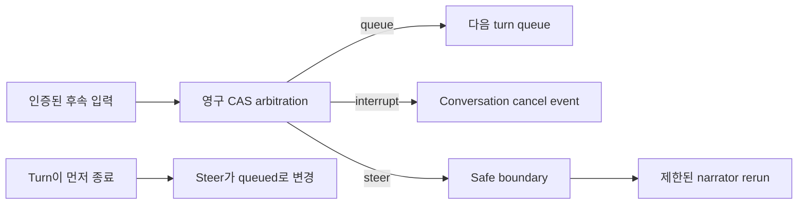

# 처리 중인 Conversation 입력 모드

이 설계는 operator conversation turn이 진행되는 동안 도착한 후속 입력을 위한 하나의
channel-neutral state machine을 정의합니다. 영구 queue, interrupt, steer 의미, 입력 제한,
authorization, cancellation, safe boundary, cross-channel 동작, recovery를 다룹니다.

> **범위:** Busy-input cancellation은 conversational model 및 tool 작업만 중지합니다. Action,
> approval, resource lock, idempotency key, execution scope, rollback을 취소하거나 변경하지 않습니다.

## 설계 요약

수락된 모든 후속 입력은 acknowledgement 전에 저장됩니다. Shared coordinator는 session mode에서
하나의 disposition을 선택하고 active conversational turn에만 signal을 보내며, 선언된 model 또는 tool
boundary에서 steer 입력을 consume합니다.

## Contract

`BusySessionState`는 session owner, 설정된 mode, active turn ID, revision, 다음 sequence, 제한된 pending
projection을 포함합니다. `BusyInput`은 안정적인 input 및 idempotency ID, session 및 principal ID,
제한된 content, input kind, received time, expiry를 포함합니다. 각 pending record에는 하나의 sequence,
disposition, lifecycle status, 선택적인 consumed time이 있습니다.

지원하는 mode는 다음과 같습니다.

| Mode | 영구 disposition | 동작 |
|------|------------------|------|
| `queue` | `queued` | Active turn이 끝난 후 이후 turn으로 실행합니다. |
| `interrupt` | `interrupting` | Active conversational run에 cancellation signal을 보냅니다. |
| `steer` | `steered` | 다음 safe boundary에서 한 번 consume하고 narrator를 다시 실행합니다. |

거부된 입력은 영구 rejected record와 reason을 받지만 accepted sequence를 진행하거나 이전 pending
입력을 제거하지 않습니다.

## 제한 및 idempotency

Session 하나는 최대 32개의 pending input과 32,000 bytes의 pending content를 수락합니다. 입력 body 하나는
4,000 bytes로 제한됩니다. Expiry는 한 시간으로 제한됩니다. Overflow는 `queue_capacity_exceeded`를
반환하며 이전에 수락한 record를 버리지 않습니다.

Idempotency는 session 안에서 unique합니다. 같은 전체 입력을 replay하면 원래 record와 sequence를
반환합니다. Input 또는 idempotency ID를 다른 content와 함께 재사용하면 conflict입니다.

## 영구 arbitration

PostgreSQL은 session state와 pending input을 분리해 저장합니다. Submit, mode 및 active-turn update,
turn finish, consume, expiry는 session row를 lock하고 revision compare-and-swap 의미를 사용합니다.
수락한 input row와 session sequence update는 하나의 transaction으로 commit됩니다.

동시에 발생한 steer submit과 turn finish는 두 가지 안전한 결과만 가집니다. Steer를 safe boundary에서
consume하거나 `queued` disposition의 pending 상태로 유지합니다. 사라질 수 없습니다. Restart 후에도
같은 revision, mode, active-turn marker, pending record를 load합니다.

## Interrupt 동작

Web one-shot 및 stream route는 인증과 제한된 request validation 후 active turn을 등록합니다. Backend
model call은 conversation-local cancellation event와 경쟁합니다. Interrupt가 발생하면 다음을
수행합니다.

- Backend task를 cancel하고 await합니다.
- One-shot route는 assistant turn을 append하기 전에 interrupted response를 반환합니다.
- Stream은 `interrupted`를 emit하고 `done`을 emit하지 않으며 upstream iteration을 닫습니다.
- Planning helper를 cancel하고 await합니다.
- Active-turn marker를 `finally`에서 finish합니다.

Cancellation event는 Thor, action bus, approval state, resource lock, executor identity와 연결되지 않습니다.

## Steer 동작

Steer는 prose input에만 사용할 수 있습니다. Approval, denial, emergency-stop 및 다른 control input을
steer prose와 결합할 수 없습니다. Steer는 acknowledgement가 반환되기 전에 저장됩니다.

Safe model 또는 tool boundary에서 coordinator는 principal을 다시 확인하고 record 하나를 정확히 한 번
consume하며 content를 in-memory user guidance로 append한 후 narrator를 다시 실행합니다. Turn 하나는
최대 네 번의 steer rerun을 수락합니다. Consume 전에 turn이 끝나면 `finish_turn`이 unconsumed steer
disposition을 `queued`로 원자적으로 변경합니다.

## Queue 동작

Queued input은 다음 turn을 위해 영구 저장됩니다. Inspection은 정렬된 pending entry와 expiry를
표시합니다. Consumption은 현재 principal을 다시 확인하고 sequence 하나를 정확히 한 번 consumed로
표시합니다. Expired entry는 idempotent history에 남지만 pending projection에서는 제외됩니다.

## Web 및 channel surface

인증된 web surface는 다음을 제공합니다.

- `POST /chat/busy-input`: 후속 입력 하나를 submit합니다.
- `GET /chat/busy-input?session_id=...`: mode, active state, revision, pending input을 inspect합니다.
- `PUT /chat/busy-input/mode`: `queue`, `interrupt`, `steer`를 설정합니다.
- `POST /chat/busy-input/cancel-current`: active conversational turn에만 signal을 보냅니다.

Acknowledgement는 disposition, session ID, input ID, sequence, reason, duplicate status를 포함합니다.

Slack과 Teams는 `ConversationChannelGateway`를 사용합니다. Gateway는 같은 영구 session ID를 resolve하고
turn이 active인지 확인한 후 같은 coordinator를 호출합니다. Busy input은 concurrent turn을 시작하는
대신 같은 channel-neutral acknowledgement를 반환합니다. Idle channel input은 shared begin/finish
의미로 감쌉니다. Vendor adapter는 자체 state machine을 구현하지 않습니다.

## Metric 및 운영

Runtime은 queued, interrupting, steered, rejected, duplicate, overflow, expiry, steer fallback,
race-recovery counter를 기록합니다. Pending inspection은 cross-owner state를 노출하지 않습니다.
Authorization은 입력 도착 시점과 consume 시점에 모두 확인합니다.

## 실패 동작

- Queue overflow와 expired input은 명시적으로 거부됩니다.
- 중복 webhook delivery는 원래 disposition을 반환합니다.
- Stale revision은 write에 실패하고 영구 state에서 retry합니다.
- 존재하지 않거나 cross-owner인 session은 같은 not-found shape을 반환합니다.
- Process restart 후에도 수락한 input과 mode preference가 유지됩니다.
- Busy-input runtime이 구성되지 않으면 기존 chat 동작이 변경되지 않습니다.

## 검증

Coverage는 세 mode, duplicate 및 conflicting ID, capacity, expiry, authorization, exactly-once consume,
turn-end와 steer race, restart persistence, one-shot 및 stream cleanup, partial assistant history 방지,
제한된 steer rerun, mode 및 inspection route, shared Slack 및 Teams gateway acknowledgement를 포함합니다.

## 관련 문서

| 알아볼 내용 | 문서 |
|-------------|------|
| Operator conversation 및 history | [Operator Console](operator-console-ko.md) |
| Detached 조사 | [Background Task Session](background-task-sessions-ko.md) |
| Typed action safety boundary | [Execution Model](../decisioning/execution-model-ko.md) |
| Channel identity 및 role | [User RBAC 및 Entra Identity](user-rbac-and-identity-ko.md) |
