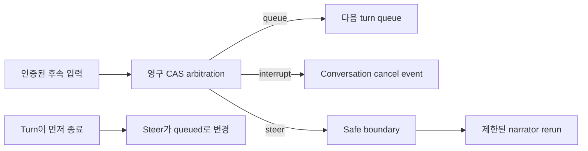

# 처리 중인 대화 입력 모드

이 설계는 운영자 대화 턴이 진행되는 동안 도착한 후속 입력을 위해 JSON과 SSE 경로
어댑터가 공유하는 하나의 채널 중립적인 상태 머신을 정의합니다. 분리된 planning, 근거,
검증 및 최종 보조 로직은 동일한 큐, interrupt, steer 계약을 유지합니다.

> **범위:** Busy-input 취소는 conversational 모델 및 도구 작업만 중지합니다. 액션,
> 승인, 리소스 lock, 멱등성 키, 실행 범위, 롤백을 취소하거나 변경하지 않습니다.

## 설계 요약

수락된 모든 후속 입력은 확인 응답 전에 저장됩니다. Shared 조정기는 세션 모드에서
하나의 처리 결과를 선택하고 활성 conversational 턴에만 신호를 보내며, 선언된 모델 또는 도구
경계에서 steer 입력을 consume합니다.

```mermaid
flowchart LR
  INPUT[인증된 후속 입력] --> STORE[영구 CAS arbitration]
  STORE -->|queue| QUEUE[다음 turn queue]
  STORE -->|interrupt| CANCEL[Conversation cancel event]
  STORE -->|steer| BOUNDARY[Safe boundary]
  BOUNDARY --> RERUN[제한된 narrator rerun]
  TURN[Turn이 먼저 종료] --> FALLBACK[Steer가 queued로 변경]
```

## 계약

`BusySessionState`는 세션 소유자, 설정된 모드, 활성 턴 ID, 개정 번호, 다음 순서, 제한된 pending
변환 결과를 포함합니다. `BusyInput`은 안정적인 입력 및 멱등성 ID, 세션 및 principal ID,
제한된 내용, 입력 kind, received 시간, 만료를 포함합니다. 각 pending 기록에는 하나의 순서,
처리 결과, 수명 주기 상태, 선택적인 consumed 시간이 있습니다.

지원하는 모드는 다음과 같습니다.

| 모드 | 영구 처리 결과 | 동작 |
|------|------------------|------|
| `queue` | `queued` | 활성 턴이 끝난 후 이후 턴으로 실행합니다. |
| `interrupt` | `interrupting` | 활성 conversational 실행에 취소 신호를 보냅니다. |
| `steer` | `steered` | 다음 safe 경계에서 한 번 consume하고 서술기를 다시 실행합니다. |

거부된 입력은 영구 rejected 기록과 사유를 받지만 accepted 순서를 진행하거나 이전 pending
입력을 제거하지 않습니다.

## 제한 및 멱등성

세션 하나는 최대 32개의 pending 입력과 32,000 바이트의 pending 내용을 수락합니다. 입력 본문 하나는
4,000 바이트로 제한됩니다. 만료는 한 시간으로 제한됩니다. 초과분은 `queue_capacity_exceeded`를
반환하며 이전에 수락한 기록을 버리지 않습니다.

멱등성은 세션 안에서 unique합니다. 같은 전체 입력을 재생하면 원래 기록과 순서를
반환합니다. 입력 또는 멱등성 ID를 다른 내용과 함께 재사용하면 conflict입니다.

Agent-targeted 활성 턴은 Operator API가 범위가 제한된 프로세스 간 conversational 브리지를 기다리는 동안
선택한 agent를 유지합니다. Interrupt 취소는 pending 응답 future를 제거하며 agent 액션 또는
타입이 지정된 파이프라인 event를 취소하지 않습니다. 브리지 시간 초과는 명시적인 agent-to-Bragi 인계를 반환하고,
대기 중 입력은 자체 멱등성 신원을 가진 새 요청을 시작합니다.
Agent 근거 가지가 브리지 응답 전에 실패하거나 시간 초과되면 가지 결합은 성공한 형제
operational 근거를 제거하지 않고 동일한 명시적 인계를 materialize합니다.
큐, interrupt 및 steer는 활성 conversational 신원을 유지합니다. Dedicated 대상 세션은
선택된 agent voice를 유지하고 unbound 대화는 Bragi를 유지합니다. Versioned agent-charter
메타데이터는 출처 이력로만 유지되며 rerun 중 근거 또는 권한이 되지 않습니다. 각 rerun은
fresh exact 정책 일치 후에만 선택된 charter를 주입하고 global safety를 먼저 유지합니다.
Atomic-claim 검증도 생성된 agent 서술을 제외하고 대기 중 또는 steered rerun 전반에서
agent의 영속 근거 ref에 rooted된 고유 fact leaf 포인터를 유지합니다.

## 영구 arbitration

PostgreSQL은 세션 상태와 pending 입력을 분리해 저장합니다. 제출, 모드 및 active-turn 갱신,
턴 finish, consume, 만료는 세션 행을 lock하고 개정 번호 compare-and-swap 의미를 사용합니다.
수락한 입력 행과 세션 순서 갱신은 하나의 트랜잭션으로 커밋됩니다.

동시에 발생한 steer 제출과 턴 finish는 두 가지 안전한 결과만 가집니다. Steer를 safe 경계에서
consume하거나 `queued` 처리 결과의 pending 상태로 유지합니다. 사라질 수 없습니다. 재시작 후에도
같은 개정 번호, 모드, active-turn 표시, pending 기록을 load합니다.

## Interrupt 동작

Web one-shot 및 스트림 경로는 인증과 제한된 요청 검증 후 활성 턴을 등록합니다. 백엔드
모델 호출은 conversation-local 취소 event와 경쟁합니다. Interrupt가 발생하면 다음을
수행합니다.

- 백엔드 작업을 취소하고 대기합니다.
- 범위가 제한된 post-generation 서술기 quality review는 같은 conversational 작업의 일부이며 동일한
  active-turn 신호에 따라 취소하고 대기합니다.
- One-shot 경로는 assistant 턴을 덧붙이기하기 전에 interrupted 응답을 반환합니다.
- 스트림은 `interrupted`를 발행하고 `done`을 발행하지 않으며 upstream 반복을 닫습니다.
- Planning 보조 로직을 취소하고 대기합니다.
- 실행 중인 모든 read-evidence 가지를 범위가 제한된 작업 그룹을 통해 취소하고 대기합니다. 취소된
  가지는 최종 답변을 발행하거나 턴 종료 후 프로바이더 작업을 계속할 수 없습니다.
- 선택적 취소된 수명 주기 프레임 보고가 실패하면 로그하고 격리합니다. 원래 취소 신호를
  대체하거나 interrupted 턴 결과를 변경하지 않습니다.
- Interrupted 턴은 `confirmed` 또는 `done` 프레임을 발행하지 않습니다. 초안 텍스트는 부분으로
  유지되며 검증된 대화 이력으로 복원되지 않습니다.
- Interrupted 턴은 최종 turn-timing 묶음을 발행하지 않습니다. 부분 phase timing은
  완료된 작업으로 저장하거나 복원하지 않습니다.
- Active-turn 표시를 `finally`에서 finish합니다.

활성 턴 중 신뢰할 수 없는 플래너 또는 프로바이더 입력을 `ValueError`로 수락하지 않는 가지는
`capability_invalid_arguments` 사유의 `unavailable`로 종료하고 스택 추적 없이 구조화된 info event
한 건을 내보냅니다. 거부된 값을 노출하거나 프로바이더 장애로 분류하지 않습니다. 예상하지 못한
exception은 `failed`로 종료하고 스택 추적을 포함한 경고를 유지합니다. 이 구분은 취소
권한을 변경하지 않습니다.

정상 최종 답변에서는 스트림이 남아 있는 planning을 취소하고 active-turn 표시를 finish한
후 `done`을 발행하므로 최종 프레임 이후 조정기 작업이 실행되지 않습니다. Busy 저장소 정리
오류는 세션 및 요청 식별자와 함께 로그하지만, 이미 검증되어 저장된 답변 또는 HTTP 본문
완료를 손상시키지 않습니다.

취소 event는 Thor, 액션 버스, 승인 상태, 리소스 lock, 실행기 신원과 연결되지 않습니다.

## Steer 동작

Steer는 산문 입력에만 사용할 수 있습니다. Approval, denial, emergency-stop 및 다른 control 입력을
steer 산문과 결합할 수 없습니다. Steer는 확인 응답이 반환되기 전에 저장됩니다.

Safe 모델 또는 도구 경계에서 조정기는 principal을 다시 확인하고 기록 하나를 정확히 한 번
consume하며 내용을 in-memory user guidance로 덧붙이기한 후 서술기를 다시 실행합니다. Turn 하나는
최대 네 번의 steer rerun을 수락합니다. Consume 전에 턴이 끝나면 `finish_turn`이 unconsumed steer
처리 결과를 `queued`로 원자적으로 변경합니다.
최종 quality review는 최종 steered 초안 뒤에 실행됩니다. 추가 steer를 consume하거나 다른 운영자
턴을 시작하지 않으며, review 중 도착한 입력은 기존 큐, interrupt 또는 steer race 결과의
거버넌스를 그대로 따릅니다.
활성 요청에서 민감정보가 제거된 모델 tracing을 명시적으로 활성화하면 request-local trace가 semantic-plan,
steered 서술기 rerun, 최종 답변 및 quality-review 모델 호출을 관찰된 시작 순서로 유지합니다.
Interrupt는 최종 trace를 발행하지 않고 부분 프롬프트 또는 응답 copy를 저장하지 않습니다.
Trace 선호 설정은 큐, interrupt, steer 또는 모델 권한을 변경하지 않습니다.
Semantic-plan rerun은 동일한 범위가 제한된 기능 매니페스트를 strict structured-output 스키마로
변환 결과하고 selection 검증 또는 전달 전에 nullable optional-argument 자리 표시자를 제거합니다.
결정론적 근거 fast 경로는 rerun 중 shadow answer-planning round를 생략하므로 사용하지 않는
기여자 브리지가 최종 전달을 지연시킬 수 없습니다.
Assistant 턴이 영속 영속성된 뒤 user-context 온톨로지 변환 결과는 2초 기한을 가진
보조 연산입니다. 변환 결과 시간 초과 또는 실패는 기록되지만 권위 있는 최종
응답을 보류할 수 없습니다.
최종 `done` 프레임은 web 클라이언트의 권위 있는 신호입니다. 소켓 closure와 최선 노력
읽기 담당 취소는 정리일 뿐이며, 최종 답변 또는 상태 transition을 지연시킬 수 없습니다.
대기 중 및 steered 후속 조치는 활성 인시던트 대화 연결과 conversational 신원을
유지하며 rerun은 fuzzy 인시던트 selection으로 돌아가지 않습니다. 명시적 인계는 Bragi로 돌아갑니다.
Exact selected-incident 턴은 direct correlation-filtered 조회를 유지하며 rerun 중 관련 없는
인벤토리, agent 또는 공개 웹 가지를 시작하지 않습니다.
결정론적 답변은 감지된 워크로드 상태, 워크로드 실패 사유 및 notification 전달 실패를
별도 section으로 유지합니다. Rerun은 전달 실패를 워크로드 또는 root-cause 근거로
승격하지 않습니다.
영어 또는 한국어 current-screen explanation 의도와 120단어 walkthrough 한계도 유지합니다. Steer
guidance는 해당 턴을 제한 없는 스냅샷 반복으로 확장할 수 없습니다.
Bragi가 선택한 current-screen data 범위도 유지합니다. Steer rerun은 화면 fact 질문을 인벤토리,
인시던트, agent 또는 공개 웹 근거로 넓힐 수 없습니다.
의도 범위도 유지합니다. Steer rerun은 활성 턴의 구조화된 `web`, `local` 또는 `none` search
경로를 유지하고, 대기 중 next 턴은 자신의 내용을 분류합니다. 인시던트 collection-summary 후속
입력은 운영자에게 인시던트 하나를 선택하도록 요청하지 않고 범위가 제한된 matching set을 결정론적으로
렌더링합니다. Cause analysis처럼 인시던트 하나가 필요한 질문은 ambiguous-selection 동작을 유지합니다.
최종 페이로드는 initial 턴과 같은 범위가 제한된 incident-candidate 산출물을 유지합니다. 버튼 선택은
별도의 exact incident-bound 대화를 시작하고 localized 읽기 전용 조사 턴을 즉시
제출합니다. 명시적인 선택은 완료된 턴을 mutate, interrupt 또는 steer하지 않습니다.
일반적인 service-outage 질문은 initial 또는 대기 중 턴에서 server-scoped subscription-health 읽기를
결정론적으로 선택합니다. Steer rerun은 해당 읽기 권한을 유지하며 구성된 구독 또는
resource-group 허용 목록을 운영자 텍스트로 바꿀 수 없습니다.
Current-subscription 신원 질문도 대기 중 및 steer rerun에서 server-configured 범위를 유지하고
서술기 세대를 생략하며 결정론적 검증이 반환한 masked 구독 ID만 렌더링합니다.
결정론적 로컬 인벤토리 의도는 semantic 계획이 공개 웹을 선택했더라도 rerun에서 로컬로
유지합니다. 여기에는 `중지된 db` 같은 구어체 데이터베이스 상태 필터도 포함되며 서버가 소유한
인벤토리 가지를 유지하고 agent 또는 공개 웹 가지를 시작하지 않습니다. 명시적인 웹 검색
표현만 예외입니다. 관찰된 활동은 검증기가 승인한 전체 인벤토리 조회를 rerun과 영속
재생에서 유지합니다. 조회로 표시하며 provider-specific 명령 텍스트로 재구성하지 않습니다.
결과는 명시적인 collection omission 개수를 포함하는 유효한 JSON으로 범위가 제한된, 민감정보가 제거된 detailed
변환 결과를 유지합니다.
명시적인 subscription-scoped 인벤토리 질문은 새로운 서버가 소유한 화면 간
읽기이므로 관련 없는 current-screen fact가 이를 대체하거나 차단할 수 없습니다. 상태 분류 기준은 선택된
리소스 타입 범위에 유지되므로 AKS 질문이 VM 상태를
가져오거나 요청한 상태가 관측되지 않았을 때 조용히 넓어지지 않습니다. 명시적인 name-list 표현은
구조화된 근거를 제거하지 않고 표현만 matched name으로 좁힙니다. 부분 AKS 클러스터
인벤토리는 클러스터 내부 배포 또는 Pod의 증명이 되지 않습니다.
`in the subscription` 또는 `구독에서` 같은 대기 중 scope-only fragment는 최신 user 인벤토리
질문을 다시 compile하고 프로바이더 범위만 구독 루트로 변경합니다. Resource 타입, 상태
조건식 및 변환 결과를 유지하고 클라이언트가 제공한 도구 근거는 무시하며 semantic 및 공개 웹
planning을 생략합니다. 최신 user 턴이 없거나 인벤토리 질문이 아니면 더 오래된 의도를 가져오지
않고 fragment를 해결되지 않은 상태로 유지합니다.
대기 중 최종 후속 조치도 이전 서버 인벤토리 답변이 선택한 범위가 제한된 리소스 하나를 유지합니다.
브라우저는 name, 타입 및 인벤토리 근거 참조만 저장합니다. "언제부터 중지되어 있었어?" 같은
이력 표현은 semantic 및 공개 웹 planning을 우회하지만, 서버가 선택자를 검증하고 exact
리소스를 다시 해석한 후에만 Heimdall이 활동 로그 근거를 읽습니다. 클라이언트 맥락은 리소스
또는 근거 권한이 되지 않습니다.
`latest`, `recent`, `최신` 같은 범용 공개 최신성 term은 인시던트, issue, outage, 실패,
problem 또는 cause 의미가 명시되지 않으면 인시던트 범위를 만들지 않습니다. Steer rerun도 원래의
공개 웹과 operational 경계를 유지합니다.
Current-time steer rerun은 safe rerun 경계에서 injected 서버 시계를 샘플링합니다. 대기 중
current-time 턴은 해당 턴이 시작될 때 샘플링하며 어느 경로도 이전 시각을 재사용하지 않습니다.
런북, knowledge-source, 기억 및 learning 이어가기는 rerun 전에 선택된 exact 영속 이전
assistant 턴을 유지합니다. JSON과 SSE에서 동일한 읽기 전용 knowledge 프로바이더를 사용하고 다른 인시던트
또는 리소스로 범위를 넓히지 않으며 대기 중 또는 steered 산문을 기억, review, proposal, 승인 또는
skill 수명 주기 쓰기로 바꾸지 않습니다.
정확한 구성된 configuration-baseline 파일 이름은 idle, 대기 중 또는 steered 턴에서도
action-context term보다 결정론적 우선순위를 유지합니다. 변경 또는 완화를
금지하는 부정 표현은 이 읽기 전용 경로를 바꾸지 않습니다. Rerun은 server-pinned 기준선과 DOCX
인용을 다시 읽고 사용할 수 없는 구조화된 topology는 unknown으로 유지합니다.
검증된 fresh 인벤토리 답변은 최대 40개의 범위가 제한된 선택자로 구성된 versioned 결과 set도 유지할 수
있습니다. 재생은 출처, 스냅샷, 범위, 조회 다이제스트, 최신성 및 잘림을 저장하지만 raw
리소스 ID는 저장하지 않습니다. 클라이언트는 이 결과 set을 제공하거나 확장할 수 없습니다.
Ordinal 후속 조치는 저장된 순서에서 선택자를 선택한 다음 exact name, 타입 및 리소스 그룹을 fresh
인벤토리 근거로 다시 조회합니다. Ambiguity 후속 조치는 완전한 결과 set의 equal-name
후보만 렌더링합니다. 짧거나 잘린 또는 malformed인 set과 non-unique 재조회는 화면 상태를
가져오거나 추측하지 않고 사용 불가 상태를 유지합니다.
사용 불가 또는 unknown 항목이 있는 검증된 read-source 매니페스트는 versioned source-failure
증적을 저장합니다. Partial-source 후속 조치는 available 출처 fact와 exact 공백을 분리하고 사유와
last 관측이 있으면 함께 표시하며 다른 권한으로 대체하지 않습니다.
대기 중 analytical 구체화는 검증된 server-issued `analysis_context`만 재사용할 수 있습니다. 구현된 LLM 사용량 anchor는 토큰 measure, 그룹화, `usage_scope` 및 주/월 변환을 포함한 numeric 1-90일 lookback을 보존합니다. 패널이 `conversation_tool`을 선언하면 chat-enabled 구성에서 해당 등록된 기능이 필요하며 mismatch는 시작을 차단합니다.
검증된 current-turn 이미지 첨부는 prompt-only semantic 도구 계획 수립과 주어가 생략된 LLM 사용량 구체화를 우회하므로 대기 중 및 steered 이미지 턴도 vision 서술을 유지합니다. 최종 검증은 해당 해석을 현재 `conversation-image` ref가 있는 검증되지 않은 답변으로 보존합니다. 측정된 LLM 사용량을 명시한 요청은 결정론적 도구 요청으로 유지됩니다.
기간, 그룹화, 표 또는 chart만 바꾸는 후속 조치는 측정된 metering 기록을 다시 읽습니다. 검증된 chart는 근거 참조가 포함된 `chart_artifact` v1을 전달하고 fenced chart 텍스트는 compatibility 대체 경로로 유지합니다. 비교, 내보내기, missing-anchor 및 client-supplied-anchor 요청은 context-required 보류를 반환하며 구독 health 또는 인벤토리로 넓히지 않습니다.

## 큐 동작

대기 중 입력은 다음 턴을 위해 영구 저장됩니다. 점검은 정렬된 pending 항목과 만료를
표시합니다. Consumption은 현재 principal을 다시 확인하고 순서 하나를 정확히 한 번 consumed로
표시합니다. 만료된 항목은 멱등적 이력에 남지만 pending 변환 결과에서는 제외됩니다.
다음 턴은 인증된 principal 및 대화 id 범위의 전체 영속 transcript에서 이전 맥락을
다시 구성합니다. 맥락 예산 안에서는 exact 이력을 보존하고, 필요한 경우 범위가 제한된 compaction을
재시도하며, 저장소 또는 compaction 성능 실패로 성능 저하가 필요할 때만 동일 principal 범위의 최신
20개 턴을 사용합니다. 영속 저장소가 구성된 경우 클라이언트가 제공한 이력으로 대체 경로하지 않습니다.
대기 중 또는 steered 후속 조치에서 이전 이력 때문에 content-policy 블록이 발생하면 범위가 제한된
격리가 차단된 턴만 모델 맥락에서 제외하고 영속 턴은 변경하지 않습니다. 같은 정책
증적을 모든 rerun에 적용하므로 steer가 omitted 텍스트를 다시 넣거나 모델 경로를 넓힐 수 없습니다.
Output-policy 블록은 다른 모델을 시도하지 않고 턴을 중단합니다.

## Web 및 채널 표면

인증된 web 표면은 다음을 제공합니다.

- `POST /chat/busy-input`: 후속 입력 하나를 제출합니다.
- `GET /chat/busy-input?session_id=...`: 모드, 활성 상태, 개정 번호, pending 입력을 inspect합니다.
- `PUT /chat/busy-input/mode`: `queue`, `interrupt`, `steer`를 설정합니다.
- `POST /chat/busy-input/cancel-current`: 활성 conversational 턴에만 신호를 보냅니다.

확인 응답은 처리 결과, 세션 ID, 입력 ID, 순서, 사유, 중복 상태를 포함합니다.

Slack과 Teams는 `ConversationChannelGateway`를 사용합니다. 게이트웨이는 같은 영구 세션 ID를 해석하고
턴이 활성인지 확인한 후 같은 조정기를 호출합니다. Busy 입력은 동시 턴을 시작하는
대신 같은 채널 중립적인 확인 응답을 반환합니다. Idle 채널 입력은 shared begin/finish
의미로 감쌉니다. 벤더 어댑터는 자체 상태 머신을 구현하지 않습니다.
Busy 확인 응답은 progressive 스냅샷을 전달하지 않습니다. Idle 상태에서 완료된 도구 결과는
실제 민감정보가 제거된 활동을 단조 증가 표현 갱신으로 표시할 수 있지만, 이 갱신은 두 번째 활성
턴을 만들거나 큐, interrupt, steer arbitration을 변경하지 않습니다.

## 메트릭 및 운영

런타임은 대기 중, interrupting, steered, rejected, 중복, 초과분, 만료, steer 대체 경로,
race-recovery counter를 기록합니다. Pending 점검은 cross-owner 상태를 노출하지 않습니다.
권한 확인은 입력 도착 시점과 consume 시점에 모두 확인합니다.
별도 progressive-conversation 수집기는 집계 가지, 확인, correction, 잘림,
최종, 포화, 재생 및 지연 시간 메트릭을 기록합니다. Busy-input 모드를 변경하거나 입력
내용을 보관하지 않습니다.
큐가 수용한 진행 상황만 해당 메트릭에 포함되며 취소만으로 first-progress 지연 시간 샘플을
만들지 않습니다.
최종 재생은 다른 활성 턴을 만들지 않고 확인 지연 시간을 기록합니다.

## 실패 동작

- 큐 초과분과 만료된 입력은 명시적으로 거부됩니다.
- 중복 webhook 전달은 원래 처리 결과를 반환합니다.
- Stale 개정 번호는 쓰기에 실패하고 영구 상태에서 재시도합니다.
- 존재하지 않거나 cross-owner인 세션은 같은 not-found 형태를 반환합니다.
- 프로세스 재시작 후에도 수락한 입력과 모드 선호 설정이 유지됩니다.
- Busy-input 런타임이 구성되지 않으면 기존 chat 동작이 변경되지 않습니다.

## 검증

커버리지는 세 모드, 중복 및 conflicting ID, 용량, 만료, 권한 확인, exactly-once consume,
turn-end와 steer race, 재시작 영속성, one-shot 및 스트림 정리, 부분 assistant 이력 방지,
제한된 steer rerun, 모드 및 점검 경로, shared Slack 및 Teams 게이트웨이 확인 응답을 포함합니다.

## 구현 상태

### 구현 범위

| 영역 | 상태 | 근거 | 참고 |
|------|------|------|------|
| 핵심 계약 및 결정론적 중재 | implemented | `services/core-control-plane/src/fdai/core/conversation/busy_input.py`; `services/core-control-plane/tests/conversation/test_busy_input.py` | 범위가 제한된 레코드, 모드, 처리 결과, 멱등성 규칙, 용량 초과 동작 및 턴 종료 대체 동작에 focused 단위 테스트가 있습니다. |
| 메모리 내 저장소 및 조정기 | implemented | `services/core-control-plane/src/fdai/core/conversation/busy_input_store.py`; `services/core-control-plane/src/fdai/core/conversation/busy_input_coordinator.py`; `services/core-control-plane/tests/conversation/test_busy_input_store.py` | 프로토콜 참조 저장소, 개정 번호 검사, exactly-once 소비, 취소 신호 및 steer 경계가 프로세스 내 구성에 구현되어 있습니다. |
| PostgreSQL 영속성 및 동시성 | in-progress | `alembic/versions/20260720_0041_busy_input.py`; `services/core-control-plane/src/fdai/delivery/persistence/postgres_busy_input.py`; `services/core-control-plane/tests/persistence/test_busy_input.py` | 마이그레이션과 저장소는 있지만 live 사례에는 `FDAI_DATABASE_URL`이 필요하며 관리되는 재시작 또는 운영 증적이 여기에 기록되어 있지 않습니다. |
| Slack 및 Teams 채널 게이트웨이 | implemented | `services/core-control-plane/src/fdai/core/conversation/channel_gateway.py`; `services/core-control-plane/tests/conversation/test_channel_gateway.py` | 두 채널 어댑터가 범위가 제한된 확인 응답과 함께 조정기 제출 및 시작/종료 의미를 공유합니다. |
| JSON 및 SSE 활성 턴 통합 | not-started | `services/core-control-plane/src/fdai/core/conversation/busy_input_coordinator.py` | 조정기의 프로덕션 사용은 현재 채널 게이트웨이로 제한되며 one-shot 및 스트림 턴 실행기는 취소 또는 steer 신호를 소비하지 않습니다. |
| Operator API 경로 및 구체화 | in-progress | `services/operator-service/src/fdai_operator_service/families/conversation/manifest.py`; `services/operator-service/src/fdai_operator_service/families/conversation/factory.py`; `services/operator-service/tests/test_operator_conversation_family.py` | 일반 읽기 및 제안 경로는 있지만 프로덕션 busy-input 제안 소비자 또는 권위 있는 변환 결과 구체화 로직은 확인되지 않았습니다. |
| FDAI Console 및 클라이언트 컨트롤 | not-started | `console/src` | 현재 source 클라이언트는 busy-input 경로를 통해 제출, 점검, 모드 변경 또는 취소를 수행하지 않습니다. |
| 메트릭 및 운영 근거 | in-progress | `services/core-control-plane/src/fdai/core/conversation/busy_input_coordinator.py` | 카운터 이름과 증가 호출은 있지만 프로덕션 원격 분석 연결 또는 관리되는 런타임 근거가 방출, 재시작 복구 또는 race 동작을 증명하지 않습니다. |

### 구현 이력

| 날짜 | 상태 | 변경 | 근거 | 남은 작업 |
|------|------|------|------|-----------|
| 2026-08-13 | in-progress | 구현 ledger를 도입했으며 이전 출처 이력은 재구성하지 않았습니다. | 현재 owner 문서 쌍 변경과 구현 범위 표에 나열된 focused core, channel, persistence 및 Operator API 검사입니다. | Web 턴 실행기를 연결하고 API 경계를 구체화하며 클라이언트 컨트롤을 추가하고 live 영속성 검사를 실행한 후 관리되는 운영 근거를 기록해야 합니다. |

### 남은 작업

- [ ] 지원되는 로컬 PostgreSQL 서비스에서 `services/core-control-plane/tests/persistence/test_busy_input.py`의 모든 live 사례를 실행하고 건너뛴 사례 없이 통과한 영속성 및 동시성 증적을 기록합니다.
- [ ] JSON 및 SSE 활성 턴 실행기를 `BusyInputCoordinator`에 연결한 후 interrupt 정리, 범위가 제한된 steer 재실행, queue 대체 동작 및 부분 assistant 이력 방지를 증명하는 focused 테스트를 추가합니다.
- [ ] 네 가지 Operator API 작업을 위한 프로덕션 소비자 및 권위 있는 변환 결과 구체화 로직을 추가한 후 principal 범위, 멱등성, 개정 번호 충돌 및 동등한 not-found 응답을 focused 경로 테스트로 증명합니다.
- [ ] 제출, 점검, 모드 변경 및 conversational 취소를 위한 FDAI Console 클라이언트 컨트롤과 focused 상호 작용 및 접근성 검사를 추가합니다.
- [ ] 조정기 카운터를 프로덕션 원격 분석에 연결하고 어느 영역이든 `validated`로 승격하기 전에 관리되는 재시작, 만료, race-recovery 및 채널 동등성 근거를 기록합니다.

## 관련 문서

| 알아볼 내용 | 문서 |
|-------------|------|
| Operator 대화 및 이력 | [Operator Console](operator-console-ko.md) |
| Detached 조사 | [Background 작업 세션](background-task-sessions-ko.md) |
| 타입이 지정된 액션 safety 경계 | [실행 모델](../decisioning/execution-model-ko.md) |
| 채널 신원 및 역할 | [User RBAC 및 Entra 신원](user-rbac-and-identity-ko.md) |
