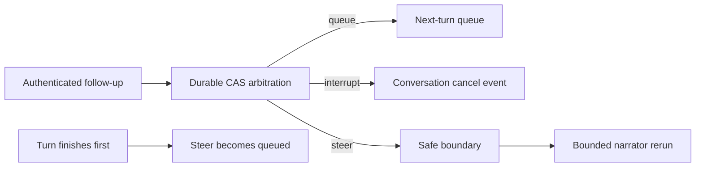

# Busy Conversation Input Modes

This design defines one channel-neutral state machine for follow-up input received while an
operator conversation turn is active. It covers durable queue, interrupt, and steer semantics,
input bounds, authorization, cancellation, safe boundaries, cross-channel behavior, and recovery.

> **Scope:** Busy-input cancellation stops only conversational model and tool work. It does not
> cancel or modify an action, approval, resource lock, idempotency key, execution scope, or rollback.

## Design at a glance

Every accepted follow-up is persisted before acknowledgement. The shared coordinator chooses one
disposition from the session mode, signals only the active conversational turn, and consumes steer
input at a declared model or tool boundary.

## Contracts

`BusySessionState` contains the session owner, configured mode, active turn ID, revision, next
sequence, and bounded pending projection. `BusyInput` contains stable input and idempotency IDs,
session and principal IDs, bounded content, input kind, received time, and expiry. Each pending
record has one sequence, disposition, lifecycle status, and optional consumed time.

The supported modes are:

| Mode | Durable disposition | Behavior |
|------|---------------------|----------|
| `queue` | `queued` | Run as a later turn after the active turn finishes. |
| `interrupt` | `interrupting` | Signal cancellation for the active conversational run. |
| `steer` | `steered` | Consume once at the next safe boundary and rerun the narrator. |

Rejected input receives a durable rejected record and reason but does not advance accepted sequence
or remove earlier pending input.

## Bounds and idempotency

A session accepts at most 32 pending inputs and 32,000 bytes of pending content. One input body is limited
to 4,000 bytes. Expiry is bounded to one hour. Overflow returns `queue_capacity_exceeded`; it does not drop
an older accepted record.

Idempotency is unique within a session. Replaying the same complete input returns the original
record and sequence. Reusing an input or idempotency ID with different content is a conflict.

## Durable arbitration

PostgreSQL stores session state and pending inputs separately. Submit, mode/active-turn update,
turn finish, consume, and expiry lock the session row and use revision compare-and-swap semantics.
The accepted input row and session sequence update commit in one transaction.

A simultaneous steer submission and turn finish has two safe outcomes: the steer is consumed at a
safe boundary, or it remains pending with disposition `queued`. It cannot disappear. Restart loads
the same revision, mode, active-turn marker, and pending records.

## Interrupt behavior

The web one-shot and stream routes register an active turn after authentication and bounded request
validation. The backend model call races against a conversation-local cancellation event. On
interrupt:

- The backend task is cancelled and awaited.
- A bounded post-generation narrator quality review is part of the same conversational task and is
    cancelled and awaited under the same active-turn signal.
- The one-shot route returns an interrupted response before appending an assistant turn.
- The stream emits `interrupted`, emits no `done`, and closes upstream iteration.
- Planning helpers are cancelled and awaited.
- The active-turn marker is finished in `finally`.

For a normal terminal answer, the stream cancels outstanding planning and finishes the active-turn
marker before emitting `done`, so no coordinator work runs after the terminal frame. A busy-store
cleanup error is logged with session and request identifiers but does not corrupt an already
verified and persisted answer or its HTTP body completion.

The cancellation event is not connected to Thor, the action bus, approval state, resource locks,
or an executor identity.

## Steer behavior

Steer is available only for prose input. Approval, denial, emergency-stop, and other control input
cannot be combined with steer prose. A steer is persisted before the acknowledgement is returned.

At a safe model or tool boundary, the coordinator rechecks the principal, consumes one record
exactly once, appends its content as in-memory user guidance, and reruns the narrator. A turn accepts
at most four steer reruns. If the turn finishes before consumption, `finish_turn` atomically changes
unconsumed steer disposition to `queued`.
The terminal quality review runs after the final steered draft. It does not consume another steer or
start another operator turn; input that arrives during review remains governed by the existing
queue, interrupt, or steer race outcome.
Queued and steered follow-ups retain the active incident conversation binding; a rerun never
reverts to fuzzy incident selection or changes Bragi's narrator identity.
They also preserve an English or Korean current-screen explanation intent and its 120-word
walkthrough bound; steer guidance cannot expand that turn into an unbounded snapshot recital.
They also retain intent scope. A steer rerun keeps the active turn's structured `web`, `local`, or
`none` search route; a queued next turn classifies its own content. An incident collection-summary
follow-up deterministically renders the bounded matching set without asking the operator to select
one incident. A question that requires one incident, such as cause analysis, keeps the
ambiguous-selection behavior.

## Queue behavior

Queued input remains durable for the next turn. Inspection shows ordered pending entries and expiry.
Consumption rechecks the current principal and marks one sequence consumed exactly once. Expired
entries retain their idempotent history but leave the pending projection.

## Web and channel surfaces

The authenticated web surface provides:

- `POST /chat/busy-input` to submit one follow-up.
- `GET /chat/busy-input?session_id=...` to inspect mode, active state, revision, and pending input.
- `PUT /chat/busy-input/mode` to set `queue`, `interrupt`, or `steer`.
- `POST /chat/busy-input/cancel-current` to signal only the active conversational turn.

The acknowledgement includes disposition, session ID, input ID, sequence, reason, and duplicate
status.

Slack and Teams use `ConversationChannelGateway`. The gateway resolves the same durable session ID,
checks whether a turn is active, and calls the same coordinator. Busy input returns the same
channel-neutral acknowledgement instead of starting a concurrent turn. Idle channel input is
wrapped with shared begin/finish semantics. Vendor adapters do not implement their own state
machine.

## Metrics and operations

The runtime records queued, interrupting, steered, rejected, duplicate, overflow, expiry, steer
fallback, and race-recovery counters. Pending inspection exposes no cross-owner state. Authorization
is checked both when input arrives and when it is consumed.

## Failure behavior

- Queue overflow and expired input are visibly rejected.
- Duplicate webhook delivery returns the original disposition.
- A stale revision loses the write and retries from the durable state.
- A missing or cross-owner session returns the same not-found shape.
- A process restart preserves accepted input and mode preference.
- When busy-input runtime is not configured, existing chat behavior is unchanged.

## Verification

Coverage includes all three modes, duplicate and conflicting IDs, capacity, expiry, authorization,
exactly-once consume, turn-end versus steer races, restart persistence, one-shot and stream cleanup,
no partial assistant history, bounded steer reruns, mode and inspection routes, and shared Slack and
Teams gateway acknowledgements.

## Related docs

| To learn about | Read |
|----------------|------|
| Operator conversation and history | [Operator Console](operator-console.md) |
| Detached investigations | [Background Task Sessions](background-task-sessions.md) |
| Typed action safety boundary | [Execution Model](../decisioning/execution-model.md) |
| Channel identity and roles | [User RBAC and Entra Identity](user-rbac-and-identity.md) |
