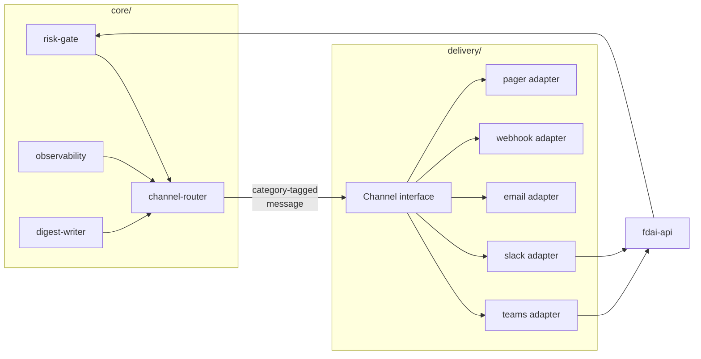

# 채널과 알림(Channels and Notifications)

FDAI가 **비-웹-UI 채널** - Teams, Slack, email, webhook, paging 서비스, SMS -
을 통해 사람과 소통하는 방법. 이 문서는 **채널 추상화, 신뢰 레벨, 카테고리 경계, 라우팅
정책, 채널 특이 규칙**의 진실 원본입니다. [tech-stack-ko.md](../architecture/tech-stack-ko.md) 에서 힌트한
"notifier 인터페이스" placeholder를 해결하고
[operating-and-verification-ko.md](../operations/operating-and-verification-ko.md#alert-routing)의 Alert
Routing 조각들과
[user-rbac-and-identity-ko.md](user-rbac-and-identity-ko.md#7-chatops-hil-flow)의 Teams-특이
흐름을 통합.

웹-UI(읽기 전용 콘솔)는 이 문서 범위 밖; 콘솔의 아이덴티티 흐름은
[user-rbac-and-identity-ko.md](user-rbac-and-identity-ko.md)에 있음.

> **방향 범위.** Outbound notification, A1 approval, bidirectional conversation은 서로 다른
> Protocol입니다. 이 문서는 공통 trust/category/routing 원칙과 outbound delivery를 소유하고,
> conversation tool/session semantics는 [operator-console.md](operator-console-ko.md)가 소유합니다.
> Adapter는 credential을 공유할 수 있지만 blast radius가 다른 세 계약을 합치지 않습니다.

> 고객-비종속: 아래 모든 채널 id, 그룹 이름, 엔드포인트는 **placeholder** ; 포크가 config로
> 자체 tenant, workspace, 엔드포인트 값 공급
> ([generic-scope.instructions.md](../../../.github/instructions/generic-scope.instructions.md)).

## 1. 설계 원칙

1. **세 개의 좁은 추상화, 여러 어댑터.** `NotificationChannel`은 A2/A4 push,
  `HilChannel`은 A1 send/poll, `ConversationChannelAdapter`는 A3 inbound/outbound를 소유합니다.
  코어는 Teams나 Slack을 이름 지정하지 않으며 새 vendor adapter는 추가적입니다.
2. **벤더가 아니라 목적으로 분류.** 채널은 네 카테고리(§3) 중 하나 이상을 지원. 벤더는
   안전하게 서비스할 수 있는 카테고리로 제약됨.
3. **신뢰 티어링.** 승인 카테고리 트래픽(A1)은 사람의 Entra 아이덴티티를 종단으로 검증할 수
   없는 채널을 통해 흘러선 안 됨. 신뢰 낮은 채널은 정보를 운반해도 결정은 절대 안 됨(§4).
4. **불확실할 때는 안전한 쪽을 선택.** 카테고리의 설정된 모든 채널이 실패하면 요청은 큐잉되고 운영 라인에
   page - 절대 auto-execute 안 함. 카테고리 내 fallback은 신뢰 티어 보존(§6).
5. **Redaction은 발신자의 일.** 시크릿, 자격증명, PII, 구독 id, 원시 고객 페이로드는 어떤
   카테고리에서도 채널 메시지로 신뢰 경계를 떠나지 않음.

## 2. 아키텍처 상 채널의 위치



- Outbound 어댑터는 `delivery/notifications/`, bidirectional adapter는 `delivery/channels/`,
  A1 approval adapter는 `delivery/chatops/`에 있습니다. 계약은 각각
  `shared/providers/notifications/`, `conversation_channel.py`, `hil_channel.py`에 있습니다.
- **channel-router**는 얇은 코어 모듈: 카테고리와 메시지를 받아 포크의 라우팅 config(§6)에
  따라 채널을 선택. 벤더 지식을 보유하지 않음.
- **어떤 어댑터의 승인 콜백도 `fdai-api`에 랜딩** , 이는 액션 전에 사람의 Entra
  아이덴티티를 재검증
  ([user-rbac-and-identity-ko.md](user-rbac-and-identity-ko.md#102-api-token-validation)).
  어댑터는 절대 자체로 결정을 authorize 하지 않음.

## 3. 카테고리 (A1-A4)

모든 채널 메시지는 **카테고리 태그**를 운반하고 그 카테고리의 규칙을 준수해야 함.

| 카테고리 | 방향 | 예시 | 필요한 인증 강도 |
|----------|------|------|-----------------|
| **A1 - HIL 승인** | 양방향(결정 반환) | 고위험 액션 승인, enforce-promotion 승인, exemption 승인, override 승인 | **최고** - 검증된 Entra 아이덴티티, 액션-바인딩, 재생 없음 |
| **A2 - 운영 알림** | outbound only | SLO burn, DLQ depth, verifier 실패율, cold-start miss, IaC drift, adapter 불건강, canary miss | 낮음 - 정보성 |
| **A3 - 채팅 명령** | 양방향(쿼리/응답) | **read**: `/aw status`, `/aw shadow-report`, `/aw override list`, `/aw kill-switch status`. **write (draft-PR only)**: `/aw override draft`, `/aw exemption draft`, `/aw assignment param-tune` | 중간 - 명령별 롤-게이팅(§3.1) |
| **A4 - 다이제스트** | outbound only | 일간 shadow-accuracy 리포트, 주간 override 회고, 주간 enforce-promotion 후보, 주간 governance PR aging, 주간 exemption 만료 lookahead, 월간 KPI + 비용 총결, break-glass 사용 요약 | 낮음 - 수신자 스코프만 |

**카테고리 경계 (MUST)**

- **A1 승인은 절대 메시지에 결정 페이로드를 운반하지 않음.** Adaptive Card / Block Kit /
  email body는 **opaque `approval_id`**을 운반; 실제 결정은 `fdai-api`로 post,
  이것이 재인증하고 재검증 (`idempotency_key` + `action_hash`) 하여 유출된 메시지가 유효한
  승인이 아니게 함.
- **A3 write 명령은 절대 라이브 카탈로그를 직접 변형하지 않음** - 콘솔과 같은 방식으로 draft
  PR을 생산
  ([user-rbac-and-identity-ko.md](user-rbac-and-identity-ko.md#6-identity-flow-console--draft-pr--audit)
  §6), invoker의 Entra OID를 PR trailer에 운반. PR은 이후 표준 quorum + 자기승인 없음 규칙을
  따름.
- **A2/A4 메시지는 절대 승인 버튼이나 실행 링크를 포함하지 않음.**

### 3.1 A3 명령 롤 게이팅

각 A3 명령은 **최소 롤**과 read/write 여부를 선언. 봇 어댑터가 invoker의 Entra OID
(Teams SSO / Slack 매핑)로 핸들러 실행 전에 검사 강제; 롤 부재는 in-channel `403` 응답과
감사 엔트리를 씀.

| 명령 | 타입 | 최소 롤 |
|------|------|--------|
| `/aw status`, `/aw shadow-report`, `/aw kpi` | read | `Reader` |
| `/aw override list`, `/aw exemption list`, `/aw kill-switch status` | read | `Reader` |
| `/aw override draft`, `/aw exemption draft`, `/aw assignment param-tune` | write → draft PR | `Contributor` |
| `/aw kill-switch on`/`off` | write → draft PR + A1 승인 | `Owner` |

## 4. 신뢰 레벨(matrix)

채널의 *허용 카테고리*는 기술적으로 딜리버리 가능한 것과 인증이 증명할 수 있는 것의 교집합.

| 채널 | Entra tenant | 인증 경로 | 허용 카테고리 |
|------|--------------|-----------|--------------|
| **Teams (same tenant)** | ✓ | Teams SSO → OBO 교환 → `fdai-api` 토큰 | **A1, A2, A3, A4** |
| **Teams (guest tenant)** | guest | guest OID로 OBO | **A2, A3, A4** (A1 거부 - [user-rbac-and-identity-ko.md §10.5](user-rbac-and-identity-ko.md#105-guest-entra-b2b-users)와 동일한 guest 규칙) |
| **Slack** | ✗ | Slack OAuth; **fork-mandatory** Slack userId ↔ Entra OID 매핑; A1 승인은 브라우저에서 Entra 재인증을 위해 `fdai-api`로 바운스 | **A1, A2, A3, A4** - P1에서 A1 활성화(§7 Slack notes 참조) |
| **Email (SMTP / Graph)** | ✗ | 발신 전용, return 채널 없음 | **A2, A4 only** - 절대 A1 아님 (magic-link 승인 금지) |
| **Generic webhook** | ✗ | HMAC-signed, timestamped, replay-guarded | **A2 only** |
| **PagerDuty / Opsgenie** | ✗ | API 키, 모바일 앱에서 ack | **A2 only** (운영 라인 paging) |
| **SMS** | ✗ | - | **A2 only** (최소 페이로드; break-glass 도달성) |

**매트릭스를 안전하게 유지하는 규칙 (MUST)**

- **Magic-link 승인은 모든 채널에서 금지.** 승인은 항상 `fdai-api`를 통한 재인증된
  왕복이 필요.
- **A1 fallback은 A1-capable 채널 안에 머무름.** 실패한 Teams A1 시도는 절대 email로
  falls through 하지 않음; 다른 A1-capable 채널(Teams standby, 또는 매핑이 있을 때 Slack)
  또는 HIL 큐로 fall.
- **Slack A1은 userId↔OID 매핑 필요.** 매핑 provider가 응답 Slack 사용자에 대해 non-empty
  엔트리를 반환할 때까지 어댑터는 A1 트래픽 서비스 거부; 매핑 부재는 "승인자 없음" 취급
  (HIL 큐로 fail-closed).

### 4.1 Sender pairing trust bootstrap

`ChannelAccessService`는 channel별 `disabled`, `allowlist`, `pairing`을 지원합니다. Durable
PostgreSQL store는 channel-scoped transaction lock으로 request 생성을 직렬화하고 pending cap을
atomic하게 강제하고 expired request를 cap에서 제외하고 저장된 digest를 조건부 승인합니다.
승인된 sender는 재등록해 principal mapping을 덮어쓸 수 없습니다.

`NativePairingChallengeFlow`는 plaintext challenge를 동일 thread의 channel reply로만 보냅니다.
Store와 response metadata에는 SHA-256 digest 및 expiry만 남습니다. Delivery 실패 시 일치하는
pending digest를 조건부 삭제하므로 전달되지 않은 code가 capacity를 소비하지 않습니다.
Approval은 별도 authorized actor 및 기존 FDAI principal을 계속 요구합니다. Pairing은 identity
resolution만 부여하며 role을 부여하거나 coordinator의 tool RBAC을 우회하지 않습니다.

Cross-channel identity link는 identity merge가 아니라 pairing 위의 explicit relation record입니다.
두 sender는 같은 FDAI principal에 각각 독립 승인되어 있어야 하고 link는 서로 다른 두 channel
kind를 연결해야 하며 별도 authorized actor가 승인해야 합니다. Sender mapping이 서로 다른 두
principal을 가리키면 service는 write 전에 request를 거부합니다. Deterministic link id로 retry가
idempotent하고 PostgreSQL record는 어느 sender mapping 또는 principal role도 변경하지 않으면서
restart 후에도 유지됩니다.

Channel attachment는 instruction이 아니라 evidence input입니다. Slack 및 Teams adapter는 bounded
file metadata와 opaque vendor id만 normalize하고 payload가 제공한 download URL은 버립니다.
Server-owned app-credential fetcher가 해당 id를 resolve하고 `ProtectedChannelAttachmentIngestor`는
가져온 byte count 및 SHA-256을 검증한 뒤 기존 malware, protection, extraction, indexing, access,
retention pipeline에 source를 전달합니다. Conversation gateway는 operator의 원래 text를 변경하지
않고 READY `doc:` ref만 response citation에 추가합니다. Held, infected, unknown-protection,
oversized, malformed attachment는 tool dispatch를 차단합니다. 일반 bitmap signature는 text unit이
없는 metadata-only envelope를 만들므로 image byte가 prompt instruction이 될 수 없습니다.
Deployment는 P0-15 channel composition에서 vendor credential fetcher를 binding하며 arbitrary
attachment URL은 지원 seam이 아닙니다.

Teams ingress는 두 identity를 분리합니다. `BotFrameworkJwtAuthenticator`는 cached JWKS를
사용해 Bot Framework service token의 RS256 signature, app audience, Bot Framework issuer,
expiration/not-before, required `serviceurl`을 검증합니다. 그 다음 route는 activity의
`serviceUrl` 및 `channelId=msteams`가 verified service identity와 일치하도록 요구합니다. 이
검사를 통과한 뒤에만 `TeamsPrincipalResolver`가 activity tenant를 검증하고
`from.aadObjectId`를 bounded configured canonical FDAI principal로 mapping합니다. Service-token
failure는 `401`, unknown tenant 또는 user binding은 `403`이며 둘 다 channel queue에 도달하지
않습니다. Conversation gateway가 turn을 보기 전에 vendor id는 canonical principal로 교체됩니다.

Production composition은 `FDAI_TEAMS_BOT_APP_ID`, optional HTTPS issuer/JWKS override,
`FDAI_TEAMS_TENANT_ID`, `FDAI_TEAMS_PRINCIPAL_BINDINGS_JSON`을 읽습니다. Binding map은 non-empty
string-to-string JSON object이며 최대 1000 entry입니다. Missing, malformed, unbounded config는
startup에서 실패합니다. Bot service token은 channel service를 인증하며 operator의 Entra
principal을 대체하거나 FDAI role을 부여하지 않습니다.

`ProductionChannelRuntime`은 standalone channel gateway process를 소유합니다. Read-only console
API에 mount되지 않고 executor identity를 받지 않습니다. ASGI startup에서 injected
`SecretProvider`를 통해 Slack signing 및 bot-token reference를 resolve하고 fixed-endpoint Slack,
workload-identity Teams publisher를 생성하며 enabled bounded ingress route만 등록하고 adapter별
`ConversationChannelGateway.run` consumer를 하나씩 시작합니다. Credential, Teams identity,
endpoint resolver, JWT config, principal binding이 누락되면 route가 traffic을 받기 전에 startup이
실패합니다. Shutdown은 channel queue를 닫고 consumer를 기다리고 dynamic route를 제거하며 owned
HTTP client를 닫습니다.

Channel enablement 및 queue bound는 `FDAI_SLACK_CHANNEL_ENABLED`,
`FDAI_TEAMS_CHANNEL_ENABLED`, `FDAI_SLACK_SIGNING_SECRET_REF`,
`FDAI_SLACK_BOT_TOKEN_REF`, `FDAI_CHANNEL_QUEUE_CAPACITY`를 사용합니다. Secret value는 provider
안에 유지되고 configuration 및 error에는 reference name만 들어갑니다. `GET /healthz`는 process
liveness만 노출하며 channel, principal, credential data를 포함하지 않습니다.

### 4.2 Rich thread 및 delivery behavior

`OutboundResponse`는 core code에 Slack 또는 Teams dependency를 주지 않고 vendor-neutral rich
delivery 및 thread intent를 전달합니다. 기존 text reply가 기본값이며 scheduled continuation은
명시적 origin 또는 dedicated thread mode와 opaque anchor id metadata를 사용합니다. Response는
bounded mention과 rich operation 하나를 추가할 수 있으며 모호하거나 큰 값은 게시 전에 차단됩니다.

Concrete publisher는 해당 intent를 다음과 같이 mapping합니다.

| Behavior | Slack | Teams | Text fallback |
|----------|-------|-------|---------------|
| Thread reply | `thread_ts`를 사용하는 `chat.postMessage` | `replyToId`를 사용하는 message activity | 같은 originating thread |
| Mention | `<@vendor-id>` | `<at>` text 및 Bot Framework mention entity | `@display-name`; opaque target id는 생략 |
| Streaming | 최초 `chat.postMessage` 후 cumulative `chat.update` | 최초 activity `POST` 후 cumulative activity `PUT` | 최종 text reply 하나 |
| Edit | 선언된 message id에 `chat.update` | 선언된 activity id에 activity `PUT` | `Update:` prefix가 있는 새 thread reply |
| Reaction | inbound message에 `reactions.add` | inbound message에 `messageReaction` activity | `Reaction:` label이 있는 새 thread reply |

Concrete Slack 및 Teams configuration은 mention, streaming, edit, reaction capability flag를
소유합니다. Disabled capability가 core에서 vendor payload를 추측하게 하지 않으며 publisher가
문서화된 text fallback을 사용합니다. 모든 fallback에서 thread context를 보존합니다. Vendor
endpoint는 publisher configuration 또는 authenticated Teams endpoint resolver에 고정됩니다.
Response data는 URL, token, alternate API method를 제공할 수 없습니다.

Accepted send는 요청한 operation, vendor message id, text degradation 여부를 포함하는
`ChannelDeliveryReceipt`를 반환합니다. Slack post는 `ok=true` response 및 message timestamp를
요구합니다. Teams message 생성은 Bot Framework resource id를 요구합니다. Acknowledgement가
누락되거나 malformed이면 delivery를 보고하지 않고 send를 실패시킵니다. Adapter는 receipt를
caller에게 전달하며 transport failure는 계속 raise되어 기존 retry/audit path를 따릅니다.

### 4.3 Durable reply delivery 및 adapter control

External conversation reply는 [durable-conversation-delivery-ko.md](durable-conversation-delivery-ko.md)의
persisted ledger를 사용합니다. Provider HTTP rejection은 bounded retry가 가능한 definitive
failure입니다. Transport interruption 또는 missing/malformed acknowledgement는 ambiguous이며
자동으로 재시도하지 않습니다. Pause/resume mutation은 별도로 authenticated된 ChatOps command
route에만 있고 console에는 GET-only reliability metric만 제공됩니다.

Authenticated generic webhook은 `TypedWebhookMapping`을 opt-in할 수 있습니다. Mapping은 하나의
allowlisted normalized event type 및 target agent를 configuration에서 고정하고 payload가 제공한
event, agent, command, session value는 이를 override할 수 없습니다. Server-owned dot path는 bounded
scalar field만 project합니다. Missing field, container, oversized string, non-allowlisted target은
publication 전에 fail합니다. Bounded session key는 명시적으로 선택된 scalar value의 SHA-256
digest이므로 raw external identity value가 session id가 되지 않습니다. Projected event는 여전히
event-ingest, trust routing, risk gating, audit에 진입하며 webhook은 action을 execute하지 않습니다.

## 5. Channel 인터페이스 (계약)

- **A2/A4:** `NotificationChannel.send(NotificationMessage) -> DeliveryReceipt`.
  `NotificationMessage.category`는 semantic route key이고 `trust_tier`가 A1-A4를 표현합니다.
- **A1:** `HilChannel.send(HilApprovalRequest) -> HilApprovalReceipt`와
  `poll(receipt) -> HilResponse`.
- **A3:** `ConversationChannelAdapter.receive() -> InboundTurn` 및
  `send(OutboundResponse) -> ChannelDeliveryReceipt`.

- **어댑터는 절대 자체로 결정을 authorize 하지 않음.** `HilChannel.poll`은 사용자가 클릭한
  것을 반환; 코어 라우터가 그 raw response를 `fdai-api`로 넘기고, 그것이 유일한 권위
  (아이덴티티 재검증, 재생 검사, 자기승인 없음).
- **어댑터는 메시지 body를 재스캔** 해야 함 - 알려진 시크릿 패턴에 대해(CI secret 스캐너가
  쓰는 것과 같은 regex 세트) 발송 전에 마지막 방어선으로.
- **어댑터는 멱등 `send`를 구현** 해야 함: 같은 `correlation_id + audit_id + category`로
  재발행된 send는 중복 포스트를 생성해선 안 됨.

### 5.1 오디언스 파생 (channel-as-audience)

수신자 리스트는 라우터에서 per-user로 파생되지 **않음**. 각 채널이 오디언스 *그 자체* 이며,
멤버십은 컨트롤 플레인 **밖에서** 관리 - 보통 채널을 Entra 보안 그룹에 바인딩.

- **기본 (Option A)**: Teams 채널/DL은 `aw-*` Entra 보안 그룹으로 백업된 **group-connected
  team**으로 생성. 멤버십은 Entra에서 자동 sync ("Owner가 Portal에서 `aw-approvers`에
  사람 추가" → 그들은 즉시 다음 다이제스트와 모든 A1/A2/A3 포스트 보게 됨). 이는 관리를 하나의
  표면에 유지
  ([user-rbac-and-identity-ko.md §4.2](user-rbac-and-identity-ko.md#42-security-groups-slots)).
- **In-message `@mentions`**은 채널 포스트 안에서 아티팩트-소유자를 호출(예: 만료되는 exemption
  의 요청자). 멘션은 감사 스트림이 이미 운반하는 아티팩트 메타데이터(`requested_by`, PR author,
  rule author)에서 파생 - 다이제스트 시점에 Graph 조회 없음.
- **롤-파생 direct messaging**은 break-glass 사용 요약에만 사용(채널 포스트로 충분하지 않은
  작고 시간-임계 오디언스). 다른 모든 A4 다이제스트는 채널 전용.

다이제스트 엔트리의 허용 오디언스 모드:

| 모드 | 의미 | 허용 위치 |
|------|------|----------|
| `channel: <id>` | 채널/DL에 포스트; Entra 그룹 바인딩으로 멤버십 관리 | A2, A3, A4 (기본) |
| `mention-artifact-owner` | 추가적: 채널 포스트 안에서 아티팩트 소유자 `@mention` | A4 (다이제스트별 opt-in) |
| `role-dm: <RoleName>` | `aw-<role>` 멤버 Graph 조회, 각각 DM | A4 **break-glass 전용** (config 로드에서 다른 곳은 deny-list) |

### 5.2 능동적 이해관계자 브리핑 (A4 synthesis)

조직은 리더십을 위해 주기적 운영 요약을 작성하는 사람을 둔다 - "이번 window 에
무슨 일이 있었고, 우리가 무엇을 했으며, 리스크가 어디 있는가." `core/notifications/briefing.py`
(`StakeholderBriefingComposer`) 가 그 A4 다이제스트를 집계된 운영 카운트(severity 별
incident tally, auto / HIL / rolled-back / shadow-only 로 나뉜 action 결과, cost run-rate
delta 와 driver, forward-looking forecast 리스크, guard-metric breach)로부터
**결정론적으로** 합성한다 - per-event noise 로부터가 아니다.

- **Fail-closed, fabrication 없음.** composer 는 caller 가 제공하는 audit log / KPI
  telemetry 로부터 모든 수치를 sourcing 하고 받지 않은 것은 아무것도 assert 하지 않는다.
  actionable 활동이 없는 window 는 명시적인 "No significant operational activity" headline
  과 `has_significant_activity = False` 를 렌더링하므로, caller 는 아무 일도 없었다고
  리더십에 이메일하는 대신 send 를 **suppress** 한다. 다른 것 없이 1% 미만의 cost 흔들림은
  briefing 이 아니라 noise 로 취급한다.
- **Guard breach 는 escalate.** guard-metric breach(리더십이 절대 놓치면 안 되는 것)는
  결과에 명시적 `escalations` 로 surface 되어 caller 가 더 높은 trust tier 로 route 할 수
  있고, briefing body 에도 나타난다([goals-and-metrics.md](../architecture/goals-and-metrics-ko.md)).
- **Pure 하고 delivery-agnostic.** composer 는 vendor 지식을 갖지 않고 절대 dispatch 하지
  않는다; 위 audience 모드를 통한 A4 delivery 를 위해 caller 가 §6 의 router 에 넘기는
  `StakeholderBriefing` (markdown body 와 per-section payload)를 반환한다. 동일 입력, 동일 briefing.

## 6. 라우팅 정책 (config-driven)

라우팅은 선언적 config, channel-router가 평가. 채널 추가/교체/재정렬은 config 변경, 절대
코드 변경 아님.

**Config 위치**: outbound routing은 [`config/notifications-matrix.yaml`](../../../config/notifications-matrix.yaml)에
있습니다. 라우팅 변경은 governance 변경처럼 리뷰하며 A1 route 변경에는 Owner-tier review가
필요합니다. Conversation channel enablement는 별도 environment/config contract를 사용합니다.

```yaml
matrix:
  version: 1
  default_route: hil_approval
  routes:
    hil_approval:
      trust_tier: a1_hil_approval
      primary: teams-hil-prd
      fallback: [teams-hil-standby, slack-hil-prd]
      on_all_fail: hil_escalate
    operational_alert:
      trust_tier: a2_operational_alert
      primary: teams-ops-prd
      fallback: [pagerduty-primary, email-oncall]
      on_all_fail: hil_escalate
    digest_shadow_accuracy_daily:
      trust_tier: a4_digest
      primary: teams-hil-prd
      fallback: [email-governance]
      on_all_fail: hil_escalate
```

**라우터 규칙 (MUST)**

- **카테고리 ⊆ channel.categories** - 라우터는 선언된 카테고리에 메시지 카테고리가 포함되지
  않은 채널로 메시지 전송을 거부. 시작 config 검증이 허용되지 않은 카테고리와 채널을 짝지은
  라우팅 엔트리를 거부(deny-by-default; fail fast).
- **Fallback 시 신뢰 보존** - A1 primary → A1 fallback만. Fallback에서 더 낮은 신뢰 레벨로
  다운그레이드는 config-load 에러.
- **`role-dm`은 `break_glass_usage_summary`를 제외하고 deny-list.** `role-dm`을 시도하는
  다른 다이제스트는 config 로드 실패.
- **`mention-artifact-owner`를 선언하는 다이제스트는 유효한 메타데이터 필드를 명시** 해야 함
  (`rule_author`, `override_requester`, `exemption_requester`, `pr_author_and_reviewers`);
  알려지지 않은 값은 config 로드 실패.
- **Bounded 재시도** - 각 어댑터는 자체 재시도 예산을 선언; 라우터는 소진 시 다음 채널 또는
  `on_all_fail`로 escalate.
- **TTL fail-closed** - TTL까지 결정 없는 A1 요청은 no-op + A2 알림 + 감사 엔트리
  ([security-and-identity-ko.md](../architecture/security-and-identity-ko.md#hil-approval-integrity)).

## 7. 채널 특이 노트

| 채널 | 노트 |
|------|------|
| **Teams** | A1에 Adaptive Cards; OAuth 스코프 세트를 최소로 유지(`ChannelMessage.Send.Group` + 봇 시그널링). SSO + OBO는 이미 [user-rbac-and-identity-ko.md §10.4](user-rbac-and-identity-ko.md#104-chatops-teams-sign-in)에 커버. 다이제스트 오디언스는 **`aw-*` Entra 보안 그룹으로 백업된 group-connected 팀** - 멤버십이 별도 리스트 없이 Entra를 따름. |
| **Slack** | A2/A3에 Block Kit; 승인 콜백 URL은 `fdai-api`를 통해 리다이렉트하여 Entra 재인증이 Slack 안이 아니라 브라우저에서 발생. `chat:write` 스코프만. 포크는 userId↔OID 매핑 저장소를 공급해야 함; Slack 사용자에게 매핑된 Entra OID가 없으면 어댑터는 A1 트래픽 거부. Slack 채널 멤버십은 Slack에서 관리; 해당 `aw-*` 그룹과 수동 또는 SCIM으로 sync 유지. |
| **Email** | Azure Communication Services Email을 통한 send-only 채널입니다. 승인 링크는 포함하지 않고 다이제스트와 알림만 전달합니다. Terraform은 Azure-managed sender domain과 Communication Services 리소스에 범위가 제한된 전용 notification managed identity를 프로비저닝합니다. 어댑터는 단기 `https://communication.azure.com/.default` 토큰을 요청하고 provider operation이 `Succeeded`가 될 때까지 기다린 후 provider message id를 기록합니다. Redaction은 필수이며 `audit_id`와 대시보드 URL 이상의 상관 페이로드를 포함하지 않습니다. 권장 수신자는 `aw-approvers` / `aw-owners`를 미러링하는 **Entra 동적 분배 그룹**입니다. |
| **Generic webhook** | HMAC-SHA256 서명, 단조 타임스탬프, 단발 nonce. Receiver 실패는 절대 블록 안 함; 코어가 어댑터 정책대로 재시도 후 이동. |
| **PagerDuty / Opsgenie** | Dedup 키 = observability 상관 id 이므로 버스트가 접힘. 런북 URL은 모든 알림에 필수. |
| **SMS** | 페이로드는 `<severity> <audit_id> <short-url-to-runbook>`로 제한. 시크릿 없음, 고객 이름 없음, 자유 텍스트 없음. 주로 break-glass 도달성. |

## 8. Fallback과 Kill-Switch 상호작용

- **글로벌 kill-switch**는 모든 A1 dispatch를 즉시 중단하고 열린 A1 요청을 재큐잉;
  kill-switch 상태 자체는 모든 운영 채널에서 A2로 공지.
- **모든 A2 채널이 다운** 이면, 어댑터 헬스 원격측정은 여전히 관측성에 랜딩하고 콘솔에 나타남;
  kill-switch는 전용 break-glass 경로를 통해 조작 가능
  ([security-and-identity-ko.md](../architecture/security-and-identity-ko.md#rate-limiting-and-kill-switch-dos-and-containment)).
- 어댑터 불건강 자체는 A2 신호 - A1 딜리버리를 중단한 Teams outage는 fallback 채널을 통해
  운영 라인을 page.

## 9. 포크 vs 상류 분리

| 항목 | 상류 (이 리포) | 포크 |
|------|--------------|------|
| 세 provider contract와 message/receipt type | ✓ | - |
| Teams 어댑터 (기본 A1 + A2 + A3 + A4 구현) | ✓ | tenant / group-connected 팀 바인딩 |
| **A1 기본 활성화된 Slack 어댑터 (P1)** | ✓ | workspace 자격증명 + userId↔OID 매핑(필수) |
| ACS Email 어댑터 | ✓ (A2/A4, managed identity, 최종 상태 polling) | 수신자 바인딩 + 활성화 |
| Webhook / PagerDuty / SMS 어댑터 | ✓ (concrete delivery adapter) | 자격증명 + 활성화 |
| 라우팅-config 스키마 + 시작 검증 | ✓ | 배포별 binding/overlay |
| HIL escalation sink (`on_all_fail` fail-safe 큐) | ✓ (`StateStoreHilEscalationSink` - StateStore 기반, tenant-무관) | 자체 큐 백엔드(선택) |
| 7개 기본 다이제스트 + 오디언스 파생 규칙 | ✓ | cron 타임존, 채널 id, 다이제스트별 on/off |
| Secret-scan regex 세트(어댑터가 재사용) | ✓ | 필요 시 패턴 확장 |
| Slack userId ↔ Entra OID 매핑 **인터페이스** | ✓ | 매핑 데이터(P1 A1에 필수) |
| 다이제스트 컨텐트 템플릿 | ✓ (범용) | 브랜딩 / localization |

## 10. Open Decisions

- [ ] 어댑터-헬스 알림 임계와 dedupe 윈도우.
- [x] Incoming webhook scope - authenticated `TypedWebhookMapping`만 allowlisted event/agent
  target을 publish하며 payload는 command, target, session을 선택할 수 없습니다.
- [ ] 아티팩트 소유자가 **guest** 사용자일 때의 `mention-artifact-owner` 동작 (Teams에서
      멘션은 여전히 resolve하지만, 정보 유출을 줄이기 위해 다이제스트가 억제하거나 다르게
      라우팅해야 하는가?).
- [ ] `kpi_and_cost_monthly` GitHub-Issue 아카이브: 대상 리포/경로 (기본은 catalog-as-code
      리포, `docs/kpi-archive/`).

## 11. Localization (L2)

알림은 **L2 제품 표면**이다(참고:
[language.instructions.md](../../../.github/instructions/language.instructions.md)):
소스 문자열은 영어이며, 채널은 이를 다른 로케일로 렌더링할 수 있다.

- **렌더링 방식(Option C).** `core`는 최종 현지화 문자열을 절대 baked하지 않는다.
  모든 `NotificationMessage`는 `template_key`와 타입화된 `params`를 실어 나르고,
  라우터가 `send` 직전에 대상 채널의 로케일로 카탈로그
  (`src/fdai/core/notifications/messages.{en,ko}.json`)에서 `title` /
  `body_markdown`을 렌더링한다. 어댑터는 그대로다 - 여전히 `title` /
  `body_markdown`을 소비한다.
- **라벨만 현지화된다.** L0 값(decision word, rule id, 리소스 유형, mode)은 모든
  언어에서 verbatim으로 치환되므로 기계가 읽는 데이터는 동일하다. **감사 항목은
  항상 영어 메시지를 사용**하므로 replay와 correlation은 언어 중립으로 유지된다.
- **영어 폴백은 필수.** 로케일 키/필드가 없으면 영어 소스를, 영어 키마저 없으면
  키 자체를 렌더링한다(빈칸 없음).
- **로케일은 채널 속성.** 알림은 fan-out이므로 로케일은 오퍼레이터별이 아니라
  `config/notifications-matrix.yaml`의 `matrix.channels`에서 채널별로 설정한다
  (`<channel-id>: { locale: ko }`). 항목이 없는 채널은 영어로 렌더링된다.
