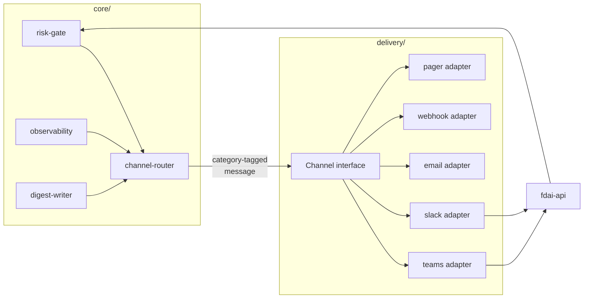

# 채널과 알림(Channels and Notifications)

FDAI가 Teams, Slack, 이메일, webhook, paging 서비스, SMS 및 명시적 선택 브라우저 notification을
통해 사람과 소통하는 방법. 이 문서는 **채널 추상화, 신뢰 레벨, 카테고리 경계, 라우팅
정책, 채널 특이 규칙**의 진실 원본입니다. [tech-stack-ko.md](../architecture/tech-stack-ko.md) 에서 힌트한
"notifier 인터페이스" 자리 표시자를 해결하고
[operating-and-verification-ko.md](../operations/operating-and-verification-ko.md#alert-routing)의 Alert
라우팅 조각들과
[user-rbac-and-identity-ko.md](user-rbac-and-identity-ko.md#7-chatops-hil-flow)의 Teams-특이
흐름을 통합.

읽기 전용 콘솔의 신원 및 interaction 흐름은 이 문서 범위 밖이고, 아웃바운드 브라우저
notification 경계만 이 문서가 소유합니다. 콘솔 신원은
[user-rbac-and-identity-ko.md](user-rbac-and-identity-ko.md)에 있습니다.

> **방향 범위.** 아웃바운드 notification, A1 승인, bidirectional 대화는 서로 다른
> 프로토콜입니다. 이 문서는 공통 trust/category/라우팅 원칙과 아웃바운드 전달을 소유하고,
> 대화 도구/세션 의미 규칙은 [operator-console.md](operator-console-ko.md)가 소유합니다.
> 어댑터는 자격 증명을 공유할 수 있지만 영향 범위가 다른 세 계약을 합치지 않습니다.

> 고객-비종속: 아래 모든 채널 id, 그룹 이름, 엔드포인트는 **자리 표시자** ; 포크가 구성으로
> 자체 테넌트, workspace, 엔드포인트 값 공급
> ([generic-scope.instructions.md](../../../.github/instructions/generic-scope.instructions.md)).

## 1. 설계 원칙

1. **세 개의 좁은 추상화, 여러 어댑터.** `NotificationChannel`은 A2/A4 push,
 `HilChannel`은 A1 전송/poll, `ConversationChannelAdapter`는 A3 인바운드/아웃바운드를 소유합니다.
 코어는 Teams나 Slack을 이름 지정하지 않으며 새 벤더 어댑터는 추가적입니다.
2. **벤더가 아니라 목적으로 분류.** 채널은 네 카테고리(§3) 중 하나 이상을 지원. 벤더는
 안전하게 서비스할 수 있는 카테고리로 제약됨.
3. **신뢰 티어링.** 승인 카테고리 트래픽(A1)은 사람의 Entra 아이덴티티를 종단으로 검증할 수
 없는 채널을 통해 흘러선 안 됨. 신뢰 낮은 채널은 정보를 운반해도 결정은 절대 안 됨(§4).
4. **불확실할 때는 안전한 쪽을 선택.** 카테고리의 설정된 모든 채널이 실패하면 요청은 큐잉되고 운영 라인에
 페이지 - 절대 auto-execute 안 함. 카테고리 내 대체 경로는 신뢰 티어 보존(§6).
5. **민감정보 제거는 발신자의 일.** 시크릿, 자격증명, PII, 구독 id, 원시 고객 페이로드는 어떤
 카테고리에서도 채널 메시지로 신뢰 경계를 떠나지 않음.

## 2. 아키텍처 상 채널의 위치


```mermaid
flowchart LR
 subgraph core[core/]
  RG[risk-gate] --> R[channel-router]
  OBS[observability] --> R
  DIG[digest-writer] --> R
 end
 R -->|category-tagged<br/>message| CH[Channel interface]
 subgraph delivery[delivery/]
  CH --> T[teams adapter]
  CH --> S[slack adapter]
  CH --> E[email adapter]
  CH --> W[webhook adapter]
  CH --> P[pager adapter]
 end
 T --> API[fdai-api]
 S --> API
 API --> RG
```

- 아웃바운드 어댑터는 `delivery/notifications/`, bidirectional 어댑터는 `delivery/channels/`,
 A1 승인 어댑터는 `delivery/chatops/`에 있습니다. 계약은 각각
 `shared/providers/notifications/`, `conversation_channel.py`, `hil_channel.py`에 있습니다.
- **channel-router**는 얇은 코어 모듈: 카테고리와 메시지를 받아 포크의 라우팅 구성(§6)에
 따라 채널을 선택. 벤더 지식을 보유하지 않음.
- **어떤 어댑터의 승인 콜백도 `fdai-api`에 랜딩** , 이는 액션 전에 사람의 Entra
 아이덴티티를 재검증
 ([user-rbac-and-identity-ko.md](user-rbac-and-identity-ko.md#102-api-token-validation)).
 어댑터는 절대 자체로 결정을 authorize 하지 않음.

## 3. 카테고리 (A1-A4)

모든 채널 메시지는 **카테고리 태그**를 운반하고 그 카테고리의 규칙을 준수해야 함.
이 카테고리는 `notification.a1`부터 `notification.a4`까지의 머신 category입니다. 헌법의
`autonomy.a0`부터 `autonomy.a4`까지의 권한 등급과 무관하며 숫자 접미사는 두 enum 계열의
동등성 또는 변환을 의미하지 않습니다.

| 카테고리 | 방향 | 예시 | 필요한 인증 강도 |
|----------|------|------|-----------------|
| **A1 - HIL 승인** | 양방향(결정 반환) | 고위험 액션 승인, enforce-promotion 승인, exemption 승인, 재정의 승인 | **최고** - 검증된 Entra 아이덴티티, 액션-바인딩, 재생 없음 |
| **A2 - 운영 알림** | 아웃바운드 only | SLO burn, DLQ depth, 검증기 실패율, cold-start miss, IaC drift, 어댑터 불건강, canary miss | 낮음 - 정보성 |
| **A3 - 채팅 명령** | 양방향(쿼리/응답) | **읽기**: `/aw status`, `/aw shadow-report`, `/aw override list`, `/aw kill-switch status`. **쓰기 (draft-PR only)**: `/aw override draft`, `/aw exemption draft`, `/aw assignment param-tune` | 중간 - 명령별 롤-게이팅(§3.1) |
| **A4 - 다이제스트** | 아웃바운드 only | 일간 shadow-accuracy 리포트, 주간 재정의 회고, 주간 enforce-promotion 후보, 주간 거버넌스 PR aging, 주간 exemption 만료 lookahead, 월간 KPI + 비용 총결, break-glass 사용 요약 | 낮음 - 수신자 스코프만 |

**카테고리 경계 (MUST)**

- **A1 승인은 절대 메시지에 결정 페이로드를 운반하지 않음.** Adaptive 카드 / 블록 Kit /
 이메일 본문은 **opaque `approval_id`**을 운반; 실제 결정은 `fdai-api`로 게시,
 이것이 재인증하고 재검증 (`idempotency_key` + `action_hash`) 하여 유출된 메시지가 유효한
 승인이 아니게 함.
- **A3 쓰기 명령은 절대 라이브 카탈로그를 직접 변형하지 않음** - 콘솔과 같은 방식으로 초안
 PR을 생산
 ([user-rbac-and-identity-ko.md](user-rbac-and-identity-ko.md#6-identity-flow-console--draft-pr--audit)
 §6), invoker의 Entra OID를 PR trailer에 운반. PR은 이후 표준 quorum + 자기승인 없음 규칙을
 따름.
- **A2/A4 메시지는 절대 승인 버튼이나 실행 링크를 포함하지 않음.**

### 3.1 A3 명령 롤 게이팅

각 A3 명령은 **최소 롤**과 읽기/쓰기 여부를 선언. 봇 어댑터가 invoker의 Entra OID
(Teams SSO / Slack 매핑)로 핸들러 실행 전에 검사 강제; 롤 부재는 in-channel `403` 응답과
감사 엔트리를 씀.

| 명령 | 타입 | 최소 롤 |
|------|------|--------|
| `/aw status`, `/aw shadow-report`, `/aw kpi` | 읽기 | `Reader` |
| `/aw override list`, `/aw exemption list`, `/aw kill-switch status` | 읽기 | `Reader` |
| `/aw override draft`, `/aw exemption draft`, `/aw assignment param-tune` | 쓰기 → 초안 PR | `Contributor` |
| `/aw kill-switch on`/`off` | 쓰기 → 초안 PR + A1 승인 | `Owner` |

## 4. 신뢰 레벨(매트릭스)

채널의 *허용 카테고리*는 기술적으로 딜리버리 가능한 것과 인증이 증명할 수 있는 것의 교집합.

| 채널 | Entra 테넌트 | 인증 경로 | 허용 카테고리 |
|------|--------------|-----------|--------------|
| **Teams (same 테넌트)** | ✓ | Teams SSO → OBO 교환 → `fdai-api` 토큰 | **A1, A2, A3, A4** |
| **Teams (guest 테넌트)** | guest | guest OID로 OBO | **A2, A3, A4** (A1 거부 - [user-rbac-and-identity-ko.md §10.5](user-rbac-and-identity-ko.md#105-guest-entra-b2b-users)와 동일한 guest 규칙) |
| **Slack** | ✗ | Slack OAuth; **fork-mandatory** Slack userId ↔ Entra OID 매핑; A1 승인은 브라우저에서 Entra 재인증을 위해 `fdai-api`로 바운스 | **A1, A2, A3, A4** - P1에서 A1 활성화(§7 Slack notes 참조) |
| **이메일 (SMTP / Graph)** | ✗ | 발신 전용, return 채널 없음 | **A2, A4 only** - 절대 A1 아님 (magic-link 승인 금지) |
| **범용 webhook** | ✗ | HMAC-signed, timestamped, replay-guarded | **A2 only** |
| **PagerDuty / Opsgenie** | ✗ | API 키, 모바일 앱에서 ack | **A2 only** (운영 라인 paging) |
| **SMS** | ✗ | - | **A2 only** (최소 페이로드; break-glass 도달성) |

**매트릭스를 안전하게 유지하는 규칙 (MUST)**

- **Magic-link 승인은 모든 채널에서 금지.** 승인은 항상 `fdai-api`를 통한 재인증된
 왕복이 필요.
- **A1 대체 경로는 A1-capable 채널 안에 머무름.** 실패한 Teams A1 시도는 절대 이메일로
 falls through 하지 않음; 다른 A1-capable 채널(Teams standby, 또는 매핑이 있을 때 Slack)
 또는 HIL 큐로 fall.
- **Slack A1은 userId↔OID 매핑 필요.** 매핑 프로바이더가 응답 Slack 사용자에 대해 비어 있지 않은
 엔트리를 반환할 때까지 어댑터는 A1 트래픽 서비스 거부; 매핑 부재는 "승인자 없음" 취급
 (HIL 큐로 실패 시 차단).

### 4.1 Sender pairing trust 초기화

`ChannelAccessService`는 채널별 `disabled`, `allowlist`, `pairing`을 지원합니다. 영속
PostgreSQL 저장소는 channel-scoped 트랜잭션 lock으로 요청 생성을 직렬화하고 pending 상한을
atomic하게 강제하고 만료된 요청을 상한에서 제외하고 저장된 다이제스트를 조건부 승인합니다.
승인된 sender는 재등록해 principal 대응을 덮어쓸 수 없습니다.

`NativePairingChallengeFlow`는 plaintext 도전자를 동일 스레드의 채널 회신로만 보냅니다.
저장소와 응답 메타데이터에는 SHA-256 다이제스트 및 만료만 남습니다. 전달 실패 시 일치하는
pending 다이제스트를 조건부 삭제하므로 전달되지 않은 코드가 용량을 소비하지 않습니다.
Approval은 별도 authorized 행위자 및 기존 FDAI principal을 계속 요구합니다. Pairing은 신원
해석만 부여하며 역할을 부여하거나 조정기의 도구 RBAC을 우회하지 않습니다.

Cross-channel 신원 링크는 신원 병합이 아니라 pairing 위의 명시적 relation 기록입니다.
두 sender는 같은 FDAI principal에 각각 독립 승인되어 있어야 하고 링크는 서로 다른 두 채널
종류를 연결해야 하며 별도 authorized 행위자가 승인해야 합니다. Sender 대응이 서로 다른 두
principal을 가리키면 서비스는 쓰기 전에 요청을 거부합니다. 결정론적 링크 id로 재시도가
멱등적하고 PostgreSQL 기록은 어느 sender 대응 또는 principal 역할도 변경하지 않으면서
재시작 후에도 유지됩니다.

채널 첨부는 instruction이 아니라 근거 입력입니다. Slack 및 Teams 어댑터는 범위가 제한된
파일 메타데이터와 opaque 벤더 id만 normalize하고 페이로드가 제공한 download URL은 버립니다.
서버가 소유한 app-credential 가져오기 도구가 해당 id를 해석하고 `ProtectedChannelAttachmentIngestor`는
가져온 바이트 개수 및 SHA-256을 검증한 뒤 기존 malware, protection, 추출, 인덱싱, 접근,
보존 파이프라인에 출처를 전달합니다. 대화 게이트웨이는 운영자의 원래 텍스트를 변경하지
않고 READY `doc:` 참조만 응답 인용에 추가합니다. Held, infected, unknown-protection,
oversized, malformed 첨부는 도구 전달을 차단합니다. 일반 bitmap 서명은 텍스트 단위가
없는 metadata-only 묶음을 만들므로 이미지 바이트가 프롬프트 instruction이 될 수 없습니다.
배포는 P0-15 채널 조립에서 벤더 자격 증명 가져오기 도구를 연결하며 arbitrary
첨부 URL은 지원 경계가 아닙니다.

Teams 유입은 두 신원을 분리합니다. `BotFrameworkJwtAuthenticator`는 cached JWKS를
사용해 Bot Framework 서비스 토큰의 RS256 서명, 앱 대상, Bot Framework 발급자,
만료/not-before, 필수 `serviceurl`을 검증합니다. 그 다음 경로는 활동의
`serviceUrl` 및 `channelId=msteams`가 검증된 서비스 신원과 일치하도록 요구합니다. 이
검사를 통과한 뒤에만 `TeamsPrincipalResolver`가 활동 테넌트를 검증하고
`from.aadObjectId`를 범위가 제한된 구성된 정본 FDAI principal로 대응합니다. Service-token
실패는 `401`, unknown 테넌트 또는 user 연결은 `403`이며 둘 다 채널 큐에 도달하지
않습니다. 대화 게이트웨이가 턴을 보기 전에 벤더 id는 정본 principal로 교체됩니다.

운영 조립은 `FDAI_TEAMS_BOT_APP_ID`, 선택적 HTTPS 발급자/JWKS 재정의,
`FDAI_TEAMS_TENANT_ID`, `FDAI_TEAMS_PRINCIPAL_BINDINGS_JSON`을 읽습니다. 연결 지도는 비어 있지 않은
string-to-string JSON 객체이며 최대 1000 항목입니다. 누락된, malformed, unbounded 구성은
시작에서 실패합니다. Bot 서비스 토큰은 채널 서비스를 인증하며 운영자의 Entra
principal을 대체하거나 FDAI 역할을 부여하지 않습니다.

`ProductionChannelRuntime`은 standalone 채널 게이트웨이 프로세스를 소유하도록 설계된 library
런타임입니다. 읽기 전용 콘솔 API에 mount되지 않고 실행기 신원을 받지 않습니다.
Repository는 아직 이 런타임을 instantiate하는 운영 ASGI factory 또는 Terraform 워크로드를
제공하지 않습니다. 배포가 별도 조립을 제공하면 ASGI 시작에서 injected
`SecretProvider`를 통해 Slack signing 및 bot-token 참조를 해석하고 fixed-endpoint Slack,
workload-identity Teams 발행기를 생성하며 활성화된 범위가 제한된 유입 경로만 등록하고 어댑터별
`ConversationChannelGateway.run` 소비자를 하나씩 시작합니다. 자격 증명, Teams 신원,
엔드포인트 해석기, JWT 구성, principal 연결이 누락되면 경로가 트래픽을 받기 전에 시작이
실패합니다. 종료는 채널 큐를 닫고 소비자를 기다리고 dynamic 경로를 제거하며 owned
HTTP 클라이언트를 닫습니다.

채널 활성화 및 큐 한계는 `FDAI_SLACK_CHANNEL_ENABLED`,
`FDAI_TEAMS_CHANNEL_ENABLED`, `FDAI_SLACK_SIGNING_SECRET_REF`,
`FDAI_SLACK_BOT_TOKEN_REF`, `FDAI_CHANNEL_QUEUE_CAPACITY`를 사용합니다. 시크릿 값은 프로바이더
안에 유지되고 구성 및 오류에는 참조 이름만 들어갑니다. `GET /healthz`는 프로세스
생존만 노출하며 채널, principal, 자격 증명 data를 포함하지 않습니다.

### 4.2 Rich 스레드 및 전달 행동

`OutboundResponse`는 코어 코드에 Slack 또는 Teams 의존성을 주지 않고 벤더 중립적인 rich
전달 및 스레드 의도를 전달합니다. 기존 텍스트 회신이 기본값이며 scheduled 이어가기는
명시적 출처 또는 dedicated 스레드 모드와 opaque anchor id 메타데이터를 사용합니다. 응답은
범위가 제한된 mention과 rich 연산 하나를 추가할 수 있으며 모호하거나 큰 값은 게시 전에 차단됩니다.
읽기 관측 회신은 순서와 크기가 제한된 활동 순서도 전달할 수 있습니다. 인계는
대화 라우터인 Bragi와 책임 관찰기를 표시하고, 관찰된 실행은 관찰기, 정본
서버 도구, 정제된 명령, 안전한 결과 요약, 상태, 권한 및 timing을 기록합니다. 전체
순서는 영속 응답 재생에 포함되며 채널 어댑터에 도구 또는 실행 권한을
부여하지 않습니다. Per-field 한도 외에도 전체 활동 순서에 48,000자 예산을 적용하여
허용된 응답 하나가 영속 또는 벤더 페이로드 상한을 넘지 않게 합니다. Command, 출력,
라벨, 도구 및 권한 필드는 모두 같은 high-signal 시크릿 scanner를 통과하며, Bearer 자격 증명은
whitespace 및 일반적인 구분자 양식에서 차단됩니다.
영속 활동 decode는 type-strict하며 발행기가 응답을 받기 전에 ordered RFC 3339
시각을 검증합니다.

구체적인 발행기는 해당 의도를 다음과 같이 대응합니다.

발행기 전송 계층 및 확인 응답 처리는 `publishers.py`에 유지되고, pure 범위가 제한된 Slack
블록 Kit 및 Teams Adaptive 카드 렌더링은 `publisher_rendering.py`에 있습니다. 이 분리는 wire
페이로드 또는 대체 경로 행동을 변경하지 않으며 벤더 표현을 독립적으로 테스트할 수 있게 합니다.

| 행동 | Slack | Teams | 텍스트 대체 경로 |
|----------|-------|-------|---------------|
| 스레드 회신 | `thread_ts`를 사용하는 `chat.postMessage` | `replyToId`를 사용하는 메시지 활동 | 같은 originating 스레드 |
| Mention | `<@vendor-id>` | `<at>` 텍스트 및 Bot Framework mention 개체 | `@display-name`; opaque 대상 id는 생략 |
| 스트리밍 | 최초 `chat.postMessage` 후 cumulative `chat.update` | 최초 활동 `POST` 후 cumulative 활동 `PUT` | 최종 텍스트 회신 하나 |
| 편집 | 선언된 메시지 id에 `chat.update` | 선언된 활동 id에 활동 `PUT` | `Update:` 접두사가 있는 새 스레드 회신 |
| Reaction | 인바운드 메시지에 `reactions.add` | 인바운드 메시지에 `messageReaction` 활동 | `Reaction:` 라벨이 있는 새 스레드 회신 |
| 에이전트 활동 | 인계, plain-text 명령/결과, Bragi 답변 순서의 블록 Kit section; 게시, 스트림 갱신, 편집에서 같은 블록을 보존 | 24,000-byte serialized 카드 예산 안의 같은 순서 Adaptive 카드 블록; multibyte 답변을 바이트 기준으로 제한하고 생략된 활동 수를 표시 | 같은 에이전트 귀속 및 민감정보 제거 표시가 있는 범위가 제한된 텍스트 |

Slack은 notification 및 accessibility 대체 경로를 위해 top-level `text` 필드에 전체 활동
대체 경로를 유지합니다. 블록 Kit은 각 활동을 자체 section에 한 번만 표시하고 최종 Bragi
section에는 정본 답변만 전달하므로 구조화된 클라이언트가 근거를 중복 렌더링하지 않습니다.

점진적 대화 전달은 완료된 답변을 인위적인 토큰 조각으로 나누는 대신 타입이 지정된 cumulative
`ChannelProgressUpdate` 스냅샷을 사용합니다. 게이트웨이는 ordered 조정기 활동과 정본
최종 미리 보기에서만 스냅샷을 파생합니다. 개정 번호는 연속적이고 활동 개수는 감소하지 않으며,
마지막 스냅샷은 텍스트와 활동 개수가 영속 `OutboundResponse`와 정확히 일치할 때만
`confirmed`입니다. Slack과 Teams는 개정 번호 0을 한 번 게시한 후 동일한 acknowledged 메시지를
이후 개정 번호로 편집합니다. 관찰된 활동이 없는 응답은 최종 게시 하나로 유지됩니다.
스트리밍이 비활성화된 채널은 같은 정본 최종 텍스트 대체 경로를 전송합니다.
Running 개정 번호에는 범위가 제한된 진행 상황 요약만 포함됩니다. 최종 confirmed 개정 번호에서 정본
민감정보가 제거된 활동 블록을 추가하므로 작업 진행 중 명령 및 출력 근거가 펼쳐지지 않으며 완료
후에는 확인할 수 있습니다.
운영 조립은 shared progressive-conversation 수집기를 두 발행기에 주입할 수
있습니다. 메시지, 대상 또는 신원 값을 보관하지 않고 집계 first-progress/confirmed
지연 시간, 잘림, 최종 완료 및 post-acknowledgement 모호함을 기록합니다.
잘림에는 벤더 필드 한도에 맞춰 잘린 출력과 Teams Adaptive 카드의 24,000-byte 예산을
지키기 위해 완전히 생략된 활동이 포함됩니다. 또한 4,000-character answer-block 한도에 맞춰
잘린 정본 Teams 답변과 mrkdwn escaping 후 2,900-character 블록 Kit section 한도에 맞춰
잘린 정본 Slack 답변도 포함됩니다. 메트릭은 잘림 발생 여부만 기록합니다. Omission
개수와 clipping 표시는 벤더 메시지에 표시됩니다. Multibyte JSON 인코딩이 Teams 카드 바이트
상한에 먼저 도달하면 같은 표시와 메트릭을 사용해 답변을 더 일찍 자릅니다. 원본 활동과
답변은 영속 응답 근거에 유지됩니다.

관찰된 출력은 명시적인 출처 이력 표시를 사용합니다. `[UPSTREAM OUTPUT TRUNCATED]`는
근거 생산자가 부분 출력을 제공했다는 뜻이고, `[CHANNEL OUTPUT TRUNCATED]`는 어댑터가
벤더 표현 한도에 맞춰 출력을 잘랐다는 뜻입니다. 두 조건이 모두 적용되면 두 표시를
함께 표시합니다.

구체적인 Slack 및 Teams 구성은 mention, 스트리밍, 편집, reaction 기능 플래그를
소유합니다. 비활성화된 기능이 코어에서 벤더 페이로드를 추측하게 하지 않으며 발행기가
문서화된 텍스트 대체 경로를 사용합니다. 모든 대체 경로에서 스레드 맥락을 보존합니다. 벤더
엔드포인트는 발행기 구성 또는 인증된 Teams 엔드포인트 해석기에 고정됩니다.
응답 data는 URL, 토큰, alternate API 메서드를 제공할 수 없습니다.

Accepted 전송은 요청한 연산, 벤더 메시지 id, 텍스트 성능 저하 여부를 포함하는
`ChannelDeliveryReceipt`를 반환합니다. Slack 게시는 `ok=true` 응답 및 메시지 시각을
요구합니다. Teams 메시지 생성은 Bot Framework 리소스 id를 요구합니다. 확인 응답이
누락되거나 malformed이면 전달을 보고하지 않고 전송을 실패시킵니다. 어댑터는 증적을
호출자에게 전달하며 전송 계층 실패는 계속 raise되어 기존 재시도/감사 경로를 따릅니다.
Initial 게시가 acknowledged된 후의 갱신 실패는 모호한 중복 risk로 분류됩니다. 영속
전달은 완전한 스트림을 다시 시도하여 두 번째 메시지를 만들지 않습니다.

### 4.3 영속 회신 전달 및 어댑터 control

외부 대화 회신은 [durable-conversation-delivery-ko.md](durable-conversation-delivery-ko.md)의
저장된 원장을 사용합니다. 프로바이더 HTTP 거절은 범위가 제한된 재시도가 가능한 definitive
실패입니다. 전송 계층 중단 또는 누락된/malformed 확인 응답은 모호한이며
자동으로 재시도하지 않습니다. Pause/재개 변경은 별도로 인증된된 ChatOps 명령
경로에만 있고 콘솔에는 GET-only reliability 메트릭만 제공됩니다.

인증된 범용 webhook은 `TypedWebhookMapping`을 명시적 선택할 수 있습니다. 대응은 하나의
허용 목록에 있는 정규화된 이벤트 타입 및 대상 에이전트를 구성에서 고정하고 페이로드가 제공한
이벤트, 에이전트, 명령, 세션 값은 이를 재정의할 수 없습니다. 서버가 소유한 dot 경로는 범위가 제한된
scalar 필드만 project합니다. 누락된 필드, 컨테이너, oversized 문자열, non-allowlisted 대상은
publication 전에 fail합니다. 범위가 제한된 세션 키는 명시적으로 선택된 scalar 값의 SHA-256
다이제스트이므로 raw 외부 신원 값이 세션 id가 되지 않습니다. Projected 이벤트는 여전히
event-ingest, trust 라우팅, risk gating, 감사에 진입하며 webhook은 액션을 execute하지 않습니다.

### 4.4 브라우저 system notification

Console은 브라우저 Notifications API와 origin-scoped 서비스 워커를 통해 명시적 선택 A2 상태 알림을
전달할 수 있습니다. Operator가 명시적인 Console control에서 기능을 활성화하며 FDAI는 페이지
load 중 권한을 요청하지 않습니다. 활성화된 tab이 background 상태여도 인증된
`GET /live/stream` 피드를 유지하고, 사람 승인, 거부, 실패 결과에만 notification을 발행합니다.
재생 프레임과 정상 성공 단계는 알림을 만들지 않습니다.

브라우저 notification은 정보 제공 전용입니다. Localized 범용 텍스트, opaque 범위가 제한된 이벤트 tag,
server-derived same-origin 읽기 전용 인시던트 화면 링크만 포함합니다. Raw 오류, 리소스 식별자,
승인 control, 실행 링크는 포함하지 않습니다. 반복 프레임은 동일 이벤트 notification을
교체하며 명시적 선택 선호 설정은 로그인한 브라우저 principal 범위로 저장합니다. principal 범위로 한정된
브라우저 원장은 여러 tab에서 같은 이벤트 tag를 5분 동안 억제하고 system notification을 분당
5건으로 제한합니다. 억제된 이벤트도 감사 및 인시던트 화면에는 그대로 남습니다.

서비스 워커는 페이지가 background 상태일 때 notification 렌더링과 click 처리를 유지하지만,
현재 Console은 Push API 구독이나 서버 측 구독 저장소를 등록하지 않습니다.
따라서 브라우저가 완전히 종료되면 notification을 받지 않습니다. Closed-browser Web Push를
활성화하려면 별도로 인증된 쓰기 서비스, 암호화된 구독 저장소, 철회, CSRF
protection, 전달 감사가 필요하며 Operator API에 속하지 않습니다.

## 5. 채널 인터페이스 (계약)

- **A2/A4:** `NotificationChannel.send(NotificationMessage) -> DeliveryReceipt`.
 `NotificationMessage.category`는 semantic 경로 키이고 `trust_tier`가 A1-A4를 표현합니다.
- **A1:** `HilChannel.send(HilApprovalRequest) -> HilApprovalReceipt`와
 `poll(receipt) -> HilResponse`.
- **A3:** `ConversationChannelAdapter.receive() -> InboundTurn` 및
 `send(OutboundResponse) -> ChannelDeliveryReceipt`.

- **어댑터는 절대 자체로 결정을 authorize 하지 않음.** `HilChannel.poll`은 사용자가 클릭한
 것을 반환; 코어 라우터가 그 raw 응답을 `fdai-api`로 넘기고, 그것이 유일한 권위
 (아이덴티티 재검증, 재생 검사, 자기승인 없음).
- **어댑터는 메시지 본문을 재스캔** 해야 함 - 알려진 시크릿 패턴에 대해(CI 시크릿 스캐너가
 쓰는 것과 같은 정규식 세트) 발송 전에 마지막 방어선으로.
- **어댑터는 멱등 `send`를 구현** 해야 함: 같은 `correlation_id + audit_id + category`로
 재발행된 전송은 중복 포스트를 생성해선 안 됨.

### 5.1 오디언스 파생 (channel-as-audience)

수신자 리스트는 라우터에서 per-user로 파생되지 **않음**. 각 채널이 오디언스 *그 자체* 이며,
멤버십은 컨트롤 플레인 **밖에서** 관리 - 보통 채널을 Entra 보안 그룹에 바인딩.

- **기본 (옵션 A)**: Teams 채널/DL은 `aw-*` Entra 보안 그룹으로 백업된 **group-connected
 team**으로 생성. 멤버십은 Entra에서 자동 sync ("Owner가 Portal에서 `aw-approvers`에
 사람 추가" → 그들은 즉시 다음 다이제스트와 모든 A1/A2/A3 포스트 보게 됨). 이는 관리를 하나의
 표면에 유지
 ([user-rbac-and-identity-ko.md §4.2](user-rbac-and-identity-ko.md#42-security-groups-slots)).
- **In-message `@mentions`**은 채널 포스트 안에서 아티팩트-소유자를 호출(예: 만료되는 exemption
 의 요청자). 멘션은 감사 스트림이 이미 운반하는 아티팩트 메타데이터(`requested_by`, PR 작성자,
 rule 작성자)에서 파생 - 다이제스트 시점에 Graph 조회 없음.
- **롤-파생 direct messaging**은 break-glass 사용 요약에만 사용(채널 포스트로 충분하지 않은
 작고 시간-임계 오디언스). 다른 모든 A4 다이제스트는 채널 전용.

다이제스트 엔트리의 허용 오디언스 모드:

| 모드 | 의미 | 허용 위치 |
|------|------|----------|
| `channel: <id>` | 채널/DL에 포스트; Entra 그룹 바인딩으로 멤버십 관리 | A2, A3, A4 (기본) |
| `mention-artifact-owner` | 추가적: 채널 포스트 안에서 아티팩트 소유자 `@mention` | A4 (다이제스트별 명시적 선택) |
| `role-dm: <RoleName>` | `aw-<role>` 멤버 Graph 조회, 각각 DM | A4 **break-glass 전용** (구성 로드에서 다른 곳은 deny-list) |

### 5.2 능동적 이해관계자 브리핑 (A4 synthesis)

조직은 리더십을 위해 주기적 운영 요약을 작성하는 사람을 둔다 - "이번 구간 에
무슨 일이 있었고, 우리가 무엇을 했으며, 리스크가 어디 있는가." `core/notifications/briefing.py`
(`StakeholderBriefingComposer`) 가 그 A4 다이제스트를 집계된 운영 카운트(심각도 별
인시던트 tally, auto / HIL / rolled-back / shadow-only 로 나뉜 액션 결과, 비용 run-rate
delta 와 driver, forward-looking 예측 리스크, guard-metric breach)로부터
**결정론적으로** 합성한다 - per-event noise 로부터가 아니다.

- **실패 시 차단, fabrication 없음.** composer 는 호출자 가 제공하는 감사 로그 / KPI
 telemetry 로부터 모든 수치를 sourcing 하고 받지 않은 것은 아무것도 assert 하지 않는다.
 actionable 활동이 없는 구간 는 명시적인 "No significant operational 활동" headline
 과 `has_significant_activity = False` 를 렌더링하므로, 호출자 는 아무 일도 없었다고
 리더십에 이메일하는 대신 전송 를 **suppress** 한다. 다른 것 없이 1% 미만의 비용 흔들림은
 briefing 이 아니라 noise 로 취급한다.
- **Guard breach 는 escalate.** guard-metric breach(리더십이 절대 놓치면 안 되는 것)는
 결과에 명시적 `escalations` 로 표면 되어 호출자 가 더 높은 trust tier 로 경로 할 수
 있고, briefing 본문 에도 나타난다([goals-and-metrics.md](../architecture/goals-and-metrics-ko.md)).
- **Pure 하고 delivery-agnostic.** composer 는 벤더 지식을 갖지 않고 절대 전달 하지
 않는다; 위 대상 모드를 통한 A4 전달 를 위해 호출자 가 §6 의 라우터 에 넘기는
 `StakeholderBriefing` (markdown 본문 와 per-section 페이로드)를 반환한다. 동일 입력, 동일 briefing.

## 6. 라우팅 정책 (config-driven)

라우팅은 선언적 구성, channel-router가 평가. 채널 추가/교체/재정렬은 구성 변경, 절대
코드 변경 아님.

**구성 위치**: 아웃바운드 라우팅은 [`config/notifications-matrix.yaml`](../../../config/notifications-matrix.yaml)에
있습니다. 라우팅 변경은 거버넌스 변경처럼 리뷰하며 A1 경로 변경에는 Owner-tier 검토가
필요합니다. 대화 채널 활성화는 별도 환경/구성 계약을 사용합니다.

```yaml
matrix:
 version: 1
 default_route: hil_approval
 routes:
 hil_approval:
  trust_tier: a1_hil_approval
  primary: teams-hil-prd
  fallback: [teams-hil-standby, slack-hil-prd]
  on_all_fail: hil_escalate
 operational_alert:
  trust_tier: a2_operational_alert
  primary: teams-ops-prd
  fallback: [pagerduty-primary, email-oncall]
  on_all_fail: hil_escalate
 digest_shadow_accuracy_daily:
  trust_tier: a4_digest
  primary: teams-hil-prd
  fallback: [email-governance]
  on_all_fail: hil_escalate
```

**라우터 규칙 (MUST)**

- **카테고리 ⊆ 채널.categories** - 라우터는 선언된 카테고리에 메시지 카테고리가 포함되지
 않은 채널로 메시지 전송을 거부. 시작 구성 검증이 허용되지 않은 카테고리와 채널을 짝지은
 라우팅 엔트리를 거부(deny-by-default; fail fast).
- **대체 경로 시 신뢰 보존** - A1 기본 → A1 대체 경로만. 대체 경로에서 더 낮은 신뢰 레벨로
 다운그레이드는 config-load 에러.
- **인시던트 전달 준비 상태** - non-local control-plane 런타임은 `operational_alert` 경로에
 A2 trust tier를 지원하는 등록 채널이 없으면 시작에 실패합니다. 명시적 로컬 Azure CLI
 프로파일은 외부 어댑터 없이 시작할 수 있지만 구조화된 `notification_route_unavailable` 수명 주기
 기록을 `INFO`로 기록하고 실패 시 차단 HIL 에스컬레이션을 유지합니다.
- **인시던트 심각도 에스컬레이션** - 커밋된 단조 증가 심각도 상향은 A2 `severity_changed`
 notice를 한 번 발행하며 고정된 감사 id가 immediate 전달과 시작 재생을 deduplicate합니다.
- **`role-dm`은 `break_glass_usage_summary`를 제외하고 deny-list.** `role-dm`을 시도하는
 다른 다이제스트는 구성 로드 실패.
- **`mention-artifact-owner`를 선언하는 다이제스트는 유효한 메타데이터 필드를 명시** 해야 함
 (`rule_author`, `override_requester`, `exemption_requester`, `pr_author_and_reviewers`);
 알려지지 않은 값은 구성 로드 실패.
- **범위가 제한된 재시도** - 각 어댑터는 자체 재시도 예산을 선언; 라우터는 소진 시 다음 채널 또는
 `on_all_fail`로 escalate.
- **영속 A1 결정** - `fdai-api`는 정규화한 승인자, 결정, 증적을 이벤트 버스에
 게시하기 전에 기록합니다. 게시에는 설정된 시도 개수, per-attempt 시간 초과, 제한된 재시도 대기를
 적용합니다. 성공하면 `delivered`를 체크포인트하고 resolved item을 pending 큐에서 제거합니다.
 같은 행위자와 결정의 재시도는 미전달 증적을 이어서 보내거나 이미 전달된 증적을 다시
 게시하지 않고 반환합니다. 다른 행위자 또는 결정은 conflict로 처리합니다. 시작 및 주기적
 복구는 사람의 추가 작업 없이 미전달 증적을 배출합니다. 전달 시도는 영구 저장되며
 설정된 상한에서 `abandoned`가 됩니다. 최종 전달 상태는 이전 상태로 돌아가지 않습니다.
 운영 한계는 `FDAI_HIL_DECISION_RECOVERY_INTERVAL_SECONDS`,
 `FDAI_HIL_DECISION_PUBLISH_TIMEOUT_SECONDS`,
 `FDAI_HIL_DECISION_MAX_DELIVERY_ATTEMPTS`로 설정합니다.
- **비율 정책은 배포가 소유** - 테넌트별 승인자 비율, quiet 시간, fatigue 제한은 인증된
 유입과 라우팅 구성에 둡니다. 레지스트리 멱등성, 만료, quorum, no-self-approval 검사를
 약화하지 않습니다.
- **Approval load 계획은 작업을 폐기하지 않음** - 모든 A1 요청은 versioned load 정책이
 (`config/approval-load.yaml`, 선택적 `FDAI_APPROVAL_LOAD_POLICY`) `send_now`, `deferred`,
 `grouped` 전달을 선택하기 전에 영속하게 보류됩니다. Critical
 심각도는 항상 quiet 시간과 그룹화를 우회합니다. Non-critical 요청은 결정론적 액션
 및 담당자 그룹 구간을 공유하거나 quiet 시간 종료까지 기다릴 수 있지만, 모든 member는
 승인 큐에서 독립적으로 확인하고 결정할 수 있습니다. 담당자 fatigue 상한은 그룹의
 notification 모드만 바꾸며 parking을 막거나 승인을 의미하지 않습니다. 그룹 구간 또는
 quiet 시간 경계에서 런타임은 고정된 그룹 전달 id 하나를 점유하고 현재 pending member
 개수를 포함한 anchor 다이제스트 하나만 보냅니다. Deferred 그룹과 member는 같은 점유를 사용하므로
 복제본 간 중복 initial 카드를 만들 수 없습니다. Initial 전달과 reminder는 서로 다른
 메타데이터 및 감사 종류를 사용합니다.
- **Reminder는 범위가 제한된 시도** - 정책은 원래 승인 만료 이전의 결정론적 오프셋을
 선언합니다. 런타임 워커는 복제본 전체에서 각 reminder id를 한 번 점유하고 기존 A1 채널을
 시도합니다. 성공과 실패를 모두 감사하며 TTL을 연장하거나 pending item을 제거하거나 선언된
 reminder 개수를 넘어 재시도하지 않습니다. Policy 시뮬레이션은 critical 요청이 defer/그룹되지
 않고 입력 요청이 하나도 사라지지 않음을 증명해야 합니다.
- **만료 spam 없는 TTL 실패 시 차단** - 런타임 워커는 만료된 pending 보류를 최종
 `timeout`으로 atomically 변경하고 복제본 전체에서 감사 항목 하나만 덧붙이기합니다. Late
 콜백은 기존 시간 초과를 반환하며 실행하지 않습니다. Load controller는 만료된 item마다
 A2 메시지를 보내지 않습니다. Notification 계층은 감사 신호를 범위가 제한된 A2/A4 요약으로
 집계할 수 있습니다
 ([security-and-identity-ko.md](../architecture/security-and-identity-ko.md#hil-approval-integrity)).

## 7. 채널 특이 노트

| 채널 | 노트 |
|------|------|
| **Teams** | A1에 Adaptive Cards; OAuth 스코프 세트를 최소로 유지(`ChannelMessage.Send.Group` + 봇 시그널링). SSO + OBO는 이미 [user-rbac-and-identity-ko.md §10.4](user-rbac-and-identity-ko.md#104-chatops-teams-sign-in)에 커버. 다이제스트 오디언스는 **`aw-*` Entra 보안 그룹으로 백업된 group-connected 팀** - 멤버십이 별도 리스트 없이 Entra를 따름. |
| **Slack** | A2/A3에 블록 Kit; 승인 콜백 URL은 `fdai-api`를 통해 리다이렉트하여 Entra 재인증이 Slack 안이 아니라 브라우저에서 발생. `chat:write` 스코프만. 포크는 userId↔OID 매핑 저장소를 공급해야 함; Slack 사용자에게 매핑된 Entra OID가 없으면 어댑터는 A1 트래픽 거부. Slack 채널 멤버십은 Slack에서 관리; 해당 `aw-*` 그룹과 수동 또는 SCIM으로 sync 유지. |
| **이메일** | Azure Communication Services 이메일을 통한 send-only 채널입니다. 승인 링크는 포함하지 않고 다이제스트와 알림만 전달합니다. 어댑터는 모든 메시지에 `plainText`를 보내고 `notice_kind=opened`일 때 범위가 제한된 HTML을 추가합니다. 인시던트 템플릿은 인시던트 id, 상태, 심각도, opened 시간, 집계 member 개수, 배정 상태, `audit_id` 및 HTTPS Console 링크만 사용합니다. 상관관계 키, 리소스 페이로드, 행위자 신원 또는 free-form 사유는 렌더링하지 않습니다. Terraform은 Azure-managed sender domain과 Communication Services 리소스에 범위가 제한된 전용 notification managed 신원을 프로비저닝합니다. `FDAI_CONSOLE_BASE_URL`이 Console 출처를 제공하며, 값이 없거나 완성된 링크가 absolute HTTPS가 아니면 렌더러는 CTA를 생략합니다. 어댑터는 단기 `https://communication.azure.com/.default` 토큰을 요청하고 프로바이더 연산이 `Succeeded`가 될 때까지 기다린 후 프로바이더 메시지 id를 기록합니다. Settings > Integrations는 합성 자리 표시자만 사용하는 인증된 GET으로 동일한 렌더러를 가져옵니다. 권장 수신자는 `aw-approvers` / `aw-owners`를 미러링하는 **Entra 동적 분배 그룹**입니다. |
| **범용 webhook** | HMAC-SHA256 서명, 단조 타임스탬프, 단발 nonce. Receiver 실패는 절대 블록 안 함; 코어가 어댑터 정책대로 재시도 후 이동. |
| **PagerDuty / Opsgenie** | Dedup 키 = observability 상관 id 이므로 버스트가 접힘. 런북 URL은 모든 알림에 필수. |
| **SMS** | 페이로드는 `<severity> <audit_id> <short-url-to-runbook>`로 제한. 시크릿 없음, 고객 이름 없음, 자유 텍스트 없음. 주로 break-glass 도달성. |

## 8. 대체 경로와 비상 정지 상호작용

- **글로벌 비상 정지**는 모든 A1 전달을 즉시 중단하고 열린 A1 요청을 재큐잉;
 비상 정지 상태 자체는 모든 운영 채널에서 A2로 공지.
- **모든 A2 채널이 다운** 이면, 어댑터 헬스 원격측정은 여전히 관측성에 랜딩하고 콘솔에 나타남;
 비상 정지는 전용 break-glass 경로를 통해 조작 가능
 ([security-and-identity-ko.md](../architecture/security-and-identity-ko.md#rate-limiting-and-kill-switch-dos-and-containment)).
- 어댑터 불건강 자체는 A2 신호 - A1 딜리버리를 중단한 Teams 장애는 대체 경로 채널을 통해
 운영 라인을 페이지.

## 9. 포크 vs 상류 분리

| 항목 | 상류 (이 리포) | 포크 |
|------|--------------|------|
| 세 프로바이더 계약과 메시지/증적 타입 | ✓ | - |
| Teams 어댑터 (기본 A1 + A2 + A3 + A4 구현) | ✓ | 테넌트 / group-connected 팀 바인딩 |
| **A1 기본 활성화된 Slack 어댑터 (P1)** | ✓ | workspace 자격증명 + userId↔OID 매핑(필수) |
| ACS 이메일 어댑터 | ✓ (A2/A4, managed 신원, 최종 상태 polling) | 수신자 바인딩 + 활성화 |
| Webhook / PagerDuty / SMS 어댑터 | ✓ (구체적인 전달 어댑터) | 자격증명 + 활성화 |
| 라우팅-config 스키마 + 시작 검증 | ✓ | 배포별 연결/overlay |
| HIL 에스컬레이션 싱크 (`on_all_fail` fail-safe 큐) | ✓ (`StateStoreHilEscalationSink` - StateStore 기반, tenant-무관) | 자체 큐 백엔드(선택) |
| 7개 기본 다이제스트 + 오디언스 파생 규칙 | ✓ | cron 타임존, 채널 id, 다이제스트별 on/off |
| Secret-scan 정규식 세트(어댑터가 재사용) | ✓ | 필요 시 패턴 확장 |
| Slack userId ↔ Entra OID 매핑 **인터페이스** | ✓ | 매핑 데이터(P1 A1에 필수) |
| 다이제스트 컨텐트 템플릿 | ✓ (범용) | 브랜딩 / localization |

## 10. 열림 Decisions

- [ ] 어댑터-헬스 알림 임계와 dedupe 윈도우.
- [x] 들어오는 webhook 범위 - 인증된 `TypedWebhookMapping`만 허용 목록에 있는 이벤트/에이전트
 대상을 publish하며 페이로드는 명령, 대상, 세션을 선택할 수 없습니다.
- [ ] 아티팩트 소유자가 **guest** 사용자일 때의 `mention-artifact-owner` 동작 (Teams에서
  멘션은 여전히 해석하지만, 정보 유출을 줄이기 위해 다이제스트가 억제하거나 다르게
  라우팅해야 하는가?).
- [ ] `kpi_and_cost_monthly` GitHub-Issue 아카이브: 대상 리포/경로 (기본은 catalog-as-code
  리포, `docs/kpi-archive/`).

## 11. Localization (L2)

알림은 **L2 제품 표면**이다(참고:
[언어.instructions.md](../../../.github/instructions/language.instructions.md)):
소스 문자열은 영어이며, 채널은 이를 다른 로케일로 렌더링할 수 있다.

- **렌더링 방식(옵션 C).** `core`는 최종 현지화 문자열을 절대 baked하지 않는다.
 모든 `NotificationMessage`는 `template_key`와 타입화된 `params`를 실어 나르고,
 라우터가 `send` 직전에 대상 채널의 로케일로 카탈로그
 (`services/core-control-plane/src/fdai/core/notifications/messages.{en,ko}.json`)에서 `title` /
 `body_markdown`을 렌더링한다. 어댑터는 그대로다 - 여전히 `title` /
 `body_markdown`을 소비한다.
- **라벨만 현지화된다.** L0 값(결정 word, rule id, 리소스 유형, 모드)은 모든
 언어에서 verbatim으로 치환되므로 기계가 읽는 데이터는 동일하다. **감사 항목은
 항상 영어 메시지를 사용**하므로 재생과 상관관계는 언어 중립으로 유지된다.
- **영어 폴백은 필수.** 로케일 키/필드가 없으면 영어 소스를, 영어 키마저 없으면
 키 자체를 렌더링한다(빈칸 없음).
- **로케일은 채널 속성.** 알림은 동시 확산이므로 로케일은 오퍼레이터별이 아니라
 `config/notifications-matrix.yaml`의 `matrix.channels`에서 채널별로 설정한다
 (`<channel-id>: { locale: ko }`). 항목이 없는 채널은 영어로 렌더링된다.
