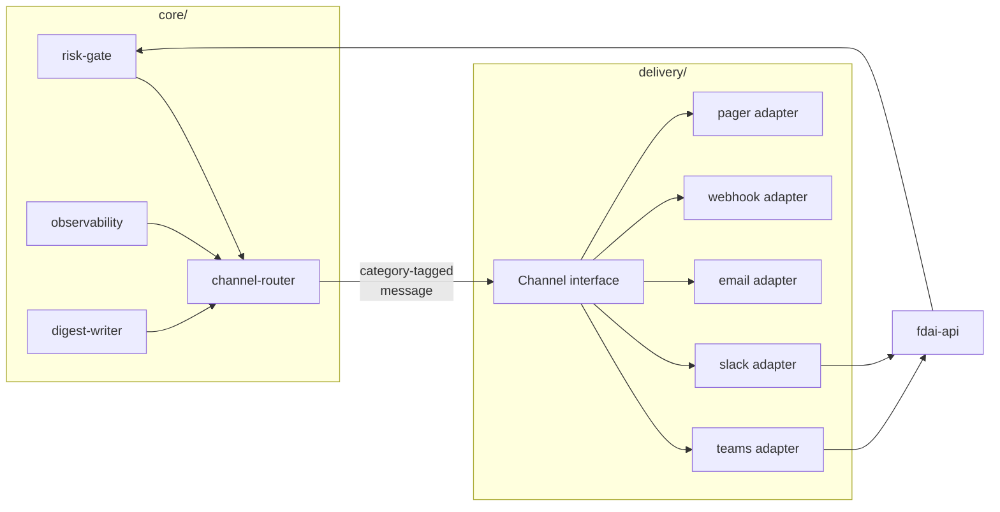

# Channels and Notifications

How FDAI talks to humans through Teams, Slack, email, webhooks, paging services, SMS,
and opt-in browser notifications. This file is authoritative for the **channel abstraction,
trust levels, category boundaries, routing policy, and channel-specific rules**. It
resolves the placeholder "notifier interface" hinted at in
[tech-stack.md](../architecture/tech-stack.md) and consolidates the Alert Routing fragments from
[operating-and-verification.md](../operations/operating-and-verification.md#alert-routing) and the
Teams-specific flows in
[user-rbac-and-identity.md](user-rbac-and-identity.md#7-chatops-hil-flow).

The read-only console's identity and interaction flows remain out of scope; this document owns
only its outbound browser-notification boundary. Console identity lives in
[user-rbac-and-identity.md](user-rbac-and-identity.md).

> **Direction scope.** Outbound notifications, A1 approvals, and bidirectional conversations use
> separate Protocols. This document owns their shared trust/category/routing principles and
> outbound delivery; [operator-console.md](operator-console.md) owns conversation tool and session
> semantics. Adapters can share credentials, but the three contracts keep distinct blast radii.

> Customer-agnostic: every channel id, group name, and endpoint below is a **placeholder**.
> A fork supplies its own tenant, workspace, and endpoint values via config
> ([generic-scope.instructions.md](../../../.github/instructions/generic-scope.instructions.md)).

## 1. Design Principles

1. **Three narrow abstractions, many adapters.** `NotificationChannel` owns A2/A4 push,
  `HilChannel` owns A1 send/poll, and `ConversationChannelAdapter` owns A3 inbound/outbound.
  Core code never names Teams or Slack; new vendor adapters are additive.
2. **Categorize by purpose, not vendor.** A channel supports one or more of four
   categories (§3). Vendors are constrained by which categories they can safely serve.
3. **Trust-tiered.** Approval-category traffic (A1) MUST NOT flow through a channel that
   cannot verify the human's Entra identity end-to-end. A less-trusted channel MAY carry
   information but never decisions (§4).
4. **Choose the safer default when the outcome is uncertain.** If every configured channel for a category fails, the request
   queues and pages the operational lane - it never auto-executes. Fallback within a
   category preserves the trust tier (§6).
5. **Redaction is the sender's job.** No secret, credential, PII, subscription id, or raw
   customer payload leaves the trust boundary in a channel message. This applies to every
   category, not just approvals.

## 2. Where Channels Sit in the Architecture



- Outbound adapters live under `delivery/notifications/`, bidirectional adapters under
  `delivery/channels/`, and A1 approval adapters under `delivery/chatops/`. Their contracts live in
  `shared/providers/notifications/`, `conversation_channel.py`, and `hil_channel.py`, respectively.
- The **channel-router** is a thin core module: it takes a category and a message and
  picks channels per the fork's routing config (§6). It holds no vendor knowledge.
- **Approval callbacks from any adapter land at `fdai-api`**, which re-validates
  the human's Entra identity ([user-rbac-and-identity.md](user-rbac-and-identity.md#102-api-token-validation))
  before acting. Adapters never authorize decisions themselves.

## 3. Categories (A1-A4)

Every channel message carries a **category tag** and must obey that category's rules.

| Category | Direction | Examples | Auth strength needed |
|----------|-----------|----------|----------------------|
| **A1 - HIL approval** | bidirectional (decision returned) | high-risk action approval, enforce-promotion approval, exemption approval, override approval | **highest** - verified Entra identity, action-bound, no replay |
| **A2 - Operational alert** | outbound only | SLO burn, DLQ depth, verifier failure rate, cold-start miss, IaC drift, adapter unhealthy, canary miss | low - informational |
| **A3 - Chat command** | bidirectional (query/response) | **read**: `/aw status`, `/aw shadow-report`, `/aw override list`, `/aw kill-switch status`. **write (draft-PR only)**: `/aw override draft`, `/aw exemption draft`, `/aw assignment param-tune` | medium - role-gated per command (see §3.1) |
| **A4 - Digest** | outbound only | daily shadow-accuracy report, weekly override retrospective, weekly enforce-promotion candidates, weekly governance PR aging, weekly exemption expiry lookahead, monthly KPI + cost roundup, break-glass usage summary | low - recipient scope only |

**Category boundaries (MUST)**

- **A1 approvals never carry the decision payload in the message.** The Adaptive Card /
  Block Kit / email body carries an **opaque `approval_id`**; the actual decision is
  posted back to `fdai-api`, which re-authenticates and re-validates
  (`idempotency_key` + `action_hash`) so a leaked message is not a valid approval.
- **A3 write commands never mutate the live catalog directly** - they produce a draft
  PR the same way the console does (§6 in
  [user-rbac-and-identity.md](user-rbac-and-identity.md#6-identity-flow-console--draft-pr--audit)),
  carrying the invoker's Entra OID in the PR trailer. The PR then follows the standard
  quorum + no-self-approval rules.
- **A2/A4 messages never contain approval buttons or executable links.**

### 3.1 A3 command role gating

Each A3 command declares a **minimum role** and whether it is read or write. The bot
adapter enforces the check via the invoker's Entra OID (Teams SSO / Slack mapping) before
running the handler; a missing role responds with `403` in-channel and writes an audit
entry.

| Command | Type | Min role |
|---------|------|----------|
| `/aw status`, `/aw shadow-report`, `/aw kpi` | read | `Reader` |
| `/aw override list`, `/aw exemption list`, `/aw kill-switch status` | read | `Reader` |
| `/aw override draft`, `/aw exemption draft`, `/aw assignment param-tune` | write → draft PR | `Contributor` |
| `/aw kill-switch on`/`off` | write → draft PR + A1 approval | `Owner` |

## 4. Trust Levels (matrix)

A channel's *allowed categories* are the intersection of what it can technically deliver
and what its authentication can prove.

| Channel | Entra tenant | Auth path | Categories allowed |
|---------|--------------|-----------|--------------------|
| **Teams (same tenant)** | ✓ | Teams SSO → OBO exchange → `fdai-api` token | **A1, A2, A3, A4** |
| **Teams (guest tenant)** | guest | OBO with guest OID | **A2, A3, A4** (A1 denied - same guest rule as [user-rbac-and-identity.md §10.5](user-rbac-and-identity.md#105-guest-entra-b2b-users)) |
| **Slack** | ✗ | Slack OAuth; **fork-mandatory** Slack userId ↔ Entra OID mapping; A1 approvals bounce through `fdai-api` for Entra re-auth in the browser | **A1, A2, A3, A4** - A1 enabled in P1 (see §7 Slack notes) |
| **Email (SMTP / Graph)** | ✗ | send-only, no return channel | **A2, A4 only** - never A1 (magic-link approvals aren't supported) |
| **Generic webhook** | ✗ | HMAC-signed, timestamped, replay-guarded | **A2 only** |
| **PagerDuty / Opsgenie** | ✗ | API key, ack from mobile app | **A2 only** (operational lane paging) |
| **SMS** | ✗ | - | **A2 only** (minimal payload; break-glass reachability) |

**Rules that keep the matrix safe (MUST)**

- **Magic-link approvals aren't supported across every channel.** Approval always requires
  a re-authenticated round-trip through `fdai-api`.
- **A1 fallback stays inside A1-capable channels.** A failed Teams A1 attempt never falls
  through to email; it falls to another A1-capable channel (Teams standby, or Slack when
  mapping is present) or to the HIL queue.
- **Slack A1 requires the userId↔OID mapping.** The adapter refuses to serve A1 traffic
  until the mapping provider returns a non-empty entry for the responding Slack user; a
  missing mapping is treated as "no approver" (fail-closed to HIL queue).

### 4.1 Sender pairing trust bootstrap

`ChannelAccessService` supports `disabled`, `allowlist`, and `pairing` per channel. The durable
PostgreSQL store serializes request creation with a channel-scoped transaction lock, enforces the
pending cap atomically, excludes expired requests from that cap, and conditionally approves the
stored digest. An approved sender cannot re-enroll and overwrite its principal mapping.

`NativePairingChallengeFlow` sends the plaintext challenge only as a same-thread channel reply;
the store and response metadata retain only the SHA-256 digest and expiry. A delivery failure
conditionally deletes the matching pending digest so an undelivered code cannot consume capacity.
Approval still requires a distinct authorized actor and an existing FDAI principal. Pairing grants
identity resolution only; it never grants a role or bypasses the coordinator's tool RBAC.

Cross-channel identity links are explicit relation records above pairing, not identity merges. Both
senders MUST already be independently approved for the same FDAI principal, the link MUST span two
channel kinds, and a distinct authorized actor MUST approve it. If the sender mappings name two
different principals, the service rejects the request before any write. The deterministic link id
makes retries idempotent, and the PostgreSQL record survives restart without modifying either
sender mapping or either principal's role.

Channel attachments are evidence inputs, never instructions. Slack and Teams adapters normalize
only bounded file metadata and an opaque vendor id; payload-supplied download URLs are discarded.
A server-owned, app-credential fetcher resolves that id, and `ProtectedChannelAttachmentIngestor`
verifies the fetched byte count and SHA-256 before sending the source through the existing malware,
protection, extraction, indexing, access, and retention pipeline. The conversation gateway dispatches
the operator's original text unchanged and appends only READY `doc:` refs to response citations.
Held, infected, unknown-protection, oversized, or malformed attachments block tool dispatch. Common
bitmap signatures produce metadata-only envelopes with no text units, so image bytes cannot become
prompt instructions. Deployments bind vendor credential fetchers as part of the P0-15 channel
composition; arbitrary attachment URLs are not a supported seam.

Teams ingress separates two identities. `BotFrameworkJwtAuthenticator` verifies the Bot Framework
service token against cached JWKS with RS256 signature, app audience, Bot Framework issuer,
expiration/not-before, and required `serviceurl`. The route then requires the activity
`serviceUrl` and `channelId=msteams` to match that verified service identity. Only after that check
does `TeamsPrincipalResolver` validate the activity tenant and map `from.aadObjectId` to a bounded,
configured canonical FDAI principal. A service-token failure returns `401`; an unknown tenant or
user binding returns `403`; neither reaches the channel queue. The vendor id is replaced by the
canonical principal before the conversation gateway sees the turn.

Production composition reads `FDAI_TEAMS_BOT_APP_ID`, optional HTTPS issuer/JWKS overrides,
`FDAI_TEAMS_TENANT_ID`, and `FDAI_TEAMS_PRINCIPAL_BINDINGS_JSON`. The binding map is a non-empty
string-to-string JSON object capped at 1000 entries. Missing, malformed, or unbounded configuration
fails at startup. The Bot service token authenticates the channel service; it never substitutes
for the operator's Entra principal or grants an FDAI role.

`ProductionChannelRuntime` is the library runtime intended to own a standalone channel gateway
process. It is not mounted into the read-only console API and never receives the executor identity.
The repository does not yet ship the production ASGI factory or Terraform workload that
instantiates this runtime. When a deployment supplies that separate composition, ASGI startup resolves
Slack signing and bot-token references through the injected `SecretProvider`, builds fixed-endpoint
Slack and workload-identity Teams publishers, registers only the enabled bounded ingress routes,
and starts one `ConversationChannelGateway.run` consumer per adapter. Missing credentials, Teams
identity, endpoint resolver, JWT config, or principal bindings fail startup before a route accepts
traffic. Shutdown closes channel queues, waits for consumers, removes dynamic routes, and closes an
owned HTTP client.

Channel enablement and queue bounds use `FDAI_SLACK_CHANNEL_ENABLED`,
`FDAI_TEAMS_CHANNEL_ENABLED`, `FDAI_SLACK_SIGNING_SECRET_REF`,
`FDAI_SLACK_BOT_TOKEN_REF`, and `FDAI_CHANNEL_QUEUE_CAPACITY`. Secret values remain in the provider;
configuration and errors carry reference names only. `GET /healthz` exposes process liveness and no
channel, principal, or credential data.

### 4.2 Rich thread and delivery behavior

`OutboundResponse` carries vendor-neutral rich delivery and thread intent without giving core code
a Slack or Teams dependency. Existing text replies remain the default; scheduled continuations use
explicit origin or dedicated thread mode and carry an opaque anchor id as metadata. A response can
add bounded mentions and one rich operation; ambiguous or oversized values fail before publishing.

Concrete publishers map that intent as follows:

| Behavior | Slack | Teams | Text fallback |
|----------|-------|-------|---------------|
| Thread reply | `chat.postMessage` with `thread_ts` | Message activity with `replyToId` | Same originating thread |
| Mention | `<@vendor-id>` | `<at>` text plus a Bot Framework mention entity | `@display-name`; the opaque target id is omitted |
| Streaming | Initial `chat.postMessage`, then cumulative `chat.update` | Initial activity `POST`, then cumulative activity `PUT` | One final text reply |
| Edit | `chat.update` for the declared message id | Activity `PUT` for the declared activity id | New thread reply prefixed with `Update:` |
| Reaction | `reactions.add` against the inbound message | `messageReaction` activity against the inbound message | New thread reply with a `Reaction:` label |

The concrete Slack and Teams configurations own capability flags for mentions, streaming, edits,
and reactions. A disabled capability never causes the core to guess a vendor payload; the publisher
uses the documented text fallback instead. Thread context is preserved during every fallback.
Vendor endpoints remain fixed in publisher configuration or the authenticated Teams endpoint
resolver. Response data cannot supply a URL, token, or alternate API method.

Every accepted send returns a `ChannelDeliveryReceipt` with the requested operation, vendor message
id, and whether the request degraded to text. Slack requires an `ok=true` response and message
timestamp for posts. Teams requires the Bot Framework resource id for message creation. Missing or
malformed acknowledgements fail the send rather than reporting delivery. The adapters forward the
receipt to the caller; transport failures still raise and follow the existing retry/audit path.

### 4.3 Durable reply delivery and adapter controls

External conversation replies use the persisted ledger in
[durable-conversation-delivery.md](durable-conversation-delivery.md). Provider HTTP rejection is a
definitive failure eligible for bounded retry. Transport interruption or a missing/malformed
acknowledgement is ambiguous and never retried automatically. Pause/resume mutations live only in
separately authenticated ChatOps command routes; the console receives GET-only reliability metrics.

Authenticated generic webhooks can opt into `TypedWebhookMapping`. The mapping fixes one
allowlisted normalized event type and target agent at configuration time; payload-supplied event,
agent, command, or session values cannot override them. Server-owned dot paths project only
bounded scalar fields. Missing fields, containers, oversized strings, or non-allowlisted targets
fail before publication. A bounded session key is the SHA-256 digest of explicitly selected scalar
values, so raw external identity values do not become session ids. The projected event still
enters event-ingest, trust routing, risk gating, and audit; the webhook never executes an action.

### 4.4 Browser system notifications

The Console can deliver opt-in A2 status notifications through the browser Notifications API and
an origin-scoped service worker. The operator enables the feature from an explicit Console control;
FDAI never requests permission during page load. The authenticated `GET /live/stream` feed stays
connected while an enabled tab is in the background and emits notifications only for human approval,
denial, or failure outcomes. Replay frames and routine successful stages remain silent.

Browser notifications are informational. They contain localized generic text, an opaque bounded
event tag, and a server-derived same-origin link to the read-only Incident view. They never include
raw errors, resource identifiers, approval controls, or execution links. Repeated frames replace the
same event notification, and the opt-in preference is scoped to the signed-in browser principal.
A principal-scoped browser ledger suppresses duplicate event tags for five minutes across tabs and
limits delivery to five system notifications per minute; suppressed events remain in the audit and
Incident views.

The service worker keeps notification rendering and click handling available while the page is
backgrounded, but the current Console does not register a Push API subscription or a server-side
subscription store. A fully closed browser therefore receives no notification. Closed-browser Web
Push requires a separately authenticated write service, encrypted subscription storage, revocation,
CSRF protection, and delivery audit before it can be enabled; it does not belong in the read API.

## 5. Channel Interfaces (contracts)

- **A2/A4:** `NotificationChannel.send(NotificationMessage) -> DeliveryReceipt`.
  `NotificationMessage.category` is a semantic route key; `trust_tier` carries A1-A4.
- **A1:** `HilChannel.send(HilApprovalRequest) -> HilApprovalReceipt` and
  `poll(receipt) -> HilResponse`.
- **A3:** `ConversationChannelAdapter.receive() -> InboundTurn` and
  `send(OutboundResponse) -> ChannelDeliveryReceipt`.

- **Adapters MUST NOT authorize the decision themselves.** `HilChannel.poll` returns
  the raw response; the core router hands it to `fdai-api`,
  which is the sole authority (identity re-verify, replay check, no-self-approval).
- **Adapters MUST re-scan the message body** for known secret patterns (same regex set
  used by the CI secret scanner) before dispatching, as a last-line defense.
- **Adapters MUST implement idempotent `send`**: a re-issued send with the same
  `correlation_id + audit_id + category` MUST NOT create a duplicate post.

### 5.1 Audience Derivation (channel-as-audience)

Recipient lists are **not** derived per-user by the router. Each channel *is* an audience,
and membership is managed **outside** the control plane - typically by binding the channel
to an Entra security group.

- **Default (Option A)**: a Teams channel/DL is created as a **group-connected team**
  backed by an `aw-*` Entra security group. Membership syncs automatically from Entra
  ("Owner adds a person to `aw-approvers` in the Portal" → they immediately see the next
  digest and every A1/A2/A3 post). This keeps administration in one surface
  ([user-rbac-and-identity.md §4.2](user-rbac-and-identity.md#42-security-groups-slots)).
- **In-message `@mentions`** call out artifact-owners inside a channel post (e.g. the
  requester of an expiring exemption). Mentions are derived from artifact metadata
  (`requested_by`, PR author, rule author) already carried in the audit stream - no Graph
  lookup at digest time.
- **Role-derived direct messaging** is used **only** for break-glass usage summary
  (small, time-critical audience where a channel post is not enough). Every other A4
  digest is channel-only.

Allowed audience modes for a digest entry:

| Mode | Meaning | Where allowed |
|------|---------|---------------|
| `channel: <id>` | post to a channel/DL; membership managed via Entra group binding | A2, A3, A4 (default) |
| `mention-artifact-owner` | additive: `@mention` the artifact's owner inside a channel post | A4 (opt-in per digest) |
| `role-dm: <RoleName>` | Graph-lookup members of `aw-<role>`, DM each | A4 **only for break-glass** (deny-listed elsewhere at config load) |

### 5.2 Proactive Stakeholder Briefing (A4 synthesis)

An organization keeps a human who writes the periodic operations summary for
leadership - "here is what happened this window, what we did about it, and
where the risk is." `core/notifications/briefing.py`
(`StakeholderBriefingComposer`) synthesizes that A4 digest **deterministically**
from aggregated operational counts (incident tallies by severity, action
outcomes split auto / HIL / rolled-back / shadow-only, cost run-rate delta and
drivers, forward-looking forecast risks, guard-metric breaches) - not from
per-event noise.

- **Fail-closed, no fabrication.** The composer sources every figure from the
  audit log / KPI telemetry the caller supplies and asserts nothing it was not
  given. A window with no actionable activity renders an explicit "No
  significant operational activity" headline and `has_significant_activity =
  False`, so the caller **suppresses** the send rather than emailing leadership
  to say nothing happened. A sub-1% cost wobble with nothing else is treated as
  noise, not a briefing.
- **Guard breaches escalate.** Guard-metric breaches (the one thing leadership
  must never miss) are surfaced as explicit `escalations` on the result so the
  caller can route them at a higher trust tier, in addition to appearing in the
  briefing body ([goals-and-metrics.md](../architecture/goals-and-metrics.md)).
- **Pure and delivery-agnostic.** The composer holds no vendor knowledge and
  never dispatches; it returns a `StakeholderBriefing` (markdown body plus
  per-section payload) that the caller hands to the router in §6 for A4
  delivery through the audience modes above. Same input, same briefing.

## 6. Routing Policy (config-driven)

Routing is declarative config, evaluated by the channel-router. Adding, replacing, or
reordering channels is a config change, never a code change.

**Config location**: outbound routing lives in
[`config/notifications-matrix.yaml`](../../../config/notifications-matrix.yaml). Routing changes
receive governance review, with Owner-tier review for A1 routes. Conversation channel enablement
uses its separate environment/configuration contract.

```yaml
matrix:
  version: 1
  default_route: hil_approval
  routes:
    hil_approval:
      trust_tier: a1_hil_approval
      primary: teams-hil-prd
      fallback: [teams-hil-standby, slack-hil-prd]
      on_all_fail: hil_escalate
    operational_alert:
      trust_tier: a2_operational_alert
      primary: teams-ops-prd
      fallback: [pagerduty-primary, email-oncall]
      on_all_fail: hil_escalate
    digest_shadow_accuracy_daily:
      trust_tier: a4_digest
      primary: teams-hil-prd
      fallback: [email-governance]
      on_all_fail: hil_escalate
```

**Router rules (MUST)**

- **Category ⊆ channel.categories** - the router refuses to send a message to a channel
  whose declared categories do not include the message's category. Startup config
  validation rejects a routing entry that pairs a channel with a disallowed category
  (deny-by-default; fail fast).
- **Trust preservation on fallback** - A1 primary → A1 fallback only. Downgrading to a
  lower trust level on fallback is a config-load error.
- **Incident delivery readiness** - A non-local control-plane runtime fails startup when the
  `operational_alert` route has no registered channel that supports its A2 trust tier. The explicit
  local Azure CLI profile may start without an external adapter, but it emits a structured
  `notification_route_unavailable` warning and keeps fail-closed HIL escalation.
- **`role-dm` is deny-listed except for `break_glass_usage_summary`.** Any other digest
  attempting `role-dm` fails at config load.
- **Digests declaring `mention-artifact-owner` MUST specify a valid metadata field**
  (`rule_author`, `override_requester`, `exemption_requester`, `pr_author_and_reviewers`);
  unknown values fail at config load.
- **Bounded retries** - each adapter declares its own retry budget; router escalates to
  the next channel or to `on_all_fail` on exhaustion.
- **TTL fail-closed** - an A1 request with no decision by TTL is a no-op + A2 alert +
  audit entry ([security-and-identity.md](../architecture/security-and-identity.md#hil-approval-integrity)).

## 7. Channel-Specific Notes

| Channel | Notes |
|---------|-------|
| **Teams** | Adaptive Cards for A1; keep the OAuth scope set minimal (`ChannelMessage.Send.Group` + bot signaling). SSO + OBO already covered in [user-rbac-and-identity.md §10.4](user-rbac-and-identity.md#104-chatops-teams-sign-in). Digest audience is a **group-connected team backed by an `aw-*` Entra security group** so membership follows Entra without a separate list. |
| **Slack** | Block Kit for A2/A3; the approval callback URL redirects through `fdai-api` so Entra re-auth happens in the browser, not inside Slack. `chat:write` scope only. Fork MUST supply the userId↔OID mapping store; the adapter refuses A1 traffic when a Slack user has no mapped Entra OID. Slack channel membership is administered in Slack; keep it in sync with the corresponding `aw-*` group manually or via SCIM. |
| **Email** | Send-only through Azure Communication Services Email. Never include an approval link; digest and alert only. Terraform provisions an Azure-managed sender domain and a dedicated notification managed identity scoped to the Communication Services resource. The adapter requests a short-lived `https://communication.azure.com/.default` token, waits for the provider operation to reach `Succeeded`, and records the provider message id. Redaction is mandatory - no correlation payload beyond `audit_id` and dashboard URL. Recommended recipient: an **Entra dynamic distribution group** mirroring `aw-approvers` / `aw-owners`. |
| **Generic webhook** | HMAC-SHA256 signature, monotonic timestamp, single-use nonce. Receiver failures never block; core retries per adapter policy and moves on. |
| **PagerDuty / Opsgenie** | Deduplication key = the observability correlation id so a burst collapses. Runbook URL is required in every alert. |
| **SMS** | Payload restricted to `<severity> <audit_id> <short-url-to-runbook>`. No secrets, no customer names, no free-form text. Break-glass reachability primarily. |

## 8. Fallback and Kill-Switch Interaction

- The **global kill-switch** halts every A1 dispatch immediately and re-queues open A1
  requests; kill-switch state itself is announced via A2 on every operational channel.
- If **all A2 channels are down**, adapter health telemetry still lands in observability
  and appears in the console; the kill-switch remains operable through its dedicated
  break-glass path ([security-and-identity.md](../architecture/security-and-identity.md#rate-limiting-and-kill-switch-dos-and-containment)).
- Adapter unhealth is itself an A2 signal - a Teams outage that stops A1 delivery pages
  the operational lane through the fallback channel.

## 9. Fork vs Upstream Split

| Item | Upstream (this repo) | Fork |
|------|----------------------|------|
| Three provider contracts plus their message/receipt types | ✓ | - |
| Teams adapter (default A1 + A2 + A3 + A4 impl) | ✓ | tenant / group-connected team binding |
| **Slack adapter with A1 enabled by default (P1)** | ✓ | workspace credentials + userId↔OID mapping (required) |
| ACS Email adapter | ✓ (A2/A4, managed identity, final-status polling) | recipient binding + enablement |
| Webhook / PagerDuty / SMS adapters | ✓ (concrete delivery adapters) | credentials + enablement |
| Routing-config schema + startup validation | ✓ | deployment-specific bindings/overlays |
| HIL escalation sink (`on_all_fail` fail-safe queue) | ✓ (`StateStoreHilEscalationSink` - StateStore-backed, tenant-agnostic) | own queue backend (optional) |
| Seven default digests + audience derivation rules | ✓ | cron timezone, channel ids, on/off per digest |
| Secret-scan regex set (reused by adapters) | ✓ | extend patterns if needed |
| Slack userId ↔ Entra OID mapping **interface** | ✓ | mapping data (mandatory for P1 A1) |
| Digest content templates | ✓ (generic) | branding / localization |

## 10. Open Decisions

- [ ] Adapter-health alert thresholds and dedupe windows.
- [x] Incoming webhook scope - only authenticated `TypedWebhookMapping` can publish an allowlisted
  event/agent target; payloads cannot select commands, targets, or sessions.
- [ ] The `mention-artifact-owner` behavior when the artifact owner is a **guest** user
      (mention still resolves in Teams, but should the digest suppress or route
      differently to reduce information leakage?).
- [ ] `kpi_and_cost_monthly` GitHub-Issue archive: destination repo/path (defaults to the
      catalog-as-code repo, `docs/kpi-archive/`).

## 11. Localization (L2)

Notifications are an **L2 product surface** (see
[language.instructions.md](../../../.github/instructions/language.instructions.md)):
the source strings are English, and a channel MAY render them in another locale.

- **How it renders (Option C).** `core` never bakes a final localized string.
  Every `NotificationMessage` carries a `template_key` plus typed `params`; the
  router renders `title` / `body_markdown` from the catalog
  (`src/fdai/core/notifications/messages.{en,ko}.json`) in the destination
  channel's locale, just before `send`. Adapters are untouched - they still
  consume `title` / `body_markdown`.
- **Only labels localize.** The L0 values (decision word, rule ids, resource
  type, mode) are substituted verbatim in every language, so the machine-readable
  data is identical. The **audit entry always uses the English message**, so
  replay and correlation stay language-neutral.
- **Mandatory English fallback.** A missing locale key or field renders the
  English source; a missing English key renders the key itself (never a blank).
- **Locale is a channel property.** Notifications fan out, so the locale is set
  per channel in `config/notifications-matrix.yaml` under `matrix.channels`
  (`<channel-id>: { locale: ko }`), not per operator. A channel without an entry
  renders in English.
