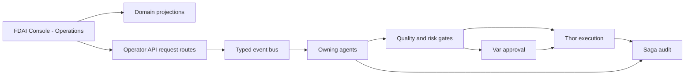

# 콘솔 운영

이 문서는 기존 FDAI Console이 운영 업무를 표시하고 범위가 제한된 운영 요청을 접수하는 방법을
정의합니다. 별도 애플리케이션, 범용 작업 항목 모델 또는 두 번째 실행 authority를 추가하지
않습니다.

> **제품 경계:** 제품명은 `FDAI Console`로 유지합니다. `Operations` / `운영`은 제품 안에 이미
> 존재하는 탐색 그룹입니다. 콘솔은 Thor의 executor identity를 받거나 관리 리소스를 직접
> 변경하지 않습니다.
>
> **구현 상태:** Operations 탐색, incident, approval, process, scheduler run, provisioning,
> onboarding, bounded investigation은 별도 도메인 view로 제공됩니다. Console action dispatch는
> broker publish 전에 payload를 포함한 receipt를 저장하고 restart 뒤 pending delivery를 복구합니다.
> Federated Tasks view, cross-domain projection metadata, 나머지 domain route hardening은 제안 상태입니다.

## 설계 요약

Operations 영역은 기존 도메인 projection을 읽고, 각 스키마와 lifecycle을 이미 소유한 도메인
경로로 요청을 제출합니다. 담당 에이전트는 typed event를 통해 요청을 판단하고, 승인하고,
실행하고, 복구하고, 감사합니다.

## 아키텍처 결정

콘솔 운영은 네 가지 경계를 사용합니다.

| 경계 | 책임 | Authority |
|------|------|-----------|
| 콘솔 presentation | Operations 탐색, Tasks, Approvals, Investigations, evidence, timeline | 서버 소유 상태와 사용할 수 있는 운영 기능을 렌더링합니다. |
| 도메인 projection | Authoritative `Approval`, `Process`, `ReviewCase`, `AccessGrantRequest`, action record 조회 | 각 source lifecycle을 읽기만 합니다. |
| Operator API 도메인 요청 route | 인증, 인가, source revision과 도메인 스키마 검증, 중복 제거, publish | 요청을 접수하며 판단하거나 실행하지 않습니다. |
| 에이전트 runtime | Typed pub/sub으로 판단, 승인, 실행, 복구, 감사 | 기존 pantheon ownership이 authority를 유지합니다. |

Operator API는 mechanical relay로 유지합니다. FDAI Console과 operator client가 공유하는
비특권 HTTP backend이며 Thor의 executor identity를 받지 않습니다. Orchestrator, 숨은 에이전트 또는
범용 workflow engine이 되지 않으며 에이전트는 서로 직접 호출하지 않습니다.

## 제품 용어

하나의 제품명과 이해하기 쉬운 운영 label을 사용합니다.

| 범위 | 용어 |
|------|------|
| 제품 | `FDAI Console` |
| 공유 HTTP backend | `Operator API` |
| 기존 탐색 그룹 | `Operations` / `운영` |
| 사용자에게 보이는 동작 | Operational request / 운영 요청 |
| Operations view | Tasks, Approvals, Investigations |
| ActionType 요청 출처 | `trigger_kind: operator_request` |

이 surface의 이름으로 `Operator Workbench`, 두 번째 `Operator Console`, `Command Center`,
`Orchestration`을 사용하지 않습니다. Python task workbench처럼 특정 도구를 나타내는 이름은 유지할
수 있습니다.

## 기존 온톨로지와 스키마

### 도메인 record

Operations는 기존 object와 link를 재사용합니다.

| 운영 관심사 | Authoritative object와 link | 콘솔 동작 |
|-------------|-----------------------------|-----------|
| Governed review | `Process -> runs_review -> ReviewCase -> resolved_by -> Decision` | Review 상태, 이전 decision, evidence, 다음 책임 owner를 보여줍니다. |
| 사람 승인 | `ReviewCase -> has_approval -> Approval`과 action-bound approval | Quorum, 자기 승인 방지 상태, deadline, evidence를 보여줍니다. |
| Workflow run | `WorkflowDefinition`, `WorkflowBinding`, `Process` | Immutable definition, current step, revision, target, compensation 상태를 보여줍니다. |
| Access 변경 | `AccessGrantRequest` | 적격한 pending request를 stream하고 access를 적용하지 않은 채 immutable authorization lifecycle을 보여줍니다. |
| Execution follow-up | `ActionRun`, rollback, audit reference | Execute-again 바로 가기 없이 결과와 recovery 상태를 보여줍니다. |
| 담당자 인수인계 | Operational-readiness `Process`, `ReviewCase`, `Approval`, `Decision` | 기존 handover workflow를 재사용하며 Saga는 auditor로 유지됩니다. |

Generic `WorkItem`, `OperationRequest`, 중복 `Approval`, 범용 mutable status table 또는 새 approval
topic을 추가하지 않습니다. 각 source가 자체 schema, revision, lifecycle, owner를 유지합니다.

Browser에 표시할 pending access request가 있으면 인증된 GET-only stream이 principal의 App Role로
durable record를 filter합니다. Tab과 Command Deck이 idle 상태이면 console은 capability, scope 및
expiry가 포함된 request-scoped conversation을 엽니다. 진행 중인 작업, 전송하지 않은 draft 또는 hidden
tab이 있으면 conversation을 바꾸지 않고 visible badge를 유지합니다. Conversation은 context만
제공하며 approval, protected deployment, fresh access verification 및 revocation은 authorization
workflow에 남습니다.

### Operations task view

Tasks view는 presentation-level federation이며 ontology object나 system of record가 아닙니다. Source별
projection을 status, owner agent, assignee, deadline, priority, scope로 묶을 수 있습니다. 각 항목은 exact
source reference, source revision, evidence reference, freshness, redaction state를 유지합니다.

API response는 기존 도메인 projection의 discriminated union으로 구현합니다. Projection cache는 다시
만들 수 있는 output을 저장할 수 있지만 cache 손실로 작업을 잃거나 source lifecycle이 바뀌면 안
됩니다. 브라우저는 누락된 상태나 authorization을 추론하지 않습니다.

Closed discriminator는 `source_family`이며 초기 값은 `approval`, `process`, `review_case`,
`access_request`입니다. 각 arm은 domain field 앞에 `source_id`, `source_revision`, exact `type_ref`
(`name`, `version`, `catalog_digest`), `ontology_release_digest`, `as_of`, source watermark를 포함합니다.
Family 추가는 paired design과 decoder 변경이 필요하며 shared mutation schema를 만들지 않습니다.

Phase 1은 `rule-catalog/schema/console-operations-projection.schema.json`을 각 arm, unavailable receipt,
freshness ceiling의 versioned machine source로 추가합니다. Muninn이 책임지고 FDAI maintainer가 schema
변경을 review하며 server와 generated client digest는 CI에서 일치해야 합니다.

해당 schema는 family별 bounded `freshness_ceiling_seconds`, hard item limit, maximum link-traversal depth,
stable primary-key ordering, allowed truncation reason을 선언합니다. Ceiling이나 limit이 없거나
unbounded이면 materialization을 차단합니다. Pagination은 snapshot cutoff, ordering, source watermark를
바꾸지 않습니다.

각 source agent는 authoritative record의 single writer로 유지됩니다. Muninn은 rebuildable cross-domain
context index와 그 cutoff, freshness, digest, rebuild evidence를 책임집니다. Operator API
materializer는 source-owned state와 Muninn index를 읽는 mechanical relay이며 source object를
publish하거나 lifecycle을 진행하지 않습니다.

Server cache는 materializer 뒤의 optional provider이며 complete canonical digest input으로 key를 만들고
immutable projection byte를 저장합니다. Miss나 eviction은 authoritative source를 다시 읽습니다. TTL은
freshness를 결정하지 않고 cached byte는 request를 authorize하지 않습니다. Provider가 없는 deployment는
같은 limit과 digest contract로 request마다 materialize합니다.

### Ontology query 전략

명시적인 `as_of` cutoff에서 source family별 bounded `ObjectSet` definition을 materialize한 뒤 선언된
link만 join합니다. Ontology release digest, source watermark, cutoff, truncation reason, redaction summary,
freshness state를 보존합니다. 브라우저에 free-form graph query를 노출하지 않습니다.

Source family가 unavailable, unauthorized, timeout 상태이거나 freshness ceiling을 넘으면 source,
reason, last successful watermark, retry guidance를 포함한 explicit unavailable receipt를 반환합니다.
Stale cache를 current 상태로 대체하거나 누락된 object를 추론하지 않습니다. 다른 source family는 계속
표시할 수 있지만 unavailable source에 의존하는 요청은 authoritative state를 다시 읽을 때까지 server
side에서 비활성화합니다.

각 route-inventory row는 closed `required_source_families` set을 선언합니다. Server는 모든 required
family가 request cutoff에서 `available`이고 exact revision을 다시 읽을 수 있을 때만 operation을
활성화합니다. 선언되지 않은 dependency는 available을 default하지 않고 inventory gate에서 실패합니다.

각 union arm은 `availability: available | unavailable`을 포함합니다. Unavailable arm은 `source_family`와
exact ref를 유지하고 domain data를 생략하며 `reason: unauthorized | timeout | source_unavailable |
freshness_exceeded`, nullable `last_successful_watermark`, nullable bounded `retry_after_seconds`를 추가합니다.
Unknown reason은 empty source가 되지 않고 decoding에 실패합니다.

## 운영 요청

### 도메인 요청 스키마 재사용

범용 요청 스키마는 없습니다. 각 운영 기능은 해당 도메인이 소유한 스키마와 route를 사용합니다.

| 사용자 작업 | 기존 도메인 경로 |
|-------------|------------------|
| Approval 결정 | Approval decision schema와 Var 소유 approval lifecycle |
| Investigation 시작 | 기존 investigation request schema와 typed ingress path |
| Catalog 또는 workflow draft 생성 | 기존 draft schema와 GitHub App delivery path |
| Access 요청 | `AccessGrantRequest` schema와 authorization workflow |
| Process 진행 | 참조된 `WorkflowDefinition`과 현재 `Process` revision이 정의한 transition |
| ActionType 요청 | `trigger_kind: operator_request` 또는 `both`인 기존 action argument schema |

`operator_request`는 ActionType 요청을 누가 시작했는지 나타냅니다. 제품명, API umbrella 또는 domain
schema의 대체물이 아닙니다.

ActionType 경로에서 `ActionType.trigger_kind.kind`는 해당 action이 `operator_request` 또는 `both`를
허용하는지 선언하며 event field가 아닙니다. Runtime ingress record는 대신 `event_type:
operator_request`와 strict boolean `operator_initiated: true`를 포함합니다. Event ingest는 이 flat
field를 검증한 뒤 control loop와 action builder가 소비하는 canonical nested
`payload.operator_request`를 만듭니다. Extension은 이 normalizer를 통해 publish하며 nested trusted
shape를 직접 쓰지 않습니다. 다른 domain request는 자체 event contract를 유지합니다.

Untrusted flat ingress는 `initiator_principal`, `action_type`, `params`, `resource_ref`, `correlation_id`,
`idempotency_key`도 포함하며 unknown field를 차단합니다. Request route가 이 flat record를 만들고
`fdai.core.event_ingest`만 이를 검증하고 normalize한 뒤 Huginn이 owned `Event`를 republish합니다. External
boundary는 nested shape를 수락하지 않습니다.

### 요청 검사

각 도메인 route는 source에 맞는 검사를 반복합니다.

1. Entra token, audience, App Role, 필수 capability를 확인합니다.
2. Authoritative source를 읽고 revision, deadline, 관련 policy digest를 비교합니다.
3. 도메인 스키마를 검증하고 알 수 없는 field를 차단합니다.
4. Route는 scope, purpose, no-self-approval, quorum eligibility를 precheck합니다. Final enforcement는
  `Approval`의 Var, `ReviewCase`/`Decision`의 Forseti, `Process`의 current step owner,
  grant review의 `AccessGrantRequestService`가 담당하며 requester는 quorum을 충족하지 못합니다.
5. Actor, correlation id, idempotency key, audit 또는 outbox receipt를 원자적으로 기록합니다.
6. 요청 접수, conflict, denial 또는 expiry를 반환하며 요청 시점에 실행을 주장하지 않습니다.
7. Owning agent가 처리할 typed event를 publish합니다.

Acceptance는 항상 아래의 typed outbox receipt를 만듭니다. Refusal, expired request, idempotency
collision 또는 precondition conflict는 stable reason, actor, source ref, intent digest, correlation id를
포함한 Saga `AuditEntry`를 만들지만 outbox row는 만들지 않습니다. Terminal agent outcome은 같은
correlation과 idempotency key로 두 record 중 하나에 연결됩니다.

### 대화형 action evidence

Action lifecycle 질문은 read-only로 유지됩니다. Request는 correlation id와 exact action, approval 또는
idempotency selector 하나를 포함하는 `conversation_context.kind: action`을 전달할 수 있습니다. Server는
제공된 모든 selector를 audit ledger에서 다시 확인하고 pending approval store는 canonical identity를
도출하는 데만 사용합니다. Reader-facing answer는 audit-backed proposal, safety, approval state,
execution, effect verification 및 duplicate receipt를 렌더링하며 pending approval detail을 노출하거나
변경을 실행하지 않습니다. Receipt claim은 terminal row에 동일한 action id와 idempotency key가 있어야
합니다. Missing, conflicting, truncated 또는 audit-free context는 unverified로 유지됩니다.

HIL callback은 coordinator 또는 registry path가 decision을 기록하기 전에 `approve-runtime-hil`을
부여하는 signed role set을 요구합니다. Missing role은 권한을 부여하지 않습니다. Pending lookup은 exact
approval id를 사용하고 decision 기록은 bounded queue scan 대신 exact idempotency-key park를 사용합니다.
No-self-approval 및 separation-of-duty 검사는 계속 authoritative합니다.

Human operation의 `actor`와 `initiator_principal`은 해당 request Entra token에서 검증한 operator OID입니다.
Console service principal, relay identity 또는 Thor workload identity가 사람을 대신할 수 없습니다.
Machine-initiated request는 operator를 impersonate하지 않고 별도 domain route와 workload principal
contract를 사용합니다.

Retry는 같은 idempotency key를 사용합니다. Concurrent transition은 최신 source revision을 반환합니다.
어떤 route도 agent implementation을 import하거나 Thor를 직접 호출하거나 다른 owner의 state를 수정하지
않습니다.

Conflict response는 `kind` (`idempotency_collision`, `stale_revision`, `competing_decision`,
`prior_deny`, `expired`), `retriable`, current source reference와 revision, 존재하는 경우 winning receipt,
next allowed transition을 포함한 stable problem detail을 사용합니다. 브라우저는 HTTP status만으로 retry
guidance를 만들지 않습니다.

### 전달 내구성

현재 console action route는 broker publish 전에 idempotency key를 atomically claim하고 전체 proposal,
intent digest, actor, correlation, audit receipt를 저장합니다. Delivery는 bounded lease, publish timeout,
retry delay, batch size를 사용합니다. Startup 및 periodic recovery는 pending record와 lease가 만료된 record를
재개합니다. 실패한 periodic cycle은 기록 후 재시도하며 shutdown은 진행 중인 recovery를 취소하고 lease를
회수 가능한 상태로 둡니다. Downstream consumer는 stable idempotency key로 at-least-once event를 deduplicate합니다.

Request acceptance는 durable record가 commit된 뒤에만 HTTP `202 Accepted`를 사용합니다. 현재 receipt는
`request_id`, `correlation_id`, `dispatch_status`, `accepted_at`, `durably_queued`를 반환하며 "approved"나
"executed"가 아닌 "durably queued"를 뜻합니다. 같은 intent replay는 completed event를 다시 publish하지
않고 기존 record를 재사용합니다. 같은 key의 다른 intent는 `409 Conflict`와 함께 winning request,
correlation, acceptance time을 반환합니다. Status URL과 나머지 공통 receipt field는 Phase 2 범위입니다.

확인된 incident creation은 incident를 쓰기 전에 ticket dispatch를 blocked durable state로 준비합니다.
`incident.open`이 durable audit에 나타난 뒤에만 dispatch를 activate합니다. Recovery는 incident를 다시
만들지 않고 누락된 ticket effect를 activate합니다. Durable incident가 없는 blocked ticket은 configurable
retention period, 기본 24시간 뒤 audit 가능한 abandoned 상태가 되며 publish되지 않습니다.

Intent digest는 principal, domain operation, exact source reference와 revision, normalized argument,
해당 policy 또는 schema version을 포함합니다. 다른 digest로 같은 idempotency key를 재사용하면 `409
Conflict`를 반환하고 audit finding을 기록하며 event를 publish하지 않습니다. Key는 authenticated
operator namespace를 사용하고 intent digest로 비교합니다. 긴 operator/client namespace는 자르지 않고
전체 SHA-256을 사용합니다. 관련 없는 principal은 다른 receipt를 보거나 충돌시키지 못합니다.

Policy digest는 request 판단에 실제 사용된 exact risk, approval, promotion, exemption 또는 override,
scope, schema reference를 canonical order로 포함하며 사용하지 않은 policy는 제외합니다.

Prior-deny 또는 re-request policy lookup은 claim에 binding할 authoritative revision을 반환합니다. Request를
commit하는 transaction이나 compare-and-set은 해당 revision을 다시 확인하며 새 deny 또는 policy change가
있으면 conflict를 반환하고 outbox row를 쓰지 않습니다. Preflight read만으로 publish를 authorize하지
않습니다.

이 claim은 source revision, current decision 또는 lifecycle state, deadline, policy digest, schema version,
해당 approval revision을 하나의 precondition snapshot으로 binding합니다. 모든 값이 같고 deadline이 열린
경우에만 commit하며 그렇지 않으면 typed conflict를 반환하고 audit acceptance나 outbox write를 수행하지
않습니다.

## 에이전트와 실행 authority

콘솔에는 판단 또는 managed-resource 실행 authority가 없습니다. Pantheon은 고정 책임을 유지합니다.

| 작업 | 책임 에이전트 |
|------|---------------|
| 새 operator signal 정규화와 correlation | Huginn |
| Review 또는 proposed action 판단 | Forseti |
| Eligible human approval 기록 | Var |
| 승격된 managed-resource action 실행 | Thor |
| 실패한 action recovery 또는 rollback | Vidar |
| Terminal evidence 추가 | Saga |
| Source record에서 replay 가능한 context 구성 | Muninn |
| Operator locale로 결과 설명 | Bragi |
| Audited outcome에서 off-path 학습 | Norns와 Mimir |

Thor는 eligible `direct_api`, `pr_native`, `tool_call` 실행 경로에서 privileged workload identity를 사용할
수 있습니다. 이 실행도 ActionType 등록과 승격, quality와 risk 검사, approval policy 충족, resource lock,
dry-run, impact limit와 stop condition, idempotency, rollback과 audit evidence가 필요합니다. 로그인한 사람의
identity는 Thor에 위임되지 않습니다.

이 safety value는 exact `ActionType`, immutable `MutationPlan`, unified execution model에서 가져옵니다.
Console schema는 resolved value를 표시할 수 있지만 이를 제공하거나 완화하거나 override할 수 없습니다.
Exact reference, plan digest, stop condition, impact limit, lock scope 또는 rollback contract가 없으면 request는
execution 대상이 아닙니다.

## 콘솔 구조

현재 `Operations` 탐색 그룹을 하나의 제품 surface로 유지합니다. 별도 shell을 만들지 않고 다음 view를
추가하거나 개선합니다.

- **Tasks:** Source별 projection을 묶은 attention list입니다.
- **Approvals:** Quorum, deadline, evidence, decision control을 포함한 기존 approval queue입니다.
- **Investigations:** 기존 bounded read-investigation 요청과 결과입니다.
- **Operational detail:** Source timeline, evidence, owner agent, freshness, 사용할 수 있는 도메인 운영
  기능을 보여줍니다.

서버 상태가 사용할 수 있는 운영 기능을 결정합니다. 브라우저는 사용성을 위해 사용할 수 없는 control을
숨길 수 있지만 모든 제출은 authorization과 revision check를 반복합니다. SSE는 영향받은 source
reference를 invalidate하고 client가 authoritative state를 다시 읽게 할 수 있습니다.

SSE invalidation frame은 `event_id`, `source_family`, opaque `source_id`, `source_revision`, `as_of`를
포함하며 record, operation, identity detail은 포함하지 않습니다. Server는 token expiry 전까지 stream을
닫습니다. Client는 새 token을 얻고 Authorization header와 last event id로 reconnect합니다. Reconnect는
모든 authorization check를 반복하며 gap이 있으면 authoritative refetch를 수행합니다. SSE는 refresh
hint일 뿐 요청을 authorize하지 않습니다.

Issuer와 tenant check는 deployment에 설정된 Entra tenant issuer와 API audience를 exact하게 검증한다는
뜻입니다. Guest도 해당 home tenant가 발급한 token을 제시해야 합니다. Common, organizations,
foreign-tenant, issuer-mismatched token은 role resolution 전에 fail closed하며 request나 stream state를
tenant boundary 사이에서 공유하지 않습니다.

Phase 2 multi-effect request는 partial success를 하나의 `submitted` 결과로 합치지 않습니다. 각 effect는
하나의 parent correlation 아래에서 `effect_id`, `kind`, `required`, `status: pending | accepted | succeeded |
failed`, nullable receipt와 reason, retry count를 선언합니다. 모든 required effect가 terminal일 때만
parent가 terminal이며 required failure가 하나라도 있으면 `degraded`입니다. Incident creation과 ticket
proposal은 현재 collapsed flag에서 이 shape로 migrate하고 durable reconciliation은 incident를 다시 만들지
않고 누락된 effect만 재개합니다.

Bulk request는 도메인 workflow가 atomicity 또는 bounded partial failure, impact limit, rollback 동작을
정의한 뒤에 도입합니다.

## 제공 계획

### Phase 0 - 기존 경로 inventory

현재 console write route별 source schema, owner, capability, revision, idempotency rule, receipt, identity
dependency를 catalog합니다. Query, simulation, approval, operational request, execution, break-glass로
분류합니다. 첫 shipped route부터 browser-Entra local과 deployed는 같은 schema, authorization, source
binding을 사용하고 fixture principal은 pytest 전용으로 유지합니다.

Exit criteria: 제공되는 모든 요청에 domain schema, owner, capability, idempotency rule, audit path가 하나씩
있습니다. Machine-readable route inventory는 method와 path, classification, schema, source owner,
capability, revision rule, idempotency scope, receipt, audit event, owning test를 기록합니다. Console
route가 누락되거나 중복되거나 execution으로 분류되면 diff gate가 실패합니다. Managed-resource direct
execution은 지원되는 console classification이 아닙니다.

### Phase 1 - Operations projection 구성

`ReviewCase`, `Approval`, `Process`, `AccessGrantRequest`를 source별 task view로 projection합니다. Exact
reference, evidence, freshness, cursor pagination, unavailable state, redaction test를 추가하고 첫 projection부터 materialization age와 source-watermark lag를 emit합니다.

Exit criteria: 같은 cutoff에서 projection을 다시 만들면 같은 view가 생성되고 어떤 source lifecycle도
projection에 의존하지 않습니다. 각 materialization은 ordered redacted output, ontology release,
`as_of` cutoff, source watermark, applied limit, truncation reason을 포함하는 canonical digest 하나를
기록합니다. Cache-loss drill은 rebuildable projection state만 삭제하고 같은 input이 같은 digest를
재현하며 watermark가 바뀌면 새 snapshot이 생성됨을 증명합니다.

### Phase 2 - 도메인 요청 hardening

도메인 스키마를 대체하지 않고 revision check, idempotency, receipt, outbox 동작을 표준화합니다. Stale
state, duplicate submission, self-approval, expiry, role change, process restart를 테스트합니다. Fixture
principal 없이 browser-Entra local과 deployed composition에서 같은 route inventory와 authorization
matrix를 실행하고 두 venue의 모든 request 및 delivery outcome을 count합니다.

Console action durability slice는 제공됩니다. Phase 2는 같은 contract를 나머지 domain route로 확장하고
incident response의 collapsed ticket flag를 typed effect로 대체합니다.

Exit criteria: SPA에는 authorization decision이 없고 accepted request가 source owner를 우회하지 않습니다.
Publish 전, publish 후, response 전 failure injection으로 committed request가 유실되지 않고 event가 두 번
적용되지 않음을 증명합니다.

Authorization-boundary matrix는 각 inventory row에 대해 해당되는 unauthenticated, unassigned, Reader,
Contributor, Approver, Owner, BreakGlass principal을 다룹니다. Self-approval, insufficient quorum, stale
revision, expired deadline, wrong scope, changed role, revoked entitlement도 검증합니다. Matrix row가 없는
request route를 추가하면 변경이 차단됩니다.

### Phase 3 - Operations view 완성

기존 shell에 Tasks, Approvals, Investigations, timeline, evidence, source별 recovery를 추가합니다. Stale
revision은 authoritative state를 다시 읽고, competing decision은 winner를 연결하며, expiry나 denial은
다음 허용 transition을 설명합니다. Intent가 바뀐 경우에만 새 key를 사용합니다.

Tasks, filter, detail, recovery는 keyboard로 모두 조작할 수 있습니다. Status와 authority는 color에만
의존하지 않고 source, deadline, unavailable reason에 accessible name이 있습니다. SSE refresh는 focus를
옮기지 않고 하나의 polite status announcement를 사용하며 submit conflict는 actionable summary에 focus한
뒤 dismiss하면 originating control로 focus를 돌려보냅니다.

Exit criteria: 오퍼레이터가 FDAI Console에서 지원되는 사람 단계를 완료할 수 있으며 모든
managed-resource mutation은 이후 Thor `ActionRun`으로만 나타납니다. Conflict, retry, compensation,
rollback drill은 원래 receipt를 보존하고 모든 superseding outcome을 연결합니다.

### Phase 4 - 측정 기반 최적화

측정된 수요와 도메인 safety contract가 생긴 뒤에만 cross-device saved view 또는 bulk request를
추가합니다. Queue age, decision latency, conflict rate, duplicate suppression, overdue work, projection
freshness, request-to-terminal-outcome latency를 측정하고 baseline에서 alert를 설정합니다.

Exit criteria: source별 reviewed baseline window와 minimum sample floor를 고정하고 모든 metric은 bounded
label을 사용하며 alert fire/recovery를 연습합니다. Optimization은 같은 scenario set에서 먼저 shadow로
실행하고 target metric이 개선되면서 denial escape, duplicate application, rollback,
unavailable-source rate가 악화되지 않을 때만 진행합니다.

## 채택하지 않은 대안

- **별도 operations app:** FDAI Console을 중복하고 두 번째 제품처럼 보입니다.
- **Authoritative generic `WorkItem`:** Domain lifecycle을 중복하고 두 번째 owner를 만듭니다.
- **Generic `OperationRequest`:** Domain validation과 ownership 차이를 지웁니다.
- **Console orchestration:** Event choreography를 중앙 console control로 잘못 표현합니다.
- **Browser-derived authority:** Stale presentation state를 authorization source로 만듭니다.
- **Executor credential을 가진 console 또는 request route:** Request와 execution identity를 합칩니다.
- **Direct graph mutation:** ActionType, risk, approval, rollback, audit gate를 우회합니다.

## 관련 문서

| 알아볼 내용 | 문서 |
|-------------|------|
| 대화형 번역과 channel tool | [오퍼레이터 콘솔](operator-console-ko.md) |
| 사람 role과 operation capability | [사용자 RBAC와 Entra 아이덴티티](user-rbac-and-identity-ko.md) |
| Exact ontology release와 object set | [운영 온톨로지 플랫폼](../architecture/operating-ontology-platform-ko.md) |
| ActionType safety와 execution ceiling | [Action Ontology](../decisioning/action-ontology-ko.md)와 [Execution Model](../decisioning/execution-model-ko.md) |
| 고정 pantheon ownership | [에이전트 판테온](../agents/agent-pantheon-ko.md) |
| Operational-readiness handover | [운영 준비 상태](../operations/operational-readiness-ko.md) |
| 사람 assignment 제공 | [사람-에이전트 배정 구현 계획](human-agent-assignment-implementation-plan-ko.md) |
