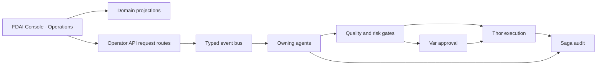

# 콘솔 운영

이 문서는 기존 FDAI Console이 운영 업무를 표시하고 범위가 제한된 운영 요청을 접수하는 방법을
정의합니다. 별도 애플리케이션, 범용 작업 항목 모델 또는 두 번째 실행 권한을 추가하지
않습니다.

> **제품 경계:** 제품명은 `FDAI Console`로 유지합니다. `Operations` / `운영`은 제품 안에 이미
> 존재하는 탐색 그룹입니다. 콘솔은 Thor의 실행기 신원을 받거나 관리 리소스를 직접
> 변경하지 않습니다.
>
> **구현 상태:** Operations 탐색, 인시던트, 승인, 프로세스, 스케줄러 실행, 프로비저닝,
> onboarding, 범위가 제한된 조사는 별도 도메인 화면으로 제공됩니다. Console 액션 전달은
> 브로커 publish 전에 페이로드를 포함한 증적을 저장하고 재시작 뒤 pending 전달을 복구합니다.
> 작업 흐름 승인은 콜백과 대화 도구 경계 모두에서 영속 역할과 서로 다른 정족수를
> 검사합니다. 두 경계 모두 no-self-approval 검사 전에 principal 신원을 normalize합니다. Pending
> access-grant 검토는 권한을 적용하지 않은 채 App 역할, 자기 승인 방지, 만료,
> 정족수 및 exact 개정 번호를 검사합니다. Federated 작업 화면, cross-domain 변환 결과 메타데이터 및 나머지 경로 강화는 제안 상태입니다.

## 구현 상태

### 구현 범위

| 영역 | 상태 | 근거 | 참고 |
|------|------|------|------|
| 승인 변환 결과 사용 불가 상태 | implemented | `console/src/routes/hil-queue.tsx`; `console/src/routes/hil-queue.test.ts`; `console/tests/live-e2e/console-routes.spec.ts`; 범위를 한정한 Vitest 검사(`5 passed`)와 라이브 Playwright 검사(`1 passed`) | Approvals 경로는 선택적 변환 결과가 없을 때 중립적인 사용 불가 상태를 표시합니다. 예상하지 못한 실패는 오류로 유지하며 브라우저에 승인 또는 실행 권한을 부여하지 않습니다. |
| Onboarding 준비 상태 사용 불가 상태 | implemented | `console/src/routes/onboarding.tsx`; `console/src/routes/onboarding.test.ts`; `console/tests/live-e2e/console-routes.spec.ts`; 범위를 한정한 Vitest 검사(`6 passed`)와 라이브 Playwright 검사(`1 passed`) | Onboarding 경로는 선택적 검사 엔드포인트가 없을 때 사용 불가 상태를 표시하며 예상하지 못한 실패는 오류로 유지합니다. |
| Command Deck 라이브 보증 timeout budget | implemented | `console/tests/live-e2e/console-routes.spec.ts`; 범위를 한정한 Playwright 테스트 검색(`2 tests`) | 테스트별 budget이 기존 서버 응답 assertion budget보다 길어서 전역 기본값이 의도한 라이브 검사를 먼저 중단할 수 없습니다. 답변, grounding 또는 검증 assertion은 완화하지 않습니다. |
| 아키텍처 관계 및 밀집 지도 렌더링 | implemented | `console/src/components/architecture-map.model.ts`; `console/src/components/architecture-map-renderer.ts`; 아키텍처 검사기, 관계 인덱스 및 지도 테스트; 범위를 한정한 Vitest 검사(`54 passed`)와 라이브 `/architecture` Playwright 검사(`1 passed`) | 화면은 권위 있는 `peered_with` 관계를 인식합니다. 밀집 지도는 선택되거나 강조된 리소스를 우선하는 최대 48개 노드의 제한된 처리로 반사를 유지하며 경로의 대기 화면이 운영자 보기를 차단하지 않도록 합니다. 통제된 runtime 또는 운영 증적이 보존되지 않았으므로 근거는 `validated`가 아니라 `implemented`를 뒷받침합니다. |
| 인증된 의미 증적 근거 실행기 | implemented | `console/tests/live-e2e/browser-entra-state.ts`; `console/tests/live-e2e/console-routes.spec.ts`; `console/tests/live-e2e/ontology-query-assurance.spec.ts`; 범위를 한정한 Console typecheck | 실행기는 첫 탐색 전에 기존 Browser Entra MSAL 세션을 `sessionStorage`에 복원하고 bootstrap을 한 번만 소비하며 성공 전용 세부 정보를 열기 전에 의미 증적을 판정하고 seed 기반 집단을 요청 간 15초 간격으로 직렬 실행합니다. Principal과 App Role 검증은 Operator API에 맡깁니다. 준비 상태에는 통과한 보존 근거가 여전히 필요합니다. |

### 구현 이력

| 날짜 | 상태 | 변경 | 근거 | 남은 작업 |
|------|------|------|------|-----------|
| 2026-08-13 | implemented | 이전 구현 이력을 재구성하지 않고 구현 원장을 채택했으며 Approvals 경로를 타입이 지정된 출처 사용 불가 경계에 맞췄습니다. | `current change`; 구현 범위 표의 작업 소유 소스와 테스트; `vitest run src/routes/hil-queue.test.ts`에서 5개 테스트가 통과했고 범위를 한정한 라이브 `/approvals` Playwright 검사가 통과했습니다. | 아래의 변환 결과, 요청, 상호 작용 및 측정 완료 근거를 기록합니다. |
| 2026-08-13 | implemented | Onboarding 경로를 타입이 지정된 출처 사용 불가 경계에 맞추고 Core에 의존하는 Command Deck 라이브 검사 2개의 명시적 outer budget을 복원했습니다. | `current change`; 구현 범위 표의 작업 소유 소스와 테스트; `vitest run src/routes/onboarding.test.ts`에서 6개 테스트가 통과했고 범위를 한정한 라이브 `/onboarding` Playwright 검사가 통과했으며 Playwright가 Command Deck 검사 2개를 검색했습니다. | Core semantic consumer를 복구하고 Command Deck 검사 2개를 실행하며 아래의 남은 완료 근거를 기록합니다. |
| 2026-08-13 | validated | 대칭 피어링 표시를 추가하고 선택되거나 강조된 리소스를 유지하면서 밀집 아키텍처 지도의 선택적 반사 처리를 제한했습니다. | `current change`; 구현 범위 표의 작업 소유 소스, 카탈로그 및 테스트; 범위를 한정한 아키텍처 Vitest에서 54개 테스트가 통과했고 라이브 `/architecture` Playwright 검사가 4.9초에 통과했습니다. | 전체 경로 보증 캠페인을 계속하고 아래의 남은 완료 근거를 기록합니다. |
| 2026-08-13 | in-progress | 인증된 통제 증적 및 seed 기반 이중 언어 보증 실행기에 일회성 Browser Entra `sessionStorage` 복원을 추가했습니다. | `current change`; 범위를 한정한 Console typecheck가 통과했고 설계 경로 gate가 이 담당 문서를 승인했습니다. | 준비 상태를 주장하기 전에 인증된 두 브라우저 경로를 실행하고 통과한 두 보존 근거 기록을 연결합니다. |
| 2026-08-13 | implemented | 범위를 한정한 브라우저 실행이 통제된 runtime 또는 운영 근거로 보존되지 않았으므로 아키텍처 지도 분류를 정정했습니다. | `current change`; 구현 범위 표의 아키텍처 소스와 범위를 한정한 검사; 저장소 근거 기록에 이 실행의 보존된 증적이 없습니다. | `validated`로 복원하기 전에 통제된 runtime 또는 운영 증적을 보존합니다. |
| 2026-08-13 | implemented | 성공 전용 세부 정보를 열기 전에 인증된 증적 실패를 표시하고, 테스트가 공급자 동시 요청을 만들지 않도록 seed 기반 이중 언어 보증 집단을 고정 15초 간격으로 직렬 실행하게 했습니다. | `current change`; `console/tests/live-e2e/console-routes.spec.ts`; `console/tests/live-e2e/ontology-query-assurance.spec.ts`; 범위를 한정한 Console typecheck와 diff 검사가 통과했습니다. | 준비 상태를 주장하기 전에 인증된 두 브라우저 경로를 실행하고 통과한 근거 기록을 보존합니다. |

### 남은 작업

- [ ] 단계 1 완료 조건에서 정의한 결정론적 재구축, 다이제스트 변경 및 캐시 손실 훈련 근거를 기록합니다.
- [ ] 제공되는 모든 요청 경로에서 단계 2 완료 조건의 실패 주입 및 권한 경계 매트릭스를 통과합니다.
- [ ] 단계 3 완료 조건에서 정의한 키보드, 충돌, 재시도, 보상 및 롤백 훈련 근거를 기록합니다.
- [ ] 검토된 기준선 구간을 고정하고 단계 4 완료 조건에서 정의한 shadow 측정 비교를 통과합니다.

## 설계 요약

Operations 영역은 기존 도메인 변환 결과를 읽고, 각 스키마와 수명 주기를 이미 소유한 도메인
경로로 요청을 제출합니다. 담당 에이전트는 타입이 지정된 이벤트를 통해 요청을 판단하고, 승인하고,
실행하고, 복구하고, 감사합니다.

## 아키텍처 결정

콘솔 운영은 네 가지 경계를 사용합니다.

| 경계 | 책임 | 권한 |
|------|------|-----------|
| 콘솔 표현 | Operations 탐색, 작업, Approvals, Investigations, 근거, 타임라인 | 서버 소유 상태와 사용할 수 있는 운영 기능을 렌더링합니다. |
| 도메인 변환 결과 | 권위 있는 `Approval`, `Process`, `ReviewCase`, `AccessGrantRequest`, 액션 기록 조회 | 각 출처 수명 주기를 읽기만 합니다. |
| Operator API 도메인 요청 경로 | 인증, 인가, 출처 개정 번호와 도메인 스키마 검증, 중복 제거, publish | 요청을 접수하며 판단하거나 실행하지 않습니다. |
| 에이전트 런타임 | 타입이 지정된 pub/sub으로 판단, 승인, 실행, 복구, 감사 | 기존 pantheon 소유권이 권한을 유지합니다. |

Operator API는 mechanical 중계로 유지합니다. FDAI Console과 운영자 클라이언트가 공유하는
비특권 HTTP 백엔드이며 Thor의 실행기 신원을 받지 않습니다. 오케스트레이터, 숨은 에이전트 또는
범용 작업 흐름 엔진이 되지 않으며 에이전트는 서로 직접 호출하지 않습니다.

## 제품 용어

하나의 제품명과 이해하기 쉬운 운영 라벨을 사용합니다.

| 범위 | 용어 |
|------|------|
| 제품 | `FDAI Console` |
| 공유 HTTP 백엔드 | `Operator API` |
| 기존 탐색 그룹 | `Operations` / `운영` |
| 사용자에게 보이는 동작 | Operational 요청 / 운영 요청 |
| Operations 화면 | 작업, Approvals, Investigations |
| ActionType 요청 출처 | `trigger_kind: operator_request` |

이 표면의 이름으로 `Operator Workbench`, 두 번째 `Operator Console`, `Command Center`,
`Orchestration`을 사용하지 않습니다. Python 작업 workbench처럼 특정 도구를 나타내는 이름은 유지할
수 있습니다.

## 기존 온톨로지와 스키마

### 도메인 기록

Operations는 기존 객체와 링크를 재사용합니다.

| 운영 관심사 | 권위 있는 객체와 링크 | 콘솔 동작 |
|-------------|-----------------------------|-----------|
| 통제된 검토 | `Process -> runs_review -> ReviewCase -> resolved_by -> Decision` | 검토 상태, 이전 결정, 근거, 다음 책임 소유자를 보여줍니다. |
| 사람 승인 | `ReviewCase -> has_approval -> Approval`과 action-bound 승인 | 정족수, 자기 승인 방지 상태, 기한, 근거를 보여줍니다. |
| 작업 흐름 실행 | `WorkflowDefinition`, `WorkflowBinding`, `Process` | 변경할 수 없는 정의, 현재 단계, 개정 번호, 대상, 보상 상태를 보여줍니다. |
| 접근 변경 | `AccessGrantRequest` | 적격한 pending 요청을 스트림하고 접근을 적용하지 않은 채 변경할 수 없는 권한 확인 수명 주기를 보여줍니다. |
| 실행 후속 조치 | `ActionRun`, 롤백, 감사 참조 | Execute-again 바로 가기 없이 결과와 복구 상태를 보여줍니다. |
| 담당자 인수인계 | Operational-readiness `Process`, `ReviewCase`, `Approval`, `Decision` | 기존 인계 작업 흐름을 재사용하며 Saga는 auditor로 유지됩니다. |

범용 `WorkItem`, `OperationRequest`, 중복 `Approval`, 범용 변경 가능한 상태 표 또는 새 승인
토픽을 추가하지 않습니다. 각 출처가 자체 스키마, 개정 번호, 수명 주기, 소유자를 유지합니다.

브라우저에 표시할 pending 접근 요청이 있으면 인증된 GET-only 스트림이 principal의 App 역할로
영속 기록을 필터링합니다. 탭과 Command Deck이 idle 상태이면 콘솔은 기능, 범위 및
만료가 포함된 request-scoped 대화를 엽니다. 진행 중인 작업, 전송하지 않은 초안 또는 hidden
탭이 있으면 대화를 바꾸지 않고 visible 배지를 유지합니다. 배지를 열면 적격 principal이
필수 사유를 입력하고 정확한 변환 결과 개정 번호를 승인하거나 거부할 수 있습니다. 증적은 검토가
권한을 적용하지 않으며 새로운 탐색이 여전히 필요하다고 알립니다. Protected 배포, fresh 접근
검증 및 철회는 권한 확인 작업 흐름의 별도 단계로 남습니다.

인증된 `GET /incidents/stream` 경로는 영속 인시던트 읽기 모델에서 최대 50개의 활성 인시던트를
project합니다. 새 활성 인시던트가 관찰되면 탭과 Command Deck이 idle 상태일 때 인시던트에 연결된
대화를 시작합니다. 진행 중인 작업, 전송하지 않은 초안 또는 hidden 탭이 있으면
active-incident 배지를 대신 유지합니다. Reconnect는 일시적인 agent-activity 프레임에 의존하지 않고
영속 상태에서 스냅샷을 다시 만듭니다. 브라우저는 인시던트와 상관관계 선택자만 보내며,
서버는 답변의 근거로 사용하기 전에 해당 연결을 다시 해석합니다.

### Operations 작업 화면

작업 화면은 presentation-level federation이며 온톨로지 객체나 system of 기록이 아닙니다. 출처별
변환 결과를 상태, 소유자 에이전트, 담당자, 기한, priority, 범위로 묶을 수 있습니다. 각 항목은 exact
출처 참조, 출처 개정 번호, 근거 참조, 최신성, 민감정보 제거 상태를 유지합니다.

API 응답은 기존 도메인 변환 결과의 discriminated union으로 구현합니다. 변환 결과 캐시는 다시
만들 수 있는 출력을 저장할 수 있지만 캐시 손실로 작업을 잃거나 출처 수명 주기가 바뀌면 안
됩니다. 브라우저는 누락된 상태나 권한 확인을 추론하지 않습니다.

Closed discriminator는 `source_family`이며 초기 값은 `approval`, `process`, `review_case`,
`access_request`입니다. 각 arm은 도메인 필드 앞에 `source_id`, `source_revision`, exact `type_ref`
(`name`, `version`, `catalog_digest`), `ontology_release_digest`, `as_of`, 출처 watermark를 포함합니다.
계열 추가는 paired design과 decoder 변경이 필요하며 shared 변경 스키마를 만들지 않습니다.

단계 1은 `rule-catalog/schema/console-operations-projection.schema.json`을 각 arm, 사용 불가 증적,
최신성 상한의 versioned 머신 출처로 추가합니다. Muninn이 책임지고 FDAI 관리자가 스키마
변경을 검토하며 서버와 생성된 클라이언트 다이제스트는 CI에서 일치해야 합니다.

해당 스키마는 계열별 범위가 제한된 `freshness_ceiling_seconds`, hard 항목 한도, 최대 link-traversal 깊이,
고정된 primary-key 정렬, allowed 잘림 사유를 선언합니다. 상한이나 한도가 없거나
unbounded이면 구체화를 차단합니다. 페이지 나누기는 스냅샷 기준 시점, 정렬, 출처 watermark를
바꾸지 않습니다.

각 출처 에이전트는 권위 있는 기록의 single 쓰기 담당으로 유지됩니다. Muninn은 rebuildable cross-domain
맥락 인덱스와 그 기준 시점, 최신성, 다이제스트, 재구축 근거를 책임집니다. Operator API
materializer는 source-owned 상태와 Muninn 인덱스를 읽는 mechanical 중계이며 출처 객체를
publish하거나 수명 주기를 진행하지 않습니다.

서버 캐시는 materializer 뒤의 선택적 프로바이더이며 완전한 정본 다이제스트 입력으로 키를 만들고
변경할 수 없는 변환 결과 바이트를 저장합니다. Miss나 제거는 권위 있는 출처를 다시 읽습니다. TTL은
최신성을 결정하지 않고 cached 바이트는 요청을 authorize하지 않습니다. 프로바이더가 없는 배포는
같은 한도와 다이제스트 계약으로 요청마다 materialize합니다.

### 온톨로지 조회 전략

명시적인 `as_of` 기준 시점에서 출처 계열별 범위가 제한된 `ObjectSet` 정의를 materialize한 뒤 선언된
링크만 결합합니다. 온톨로지 release 다이제스트, 출처 watermark, 기준 시점, 잘림 사유, 민감정보 제거 요약,
최신성 상태를 보존합니다. 브라우저에 free-form 그래프 조회를 노출하지 않습니다.

출처 계열이 사용 불가, 승인되지 않은, 시간 초과 상태이거나 최신성 상한을 넘으면 출처,
사유, last successful watermark, 재시도 지침을 포함한 명시적 사용 불가 증적을 반환합니다.
Stale 캐시를 현재 상태로 대체하거나 누락된 객체를 추론하지 않습니다. 다른 출처 계열은 계속
표시할 수 있지만 사용 불가 출처에 의존하는 요청은 권위 있는 상태를 다시 읽을 때까지 서버
side에서 비활성화합니다.

각 route-inventory 행은 closed `required_source_families` 집합을 선언합니다. 서버는 모든 필수
계열이 요청 기준 시점에서 `available`이고 exact 개정 번호를 다시 읽을 수 있을 때만 연산을
활성화합니다. 선언되지 않은 의존성은 available을 기본값하지 않고 인벤토리 게이트에서 실패합니다.

각 union arm은 `availability: available | unavailable`을 포함합니다. 사용 불가 arm은 `source_family`와
exact 참조를 유지하고 도메인 데이터를 생략하며 `사유: 승인되지 않은 | 시간 초과 | source_unavailable |
freshness_exceeded`, nullable `last_successful_watermark`, nullable bounded `retry_after_seconds`를 추가합니다.
알 수 없음 사유는 빈 출처가 되지 않고 디코딩에 실패합니다.

## 운영 요청

### 도메인 요청 스키마 재사용

범용 요청 스키마는 없습니다. 각 운영 기능은 해당 도메인이 소유한 스키마와 경로를 사용합니다.

| 사용자 작업 | 기존 도메인 경로 |
|-------------|------------------|
| Approval 결정 | Approval 결정 스키마와 Var 소유 승인 수명 주기 |
| 조사 시작 | 기존 조사 요청 스키마와 타입이 지정된 유입 경로 |
| 카탈로그 또는 작업 흐름 초안 생성 | 기존 초안 스키마와 GitHub App 전달 경로 |
| 접근 요청 | `AccessGrantRequest` 스키마와 권한 확인 작업 흐름 |
| 프로세스 진행 | 참조된 `WorkflowDefinition`과 현재 `Process` 개정 번호가 정의한 전이 |
| ActionType 요청 | `trigger_kind: operator_request` 또는 `both`인 기존 액션 인자 스키마 |

`operator_request`는 ActionType 요청을 누가 시작했는지 나타냅니다. 제품명, API umbrella 또는 도메인
스키마의 대체물이 아닙니다.

ActionType 경로에서 `ActionType.trigger_kind.kind`는 해당 액션이 `operator_request` 또는 `both`를
허용하는지 선언하며 이벤트 필드가 아닙니다. 런타임 유입 기록은 대신 `event_type:
operator_request`와 strict boolean `operator_initiated: true`를 포함합니다. Event ingest는 이 flat
필드를 검증한 뒤 컨트롤 루프와 액션 빌더가 소비하는 정본 중첩된
`payload.operator_request`를 만듭니다. 확장은 이 정규화기를 통해 publish하며 중첩된 trusted
형태를 직접 쓰지 않습니다. 다른 도메인 요청은 자체 이벤트 계약을 유지합니다.

신뢰할 수 없는 flat 유입은 `initiator_principal`, `action_type`, `params`, `resource_ref`, `correlation_id`,
`idempotency_key`도 포함하며 알 수 없음 필드를 차단합니다. 요청 경로가 이 flat 기록을 만들고
`fdai.core.event_ingest`만 이를 검증하고 normalize한 뒤 Huginn이 owned `Event`를 republish합니다. 외부
경계는 중첩된 형태를 수락하지 않습니다.

작업 흐름 실행 맥락도 같은 경계를 따릅니다. 경로는 요청자를 인증된 principal로
교체하고 parameter-substitution 값만 허용합니다. Approval, 액션 결과, 보상,
결정, 병렬, 요청자, wait 이름 공간은 서버가 소유한 프로세스 근거 전용이며 HTTP 입력에서
거부됩니다.

정확한 프로세스 재개는 요청 본문 없이 `POST /workflows/{process_id}/resume`을 사용합니다.
Operator API는 호출자에게서 작업 흐름, 대상, 트리거, 모드, 상관관계 또는 맥락을 받는 대신
영속 프로세스 스냅샷과 creation 근거를 다시 읽습니다. 모든 재개에는 기여자
기능이 필요합니다. 강제 적용 프로세스의 출처 수명 주기를 작업 흐름 런타임이 진행하기 전에
경로가 Owner와 현재 강제 적용 허용 목록을 다시 확인합니다. 알 수 없는 프로세스 id는 `404`를
반환하고 불완전한 또는 inconsistent 재개 근거는 타입이 지정된 `409` 충돌을 반환합니다.

안전한 프로세스 취소는 요청 본문 없이 `POST /workflows/{process_id}/cancel`을
사용합니다. 기여자는 shadow 작업을 취소할 수 있고 강제 적용 프로세스에는 Owner가 필요합니다.
강제 적용 허용 목록 항목을 제거해도 취소는 새 forward 작업을 시작할 수 없으므로 차단되지
않습니다. 서버는 영속 `pending` 또는 `waiting` 경계에서만 명령을 수락하고 행위자와
취소 의도를 기록합니다. Pending human-approval 자리를 닫고 이미 전달된 액션을
조정한 뒤 작업 흐름 소유자를 통해 취소 또는 compensate합니다. `running` 프로세스는 전달이
idle이라고 추측하지 않고 타입이 지정된 `409 process_not_at_safe_boundary`를 반환합니다.
로컬 및 deployed Operator API factory는 같은 `WorkflowExecutionConfig`에서 시작, exact 재개,
safe 취소, 범위가 제한된 재시도를 등록하며 경로 인벤토리 테스트는 누락을 차단합니다.

범위가 제한된 프로세스 재시도는 요청 본문 없이 `POST /workflows/{process_id}/retry`를 사용합니다.
기여자는 shadow를 재시도할 수 있고 강제 적용은 새 forward 작업을 시작할 수 있으므로 Owner와 현재
작업 흐름 허용 목록이 필요합니다. 서버는 명시적인 effect-free 사유가 있는 `failed` 시도를
수락하고 `timed_out` 시도는 `approval_timed_out`인 경우에만 수락합니다. 전달, 취소,
보상 근거는 재시도를 차단하고 승인 근거는 최종 거절 또는 시간 초과에만
허용됩니다. 다른 실패는 타입이 지정된 복구 충돌을 반환합니다. `max_retry_attempts`는
서버가 소유한이며 기본값은 3입니다.
Approval 거절은 모든 형제 정족수 자리를 닫습니다. `approval_rejected` 또는
`approval_timed_out` 재시도는 서로 다른 승인 id를 가진 새 시도를 만들며 이전 결정은 새
정족수를 충족하지 않습니다.

### 요청 검사

각 도메인 경로는 출처에 맞는 검사를 반복합니다.

1. Entra 토큰, 대상, App 역할, 필수 기능을 확인합니다.
2. 권위 있는 출처를 읽고 개정 번호, 기한, 관련 정책 다이제스트를 비교합니다.
3. 도메인 스키마를 검증하고 알 수 없는 필드를 차단합니다.
4. 경로는 범위, 용도, no-self-approval, 정족수 충족 여부를 precheck합니다. 최종 적용은
  `Approval`의 Var, `ReviewCase`/`Decision`의 Forseti, `Process`의 현재 단계 소유자,
  권한 부여 검토의 `AccessGrantRequestService`가 담당하며 요청자는 정족수를 충족하지 못합니다.
5. 행위자, 상관관계 id, 멱등성 키, 감사 또는 발신함 증적을 원자적으로 기록합니다.
6. 요청 접수, 충돌, denial 또는 만료를 반환하며 요청 시점에 실행을 주장하지 않습니다.
7. Owning 에이전트가 처리할 타입이 지정된 이벤트를 publish합니다.

Acceptance는 항상 아래의 타입이 지정된 발신함 증적을 만듭니다. 거절, 만료된 요청, 멱등성
충돌 또는 precondition 충돌은 고정된 사유, 행위자, 출처 참조, 의도 다이제스트, 상관관계 id를
포함한 Saga `AuditEntry`를 만들지만 발신함 행은 만들지 않습니다. 최종 에이전트 결과는 같은
상관관계와 멱등성 키로 두 기록 중 하나에 연결됩니다.

### 대화형 액션 근거

액션 수명 주기 질문은 읽기 전용으로 유지됩니다. 요청은 상관관계 id와 exact 액션, 승인 또는
멱등성 선택자 하나를 포함하는 `conversation_context.kind: action`을 전달할 수 있습니다. 서버는
제공된 모든 선택자를 감사 원장에서 다시 확인하고 pending 승인 저장소는 정본 신원을
도출하는 데만 사용합니다. Reader-facing 답변은 audit-backed 제안, 안전성, 승인 상태,
실행, 효과 검증 및 중복 증적을 렌더링하며 pending 승인 상세를 노출하거나
변경을 실행하지 않습니다. 증적 점유는 최종 행에 동일한 액션 id와 멱등성 키가 있어야
합니다. 누락된, conflicting, 잘린 또는 audit-free 맥락은 검증되지 않은으로 유지됩니다.

HIL 콜백은 조정기 또는 레지스트리 경로가 결정을 기록하기 전에 `approve-runtime-hil`을
부여하는 signed 역할 집합을 요구합니다. 누락된 역할은 권한을 부여하지 않습니다. Pending 조회는 exact
승인 id를 사용하고 결정 기록은 범위가 제한된 큐 검사 대신 exact idempotency-key 보류를 사용합니다.
No-self-approval 및 separation-of-duty 검사는 계속 권위를 가집니다.

Human 연산의 `actor`와 `initiator_principal`은 해당 요청 Entra 토큰에서 검증한 운영자 OID입니다.
Console 서비스 principal, 중계 신원 또는 Thor 워크로드 신원이 사람을 대신할 수 없습니다.
Machine-initiated 요청은 운영자를 impersonate하지 않고 별도 도메인 경로와 워크로드 principal
계약을 사용합니다.

재시도는 같은 멱등성 키를 사용합니다. 동시 전이는 최신 출처 개정 번호를 반환합니다.
어떤 경로도 에이전트 구현을 가져오기하거나 Thor를 직접 호출하거나 다른 소유자의 상태를 수정하지
않습니다.

충돌 응답은 `kind` (`idempotency_collision`, `stale_revision`, `competing_decision`,
`prior_deny`, `expired`), `retriable`, 현재 출처 참조와 개정 번호, 존재하는 경우 winning 증적,
next allowed 전이를 포함한 고정된 problem 상세를 사용합니다. 브라우저는 HTTP 상태만으로 재시도
지침을 만들지 않습니다.

### 전달 내구성

현재 콘솔 액션 경로는 브로커 publish 전에 멱등성 키를 atomically 점유하고 전체 제안,
의도 다이제스트, 행위자, 상관관계, 감사 증적을 저장합니다. 전달은 범위가 제한된 임차 기간, publish 시간 초과,
재시도 delay, 배치 크기를 사용합니다. 시작 및 주기적 복구는 pending 기록과 임차 기간이 만료된 기록을
재개합니다. 실패한 주기적 cycle은 기록 후 재시도하며 종료는 진행 중인 복구를 취소하고 임차 기간을
회수 가능한 상태로 둡니다. 다운스트림 소비자는 고정된 멱등성 키로 at-least-once 이벤트를 deduplicate합니다.

요청 acceptance는 영속 기록이 커밋된 뒤에만 HTTP `202 Accepted`를 사용합니다. 현재 증적은
`request_id`, `correlation_id`, `dispatch_status`, `accepted_at`, `durably_queued`를 반환하며 "approved"나
"executed"가 아닌 "durably 대기 중"를 뜻합니다. 같은 의도 재생은 completed 이벤트를 다시 publish하지
않고 기존 기록을 재사용합니다. 같은 키의 다른 의도는 `409 Conflict`와 함께 winning 요청,
상관관계, acceptance 시간을 반환합니다. 상태 URL과 나머지 공통 증적 필드는 단계 2 범위입니다.

확인된 인시던트 creation은 인시던트를 쓰기 전에 티켓 전달을 차단된 영속 상태로 준비합니다.
`incident.open`이 영속 감사에 나타난 뒤에만 전달을 activate합니다. 복구는 인시던트를 다시
만들지 않고 누락된 티켓 효과를 activate합니다. 영속 인시던트가 없는 차단된 티켓은 configurable
보존 기간, 기본 24시간 뒤 감사 가능한 abandoned 상태가 되며 publish되지 않습니다.

의도 다이제스트는 principal, 도메인 연산, exact 출처 참조와 개정 번호, 정규화된 인자,
해당 정책 또는 스키마 버전을 포함합니다. 다른 다이제스트로 같은 멱등성 키를 재사용하면 `409
충돌`를 반환하고 감사 발견 사항을 기록하며 이벤트를 publish하지 않습니다. Key는 인증된
운영자 이름 공간을 사용하고 의도 다이제스트로 비교합니다. 긴 운영자/클라이언트 이름 공간은 자르지 않고
전체 SHA-256을 사용합니다. 관련 없는 principal은 다른 증적을 보거나 충돌시키지 못합니다.

Policy 다이제스트는 요청 판단에 실제 사용된 exact risk, 승인, 승격, exemption 또는 재정의,
범위, 스키마 참조를 정본 순서로 포함하며 사용하지 않은 정책은 제외합니다.

Prior-deny 또는 re-request 정책 조회는 점유에 연결할 권위 있는 개정 번호를 반환합니다. 요청을
커밋하는 트랜잭션이나 compare-and-set은 해당 개정 번호를 다시 확인하며 새 거부 또는 정책 변경이
있으면 충돌을 반환하고 발신함 행을 쓰지 않습니다. Preflight 읽기만으로 publish를 authorize하지
않습니다.

이 점유는 출처 개정 번호, 현재 결정 또는 수명 주기 상태, 기한, 정책 다이제스트, 스키마 버전,
해당 승인 개정 번호를 하나의 precondition 스냅샷으로 연결합니다. 모든 값이 같고 기한이 열린
경우에만 커밋하며 그렇지 않으면 타입이 지정된 충돌을 반환하고 감사 acceptance나 발신함 쓰기를 수행하지
않습니다.

## 에이전트와 실행 권한

콘솔에는 판단 또는 managed-resource 실행 권한이 없습니다. Pantheon은 고정 책임을 유지합니다.

| 작업 | 책임 에이전트 |
|------|---------------|
| 새 운영자 신호 정규화와 상관관계 | Huginn |
| 검토 또는 proposed 액션 판단 | Forseti |
| 조건을 충족한 human 승인 기록 | Var |
| 승격된 managed-resource 액션 실행 | Thor |
| 실패한 액션 복구 또는 롤백 | Vidar |
| 최종 근거 추가 | Saga |
| 출처 기록에서 재생 가능한 맥락 구성 | Muninn |
| Operator 로케일로 결과 설명 | Bragi |
| Audited 결과에서 off-path 학습 | Norns와 Mimir |

Thor는 조건을 충족한 `direct_api`, `pr_native`, `tool_call` 실행 경로에서 privileged 워크로드 신원을 사용할
수 있습니다. 이 실행도 ActionType 등록과 승격, quality와 risk 검사, 승인 정책 충족, 리소스 잠금,
예행 실행, 영향 한도와 stop 조건, 멱등성, 롤백과 감사 근거가 필요합니다. 로그인한 사람의
신원은 Thor에 위임되지 않습니다.

이 안전성 값은 exact `ActionType`, 변경할 수 없는 `MutationPlan`, unified 실행 모델에서 가져옵니다.
Console 스키마는 resolved 값을 표시할 수 있지만 이를 제공하거나 완화하거나 재정의할 수 없습니다.
Exact 참조, 계획 다이제스트, stop 조건, 영향 한도, 잠금 범위 또는 롤백 계약이 없으면 요청은
실행 대상이 아닙니다.

## 콘솔 구조

현재 `Operations` 탐색 그룹을 하나의 제품 표면으로 유지합니다. 별도 셸을 만들지 않고 다음 화면을
추가하거나 개선합니다.

- **작업:** 출처별 변환 결과를 묶은 attention 목록입니다.
- **Approvals:** 정족수, 기한, 근거, 결정 컨트롤을 포함한 기존 승인 큐입니다.
- **Investigations:** 기존 범위가 제한된 read-investigation 요청과 결과입니다.
- **Operational 상세:** 출처 타임라인, 근거, 소유자 에이전트, 최신성, 사용할 수 있는 도메인 운영
  기능을 보여줍니다.

서버 상태가 사용할 수 있는 운영 기능을 결정합니다. 브라우저는 사용성을 위해 사용할 수 없는 컨트롤을
숨길 수 있지만 모든 제출은 권한 확인과 개정 번호 검사를 반복합니다. SSE는 영향받은 출처
참조를 invalidate하고 클라이언트가 권위 있는 상태를 다시 읽게 할 수 있습니다.

SSE invalidation 프레임은 `event_id`, `source_family`, opaque `source_id`, `source_revision`, `as_of`를
포함하며 기록, 연산, 신원 상세는 포함하지 않습니다. 서버는 토큰 만료 전까지 스트림을
닫습니다. 클라이언트는 새 토큰을 얻고 권한 확인 헤더와 last 이벤트 id로 reconnect합니다. Reconnect는
모든 권한 확인 검사를 반복하며 공백이 있으면 권위 있는 refetch를 수행합니다. SSE는 새로 고침
힌트일 뿐 요청을 authorize하지 않습니다.

발급자와 테넌트 검사는 배포에 설정된 Entra 테넌트 발급자와 API 대상을 exact하게 검증한다는
뜻입니다. 게스트도 해당 home 테넌트가 발급한 토큰을 제시해야 합니다. Common, organizations,
foreign-tenant, issuer-mismatched 토큰은 역할 해석 전에 실패 시 차단하며 요청나 스트림 상태를
테넌트 경계 사이에서 공유하지 않습니다.

단계 2 multi-effect 요청은 부분 성공을 하나의 `submitted` 결과로 합치지 않습니다. 각 효과는
하나의 상위 상관관계 아래에서 `effect_id`, `kind`, `required`, `상태: pending | accepted | succeeded |
실패한`, nullable 증적과 사유, 재시도 개수를 선언합니다. 모든 필수 효과가 최종일 때만
상위가 최종이며 필수 실패가 하나라도 있으면 `degraded`입니다. 인시던트 creation과 티켓
제안은 현재 collapsed 플래그에서 이 형태로 migrate하고 영속 조정은 인시던트를 다시 만들지
않고 누락된 효과만 재개합니다.

Bulk 요청은 도메인 작업 흐름이 atomicity 또는 범위가 제한된 부분 실패, 영향 한도, 롤백 동작을
정의한 뒤에 도입합니다.

## 제공 계획

### 단계 0 - 기존 경로 인벤토리

현재 콘솔 쓰기 경로별 출처 스키마, 소유자, 기능, 개정 번호, 멱등성 룰, 증적, 신원
의존성을 카탈로그합니다. 조회, 시뮬레이션, 승인, operational 요청, 실행, break-glass로
분류합니다. 첫 shipped 경로부터 browser-Entra 로컬과 deployed는 같은 스키마, 권한 확인, 출처
연결을 사용하고 고정본 principal은 pytest 전용으로 유지합니다.

Exit criteria: 제공되는 모든 요청에 도메인 스키마, 소유자, 기능, 멱등성 룰, 감사 경로가 하나씩
있습니다. 기계가 읽는 경로 인벤토리는 메서드와 경로, 분류, 스키마, 출처 소유자,
기능, 개정 번호 룰, 멱등성 범위, 증적, 감사 이벤트, owning 테스트를 기록합니다. Console
경로가 누락되거나 중복되거나 실행으로 분류되면 차이 게이트가 실패합니다. Managed-resource direct
실행은 지원되는 콘솔 분류가 아닙니다.

### 단계 1 - Operations 변환 결과 구성

`ReviewCase`, `Approval`, `Process`, `AccessGrantRequest`를 출처별 작업 화면으로 변환 결과합니다. Exact
참조, 근거, 최신성, 커서 페이지 나누기, 사용 불가 상태, 민감정보 제거 테스트를 추가하고 첫 변환 결과부터 구체화 age와 source-watermark lag를 발행합니다.

Exit criteria: 같은 기준 시점에서 변환 결과를 다시 만들면 같은 화면이 생성되고 어떤 출처 수명 주기도
변환 결과에 의존하지 않습니다. 각 구체화는 ordered 민감정보가 제거된 출력, 온톨로지 release,
`as_of` 기준 시점, 출처 watermark, applied 한도, 잘림 사유를 포함하는 정본 다이제스트 하나를
기록합니다. Cache-loss 훈련은 rebuildable 변환 결과 상태만 삭제하고 같은 입력이 같은 다이제스트를
재현하며 watermark가 바뀌면 새 스냅샷이 생성됨을 증명합니다.

### 단계 2 - 도메인 요청 강화

도메인 스키마를 대체하지 않고 개정 번호 검사, 멱등성, 증적, 발신함 동작을 표준화합니다. Stale
상태, 중복 제출, 자기 승인, 만료, 역할 변경, 프로세스 재시작을 테스트합니다. 고정본
principal 없이 browser-Entra 로컬과 deployed 조립에서 같은 경로 인벤토리와 권한 확인
매트릭스를 실행하고 두 venue의 모든 요청 및 전달 결과를 개수합니다.

Console 액션 내구성 구획은 제공됩니다. 단계 2는 같은 계약을 나머지 도메인 경로로 확장하고
인시던트 응답의 collapsed 티켓 플래그를 타입이 지정된 효과로 대체합니다.

Exit criteria: SPA에는 권한 확인 결정이 없고 accepted 요청이 출처 소유자를 우회하지 않습니다.
Publish 전, publish 후, 응답 전 실패 주입으로 committed 요청이 유실되지 않고 이벤트가 두 번
적용되지 않음을 증명합니다.

Authorization-boundary 매트릭스는 각 인벤토리 행에 대해 해당되는 인증되지 않은, unassigned, 읽기 담당,
기여자, Approver, Owner, BreakGlass principal을 다룹니다. 자기 승인, insufficient 정족수, stale
개정 번호, 만료된 기한, wrong 범위, changed 역할, 철회된 권한도 검증합니다. 매트릭스 행이 없는
요청 경로를 추가하면 변경이 차단됩니다.

### 단계 3 - Operations 화면 완성

기존 셸에 작업, Approvals, Investigations, 타임라인, 근거, 출처별 복구를 추가합니다. Stale
개정 번호는 권위 있는 상태를 다시 읽고, competing 결정은 winner를 연결하며, 만료나 denial은
다음 허용 전이를 설명합니다. 의도가 바뀐 경우에만 새 키를 사용합니다.

작업, 필터, 상세, 복구는 keyboard로 모두 조작할 수 있습니다. 상태와 권한은 color에만
의존하지 않고 출처, 기한, 사용 불가 사유에 accessible 이름이 있습니다. SSE 새로 고침은 focus를
옮기지 않고 하나의 polite 상태 announcement를 사용하며 제출 충돌은 actionable 요약에 focus한
뒤 dismiss하면 originating 컨트롤로 focus를 돌려보냅니다.

Exit criteria: 오퍼레이터가 FDAI Console에서 지원되는 사람 단계를 완료할 수 있으며 모든
managed-resource 변경은 이후 Thor `ActionRun`으로만 나타납니다. 충돌, 재시도, 보상,
롤백 훈련은 원래 증적을 보존하고 모든 superseding 결과를 연결합니다.

### 단계 4 - 측정 기반 최적화

측정된 수요와 도메인 안전성 계약이 생긴 뒤에만 cross-device saved 화면 또는 bulk 요청을
추가합니다. 큐 age, 결정 지연 시간, 충돌 비율, 중복 suppression, overdue 작업, 변환 결과
최신성, request-to-terminal-outcome 지연 시간을 측정하고 기준선에서 경보를 설정합니다.

Exit criteria: 출처별 검토된 기준선 구간과 최소 샘플 하한을 고정하고 모든 메트릭은 범위가 제한된
라벨을 사용하며 경보 fire/복구를 연습합니다. Optimization은 같은 시나리오 집합에서 먼저 shadow로
실행하고 대상 메트릭이 개선되면서 denial escape, 중복 애플리케이션, 롤백,
unavailable-source 비율이 악화되지 않을 때만 진행합니다.

## 채택하지 않은 대안

- **별도 operations 앱:** FDAI Console을 중복하고 두 번째 제품처럼 보입니다.
- **권위 있는 범용 `WorkItem`:** 도메인 수명 주기를 중복하고 두 번째 소유자를 만듭니다.
- **범용 `OperationRequest`:** 도메인 검증과 소유권 차이를 지웁니다.
- **Console orchestration:** Event choreography를 중앙 콘솔 컨트롤로 잘못 표현합니다.
- **Browser-derived 권한:** Stale 표현 상태를 권한 확인 출처로 만듭니다.
- **실행기 자격 증명을 가진 콘솔 또는 요청 경로:** 요청과 실행 신원을 합칩니다.
- **Direct 그래프 변경:** ActionType, risk, 승인, 롤백, 감사 게이트를 우회합니다.

## 관련 문서

| 알아볼 내용 | 문서 |
|-------------|------|
| 대화형 번역과 채널 도구 | [오퍼레이터 콘솔](operator-console-ko.md) |
| 사람 역할과 연산 기능 | [사용자 RBAC와 Entra 아이덴티티](user-rbac-and-identity-ko.md) |
| Exact 온톨로지 release와 객체 집합 | [운영 온톨로지 플랫폼](../architecture/operating-ontology-platform-ko.md) |
| ActionType 안전성과 실행 상한 | [액션 온톨로지](../decisioning/action-ontology-ko.md)와 [실행 모델](../decisioning/execution-model-ko.md) |
| 고정 pantheon 소유권 | [에이전트 판테온](../agents/agent-pantheon-ko.md) |
| Operational-readiness 인계 | [운영 준비 상태](../operations/operational-readiness-ko.md) |
| 사람 배정 제공 | [사람-에이전트 배정 구현 계획](human-agent-assignment-implementation-plan-ko.md) |
