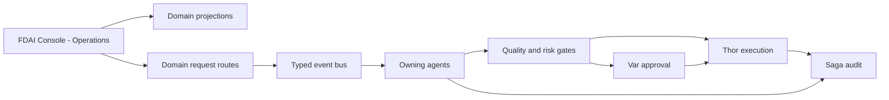

# 콘솔 운영

이 문서는 기존 FDAI Console이 운영 업무를 표시하고 범위가 제한된 운영 요청을 접수하는 방법을
정의합니다. 별도 애플리케이션, 범용 작업 항목 모델 또는 두 번째 실행 authority를 추가하지
않습니다.

> **제품 경계:** 제품명은 `FDAI Console`로 유지합니다. `Operations` / `운영`은 제품 안에 이미
> 존재하는 탐색 그룹입니다. 콘솔은 Thor의 executor identity를 받거나 관리 리소스를 직접
> 변경하지 않습니다.
>
> **구현 상태:** Operations 탐색, incident, approval, process, scheduler run, provisioning,
> onboarding, bounded investigation은 별도 도메인 view로 제공됩니다. 이 문서의 federated Tasks
> view, cross-domain projection metadata, 공통 request hardening gate는 제안 상태입니다. Target phase
> 설명은 해당 API나 UI가 live 상태라는 뜻이 아닙니다.

## 설계 요약

Operations 영역은 기존 도메인 projection을 읽고, 각 스키마와 lifecycle을 이미 소유한 도메인
경로로 요청을 제출합니다. 담당 에이전트는 typed event를 통해 요청을 판단하고, 승인하고,
실행하고, 복구하고, 감사합니다.

## 아키텍처 결정

콘솔 운영은 네 가지 경계를 사용합니다.

| 경계 | 책임 | Authority |
|------|------|-----------|
| 콘솔 presentation | Operations 탐색, Tasks, Approvals, Investigations, evidence, timeline | 서버 소유 상태와 사용할 수 있는 운영 기능을 렌더링합니다. |
| 도메인 projection | Authoritative `Approval`, `Process`, `ReviewCase`, `AccessGrantRequest`, action record 조회 | 각 source lifecycle을 읽기만 합니다. |
| 도메인 요청 route | 인증, 인가, source revision과 도메인 스키마 검증, 중복 제거, publish | 요청을 접수하며 판단하거나 실행하지 않습니다. |
| 에이전트 runtime | Typed pub/sub으로 판단, 승인, 실행, 복구, 감사 | 기존 pantheon ownership이 authority를 유지합니다. |

API는 mechanical relay로 유지합니다. Orchestrator, 숨은 에이전트 또는 범용 workflow engine이 되지
않습니다. 에이전트는 서로 직접 호출하지 않습니다.

## 제품 용어

하나의 제품명과 이해하기 쉬운 운영 label을 사용합니다.

| 범위 | 용어 |
|------|------|
| 제품 | `FDAI Console` |
| 기존 탐색 그룹 | `Operations` / `운영` |
| 사용자에게 보이는 동작 | Operational request / 운영 요청 |
| Operations view | Tasks, Approvals, Investigations |
| ActionType 요청 출처 | `trigger_kind: operator_request` |

이 surface의 이름으로 `Operator Workbench`, 두 번째 `Operator Console`, `Command Center`,
`Orchestration`을 사용하지 않습니다. Python task workbench처럼 특정 도구를 나타내는 이름은 유지할
수 있습니다.

## 기존 온톨로지와 스키마

### 도메인 record

Operations는 기존 object와 link를 재사용합니다.

| 운영 관심사 | Authoritative object와 link | 콘솔 동작 |
|-------------|-----------------------------|-----------|
| Governed review | `Process -> runs_review -> ReviewCase -> resolved_by -> Decision` | Review 상태, 이전 decision, evidence, 다음 책임 owner를 보여줍니다. |
| 사람 승인 | `ReviewCase -> has_approval -> Approval`과 action-bound approval | Quorum, 자기 승인 방지 상태, deadline, evidence를 보여줍니다. |
| Workflow run | `WorkflowDefinition`, `WorkflowBinding`, `Process` | Immutable definition, current step, revision, target, compensation 상태를 보여줍니다. |
| Access 변경 | `AccessGrantRequest` | Immutable request와 기존 authorization lifecycle을 보여줍니다. |
| Execution follow-up | `ActionRun`, rollback, audit reference | Execute-again 바로 가기 없이 결과와 recovery 상태를 보여줍니다. |
| 담당자 인수인계 | Operational-readiness `Process`, `ReviewCase`, `Approval`, `Decision` | 기존 handover workflow를 재사용하며 Saga는 auditor로 유지됩니다. |

Generic `WorkItem`, `OperationRequest`, 중복 `Approval`, 범용 mutable status table 또는 새 approval
topic을 추가하지 않습니다. 각 source가 자체 schema, revision, lifecycle, owner를 유지합니다.

### Operations task view

Tasks view는 presentation-level federation이며 ontology object나 system of record가 아닙니다. Source별
projection을 status, owner agent, assignee, deadline, priority, scope로 묶을 수 있습니다. 각 항목은 exact
source reference, source revision, evidence reference, freshness, redaction state를 유지합니다.

API response는 기존 도메인 projection의 discriminated union으로 구현합니다. Projection cache는 다시
만들 수 있는 output을 저장할 수 있지만 cache 손실로 작업을 잃거나 source lifecycle이 바뀌면 안
됩니다. 브라우저는 누락된 상태나 authorization을 추론하지 않습니다.

### Ontology query 전략

명시적인 `as_of` cutoff에서 source family별 bounded `ObjectSet` definition을 materialize한 뒤 선언된
link만 join합니다. Ontology release digest, source watermark, cutoff, truncation reason, redaction summary,
freshness state를 보존합니다. 브라우저에 free-form graph query를 노출하지 않습니다.

Source family가 unavailable, unauthorized, timeout 상태이거나 freshness ceiling을 넘으면 source,
reason, last successful watermark, retry guidance를 포함한 explicit unavailable receipt를 반환합니다.
Stale cache를 current 상태로 대체하거나 누락된 object를 추론하지 않습니다. 다른 source family는 계속
표시할 수 있지만 unavailable source에 의존하는 요청은 authoritative state를 다시 읽을 때까지 server
side에서 비활성화합니다.

## 운영 요청

### 도메인 요청 스키마 재사용

범용 요청 스키마는 없습니다. 각 운영 기능은 해당 도메인이 소유한 스키마와 route를 사용합니다.

| 사용자 작업 | 기존 도메인 경로 |
|-------------|------------------|
| Approval 결정 | Approval decision schema와 Var 소유 approval lifecycle |
| Investigation 시작 | 기존 investigation request schema와 typed ingress path |
| Catalog 또는 workflow draft 생성 | 기존 draft schema와 GitHub App delivery path |
| Access 요청 | `AccessGrantRequest` schema와 authorization workflow |
| Process 진행 | 참조된 `WorkflowDefinition`과 현재 `Process` revision이 정의한 transition |
| ActionType 요청 | `trigger_kind: operator_request` 또는 `both`인 기존 action argument schema |

`operator_request`는 ActionType 요청을 누가 시작했는지 나타냅니다. 제품명, API umbrella 또는 domain
schema의 대체물이 아닙니다.

ActionType 경로에서 `ActionType.trigger_kind.kind`는 해당 action이 `operator_request` 또는 `both`를
허용하는지 선언하며 event field가 아닙니다. Runtime ingress record는 대신 `event_type:
operator_request`와 strict boolean `operator_initiated: true`를 포함합니다. Event ingest는 이 flat
field를 검증한 뒤 control loop와 action builder가 소비하는 canonical nested
`payload.operator_request`를 만듭니다. Extension은 이 normalizer를 통해 publish하며 nested trusted
shape를 직접 쓰지 않습니다. 다른 domain request는 자체 event contract를 유지합니다.

### 요청 검사

각 도메인 route는 source에 맞는 검사를 반복합니다.

1. Entra token, audience, App Role, 필수 capability를 확인합니다.
2. Authoritative source를 읽고 revision, deadline, 관련 policy digest를 비교합니다.
3. 도메인 스키마를 검증하고 알 수 없는 field를 차단합니다.
4. 해당되는 경우 자기 승인 방지, quorum eligibility, scope, purpose check를 적용합니다.
5. Actor, correlation id, idempotency key, audit 또는 outbox receipt를 원자적으로 기록합니다.
6. 요청 접수, conflict, denial 또는 expiry를 반환하며 요청 시점에 실행을 주장하지 않습니다.
7. Owning agent가 처리할 typed event를 publish합니다.

Retry는 같은 idempotency key를 사용합니다. Concurrent transition은 최신 source revision을 반환합니다.
어떤 route도 agent implementation을 import하거나 Thor를 직접 호출하거나 다른 owner의 state를 수정하지
않습니다.

### 전달 내구성

현재 console action route는 durable outbox record를 request acceptance와 같은 transaction에 저장하지
않고 event bus에 직접 publish합니다. 따라서 publish 전이나 도중에 process가 실패하면 요청 결과가
ambiguous해질 수 있습니다. Phase 2가 이 gap을 닫기 전에는 durable acceptance나 exactly-once
submission을 주장하지 않습니다.

Target path는 acceptance를 알리기 전에 idempotency key를 atomically claim하고 intent digest와 actor
receipt를 저장하며 outbox record를 기록합니다. Retry는 저장된 receipt를 재사용합니다. Relay는 commit된
미완료 outbox row를 at-least-once publish하고 broker acknowledgment 뒤에만 완료로 표시하며, restart
reconciliation은 모든 미완료 row를 재개합니다.

Request acceptance는 durable claim과 outbox commit 뒤에만 HTTP `202 Accepted`를 사용합니다. Receipt는
`request_id`, `correlation_id`, `idempotency_key`, `intent_digest`, `accepted_at`, status URL을 포함합니다.
이 응답은 "durably queued"를 뜻하며 "approved"나 "executed"를 뜻하지 않습니다. 같은 intent의 replay는
원래 receipt를 반환하고 terminal outcome은 owning domain projection과 audit trail에서만 확인합니다.

Intent digest는 principal, domain operation, exact source reference와 revision, normalized argument,
해당 policy 또는 schema version을 포함합니다. 다른 digest로 같은 idempotency key를 재사용하면 `409
Conflict`를 반환하고 audit finding을 기록하며 event를 publish하지 않습니다. Key는 authenticated
principal과 operation 범위로 제한하여 관련 없는 사용자가 다른 principal의 receipt를 보거나 충돌시키지
못하게 합니다.

## 에이전트와 실행 authority

콘솔에는 판단 또는 managed-resource 실행 authority가 없습니다. Pantheon은 고정 책임을 유지합니다.

| 작업 | 책임 에이전트 |
|------|---------------|
| 새 operator signal 정규화와 correlation | Huginn |
| Review 또는 proposed action 판단 | Forseti |
| Eligible human approval 기록 | Var |
| 승격된 managed-resource action 실행 | Thor |
| 실패한 action recovery 또는 rollback | Vidar |
| Terminal evidence 추가 | Saga |
| Source record에서 replay 가능한 context 구성 | Muninn |
| Operator locale로 결과 설명 | Bragi |
| Audited outcome에서 off-path 학습 | Norns와 Mimir |

Thor는 eligible `direct_api`, `pr_native`, `tool_call` 실행 경로에서 privileged workload identity를 사용할
수 있습니다. 이 실행도 ActionType 등록과 승격, quality와 risk 검사, approval policy 충족, resource lock,
dry-run, impact limit와 stop condition, idempotency, rollback과 audit evidence가 필요합니다. 로그인한 사람의
identity는 Thor에 위임되지 않습니다.

## 콘솔 구조

현재 `Operations` 탐색 그룹을 하나의 제품 surface로 유지합니다. 별도 shell을 만들지 않고 다음 view를
추가하거나 개선합니다.

- **Tasks:** Source별 projection을 묶은 attention list입니다.
- **Approvals:** Quorum, deadline, evidence, decision control을 포함한 기존 approval queue입니다.
- **Investigations:** 기존 bounded read-investigation 요청과 결과입니다.
- **Operational detail:** Source timeline, evidence, owner agent, freshness, 사용할 수 있는 도메인 운영
  기능을 보여줍니다.

서버 상태가 사용할 수 있는 운영 기능을 결정합니다. 브라우저는 사용성을 위해 사용할 수 없는 control을
숨길 수 있지만 모든 제출은 authorization과 revision check를 반복합니다. SSE는 영향받은 source
reference를 invalidate하고 client가 authoritative state를 다시 읽게 할 수 있습니다.

Bulk request는 도메인 workflow가 atomicity 또는 bounded partial failure, impact limit, rollback 동작을
정의한 뒤에 도입합니다.

## 제공 계획

### Phase 0 - 기존 경로 inventory

현재 console write route별 source schema, owner, capability, revision, idempotency rule, receipt, identity
dependency를 catalog합니다. Query, simulation, approval, operational request, execution, break-glass로
분류합니다.

Exit criteria: 제공되는 모든 요청에 domain schema, owner, capability, idempotency rule, audit path가 하나씩
있습니다. Machine-readable route inventory는 method와 path, classification, schema, source owner,
capability, revision rule, idempotency scope, receipt, audit event, owning test를 기록합니다. Console
route가 누락되거나 중복되거나 execution으로 분류되면 diff gate가 실패합니다. Managed-resource direct
execution은 지원되는 console classification이 아닙니다.

### Phase 1 - Operations projection 구성

`ReviewCase`, `Approval`, `Process`, `AccessGrantRequest`를 source별 task view로 projection합니다. Exact
reference, evidence, freshness, cursor pagination, unavailable state, redaction test를 추가합니다.

Exit criteria: 같은 cutoff에서 projection을 다시 만들면 같은 view가 생성되고 어떤 source lifecycle도
projection에 의존하지 않습니다. 각 materialization은 ordered redacted output, ontology release,
`as_of` cutoff, source watermark, applied limit, truncation reason을 포함하는 canonical digest 하나를
기록합니다. Cache-loss drill은 rebuildable projection state만 삭제하고 같은 input이 같은 digest를
재현하며 watermark가 바뀌면 새 snapshot이 생성됨을 증명합니다.

### Phase 2 - 도메인 요청 hardening

도메인 스키마를 대체하지 않고 revision check, idempotency, receipt, outbox 동작을 표준화합니다. Stale
state, duplicate submission, self-approval, expiry, role change, process restart를 테스트합니다.

Exit criteria: SPA에는 authorization decision이 없고 accepted request가 source owner를 우회하지 않습니다.
Publish 전, publish 후, response 전 failure injection으로 committed request가 유실되지 않고 event가 두 번
적용되지 않음을 증명합니다.

Authorization-boundary matrix는 각 inventory row에 대해 해당되는 unauthenticated, unassigned, Reader,
Contributor, Approver, Owner, BreakGlass principal을 다룹니다. Self-approval, insufficient quorum, stale
revision, expired deadline, wrong scope, changed role, revoked entitlement도 검증합니다. Matrix row가 없는
request route를 추가하면 변경이 차단됩니다.

### Phase 3 - Operations view 완성

기존 console shell에 Tasks, Approvals, Investigations, timeline, evidence, conflict recovery를 추가합니다.
기존 `Process`와 review link를 통해 operational-readiness handover를 projection합니다.

Exit criteria: 오퍼레이터가 FDAI Console에서 지원되는 사람 단계를 완료할 수 있으며 모든
managed-resource mutation은 이후 Thor `ActionRun`으로만 나타납니다.

### Phase 4 - 측정 기반 최적화

측정된 수요와 도메인 safety contract가 생긴 뒤에만 cross-device saved view 또는 bulk request를
추가합니다. Queue age, decision latency, conflict rate, duplicate suppression, overdue work, projection
freshness, request-to-terminal-outcome latency를 측정합니다.

## 채택하지 않은 대안

- **별도 operations app:** FDAI Console을 중복하고 두 번째 제품처럼 보입니다.
- **Authoritative generic `WorkItem`:** Domain lifecycle을 중복하고 두 번째 owner를 만듭니다.
- **Generic `OperationRequest`:** Domain validation과 ownership 차이를 지웁니다.
- **Console orchestration:** Event choreography를 중앙 console control로 잘못 표현합니다.
- **Browser-derived authority:** Stale presentation state를 authorization source로 만듭니다.
- **Executor credential을 가진 console 또는 request route:** Request와 execution identity를 합칩니다.
- **Direct graph mutation:** ActionType, risk, approval, rollback, audit gate를 우회합니다.

## 관련 문서

| 알아볼 내용 | 문서 |
|-------------|------|
| 대화형 번역과 channel tool | [오퍼레이터 콘솔](operator-console-ko.md) |
| 사람 role과 operation capability | [사용자 RBAC와 Entra 아이덴티티](user-rbac-and-identity-ko.md) |
| Exact ontology release와 object set | [운영 온톨로지 플랫폼](../architecture/operating-ontology-platform-ko.md) |
| 고정 pantheon ownership | [에이전트 판테온](../agents/agent-pantheon-ko.md) |
| Operational-readiness handover | [운영 준비 상태](../operations/operational-readiness-ko.md) |
| 사람 assignment 제공 | [사람-에이전트 배정 구현 계획](human-agent-assignment-implementation-plan-ko.md) |
