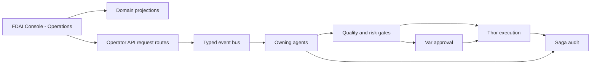

# Console Operations

This document defines how the existing FDAI Console presents operational work and accepts bounded
operational requests. It does not introduce another application, a generic work-item model, or a
second execution authority.

> **Product boundary:** The product remains `FDAI Console`. `Operations` is an existing navigation
> group inside that product. The console never receives Thor's executor identity or mutates a
> managed resource directly.
>
> **Implementation status:** The Operations navigation, incidents, approvals, processes, scheduler
> runs, provisioning, onboarding, and bounded investigations are shipped as separate domain views.
> Console action dispatch persists payload-bearing receipts before broker publication and recovers
> pending delivery after restart. Workflow approvals enforce their durable role and distinct quorum
> at both callback and conversation-tool boundaries. Pending access-grant review enforces App Role,
> no-self-approval, expiry, quorum, and exact revision without applying permission. The federated Tasks view, cross-domain
> projection metadata, and hardening of the remaining domain routes are proposed.

## Design at a glance

The Operations area reads existing domain projections and submits requests through the domain path
that already owns each schema and lifecycle. The responsible agents judge, approve, execute,
recover, and audit the request through typed events.

## Architectural decision

Console operations use four boundaries:

| Boundary | Responsibility | Authority |
|----------|----------------|-----------|
| Console presentation | Operations navigation, tasks, approvals, investigations, evidence, and timelines | Renders server-owned state and available operations. |
| Domain projections | Reads authoritative `Approval`, `Process`, `ReviewCase`, `AccessGrantRequest`, and action records | Read-only over each source lifecycle. |
| Operator API domain request routes | Authenticate, authorize, validate the source revision and domain schema, deduplicate, and publish | Accept a request; never decide or execute it. |
| Agent runtime | Judge, approve, execute, recover, and audit through typed pub/sub | Existing pantheon ownership remains authoritative. |

The Operator API remains a mechanical relay. It is the shared, non-privileged HTTP backend for
FDAI Console and operator clients. It does not become an orchestrator, a hidden agent, or a generic
workflow engine, and it never receives Thor's executor identity. Agents do not call each other
directly.

## Product vocabulary

Use one product name and plain operational labels:

| Scope | Term |
|-------|------|
| Product | `FDAI Console` |
| Shared HTTP backend | `Operator API` |
| Existing navigation group | `Operations` / `운영` |
| Human-facing action | Operational request / 운영 요청 |
| Operations views | Tasks, Approvals, Investigations |
| ActionType request origin | `trigger_kind: operator_request` |

Avoid `Operator Workbench`, a second `Operator Console`, `Command Center`, and `Orchestration` as
names for this surface. Feature-specific tools such as the Python task workbench can keep their
tool-shaped names.

## Existing ontology and schemas

### Domain records

Operations reuses existing objects and links:

| Operational concern | Authoritative objects and links | Console behavior |
|---------------------|---------------------------------|------------------|
| Governed review | `Process -> runs_review -> ReviewCase -> resolved_by -> Decision` | Shows review state, prior decisions, evidence, and the next accountable owner. |
| Human approval | `ReviewCase -> has_approval -> Approval` and action-bound approvals | Shows quorum, no-self-approval state, deadline, and evidence. |
| Workflow run | `WorkflowDefinition`, `WorkflowBinding`, and `Process` | Shows immutable definition, current step, revision, target, and compensation state. |
| Access change | `AccessGrantRequest` | Streams eligible pending requests and shows the immutable authorization lifecycle without applying access. |
| Execution follow-up | `ActionRun`, rollback, and audit references | Shows outcome and recovery state without an execute-again shortcut. |
| Ownership handover | Operational-readiness `Process`, `ReviewCase`, `Approval`, and `Decision` | Reuses the existing handover workflow; Saga remains the auditor. |

Do not add a generic `WorkItem`, `OperationRequest`, duplicate `Approval`, universal mutable status
table, or new approval topic. Each source keeps its own schema, revision, lifecycle, and owner.

For a browser-visible pending access request, an authenticated GET-only stream filters the durable
records by the principal's App Roles. When the tab and Command Deck are idle, the console opens a
request-scoped conversation with the capability, scope, and expiry. Active work, an unsent draft,
or a hidden tab keeps a visible badge instead of switching conversations. The badge opens a review
panel where an eligible principal can approve or reject the exact projected revision with a required
reason. The receipt says that review does not apply permission and that a fresh probe remains
required. Protected deployment, fresh access verification, and revocation remain separate steps in
the authorization workflow.

The authenticated `GET /incidents/stream` route projects up to 50 active incidents from the durable
incident read model. A newly observed active incident starts an incident-bound conversation when
the tab and Command Deck are idle. Active work, an unsent draft, or a hidden tab keeps an
active-incident badge instead. Reconnect rebuilds the snapshot from durable state instead of
depending on a transient agent-activity frame. The browser sends only the incident and correlation
selectors; the server re-resolves that binding before it can support an answer.

### Operations task view

The Tasks view is a presentation-level federation, not an ontology object or system of record. It
can group source-specific projections by status, owner agent, assignee, deadline, priority, and
scope. Each item retains its exact source reference, source revision, evidence references,
freshness, and redaction state.

Implement the API response as a discriminated union of existing domain projections. A projection
cache may store rebuildable output, but cache loss cannot lose work or change a source lifecycle.
The browser does not infer missing state or authorization.

The closed discriminator is `source_family` with initial values `approval`, `process`,
`review_case`, and `access_request`. Every arm carries `source_id`, `source_revision`, exact
`type_ref` (`name`, `version`, `catalog_digest`), `ontology_release_digest`, `as_of`, and its source
watermark before domain fields. Adding a family requires a paired design and decoder change; it
does not create a shared mutation schema.

Phase 1 introduces `rule-catalog/schema/console-operations-projection.schema.json` as the versioned
machine source for every arm, unavailable receipt, and freshness ceiling. Muninn is accountable;
FDAI maintainers review schema changes. Server and generated client digests must match in CI.

That schema also declares each family's bounded `freshness_ceiling_seconds`, hard item limit,
maximum link-traversal depth, stable primary-key ordering, and allowed truncation reasons. A missing
or unbounded value is rejected; pagination cannot change cutoff, ordering, or source watermarks.

Each source agent remains the single writer of its authoritative record. Muninn is accountable for
the rebuildable cross-domain context index, its cutoff, freshness, digest, and rebuild evidence.
The Operator API materializer is a mechanical relay that reads source-owned state and Muninn's index;
it never publishes a source object or advances a lifecycle.

Any server cache is an optional provider behind the materializer, keyed by the complete canonical
digest inputs and storing immutable projection bytes. A miss or eviction re-reads authoritative
sources; TTL never establishes freshness, and cached bytes never authorize a request. Deployments
without that provider materialize per request with the same limits and digest contract.

### Ontology query strategy

Materialize bounded `ObjectSet` definitions for each source family at an explicit `as_of` cutoff,
then join only declared links. Preserve the ontology release digest, source watermarks, cutoff,
truncation reason, redaction summary, and freshness state. Do not expose free-form graph queries to
the browser.

If a source family is unavailable, unauthorized, timed out, or behind its freshness ceiling, its
projection returns an explicit unavailable receipt with source, reason, last successful watermark,
and retry guidance. It never substitutes a stale cache as current or infers missing objects. Other
source families may remain visible, but requests that depend on the unavailable source are disabled
server-side until authoritative state can be re-read.

Each route-inventory row declares a closed `required_source_families` set. The server enables that
operation only when every required family is `available` at the request's cutoff and its exact
revision can be re-read. An undeclared dependency fails the inventory gate rather than defaulting
to available.

Each union arm carries `availability: available | unavailable`. An unavailable arm retains its
`source_family` and exact refs, omits domain data, and adds `reason: unauthorized | timeout |
source_unavailable | freshness_exceeded`, nullable `last_successful_watermark`, and nullable bounded
`retry_after_seconds`. Unknown reasons fail decoding instead of becoming an empty source.

## Operational requests

### Reuse domain request schemas

There is no universal request schema. Each operation uses the schema and route owned by its domain:

| User operation | Existing domain path |
|----------------|----------------------|
| Decide an approval | Approval decision schema and Var-owned approval lifecycle |
| Start an investigation | Existing investigation request schema and typed ingress path |
| Create a catalog or workflow draft | Existing draft schema and GitHub App delivery path |
| Request access | `AccessGrantRequest` schema and authorization workflow |
| Advance a process | Transition defined by the referenced `WorkflowDefinition` and current `Process` revision |
| Request an ActionType | Existing action argument schema with `trigger_kind: operator_request` or `both` |

`operator_request` describes who initiated an ActionType request. It is not a product name, API
umbrella, or replacement for domain schemas.

For the ActionType path, `ActionType.trigger_kind.kind` declares whether the action accepts
`operator_request` or `both`; it is not an event field. The runtime ingress record instead carries
`event_type: operator_request` and the strict boolean `operator_initiated: true`. Event ingest
validates those flat fields, then builds the canonical nested `payload.operator_request` consumed
by the control loop and action builder. Extensions publish through this normalizer and never write
the nested trusted shape directly. Other domain requests retain their own event contracts.

The untrusted flat ingress also carries `initiator_principal`, `action_type`, `params`,
`resource_ref`, `correlation_id`, and `idempotency_key`; unknown fields are rejected. The request
route creates this flat record. `fdai.core.event_ingest` alone validates and normalizes it before
Huginn republishes the owned `Event`. The nested shape is not accepted at an external boundary.

Workflow run context follows the same boundary. The route overwrites the requester with the
authenticated principal and accepts only parameter-substitution values. Approval, action outcome,
compensation, decision, parallel, requester, and wait namespaces are reserved for server-owned
Process evidence and are rejected from HTTP input.

Exact Process resume uses `POST /workflows/{process_id}/resume` with no request body. The Operator
API reloads the durable Process snapshot and creation evidence instead of accepting workflow,
target, trigger, mode, correlation, or context from the caller. Contributor capability is required
for every resume. The route repeats Owner and current enforce-allowlist checks for an enforce
Process before it lets the workflow runtime advance the source lifecycle. Unknown Process ids
return `404`; incomplete or inconsistent resume evidence returns a typed `409` conflict.

Safe Process cancellation uses `POST /workflows/{process_id}/cancel` with no request body.
Contributor can cancel shadow work, while an enforce Process requires Owner. Removing an enforce
allowlist entry doesn't block cancellation because cancellation cannot start new forward work. The
server accepts the command only from a durable `pending` or `waiting` boundary, records the actor
and cancellation intent, closes pending human-approval slots, reconciles an already-dispatched
action, and then cancels or compensates through the workflow owner. A `running` Process returns a
typed `409 process_not_at_safe_boundary` instead of guessing that dispatch is idle.
Local and deployed Operator API factories register start, exact resume, and safe cancellation from
the same `WorkflowExecutionConfig`; route inventory tests prevent either profile from omitting one.

### Request checks

Every domain route repeats the checks appropriate to its source:

1. Verify the Entra token, audience, App Roles, and required capability.
2. Load the authoritative source and compare its revision, deadline, and relevant policy digest.
3. Validate the domain schema and reject unknown fields.
4. The route prechecks scope, purpose, no-self-approval, and quorum eligibility. Final enforcement
  belongs to Var for `Approval`, Forseti for `ReviewCase`/`Decision`, the current step owner for
  `Process`, and `AccessGrantRequestService` for grant review; a requester never satisfies quorum.
5. Record the actor, correlation id, idempotency key, and audit or outbox receipt atomically.
6. Return request acceptance, conflict, denial, or expiry. Do not claim execution at request time.
7. Publish the typed event for the owning agent to process.

Acceptance always creates the typed outbox receipt described below. A refusal, expired request,
idempotency collision, or precondition conflict creates a Saga `AuditEntry` with stable reason,
actor, source ref, intent digest, and correlation id but no outbox row. Terminal agent outcomes
link back to either record through the same correlation and idempotency key.

### Conversational action evidence

Action lifecycle questions remain read-only. The request may carry `conversation_context.kind:
action` with a correlation id and one exact action, approval, or idempotency selector. The server
re-resolves every supplied selector against the audit ledger and uses the pending approval store
only to derive canonical identities. Reader-facing answers render audit-backed proposal, safety,
approval state, execution, effect verification, and duplicate receipts; they never expose pending
approval detail or execute a change. Receipt claims require the same action id and idempotency key
on the terminal row. Missing, conflicting, truncated, or audit-free context remains unverified.

The HIL callback requires a signed role set that grants `approve-runtime-hil` before either the
coordinator or registry path records a decision. Missing roles grant no authority. Pending lookup
uses the exact approval id, and decision recording uses the exact idempotency-key park instead of a
bounded queue scan. The no-self-approval and separation-of-duty checks remain authoritative.

For a human operation, `actor` and `initiator_principal` are the verified operator OID from that
request's Entra token. A console service principal, relay identity, or Thor workload identity cannot
stand in for the human. Machine-initiated requests use a separate domain route and workload
principal contract rather than impersonating an operator.

Retries reuse the same idempotency key. A concurrent transition returns the latest source revision.
No route imports an agent implementation, calls Thor directly, or writes another owner's state.

Conflict responses use a stable problem detail with `kind` (`idempotency_collision`,
`stale_revision`, `competing_decision`, `prior_deny`, or `expired`), `retriable`, current source
reference and revision, winning receipt when one exists, and next allowed transition. The browser
never invents retry guidance from an HTTP status alone.

### Delivery durability

The shipped console action route atomically claims the idempotency key and stores the complete
proposal, intent digest, actor, correlation, and audit receipt before broker publication. Delivery
uses a bounded lease, publish timeout, retry delay, and batch size. Startup and periodic recovery
resume pending or expired-lease records. A failed periodic cycle is logged and retried, while
shutdown cancels in-flight recovery and leaves its lease reclaimable. Downstream consumers still
deduplicate the at-least-once event by its stable idempotency key.

Request acceptance uses HTTP `202 Accepted` only after the durable record commits. The current
receipt returns `request_id`, `correlation_id`, `dispatch_status`, `accepted_at`, and
`durably_queued`; it means "durably queued", never "approved" or "executed". A same-intent replay
reuses the record without republishing a completed event. A different intent under the same key
returns `409 Conflict` with the winning request, correlation, and acceptance time. A status URL and
the remaining shared receipt fields stay Phase 2 work.

Confirmed incident creation prepares its ticket dispatch in a blocked durable state before writing
the incident. The dispatch activates only after `incident.open` appears in durable audit. Recovery
activates a missing ticket effect without recreating the incident. A blocked ticket with no durable
incident is auditably abandoned after the configurable retention period, 24 hours by default, and
is never published.

The intent digest covers the principal, domain operation, exact source reference and revision,
normalized arguments, and applicable policy or schema version. Reusing an idempotency key with a
different digest returns `409 Conflict`, emits an audit finding, and publishes no event. Keys are
namespaced by operator and compared by intent digest; an oversized operator/client namespace uses
its complete SHA-256 instead of truncation. Unrelated principals cannot observe or collide with
another receipt.

The policy digest canonically orders the exact risk, approval, promotion, exemption or override,
scope, and schema references actually consulted for the request; an unused policy is excluded.

Any prior-deny or re-request policy lookup returns an authoritative revision that is bound into the
claim. The transaction or compare-and-set that commits the request rechecks that revision; a new
deny or policy change returns conflict and writes no outbox row. A preflight read alone never
authorizes publish.

That claim binds one precondition snapshot: source revision, current decision or lifecycle state,
deadline, policy digest, schema version, and applicable approval revision. Commit succeeds only if
every value still matches and the deadline remains open; otherwise it returns a typed conflict and
performs no audit acceptance or outbox write.

## Agent and execution authority

The console has no judgment or managed-resource execution authority. The pantheon retains its
fixed responsibilities:

| Work | Accountable agent |
|------|-------------------|
| Normalize and correlate a new operator signal | Huginn |
| Judge a review or proposed action | Forseti |
| Record an eligible human approval | Var |
| Execute a promoted managed-resource action | Thor |
| Recover or roll back a failed action | Vidar |
| Append terminal evidence | Saga |
| Build replayable context from source records | Muninn |
| Explain results in the operator's locale | Bragi |
| Learn from audited outcomes off-path | Norns and Mimir |

Thor can use a privileged workload identity for an eligible `direct_api`, `pr_native`, or
`tool_call` execution path. That execution still requires the ActionType to be registered and
promoted, pass quality and risk checks, satisfy approval policy, hold its resource lock, complete
dry-run checks, enforce impact limits and stop conditions, preserve idempotency, and emit rollback
and audit evidence. The signed-in human identity is never delegated to Thor.

Those safety values come from the exact `ActionType`, immutable `MutationPlan`, and unified
execution model. Console schemas may display their resolved values but cannot supply, relax, or
override them. A missing exact reference, plan digest, stop condition, impact limit, lock scope, or
rollback contract makes the request ineligible for execution.

## Console shape

The current `Operations` navigation group remains the single product surface. Add or refine these
views without creating another shell:

- **Tasks:** Federated attention list over source-specific projections.
- **Approvals:** Existing approval queue with quorum, deadline, evidence, and decision controls.
- **Investigations:** Existing bounded read-investigation requests and outcomes.
- **Operational detail:** Source timeline, evidence, owner agent, freshness, and available domain
  operations.

Server state determines which operations are available. The browser may hide unavailable controls
for usability, but every submission repeats authorization and revision checks. SSE can invalidate
affected source references so the client refetches authoritative state.

An SSE invalidation frame contains `event_id`, `source_family`, opaque `source_id`,
`source_revision`, and `as_of`, never records, operations, or identity details. The server closes the
stream no later than token expiry. The client obtains a new token and reconnects with the
Authorization header plus the last event id; reconnect repeats all authorization checks and a gap
forces authoritative refetch. SSE is a refresh hint only and never authorizes a request.

Issuer and tenant checks mean exact validation against the deployment's configured Entra tenant
issuer and API audience. A guest must still present a token issued by that home tenant. Common,
organizations, foreign-tenant, and issuer-mismatched tokens fail closed before role resolution;
neither request nor stream state is shared across tenant boundaries.

Phase 2 multi-effect requests never collapse partial success into one `submitted` result. Each
effect declares `effect_id`, `kind`, `required`, `status: pending | accepted | succeeded | failed`,
nullable receipt and reason, and retry count under one parent correlation. The parent is terminal
only when every required effect is terminal; any required failure makes it `degraded`. Incident
creation and ticket proposal migrate from their shipped collapsed flags to this shape, and durable
reconciliation resumes only the missing effect without recreating the incident.

Bulk requests wait until a domain workflow defines atomicity or bounded partial failure, impact
limits, and rollback behavior.

## Delivery plan

### Phase 0 - inventory existing paths

Catalog each current console write route, source schema, owner, capability, revision, idempotency
rule, receipt, and identity dependency. Classify it as query, simulation, approval, operational
request, execution, or break-glass. From the first shipped route, browser-Entra local and deployed
use the same schema, authorization, and source binding; fixture principals remain pytest-only.

Exit criteria: every shipped request has one domain schema, owner, capability, idempotency rule,
and audit path. A machine-readable route inventory records method and path, classification, schema,
source owner, capability, revision rule, idempotency scope, receipt, audit event, and owning test.
A diff gate fails when a console route is missing, duplicated, or classified as execution; direct
managed-resource execution is not a supported console classification.

### Phase 1 - compose Operations projections

Project `ReviewCase`, `Approval`, `Process`, and `AccessGrantRequest` into source-specific task
views. Add exact references, evidence, freshness, cursor pagination, unavailable states, and
redaction tests. Emit materialization age and source-watermark lag from the first projection.

Exit criteria: rebuilding projections at the same cutoff produces the same views, and no source
lifecycle depends on the projection. Each materialization records one canonical digest over the
ordered redacted output, ontology release, `as_of` cutoff, source watermarks, applied limits, and
truncation reason. A cache-loss drill deletes only rebuildable projection state and proves that the
same inputs reproduce the same digest while a changed watermark produces a new snapshot.

### Phase 2 - harden domain requests

Standardize revision checks, idempotency, receipts, and outbox behavior without replacing domain
schemas. Test stale state, duplicate submission, self-approval, expiry, role changes, and process
restart. Run the same route inventory and authorization matrix in browser-Entra local and deployed
composition, without fixture principals. Count all request and delivery outcomes in both venues.

The Console action durability slice is shipped. Phase 2 extends the same contract to the remaining
domain routes and replaces the incident response's collapsed ticket flag with typed effects.

Exit criteria: the SPA contains no authorization decision and no accepted request bypasses its
source owner. Failure injection before publish, after publish, and before response proves that a
committed request is never lost and its event is never applied twice.

An authorization-boundary matrix covers every inventory row with unauthenticated, unassigned,
Reader, Contributor, Approver, Owner, and BreakGlass principals as applicable. It also exercises
self-approval, insufficient quorum, stale revision, expired deadline, wrong scope, changed role,
and revoked entitlement. Adding a request route without its matrix row blocks the change.

### Phase 3 - complete Operations views

Add Tasks, Approvals, Investigations, timeline, evidence, and source-specific recovery to the
existing shell. Stale revision reloads authoritative state; a competing decision links its winner;
expiry or denial explains the next allowed transition. Only a changed intent receives a new key.

Tasks, filters, details, and recovery are fully keyboard operable. Status and authority never rely
on color alone; source, deadline, and unavailable reason have accessible names. SSE refreshes use
one polite status announcement without moving focus, while submit conflicts focus the actionable
summary and return focus to the originating control after dismissal.

Exit criteria: operators can complete each supported human step in FDAI Console, while every
managed-resource mutation appears only as a later Thor `ActionRun`. Conflict, retry, compensation,
and rollback drills preserve the original receipt and link every superseding outcome.

### Phase 4 - optimize from measurements

Add cross-device saved views or bulk requests only after measured demand and a domain safety
contract exist. Track queue age, decision latency, conflict rate, duplicate suppression, overdue
work, projection freshness, and request-to-terminal-outcome latency; set alerts from measured baselines.

Exit criteria: a reviewed baseline window and minimum sample floor are frozen per source, every
metric has bounded labels, and alert fire/recovery is exercised. An optimization first runs in
shadow against the same scenario set and advances only when its target metric improves without
regressing denial escapes, duplicate application, rollback, or unavailable-source rates.

## Rejected alternatives

- **Separate operations app:** Duplicates FDAI Console and suggests a second product.
- **Authoritative generic `WorkItem`:** Duplicates domain lifecycle and creates a second owner.
- **Generic `OperationRequest`:** Erases domain validation and ownership differences.
- **Console orchestration:** Misrepresents event choreography as central console control.
- **Browser-derived authority:** Makes stale presentation state an authorization source.
- **Console or request route with executor credentials:** Collapses request and execution identity.
- **Direct graph mutation:** Bypasses ActionType, risk, approval, rollback, and audit gates.

## Related docs

| To learn about | Read |
|----------------|------|
| Conversational translation and channel tools | [Operator Console](operator-console.md) |
| Human roles and operation capabilities | [User RBAC and Entra Identity](user-rbac-and-identity.md) |
| Exact ontology releases and object sets | [Operating Ontology Platform](../architecture/operating-ontology-platform.md) |
| ActionType safety and execution ceilings | [Action Ontology](../decisioning/action-ontology.md) and [Execution Model](../decisioning/execution-model.md) |
| Fixed pantheon ownership | [Agent Pantheon](../agents/agent-pantheon.md) |
| Operational-readiness handover | [Operational Readiness](../operations/operational-readiness.md) |
| Human assignment delivery | [Human-Agent Assignment Implementation Plan](human-agent-assignment-implementation-plan.md) |
