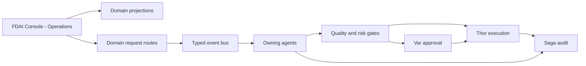

# Console Operations

This document defines how the existing FDAI Console presents operational work and accepts bounded
operational requests. It does not introduce another application, a generic work-item model, or a
second execution authority.

> **Product boundary:** The product remains `FDAI Console`. `Operations` is an existing navigation
> group inside that product. The console never receives Thor's executor identity or mutates a
> managed resource directly.
>
> **Implementation status:** The Operations navigation, incidents, approvals, processes, scheduler
> runs, provisioning, onboarding, and bounded investigations are shipped as separate domain views.
> The federated Tasks view, cross-domain projection metadata, and shared request hardening gates in
> this document are proposed. A target-phase statement never implies that its API or UI is live.

## Design at a glance

The Operations area reads existing domain projections and submits requests through the domain path
that already owns each schema and lifecycle. The responsible agents judge, approve, execute,
recover, and audit the request through typed events.

## Architectural decision

Console operations use four boundaries:

| Boundary | Responsibility | Authority |
|----------|----------------|-----------|
| Console presentation | Operations navigation, tasks, approvals, investigations, evidence, and timelines | Renders server-owned state and available operations. |
| Domain projections | Reads authoritative `Approval`, `Process`, `ReviewCase`, `AccessGrantRequest`, and action records | Read-only over each source lifecycle. |
| Domain request routes | Authenticate, authorize, validate the source revision and domain schema, deduplicate, and publish | Accept a request; never decide or execute it. |
| Agent runtime | Judge, approve, execute, recover, and audit through typed pub/sub | Existing pantheon ownership remains authoritative. |

The API remains a mechanical relay. It does not become an orchestrator, a hidden agent, or a
generic workflow engine. Agents do not call each other directly.

## Product vocabulary

Use one product name and plain operational labels:

| Scope | Term |
|-------|------|
| Product | `FDAI Console` |
| Existing navigation group | `Operations` / `운영` |
| Human-facing action | Operational request / 운영 요청 |
| Operations views | Tasks, Approvals, Investigations |
| ActionType request origin | `trigger_kind: operator_request` |

Avoid `Operator Workbench`, a second `Operator Console`, `Command Center`, and `Orchestration` as
names for this surface. Feature-specific tools such as the Python task workbench can keep their
tool-shaped names.

## Existing ontology and schemas

### Domain records

Operations reuses existing objects and links:

| Operational concern | Authoritative objects and links | Console behavior |
|---------------------|---------------------------------|------------------|
| Governed review | `Process -> runs_review -> ReviewCase -> resolved_by -> Decision` | Shows review state, prior decisions, evidence, and the next accountable owner. |
| Human approval | `ReviewCase -> has_approval -> Approval` and action-bound approvals | Shows quorum, no-self-approval state, deadline, and evidence. |
| Workflow run | `WorkflowDefinition`, `WorkflowBinding`, and `Process` | Shows immutable definition, current step, revision, target, and compensation state. |
| Access change | `AccessGrantRequest` | Shows the immutable request and its existing authorization lifecycle. |
| Execution follow-up | `ActionRun`, rollback, and audit references | Shows outcome and recovery state without an execute-again shortcut. |
| Ownership handover | Operational-readiness `Process`, `ReviewCase`, `Approval`, and `Decision` | Reuses the existing handover workflow; Saga remains the auditor. |

Do not add a generic `WorkItem`, `OperationRequest`, duplicate `Approval`, universal mutable status
table, or new approval topic. Each source keeps its own schema, revision, lifecycle, and owner.

### Operations task view

The Tasks view is a presentation-level federation, not an ontology object or system of record. It
can group source-specific projections by status, owner agent, assignee, deadline, priority, and
scope. Each item retains its exact source reference, source revision, evidence references,
freshness, and redaction state.

Implement the API response as a discriminated union of existing domain projections. A projection
cache may store rebuildable output, but cache loss cannot lose work or change a source lifecycle.
The browser does not infer missing state or authorization.

The closed discriminator is `source_family` with initial values `approval`, `process`,
`review_case`, and `access_request`. Every arm carries `source_id`, `source_revision`, exact
`type_ref` (`name`, `version`, `catalog_digest`), `ontology_release_digest`, `as_of`, and its source
watermark before domain fields. Adding a family requires a paired design and decoder change; it
does not create a shared mutation schema.

Each source agent remains the single writer of its authoritative record. Muninn is accountable for
the rebuildable cross-domain context index, its cutoff, freshness, digest, and rebuild evidence.
The read API materializer is a mechanical relay that reads source-owned state and Muninn's index;
it never publishes a source object or advances a lifecycle.

### Ontology query strategy

Materialize bounded `ObjectSet` definitions for each source family at an explicit `as_of` cutoff,
then join only declared links. Preserve the ontology release digest, source watermarks, cutoff,
truncation reason, redaction summary, and freshness state. Do not expose free-form graph queries to
the browser.

If a source family is unavailable, unauthorized, timed out, or behind its freshness ceiling, its
projection returns an explicit unavailable receipt with source, reason, last successful watermark,
and retry guidance. It never substitutes a stale cache as current or infers missing objects. Other
source families may remain visible, but requests that depend on the unavailable source are disabled
server-side until authoritative state can be re-read.

## Operational requests

### Reuse domain request schemas

There is no universal request schema. Each operation uses the schema and route owned by its domain:

| User operation | Existing domain path |
|----------------|----------------------|
| Decide an approval | Approval decision schema and Var-owned approval lifecycle |
| Start an investigation | Existing investigation request schema and typed ingress path |
| Create a catalog or workflow draft | Existing draft schema and GitHub App delivery path |
| Request access | `AccessGrantRequest` schema and authorization workflow |
| Advance a process | Transition defined by the referenced `WorkflowDefinition` and current `Process` revision |
| Request an ActionType | Existing action argument schema with `trigger_kind: operator_request` or `both` |

`operator_request` describes who initiated an ActionType request. It is not a product name, API
umbrella, or replacement for domain schemas.

For the ActionType path, `ActionType.trigger_kind.kind` declares whether the action accepts
`operator_request` or `both`; it is not an event field. The runtime ingress record instead carries
`event_type: operator_request` and the strict boolean `operator_initiated: true`. Event ingest
validates those flat fields, then builds the canonical nested `payload.operator_request` consumed
by the control loop and action builder. Extensions publish through this normalizer and never write
the nested trusted shape directly. Other domain requests retain their own event contracts.

### Request checks

Every domain route repeats the checks appropriate to its source:

1. Verify the Entra token, audience, App Roles, and required capability.
2. Load the authoritative source and compare its revision, deadline, and relevant policy digest.
3. Validate the domain schema and reject unknown fields.
4. Apply scope and purpose checks. Every human decision that can authorize, advance, promote,
   grant, or execute the request applies no-self-approval and its declared quorum. A requester may
   submit evidence or cancel their own pending request but never satisfies its decision quorum.
5. Record the actor, correlation id, idempotency key, and audit or outbox receipt atomically.
6. Return request acceptance, conflict, denial, or expiry. Do not claim execution at request time.
7. Publish the typed event for the owning agent to process.

Retries reuse the same idempotency key. A concurrent transition returns the latest source revision.
No route imports an agent implementation, calls Thor directly, or writes another owner's state.

### Delivery durability

The shipped console action route publishes directly to the event bus; it does not yet persist a
durable outbox record in the same transaction as request acceptance. A process failure before or
during publish can therefore leave an ambiguous request. Until Phase 2 closes this gap, the route
must not claim durable acceptance or exactly-once submission.

The target path atomically claims the idempotency key, stores the intent digest and actor receipt,
and writes an outbox record before acknowledging acceptance. A retry reuses the stored receipt. A
relay publishes uncommitted outbox rows at least once and marks completion only after broker
acknowledgment; restart reconciliation resumes every uncompleted row.

Request acceptance uses HTTP `202 Accepted` only after the durable claim and outbox commit. Its
receipt contains `request_id`, `correlation_id`, `idempotency_key`, `intent_digest`, `accepted_at`,
and a status URL. It means "durably queued", never "approved" or "executed". A replay of the same
intent returns the original receipt; terminal outcome is available only from the owning domain
projection and audit trail.

The intent digest covers the principal, domain operation, exact source reference and revision,
normalized arguments, and applicable policy or schema version. Reusing an idempotency key with a
different digest returns `409 Conflict`, emits an audit finding, and publishes no event. Keys are
scoped to the authenticated principal and operation so unrelated users cannot observe or collide
with another principal's receipt.

Any prior-deny or re-request policy lookup returns an authoritative revision that is bound into the
claim. The transaction or compare-and-set that commits the request rechecks that revision; a new
deny or policy change returns conflict and writes no outbox row. A preflight read alone never
authorizes publish.

## Agent and execution authority

The console has no judgment or managed-resource execution authority. The pantheon retains its
fixed responsibilities:

| Work | Accountable agent |
|------|-------------------|
| Normalize and correlate a new operator signal | Huginn |
| Judge a review or proposed action | Forseti |
| Record an eligible human approval | Var |
| Execute a promoted managed-resource action | Thor |
| Recover or roll back a failed action | Vidar |
| Append terminal evidence | Saga |
| Build replayable context from source records | Muninn |
| Explain results in the operator's locale | Bragi |
| Learn from audited outcomes off-path | Norns and Mimir |

Thor can use a privileged workload identity for an eligible `direct_api`, `pr_native`, or
`tool_call` execution path. That execution still requires the ActionType to be registered and
promoted, pass quality and risk checks, satisfy approval policy, hold its resource lock, complete
dry-run checks, enforce impact limits and stop conditions, preserve idempotency, and emit rollback
and audit evidence. The signed-in human identity is never delegated to Thor.

## Console shape

The current `Operations` navigation group remains the single product surface. Add or refine these
views without creating another shell:

- **Tasks:** Federated attention list over source-specific projections.
- **Approvals:** Existing approval queue with quorum, deadline, evidence, and decision controls.
- **Investigations:** Existing bounded read-investigation requests and outcomes.
- **Operational detail:** Source timeline, evidence, owner agent, freshness, and available domain
  operations.

Server state determines which operations are available. The browser may hide unavailable controls
for usability, but every submission repeats authorization and revision checks. SSE can invalidate
affected source references so the client refetches authoritative state.

An invalidation stream carries opaque source references and revisions, not source records,
available operations, or identity details. Its maximum lifetime does not exceed the verified token
expiry. Reconnect repeats issuer, audience, tenant, role, and scope checks, so role revocation takes
effect without trusting browser state. SSE is a refresh hint only and never authorizes a request.

Issuer and tenant checks mean exact validation against the deployment's configured Entra tenant
issuer and API audience. A guest must still present a token issued by that home tenant. Common,
organizations, foreign-tenant, and issuer-mismatched tokens fail closed before role resolution;
neither request nor stream state is shared across tenant boundaries.

Multi-effect requests never collapse partial success into one `submitted` result. Incident creation
and ticket proposal, for example, retain separate effect ids, receipts, statuses, and retries under
one parent correlation. The parent is terminal only when every required effect is terminal. A
committed primary effect plus failed secondary publish is `degraded`, and durable reconciliation
resumes only the missing effect without recreating the incident.

Bulk requests wait until a domain workflow defines atomicity or bounded partial failure, impact
limits, and rollback behavior.

## Delivery plan

### Phase 0 - inventory existing paths

Catalog each current console write route, source schema, owner, capability, revision, idempotency
rule, receipt, and identity dependency. Classify it as query, simulation, approval, operational
request, execution, or break-glass.

Exit criteria: every shipped request has one domain schema, owner, capability, idempotency rule,
and audit path. A machine-readable route inventory records method and path, classification, schema,
source owner, capability, revision rule, idempotency scope, receipt, audit event, and owning test.
A diff gate fails when a console route is missing, duplicated, or classified as execution; direct
managed-resource execution is not a supported console classification.

### Phase 1 - compose Operations projections

Project `ReviewCase`, `Approval`, `Process`, and `AccessGrantRequest` into source-specific task
views. Add exact references, evidence, freshness, cursor pagination, unavailable states, and
redaction tests. Emit materialization age and source-watermark lag from the first projection.

Exit criteria: rebuilding projections at the same cutoff produces the same views, and no source
lifecycle depends on the projection. Each materialization records one canonical digest over the
ordered redacted output, ontology release, `as_of` cutoff, source watermarks, applied limits, and
truncation reason. A cache-loss drill deletes only rebuildable projection state and proves that the
same inputs reproduce the same digest while a changed watermark produces a new snapshot.

### Phase 2 - harden domain requests

Standardize revision checks, idempotency, receipts, and outbox behavior without replacing domain
schemas. Test stale state, duplicate submission, self-approval, expiry, role changes, and process
restart. Run the same route inventory and authorization matrix in browser-Entra local and deployed
composition, without fixture principals. Count all request and delivery outcomes in both venues.

Exit criteria: the SPA contains no authorization decision and no accepted request bypasses its
source owner. Failure injection before publish, after publish, and before response proves that a
committed request is never lost and its event is never applied twice.

An authorization-boundary matrix covers every inventory row with unauthenticated, unassigned,
Reader, Contributor, Approver, Owner, and BreakGlass principals as applicable. It also exercises
self-approval, insufficient quorum, stale revision, expired deadline, wrong scope, changed role,
and revoked entitlement. Adding a request route without its matrix row blocks the change.

### Phase 3 - complete Operations views

Add Tasks, Approvals, Investigations, timeline, evidence, and source-specific recovery to the
existing shell. Stale revision reloads authoritative state; a competing decision links its winner;
expiry or denial explains the next allowed transition. Only a changed intent receives a new key.

Exit criteria: operators can complete each supported human step in FDAI Console, while every
managed-resource mutation appears only as a later Thor `ActionRun`. Conflict, retry, compensation,
and rollback drills preserve the original receipt and link every superseding outcome.

### Phase 4 - optimize from measurements

Add cross-device saved views or bulk requests only after measured demand and a domain safety
contract exist. Track queue age, decision latency, conflict rate, duplicate suppression, overdue
work, projection freshness, and request-to-terminal-outcome latency; set alerts from measured baselines.

## Rejected alternatives

- **Separate operations app:** Duplicates FDAI Console and suggests a second product.
- **Authoritative generic `WorkItem`:** Duplicates domain lifecycle and creates a second owner.
- **Generic `OperationRequest`:** Erases domain validation and ownership differences.
- **Console orchestration:** Misrepresents event choreography as central console control.
- **Browser-derived authority:** Makes stale presentation state an authorization source.
- **Console or request route with executor credentials:** Collapses request and execution identity.
- **Direct graph mutation:** Bypasses ActionType, risk, approval, rollback, and audit gates.

## Related docs

| To learn about | Read |
|----------------|------|
| Conversational translation and channel tools | [Operator Console](operator-console.md) |
| Human roles and operation capabilities | [User RBAC and Entra Identity](user-rbac-and-identity.md) |
| Exact ontology releases and object sets | [Operating Ontology Platform](../architecture/operating-ontology-platform.md) |
| Fixed pantheon ownership | [Agent Pantheon](../agents/agent-pantheon.md) |
| Operational-readiness handover | [Operational Readiness](../operations/operational-readiness.md) |
| Human assignment delivery | [Human-Agent Assignment Implementation Plan](human-agent-assignment-implementation-plan.md) |
